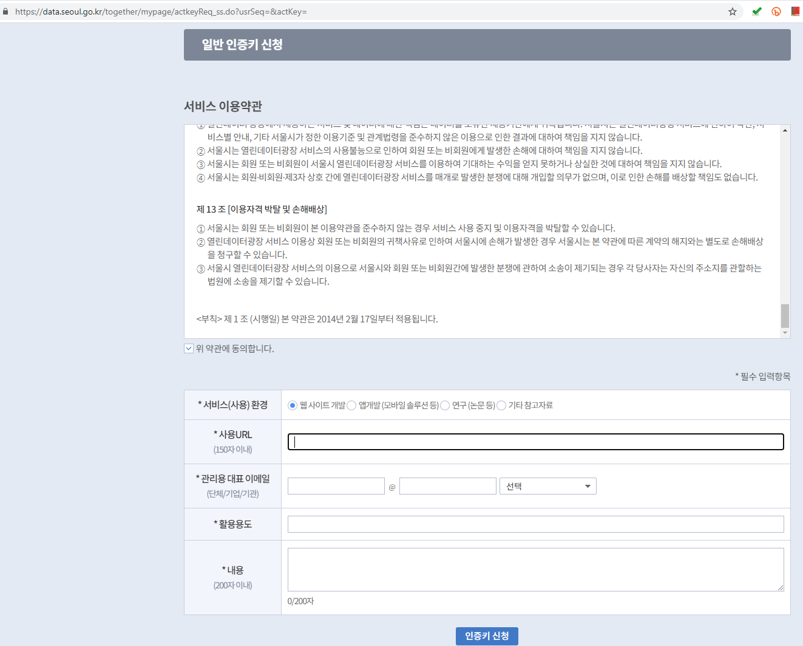
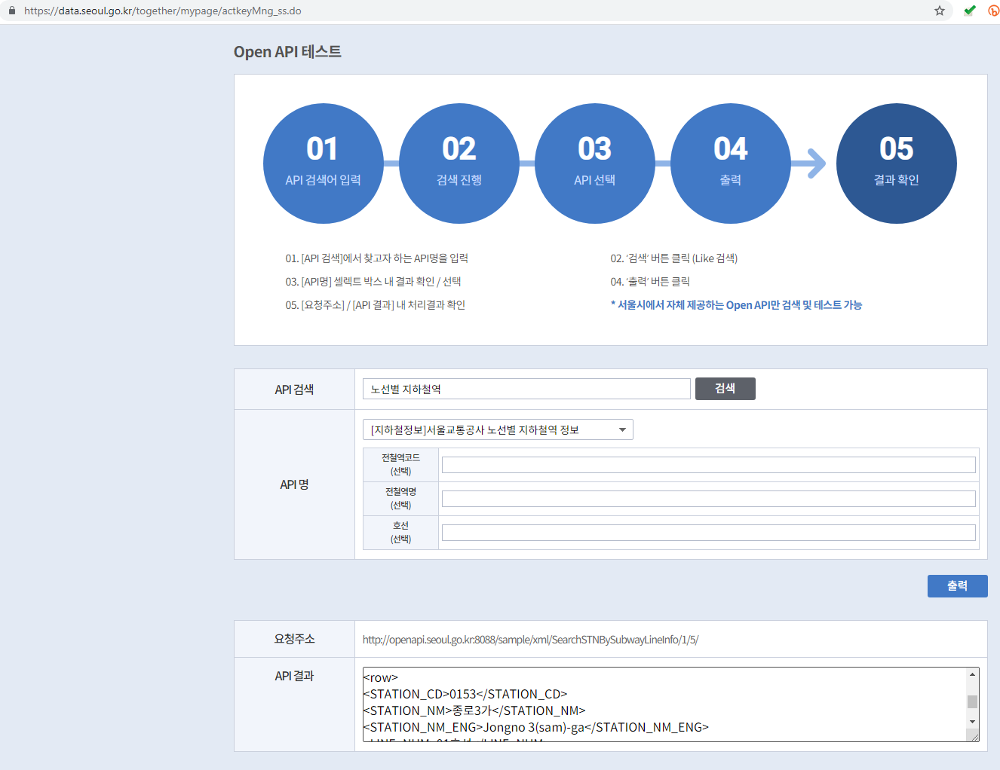
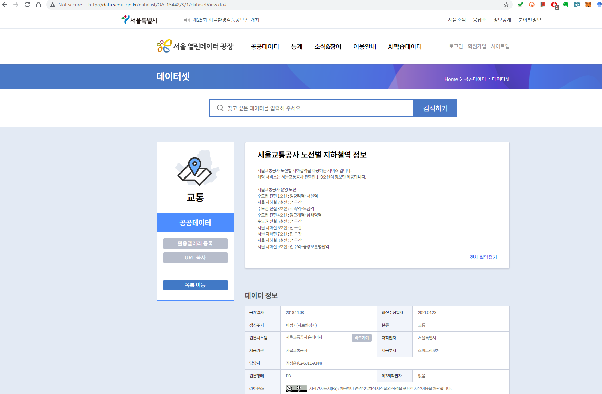
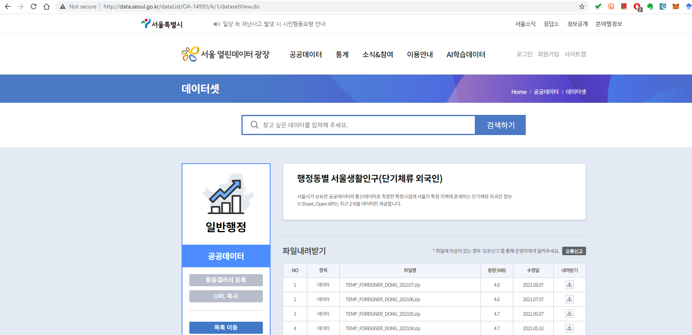
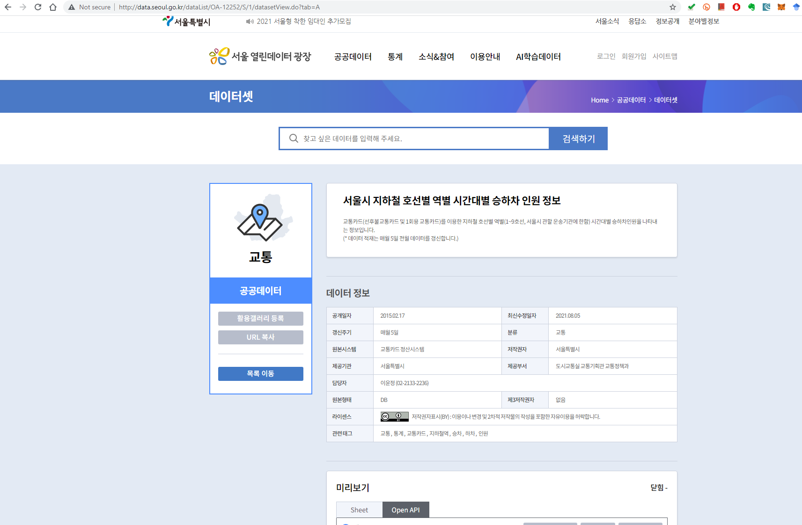
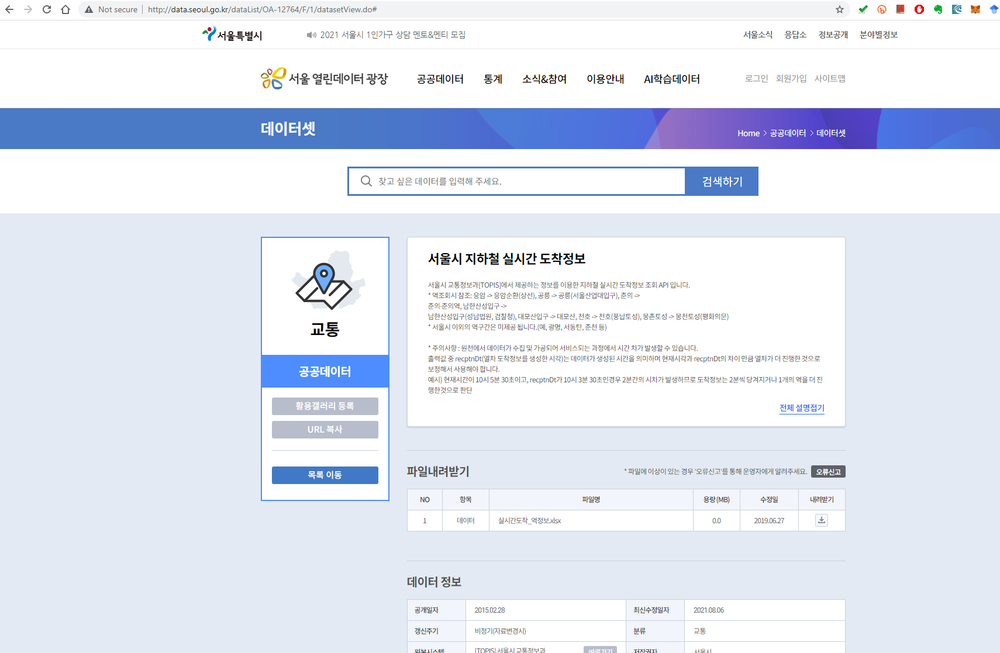

# 오픈 데이터

Last Updated: 08202021 Ghana 04152017

## O.1 학습내용

### O.1.1 목표

* 오픈 API를 사용하여 열린데이터, 공공데이터를 가져올 수 있다.
* XML, JSON 형식의 데이터를 파싱하여 원하는 데이터를 추출할 수 있다.
* 데이터를 NoSql, 파일로 저장할 수 있다.

### O.1.2 목차

* O.2 오픈 데이터
* O.3 오픈 API
* O.4 API 연습: curl, requests, POST, HEAD
* O.5 많이 쓰이는 웹데이터 형식
    * O.5.1 XML
    * O.5.2 JSON
* 문제 1: IP 주소에서 지역정보 알아내기
* O.6 공공데이터
    * O.6.1 인증키
    * O.6.2 키를 파일로 저장하고 읽는 자신의 라이브러리 만들기
* 문제 2: 서울시 지하철역 정보 수집
* 문제 3: 행정동별 서울생활인구(단기체류 외국인)
* 문제 4: 서울시 지하철역별 월별 승하차인원 구하기
* 문제 5: 서울시 지하철 호선별 역별 시간대별 승하차 인원 정보
* 문제 6: 지하철역 승하차 인원
* 문제 7: 버스 승하차 인원 월별 정류장별 인원
* 문제 8: 서울시 종로구 관측소 현재 온도, 습도, 강수량 구하기
* 문제 9: 서울시 골목상권 분석
* 문제 10: 공공데이터포털 서울시 구별 교통사고 사망자 수 구하기
* 문제 11: 공공데이터포털 대기 오염 정보
* 문제 12: 공공데이터포털 서울특별시교육청 공공도서관 소장도서정보
* 문제 13: 주식 데이터 읽기


## O.2 오픈 데이터

'오픈 데이터'는 어떤 업무가 수행되고, 생성된 결과로서 외부에 개방되는 데이터를 말한다. 
공공기관에서 생성이 되면 '**공공데이터**'라고도 하며,
우리 나라에서는 2013년 '**공공데이터의 제공 및 이용활성화에 관한 법률**'을 시행하여,
공공 정보를 외부에 개방하는 공공데이터 정책을 펴고 있다.
그렇다고 해서 공공기관만 오픈 데이터를 제공하는 것은 아니다.
구글, 네이버나 다음과 같은 포덜, 트위터, 페이스북 등 비공공기관에서도 
외부에 데이터를 개방하고 있다.

'오픈 데이터'는 일반적인 데이터와 달리 '열린' 또는 '오픈'이라는 점에서 차이가 있다.
'열린'의 의미를 이해하려면, 오래 전부터 그 용어를 써오고 있는 '오픈소프트웨어'를 참고할 필요가 있다.
'**오픈소프트웨어**'는 소스코드가 공개되어 누구나 사용할 수 있는 '오픈소스 라이선스'를 충족하는 소프트웨어를 말한다.
오픈이란 누구나 볼 수 있는 공개에서 더 나아가, 라이선스가 공개되어 있다는 뜻이다.
저작권에 묶여 있어 사용이 제한되어 있지 않다.
Open Knowledge Foundation은 오픈이란 "**출처와 개방성 유지를 위한 수단을 최대 조건으로 누구나 자유롭게 접근, 사용, 변경, 공유**할 수 있을 때, 지식은 열려있다"고 정의 하고 있다 (http://opendefinition.org/).
즉  누구나 원하는 내용을 자유롭게 사용하고, 수정하고, 공유할 수 있다는 의미이다.
'오픈데이터'는 이러한 오픈의 특징을 가지고 있는 데이터를 말한다.

## O.3 오픈 API

원하는 데이터를 찾았다고 하자. 그러한 데이터는 보통 내려받기를 한다.
반면에 프로그래밍을 통해 가져올 수 있도록 하는 경우도 있다.
즉, API, Application Programming Interface를 통해서 필요한 데이터가 자유롭게 사용될 수 있도록 개방하는 것이다.
API는 자신의 애플리케이션에서 다른 애플리케이션의 함수를 호출하여, 데이터를 가져오거나 실행 결과를 활용할 수는 인터페이스이다.
단순하게 말하면 **URL과 함수 및 그 함수호출에 필요한 패러미터**로 구성된다.
프로그램에서 API를 사용하면, 이미 완성되고 검증된 함수를 활용할 수 있기 때문에 시스템을 완성하는데 매우 유용하다.
우리나라 포털뿐만 아니라 트위터, 페이스북, 한국 포털이 API를 통해서 데이터를 제공하고 있고, 그 추세는 늘어날 것이다.
뉴스, 사진 또는 다른 앱에서 그 내용을 누구나 쉽게 다른 사람에게 공유할 수 있게 되었는데, 이는 API 때문이다.
SNS가 스마트폰에서 편리하게 사용되게된 이유로 API를 빼놓을 수가 없다.
트위터가 API를 공개해서 실시간 채팅이라는 자신의 기능을 널리 퍼뜨리게 된 계기가 되었다.
자신의 API를 공개하면 얼핏 손해라고 볼 수 있지만 자신의 API에 의존하는 기반을 늘리는 효과를 가져올 수 있다.

Open API는 오픈에 따라 라이선스가 풀려서 오픈 데이터를 누구나 (보통 개발자) 사용할 수 있도록 제공되는 표준화된 API를 말한다.
Open API는 보통 웹에서 제공되는데, 이를 Web API라고 한다. HTTP 프로토콜에 따라 API가 제공된다.
API는 **REST** (REpresentational State Transfer) 방식으로 제공되는 경우가 많다.
REST는 '웹서비스'를 제공하는 아키텍처를 말한다.
'웹서비스'는 HTTP 프로토콜을 통하여 서비스, 자원을 가져오거나 저장하는 기능이다.
**SOAP** (Simple Object Access Protocol) 보다는 REST가 간편하여 많이 사용된다.


### REST API

넓게 보면 RESTful API도 웹스크레이핑이라고 볼 수 있다.
그러나, 웹스크레이핑은 HTML 페이지를 대상으로 한다면, REST는 그 대상이 페이지가 아니라 데이터, 자원 resource이다.
물론 웹스크레이핑과 달리, REST는 공식적으로 제공하는 API를 사용한다는 차이가 있다.
* REST의 API.
    * HTTP Requests와 Responses를 사용하여 데이터를 가져온다.
    * **URI, 자원 ID, HTTP 방법 (POST, DELETE, GET, PUT)을 명시**하여 자원 Resource를 읽어 온다.
    * '자원'은 REST를 사용해서 가져올 수 있는 데이터로 HTML 페이지, XML, Videos 등을 말한다.
    * 데이터는 표현한다는 의미로 Representations이라고 하며 주로 **JSON**, **XML**을 많이 쓰고 있다.
    * 자원은 URI 주소 방식에 따라 지정할 수 있다. 뒤에 Query Parameter를 추가할 수 있다. URI를 'endpoint'라고 한다.

```
http://www.example.com/myresource/1?param1=value1
```

대량 데이터를 가져오는 경우, 연속적 수행에 필요한 pagination, 정해진 데이터 한도 rate limit를 주의한다.
HTTP 프로토콜과 같이 상태를 보관하지 않는 특성을 가진다 (stateless).

### REST API 주요 기능

주요 HTTP Methods, 기능을 간략하게 보면:

함수 | 설명
-----:|:-----|
GET | 특정 항목을 읽어오는 경우 사용. cache로 저장하고, 뒤로 가기를 할 수 있다. ```http://.../index.html?key1=value1&key2=value2```
POST | 새로운 자원을 입력, 갱신 (엎어쓰기). cache로 저장되지 않아 뒤로 가기를 할 수 없다. PUT과 달리 idempotent가 아니다. 여러 번 수행하면 id가 자동 생성되는 것과 같이 여러 레코드가 생성된다. 예: ```INSERT INTO student(name, major) VALUES ("js", "software")```
HEAD | GET을 수행하지만, body를 가져오지 않고 headers만 읽는 경우 사용한다.
PUT | POST와 비슷한 기능. 여러 번 실행되어도 변화가 없다. 즉, idempotent, 여러 번 수행해도 같은 id로 수행되기 때문에 변화가 없다. 예: ```UPDATE student SET major = "software" where id="201711111"```
DELETE | 자원을 삭제하는 기능
CONNECT | 클라이언트와 서버의 TCP/IP tunnel을 만드는 기능

> idempotence 멱등법칙

> 동일한 항목에 같은 기능이 여러번 실행되어도 값이 변하지 않고 동일하게 유지된다는 의미.

## O.4 API 연습

REST API를 테스트하려면, 웹 애플리케이션이 구축되어 있어야 가능하다.
[httpbin](https://github.com/Runscope/httpbin) 사이트는 API를 테스트하기 편리한 사이트이다. 모든 endpoint 결과는 JSON으로 반환된다.

API를 호출하기 위해서는 널리 쓰이고 있는 curl과 Python의 HTTPie, requests 등이 여러 라이브러리가 있다.

### O.4.1 curl

[cURL](https://en.wikipedia.org/wiki/CURL)
cURL은 이름에서 알 수 있듯이 URL관련한 도구로서, 웹서버에게 HTTP 관련 작업을 요청하고, 처리하는 클라이언트이다. HTTP 뿐만 아니라 FTP, SMTP, LDAP, MQTT, POP3 등 여러 네트워크 프로토콜을 지원하고 있다. 프로그래밍 언어를 사용해도 같은 작업을 할 수 있지만, 명령어 방식으로 사용하는 도구로서 간편하다는 장점이 있다.
* 리눅스 설치
```
sudo apt install curl
```
* 윈도우 설치
    * cURL 다운로드 https://curl.se/download.html
    * 운영체제 선택 Win32 또는 Win64. 그리고 보통 윈도우면 Generic 선택.
    * unzip
    * PATH 설정

```/ip```는 요청측의 IP 주소를 출력한다.


```python
!curl http://httpbin.org/ip
```

    {
      "origin": "125.176.129.177"
    }


```/get```은 요청인자 args, 헤더정보 headers, 요청측 origin ip를 출력한다.


```python
!curl http://httpbin.org/get
```

    {
      "args": {}, 
      "headers": {
        "Accept": "*/*", 
        "Host": "httpbin.org", 
        "User-Agent": "curl/7.58.0", 
        "X-Amzn-Trace-Id": "Root=1-612b15d1-010d75031cf71a712fb71e57"
      }, 
      "origin": "125.176.129.177", 
      "url": "http://httpbin.org/get"
    }


param을 key,value 쌍으로 넘겨줄 수 있고, "args": {} 값에서 확인할 수 있다.


```python
!curl http://httpbin.org/get?myname='js'
```

    {
      "args": {
        "myname": "js"
      }, 
      "headers": {
        "Accept": "*/*", 
        "Connection": "close", 
        "Host": "httpbin.org", 
        "User-Agent": "curl/7.47.0"
      }, 
      "origin": "117.16.44.45", 
      "url": "http://httpbin.org/get?myname=js"
    }


### O.4.2 requests

python requests 라이브러리를 사용해 본다.
requests.options(url)는 url이 어떤 HTTP methods가 지원되는지 알려준다.


```python
import requests
r = requests.options("http://httpbin.org/")
```

아래에서 보듯이, httpbin.org는 HEAD, OPTIONS, GET를 지원한다.


```python
print(r.headers['allow'])
```

    HEAD, GET, OPTIONS


HTTP에는 코드 번호로 처리한 응답의 상태를 알 수 있다.
첫 자리에 따라 구분되고, 끝 두자리는 특별한 의미없이 일련번호로 매겨지게 된다.
몇 가지 코드를 살펴보자.
* 200: 앞자리 2는 성공을 의미하며, 200은 HTTP 요청이 성공적으로 접수, 처리되었다는 의미이다.
* 300: 앞자리 3은 우회 (redirection)를 의미하고, 300은 클라이언트가 어떤 하나를 선택해야 한다는 의미이다.
* 404: 앞자리 4는 클라이언트측의 오류로서, 404는 찾을 수 없다는, 403은 해당 자원에 대한 접근이 금지되었다는 응답이다.
* 500: 앞자리 5는 서버측의 오류이다. 500은 서버오류, 501은 서버 미구현을 의미한다.


```python
r.status_code
```


    200


```python
bad_r = requests.get('http://httpbin.org/status/404')
```


```python
bad_r.status_code
```


    404


### O.4.3 POST

post, put, delete 서비스는 사용할 자원이 저장되어 있지 않으므로, 일부 기능은 의미가 없다.

```
r = requests.post("http://httpbin.org/post")
r = requests.put("http://httpbin.org/put")
r = requests.delete("http://httpbin.org/delete")
```

POST는 HTML form에서 입력을 받아 전송하는 경우에 사용한다.
아래와 같이 ```data```에 전송할 데이터를 dictionary형식으로 "name":"js"를 입력한다.


```python
r = requests.post("http://httpbin.org/post", data={"name":"js"})
```

아래에서 form 필드를 찾아보자. 'form': {'name': 'js'}와 같이 form형식으로 작성되어 데이터가 만들어지는 것을 알 수 있다.


```python
r.json()
```


    {'args': {},
     'data': '',
     'files': {},
     'form': {'name': 'js'},
     'headers': {'Accept': '*/*',
      'Accept-Encoding': 'gzip, deflate',
      'Content-Length': '7',
      'Content-Type': 'application/x-www-form-urlencoded',
      'Host': 'httpbin.org',
      'User-Agent': 'python-requests/2.9.1',
      'X-Amzn-Trace-Id': 'Root=1-612b5e09-364b817022658255375e2aa2'},
     'json': None,
     'origin': '125.176.129.177',
     'url': 'http://httpbin.org/post'}


### O.4.4 HEAD

HEAD를 사용해 본다.
대량 다운로드와 같이 많은 자원이 소모되는 경우를 대비해, GET함수를 사용하기 전 미리 어떤 헤더가 생성이 되는지 알아볼 경우 사용한다.
requests 또는 urllib을 사용할 수 있다.

#### requests

아래는 httpbin.org에 head를 사용해보자.

클라이언트와 서버가 HTTP 통신을 하면서, 그 헤더에 HTTP reqeusts, responses 관련 정보가 포함되어 있다.
아래에서 보듯이, 필드명과 그 값으로 설정되어 있는데, 예를 들면 ```'Access-Control-Allow-Origin': '*'```와 같이 콜론으로 분리해서 적혀있다.


```python
r = requests.head("http://httpbin.org/")
```


```python
print(r.headers)
```

    {'Date': 'Sun, 29 Aug 2021 10:16:02 GMT', 'Content-Type': 'text/html; charset=utf-8', 'Content-Length': '9593', 'Connection': 'keep-alive', 'Server': 'gunicorn/19.9.0', 'Access-Control-Allow-Origin': '*', 'Access-Control-Allow-Credentials': 'true'}


```python
r.headers['Content-Type']
```


    'text/html; charset=utf-8'


#### urllib

urllib의 class HeadRequest를 사용해서 HEAD정보를 출력해보자.


```python
import urllib

class HeadRequest(urllib.request.Request):
     def get_method(self):
         return "HEAD"

response = urllib.request.urlopen(HeadRequest("http://httpbin.org/"))
```


```python
print(response.info())
```

    Date: Fri, 27 Aug 2021 21:47:36 GMT
    Content-Type: text/html; charset=utf-8
    Content-Length: 9593
    Connection: close
    Server: gunicorn/19.9.0
    Access-Control-Allow-Origin: *
    Access-Control-Allow-Credentials: true
    
    


```python
response.geturl()
```


    'http://httpbin.org/'


## O.5 많이 쓰이는 웹데이터 형식

앞서 본 웹데이터는 HTML 형식이었다. API를 사용하여 수집하는 데이터는 XML 또는 JSON 형식이 많이 쓰인다.

### O.5.1 XML

XML, Extensible Markup Language은 확장가능한 마크업이다. JSON과 더불어 많이 사용되는 웹데이터 형식이다. key-value 형식으로 데이터 항목을 구성하고 추가, 삭제, 읽기가 용이하다.
Python에서 사용할 수 있는 XML 라이브러리는:
* ElementTree: 파이썬 내장 built-in 라이브러리
* lxml (larger xml): HTML, XML을 빠르게 파싱할 수 있으며, 별도 설치해야 한다. ```pip3 install lxml```

* xml header
    * version - 1.0과 같이 버전 정보를 넣는다.
    * encoding - utf-8을 지정할 수 있다.
    * root 앞에 위치한다.
```
<?xml version='1.0' encoding='utf-8'?>
```
    

* 태그는 시작태그 $<$foo$>$ 끝태그 $<$/foo$>$로 구성한다.
* 태그는 계층적으로 구성한다. 각 태그는 element라고 한다.
    * (1) 루트 element (맨 처음 나오는 element),
    * (2) 루트 아래에 있는 elements로 계층적으로 구성, 중첩을 할 수 있다 (nesting element)

#### XML 정의

입력데이터를 xml형식으로 정의해보자.


```python
input = '''
<students>               # root 태그는 하나만 허용.
    <student x="1">      # 속성은 시작태그에 적고, key="value"로 구성. value는 따옴표.
        <id>001</id>     # 계층적으로 태그 구성.
        <name>Kim</name>
    </student>
    <student x="2">
        <id>002</id>
        <name>Lee</name>
    </student>
</students>
'''
```

#### XML 읽기

lxml 라이브러리 ElementTree를 사용하여 xml데이터를 읽어낼 수 있다.
아래 표에서 보듯이, (1) string에서 읽거나, 또는 (2) 파일에서 읽어 올 수 있다.

구분 | string | file
---|---|---
읽기 | ET.fromstring() | ET.parse()
root | 읽으면 root | getroot()를 사용해서 root를 얻음

* lxml.etree.fromstring()함수를 사용해서 문자열을 읽는다.
* lxml.etree.parse()함수는 '파일'을 읽을 경우 사용한다.   
    * 파일이 아닌 문자열을 넘길 경우 'StringIO'를 사용한다. StringIO는 문자열을 파일처럼 만들어 준다. Python3에서는 StringIO -> io.StringIO로 변경되었다. from io import StringIO
    

문자열에서 읽으려면 ```fromstring()``` 함수를 사용한다.


```python
import lxml.etree
root=lxml.etree.fromstring(input)
```

parse는 파일에서 xml을 읽는 함수다.
parse(문자열)함수에 문자열을 인자를 넣어도 된다.
또는 아래와 같이 파일에서 문자열을 읽어온 후 그 문자열을 사용해도 된다.

```
import os
f=open(os.path.join('src','my.xml'))
xmlstr=f.read()
f.close()
```


```python
from io import StringIO
tree=lxml.etree.parse(StringIO(input))
root=tree.getroot()
```

파일에서 직접 파싱해서 해보자.


```python
import os
os.getcwd()
```


    '/home/jsl/Code/git/bb/jsl/pyds'


```python
%%writefile src/ds_open_hello.xml
<students>
<student x="1">
    <id>001</id>
    <name>Kim</name>
</student>
<student x="2">
    <id>002</id>
    <name>Lee</name>
</student>
</students>
```

    Overwriting src/ds_open_hello.xml


* 반복은 tree 또는 root에서 해도 된다. 아래는 tree에서 for문을 반복한다.
* 루트는 getroot() 함수를 이용함.


```python
import os
tree=lxml.etree.parse(os.path.join('src','ds_open_hello.xml'))
```


```python
root=tree.getroot()
```

데이터를 읽어오면, 태그를 인식한 것처럼 보이지만 그렇지 않다.
파일에서 읽어온 것은 '태그'가 아니라 '문자열'이다. 파싱이 완료된 '태그'가 아니라, 파싱을 해야 하는 '문자열'이다.
태그와 그 안에 포함된 데이터를 인식하기 위해서이다.


```python
type(root.tag)
```


    str


현재 XML 트리에 어떤 태그가 있는지 확인해보자.


```python
for e in root:
    print(e.tag)
```

    student
    student


getchildren()으로 확인할 수 있다.


```python
root.getchildren()
```


    [<Element student at 0x7f9fb3a32a08>, <Element student at 0x7f9fac1c4588>]


```getChilderen()```은 하위 요소를 모두 찾아 리스트로 만들어 준다.


```python
type(root.getchildren())
```


    list


```python
따라서 하나씩 가져오려면 리스트에 대해 index를 사용한다.
```


```python
root.getchildren()[1]
```


    <Element student at 0x7fcc30591a88>


* 계층으로된 데이터를 읽으려면 반복문으로 읽어보자.


```python
for ee in root.getchildren():    # 하위 요소를 읽음
    for e in ee.getchildren():   # 하위의 하위 요소를 읽음
        if not e.text:
            text = "None"
        else:
            text = e.text
        print(e.tag + " => " + text)
```

    id => 001
    name => Kim
    id => 002
    name => Lee


* getiterator()를 사용하여, 태그를 하나씩 접근해, tag, text, attribute를 출력한다.


```python
for node in root.getiterator():
    #print('TAG: {0:10s} ATTRIB: {1:10s}'.format(node.tag, node.attrib))
    print('TAG: {0} \tATTRIB: {1} \t\t TEXT: {2}'.format(node.tag, node.attrib, node.text))
```

    TAG: students 	ATTRIB: {} 		 TEXT: 
    
    TAG: student 	ATTRIB: {'x': '1'} 		 TEXT: 
        
    TAG: id 	ATTRIB: {} 		 TEXT: 001
    TAG: name 	ATTRIB: {} 		 TEXT: Kim
    TAG: student 	ATTRIB: {'x': '2'} 		 TEXT: 
        
    TAG: id 	ATTRIB: {} 		 TEXT: 002
    TAG: name 	ATTRIB: {} 		 TEXT: Lee


#### XML 검색

검색은 다음과 같은 find() 함수가 있다.
* ```iterfind()```: 반복적으로 인자와 일치하는 요소를 검색
* ```findall()```: 인자와 일치하는 요소들을 리스트로 반환
* ```find()```: 인자와 일치하는 첫 요소를 반환
* ```findtext()```: 인자와 일치하는 첫 요소의 ```.text``` 내용을 반환

find() 함수는 student 태그를 하나만 검색한다.


```python
std=root.find('student')
```


```python
for node in std:
    print (node.text)
```

    001
    Kim


```python
print (std.attrib)
```

    {'x': '1'}


```python
std.tag
```


    'student'


```python
findall() 함수는 student 태그를 모두 검색한다. 따라서 그 결과는 리스트가 된다.
```


```python
stds=root.findall('student')
```


```python
for node in stds:
    for item in node:
        print (item.text)
```

    001
    Kim
    002
    Lee


#### XPath

* /: 루트 바로 아래 수준만 검색
* //: 계층의 어느 수준에 있는지 상관하지 않고 일치하는 요소를 검색
* @: 속성을 검색


```//@x```는 어느 수준에 있든지 ```x``` 속성을 검색해서 그 값을 출력한다.


```python
root.xpath('//@x')
```


    ['1', '2']


사각괄호를 사용하게 되면, 그 조건에 맞는 요소만 찾아낸다.
```[@x="1"]```는 속성 ```x=1```인 어떤 요소라도 (와일드카드 ```*``` 의미) 찾아내라는 의미이다.


```python
root.xpath('//*[@x="1"]/id/text()')
```


    ['001']


#### CSS

lxml은 XPath 뿐만 아니라, CSS를 통한 검색도 지원한다.
cssselect는 별도의 라이브러리이고 lxml을 통해서 사용할 수 있다.
따라서 다음과 같이 먼저 설치를 해야한다.
```
pip install cssselect
```

그리고 나서 ```lxml.cssselect```를 통해서 ```CSSSelector```를 사용하게 된다.
CSSSelector는 일치하는 XML 요소를 검색하지만, 사용하는 문법이 XPath가 아니라 css이라는 점이 다르다.

HTML의 스타일을 지정하는 용도로 사용되기 때문에
HTML과 관련한 문법을 가지고 있다.

* ```.class```: 예를 들어, .myClass는 ```class="myClass"```인 태그를 검색
* ```#id```: 예를 들어, #myId는 ```id="myId"```인 태그를 검색
그 외에도 HTML을 지원하는 문법이 있다.

아래는 CSSSelector에 ```'student'```문자열을 인자로 넘겨주고 있다.
이는 ```'student'```를 가지는 태그를 검색한다는 뜻이다.
앞서 XML 태그를 보면, 해당하는 태그는 2개가 있다.


```python
from lxml.cssselect import CSSSelector

sel = CSSSelector('student') # construct a CSS Selector
```

이렇게 생성을 하면, XML students에 대한 CSSSelector라는 점을 알 수 있다.
그 css, path도 알 수 있다.


```python
sel
```


    <CSSSelector 7fcc3056b9e8 for 'student'>


```python
sel.css
```


    'student'


```python
sel.path
```


    'descendant-or-self::student'


앞서와 같이 XML의 root를 생성한 후, 앞서의 CSSSelector를 적용해보자.


```python
root=lxml.etree.fromstring(input) # Apply the selector to the DOM tree.
```


```python
nodes = sel(root)
```

css selector의 결과는 list이다.


```python
type(nodes)
```


    list


```python
len(nodes)
```


    2


```python
student의 속성 x 값을 출력해보자.
```


```python
for e in nodes:
    print(e.get('x'))
```

    1
    2


특정한 요소의 텍스트를 출력해보자.
CSSSelector를 재설정해 주어야 한다.


```python
from lxml.cssselect import CSSSelector

sel = CSSSelector('id') # construct a CSS Selector
nodes = sel(root)
```


```python
type(nodes)
```


    list


```python
for e in nodes:
    print(e.text)
```

    001
    002


### O.5.2 JSON

JSON (JavaScript Object Notation)은 Javascript에서 사용하는 표기이고, Python의 dictionary형식과 같다.


```python
먼저 아래와 같이 문자열을 정의해보자. 
```


```python
input = '''[
    { "id" : "001", "x" : "2", "name" : "Chuck"},
    { "id" : "009","x" : "7","name" : "Brent" }
]'''
```


```python
그리고 나서, ```loads()``` 함수를 사용하여 문자열을 JSON으로 파싱한다.
```


```python
import json

info = json.loads(input)
```

JSON에 요소가 몇 개인지, ```str.format()``` 형식으로 출력해보자.


```python
'User count:{}'.format(len(info))
```


    'User count:2'


```python
for item in info:
    print ("id: {} \tname: {}".format(item['id'], item['name']))
```

    id: 001 	name: Chuck
    id: 009 	name: Brent


```dumps()```는 Python dictionary를 JSON 문자열로 변환하는 함수이다.
아래는 튜플 (```()``` 괄호), ```None```과 같은 파이썬 문법을 포함하고 있다.


```python
import json
my=json.dumps(
    ['foo', {'bar': ('baz', None, 1.0, 2)}]
)
```


```python
type(my)
```


    str


```python
my
```


    '["foo", {"bar": ["baz", null, 1.0, 2]}]'


## 문제 1: IP 주소에서 지역정보 알아내기

인터넷 주소를 판단하여, 누가 어디서 접근하는지 알아내려고 한다고 하자.
이런 기능을 스스로 구현하려고 한다면, 네트워크를 분석해서 인터넷주소의 지역정보를 알아내야 한다.
그러나 Open API를 사용하면, 자신의 프로그래밍 없이 필요로 하는 기능을 완성할 수 있는 '지름길'이 있다.

ipstack api를 사용해 보자.
ip주소의 국가, 위경도, 지역을 알아내는 API를 제공한다.

아래와 같이, IP주소와 인증키를 넣어 url을 완성한 후 서비스를 요청하면 된다.
회원에 가입하면,  주어지는 API Access Key를 사용하면 된다 (d7cdd0602f68e39767eba8a0e245e849).
```
http://api.ipstack.com/<ip주소>?access_key=<인증키>
```


```python
url='http://api.ipstack.com/125.176.129.177?access_key=d7cdd0602f68e39767eba8a0e245e849'
```


```python
import requests

r=requests.get(url)
```

결과는 XML 또는 JSON 형식이다.
* 읽어온 데이터는 문자열이다.
* json으로 변환하는 함수 json.loads()를 사용한다.
* json형식은 Python dictionary와 동일하다.
* json은 유니코드를 지원한다.


```python
import json
geo=json.loads(r.text)
```


```python
요청한 IP주소가 Asia, South Korea, Seoul이고 한국어를 사용하는 지역이라는 정보와
위경도 37.56100082397461, 126.98265075683594를 출력하고 있다.
```


```python
print (type(geo))
```

    <class 'dict'>


```python
print (geo)
```

    {'city': 'Seoul', 'longitude': 126.98265075683594, 'ip': '125.176.129.177', 'region_code': '11', 'country_name': 'South Korea', 'continent_name': 'Asia', 'zip': '100-011', 'location': {'geoname_id': 1835848, 'country_flag': 'http://assets.ipstack.com/flags/kr.svg', 'is_eu': False, 'capital': 'Seoul', 'country_flag_emoji': '🇰🇷', 'languages': [{'name': 'Korean', 'native': '한국어', 'code': 'ko'}], 'country_flag_emoji_unicode': 'U+1F1F0 U+1F1F7', 'calling_code': '82'}, 'type': 'ipv4', 'country_code': 'KR', 'latitude': 37.56100082397461, 'continent_code': 'AS', 'region_name': 'Seoul'}


* json자료에서 key를 찾는다.
* get()함수 또는 key를 사용해서 값을 읽을 수 있다. 


```python
geo.get('ip')  # read value by function get()
```


    '125.176.129.177'


```python
geo['ip']      # read value by key
```


    '125.176.129.177'


```python
geo['city']
```


    'Seoul'


```python
geo.get('country_code')
```


    'KR'


* for문을 사용해서 모든 값을 읽을 수 있다.
* 그러나 json은 key-value의 쌍으로 구성되어 있기 때문에 반복문에 k,v를 사용해야 한다. 또한 dictionary를 하나씩 가져와야 하기 때문에 iterator를 사용하고 있다.


```python
for k,v in geo.items():
    print (k,"\t: ",v)
```

    city 	:  Seoul
    longitude 	:  126.98265075683594
    ip 	:  125.176.129.177
    region_code 	:  11
    country_name 	:  South Korea
    continent_name 	:  Asia
    zip 	:  100-011
    location 	:  {'geoname_id': 1835848, 'country_flag': 'http://assets.ipstack.com/flags/kr.svg', 'is_eu': False, 'capital': 'Seoul', 'country_flag_emoji': '🇰🇷', 'languages': [{'name': 'Korean', 'native': '한국어', 'code': 'ko'}], 'country_flag_emoji_unicode': 'U+1F1F0 U+1F1F7', 'calling_code': '82'}
    type 	:  ipv4
    country_code 	:  KR
    latitude 	:  37.56100082397461
    continent_code 	:  AS
    region_name 	:  Seoul


* 일괄 실행


```python
import json
import requests

url='http://api.ipstack.com/125.176.129.177?access_key=d7cdd0602f68e39767eba8a0e245e849'
r=requests.get(url)
geo = json.loads(r.text)
for k,v in geo.items():
    print (k,"\t: ",v)
```

    city 	:  Seoul
    longitude 	:  126.98265075683594
    ip 	:  125.176.129.177
    region_code 	:  11
    country_name 	:  South Korea
    continent_name 	:  Asia
    zip 	:  100-011
    location 	:  {'geoname_id': 1835848, 'country_flag': 'http://assets.ipstack.com/flags/kr.svg', 'is_eu': False, 'capital': 'Seoul', 'country_flag_emoji': '🇰🇷', 'languages': [{'name': 'Korean', 'native': '한국어', 'code': 'ko'}], 'country_flag_emoji_unicode': 'U+1F1F0 U+1F1F7', 'calling_code': '82'}
    type 	:  ipv4
    country_code 	:  KR
    latitude 	:  37.56100082397461
    continent_code 	:  AS
    region_name 	:  Seoul


## O.6 공공데이터

공공데이터는 정부에서 포털형식으로 제공되고 있다.
교통, 재난, 의료 등 기관별로 제공하는 공공데이터를 묶어서 포털로 제공하고 있다.

또한 시군구별로 제공하는 열린데이터가 있다.
그렇기 때문에 data.시군구.go.kr과 같이 url이 명명되어 있다.
url은 요청인자를 슬래시로 구분하여 적는다.
반면에 공공데이터는 data.go.kr로 명명된다.
공공데이터는 url에 요청인자를 &로 구분하여 적고 있다.

열린데이터 | 공공데이터
----------|----------
시군구별로 제공하는 Open Data | 정부가 제공, 여러 관공서에서 제공하는 Open Data의 포털
data.seoul.go.kr<br>data.busan.go.kr<br>data.jongno.go.kr | data.go.kr
'/'를 사용하여 api endpoint를 제공한다.<br>사례에는 모두 동일한 url이 사용된다. 'http://openAPI.seoul.go.kr:8088/' | url에 query parameters를 추가해서 사용한다. '?'로 시작하여 key, value의 쌍을 '&'로 묶음 예: '?k1=v1&k2=v2'

### O.6.1 인증키

#### 서울시 열린데이터 인증키 신청

열린데이터를 이용하기 위해서는 회원가입 후, 인증키를 발급받아야 한다.
Home > 나의화면 > 인증키 신청으로 페이지를 이동해서, 인증키를 신청하고 발급한다.
url은 이용하실 열린데이터광장 서비스중 URL 하나를 적어주면 된다.



#### 서울시 열린데이터 인증키 테스트

* 'API검색'의 빈칸에는 검색에 필요한 주요 단어를 적어준다. 여기서는 '노선별 지하철역'
* 그리고 아래의 드롭다운 박스에는 해당하는 항목을 선택한다.




#### 공공데이터 포털 인증키 신청

서울시 열린데이터와 마찬가지로 공공데이터 포털에 인증키를 발급받아야 한다.
* (1) 회원 가입 및 로그인: 공공데이터포털(www.data.go.kr)에 회원가입 후 로그인.
* (2) 활용신청: 인증키 신청은 공공데이터 상세보기 화면에서 [활용신청]을 통해 신청이 가능하고, 발급된 인증키는 [마이페이지>개발계정] 또는 [마이페이지>인증키 발급현황] 상세보기 화면에서 확인이 가능하다.


### O.6.2 키를 파일로 저장하고 읽는 자신의 라이브러리 만들기

사용자 ID, 비밀번호를 사용하는 방식은 보안에 취약하다.
**OAuth를 사용하여 제3자에게 접근권한을 부여하는 방법**이 보다 안전하다.

OAuth는 인증에 사용되는 표준이다.
Google, Facebook, Twitter 등에서 사용하는 보통 제3자 방식을 사용한다.
이 방법은 앱에게 자산의 ID, 비밀번호를 직접 제공하지 않고, '위임 토큰'을 준다.
이 '위임 토큰'은 사용자가 취소권한을 가지고 있기 때문에 취소될 수 있다.

#### URL 인코딩

URL은 128 ($2^7$) ASCII 문자만 받도록 되어있다.
영문자, 숫자, ```-	_	.	~```는 그대로 사용하지만
```!	#	$	&	'	(	)	*	+	,	/	:	;	=	?	@	[	]```는 퍼센트 인코딩 (또는 url 인코딩)을 한다.

URL 인코딩은 온라인 사이트 https://www.urlencoder.org/ 에서 확인할 수 있다.

url encoding은 %를 맨 앞에 그리고 16진수 2자리를 덧붙인다.
```#```은 ```%23```으로 변환된다.
아래에서 보듯이 한글은 ASCII 128 문자에 포함되지 않으므로, 퍼센트 인코딩이 된다.
Python3에서는 urlparse(python2) 대신, urllib.parse를 사용한다.


```python
import urllib

print (urllib.parse.urlencode({'#q':'한글'}))
print (urllib.parse.urlencode({'#q':u'한글'.encode('utf-8')}))
```

    %23q=%ED%95%9C%EA%B8%80
    %23q=%ED%95%9C%EA%B8%80


인증키를 살펴보면, '%'가 포함되어 있을 수 있다.
'%'문자를 url encoding하는 경우 **'%'를 '%25'**로 encoding한다.


```python
import urllib

params=urllib.parse.urlencode({'key':'%3D'})
print (params)
```

    key=%253D


#### 인증키 파일 작성

일단 인증키를 파일에 저장하자.
'비밀번호'와 같은 보안내용이 프로그램에 직접 사용되지 않도록 주의한다.
'**key.properties**' 파일에 **Property형식에 따라 key, value로 저장**한다.
단 **윈도우 메모장에 붙여넣으면 BOM 문자**가 문제를 일으킨다.
공공데이터포털 utf-8로 변환된 키 값은 urlencode()를 하지 않는다.
파일에 아래와 같이 적어 넣는다.
```
dataseoul=73725...
gokr=8Bx4C1%2B...
```

#### 인증키 라이브러리

자신의 라이브러리를 만들어보자 (참조: how_to_import.ipynb)
* 디렉토리에 init.py 파일을 넣는다.
* 디렉토리 명이 패키지가 되고, import를 사용할 수 있다.
* mylib.py에는 getKey()와 테스트 용도로 sayHello()를 추가한다.
* 디렉토리의 파일 구조는:

```
src/
    __init__.py
    mylib.py
    key.properties
```


```python
%%writefile src/mylib.py
def sayHello():
    print("hello")

def getKey(keyPath):
    d=dict()
    f=open(keyPath,'r')
    for line in f.readlines():
        row=line.split('=')
        row0=row[0]
        d[row0]=row[1].strip()
    return d
```

    Overwriting src/mylib.py


라이브러리를 호출할 때는 폴더를 상대적인 위치로 적어주어야 한다는 점에 유의하자.
자신의 **파이썬 파일이 'src' 디렉토리에 있다면 'src'를 생략**할 수 있다.

```
import mylib
print mylib.sayHello()
```


```python
import src.mylib

print (src.mylib.sayHello())
```

    hello
    None


```python
import os
import src.mylib

keyPath=os.path.join(os.getcwd(), 'src', 'key.properties')
key=src.mylib.getKey(keyPath)
```


```python
print (key['dataseoul'])
```

    73725974496a736c34395757705847


```python
print (key['gokr'])
```

    8Bx4C1%2Bbogiu3i0M5k7aqOf%2BTA5yCWK%2BFDI7nTSJ0oAhDj1NC5CtbI1TMgFmnpuZxJ9LBoCScqBhuw5sul2tmQ%3D%3D


```python

```

## 문제 2: 서울시 지하철역 정보 수집

서울시 지하철역관련 정보를 수집해보자.
서울열린데이터광장을 찾아보면, 그러한 정보를 제공하는 API '**SearchSTNBySubwayLineInfo**'가 존재한다.



SearchSTNBySubwayLineInfo API 호출에 필요한 인자를 정리하면 다음과 같다.


변수명 | 타입 | 설명 
-----|-----|-----
KEY | String | 발급받은 인증키
TYPE | String | xml, xmlf, xls, json 데이터 형식
SERVICE | String | 서비스명 
START_INDEX | Integer | 페이징 시작번호
END_INDEX | Integer | 페이징 끝번호
STATION_CD | String (선택) | 전철역코드
STATION_NM | String (선택) | 전철역명
LINE_NM | String (선택) | 호선 1~9: 1~9호선, I: 인천1호선, K: 경의중앙선, B: 분당선, A: 공항철도, G: 경춘선, S:신분당선, SU:수인선. 현재 서울교통공사관할인 1~9호선 정보만 제공.

> Pagination

> 데이터를 검색하면, 조건에 맞는 레코드가 많을 수 있다.
> 모든 레코드를 가져오기 보다는, 페이지로 나누어서 하게 되면 편리하다.
> index를 사용하여 조회할 데이터 분량을 정할 수 있다.
> 프로그램에서는 반복문으로 index를 사용해서 원하는 분량을 조정하게 된다.

샘플 url은 다음과 같다.
* 2호선, 1~10개 역 정보 조회. STATION_CD, STATION_NM은 비워놓아도 된다.
http://openAPI.seoul.go.kr:8088/73725974496a736c34395757705847/json/SearchSTNBySubwayLineInfo/1/10///2호선


유사한 서비스 '**SearchSTNBySubwayLineService**'가 존재한다.
* 1호선: http://openAPI.seoul.go.kr:8088/(인증키)/xml/SearchSTNBySubwayLineService/1/5/1/ (맨 뒤 숫자를 2호선은 2로, 5호선은 5로 변경)

### 인증키

키는 mylib에서 호출하며, 상대경로에 주의한다.
프로그램이 실행되는 디렉토리가 src/이므로, 그냥 mylib.getKey()으로 호출한다.


```python
import os
import src.mylib   # 상대경로

keyPath=os.path.join(os.getcwd(), 'src', 'key.properties') # reading key saved in 'src'
key=src.mylib.getKey(keyPath)
KEY=str(key['dataseoul'])
```

### 요청인자

서비스명 'SearchSTNBySubwayLineInfo'에 필요한 인자를 넣는다.
* 데이터 타입은 'json'
* 페이징에 필요한 INDEX를 조정한다.
* 호선 LINE_NUM을 설정한다.


```python
# api
TYPE='json'
#SERVICE='SearchSTNBySubwayLineService'
SERVICE='SearchSTNBySubwayLineInfo'
START_INDEX=str(1)
END_INDEX=str(10)
LINE_NUM=str(2)
```

### url 만들기

앞서 설정한 서비스, 요청인자, 인증키를 슬래시("/")로 합쳐서 URL을 만들어보자.


```python
params="/".join([KEY,TYPE,SERVICE,START_INDEX,END_INDEX,'','',LINE_NUM])
```

key는 비밀번호로서 30자리이다.
이러한 key는 보안상 출력에서 제외하는 것이 바람직 하겠다.
key만 제외하고 출력해보자.
슬래시로 연결되어 있으니 0~29가 key에 해당하고, 30부터는 슬래시를 포함해 그 이후의 문자열을 출력한다.


```python
print(params[30:])
```

    /json/SearchSTNBySubwayLineInfo/1/10///2


urljoin은 url을 결합할 때 사용할 수 있다. 아래와 같이 url에 params을 덧붙인다.
문제는 url에서 슬래시가 제거된다.


```python
import urllib
_url='http://openAPI.seoul.go.kr:8088/'
url=urllib.parse.urljoin(_url,params)
print(url) # backslashes removed
```

    http://openAPI.seoul.go.kr:8088/73725974496a736c34395757705847/json/SearchSTNBySubwayLineInfo/1/10/2


그래서 join() 함수로 문자열 합성을 한다. 주의할 점은 join() 함수는 리스트를 입력받는다.


```python
_url='http://openAPI.seoul.go.kr:8088'
url="/".join([_url,params])
```

url을 출력해보면 하이퍼링크가 만들어 진다. 
뒤의 슬래시가 포함되어져 있는지 확인해보자.
그 url을 마우스로 클릭해보자. 그러면 실행결과가 웹브라우저에 표현된다.

http://openAPI.seoul.go.kr:8088//73725974496a736c34395757705847/json/SearchSTNBySubwayLineInfo/1/10///2


```python
print (url)
```

    http://openAPI.seoul.go.kr:8088/73725974496a736c34395757705847/json/SearchSTNBySubwayLineInfo/1/10///2


### url 호출

requests 라이브러리를 사용하여 url에서 데이터를 가져와 텍스트를 json형식으로 변환한다.


```python
import requests

r=requests.get(url)
```


```python
stations=r.json()
```


```python
type(stations)
```


    dict


```python
print (stations)
```

    {'SearchSTNBySubwayLineInfo': {'list_total_count': 748, 'RESULT': {'CODE': 'INFO-000', 'MESSAGE': '정상 처리되었습니다'}, 'row': [{'STATION_CD': '0159', 'STATION_NM': '동묘앞', 'STATION_NM_ENG': 'Dongmyo', 'LINE_NUM': '01호선', 'FR_CODE': '127'}, {'STATION_CD': '0206', 'STATION_NM': '신당', 'STATION_NM_ENG': 'Sindang', 'LINE_NUM': '02호선', 'FR_CODE': '206'}, {'STATION_CD': '0207', 'STATION_NM': '상왕십리', 'STATION_NM_ENG': 'Sangwangsimni', 'LINE_NUM': '02호선', 'FR_CODE': '207'}, {'STATION_CD': '0208', 'STATION_NM': '왕십리', 'STATION_NM_ENG': 'Wangsimni', 'LINE_NUM': '02호선', 'FR_CODE': '208'}, {'STATION_CD': '0209', 'STATION_NM': '한양대', 'STATION_NM_ENG': 'Hanyang Univ.', 'LINE_NUM': '02호선', 'FR_CODE': '209'}, {'STATION_CD': '0210', 'STATION_NM': '뚝섬', 'STATION_NM_ENG': 'Ttukseom', 'LINE_NUM': '02호선', 'FR_CODE': '210'}, {'STATION_CD': '0211', 'STATION_NM': '성수', 'STATION_NM_ENG': 'Seongsu', 'LINE_NUM': '02호선', 'FR_CODE': '211'}, {'STATION_CD': '0212', 'STATION_NM': '건대입구', 'STATION_NM_ENG': 'Konkuk Univ.', 'LINE_NUM': '02호선', 'FR_CODE': '212'}, {'STATION_CD': '0213', 'STATION_NM': '구의', 'STATION_NM_ENG': 'Guui', 'LINE_NUM': '02호선', 'FR_CODE': '213'}, {'STATION_CD': '0214', 'STATION_NM': '강변', 'STATION_NM_ENG': 'Gangbyeon', 'LINE_NUM': '02호선', 'FR_CODE': '214'}]}}


### json 파싱

반환되는 json구조를 살펴보면 'row'안에 역정보가 포함되어 있다는 것을 알 수 있다.


```python
stations['SearchSTNBySubwayLineInfo']['row']
```


    [{'STATION_CD': '0159',
      'STATION_NM': '동묘앞',
      'STATION_NM_ENG': 'Dongmyo',
      'LINE_NUM': '01호선',
      'FR_CODE': '127'},
     {'STATION_CD': '0206',
      'STATION_NM': '신당',
      'STATION_NM_ENG': 'Sindang',
      'LINE_NUM': '02호선',
      'FR_CODE': '206'},
     {'STATION_CD': '0207',
      'STATION_NM': '상왕십리',
      'STATION_NM_ENG': 'Sangwangsimni',
      'LINE_NUM': '02호선',
      'FR_CODE': '207'},
     {'STATION_CD': '0208',
      'STATION_NM': '왕십리',
      'STATION_NM_ENG': 'Wangsimni',
      'LINE_NUM': '02호선',
      'FR_CODE': '208'},
     {'STATION_CD': '0209',
      'STATION_NM': '한양대',
      'STATION_NM_ENG': 'Hanyang Univ.',
      'LINE_NUM': '02호선',
      'FR_CODE': '209'},
     {'STATION_CD': '0210',
      'STATION_NM': '뚝섬',
      'STATION_NM_ENG': 'Ttukseom',
      'LINE_NUM': '02호선',
      'FR_CODE': '210'},
     {'STATION_CD': '0211',
      'STATION_NM': '성수',
      'STATION_NM_ENG': 'Seongsu',
      'LINE_NUM': '02호선',
      'FR_CODE': '211'},
     {'STATION_CD': '0212',
      'STATION_NM': '건대입구',
      'STATION_NM_ENG': 'Konkuk Univ.',
      'LINE_NUM': '02호선',
      'FR_CODE': '212'},
     {'STATION_CD': '0213',
      'STATION_NM': '구의',
      'STATION_NM_ENG': 'Guui',
      'LINE_NUM': '02호선',
      'FR_CODE': '213'},
     {'STATION_CD': '0214',
      'STATION_NM': '강변',
      'STATION_NM_ENG': 'Gangbyeon',
      'LINE_NUM': '02호선',
      'FR_CODE': '214'}]


```python
for e in stations['SearchSTNBySubwayLineInfo']['row']:
    print ("{0:4s}\t{1:15s}\t{2:3s}\t{3:2s}".format(e['STATION_CD'], e['STATION_NM'], e['FR_CODE'], e['LINE_NUM']))
```

    0159	동묘앞            	127	01호선
    0206	신당             	206	02호선
    0207	상왕십리           	207	02호선
    0208	왕십리            	208	02호선
    0209	한양대            	209	02호선
    0210	뚝섬             	210	02호선
    0211	성수             	211	02호선
    0212	건대입구           	212	02호선
    0213	구의             	213	02호선
    0214	강변             	214	02호선


### 일괄 실행

일괄 실행하는 프로그램이다. 결과는 JSON으로 받고, DB에는 저장하지 않고 화면으로 출력하고 있다.


```python
%%writefile src/ds_open_subway_json.py
#!/usr/bin/env python
# coding: utf-8
import os
import requests
import urllib
import mylib # NO! src.mylib

def doIt():
    keyPath=os.path.join(os.getcwd(), 'src', 'key.properties')
    key=mylib.getKey(keyPath)
    # (1) make params with resource IDs
    KEY=str(key['dataseoul'])
    TYPE='json'
    #OLD: SERVICE='SearchSTNBySubwayLineService'
    SERVICE='SearchSTNBySubwayLineInfo'
    LINE_NUM=str(2)
    START_INDEX=str(1)
    END_INDEX=str(10)
    #params=os.path.join(KEY,TYPE,SERVICE,START_INDEX,END_INDEX,LINE_NUM)
    params="/".join([KEY,TYPE,SERVICE,START_INDEX,END_INDEX,'','',LINE_NUM])
    # (2) make a full url
    _url='http://openAPI.seoul.go.kr:8088' #NOTE slash: do not use 'http://openAPI.seoul.go.kr:8088/'
    #url=urllib.parse.urljoin(_url,params)
    url="/".join([_url,params])
    #print(url)
    # (3) get data
    r=requests.get(url)
    #print(r)
    stations=r.json()
    #print(stations)
    for e in stations['SearchSTNBySubwayLineInfo']['row']:
        print (u"{0:4s}\t{1:15s}\t{2:3s}\t{3:2s}".format(e['STATION_CD'], e['STATION_NM'], e['FR_CODE'], e['LINE_NUM']))

if __name__ == "__main__":
    doIt()
```

    Overwriting src/ds_open_subway_json.py


```python
!python --version
```

    Python 2.7.17


```python
!python3 --version
```

    Python 3.6.9


```python
!python3 src/ds_open_subway_json.py
```

    0159	동묘앞            	127	01호선
    0206	신당             	206	02호선
    0207	상왕십리           	207	02호선
    0208	왕십리            	208	02호선
    0209	한양대            	209	02호선
    0210	뚝섬             	210	02호선
    0211	성수             	211	02호선
    0212	건대입구           	212	02호선
    0213	구의             	213	02호선
    0214	강변             	214	02호선


### 결과가 없을 때까지 반복

요청한 데이터가 있을 경우에는 '정상 처리되었습니다' 이지만,
없는 경우에는 "해당하는 데이터가 없습니다."로 바뀌게 된다.
반복은 MESSAGE가 "해당하는 데이터가 없습니다."인 경우까지 하면 된다.


```python
stations['SearchSTNBySubwayLineInfo']['list_total_count']
```


    748


```python
%%writefile src/ds_open_subway_iter_json.py
#!/usr/bin/env python
# coding: utf-8
import os
import requests
import urllib
import mylib # NO! src.mylib

def doIt():
    keyPath=os.path.join(os.getcwd(), 'src', 'key.properties')
    key=mylib.getKey(keyPath)
    # (1) make params with resource IDs
    KEY=str(key['dataseoul'])
    TYPE='json'
    #OLD: SERVICE='SearchSTNBySubwayLineService'
    SERVICE='SearchSTNBySubwayLineInfo'
    LINE_NUM=str(2)
    START_INDEX=str(1)
    END_INDEX=str(10)
    startIndex=1
    endIndex=10
    list_total_count=0    # set later
    while True:
        START_INDEX=str(startIndex)
        END_INDEX=str(endIndex)
        #params=os.path.join(KEY,TYPE,SERVICE,START_INDEX,END_INDEX,LINE_NUM)
        params="/".join([KEY,TYPE,SERVICE,START_INDEX,END_INDEX,'','',LINE_NUM])
        # (2) make a full url
        _url='http://openAPI.seoul.go.kr:8088' #NOTE slash: do not use 'http://openAPI.seoul.go.kr:8088/'
        #url=urllib.parse.urljoin(_url,params)
        url="/".join([_url,params])
        #print(url)
        # (3) get data
        r=requests.get(url)
        #print(r)
        stations=r.json()
        #print(stations)
        if(startIndex==1):
            list_total_count=stations['SearchSTNBySubwayLineInfo']['list_total_count']
            print("- Total Count: ", list_total_count)
        for e in stations['SearchSTNBySubwayLineInfo']['row']:
            print (u"{0:4s}\t{1:15s}\t{2:3s}\t{3:2s}".format(e['STATION_CD'], e['STATION_NM'], e['FR_CODE'], e['LINE_NUM']))
        startIndex+=10
        endIndex+=10
        if(endIndex > list_total_count):
            print("----- Ending endIndex=",endIndex)
            break  # exit from the while loop

if __name__ == "__main__":
    doIt()

```

    Overwriting src/ds_open_subway_iter_json.py


```python
!python3 src/ds_open_subway_iter_json.py
```

    - Total Count:  748
    0159	동묘앞            	127	01호선
    0206	신당             	206	02호선
    0207	상왕십리           	207	02호선
    0208	왕십리            	208	02호선
    0209	한양대            	209	02호선
    0210	뚝섬             	210	02호선
    0211	성수             	211	02호선
    0212	건대입구           	212	02호선
    0213	구의             	213	02호선
    0214	강변             	214	02호선
    0215	잠실나루           	215	02호선
    0216	잠실             	216	02호선
    0217	잠실새내           	217	02호선
    0218	종합운동장          	218	02호선
    0219	삼성             	219	02호선
    0220	선릉             	220	02호선
    0221	역삼             	221	02호선
    0222	강남             	222	02호선
    0223	교대             	223	02호선
    0224	서초             	224	02호선
    0225	방배             	225	02호선
    0226	사당             	226	02호선
    0227	낙성대            	227	02호선
    0228	서울대입구          	228	02호선
    0229	봉천             	229	02호선
    0230	신림             	230	02호선
    0231	신대방            	231	02호선
    0232	구로디지털단지        	232	02호선
    0233	대림             	233	02호선
    0234	신도림            	234	02호선
    0235	문래             	235	02호선
    0236	영등포구청          	236	02호선
    0237	당산             	237	02호선
    0238	합정             	238	02호선
    0239	홍대입구           	239	02호선
    0240	신촌             	240	02호선
    0241	이대             	241	02호선
    0242	아현             	242	02호선
    0243	충정로            	243	02호선
    0244	용답             	211-1	02호선
    0245	신답             	211-2	02호선
    0246	신설동            	211-4	02호선
    0247	도림천            	234-1	02호선
    0248	양천구청           	234-2	02호선
    0249	신정네거리          	234-3	02호선
    0250	용두             	211-3	02호선
    0300	대곡             	K322	경의선
    0309	지축             	319	03호선
    0310	구파발            	320	03호선
    0311	연신내            	321	03호선
    0312	불광             	322	03호선
    0313	녹번             	323	03호선
    0314	홍제             	324	03호선
    0315	무악재            	325	03호선
    0316	독립문            	326	03호선
    0317	경복궁            	327	03호선
    0318	안국             	328	03호선
    0319	종로3가           	329	03호선
    0320	을지로3가          	330	03호선
    0321	충무로            	331	03호선
    0322	동대입구           	332	03호선
    0323	약수             	333	03호선
    0324	금호             	334	03호선
    0325	옥수             	335	03호선
    0326	압구정            	336	03호선
    0327	신사             	337	03호선
    0328	잠원             	338	03호선
    0329	고속터미널          	339	03호선
    0330	교대             	340	03호선
    0331	남부터미널          	341	03호선
    0332	양재             	342	03호선
    0333	매봉             	343	03호선
    0334	도곡             	344	03호선
    0335	대치             	345	03호선
    0336	학여울            	346	03호선
    0337	대청             	347	03호선
    0338	일원             	348	03호선
    0339	수서             	349	03호선
    0340	가락시장           	350	03호선
    0341	경찰병원           	351	03호선
    0342	오금             	352	03호선
    0409	당고개            	409	04호선
    0410	상계             	410	04호선
    0411	노원             	411	04호선
    0412	창동             	412	04호선
    0413	쌍문             	413	04호선
    0414	수유             	414	04호선
    0415	미아             	415	04호선
    0416	미아사거리          	416	04호선
    0417	길음             	417	04호선
    0418	성신여대입구         	418	04호선
    0419	한성대입구          	419	04호선
    0420	혜화             	420	04호선
    0421	동대문            	421	04호선
    0422	동대문역사문화공원      	422	04호선
    0423	충무로            	423	04호선
    0424	명동             	424	04호선
    0425	회현             	425	04호선
    0426	서울역            	426	04호선
    0427	숙대입구           	427	04호선
    0428	삼각지            	428	04호선
    0429	신용산            	429	04호선
    0430	이촌             	430	04호선
    0431	동작             	431	04호선
    0432	총신대입구          	432	04호선
    0433	사당             	433	04호선
    0434	남태령            	434	04호선
    1002	남영             	134	01호선
    1003	용산             	135	01호선
    1004	노량진            	136	01호선
    1005	대방             	137	01호선
    1006	영등포            	139	01호선
    1007	신도림            	140	01호선
    1008	이촌             	K111	경의선
    1009	서빙고            	K112	경의선
    100C	용산             	K110	경의선
    1010	한남             	K113	경의선
    1011	옥수             	K114	경의선
    1012	응봉             	K115	경의선
    1013	왕십리            	K116	경의선
    1014	청량리            	K117	경의선
    1015	회기             	123	01호선
    1016	외대앞            	122	01호선
    1017	신이문            	121	01호선
    1018	석계             	120	01호선
    1019	광운대            	119	01호선
    1020	월계             	118	01호선
    1021	녹천             	117	01호선
    1022	창동             	116	01호선
    1023	선릉             	K215	수인분당선
    1024	한티             	K216	수인분당선
    1025	도곡             	K217	수인분당선
    1026	구룡             	K218	수인분당선
    1027	개포동            	K219	수인분당선
    1028	대모산입구          	K220	수인분당선
    102C	왕십리            	K210	수인분당선
    1030	수서             	K221	수인분당선
    1031	복정             	K222	수인분당선
    1032	신길             	138	01호선
    1201	중랑             	K119	경의선
    1202	상봉             	K120	경의선
    1203	망우             	K121	경의선
    1204	양원             	K122	경의선
    1205	구리             	K123	경의선
    1206	도농             	K124	경의선
    1207	양정             	K125	경의선
    1208	덕소             	K126	경의선
    1209	도심             	K127	경의선
    1210	팔당             	K128	경의선
    1211	운길산            	K129	경의선
    1212	양수             	K130	경의선
    1214	국수             	K132	경의선
    1215	아신             	K133	경의선
    1216	오빈             	K134	경의선
    1217	양평             	K135	경의선
    1218	원덕             	K136	경의선
    1219	용문             	K137	경의선
    1220	지평             	K138	경의선
    1251	서울역            	P313	경의선
    1252	신촌             	P312	경의선
    1261	효창공원앞          	K826	경의선
    1262	공덕             	K312	경의선
    1263	서강대            	K313	경의선
    1264	홍대입구           	K314	경의선
    1265	가좌             	K315	경의선
    1266	디지털미디어시티       	K316	경의선
    1267	수색             	K317	경의선
    1268	화전             	K318	경의선
    1269	강매             	K319	경의선
    1270	행신             	K320	경의선
    1271	능곡             	K321	경의선
    1272	곡산             	K323	경의선
    1273	백마             	K324	경의선
    1274	풍산             	K325	경의선
    1275	일산             	K326	경의선
    1276	탄현             	K327	경의선
    1277	야당             	K328	경의선
    1278	운정             	K329	경의선
    1279	금릉             	K330	경의선
    1280	금촌             	K331	경의선
    1283	파주             	K334	경의선
    1284	문산             	K335	경의선
    1285	임진강            	K336	경의선
    1306	청량리            	P117	경춘선
    1308	중랑             	P119	경춘선
    1309	상봉             	P120	경춘선
    1310	망우             	P121	경춘선
    1311	신내             	P122	경춘선
    1312	갈매             	P123	경춘선
    1313	별내             	P124	경춘선
    1314	퇴계원            	P125	경춘선
    1315	사릉             	P126	경춘선
    1316	금곡             	P127	경춘선
    1317	평내호평           	P128	경춘선
    1318	천마산            	P129	경춘선
    1282	월롱             	K333	경의선
    1319	마석             	P130	경춘선
    1320	대성리            	P131	경춘선
    1321	청평             	P132	경춘선
    1322	상천             	P133	경춘선
    1323	가평             	P134	경춘선
    1324	굴봉산            	P135	경춘선
    1325	백양리            	P136	경춘선
    1326	강촌             	P137	경춘선
    1327	김유정            	P138	경춘선
    1328	남춘천            	P139	경춘선
    1329	춘천             	P140	경춘선
    1401	봉명             	P170	01호선
    1402	쌍용             	P171	01호선
    1403	아산             	P172	01호선
    1405	배방             	P174	01호선
    1407	온양온천           	P176	01호선
    1408	신창             	P177	01호선
    1450	선바위            	435	04호선
    1451	경마공원           	436	04호선
    1452	대공원            	437	04호선
    1453	과천             	438	04호선
    1454	정부과천청사         	439	04호선
    1455	인덕원            	440	04호선
    1456	평촌             	441	04호선
    1457	범계             	442	04호선
    1458	금정             	443	04호선
    1501	판교             	K410	경강선
    1502	이매             	K411	경강선
    1503	삼동             	K412	경강선
    1504	경기광주           	K413	경강선
    1505	초월             	K414	경강선
    1506	곤지암            	K415	경강선
    1507	신둔도예촌          	K416	경강선
    1508	이천             	K417	경강선
    1509	부발             	K418	경강선
    1701	구로             	141	01호선
    1702	가산디지털단지        	P142	01호선
    1703	금천구청           	P144	01호선
    1704	석수             	P145	01호선
    1705	관악             	P146	01호선
    1706	안양             	P147	01호선
    1707	명학             	P148	01호선
    1708	금정             	P149	01호선
    0154	종로5가           	129	01호선
    1709	군포             	P150	01호선
    1710	의왕             	P152	01호선
    1711	성균관대           	P153	01호선
    1712	화서             	P154	01호선
    1713	수원             	P155	01호선
    1714	독산             	P143	01호선
    1715	세류             	P156	01호선
    1716	병점             	P157	01호선
    1717	세마             	P158	01호선
    1718	오산대            	P159	01호선
    1719	오산             	P160	01호선
    1720	진위             	P161	01호선
    1721	송탄             	P162	01호선
    1722	서정리            	P163	01호선
    1723	평택지제           	P164	01호선
    1724	평택             	P165	01호선
    1725	성환             	P166	01호선
    1726	직산             	P167	01호선
    1727	두정             	P168	01호선
    1728	천안             	P169	01호선
    1729	당정             	P151	01호선
    1749	서동탄            	P157-1	01호선
    1750	광명             	P144-1	01호선
    1751	산본             	444	04호선
    1752	대야미            	446	04호선
    1753	반월             	447	04호선
    1754	상록수            	448	04호선
    1755	한대앞            	449	04호선
    1756	중앙             	450	04호선
    1757	고잔             	451	04호선
    1758	초지             	452	04호선
    1759	안산             	453	04호선
    1760	신길온천           	454	04호선
    1761	정왕             	455	04호선
    1762	오이도            	456	04호선
    1763	수리산            	445	04호선
    1800	오이도            	K258	수인분당선
    1801	개봉             	143	01호선
    1802	오류동            	144	01호선
    101C	회기             	K118	경의선
    1803	역곡             	146	01호선
    1804	부천             	148	01호선
    1805	송내             	150	01호선
    1806	부평             	152	01호선
    1807	백운             	153	01호선
    1808	동암             	154	01호선
    1809	주안             	156	01호선
    1810	제물포            	158	01호선
    1811	동인천            	160	01호선
    1812	인천             	161	01호선
    1813	구일             	142	01호선
    1814	소사             	147	01호선
    1815	부개             	151	01호선
    1816	간석             	155	01호선
    1817	도원             	159	01호선
    1821	온수             	145	01호선
    1822	중동             	149	01호선
    1823	도화             	157	01호선
    1830	한대앞            	K251	수인분당선
    1831	중앙             	K252	수인분당선
    1832	고잔             	K253	수인분당선
    1833	초지             	K254	수인분당선
    1834	안산             	K255	수인분당선
    1835	신길온천           	K256	수인분당선
    1836	정왕             	K257	수인분당선
    1845	청량리            	K209	수인분당선
    1846	수원             	K245	수인분당선
    1847	서울숲            	K211	수인분당선
    1848	압구정로데오         	K212	수인분당선
    1849	강남구청           	K213	수인분당선
    1850	선정릉            	K214	수인분당선
    1851	가천대            	K223	수인분당선
    1852	태평             	K224	수인분당선
    1853	모란             	K225	수인분당선
    1854	야탑             	K226	수인분당선
    1855	서현             	K228	수인분당선
    1856	수내             	K229	수인분당선
    1857	정자             	K230	수인분당선
    1858	미금             	K231	수인분당선
    1859	오리             	K232	수인분당선
    1213	신원             	K131	경의선
    1860	이매             	K227	수인분당선
    1861	보정             	K234	수인분당선
    1862	죽전             	K233	수인분당선
    1863	구성             	K235	수인분당선
    1864	신갈             	K236	수인분당선
    1865	기흥             	K237	수인분당선
    1866	상갈             	K238	수인분당선
    1867	청명             	K239	수인분당선
    1868	영통             	K240	수인분당선
    1869	망포             	K241	수인분당선
    1870	매탄권선           	K242	수인분당선
    1871	수원시청           	K243	수인분당선
    1872	매교             	K244	수인분당선
    1873	고색             	K246	수인분당선
    1874	오목천            	K247	수인분당선
    1875	어천             	K248	수인분당선
    1876	야목             	K249	수인분당선
    1877	사리             	K250	수인분당선
    1878	달월             	K259	수인분당선
    1879	월곶             	K260	수인분당선
    1880	소래포구           	K261	수인분당선
    1881	인천논현           	K262	수인분당선
    1882	호구포            	K263	수인분당선
    1883	남동인더스파크        	K264	수인분당선
    1884	원인재            	K265	수인분당선
    1885	연수             	K266	수인분당선
    1886	송도             	K267	수인분당선
    1888	인하대            	K269	수인분당선
    1889	숭의             	K270	수인분당선
    1890	신포             	K271	수인분당선
    1891	인천             	K272	수인분당선
    1901	방학             	115	01호선
    1902	도봉             	114	01호선
    1903	도봉산            	113	01호선
    1904	망월사            	112	01호선
    1905	회룡             	111	01호선
    1906	의정부            	110	01호선
    1907	가능             	109	01호선
    1908	녹양             	108	01호선
    1909	양주             	107	01호선
    1910	덕계             	106	01호선
    1911	덕정             	105	01호선
    1912	지행             	104	01호선
    1913	동두천중앙          	103	01호선
    1914	보산             	102	01호선
    1915	동두천            	101	01호선
    1916	소요산            	100	01호선
    1948	원흥             	317	03호선
    1950	삼송             	318	03호선
    1951	원당             	316	03호선
    1952	화정             	315	03호선
    1953	대곡             	314	03호선
    1954	백석             	313	03호선
    1955	마두             	312	03호선
    1956	정발산            	311	03호선
    1957	주엽             	310	03호선
    1958	대화             	309	03호선
    2511	방화             	510	05호선
    2512	개화산            	511	05호선
    2513	김포공항           	512	05호선
    2514	송정             	513	05호선
    2515	마곡             	514	05호선
    2516	발산             	515	05호선
    2517	우장산            	516	05호선
    2518	화곡             	517	05호선
    2519	까치산            	518	05호선
    2520	신정             	519	05호선
    2521	목동             	520	05호선
    2522	오목교            	521	05호선
    2523	양평             	522	05호선
    2524	영등포구청          	523	05호선
    2525	영등포시장          	524	05호선
    2526	신길             	525	05호선
    2527	여의도            	526	05호선
    2528	여의나루           	527	05호선
    2529	마포             	528	05호선
    2530	공덕             	529	05호선
    2531	애오개            	530	05호선
    2532	충정로            	531	05호선
    2533	서대문            	532	05호선
    2534	광화문            	533	05호선
    2535	종로3가           	534	05호선
    2536	을지로4가          	535	05호선
    2537	동대문역사문화공원      	536	05호선
    2538	청구             	5371	05호선
    2539	신금호            	538	05호선
    2540	행당             	539	05호선
    2541	왕십리            	540	05호선
    2542	마장             	541	05호선
    2543	답십리            	542	05호선
    2544	장한평            	543	05호선
    2545	군자             	544	05호선
    2546	아차산            	545	05호선
    2547	광나루            	546	05호선
    2548	천호             	547	05호선
    2549	강동             	548	05호선
    2550	길동             	549	05호선
    2551	굽은다리           	550	05호선
    2552	명일             	551	05호선
    2553	고덕             	552	05호선
    2554	상일동            	553	05호선
    2555	둔촌동            	P549	05호선
    2556	올림픽공원          	P550	05호선
    2557	방이             	P551	05호선
    2558	오금             	P552	05호선
    2559	개롱             	P553	05호선
    2560	거여             	P554	05호선
    2561	마천             	P555	05호선
    2562	강일             	554	05호선
    2563	미사             	555	05호선
    2564	하남풍산           	556	05호선
    2565	하남시청           	557	05호선
    2566	하남검단산          	558	05호선
    2611	응암             	610	06호선
    2612	역촌             	611	06호선
    2613	불광             	612	06호선
    2614	독바위            	613	06호선
    2615	연신내            	614	06호선
    2616	구산             	615	06호선
    2617	새절             	616	06호선
    2618	증산             	617	06호선
    2619	디지털미디어시티       	618	06호선
    2620	월드컵경기장         	619	06호선
    2621	마포구청           	620	06호선
    2622	망원             	621	06호선
    2623	합정             	622	06호선
    2624	상수             	623	06호선
    2625	광흥창            	624	06호선
    2626	대흥             	625	06호선
    2627	공덕             	626	06호선
    2628	효창공원앞          	627	06호선
    2629	삼각지            	628	06호선
    2630	녹사평            	629	06호선
    2631	이태원            	630	06호선
    2632	한강진            	631	06호선
    2633	버티고개           	632	06호선
    2634	약수             	633	06호선
    2635	청구             	634	06호선
    2636	신당             	635	06호선
    2637	동묘앞            	636	06호선
    2638	창신             	637	06호선
    2639	보문             	638	06호선
    2640	안암             	639	06호선
    2641	고려대            	640	06호선
    2642	월곡             	641	06호선
    2643	상월곡            	642	06호선
    2644	돌곶이            	643	06호선
    2645	석계             	644	06호선
    2646	태릉입구           	645	06호선
    2647	화랑대            	646	06호선
    2648	봉화산            	647	06호선
    2649	신내             	648	06호선
    2711	장암             	709	07호선
    2712	도봉산            	710	07호선
    2713	수락산            	711	07호선
    2714	마들             	712	07호선
    2715	노원             	713	07호선
    2716	중계             	714	07호선
    2717	하계             	7151	07호선
    2718	공릉             	716	07호선
    2719	태릉입구           	717	07호선
    2720	먹골             	718	07호선
    2721	중화             	719	07호선
    2722	상봉             	720	07호선
    2723	면목             	721	07호선
    2724	사가정            	722	07호선
    2725	용마산            	723	07호선
    2726	중곡             	724	07호선
    2727	군자             	725	07호선
    2728	어린이대공원         	726	07호선
    2730	뚝섬유원지          	728	07호선
    2731	청담             	729	07호선
    2732	강남구청           	730	07호선
    2733	학동             	731	07호선
    2734	논현             	732	07호선
    2735	반포             	733	07호선
    2736	고속터미널          	734	07호선
    2737	내방             	735	07호선
    2738	이수             	736	07호선
    2739	남성             	737	07호선
    2740	숭실대입구          	738	07호선
    2741	상도             	739	07호선
    2742	장승배기           	740	07호선
    2743	신대방삼거리         	741	07호선
    2744	보라매            	742	07호선
    2745	신풍             	743	07호선
    2746	대림             	744	07호선
    2747	남구로            	745	07호선
    2748	가산디지털단지        	746	07호선
    2749	철산             	747	07호선
    2750	광명사거리          	748	07호선
    2751	천왕             	749	07호선
    2752	온수             	750	07호선
    2753	까치울            	751	07호선
    2754	부천종합운동장        	752	07호선
    2755	춘의             	753	07호선
    2756	신중동            	754	07호선
    2757	부천시청           	755	07호선
    2758	상동             	756	07호선
    2759	삼산체육관          	757	07호선
    2760	굴포천            	758	07호선
    2761	부평구청           	759	07호선
    2811	암사             	810	08호선
    2812	천호             	811	08호선
    2813	강동구청           	812	08호선
    2814	몽촌토성           	813	08호선
    2815	잠실             	814	08호선
    2816	석촌             	815	08호선
    2817	송파             	816	08호선
    2818	가락시장           	817	08호선
    2819	문정             	818	08호선
    2820	장지             	819	08호선
    2821	복정             	820	08호선
    2822	산성             	821	08호선
    2823	남한산성입구         	822	08호선
    2824	단대오거리          	823	08호선
    2825	신흥             	824	08호선
    2826	수진             	825	08호선
    2827	모란             	826	08호선
    3110	계양             	I110	인천선
    3111	귤현             	I111	인천선
    3112	박촌             	I112	인천선
    3113	임학             	I113	인천선
    3114	계산             	I114	인천선
    3115	경인교대입구         	I115	인천선
    3116	작전             	I116	인천선
    3117	갈산             	I117	인천선
    3118	부평구청           	I118	인천선
    3119	부평시장           	I119	인천선
    3120	부평             	I120	인천선
    3121	동수             	I121	인천선
    3122	부평삼거리          	I122	인천선
    3123	간석오거리          	I123	인천선
    3124	인천시청           	I124	인천선
    3125	예술회관           	I125	인천선
    3126	인천터미널          	I126	인천선
    3127	문학경기장          	I127	인천선
    3128	선학             	I128	인천선
    3129	신연수            	I129	인천선
    3130	원인재            	I130	인천선
    3131	동춘             	I131	인천선
    3132	동막             	I132	인천선
    3133	캠퍼스타운          	I133	인천선
    3134	테크노파크          	I134	인천선
    3135	지식정보단지         	I135	인천선
    3136	인천대입구          	I136	인천선
    3137	센트럴파크          	I137	인천선
    3138	국제업무지구         	I138	인천선
    3139	송도달빛축제공원       	I139	인천선
    3202	왕길             	I202	인천2호선
    3203	검단사거리          	I203	인천2호선
    3204	마전             	I204	인천2호선
    3205	완정             	I205	인천2호선
    3206	독정             	I206	인천2호선
    3207	검암             	I207	인천2호선
    3208	검바위            	I208	인천2호선
    3209	아시아드경기장        	I209	인천2호선
    3210	서구청            	I210	인천2호선
    3211	가정             	I211	인천2호선
    3201	검단오류           	I201	인천2호선
    3213	석남             	I213	인천2호선
    3214	서부여성회관         	I214	인천2호선
    3215	인천가좌           	I215	인천2호선
    3216	가재울            	I216	인천2호선
    3217	주안국가산단         	I217	인천2호선
    3218	주안             	I218	인천2호선
    3219	시민공원           	I219	인천2호선
    3220	석바위시장          	I220	인천2호선
    3221	인천시청           	I221	인천2호선
    3222	석천사거리          	I222	인천2호선
    3223	모래내시장          	I223	인천2호선
    3224	만수             	I224	인천2호선
    3225	남동구청           	I225	인천2호선
    3226	인천대공원          	I226	인천2호선
    3227	운연             	I227	인천2호선
    3762	산곡             	760	07호선
    3763	석남             	761	07호선
    4101	개화             	901	09호선
    4102	김포공항           	902	09호선
    4103	공항시장           	903	09호선
    4104	신방화            	904	09호선
    4105	마곡나루           	905	09호선
    4106	양천향교           	906	09호선
    4107	가양             	907	09호선
    4108	증미             	908	09호선
    4109	등촌             	909	09호선
    4110	염창             	910	09호선
    4113	당산             	913	09호선
    4114	국회의사당          	914	09호선
    4115	여의도            	915	09호선
    4116	샛강             	916	09호선
    4117	노량진            	917	09호선
    4118	노들             	918	09호선
    4119	흑석             	919	09호선
    4120	동작             	920	09호선
    4121	구반포            	921	09호선
    4122	신반포            	922	09호선
    4123	고속터미널          	923	09호선
    4124	사평             	924	09호선
    4125	신논현            	925	09호선
    4126	언주             	926	09호선
    4112	선유도            	912	09호선
    4127	선정릉            	927	09호선
    4128	삼성중앙           	928	09호선
    4129	봉은사            	929	09호선
    4130	종합운동장          	930	09호선
    4131	삼전             	931	09호선
    4132	석촌고분           	932	09호선
    4133	석촌             	933	09호선
    4134	송파나루           	934	09호선
    4135	한성백제           	935	09호선
    4136	올림픽공원          	936	09호선
    4137	둔촌오륜           	937	09호선
    4138	중앙보훈병원         	938	09호선
    4201	서울역            	A01	공항철도
    4202	공덕             	A02	공항철도
    4203	홍대입구           	A03	공항철도
    4204	디지털미디어시티       	A04	공항철도
    4206	마곡나루           	A042	공항철도
    4207	김포공항           	A05	공항철도
    4208	계양             	A06	공항철도
    4209	검암             	A07	공항철도
    4210	청라국제도시         	A071	공항철도
    4211	운서             	A08	공항철도
    4212	공항화물청사         	A09	공항철도
    4213	인천공항1터미널       	A10	공항철도
    4215	인천공항2터미널       	A11	공항철도
    4217	영종             	A072	공항철도
    4307	강남             	D7 	신분당선
    4308	양재             	D8 	신분당선
    4309	양재시민의숲         	D9 	신분당선
    4310	청계산입구          	D10	신분당선
    4311	판교             	D11	신분당선
    4312	정자             	D12	신분당선
    4313	미금             	D13	신분당선
    4314	동천             	D14	신분당선
    4315	수지구청           	D15	신분당선
    4316	성복             	D16	신분당선
    4317	상현             	D17	신분당선
    4318	광교중앙           	D18	신분당선
    4319	광교             	D19	신분당선
    4502	강남대            	Y111	용인경전철
    4503	지석             	Y112	용인경전철
    4504	어정             	Y113	용인경전철
    4505	동백             	Y114	용인경전철
    4506	초당             	Y115	용인경전철
    4508	삼가             	Y116	용인경전철
    4509	시청.용인대         	Y117	용인경전철
    4510	명지대            	Y118	용인경전철
    4511	김량장            	Y119	용인경전철
    4517	전대.에버랜드        	Y126	용인경전철
    4602	회룡             	U111	의정부경전철
    4603	범골             	U112	의정부경전철
    4604	경전철의정부         	U113	의정부경전철
    4605	의정부시청          	U114	의정부경전철
    4606	흥선             	U115	의정부경전철
    4607	의정부중앙          	U117	의정부경전철
    4608	동오             	U118	의정부경전철
    4609	새말             	U119	의정부경전철
    4610	경기도청북부청사       	U120	의정부경전철
    4611	효자             	U121	의정부경전철
    4612	곤제             	U122	의정부경전철
    4613	어룡             	U123	의정부경전철
    4614	송산             	U124	의정부경전철
    4615	탑석             	U125	의정부경전철
    4701	북한산우이          	941	우이신설경전철
    4702	솔밭공원           	942	우이신설경전철
    4703	4·19민주묘지       	943	우이신설경전철
    4704	가오리            	944	우이신설경전철
    4705	화계             	945	우이신설경전철
    4706	삼양             	946	우이신설경전철
    4707	삼양사거리          	947	우이신설경전철
    4708	솔샘             	948	우이신설경전철
    4922	마산             	692	김포도시철도
    4923	장기             	693	김포도시철도
    4924	운양             	694	김포도시철도
    4925	걸포북변           	695	김포도시철도
    4926	사우             	696	김포도시철도
    4927	풍무             	697	김포도시철도
    4928	고촌             	698	김포도시철도
    4929	김포공항           	699	김포도시철도
    0155	동대문            	128	01호선
    0156	신설동            	126	01호선
    0157	제기동            	125	01호선
    0158	청량리            	124	01호선
    0200	까치산            	234-4	02호선
    0201	시청             	201	02호선
    0202	을지로입구          	202	02호선
    0203	을지로3가          	203	02호선
    0204	을지로4가          	204	02호선
    0205	동대문역사문화공원      	205	02호선
    1307	회기             	P118	경춘선
    1305	광운대            	P116	경춘선
    1510	세종대왕릉          	K419	경강선
    2729	건대입구           	727	07호선
    1511	여주             	K420	경강선
    4111	신목동            	911	09호선
    3212	가정중앙시장         	I212	인천2호선
    4501	기흥             	Y110	용인경전철
    0150	서울역            	133	01호선
    0151	시청             	132	01호선
    0152	종각             	131	01호선
    0153	종로3가           	130	01호선
    4709	북한산보국문         	949	우이신설경전철
    4710	정릉             	950	우이신설경전철
    4711	성신여대입구         	951	우이신설경전철
    4712	보문             	952	우이신설경전철
    4713	신설동            	953	우이신설경전철
    4804	소사             	841	서해선
    4805	소새울            	842	서해선
    4806	시흥대야           	843	서해선
    4807	신천             	844	서해선
    4808	신현             	845	서해선
    4809	시흥시청           	846	서해선
    4810	시흥능곡           	847	서해선
    4811	달미             	848	서해선
    4812	선부             	849	서해선
    4813	초지             	850	서해선
    4814	시우             	701	서해선
    ----- Ending endIndex= 750


### XML

이번에는, 데이터를 XML 형식으로 받아 보자.


```python
import lxml
import lxml.etree
import requests

url='http://openAPI.seoul.go.kr:8088/73725974496a736c34395757705847/xml/SearchSTNBySubwayLineInfo/1/10///2'
data=requests.get(url).text
#tree=lxml.etree.parse(StringIO(data.encode('utf-8')))
tree=lxml.etree.fromstring(data.encode('utf-8'))
```

XPath를 이용한다. ```'//STATION_NM'```는 어느 계층에서나 일치하는 태그를 검색한다.


```python
for node in tree.xpath('//STATION_NM'):
    print (node.text)
```

    동묘앞
    홍제
    무악재
    독립문
    경복궁
    안국
    종로3가
    을지로3가
    충무로
    동대입구


데이터의 갯수를 확인해보자.
리스트로 결과가 반환되기 때문에, 반복문으로 처리한다.


```python
for node in tree.xpath('//list_total_count'):
    list_total_count=int(node.text)
    print ("total_count=",list_total_count, node.text)
```

    total_count= 748 748


비교하려면 문자열이어서는 안된다. 정수로 형변환을 해주어야 한다.


```python
int(list_total_count)
```


    748


```python
%%writefile src/ds_open_subway_xml.py
#!/usr/bin/env python
# coding: utf-8
import os
import requests
import urllib
import mylib # NO! src.mylib
import lxml
import lxml.etree
from io import StringIO

def doIt():
    keyPath=os.path.join(os.getcwd(), 'src', 'key.properties')
    key=mylib.getKey(keyPath)
    # (1) make params with resource IDs
    KEY=str(key['dataseoul'])
    TYPE='xml'
    #OLD: SERVICE='SearchSTNBySubwayLineService'
    SERVICE='SearchSTNBySubwayLineInfo'
    LINE_NUM=str(2)
    START_INDEX=str(1)
    END_INDEX=str(10)
    startIndex=1
    endIndex=10
    list_total_count=0    # set later
    while True:
        START_INDEX=str(startIndex)
        END_INDEX=str(endIndex)
        #params=os.path.join(KEY,TYPE,SERVICE,START_INDEX,END_INDEX,LINE_NUM)
        params="/".join([KEY,TYPE,SERVICE,START_INDEX,END_INDEX,'','',LINE_NUM])
        # (2) make a full url
        _url='http://openAPI.seoul.go.kr:8088' #NOTE slash: do not use 'http://openAPI.seoul.go.kr:8088/'
        #url=urllib.parse.urljoin(_url,params)
        url="/".join([_url,params])
        #print(url)
        # (3) get data
        data=requests.get(url).text
        #tree=lxml.etree.parse(StringIO(data.encode('utf-8')))
        tree=lxml.etree.fromstring(data.encode('utf-8'))
        if(startIndex==1):
            for node in tree.xpath('//list_total_count'):
                list_total_count=int(node.text)
                print ("- Total_count=",list_total_count)
        for node in tree.xpath('//STATION_NM'):
            print (node.text, end=", ")
        startIndex+=10
        endIndex+=10
        if(endIndex > list_total_count):
            print("----- Ending endIndex=", endIndex)
            break

if __name__ == "__main__":
    doIt()

```

    Overwriting src/ds_open_subway_xml.py


```python
!python3 src/ds_open_subway_xml.py
```

    - Total_count= 748
    동묘앞, 신당, 상왕십리, 왕십리, 한양대, 뚝섬, 성수, 건대입구, 구의, 강변, 잠실나루, 잠실, 잠실새내, 종합운동장, 삼성, 선릉, 역삼, 강남, 교대, 서초, 방배, 사당, 낙성대, 서울대입구, 봉천, 신림, 신대방, 구로디지털단지, 대림, 신도림, 문래, 영등포구청, 당산, 합정, 홍대입구, 신촌, 이대, 아현, 충정로, 용답, 신답, 신설동, 도림천, 양천구청, 신정네거리, 용두, 대곡, 지축, 구파발, 연신내, 불광, 녹번, 홍제, 무악재, 독립문, 경복궁, 안국, 종로3가, 을지로3가, 충무로, 동대입구, 약수, 금호, 옥수, 압구정, 신사, 잠원, 고속터미널, 교대, 남부터미널, 양재, 매봉, 도곡, 대치, 학여울, 대청, 일원, 수서, 가락시장, 경찰병원, 오금, 당고개, 상계, 노원, 창동, 쌍문, 수유, 미아, 미아사거리, 길음, 성신여대입구, 한성대입구, 혜화, 동대문, 동대문역사문화공원, 충무로, 명동, 회현, 서울역, 숙대입구, 삼각지, 신용산, 이촌, 동작, 총신대입구, 사당, 남태령, 남영, 용산, 노량진, 대방, 영등포, 신도림, 이촌, 서빙고, 용산, 한남, 옥수, 응봉, 왕십리, 청량리, 회기, 외대앞, 신이문, 석계, 광운대, 월계, 녹천, 창동, 선릉, 한티, 도곡, 구룡, 개포동, 대모산입구, 왕십리, 수서, 복정, 신길, 중랑, 상봉, 망우, 양원, 구리, 도농, 양정, 덕소, 도심, 팔당, 운길산, 양수, 국수, 아신, 오빈, 양평, 원덕, 용문, 지평, 서울역, 신촌, 효창공원앞, 공덕, 서강대, 홍대입구, 가좌, 디지털미디어시티, 수색, 화전, 강매, 행신, 능곡, 곡산, 백마, 풍산, 일산, 탄현, 야당, 운정, 금릉, 금촌, 파주, 문산, 임진강, 청량리, 중랑, 상봉, 망우, 신내, 갈매, 별내, 퇴계원, 사릉, 금곡, 평내호평, 천마산, 월롱, 마석, 대성리, 청평, 상천, 가평, 굴봉산, 백양리, 강촌, 김유정, 남춘천, 춘천, 봉명, 쌍용, 아산, 배방, 온양온천, 신창, 선바위, 경마공원, 대공원, 과천, 정부과천청사, 인덕원, 평촌, 범계, 금정, 판교, 이매, 삼동, 경기광주, 초월, 곤지암, 신둔도예촌, 이천, 부발, 구로, 가산디지털단지, 금천구청, 석수, 관악, 안양, 명학, 금정, 종로5가, 군포, 의왕, 성균관대, 화서, 수원, 독산, 세류, 병점, 세마, 오산대, 오산, 진위, 송탄, 서정리, 평택지제, 평택, 성환, 직산, 두정, 천안, 당정, 서동탄, 광명, 산본, 대야미, 반월, 상록수, 한대앞, 중앙, 고잔, 초지, 안산, 신길온천, 정왕, 오이도, 수리산, 오이도, 개봉, 오류동, 회기, 역곡, 부천, 송내, 부평, 백운, 동암, 주안, 제물포, 동인천, 인천, 구일, 소사, 부개, 간석, 도원, 온수, 중동, 도화, 한대앞, 중앙, 고잔, 초지, 안산, 신길온천, 정왕, 청량리, 수원, 서울숲, 압구정로데오, 강남구청, 선정릉, 가천대, 태평, 모란, 야탑, 서현, 수내, 정자, 미금, 오리, 신원, 이매, 보정, 죽전, 구성, 신갈, 기흥, 상갈, 청명, 영통, 망포, 매탄권선, 수원시청, 매교, 고색, 오목천, 어천, 야목, 사리, 달월, 월곶, 소래포구, 인천논현, 호구포, 남동인더스파크, 원인재, 연수, 송도, 인하대, 숭의, 신포, 인천, 방학, 도봉, 도봉산, 망월사, 회룡, 의정부, 가능, 녹양, 양주, 덕계, 덕정, 지행, 동두천중앙, 보산, 동두천, 소요산, 원흥, 삼송, 원당, 화정, 대곡, 백석, 마두, 정발산, 주엽, 대화, 방화, 개화산, 김포공항, 송정, 마곡, 발산, 우장산, 화곡, 까치산, 신정, 목동, 오목교, 양평, 영등포구청, 영등포시장, 신길, 여의도, 여의나루, 마포, 공덕, 애오개, 충정로, 서대문, 광화문, 종로3가, 을지로4가, 동대문역사문화공원, 청구, 신금호, 행당, 왕십리, 마장, 답십리, 장한평, 군자, 아차산, 광나루, 천호, 강동, 길동, 굽은다리, 명일, 고덕, 상일동, 둔촌동, 올림픽공원, 방이, 오금, 개롱, 거여, 마천, 강일, 미사, 하남풍산, 하남시청, 하남검단산, 응암, 역촌, 불광, 독바위, 연신내, 구산, 새절, 증산, 디지털미디어시티, 월드컵경기장, 마포구청, 망원, 합정, 상수, 광흥창, 대흥, 공덕, 효창공원앞, 삼각지, 녹사평, 이태원, 한강진, 버티고개, 약수, 청구, 신당, 동묘앞, 창신, 보문, 안암, 고려대, 월곡, 상월곡, 돌곶이, 석계, 태릉입구, 화랑대, 봉화산, 신내, 장암, 도봉산, 수락산, 마들, 노원, 중계, 하계, 공릉, 태릉입구, 먹골, 중화, 상봉, 면목, 사가정, 용마산, 중곡, 군자, 어린이대공원, 뚝섬유원지, 청담, 강남구청, 학동, 논현, 반포, 고속터미널, 내방, 이수, 남성, 숭실대입구, 상도, 장승배기, 신대방삼거리, 보라매, 신풍, 대림, 남구로, 가산디지털단지, 철산, 광명사거리, 천왕, 온수, 까치울, 부천종합운동장, 춘의, 신중동, 부천시청, 상동, 삼산체육관, 굴포천, 부평구청, 암사, 천호, 강동구청, 몽촌토성, 잠실, 석촌, 송파, 가락시장, 문정, 장지, 복정, 산성, 남한산성입구, 단대오거리, 신흥, 수진, 모란, 계양, 귤현, 박촌, 임학, 계산, 경인교대입구, 작전, 갈산, 부평구청, 부평시장, 부평, 동수, 부평삼거리, 간석오거리, 인천시청, 예술회관, 인천터미널, 문학경기장, 선학, 신연수, 원인재, 동춘, 동막, 캠퍼스타운, 테크노파크, 지식정보단지, 인천대입구, 센트럴파크, 국제업무지구, 송도달빛축제공원, 왕길, 검단사거리, 마전, 완정, 독정, 검암, 검바위, 아시아드경기장, 서구청, 가정, 검단오류, 석남, 서부여성회관, 인천가좌, 가재울, 주안국가산단, 주안, 시민공원, 석바위시장, 인천시청, 석천사거리, 모래내시장, 만수, 남동구청, 인천대공원, 운연, 산곡, 석남, 개화, 김포공항, 공항시장, 신방화, 마곡나루, 양천향교, 가양, 증미, 등촌, 염창, 당산, 국회의사당, 여의도, 샛강, 노량진, 노들, 흑석, 동작, 구반포, 신반포, 고속터미널, 사평, 신논현, 언주, 선유도, 선정릉, 삼성중앙, 봉은사, 종합운동장, 삼전, 석촌고분, 석촌, 송파나루, 한성백제, 올림픽공원, 둔촌오륜, 중앙보훈병원, 서울역, 공덕, 홍대입구, 디지털미디어시티, 마곡나루, 김포공항, 계양, 검암, 청라국제도시, 운서, 공항화물청사, 인천공항1터미널, 인천공항2터미널, 영종, 강남, 양재, 양재시민의숲, 청계산입구, 판교, 정자, 미금, 동천, 수지구청, 성복, 상현, 광교중앙, 광교, 강남대, 지석, 어정, 동백, 초당, 삼가, 시청.용인대, 명지대, 김량장, 전대.에버랜드, 회룡, 범골, 경전철의정부, 의정부시청, 흥선, 의정부중앙, 동오, 새말, 경기도청북부청사, 효자, 곤제, 어룡, 송산, 탑석, 북한산우이, 솔밭공원, 4·19민주묘지, 가오리, 화계, 삼양, 삼양사거리, 솔샘, 마산, 장기, 운양, 걸포북변, 사우, 풍무, 고촌, 김포공항, 동대문, 신설동, 제기동, 청량리, 까치산, 시청, 을지로입구, 을지로3가, 을지로4가, 동대문역사문화공원, 회기, 광운대, 세종대왕릉, 건대입구, 여주, 신목동, 가정중앙시장, 기흥, 서울역, 시청, 종각, 종로3가, 북한산보국문, 정릉, 성신여대입구, 보문, 신설동, 소사, 소새울, 시흥대야, 신천, 신현, 시흥시청, 시흥능곡, 달미, 선부, 초지, 시우, ----- Ending endIndex= 750


## 문제 3: 행정동별 서울생활인구 (단기체류 외국인)

서울시 단기체류 외국인이 몇 명이나 되는지 알아보자.
서울열린데이터광장을 찾아보면, 그러한 정보를 제공하는 API '**SPOP_FORN_TEMP_RESD_DONG**'가 존재한다.


* '행정동별 서울생활인구(단기체류 외국인)' API 페이지




SPOP_FORN_TEMP_RESD_DONG API 호출에 필요한 인자를 정리하면 다음과 같다.

변수명 | 타입 | 설명 
-----|-----|-----
KEY | String | 발급받은 인증키
TYPE | String | xml, xmlf, xls, json 데이터 형식
SERVICE | String | 서비스명
START_INDEX | Integer | 페이징 시작번호
END_INDEX | Integer | 페이징 끝번호
STDR_DE_ID | String (선택) | 기준일
TMZON_PD_SE | String (선택) | 시간대구분
ADSTRD_CODE_SE | String (선택) | 행정동코드

20200617년 기준으로 1~5개 데이터를 요청하는 샘플 API는 다음과 같다.

http://openapi.seoul.go.kr:8088/(인증키)/xml/SPOP_FORN_TEMP_RESD_DONG/1/5/20200617

### 인증키


```python
import os
import src.mylib
keyPath=os.path.join(os.getcwd(), 'src', 'key.properties')
key=src.mylib.getKey(keyPath)
KEY=str(key['dataseoul'])
```

### 요청인자

서비스 'SPOP_FORN_TEMP_RESD_DONG'에 대하여 기준일 '20200617'의 단기체류 외국인 수를 구해보자.


```python
TYPE='xml'
SERVICE='SPOP_FORN_TEMP_RESD_DONG'
START_INDEX=str(1)
END_INDEX=str(5)
STDR_DE_ID=str(20200617)

#params=os.path.join(KEY,TYPE,SERVICE,START_INDEX,END_INDEX)
params="/".join([KEY,TYPE,SERVICE,START_INDEX,END_INDEX,STDR_DE_ID])

print (params[30:])
```

    /xml/SPOP_FORN_TEMP_RESD_DONG/1/5/20200617


### url


```python
import urllib
_url='http://openapi.seoul.go.kr:8088/'
url=urllib.parse.urljoin(_url,params)
```


```python
print(url) # http://openapi.seoul.go.kr:8088/(인증키)/xml/SPOP_FORN_TEMP_RESD_DONG/1/5/20200617
```

    http://openapi.seoul.go.kr:8088/73725974496a736c34395757705847/xml/SPOP_FORN_TEMP_RESD_DONG/1/5/20200617


### url 호출


```python
import requests

data=requests.get(url).text
```


```python
print (data)
```

    <?xml version="1.0" encoding="UTF-8"?>
    <SPOP_FORN_TEMP_RESD_DONG>
    <list_total_count>9849</list_total_count>
    <RESULT>
    <CODE>INFO-000</CODE>
    <MESSAGE>정상 처리되었습니다</MESSAGE>
    </RESULT>
    <row>
    <STDR_DE_ID>20200617</STDR_DE_ID>
    <TMZON_PD_SE>00</TMZON_PD_SE>
    <ADSTRD_CODE_SE>11110515</ADSTRD_CODE_SE>
    <TOT_LVPOP_CO>248.866</TOT_LVPOP_CO>
    <CHINA_STAYPOP_CO>86.4335</CHINA_STAYPOP_CO>
    <ETC_STAYPOP_CO>162.432</ETC_STAYPOP_CO>
    </row>
    <row>
    <STDR_DE_ID>20200617</STDR_DE_ID>
    <TMZON_PD_SE>00</TMZON_PD_SE>
    <ADSTRD_CODE_SE>11110530</ADSTRD_CODE_SE>
    <TOT_LVPOP_CO>71.2628</TOT_LVPOP_CO>
    <CHINA_STAYPOP_CO>0</CHINA_STAYPOP_CO>
    <ETC_STAYPOP_CO>71.2627</ETC_STAYPOP_CO>
    </row>
    <row>
    <STDR_DE_ID>20200617</STDR_DE_ID>
    <TMZON_PD_SE>00</TMZON_PD_SE>
    <ADSTRD_CODE_SE>11110540</ADSTRD_CODE_SE>
    <TOT_LVPOP_CO>150.1777</TOT_LVPOP_CO>
    <CHINA_STAYPOP_CO>86.2246</CHINA_STAYPOP_CO>
    <ETC_STAYPOP_CO>63.9532</ETC_STAYPOP_CO>
    </row>
    <row>
    <STDR_DE_ID>20200617</STDR_DE_ID>
    <TMZON_PD_SE>00</TMZON_PD_SE>
    <ADSTRD_CODE_SE>11110550</ADSTRD_CODE_SE>
    <TOT_LVPOP_CO>136.7137</TOT_LVPOP_CO>
    <CHINA_STAYPOP_CO>79.3833</CHINA_STAYPOP_CO>
    <ETC_STAYPOP_CO>57.3305</ETC_STAYPOP_CO>
    </row>
    <row>
    <STDR_DE_ID>20200617</STDR_DE_ID>
    <TMZON_PD_SE>00</TMZON_PD_SE>
    <ADSTRD_CODE_SE>11110560</ADSTRD_CODE_SE>
    <TOT_LVPOP_CO>174.824</TOT_LVPOP_CO>
    <CHINA_STAYPOP_CO>0</CHINA_STAYPOP_CO>
    <ETC_STAYPOP_CO>174.8241</ETC_STAYPOP_CO>
    </row>
    </SPOP_FORN_TEMP_RESD_DONG>
    


### XML 파싱

TOT_LVPOP_CO 항목을 조회해보자.


```python
import lxml
import lxml.etree

tree=lxml.etree.fromstring(data.encode('utf-8'))
nodes=tree.xpath('//TOT_LVPOP_CO')
for node in nodes:
    print (node.text)
```

    248.866
    71.2628
    150.1777
    136.7137
    174.824


### 일괄실행

* XML 데이터를 처리하는 프로그램이다.
* 앞 문제풀이 프로그램과 큰 차이가 없다. API에서 읽는 방식이 유사하다.


```python
%%writefile src/ds_open_foreigners_xml.py
import os
import urllib
import requests
import lxml
import lxml.etree
import mylib #from src import mylib

def doIt():
    keyPath=os.path.join(os.getcwd(), 'src', 'key.properties')
    key=mylib.getKey(keyPath)
    KEY=str(key['dataseoul'])
    TYPE='xml'
    SERVICE='SPOP_FORN_TEMP_RESD_DONG'
    START_INDEX=str(1)
    END_INDEX=str(10)
    STDR_DE_ID=str(20200617)
    #params="/".join([KEY,TYPE,SERVICE,START_INDEX,END_INDEX,STDR_DE_ID])

    #_url='http://openAPI.seoul.go.kr:8088/'
    _url='http://openAPI.seoul.go.kr:8088' # NOTE: the slash at the end removed
    #url=urllib.parse.urljoin(_url,params)
    url="/".join([_url,KEY,TYPE,SERVICE,START_INDEX,END_INDEX,STDR_DE_ID])
    data=requests.get(url).text
    #tree=lxml.etree.parse(StringIO.StringIO(data.encode('utf-8')))
    tree=lxml.etree.fromstring(data.encode('utf-8'))
    nodes=tree.xpath('//TOT_LVPOP_CO')
    for node in nodes:
        print (node.text)

if __name__ == "__main__":
    doIt()

```

    Overwriting src/ds_open_foreigners_xml.py


```python
!python3 src/ds_open_foreigners_xml.py
```

    248.866
    71.2628
    150.1777
    136.7137
    174.824
    0.4833
    0.2163
    35.2093
    756.5433
    87.6117


## 문제 4: 서울시 지하철역별 월별 승하차인원 구하기

'서울시 지하철호선별 역별 승하차 인원 정보'를 API를 통해 데이터를 수집해보자.
서울열린데이터광장을 찾아보면, 'CardSubwayStatsNew'가 존재한다.


CardSubwayStatsNew API 호출에 필요한 인자를 정리하면 다음과 같다.

변수명 | 타입 | 설명 
-----|-----|-----
KEY | String | 발급받은 인증키
TYPE | String | xml, xmlf, xls, json 데이터 형식
SERVICE | String | 서비스명
START_INDEX | Integer | 페이징 시작번호
END_INDEX | Integer | 페이징 끝번호
USE_DT | String (선택) | 사용일자	YYYYMMDD 형식의 문자열

* 샘플URL 2015년 11월 1일의 지하철역 승하차인원

http://openapi.seoul.go.kr:8088/(인증키)/xml/CardSubwayStatsNew/1/5/20151101

### 인증키


```python
import os
from src import mylib

keyPath=os.path.join(os.getcwd(), 'src', 'key.properties')
key=src.mylib.getKey(keyPath)
```

### 요청인자


```python
_url='http://openAPI.seoul.go.kr:8088'
_key=str(key['dataseoul'])
_type='json'
_service='CardSubwayStatsNew'
_start_index=1
_end_index=5
_use_dt='20210801'
```

### url


```python
_api=os.path.join(_url,_key,_type,_service,str(_start_index),str(_end_index),_use_dt)
```

### url 호출


```python
import requests
response = requests.get(_api)
```

### json


```python
sub=response.json()
```

출력은 다음과 같다.

순서 | 항목명 | 설명
-----|-----|-----
1 | USE_DT | 사용일자
2 | LINE_NUM | 호선명
4 | SUB_STA_NM | 역명
5 | RIDE_PASGR_NUM | 승차총승객수
6 | ALIGHT_PASGR_NUM | 하차총승객수
7 | WORK_DT | 등록일자


```python
print(sub)
```

    {'CardSubwayStatsNew': {'list_total_count': 600, 'RESULT': {'CODE': 'INFO-000', 'MESSAGE': '정상 처리되었습니다'}, 'row': [{'USE_DT': '20210801', 'LINE_NUM': '1호선', 'SUB_STA_NM': '서울역', 'RIDE_PASGR_NUM': 17896.0, 'ALIGHT_PASGR_NUM': 15468.0, 'WORK_DT': '20210804'}, {'USE_DT': '20210801', 'LINE_NUM': '1호선', 'SUB_STA_NM': '동묘앞', 'RIDE_PASGR_NUM': 7760.0, 'ALIGHT_PASGR_NUM': 7771.0, 'WORK_DT': '20210804'}, {'USE_DT': '20210801', 'LINE_NUM': '1호선', 'SUB_STA_NM': '시청', 'RIDE_PASGR_NUM': 4436.0, 'ALIGHT_PASGR_NUM': 4308.0, 'WORK_DT': '20210804'}, {'USE_DT': '20210801', 'LINE_NUM': '1호선', 'SUB_STA_NM': '종각', 'RIDE_PASGR_NUM': 7972.0, 'ALIGHT_PASGR_NUM': 7438.0, 'WORK_DT': '20210804'}, {'USE_DT': '20210801', 'LINE_NUM': '1호선', 'SUB_STA_NM': '종로3가', 'RIDE_PASGR_NUM': 8999.0, 'ALIGHT_PASGR_NUM': 8604.0, 'WORK_DT': '20210804'}]}}


```python
sub['CardSubwayStatsNew']['row']
```


    [{'USE_DT': '20210801',
      'LINE_NUM': '1호선',
      'SUB_STA_NM': '서울역',
      'RIDE_PASGR_NUM': 17896.0,
      'ALIGHT_PASGR_NUM': 15468.0,
      'WORK_DT': '20210804'},
     {'USE_DT': '20210801',
      'LINE_NUM': '1호선',
      'SUB_STA_NM': '동묘앞',
      'RIDE_PASGR_NUM': 7760.0,
      'ALIGHT_PASGR_NUM': 7771.0,
      'WORK_DT': '20210804'},
     {'USE_DT': '20210801',
      'LINE_NUM': '1호선',
      'SUB_STA_NM': '시청',
      'RIDE_PASGR_NUM': 4436.0,
      'ALIGHT_PASGR_NUM': 4308.0,
      'WORK_DT': '20210804'},
     {'USE_DT': '20210801',
      'LINE_NUM': '1호선',
      'SUB_STA_NM': '종각',
      'RIDE_PASGR_NUM': 7972.0,
      'ALIGHT_PASGR_NUM': 7438.0,
      'WORK_DT': '20210804'},
     {'USE_DT': '20210801',
      'LINE_NUM': '1호선',
      'SUB_STA_NM': '종로3가',
      'RIDE_PASGR_NUM': 8999.0,
      'ALIGHT_PASGR_NUM': 8604.0,
      'WORK_DT': '20210804'}]


```python
for e in sub['CardSubwayStatsNew']['row']:
    print ("{0:5s}\t{1:10s}\t{2:9.1f}\t{3:9.1f}".format(e['LINE_NUM'],e['SUB_STA_NM'],e['RIDE_PASGR_NUM'],e['ALIGHT_PASGR_NUM']))
```

    1호선  	서울역       	  17896.0	  15468.0
    1호선  	동묘앞       	   7760.0	   7771.0
    1호선  	시청        	   4436.0	   4308.0
    1호선  	종각        	   7972.0	   7438.0
    1호선  	종로3가      	   8999.0	   8604.0


## 문제 5: 서울시 지하철 호선별 역별 시간대별 승하차 인원 정보

'서울시 지하철 호선별 역별 시간대별 승하차 인원 정보'를 API를 통해 데이터를 수집해보자.
서울열린데이터광장을 찾아보면, 'CardSubwayTime'가 존재한다.

교통카드(선후불교통카드 및 1회용 교통카드)를 이용한 지하철 호선별 역별(1~9호선, 서울시 관할 운송기관에 한함) 시간대별 승하차인원을 나타내는 정보입니다.
(데이터 적재는 매월 5일 전월 데이터를 갱신합니다.)




CardSubwayTime API 호출에 필요한 인자를 정리하면 다음과 같다.

변수명 | 타입 | 설명 
-----|-----|-----
KEY | String | 발급받은 인증키
TYPE | String | xml, xmlf, xls, json 데이터 형식
SERVICE | String | 서비스명
START_INDEX | Integer | 페이징 시작번호
END_INDEX | Integer | 페이징 끝번호
USE_MON | String | 사용월	YYYYMM형식의 문자열
LINE_NUM | String(선택) |	호선명 예) 1호선
SUB_STA_NM | String(선택) | 지하철역명

* 2015년 1월 지하철 호선별 역별 시간대별 승객 현황 조회
http://openapi.seoul.go.kr:8088/(인증키)/xml/CardSubwayTime/1/5/201501/

### 인증키


```python
import os
from src import mylib

keyPath=os.path.join(os.getcwd(), 'src', 'key.properties')
key=mylib.getKey(keyPath)
```

### 요청인자


```python
_url='http://openAPI.seoul.go.kr:8088'
_key=str(key['dataseoul'])
_type='xml'
_service='CardSubwayTime'
_start_index=1
_end_index=5
_use_mon='202106'
```

### url 호출 반복

아래 출력을 살펴보면, RESULT, row 태그가 포함되어 있다.

* API호출에 대한 처리가 정상적인지 알 수 있다.

메시지 | 메시지 설명
------|-------
INFO-000 | 정상 처리되었습니다.
INFO-100 | 인증키가 유효하지 않습니다.
INFO-200 | 해당하는 데이터가 없습니다.

* row 태그 안에는 요청 정보가 포함되어 있다.

여기서는 INDEX를 통해 1회에 5건씩, iter를 통해 1회 반복해서 총 5건의 데이터를 가져오고 있다.
iter를 크게 또는 작게 해서 데이터 수집량을 조정할 수 있다.
각 레코드는 시간대별 승하차인원을 포함하고 있다.

```
<row>
<USE_MON>202106</USE_MON>
<LINE_NUM>1호선</LINE_NUM>
<SUB_STA_NM>서울역</SUB_STA_NM>
<FOUR_RIDE_NUM>654</FOUR_RIDE_NUM>      04시-05시 승차인원
<FOUR_ALIGHT_NUM>17</FOUR_ALIGHT_NUM>   04시-05시 하차인원
<FIVE_RIDE_NUM>9008</FIVE_RIDE_NUM>     05시-06시 승차인원
<FIVE_ALIGHT_NUM>6400</FIVE_ALIGHT_NUM> 05시-06시 승차인원
...
<TWO_RIDE_NUM>0</TWO_RIDE_NUM>          02시-03시 승차인원
<TWO_ALIGHT_NUM>0</TWO_ALIGHT_NUM>      02시-03시 하차인원
<THREE_RIDE_NUM>0</THREE_RIDE_NUM>      03시-04시 승차인원
<THREE_ALIGHT_NUM>0</THREE_ALIGHT_NUM>  04시-05시 승차인원
<WORK_DT>20210703</WORK_DT>
</row>
```


```python
import requests

_maxIter=1
_iter=0
while _iter<_maxIter:
    _api="/".join([_url,_key,_type,_service,str(_start_index),str(_end_index),_use_mon])
    #print _api
    response = requests.get(_api).text
    print(response)
    _start_index+=5
    _end_index+=5
    _iter+=1
```

    <?xml version="1.0" encoding="UTF-8"?>
    <CardSubwayTime>
    <list_total_count>608</list_total_count>
    <RESULT>
    <CODE>INFO-000</CODE>
    <MESSAGE>정상 처리되었습니다</MESSAGE>
    </RESULT>
    <row>
    <USE_MON>202106</USE_MON>
    <LINE_NUM>1호선</LINE_NUM>
    <SUB_STA_NM>서울역</SUB_STA_NM>
    <FOUR_RIDE_NUM>654</FOUR_RIDE_NUM>
    <FOUR_ALIGHT_NUM>17</FOUR_ALIGHT_NUM>
    <FIVE_RIDE_NUM>9008</FIVE_RIDE_NUM>
    <FIVE_ALIGHT_NUM>6400</FIVE_ALIGHT_NUM>
    <SIX_RIDE_NUM>12474</SIX_RIDE_NUM>
    <SIX_ALIGHT_NUM>37203</SIX_ALIGHT_NUM>
    <SEVEN_RIDE_NUM>37253</SEVEN_RIDE_NUM>
    <SEVEN_ALIGHT_NUM>91875</SEVEN_ALIGHT_NUM>
    <EIGHT_RIDE_NUM>59876</EIGHT_RIDE_NUM>
    <EIGHT_ALIGHT_NUM>187805</EIGHT_ALIGHT_NUM>
    <NINE_RIDE_NUM>44619</NINE_RIDE_NUM>
    <NINE_ALIGHT_NUM>118679</NINE_ALIGHT_NUM>
    <TEN_RIDE_NUM>42611</TEN_RIDE_NUM>
    <TEN_ALIGHT_NUM>57710</TEN_ALIGHT_NUM>
    <ELEVEN_RIDE_NUM>49533</ELEVEN_RIDE_NUM>
    <ELEVEN_ALIGHT_NUM>50003</ELEVEN_ALIGHT_NUM>
    <TWELVE_RIDE_NUM>59357</TWELVE_RIDE_NUM>
    <TWELVE_ALIGHT_NUM>53317</TWELVE_ALIGHT_NUM>
    <THIRTEEN_RIDE_NUM>61171</THIRTEEN_RIDE_NUM>
    <THIRTEEN_ALIGHT_NUM>53687</THIRTEEN_ALIGHT_NUM>
    <FOURTEEN_RIDE_NUM>53310</FOURTEEN_RIDE_NUM>
    <FOURTEEN_ALIGHT_NUM>49094</FOURTEEN_ALIGHT_NUM>
    <FIFTEEN_RIDE_NUM>65767</FIFTEEN_RIDE_NUM>
    <FIFTEEN_ALIGHT_NUM>52788</FIFTEEN_ALIGHT_NUM>
    <SIXTEEN_RIDE_NUM>76249</SIXTEEN_RIDE_NUM>
    <SIXTEEN_ALIGHT_NUM>53969</SIXTEEN_ALIGHT_NUM>
    <SEVENTEEN_RIDE_NUM>122928</SEVENTEEN_RIDE_NUM>
    <SEVENTEEN_ALIGHT_NUM>64693</SEVENTEEN_ALIGHT_NUM>
    <EIGHTEEN_RIDE_NUM>184907</EIGHTEEN_RIDE_NUM>
    <EIGHTEEN_ALIGHT_NUM>73978</EIGHTEEN_ALIGHT_NUM>
    <NINETEEN_RIDE_NUM>87575</NINETEEN_RIDE_NUM>
    <NINETEEN_ALIGHT_NUM>46769</NINETEEN_ALIGHT_NUM>
    <TWENTY_RIDE_NUM>59961</TWENTY_RIDE_NUM>
    <TWENTY_ALIGHT_NUM>30743</TWENTY_ALIGHT_NUM>
    <TWENTY_ONE_RIDE_NUM>65078</TWENTY_ONE_RIDE_NUM>
    <TWENTY_ONE_ALIGHT_NUM>27435</TWENTY_ONE_ALIGHT_NUM>
    <TWENTY_TWO_RIDE_NUM>44921</TWENTY_TWO_RIDE_NUM>
    <TWENTY_TWO_ALIGHT_NUM>22829</TWENTY_TWO_ALIGHT_NUM>
    <TWENTY_THREE_RIDE_NUM>11581</TWENTY_THREE_RIDE_NUM>
    <TWENTY_THREE_ALIGHT_NUM>8024</TWENTY_THREE_ALIGHT_NUM>
    <MIDNIGHT_RIDE_NUM>30</MIDNIGHT_RIDE_NUM>
    <MIDNIGHT_ALIGHT_NUM>637</MIDNIGHT_ALIGHT_NUM>
    <ONE_RIDE_NUM>0</ONE_RIDE_NUM>
    <ONE_ALIGHT_NUM>1</ONE_ALIGHT_NUM>
    <TWO_RIDE_NUM>0</TWO_RIDE_NUM>
    <TWO_ALIGHT_NUM>0</TWO_ALIGHT_NUM>
    <THREE_RIDE_NUM>0</THREE_RIDE_NUM>
    <THREE_ALIGHT_NUM>0</THREE_ALIGHT_NUM>
    <WORK_DT>20210703</WORK_DT>
    </row>
    <row>
    <USE_MON>202106</USE_MON>
    <LINE_NUM>1호선</LINE_NUM>
    <SUB_STA_NM>동묘앞</SUB_STA_NM>
    <FOUR_RIDE_NUM>51</FOUR_RIDE_NUM>
    <FOUR_ALIGHT_NUM>1</FOUR_ALIGHT_NUM>
    <FIVE_RIDE_NUM>3218</FIVE_RIDE_NUM>
    <FIVE_ALIGHT_NUM>1100</FIVE_ALIGHT_NUM>
    <SIX_RIDE_NUM>3422</SIX_RIDE_NUM>
    <SIX_ALIGHT_NUM>4802</SIX_ALIGHT_NUM>
    <SEVEN_RIDE_NUM>5896</SEVEN_RIDE_NUM>
    <SEVEN_ALIGHT_NUM>9703</SEVEN_ALIGHT_NUM>
    <EIGHT_RIDE_NUM>9194</EIGHT_RIDE_NUM>
    <EIGHT_ALIGHT_NUM>24921</EIGHT_ALIGHT_NUM>
    <NINE_RIDE_NUM>8022</NINE_RIDE_NUM>
    <NINE_ALIGHT_NUM>17333</NINE_ALIGHT_NUM>
    <TEN_RIDE_NUM>9687</TEN_RIDE_NUM>
    <TEN_ALIGHT_NUM>19292</TEN_ALIGHT_NUM>
    <ELEVEN_RIDE_NUM>14091</ELEVEN_RIDE_NUM>
    <ELEVEN_ALIGHT_NUM>24305</ELEVEN_ALIGHT_NUM>
    <TWELVE_RIDE_NUM>20089</TWELVE_RIDE_NUM>
    <TWELVE_ALIGHT_NUM>26186</TWELVE_ALIGHT_NUM>
    <THIRTEEN_RIDE_NUM>24776</THIRTEEN_RIDE_NUM>
    <THIRTEEN_ALIGHT_NUM>28141</THIRTEEN_ALIGHT_NUM>
    <FOURTEEN_RIDE_NUM>27144</FOURTEEN_RIDE_NUM>
    <FOURTEEN_ALIGHT_NUM>26643</FOURTEEN_ALIGHT_NUM>
    <FIFTEEN_RIDE_NUM>28360</FIFTEEN_RIDE_NUM>
    <FIFTEEN_ALIGHT_NUM>23213</FIFTEEN_ALIGHT_NUM>
    <SIXTEEN_RIDE_NUM>31119</SIXTEEN_RIDE_NUM>
    <SIXTEEN_ALIGHT_NUM>17744</SIXTEEN_ALIGHT_NUM>
    <SEVENTEEN_RIDE_NUM>27036</SEVENTEEN_RIDE_NUM>
    <SEVENTEEN_ALIGHT_NUM>13759</SEVENTEEN_ALIGHT_NUM>
    <EIGHTEEN_RIDE_NUM>23606</EIGHTEEN_RIDE_NUM>
    <EIGHTEEN_ALIGHT_NUM>10098</EIGHTEEN_ALIGHT_NUM>
    <NINETEEN_RIDE_NUM>11006</NINETEEN_RIDE_NUM>
    <NINETEEN_ALIGHT_NUM>6510</NINETEEN_ALIGHT_NUM>
    <TWENTY_RIDE_NUM>6119</TWENTY_RIDE_NUM>
    <TWENTY_ALIGHT_NUM>4409</TWENTY_ALIGHT_NUM>
    <TWENTY_ONE_RIDE_NUM>5485</TWENTY_ONE_RIDE_NUM>
    <TWENTY_ONE_ALIGHT_NUM>4265</TWENTY_ONE_ALIGHT_NUM>
    <TWENTY_TWO_RIDE_NUM>3405</TWENTY_TWO_RIDE_NUM>
    <TWENTY_TWO_ALIGHT_NUM>5689</TWENTY_TWO_ALIGHT_NUM>
    <TWENTY_THREE_RIDE_NUM>1035</TWENTY_THREE_RIDE_NUM>
    <TWENTY_THREE_ALIGHT_NUM>2589</TWENTY_THREE_ALIGHT_NUM>
    <MIDNIGHT_RIDE_NUM>4</MIDNIGHT_RIDE_NUM>
    <MIDNIGHT_ALIGHT_NUM>1348</MIDNIGHT_ALIGHT_NUM>
    <ONE_RIDE_NUM>0</ONE_RIDE_NUM>
    <ONE_ALIGHT_NUM>0</ONE_ALIGHT_NUM>
    <TWO_RIDE_NUM>0</TWO_RIDE_NUM>
    <TWO_ALIGHT_NUM>0</TWO_ALIGHT_NUM>
    <THREE_RIDE_NUM>0</THREE_RIDE_NUM>
    <THREE_ALIGHT_NUM>0</THREE_ALIGHT_NUM>
    <WORK_DT>20210703</WORK_DT>
    </row>
    <row>
    <USE_MON>202106</USE_MON>
    <LINE_NUM>1호선</LINE_NUM>
    <SUB_STA_NM>시청</SUB_STA_NM>
    <FOUR_RIDE_NUM>37</FOUR_RIDE_NUM>
    <FOUR_ALIGHT_NUM>0</FOUR_ALIGHT_NUM>
    <FIVE_RIDE_NUM>1881</FIVE_RIDE_NUM>
    <FIVE_ALIGHT_NUM>4340</FIVE_ALIGHT_NUM>
    <SIX_RIDE_NUM>2948</SIX_RIDE_NUM>
    <SIX_ALIGHT_NUM>21443</SIX_ALIGHT_NUM>
    <SEVEN_RIDE_NUM>6280</SEVEN_RIDE_NUM>
    <SEVEN_ALIGHT_NUM>62346</SEVEN_ALIGHT_NUM>
    <EIGHT_RIDE_NUM>7740</EIGHT_RIDE_NUM>
    <EIGHT_ALIGHT_NUM>167991</EIGHT_ALIGHT_NUM>
    <NINE_RIDE_NUM>8117</NINE_RIDE_NUM>
    <NINE_ALIGHT_NUM>72853</NINE_ALIGHT_NUM>
    <TEN_RIDE_NUM>9284</TEN_RIDE_NUM>
    <TEN_ALIGHT_NUM>29250</TEN_ALIGHT_NUM>
    <ELEVEN_RIDE_NUM>14030</ELEVEN_RIDE_NUM>
    <ELEVEN_ALIGHT_NUM>27989</ELEVEN_ALIGHT_NUM>
    <TWELVE_RIDE_NUM>15295</TWELVE_RIDE_NUM>
    <TWELVE_ALIGHT_NUM>25037</TWELVE_ALIGHT_NUM>
    <THIRTEEN_RIDE_NUM>18849</THIRTEEN_RIDE_NUM>
    <THIRTEEN_ALIGHT_NUM>24492</THIRTEEN_ALIGHT_NUM>
    <FOURTEEN_RIDE_NUM>23331</FOURTEEN_RIDE_NUM>
    <FOURTEEN_ALIGHT_NUM>20032</FOURTEEN_ALIGHT_NUM>
    <FIFTEEN_RIDE_NUM>30469</FIFTEEN_RIDE_NUM>
    <FIFTEEN_ALIGHT_NUM>17869</FIFTEEN_ALIGHT_NUM>
    <SIXTEEN_RIDE_NUM>36116</SIXTEEN_RIDE_NUM>
    <SIXTEEN_ALIGHT_NUM>15593</SIXTEEN_ALIGHT_NUM>
    <SEVENTEEN_RIDE_NUM>66595</SEVENTEEN_RIDE_NUM>
    <SEVENTEEN_ALIGHT_NUM>16611</SEVENTEEN_ALIGHT_NUM>
    <EIGHTEEN_RIDE_NUM>135842</EIGHTEEN_RIDE_NUM>
    <EIGHTEEN_ALIGHT_NUM>17805</EIGHTEEN_ALIGHT_NUM>
    <NINETEEN_RIDE_NUM>46850</NINETEEN_RIDE_NUM>
    <NINETEEN_ALIGHT_NUM>8139</NINETEEN_ALIGHT_NUM>
    <TWENTY_RIDE_NUM>38173</TWENTY_RIDE_NUM>
    <TWENTY_ALIGHT_NUM>4455</TWENTY_ALIGHT_NUM>
    <TWENTY_ONE_RIDE_NUM>39048</TWENTY_ONE_RIDE_NUM>
    <TWENTY_ONE_ALIGHT_NUM>4234</TWENTY_ONE_ALIGHT_NUM>
    <TWENTY_TWO_RIDE_NUM>28501</TWENTY_TWO_RIDE_NUM>
    <TWENTY_TWO_ALIGHT_NUM>3686</TWENTY_TWO_ALIGHT_NUM>
    <TWENTY_THREE_RIDE_NUM>4390</TWENTY_THREE_RIDE_NUM>
    <TWENTY_THREE_ALIGHT_NUM>1485</TWENTY_THREE_ALIGHT_NUM>
    <MIDNIGHT_RIDE_NUM>3</MIDNIGHT_RIDE_NUM>
    <MIDNIGHT_ALIGHT_NUM>92</MIDNIGHT_ALIGHT_NUM>
    <ONE_RIDE_NUM>0</ONE_RIDE_NUM>
    <ONE_ALIGHT_NUM>0</ONE_ALIGHT_NUM>
    <TWO_RIDE_NUM>0</TWO_RIDE_NUM>
    <TWO_ALIGHT_NUM>0</TWO_ALIGHT_NUM>
    <THREE_RIDE_NUM>0</THREE_RIDE_NUM>
    <THREE_ALIGHT_NUM>0</THREE_ALIGHT_NUM>
    <WORK_DT>20210703</WORK_DT>
    </row>
    <row>
    <USE_MON>202106</USE_MON>
    <LINE_NUM>1호선</LINE_NUM>
    <SUB_STA_NM>종각</SUB_STA_NM>
    <FOUR_RIDE_NUM>127</FOUR_RIDE_NUM>
    <FOUR_ALIGHT_NUM>1</FOUR_ALIGHT_NUM>
    <FIVE_RIDE_NUM>2314</FIVE_RIDE_NUM>
    <FIVE_ALIGHT_NUM>4354</FIVE_ALIGHT_NUM>
    <SIX_RIDE_NUM>2868</SIX_RIDE_NUM>
    <SIX_ALIGHT_NUM>23755</SIX_ALIGHT_NUM>
    <SEVEN_RIDE_NUM>5479</SEVEN_RIDE_NUM>
    <SEVEN_ALIGHT_NUM>96712</SEVEN_ALIGHT_NUM>
    <EIGHT_RIDE_NUM>8419</EIGHT_RIDE_NUM>
    <EIGHT_ALIGHT_NUM>223459</EIGHT_ALIGHT_NUM>
    <NINE_RIDE_NUM>10625</NINE_RIDE_NUM>
    <NINE_ALIGHT_NUM>131420</NINE_ALIGHT_NUM>
    <TEN_RIDE_NUM>14727</TEN_RIDE_NUM>
    <TEN_ALIGHT_NUM>50878</TEN_ALIGHT_NUM>
    <ELEVEN_RIDE_NUM>23057</ELEVEN_RIDE_NUM>
    <ELEVEN_ALIGHT_NUM>44506</ELEVEN_ALIGHT_NUM>
    <TWELVE_RIDE_NUM>27707</TWELVE_RIDE_NUM>
    <TWELVE_ALIGHT_NUM>39830</TWELVE_ALIGHT_NUM>
    <THIRTEEN_RIDE_NUM>34538</THIRTEEN_RIDE_NUM>
    <THIRTEEN_ALIGHT_NUM>40864</THIRTEEN_ALIGHT_NUM>
    <FOURTEEN_RIDE_NUM>40378</FOURTEEN_RIDE_NUM>
    <FOURTEEN_ALIGHT_NUM>33173</FOURTEEN_ALIGHT_NUM>
    <FIFTEEN_RIDE_NUM>49745</FIFTEEN_RIDE_NUM>
    <FIFTEEN_ALIGHT_NUM>29610</FIFTEEN_ALIGHT_NUM>
    <SIXTEEN_RIDE_NUM>58664</SIXTEEN_RIDE_NUM>
    <SIXTEEN_ALIGHT_NUM>29692</SIXTEEN_ALIGHT_NUM>
    <SEVENTEEN_RIDE_NUM>114985</SEVENTEEN_RIDE_NUM>
    <SEVENTEEN_ALIGHT_NUM>33365</SEVENTEEN_ALIGHT_NUM>
    <EIGHTEEN_RIDE_NUM>192552</EIGHTEEN_RIDE_NUM>
    <EIGHTEEN_ALIGHT_NUM>39621</EIGHTEEN_ALIGHT_NUM>
    <NINETEEN_RIDE_NUM>78735</NINETEEN_RIDE_NUM>
    <NINETEEN_ALIGHT_NUM>19163</NINETEEN_ALIGHT_NUM>
    <TWENTY_RIDE_NUM>64989</TWENTY_RIDE_NUM>
    <TWENTY_ALIGHT_NUM>7386</TWENTY_ALIGHT_NUM>
    <TWENTY_ONE_RIDE_NUM>81179</TWENTY_ONE_RIDE_NUM>
    <TWENTY_ONE_ALIGHT_NUM>4790</TWENTY_ONE_ALIGHT_NUM>
    <TWENTY_TWO_RIDE_NUM>63653</TWENTY_TWO_RIDE_NUM>
    <TWENTY_TWO_ALIGHT_NUM>3763</TWENTY_TWO_ALIGHT_NUM>
    <TWENTY_THREE_RIDE_NUM>8153</TWENTY_THREE_RIDE_NUM>
    <TWENTY_THREE_ALIGHT_NUM>1675</TWENTY_THREE_ALIGHT_NUM>
    <MIDNIGHT_RIDE_NUM>21</MIDNIGHT_RIDE_NUM>
    <MIDNIGHT_ALIGHT_NUM>135</MIDNIGHT_ALIGHT_NUM>
    <ONE_RIDE_NUM>0</ONE_RIDE_NUM>
    <ONE_ALIGHT_NUM>0</ONE_ALIGHT_NUM>
    <TWO_RIDE_NUM>0</TWO_RIDE_NUM>
    <TWO_ALIGHT_NUM>0</TWO_ALIGHT_NUM>
    <THREE_RIDE_NUM>0</THREE_RIDE_NUM>
    <THREE_ALIGHT_NUM>0</THREE_ALIGHT_NUM>
    <WORK_DT>20210703</WORK_DT>
    </row>
    <row>
    <USE_MON>202106</USE_MON>
    <LINE_NUM>1호선</LINE_NUM>
    <SUB_STA_NM>종로3가</SUB_STA_NM>
    <FOUR_RIDE_NUM>191</FOUR_RIDE_NUM>
    <FOUR_ALIGHT_NUM>24</FOUR_ALIGHT_NUM>
    <FIVE_RIDE_NUM>3227</FIVE_RIDE_NUM>
    <FIVE_ALIGHT_NUM>3388</FIVE_ALIGHT_NUM>
    <SIX_RIDE_NUM>3069</SIX_RIDE_NUM>
    <SIX_ALIGHT_NUM>13080</SIX_ALIGHT_NUM>
    <SEVEN_RIDE_NUM>5108</SEVEN_RIDE_NUM>
    <SEVEN_ALIGHT_NUM>25462</SEVEN_ALIGHT_NUM>
    <EIGHT_RIDE_NUM>7412</EIGHT_RIDE_NUM>
    <EIGHT_ALIGHT_NUM>70639</EIGHT_ALIGHT_NUM>
    <NINE_RIDE_NUM>11673</NINE_RIDE_NUM>
    <NINE_ALIGHT_NUM>73336</NINE_ALIGHT_NUM>
    <TEN_RIDE_NUM>18502</TEN_RIDE_NUM>
    <TEN_ALIGHT_NUM>57312</TEN_ALIGHT_NUM>
    <ELEVEN_RIDE_NUM>29882</ELEVEN_RIDE_NUM>
    <ELEVEN_ALIGHT_NUM>55725</ELEVEN_ALIGHT_NUM>
    <TWELVE_RIDE_NUM>37009</TWELVE_RIDE_NUM>
    <TWELVE_ALIGHT_NUM>53678</TWELVE_ALIGHT_NUM>
    <THIRTEEN_RIDE_NUM>44050</THIRTEEN_RIDE_NUM>
    <THIRTEEN_ALIGHT_NUM>51189</THIRTEEN_ALIGHT_NUM>
    <FOURTEEN_RIDE_NUM>47626</FOURTEEN_RIDE_NUM>
    <FOURTEEN_ALIGHT_NUM>46621</FOURTEEN_ALIGHT_NUM>
    <FIFTEEN_RIDE_NUM>53071</FIFTEEN_RIDE_NUM>
    <FIFTEEN_ALIGHT_NUM>40250</FIFTEEN_ALIGHT_NUM>
    <SIXTEEN_RIDE_NUM>56955</SIXTEEN_RIDE_NUM>
    <SIXTEEN_ALIGHT_NUM>34679</SIXTEEN_ALIGHT_NUM>
    <SEVENTEEN_RIDE_NUM>68711</SEVENTEEN_RIDE_NUM>
    <SEVENTEEN_ALIGHT_NUM>31234</SEVENTEEN_ALIGHT_NUM>
    <EIGHTEEN_RIDE_NUM>94683</EIGHTEEN_RIDE_NUM>
    <EIGHTEEN_ALIGHT_NUM>33315</EIGHTEEN_ALIGHT_NUM>
    <NINETEEN_RIDE_NUM>55993</NINETEEN_RIDE_NUM>
    <NINETEEN_ALIGHT_NUM>16571</NINETEEN_ALIGHT_NUM>
    <TWENTY_RIDE_NUM>41534</TWENTY_RIDE_NUM>
    <TWENTY_ALIGHT_NUM>6332</TWENTY_ALIGHT_NUM>
    <TWENTY_ONE_RIDE_NUM>51588</TWENTY_ONE_RIDE_NUM>
    <TWENTY_ONE_ALIGHT_NUM>4938</TWENTY_ONE_ALIGHT_NUM>
    <TWENTY_TWO_RIDE_NUM>47756</TWENTY_TWO_RIDE_NUM>
    <TWENTY_TWO_ALIGHT_NUM>4591</TWENTY_TWO_ALIGHT_NUM>
    <TWENTY_THREE_RIDE_NUM>6768</TWENTY_THREE_RIDE_NUM>
    <TWENTY_THREE_ALIGHT_NUM>2318</TWENTY_THREE_ALIGHT_NUM>
    <MIDNIGHT_RIDE_NUM>25</MIDNIGHT_RIDE_NUM>
    <MIDNIGHT_ALIGHT_NUM>413</MIDNIGHT_ALIGHT_NUM>
    <ONE_RIDE_NUM>0</ONE_RIDE_NUM>
    <ONE_ALIGHT_NUM>0</ONE_ALIGHT_NUM>
    <TWO_RIDE_NUM>0</TWO_RIDE_NUM>
    <TWO_ALIGHT_NUM>0</TWO_ALIGHT_NUM>
    <THREE_RIDE_NUM>0</THREE_RIDE_NUM>
    <THREE_ALIGHT_NUM>0</THREE_ALIGHT_NUM>
    <WORK_DT>20210703</WORK_DT>
    </row>
    </CardSubwayTime>
    


### 위 예제의 json 반환

이번에는 json으로 반환해보자.


```python
_type='json'
```


```python
_api="/".join([_url,_key,_type,_service,str(_start_index),str(_end_index),_use_mon])
```


```python
data=requests.get(_api).text
print(data)
```

    {"CardSubwayTime":{"list_total_count":608,"RESULT":{"CODE":"INFO-000","MESSAGE":"정상 처리되었습니다"},"row":[{"USE_MON":"202106","LINE_NUM":"1호선","SUB_STA_NM":"종로5가","FOUR_RIDE_NUM":71.0,"FOUR_ALIGHT_NUM":0.0,"FIVE_RIDE_NUM":1526.0,"FIVE_ALIGHT_NUM":3779.0,"SIX_RIDE_NUM":2574.0,"SIX_ALIGHT_NUM":16992.0,"SEVEN_RIDE_NUM":4781.0,"SEVEN_ALIGHT_NUM":39423.0,"EIGHT_RIDE_NUM":7414.0,"EIGHT_ALIGHT_NUM":103060.0,"NINE_RIDE_NUM":11525.0,"NINE_ALIGHT_NUM":62717.0,"TEN_RIDE_NUM":18431.0,"TEN_ALIGHT_NUM":50987.0,"ELEVEN_RIDE_NUM":27735.0,"ELEVEN_ALIGHT_NUM":48857.0,"TWELVE_RIDE_NUM":34387.0,"TWELVE_ALIGHT_NUM":47295.0,"THIRTEEN_RIDE_NUM":40094.0,"THIRTEEN_ALIGHT_NUM":42416.0,"FOURTEEN_RIDE_NUM":46633.0,"FOURTEEN_ALIGHT_NUM":39899.0,"FIFTEEN_RIDE_NUM":50981.0,"FIFTEEN_ALIGHT_NUM":35861.0,"SIXTEEN_RIDE_NUM":55982.0,"SIXTEEN_ALIGHT_NUM":29188.0,"SEVENTEEN_RIDE_NUM":71386.0,"SEVENTEEN_ALIGHT_NUM":26232.0,"EIGHTEEN_RIDE_NUM":96880.0,"EIGHTEEN_ALIGHT_NUM":22727.0,"NINETEEN_RIDE_NUM":45846.0,"NINETEEN_ALIGHT_NUM":12621.0,"TWENTY_RIDE_NUM":29493.0,"TWENTY_ALIGHT_NUM":5474.0,"TWENTY_ONE_RIDE_NUM":29266.0,"TWENTY_ONE_ALIGHT_NUM":4184.0,"TWENTY_TWO_RIDE_NUM":20319.0,"TWENTY_TWO_ALIGHT_NUM":3607.0,"TWENTY_THREE_RIDE_NUM":2740.0,"TWENTY_THREE_ALIGHT_NUM":1681.0,"MIDNIGHT_RIDE_NUM":4.0,"MIDNIGHT_ALIGHT_NUM":268.0,"ONE_RIDE_NUM":1.0,"ONE_ALIGHT_NUM":1.0,"TWO_RIDE_NUM":0.0,"TWO_ALIGHT_NUM":0.0,"THREE_RIDE_NUM":0.0,"THREE_ALIGHT_NUM":0.0,"WORK_DT":"20210703"},{"USE_MON":"202106","LINE_NUM":"1호선","SUB_STA_NM":"동대문","FOUR_RIDE_NUM":715.0,"FOUR_ALIGHT_NUM":14.0,"FIVE_RIDE_NUM":13235.0,"FIVE_ALIGHT_NUM":2131.0,"SIX_RIDE_NUM":8936.0,"SIX_ALIGHT_NUM":6979.0,"SEVEN_RIDE_NUM":14776.0,"SEVEN_ALIGHT_NUM":12395.0,"EIGHT_RIDE_NUM":18660.0,"EIGHT_ALIGHT_NUM":24732.0,"NINE_RIDE_NUM":16788.0,"NINE_ALIGHT_NUM":22866.0,"TEN_RIDE_NUM":15988.0,"TEN_ALIGHT_NUM":21388.0,"ELEVEN_RIDE_NUM":17257.0,"ELEVEN_ALIGHT_NUM":22109.0,"TWELVE_RIDE_NUM":20561.0,"TWELVE_ALIGHT_NUM":21732.0,"THIRTEEN_RIDE_NUM":21099.0,"THIRTEEN_ALIGHT_NUM":20786.0,"FOURTEEN_RIDE_NUM":22318.0,"FOURTEEN_ALIGHT_NUM":19616.0,"FIFTEEN_RIDE_NUM":23370.0,"FIFTEEN_ALIGHT_NUM":18703.0,"SIXTEEN_RIDE_NUM":24338.0,"SIXTEEN_ALIGHT_NUM":17325.0,"SEVENTEEN_RIDE_NUM":23923.0,"SEVENTEEN_ALIGHT_NUM":17672.0,"EIGHTEEN_RIDE_NUM":22895.0,"EIGHTEEN_ALIGHT_NUM":18354.0,"NINETEEN_RIDE_NUM":15871.0,"NINETEEN_ALIGHT_NUM":19089.0,"TWENTY_RIDE_NUM":12693.0,"TWENTY_ALIGHT_NUM":12789.0,"TWENTY_ONE_RIDE_NUM":13040.0,"TWENTY_ONE_ALIGHT_NUM":10134.0,"TWENTY_TWO_RIDE_NUM":11167.0,"TWENTY_TWO_ALIGHT_NUM":10601.0,"TWENTY_THREE_RIDE_NUM":2811.0,"TWENTY_THREE_ALIGHT_NUM":8211.0,"MIDNIGHT_RIDE_NUM":16.0,"MIDNIGHT_ALIGHT_NUM":1434.0,"ONE_RIDE_NUM":1.0,"ONE_ALIGHT_NUM":1.0,"TWO_RIDE_NUM":0.0,"TWO_ALIGHT_NUM":0.0,"THREE_RIDE_NUM":0.0,"THREE_ALIGHT_NUM":0.0,"WORK_DT":"20210703"},{"USE_MON":"202106","LINE_NUM":"1호선","SUB_STA_NM":"신설동","FOUR_RIDE_NUM":343.0,"FOUR_ALIGHT_NUM":3.0,"FIVE_RIDE_NUM":8150.0,"FIVE_ALIGHT_NUM":3192.0,"SIX_RIDE_NUM":8131.0,"SIX_ALIGHT_NUM":10929.0,"SEVEN_RIDE_NUM":17021.0,"SEVEN_ALIGHT_NUM":25745.0,"EIGHT_RIDE_NUM":24583.0,"EIGHT_ALIGHT_NUM":62999.0,"NINE_RIDE_NUM":16472.0,"NINE_ALIGHT_NUM":33400.0,"TEN_RIDE_NUM":14689.0,"TEN_ALIGHT_NUM":20639.0,"ELEVEN_RIDE_NUM":16427.0,"ELEVEN_ALIGHT_NUM":17238.0,"TWELVE_RIDE_NUM":17625.0,"TWELVE_ALIGHT_NUM":16913.0,"THIRTEEN_RIDE_NUM":19712.0,"THIRTEEN_ALIGHT_NUM":17440.0,"FOURTEEN_RIDE_NUM":19363.0,"FOURTEEN_ALIGHT_NUM":16063.0,"FIFTEEN_RIDE_NUM":20684.0,"FIFTEEN_ALIGHT_NUM":16772.0,"SIXTEEN_RIDE_NUM":28784.0,"SIXTEEN_ALIGHT_NUM":17481.0,"SEVENTEEN_RIDE_NUM":39357.0,"SEVENTEEN_ALIGHT_NUM":20038.0,"EIGHTEEN_RIDE_NUM":57642.0,"EIGHTEEN_ALIGHT_NUM":25012.0,"NINETEEN_RIDE_NUM":20823.0,"NINETEEN_ALIGHT_NUM":17529.0,"TWENTY_RIDE_NUM":13880.0,"TWENTY_ALIGHT_NUM":10932.0,"TWENTY_ONE_RIDE_NUM":13378.0,"TWENTY_ONE_ALIGHT_NUM":10102.0,"TWENTY_TWO_RIDE_NUM":10189.0,"TWENTY_TWO_ALIGHT_NUM":11809.0,"TWENTY_THREE_RIDE_NUM":1952.0,"TWENTY_THREE_ALIGHT_NUM":5451.0,"MIDNIGHT_RIDE_NUM":10.0,"MIDNIGHT_ALIGHT_NUM":449.0,"ONE_RIDE_NUM":0.0,"ONE_ALIGHT_NUM":0.0,"TWO_RIDE_NUM":0.0,"TWO_ALIGHT_NUM":0.0,"THREE_RIDE_NUM":0.0,"THREE_ALIGHT_NUM":0.0,"WORK_DT":"20210703"},{"USE_MON":"202106","LINE_NUM":"1호선","SUB_STA_NM":"제기동","FOUR_RIDE_NUM":360.0,"FOUR_ALIGHT_NUM":3.0,"FIVE_RIDE_NUM":5020.0,"FIVE_ALIGHT_NUM":2150.0,"SIX_RIDE_NUM":8625.0,"SIX_ALIGHT_NUM":9488.0,"SEVEN_RIDE_NUM":21818.0,"SEVEN_ALIGHT_NUM":18800.0,"EIGHT_RIDE_NUM":31428.0,"EIGHT_ALIGHT_NUM":42110.0,"NINE_RIDE_NUM":22254.0,"NINE_ALIGHT_NUM":37145.0,"TEN_RIDE_NUM":25534.0,"TEN_ALIGHT_NUM":39572.0,"ELEVEN_RIDE_NUM":33701.0,"ELEVEN_ALIGHT_NUM":40192.0,"TWELVE_RIDE_NUM":37380.0,"TWELVE_ALIGHT_NUM":36944.0,"THIRTEEN_RIDE_NUM":37913.0,"THIRTEEN_ALIGHT_NUM":36302.0,"FOURTEEN_RIDE_NUM":38816.0,"FOURTEEN_ALIGHT_NUM":38060.0,"FIFTEEN_RIDE_NUM":39042.0,"FIFTEEN_ALIGHT_NUM":34744.0,"SIXTEEN_RIDE_NUM":36805.0,"SIXTEEN_ALIGHT_NUM":29316.0,"SEVENTEEN_RIDE_NUM":38480.0,"SEVENTEEN_ALIGHT_NUM":23319.0,"EIGHTEEN_RIDE_NUM":37172.0,"EIGHTEEN_ALIGHT_NUM":26182.0,"NINETEEN_RIDE_NUM":16542.0,"NINETEEN_ALIGHT_NUM":17773.0,"TWENTY_RIDE_NUM":10447.0,"TWENTY_ALIGHT_NUM":11211.0,"TWENTY_ONE_RIDE_NUM":8822.0,"TWENTY_ONE_ALIGHT_NUM":10198.0,"TWENTY_TWO_RIDE_NUM":7253.0,"TWENTY_TWO_ALIGHT_NUM":11830.0,"TWENTY_THREE_RIDE_NUM":2042.0,"TWENTY_THREE_ALIGHT_NUM":4844.0,"MIDNIGHT_RIDE_NUM":8.0,"MIDNIGHT_ALIGHT_NUM":408.0,"ONE_RIDE_NUM":0.0,"ONE_ALIGHT_NUM":0.0,"TWO_RIDE_NUM":1.0,"TWO_ALIGHT_NUM":0.0,"THREE_RIDE_NUM":0.0,"THREE_ALIGHT_NUM":0.0,"WORK_DT":"20210703"},{"USE_MON":"202106","LINE_NUM":"1호선","SUB_STA_NM":"청량리(서울시립대입구)","FOUR_RIDE_NUM":1114.0,"FOUR_ALIGHT_NUM":17.0,"FIVE_RIDE_NUM":10556.0,"FIVE_ALIGHT_NUM":4752.0,"SIX_RIDE_NUM":14555.0,"SIX_ALIGHT_NUM":20601.0,"SEVEN_RIDE_NUM":36398.0,"SEVEN_ALIGHT_NUM":18127.0,"EIGHT_RIDE_NUM":44314.0,"EIGHT_ALIGHT_NUM":36112.0,"NINE_RIDE_NUM":30993.0,"NINE_ALIGHT_NUM":33651.0,"TEN_RIDE_NUM":30325.0,"TEN_ALIGHT_NUM":34593.0,"ELEVEN_RIDE_NUM":32895.0,"ELEVEN_ALIGHT_NUM":36922.0,"TWELVE_RIDE_NUM":36644.0,"TWELVE_ALIGHT_NUM":38152.0,"THIRTEEN_RIDE_NUM":37957.0,"THIRTEEN_ALIGHT_NUM":37161.0,"FOURTEEN_RIDE_NUM":38453.0,"FOURTEEN_ALIGHT_NUM":41488.0,"FIFTEEN_RIDE_NUM":41308.0,"FIFTEEN_ALIGHT_NUM":40046.0,"SIXTEEN_RIDE_NUM":48019.0,"SIXTEEN_ALIGHT_NUM":37625.0,"SEVENTEEN_RIDE_NUM":45267.0,"SEVENTEEN_ALIGHT_NUM":37535.0,"EIGHTEEN_RIDE_NUM":41132.0,"EIGHTEEN_ALIGHT_NUM":46814.0,"NINETEEN_RIDE_NUM":22408.0,"NINETEEN_ALIGHT_NUM":31284.0,"TWENTY_RIDE_NUM":16802.0,"TWENTY_ALIGHT_NUM":17867.0,"TWENTY_ONE_RIDE_NUM":13163.0,"TWENTY_ONE_ALIGHT_NUM":16739.0,"TWENTY_TWO_RIDE_NUM":9007.0,"TWENTY_TWO_ALIGHT_NUM":17875.0,"TWENTY_THREE_RIDE_NUM":2199.0,"TWENTY_THREE_ALIGHT_NUM":7010.0,"MIDNIGHT_RIDE_NUM":15.0,"MIDNIGHT_ALIGHT_NUM":784.0,"ONE_RIDE_NUM":1.0,"ONE_ALIGHT_NUM":0.0,"TWO_RIDE_NUM":0.0,"TWO_ALIGHT_NUM":0.0,"THREE_RIDE_NUM":0.0,"THREE_ALIGHT_NUM":0.0,"WORK_DT":"20210703"}]}}


### json 파싱

json.loads() 함수는 문자열을 json으로 변환해준다.


```python
import json
jsubwayTime = json.loads(data)
```

json으로 변환하고, 한 계층씩 읽어보자.
배열의 인덱스 명을 하나씩 넣어서 읽는다.
첫 인덱스는 'CardSubwayTime', 다음은 'row', 다음은 숫자 인덱스로 하나씩 읽어낼 수 있다.


```python
j0=jsubwayTime['CardSubwayTime']['row'][0]
```

각 row마다 key, value 한 쌍으로 데이터가 입력되어 있다.
그 키를 모두 읽어보자.


```python
j0.keys()
```


    dict_keys(['USE_MON', 'LINE_NUM', 'SUB_STA_NM', 'FOUR_RIDE_NUM', 'FOUR_ALIGHT_NUM', 'FIVE_RIDE_NUM', 'FIVE_ALIGHT_NUM', 'SIX_RIDE_NUM', 'SIX_ALIGHT_NUM', 'SEVEN_RIDE_NUM', 'SEVEN_ALIGHT_NUM', 'EIGHT_RIDE_NUM', 'EIGHT_ALIGHT_NUM', 'NINE_RIDE_NUM', 'NINE_ALIGHT_NUM', 'TEN_RIDE_NUM', 'TEN_ALIGHT_NUM', 'ELEVEN_RIDE_NUM', 'ELEVEN_ALIGHT_NUM', 'TWELVE_RIDE_NUM', 'TWELVE_ALIGHT_NUM', 'THIRTEEN_RIDE_NUM', 'THIRTEEN_ALIGHT_NUM', 'FOURTEEN_RIDE_NUM', 'FOURTEEN_ALIGHT_NUM', 'FIFTEEN_RIDE_NUM', 'FIFTEEN_ALIGHT_NUM', 'SIXTEEN_RIDE_NUM', 'SIXTEEN_ALIGHT_NUM', 'SEVENTEEN_RIDE_NUM', 'SEVENTEEN_ALIGHT_NUM', 'EIGHTEEN_RIDE_NUM', 'EIGHTEEN_ALIGHT_NUM', 'NINETEEN_RIDE_NUM', 'NINETEEN_ALIGHT_NUM', 'TWENTY_RIDE_NUM', 'TWENTY_ALIGHT_NUM', 'TWENTY_ONE_RIDE_NUM', 'TWENTY_ONE_ALIGHT_NUM', 'TWENTY_TWO_RIDE_NUM', 'TWENTY_TWO_ALIGHT_NUM', 'TWENTY_THREE_RIDE_NUM', 'TWENTY_THREE_ALIGHT_NUM', 'MIDNIGHT_RIDE_NUM', 'MIDNIGHT_ALIGHT_NUM', 'ONE_RIDE_NUM', 'ONE_ALIGHT_NUM', 'TWO_RIDE_NUM', 'TWO_ALIGHT_NUM', 'THREE_RIDE_NUM', 'THREE_ALIGHT_NUM', 'WORK_DT'])


특정 키를 지정하여 값을 읽어올 수도 있다.


```python
j0.get('SUB_STA_NM')
```


    '종로5가'


item.values() 함수를 사용하면 값만 출력할 수 있다.
각 항목에 대해, 예를 들면 2번째 항목은 다음을 출력한다.
```
['202106', '2호선', '동대문역사문화공원(DDP)', 334.0, 5.0, 6338.0, 1096.0, 4462.0, 7728.0, 6190.0, 23936.0, 9136.0, 50285.0, 9118.0, 29711.0, 10107.0, 23521.0, 13110.0, 24484.0, 15181.0, 21251.0, 16607.0, 21216.0, 19514.0, 20831.0, 25306.0, 18746.0, 30356.0, 16448.0, 36618.0, 17178.0, 40202.0, 19893.0, 23199.0, 20875.0, 17109.0, 13169.0, 19484.0, 10321.0, 14614.0, 10220.0, 4046.0, 5848.0, 3.0, 362.0, 0.0, 0.0, 0.0, 0.0, 0.0, 0.0, '20210703']
```


```python
for item in jsubwayTime['CardSubwayTime']['row']:
    print(item.values())
```

    dict_values(['202106', '1호선', '종로5가', 71.0, 0.0, 1526.0, 3779.0, 2574.0, 16992.0, 4781.0, 39423.0, 7414.0, 103060.0, 11525.0, 62717.0, 18431.0, 50987.0, 27735.0, 48857.0, 34387.0, 47295.0, 40094.0, 42416.0, 46633.0, 39899.0, 50981.0, 35861.0, 55982.0, 29188.0, 71386.0, 26232.0, 96880.0, 22727.0, 45846.0, 12621.0, 29493.0, 5474.0, 29266.0, 4184.0, 20319.0, 3607.0, 2740.0, 1681.0, 4.0, 268.0, 1.0, 1.0, 0.0, 0.0, 0.0, 0.0, '20210703'])
    dict_values(['202106', '1호선', '동대문', 715.0, 14.0, 13235.0, 2131.0, 8936.0, 6979.0, 14776.0, 12395.0, 18660.0, 24732.0, 16788.0, 22866.0, 15988.0, 21388.0, 17257.0, 22109.0, 20561.0, 21732.0, 21099.0, 20786.0, 22318.0, 19616.0, 23370.0, 18703.0, 24338.0, 17325.0, 23923.0, 17672.0, 22895.0, 18354.0, 15871.0, 19089.0, 12693.0, 12789.0, 13040.0, 10134.0, 11167.0, 10601.0, 2811.0, 8211.0, 16.0, 1434.0, 1.0, 1.0, 0.0, 0.0, 0.0, 0.0, '20210703'])
    dict_values(['202106', '1호선', '신설동', 343.0, 3.0, 8150.0, 3192.0, 8131.0, 10929.0, 17021.0, 25745.0, 24583.0, 62999.0, 16472.0, 33400.0, 14689.0, 20639.0, 16427.0, 17238.0, 17625.0, 16913.0, 19712.0, 17440.0, 19363.0, 16063.0, 20684.0, 16772.0, 28784.0, 17481.0, 39357.0, 20038.0, 57642.0, 25012.0, 20823.0, 17529.0, 13880.0, 10932.0, 13378.0, 10102.0, 10189.0, 11809.0, 1952.0, 5451.0, 10.0, 449.0, 0.0, 0.0, 0.0, 0.0, 0.0, 0.0, '20210703'])
    dict_values(['202106', '1호선', '제기동', 360.0, 3.0, 5020.0, 2150.0, 8625.0, 9488.0, 21818.0, 18800.0, 31428.0, 42110.0, 22254.0, 37145.0, 25534.0, 39572.0, 33701.0, 40192.0, 37380.0, 36944.0, 37913.0, 36302.0, 38816.0, 38060.0, 39042.0, 34744.0, 36805.0, 29316.0, 38480.0, 23319.0, 37172.0, 26182.0, 16542.0, 17773.0, 10447.0, 11211.0, 8822.0, 10198.0, 7253.0, 11830.0, 2042.0, 4844.0, 8.0, 408.0, 0.0, 0.0, 1.0, 0.0, 0.0, 0.0, '20210703'])
    dict_values(['202106', '1호선', '청량리(서울시립대입구)', 1114.0, 17.0, 10556.0, 4752.0, 14555.0, 20601.0, 36398.0, 18127.0, 44314.0, 36112.0, 30993.0, 33651.0, 30325.0, 34593.0, 32895.0, 36922.0, 36644.0, 38152.0, 37957.0, 37161.0, 38453.0, 41488.0, 41308.0, 40046.0, 48019.0, 37625.0, 45267.0, 37535.0, 41132.0, 46814.0, 22408.0, 31284.0, 16802.0, 17867.0, 13163.0, 16739.0, 9007.0, 17875.0, 2199.0, 7010.0, 15.0, 784.0, 1.0, 0.0, 0.0, 0.0, 0.0, 0.0, '20210703'])


### 하나의 프로그램으로


```python
import os
from src import mylib
import requests

keyPath=os.path.join(os.getcwd(), 'src', 'key.properties')
key=mylib.getKey(keyPath)

_url='http://openAPI.seoul.go.kr:8088'
_key=str(key['dataseoul'])
_type='json'
_service='CardSubwayTime'
_start_index=1
_end_index=5
_use_mon='202106'

_maxIter=2
_iter=0
while _iter<_maxIter:
    _api="/".join([_url,_key,_type,_service,str(_start_index),str(_end_index),_use_mon])
    #print _api
    subwayTime = requests.get(_api).text
    print(subwayTime)
    _start_index+=5
    _end_index+=5
    _iter+=1
```

    {"CardSubwayTime":{"list_total_count":608,"RESULT":{"CODE":"INFO-000","MESSAGE":"정상 처리되었습니다"},"row":[{"USE_MON":"202106","LINE_NUM":"1호선","SUB_STA_NM":"서울역","FOUR_RIDE_NUM":654.0,"FOUR_ALIGHT_NUM":17.0,"FIVE_RIDE_NUM":9008.0,"FIVE_ALIGHT_NUM":6400.0,"SIX_RIDE_NUM":12474.0,"SIX_ALIGHT_NUM":37203.0,"SEVEN_RIDE_NUM":37253.0,"SEVEN_ALIGHT_NUM":91875.0,"EIGHT_RIDE_NUM":59876.0,"EIGHT_ALIGHT_NUM":187805.0,"NINE_RIDE_NUM":44619.0,"NINE_ALIGHT_NUM":118679.0,"TEN_RIDE_NUM":42611.0,"TEN_ALIGHT_NUM":57710.0,"ELEVEN_RIDE_NUM":49533.0,"ELEVEN_ALIGHT_NUM":50003.0,"TWELVE_RIDE_NUM":59357.0,"TWELVE_ALIGHT_NUM":53317.0,"THIRTEEN_RIDE_NUM":61171.0,"THIRTEEN_ALIGHT_NUM":53687.0,"FOURTEEN_RIDE_NUM":53310.0,"FOURTEEN_ALIGHT_NUM":49094.0,"FIFTEEN_RIDE_NUM":65767.0,"FIFTEEN_ALIGHT_NUM":52788.0,"SIXTEEN_RIDE_NUM":76249.0,"SIXTEEN_ALIGHT_NUM":53969.0,"SEVENTEEN_RIDE_NUM":122928.0,"SEVENTEEN_ALIGHT_NUM":64693.0,"EIGHTEEN_RIDE_NUM":184907.0,"EIGHTEEN_ALIGHT_NUM":73978.0,"NINETEEN_RIDE_NUM":87575.0,"NINETEEN_ALIGHT_NUM":46769.0,"TWENTY_RIDE_NUM":59961.0,"TWENTY_ALIGHT_NUM":30743.0,"TWENTY_ONE_RIDE_NUM":65078.0,"TWENTY_ONE_ALIGHT_NUM":27435.0,"TWENTY_TWO_RIDE_NUM":44921.0,"TWENTY_TWO_ALIGHT_NUM":22829.0,"TWENTY_THREE_RIDE_NUM":11581.0,"TWENTY_THREE_ALIGHT_NUM":8024.0,"MIDNIGHT_RIDE_NUM":30.0,"MIDNIGHT_ALIGHT_NUM":637.0,"ONE_RIDE_NUM":0.0,"ONE_ALIGHT_NUM":1.0,"TWO_RIDE_NUM":0.0,"TWO_ALIGHT_NUM":0.0,"THREE_RIDE_NUM":0.0,"THREE_ALIGHT_NUM":0.0,"WORK_DT":"20210703"},{"USE_MON":"202106","LINE_NUM":"1호선","SUB_STA_NM":"동묘앞","FOUR_RIDE_NUM":51.0,"FOUR_ALIGHT_NUM":1.0,"FIVE_RIDE_NUM":3218.0,"FIVE_ALIGHT_NUM":1100.0,"SIX_RIDE_NUM":3422.0,"SIX_ALIGHT_NUM":4802.0,"SEVEN_RIDE_NUM":5896.0,"SEVEN_ALIGHT_NUM":9703.0,"EIGHT_RIDE_NUM":9194.0,"EIGHT_ALIGHT_NUM":24921.0,"NINE_RIDE_NUM":8022.0,"NINE_ALIGHT_NUM":17333.0,"TEN_RIDE_NUM":9687.0,"TEN_ALIGHT_NUM":19292.0,"ELEVEN_RIDE_NUM":14091.0,"ELEVEN_ALIGHT_NUM":24305.0,"TWELVE_RIDE_NUM":20089.0,"TWELVE_ALIGHT_NUM":26186.0,"THIRTEEN_RIDE_NUM":24776.0,"THIRTEEN_ALIGHT_NUM":28141.0,"FOURTEEN_RIDE_NUM":27144.0,"FOURTEEN_ALIGHT_NUM":26643.0,"FIFTEEN_RIDE_NUM":28360.0,"FIFTEEN_ALIGHT_NUM":23213.0,"SIXTEEN_RIDE_NUM":31119.0,"SIXTEEN_ALIGHT_NUM":17744.0,"SEVENTEEN_RIDE_NUM":27036.0,"SEVENTEEN_ALIGHT_NUM":13759.0,"EIGHTEEN_RIDE_NUM":23606.0,"EIGHTEEN_ALIGHT_NUM":10098.0,"NINETEEN_RIDE_NUM":11006.0,"NINETEEN_ALIGHT_NUM":6510.0,"TWENTY_RIDE_NUM":6119.0,"TWENTY_ALIGHT_NUM":4409.0,"TWENTY_ONE_RIDE_NUM":5485.0,"TWENTY_ONE_ALIGHT_NUM":4265.0,"TWENTY_TWO_RIDE_NUM":3405.0,"TWENTY_TWO_ALIGHT_NUM":5689.0,"TWENTY_THREE_RIDE_NUM":1035.0,"TWENTY_THREE_ALIGHT_NUM":2589.0,"MIDNIGHT_RIDE_NUM":4.0,"MIDNIGHT_ALIGHT_NUM":1348.0,"ONE_RIDE_NUM":0.0,"ONE_ALIGHT_NUM":0.0,"TWO_RIDE_NUM":0.0,"TWO_ALIGHT_NUM":0.0,"THREE_RIDE_NUM":0.0,"THREE_ALIGHT_NUM":0.0,"WORK_DT":"20210703"},{"USE_MON":"202106","LINE_NUM":"1호선","SUB_STA_NM":"시청","FOUR_RIDE_NUM":37.0,"FOUR_ALIGHT_NUM":0.0,"FIVE_RIDE_NUM":1881.0,"FIVE_ALIGHT_NUM":4340.0,"SIX_RIDE_NUM":2948.0,"SIX_ALIGHT_NUM":21443.0,"SEVEN_RIDE_NUM":6280.0,"SEVEN_ALIGHT_NUM":62346.0,"EIGHT_RIDE_NUM":7740.0,"EIGHT_ALIGHT_NUM":167991.0,"NINE_RIDE_NUM":8117.0,"NINE_ALIGHT_NUM":72853.0,"TEN_RIDE_NUM":9284.0,"TEN_ALIGHT_NUM":29250.0,"ELEVEN_RIDE_NUM":14030.0,"ELEVEN_ALIGHT_NUM":27989.0,"TWELVE_RIDE_NUM":15295.0,"TWELVE_ALIGHT_NUM":25037.0,"THIRTEEN_RIDE_NUM":18849.0,"THIRTEEN_ALIGHT_NUM":24492.0,"FOURTEEN_RIDE_NUM":23331.0,"FOURTEEN_ALIGHT_NUM":20032.0,"FIFTEEN_RIDE_NUM":30469.0,"FIFTEEN_ALIGHT_NUM":17869.0,"SIXTEEN_RIDE_NUM":36116.0,"SIXTEEN_ALIGHT_NUM":15593.0,"SEVENTEEN_RIDE_NUM":66595.0,"SEVENTEEN_ALIGHT_NUM":16611.0,"EIGHTEEN_RIDE_NUM":135842.0,"EIGHTEEN_ALIGHT_NUM":17805.0,"NINETEEN_RIDE_NUM":46850.0,"NINETEEN_ALIGHT_NUM":8139.0,"TWENTY_RIDE_NUM":38173.0,"TWENTY_ALIGHT_NUM":4455.0,"TWENTY_ONE_RIDE_NUM":39048.0,"TWENTY_ONE_ALIGHT_NUM":4234.0,"TWENTY_TWO_RIDE_NUM":28501.0,"TWENTY_TWO_ALIGHT_NUM":3686.0,"TWENTY_THREE_RIDE_NUM":4390.0,"TWENTY_THREE_ALIGHT_NUM":1485.0,"MIDNIGHT_RIDE_NUM":3.0,"MIDNIGHT_ALIGHT_NUM":92.0,"ONE_RIDE_NUM":0.0,"ONE_ALIGHT_NUM":0.0,"TWO_RIDE_NUM":0.0,"TWO_ALIGHT_NUM":0.0,"THREE_RIDE_NUM":0.0,"THREE_ALIGHT_NUM":0.0,"WORK_DT":"20210703"},{"USE_MON":"202106","LINE_NUM":"1호선","SUB_STA_NM":"종각","FOUR_RIDE_NUM":127.0,"FOUR_ALIGHT_NUM":1.0,"FIVE_RIDE_NUM":2314.0,"FIVE_ALIGHT_NUM":4354.0,"SIX_RIDE_NUM":2868.0,"SIX_ALIGHT_NUM":23755.0,"SEVEN_RIDE_NUM":5479.0,"SEVEN_ALIGHT_NUM":96712.0,"EIGHT_RIDE_NUM":8419.0,"EIGHT_ALIGHT_NUM":223459.0,"NINE_RIDE_NUM":10625.0,"NINE_ALIGHT_NUM":131420.0,"TEN_RIDE_NUM":14727.0,"TEN_ALIGHT_NUM":50878.0,"ELEVEN_RIDE_NUM":23057.0,"ELEVEN_ALIGHT_NUM":44506.0,"TWELVE_RIDE_NUM":27707.0,"TWELVE_ALIGHT_NUM":39830.0,"THIRTEEN_RIDE_NUM":34538.0,"THIRTEEN_ALIGHT_NUM":40864.0,"FOURTEEN_RIDE_NUM":40378.0,"FOURTEEN_ALIGHT_NUM":33173.0,"FIFTEEN_RIDE_NUM":49745.0,"FIFTEEN_ALIGHT_NUM":29610.0,"SIXTEEN_RIDE_NUM":58664.0,"SIXTEEN_ALIGHT_NUM":29692.0,"SEVENTEEN_RIDE_NUM":114985.0,"SEVENTEEN_ALIGHT_NUM":33365.0,"EIGHTEEN_RIDE_NUM":192552.0,"EIGHTEEN_ALIGHT_NUM":39621.0,"NINETEEN_RIDE_NUM":78735.0,"NINETEEN_ALIGHT_NUM":19163.0,"TWENTY_RIDE_NUM":64989.0,"TWENTY_ALIGHT_NUM":7386.0,"TWENTY_ONE_RIDE_NUM":81179.0,"TWENTY_ONE_ALIGHT_NUM":4790.0,"TWENTY_TWO_RIDE_NUM":63653.0,"TWENTY_TWO_ALIGHT_NUM":3763.0,"TWENTY_THREE_RIDE_NUM":8153.0,"TWENTY_THREE_ALIGHT_NUM":1675.0,"MIDNIGHT_RIDE_NUM":21.0,"MIDNIGHT_ALIGHT_NUM":135.0,"ONE_RIDE_NUM":0.0,"ONE_ALIGHT_NUM":0.0,"TWO_RIDE_NUM":0.0,"TWO_ALIGHT_NUM":0.0,"THREE_RIDE_NUM":0.0,"THREE_ALIGHT_NUM":0.0,"WORK_DT":"20210703"},{"USE_MON":"202106","LINE_NUM":"1호선","SUB_STA_NM":"종로3가","FOUR_RIDE_NUM":191.0,"FOUR_ALIGHT_NUM":24.0,"FIVE_RIDE_NUM":3227.0,"FIVE_ALIGHT_NUM":3388.0,"SIX_RIDE_NUM":3069.0,"SIX_ALIGHT_NUM":13080.0,"SEVEN_RIDE_NUM":5108.0,"SEVEN_ALIGHT_NUM":25462.0,"EIGHT_RIDE_NUM":7412.0,"EIGHT_ALIGHT_NUM":70639.0,"NINE_RIDE_NUM":11673.0,"NINE_ALIGHT_NUM":73336.0,"TEN_RIDE_NUM":18502.0,"TEN_ALIGHT_NUM":57312.0,"ELEVEN_RIDE_NUM":29882.0,"ELEVEN_ALIGHT_NUM":55725.0,"TWELVE_RIDE_NUM":37009.0,"TWELVE_ALIGHT_NUM":53678.0,"THIRTEEN_RIDE_NUM":44050.0,"THIRTEEN_ALIGHT_NUM":51189.0,"FOURTEEN_RIDE_NUM":47626.0,"FOURTEEN_ALIGHT_NUM":46621.0,"FIFTEEN_RIDE_NUM":53071.0,"FIFTEEN_ALIGHT_NUM":40250.0,"SIXTEEN_RIDE_NUM":56955.0,"SIXTEEN_ALIGHT_NUM":34679.0,"SEVENTEEN_RIDE_NUM":68711.0,"SEVENTEEN_ALIGHT_NUM":31234.0,"EIGHTEEN_RIDE_NUM":94683.0,"EIGHTEEN_ALIGHT_NUM":33315.0,"NINETEEN_RIDE_NUM":55993.0,"NINETEEN_ALIGHT_NUM":16571.0,"TWENTY_RIDE_NUM":41534.0,"TWENTY_ALIGHT_NUM":6332.0,"TWENTY_ONE_RIDE_NUM":51588.0,"TWENTY_ONE_ALIGHT_NUM":4938.0,"TWENTY_TWO_RIDE_NUM":47756.0,"TWENTY_TWO_ALIGHT_NUM":4591.0,"TWENTY_THREE_RIDE_NUM":6768.0,"TWENTY_THREE_ALIGHT_NUM":2318.0,"MIDNIGHT_RIDE_NUM":25.0,"MIDNIGHT_ALIGHT_NUM":413.0,"ONE_RIDE_NUM":0.0,"ONE_ALIGHT_NUM":0.0,"TWO_RIDE_NUM":0.0,"TWO_ALIGHT_NUM":0.0,"THREE_RIDE_NUM":0.0,"THREE_ALIGHT_NUM":0.0,"WORK_DT":"20210703"}]}}
    {"CardSubwayTime":{"list_total_count":608,"RESULT":{"CODE":"INFO-000","MESSAGE":"정상 처리되었습니다"},"row":[{"USE_MON":"202106","LINE_NUM":"1호선","SUB_STA_NM":"종로5가","FOUR_RIDE_NUM":71.0,"FOUR_ALIGHT_NUM":0.0,"FIVE_RIDE_NUM":1526.0,"FIVE_ALIGHT_NUM":3779.0,"SIX_RIDE_NUM":2574.0,"SIX_ALIGHT_NUM":16992.0,"SEVEN_RIDE_NUM":4781.0,"SEVEN_ALIGHT_NUM":39423.0,"EIGHT_RIDE_NUM":7414.0,"EIGHT_ALIGHT_NUM":103060.0,"NINE_RIDE_NUM":11525.0,"NINE_ALIGHT_NUM":62717.0,"TEN_RIDE_NUM":18431.0,"TEN_ALIGHT_NUM":50987.0,"ELEVEN_RIDE_NUM":27735.0,"ELEVEN_ALIGHT_NUM":48857.0,"TWELVE_RIDE_NUM":34387.0,"TWELVE_ALIGHT_NUM":47295.0,"THIRTEEN_RIDE_NUM":40094.0,"THIRTEEN_ALIGHT_NUM":42416.0,"FOURTEEN_RIDE_NUM":46633.0,"FOURTEEN_ALIGHT_NUM":39899.0,"FIFTEEN_RIDE_NUM":50981.0,"FIFTEEN_ALIGHT_NUM":35861.0,"SIXTEEN_RIDE_NUM":55982.0,"SIXTEEN_ALIGHT_NUM":29188.0,"SEVENTEEN_RIDE_NUM":71386.0,"SEVENTEEN_ALIGHT_NUM":26232.0,"EIGHTEEN_RIDE_NUM":96880.0,"EIGHTEEN_ALIGHT_NUM":22727.0,"NINETEEN_RIDE_NUM":45846.0,"NINETEEN_ALIGHT_NUM":12621.0,"TWENTY_RIDE_NUM":29493.0,"TWENTY_ALIGHT_NUM":5474.0,"TWENTY_ONE_RIDE_NUM":29266.0,"TWENTY_ONE_ALIGHT_NUM":4184.0,"TWENTY_TWO_RIDE_NUM":20319.0,"TWENTY_TWO_ALIGHT_NUM":3607.0,"TWENTY_THREE_RIDE_NUM":2740.0,"TWENTY_THREE_ALIGHT_NUM":1681.0,"MIDNIGHT_RIDE_NUM":4.0,"MIDNIGHT_ALIGHT_NUM":268.0,"ONE_RIDE_NUM":1.0,"ONE_ALIGHT_NUM":1.0,"TWO_RIDE_NUM":0.0,"TWO_ALIGHT_NUM":0.0,"THREE_RIDE_NUM":0.0,"THREE_ALIGHT_NUM":0.0,"WORK_DT":"20210703"},{"USE_MON":"202106","LINE_NUM":"1호선","SUB_STA_NM":"동대문","FOUR_RIDE_NUM":715.0,"FOUR_ALIGHT_NUM":14.0,"FIVE_RIDE_NUM":13235.0,"FIVE_ALIGHT_NUM":2131.0,"SIX_RIDE_NUM":8936.0,"SIX_ALIGHT_NUM":6979.0,"SEVEN_RIDE_NUM":14776.0,"SEVEN_ALIGHT_NUM":12395.0,"EIGHT_RIDE_NUM":18660.0,"EIGHT_ALIGHT_NUM":24732.0,"NINE_RIDE_NUM":16788.0,"NINE_ALIGHT_NUM":22866.0,"TEN_RIDE_NUM":15988.0,"TEN_ALIGHT_NUM":21388.0,"ELEVEN_RIDE_NUM":17257.0,"ELEVEN_ALIGHT_NUM":22109.0,"TWELVE_RIDE_NUM":20561.0,"TWELVE_ALIGHT_NUM":21732.0,"THIRTEEN_RIDE_NUM":21099.0,"THIRTEEN_ALIGHT_NUM":20786.0,"FOURTEEN_RIDE_NUM":22318.0,"FOURTEEN_ALIGHT_NUM":19616.0,"FIFTEEN_RIDE_NUM":23370.0,"FIFTEEN_ALIGHT_NUM":18703.0,"SIXTEEN_RIDE_NUM":24338.0,"SIXTEEN_ALIGHT_NUM":17325.0,"SEVENTEEN_RIDE_NUM":23923.0,"SEVENTEEN_ALIGHT_NUM":17672.0,"EIGHTEEN_RIDE_NUM":22895.0,"EIGHTEEN_ALIGHT_NUM":18354.0,"NINETEEN_RIDE_NUM":15871.0,"NINETEEN_ALIGHT_NUM":19089.0,"TWENTY_RIDE_NUM":12693.0,"TWENTY_ALIGHT_NUM":12789.0,"TWENTY_ONE_RIDE_NUM":13040.0,"TWENTY_ONE_ALIGHT_NUM":10134.0,"TWENTY_TWO_RIDE_NUM":11167.0,"TWENTY_TWO_ALIGHT_NUM":10601.0,"TWENTY_THREE_RIDE_NUM":2811.0,"TWENTY_THREE_ALIGHT_NUM":8211.0,"MIDNIGHT_RIDE_NUM":16.0,"MIDNIGHT_ALIGHT_NUM":1434.0,"ONE_RIDE_NUM":1.0,"ONE_ALIGHT_NUM":1.0,"TWO_RIDE_NUM":0.0,"TWO_ALIGHT_NUM":0.0,"THREE_RIDE_NUM":0.0,"THREE_ALIGHT_NUM":0.0,"WORK_DT":"20210703"},{"USE_MON":"202106","LINE_NUM":"1호선","SUB_STA_NM":"신설동","FOUR_RIDE_NUM":343.0,"FOUR_ALIGHT_NUM":3.0,"FIVE_RIDE_NUM":8150.0,"FIVE_ALIGHT_NUM":3192.0,"SIX_RIDE_NUM":8131.0,"SIX_ALIGHT_NUM":10929.0,"SEVEN_RIDE_NUM":17021.0,"SEVEN_ALIGHT_NUM":25745.0,"EIGHT_RIDE_NUM":24583.0,"EIGHT_ALIGHT_NUM":62999.0,"NINE_RIDE_NUM":16472.0,"NINE_ALIGHT_NUM":33400.0,"TEN_RIDE_NUM":14689.0,"TEN_ALIGHT_NUM":20639.0,"ELEVEN_RIDE_NUM":16427.0,"ELEVEN_ALIGHT_NUM":17238.0,"TWELVE_RIDE_NUM":17625.0,"TWELVE_ALIGHT_NUM":16913.0,"THIRTEEN_RIDE_NUM":19712.0,"THIRTEEN_ALIGHT_NUM":17440.0,"FOURTEEN_RIDE_NUM":19363.0,"FOURTEEN_ALIGHT_NUM":16063.0,"FIFTEEN_RIDE_NUM":20684.0,"FIFTEEN_ALIGHT_NUM":16772.0,"SIXTEEN_RIDE_NUM":28784.0,"SIXTEEN_ALIGHT_NUM":17481.0,"SEVENTEEN_RIDE_NUM":39357.0,"SEVENTEEN_ALIGHT_NUM":20038.0,"EIGHTEEN_RIDE_NUM":57642.0,"EIGHTEEN_ALIGHT_NUM":25012.0,"NINETEEN_RIDE_NUM":20823.0,"NINETEEN_ALIGHT_NUM":17529.0,"TWENTY_RIDE_NUM":13880.0,"TWENTY_ALIGHT_NUM":10932.0,"TWENTY_ONE_RIDE_NUM":13378.0,"TWENTY_ONE_ALIGHT_NUM":10102.0,"TWENTY_TWO_RIDE_NUM":10189.0,"TWENTY_TWO_ALIGHT_NUM":11809.0,"TWENTY_THREE_RIDE_NUM":1952.0,"TWENTY_THREE_ALIGHT_NUM":5451.0,"MIDNIGHT_RIDE_NUM":10.0,"MIDNIGHT_ALIGHT_NUM":449.0,"ONE_RIDE_NUM":0.0,"ONE_ALIGHT_NUM":0.0,"TWO_RIDE_NUM":0.0,"TWO_ALIGHT_NUM":0.0,"THREE_RIDE_NUM":0.0,"THREE_ALIGHT_NUM":0.0,"WORK_DT":"20210703"},{"USE_MON":"202106","LINE_NUM":"1호선","SUB_STA_NM":"제기동","FOUR_RIDE_NUM":360.0,"FOUR_ALIGHT_NUM":3.0,"FIVE_RIDE_NUM":5020.0,"FIVE_ALIGHT_NUM":2150.0,"SIX_RIDE_NUM":8625.0,"SIX_ALIGHT_NUM":9488.0,"SEVEN_RIDE_NUM":21818.0,"SEVEN_ALIGHT_NUM":18800.0,"EIGHT_RIDE_NUM":31428.0,"EIGHT_ALIGHT_NUM":42110.0,"NINE_RIDE_NUM":22254.0,"NINE_ALIGHT_NUM":37145.0,"TEN_RIDE_NUM":25534.0,"TEN_ALIGHT_NUM":39572.0,"ELEVEN_RIDE_NUM":33701.0,"ELEVEN_ALIGHT_NUM":40192.0,"TWELVE_RIDE_NUM":37380.0,"TWELVE_ALIGHT_NUM":36944.0,"THIRTEEN_RIDE_NUM":37913.0,"THIRTEEN_ALIGHT_NUM":36302.0,"FOURTEEN_RIDE_NUM":38816.0,"FOURTEEN_ALIGHT_NUM":38060.0,"FIFTEEN_RIDE_NUM":39042.0,"FIFTEEN_ALIGHT_NUM":34744.0,"SIXTEEN_RIDE_NUM":36805.0,"SIXTEEN_ALIGHT_NUM":29316.0,"SEVENTEEN_RIDE_NUM":38480.0,"SEVENTEEN_ALIGHT_NUM":23319.0,"EIGHTEEN_RIDE_NUM":37172.0,"EIGHTEEN_ALIGHT_NUM":26182.0,"NINETEEN_RIDE_NUM":16542.0,"NINETEEN_ALIGHT_NUM":17773.0,"TWENTY_RIDE_NUM":10447.0,"TWENTY_ALIGHT_NUM":11211.0,"TWENTY_ONE_RIDE_NUM":8822.0,"TWENTY_ONE_ALIGHT_NUM":10198.0,"TWENTY_TWO_RIDE_NUM":7253.0,"TWENTY_TWO_ALIGHT_NUM":11830.0,"TWENTY_THREE_RIDE_NUM":2042.0,"TWENTY_THREE_ALIGHT_NUM":4844.0,"MIDNIGHT_RIDE_NUM":8.0,"MIDNIGHT_ALIGHT_NUM":408.0,"ONE_RIDE_NUM":0.0,"ONE_ALIGHT_NUM":0.0,"TWO_RIDE_NUM":1.0,"TWO_ALIGHT_NUM":0.0,"THREE_RIDE_NUM":0.0,"THREE_ALIGHT_NUM":0.0,"WORK_DT":"20210703"},{"USE_MON":"202106","LINE_NUM":"1호선","SUB_STA_NM":"청량리(서울시립대입구)","FOUR_RIDE_NUM":1114.0,"FOUR_ALIGHT_NUM":17.0,"FIVE_RIDE_NUM":10556.0,"FIVE_ALIGHT_NUM":4752.0,"SIX_RIDE_NUM":14555.0,"SIX_ALIGHT_NUM":20601.0,"SEVEN_RIDE_NUM":36398.0,"SEVEN_ALIGHT_NUM":18127.0,"EIGHT_RIDE_NUM":44314.0,"EIGHT_ALIGHT_NUM":36112.0,"NINE_RIDE_NUM":30993.0,"NINE_ALIGHT_NUM":33651.0,"TEN_RIDE_NUM":30325.0,"TEN_ALIGHT_NUM":34593.0,"ELEVEN_RIDE_NUM":32895.0,"ELEVEN_ALIGHT_NUM":36922.0,"TWELVE_RIDE_NUM":36644.0,"TWELVE_ALIGHT_NUM":38152.0,"THIRTEEN_RIDE_NUM":37957.0,"THIRTEEN_ALIGHT_NUM":37161.0,"FOURTEEN_RIDE_NUM":38453.0,"FOURTEEN_ALIGHT_NUM":41488.0,"FIFTEEN_RIDE_NUM":41308.0,"FIFTEEN_ALIGHT_NUM":40046.0,"SIXTEEN_RIDE_NUM":48019.0,"SIXTEEN_ALIGHT_NUM":37625.0,"SEVENTEEN_RIDE_NUM":45267.0,"SEVENTEEN_ALIGHT_NUM":37535.0,"EIGHTEEN_RIDE_NUM":41132.0,"EIGHTEEN_ALIGHT_NUM":46814.0,"NINETEEN_RIDE_NUM":22408.0,"NINETEEN_ALIGHT_NUM":31284.0,"TWENTY_RIDE_NUM":16802.0,"TWENTY_ALIGHT_NUM":17867.0,"TWENTY_ONE_RIDE_NUM":13163.0,"TWENTY_ONE_ALIGHT_NUM":16739.0,"TWENTY_TWO_RIDE_NUM":9007.0,"TWENTY_TWO_ALIGHT_NUM":17875.0,"TWENTY_THREE_RIDE_NUM":2199.0,"TWENTY_THREE_ALIGHT_NUM":7010.0,"MIDNIGHT_RIDE_NUM":15.0,"MIDNIGHT_ALIGHT_NUM":784.0,"ONE_RIDE_NUM":1.0,"ONE_ALIGHT_NUM":0.0,"TWO_RIDE_NUM":0.0,"TWO_ALIGHT_NUM":0.0,"THREE_RIDE_NUM":0.0,"THREE_ALIGHT_NUM":0.0,"WORK_DT":"20210703"}]}}


## 데이터베이스 저장

mongo, pymongo가 설치되어 있어야 한다.
colab에서는 아래와 같이 설치한다.
```
!apt install mongodb
!python -m pip install pymongo==3.7.2
```

* **1 단계: mongo 서버 실행**

방법1: 서비스로 mongod 서버 실행
pymongo를 사용하려면, 서버를 백그라운드에 실행해 놓아야 한다.
서버는 mongod 명령어로 실행할 수 있다.

```
!service mongodb start
```

방법2: 직접 호출로 서버 실행
또는 mongod를 직접 호출해서 실행할 수 있다.
데이터베이스가 저장되어야 할 디렉토리가 필요하다.
여기서는 ```data```를 만들어 놓는다.
데이터베이스가 저장되는 디렉토리를 서버를 시작할 때 적어준다.
port는 생략해도 된다.

```
import os
os.mkdir('data')
mongod --dbpath data/ --port 27017
```

* **2 단계: pymongo 실행**

pymongo를 사용하려면, mongod가 백그라운드에서 실행되고 있어야 한다 (대기 상태 실행)
아래 명령어가 오류없이 실행된다면, "pymongo" 가 올바르게 설치되었고 실행된다고 본다.

mongo client shell을 사용하려면 프롬프트에서 ```mongo```


```python
import pymongo
```

### 클라이언트 생성

pymongo에서 mongodb에 접속하기 위해서는 
'mongodb://localhost:27017'를 적어주어야 한다.


```python
Client = pymongo.MongoClient('mongodb://localhost:27017')
# or Client = pymongo.MongoClient()
```

### DB 생성

```Client["myDB"]``` 또는 ```Client.myDB```


```python
db=Client.myDB
```

DB가 생성되었는지 확인해보자.


```python
print(Client.list_database_names())
```

    ['admin', 'config', 'ds_open_subwayPassengersDb', 'local', 'myDB']


### Collection 생성 및 데이터입력

Collection은 db밑의 테이블로 이해하면 쉽다.


db = Client["myDB"]
mycol = db["myPyCol"]


```python
_id=1
_name='js'
_age=11
_country='ko'

db.myPyCol.insert_one({
    "id": _id,
    "name": _name,
    "age": _age,
    "country": _country
})
```


```python
myPyCol이 만들어졌는지 확인해보자.
```


```python
print(db.list_collection_names())
```

    ['myPyCol']


### 검색


```python
results = db.myPyCol.find()
for r in results:
        print (r['name'])
```

    js
    js


## 문제 6: 지하철역 승하차 인원

앞 문제를 일괄 실행하고, 저장해보자.
파일, nosql mongodb로 저장해보자.

### python으로 일괄 실행하기

* json 파일 저장 ```src/ds_open_subwayPassengers.json```
    * ```dump()```는 직렬화, ```dumps()```는 문자열로 생성한다.
* mongo 저장한다. 한글 unicode 지원한다.
    * db명: 'use ds_open_subwayPassengersDb'
    * table (또는 Collection)명: 'db_open_subwayTable'


```python
%%writefile src/ds_open_subwayTime.py
# coding: utf-8
import os
import requests
import json
from pymongo import MongoClient
import mylib

Client = MongoClient('localhost:27017')
_db=Client['ds_open_subwayPassengersDb'] #db created by mongo. You do not have to create this.
_table=_db['db_open_subwayTable'] #collection
#db=Client.ds_rest_subwayPassengers

def saveJson(_fname,_data):
    import io
    with io.open(_fname, 'a', encoding='utf8') as json_file:
        #_j=json.dumps(_data, json_file, ensure_ascii=False, encoding='utf8') # python2
        _j=json.dump(_data, json_file, ensure_ascii=False)
        json_file.write(str(_j)+"\n")

def readJson(_fname):
    for line in open(_fname, 'r').readlines():
        _j=json.loads(line)
        #print _j['id'],_j['text']
        print (_j['id'])

def saveDB(_data):
    _table.insert_one(_data)

def readDB():
    for tweet in _table.find():
        print (tweet['id'],tweet['text'])

def saveFile(_fname,_data):
    fp=open(_fname,'a')
    fp.write(_data+"\n")

def doIt():
    keyPath=os.path.join(os.getcwd(), 'src', 'key.properties')
    key=mylib.getKey(keyPath)  
    _key=key['dataseoul'] #KEY='73725.....'
    _url='http://openAPI.seoul.go.kr:8088'
    _type='json'
    _service='CardSubwayTime'
    _start_index=1
    _end_index=5
    _use_mon='202106'
    _maxIter=20
    _iter=0
    _jfname='src/ds_open_subwayTime.json'
    while _iter<_maxIter:
        _api="/".join([_url,_key,_type,_service,str(_start_index),str(_end_index),_use_mon])
        #print _api
        r=requests.get(_api)
        _json=r.json()
        print (_json)
        saveJson(_jfname,_json)
        saveDB(_json)
        _start_index+=5
        _end_index+=5
        _iter+=1

if __name__ == "__main__":
    doIt()

```

    Overwriting src/ds_open_subwayTime.py


위 프로그램을 실행하면 총 20건의 데이터가 조회된다.


```python
!python3 src/ds_open_subwayTime.py
```

    {'CardSubwayTime': {'list_total_count': 608, 'RESULT': {'CODE': 'INFO-000', 'MESSAGE': '정상 처리되었습니다'}, 'row': [{'USE_MON': '202106', 'LINE_NUM': '1호선', 'SUB_STA_NM': '서울역', 'FOUR_RIDE_NUM': 654.0, 'FOUR_ALIGHT_NUM': 17.0, 'FIVE_RIDE_NUM': 9008.0, 'FIVE_ALIGHT_NUM': 6400.0, 'SIX_RIDE_NUM': 12474.0, 'SIX_ALIGHT_NUM': 37203.0, 'SEVEN_RIDE_NUM': 37253.0, 'SEVEN_ALIGHT_NUM': 91875.0, 'EIGHT_RIDE_NUM': 59876.0, 'EIGHT_ALIGHT_NUM': 187805.0, 'NINE_RIDE_NUM': 44619.0, 'NINE_ALIGHT_NUM': 118679.0, 'TEN_RIDE_NUM': 42611.0, 'TEN_ALIGHT_NUM': 57710.0, 'ELEVEN_RIDE_NUM': 49533.0, 'ELEVEN_ALIGHT_NUM': 50003.0, 'TWELVE_RIDE_NUM': 59357.0, 'TWELVE_ALIGHT_NUM': 53317.0, 'THIRTEEN_RIDE_NUM': 61171.0, 'THIRTEEN_ALIGHT_NUM': 53687.0, 'FOURTEEN_RIDE_NUM': 53310.0, 'FOURTEEN_ALIGHT_NUM': 49094.0, 'FIFTEEN_RIDE_NUM': 65767.0, 'FIFTEEN_ALIGHT_NUM': 52788.0, 'SIXTEEN_RIDE_NUM': 76249.0, 'SIXTEEN_ALIGHT_NUM': 53969.0, 'SEVENTEEN_RIDE_NUM': 122928.0, 'SEVENTEEN_ALIGHT_NUM': 64693.0, 'EIGHTEEN_RIDE_NUM': 184907.0, 'EIGHTEEN_ALIGHT_NUM': 73978.0, 'NINETEEN_RIDE_NUM': 87575.0, 'NINETEEN_ALIGHT_NUM': 46769.0, 'TWENTY_RIDE_NUM': 59961.0, 'TWENTY_ALIGHT_NUM': 30743.0, 'TWENTY_ONE_RIDE_NUM': 65078.0, 'TWENTY_ONE_ALIGHT_NUM': 27435.0, 'TWENTY_TWO_RIDE_NUM': 44921.0, 'TWENTY_TWO_ALIGHT_NUM': 22829.0, 'TWENTY_THREE_RIDE_NUM': 11581.0, 'TWENTY_THREE_ALIGHT_NUM': 8024.0, 'MIDNIGHT_RIDE_NUM': 30.0, 'MIDNIGHT_ALIGHT_NUM': 637.0, 'ONE_RIDE_NUM': 0.0, 'ONE_ALIGHT_NUM': 1.0, 'TWO_RIDE_NUM': 0.0, 'TWO_ALIGHT_NUM': 0.0, 'THREE_RIDE_NUM': 0.0, 'THREE_ALIGHT_NUM': 0.0, 'WORK_DT': '20210703'}, {'USE_MON': '202106', 'LINE_NUM': '1호선', 'SUB_STA_NM': '동묘앞', 'FOUR_RIDE_NUM': 51.0, 'FOUR_ALIGHT_NUM': 1.0, 'FIVE_RIDE_NUM': 3218.0, 'FIVE_ALIGHT_NUM': 1100.0, 'SIX_RIDE_NUM': 3422.0, 'SIX_ALIGHT_NUM': 4802.0, 'SEVEN_RIDE_NUM': 5896.0, 'SEVEN_ALIGHT_NUM': 9703.0, 'EIGHT_RIDE_NUM': 9194.0, 'EIGHT_ALIGHT_NUM': 24921.0, 'NINE_RIDE_NUM': 8022.0, 'NINE_ALIGHT_NUM': 17333.0, 'TEN_RIDE_NUM': 9687.0, 'TEN_ALIGHT_NUM': 19292.0, 'ELEVEN_RIDE_NUM': 14091.0, 'ELEVEN_ALIGHT_NUM': 24305.0, 'TWELVE_RIDE_NUM': 20089.0, 'TWELVE_ALIGHT_NUM': 26186.0, 'THIRTEEN_RIDE_NUM': 24776.0, 'THIRTEEN_ALIGHT_NUM': 28141.0, 'FOURTEEN_RIDE_NUM': 27144.0, 'FOURTEEN_ALIGHT_NUM': 26643.0, 'FIFTEEN_RIDE_NUM': 28360.0, 'FIFTEEN_ALIGHT_NUM': 23213.0, 'SIXTEEN_RIDE_NUM': 31119.0, 'SIXTEEN_ALIGHT_NUM': 17744.0, 'SEVENTEEN_RIDE_NUM': 27036.0, 'SEVENTEEN_ALIGHT_NUM': 13759.0, 'EIGHTEEN_RIDE_NUM': 23606.0, 'EIGHTEEN_ALIGHT_NUM': 10098.0, 'NINETEEN_RIDE_NUM': 11006.0, 'NINETEEN_ALIGHT_NUM': 6510.0, 'TWENTY_RIDE_NUM': 6119.0, 'TWENTY_ALIGHT_NUM': 4409.0, 'TWENTY_ONE_RIDE_NUM': 5485.0, 'TWENTY_ONE_ALIGHT_NUM': 4265.0, 'TWENTY_TWO_RIDE_NUM': 3405.0, 'TWENTY_TWO_ALIGHT_NUM': 5689.0, 'TWENTY_THREE_RIDE_NUM': 1035.0, 'TWENTY_THREE_ALIGHT_NUM': 2589.0, 'MIDNIGHT_RIDE_NUM': 4.0, 'MIDNIGHT_ALIGHT_NUM': 1348.0, 'ONE_RIDE_NUM': 0.0, 'ONE_ALIGHT_NUM': 0.0, 'TWO_RIDE_NUM': 0.0, 'TWO_ALIGHT_NUM': 0.0, 'THREE_RIDE_NUM': 0.0, 'THREE_ALIGHT_NUM': 0.0, 'WORK_DT': '20210703'}, {'USE_MON': '202106', 'LINE_NUM': '1호선', 'SUB_STA_NM': '시청', 'FOUR_RIDE_NUM': 37.0, 'FOUR_ALIGHT_NUM': 0.0, 'FIVE_RIDE_NUM': 1881.0, 'FIVE_ALIGHT_NUM': 4340.0, 'SIX_RIDE_NUM': 2948.0, 'SIX_ALIGHT_NUM': 21443.0, 'SEVEN_RIDE_NUM': 6280.0, 'SEVEN_ALIGHT_NUM': 62346.0, 'EIGHT_RIDE_NUM': 7740.0, 'EIGHT_ALIGHT_NUM': 167991.0, 'NINE_RIDE_NUM': 8117.0, 'NINE_ALIGHT_NUM': 72853.0, 'TEN_RIDE_NUM': 9284.0, 'TEN_ALIGHT_NUM': 29250.0, 'ELEVEN_RIDE_NUM': 14030.0, 'ELEVEN_ALIGHT_NUM': 27989.0, 'TWELVE_RIDE_NUM': 15295.0, 'TWELVE_ALIGHT_NUM': 25037.0, 'THIRTEEN_RIDE_NUM': 18849.0, 'THIRTEEN_ALIGHT_NUM': 24492.0, 'FOURTEEN_RIDE_NUM': 23331.0, 'FOURTEEN_ALIGHT_NUM': 20032.0, 'FIFTEEN_RIDE_NUM': 30469.0, 'FIFTEEN_ALIGHT_NUM': 17869.0, 'SIXTEEN_RIDE_NUM': 36116.0, 'SIXTEEN_ALIGHT_NUM': 15593.0, 'SEVENTEEN_RIDE_NUM': 66595.0, 'SEVENTEEN_ALIGHT_NUM': 16611.0, 'EIGHTEEN_RIDE_NUM': 135842.0, 'EIGHTEEN_ALIGHT_NUM': 17805.0, 'NINETEEN_RIDE_NUM': 46850.0, 'NINETEEN_ALIGHT_NUM': 8139.0, 'TWENTY_RIDE_NUM': 38173.0, 'TWENTY_ALIGHT_NUM': 4455.0, 'TWENTY_ONE_RIDE_NUM': 39048.0, 'TWENTY_ONE_ALIGHT_NUM': 4234.0, 'TWENTY_TWO_RIDE_NUM': 28501.0, 'TWENTY_TWO_ALIGHT_NUM': 3686.0, 'TWENTY_THREE_RIDE_NUM': 4390.0, 'TWENTY_THREE_ALIGHT_NUM': 1485.0, 'MIDNIGHT_RIDE_NUM': 3.0, 'MIDNIGHT_ALIGHT_NUM': 92.0, 'ONE_RIDE_NUM': 0.0, 'ONE_ALIGHT_NUM': 0.0, 'TWO_RIDE_NUM': 0.0, 'TWO_ALIGHT_NUM': 0.0, 'THREE_RIDE_NUM': 0.0, 'THREE_ALIGHT_NUM': 0.0, 'WORK_DT': '20210703'}, {'USE_MON': '202106', 'LINE_NUM': '1호선', 'SUB_STA_NM': '종각', 'FOUR_RIDE_NUM': 127.0, 'FOUR_ALIGHT_NUM': 1.0, 'FIVE_RIDE_NUM': 2314.0, 'FIVE_ALIGHT_NUM': 4354.0, 'SIX_RIDE_NUM': 2868.0, 'SIX_ALIGHT_NUM': 23755.0, 'SEVEN_RIDE_NUM': 5479.0, 'SEVEN_ALIGHT_NUM': 96712.0, 'EIGHT_RIDE_NUM': 8419.0, 'EIGHT_ALIGHT_NUM': 223459.0, 'NINE_RIDE_NUM': 10625.0, 'NINE_ALIGHT_NUM': 131420.0, 'TEN_RIDE_NUM': 14727.0, 'TEN_ALIGHT_NUM': 50878.0, 'ELEVEN_RIDE_NUM': 23057.0, 'ELEVEN_ALIGHT_NUM': 44506.0, 'TWELVE_RIDE_NUM': 27707.0, 'TWELVE_ALIGHT_NUM': 39830.0, 'THIRTEEN_RIDE_NUM': 34538.0, 'THIRTEEN_ALIGHT_NUM': 40864.0, 'FOURTEEN_RIDE_NUM': 40378.0, 'FOURTEEN_ALIGHT_NUM': 33173.0, 'FIFTEEN_RIDE_NUM': 49745.0, 'FIFTEEN_ALIGHT_NUM': 29610.0, 'SIXTEEN_RIDE_NUM': 58664.0, 'SIXTEEN_ALIGHT_NUM': 29692.0, 'SEVENTEEN_RIDE_NUM': 114985.0, 'SEVENTEEN_ALIGHT_NUM': 33365.0, 'EIGHTEEN_RIDE_NUM': 192552.0, 'EIGHTEEN_ALIGHT_NUM': 39621.0, 'NINETEEN_RIDE_NUM': 78735.0, 'NINETEEN_ALIGHT_NUM': 19163.0, 'TWENTY_RIDE_NUM': 64989.0, 'TWENTY_ALIGHT_NUM': 7386.0, 'TWENTY_ONE_RIDE_NUM': 81179.0, 'TWENTY_ONE_ALIGHT_NUM': 4790.0, 'TWENTY_TWO_RIDE_NUM': 63653.0, 'TWENTY_TWO_ALIGHT_NUM': 3763.0, 'TWENTY_THREE_RIDE_NUM': 8153.0, 'TWENTY_THREE_ALIGHT_NUM': 1675.0, 'MIDNIGHT_RIDE_NUM': 21.0, 'MIDNIGHT_ALIGHT_NUM': 135.0, 'ONE_RIDE_NUM': 0.0, 'ONE_ALIGHT_NUM': 0.0, 'TWO_RIDE_NUM': 0.0, 'TWO_ALIGHT_NUM': 0.0, 'THREE_RIDE_NUM': 0.0, 'THREE_ALIGHT_NUM': 0.0, 'WORK_DT': '20210703'}, {'USE_MON': '202106', 'LINE_NUM': '1호선', 'SUB_STA_NM': '종로3가', 'FOUR_RIDE_NUM': 191.0, 'FOUR_ALIGHT_NUM': 24.0, 'FIVE_RIDE_NUM': 3227.0, 'FIVE_ALIGHT_NUM': 3388.0, 'SIX_RIDE_NUM': 3069.0, 'SIX_ALIGHT_NUM': 13080.0, 'SEVEN_RIDE_NUM': 5108.0, 'SEVEN_ALIGHT_NUM': 25462.0, 'EIGHT_RIDE_NUM': 7412.0, 'EIGHT_ALIGHT_NUM': 70639.0, 'NINE_RIDE_NUM': 11673.0, 'NINE_ALIGHT_NUM': 73336.0, 'TEN_RIDE_NUM': 18502.0, 'TEN_ALIGHT_NUM': 57312.0, 'ELEVEN_RIDE_NUM': 29882.0, 'ELEVEN_ALIGHT_NUM': 55725.0, 'TWELVE_RIDE_NUM': 37009.0, 'TWELVE_ALIGHT_NUM': 53678.0, 'THIRTEEN_RIDE_NUM': 44050.0, 'THIRTEEN_ALIGHT_NUM': 51189.0, 'FOURTEEN_RIDE_NUM': 47626.0, 'FOURTEEN_ALIGHT_NUM': 46621.0, 'FIFTEEN_RIDE_NUM': 53071.0, 'FIFTEEN_ALIGHT_NUM': 40250.0, 'SIXTEEN_RIDE_NUM': 56955.0, 'SIXTEEN_ALIGHT_NUM': 34679.0, 'SEVENTEEN_RIDE_NUM': 68711.0, 'SEVENTEEN_ALIGHT_NUM': 31234.0, 'EIGHTEEN_RIDE_NUM': 94683.0, 'EIGHTEEN_ALIGHT_NUM': 33315.0, 'NINETEEN_RIDE_NUM': 55993.0, 'NINETEEN_ALIGHT_NUM': 16571.0, 'TWENTY_RIDE_NUM': 41534.0, 'TWENTY_ALIGHT_NUM': 6332.0, 'TWENTY_ONE_RIDE_NUM': 51588.0, 'TWENTY_ONE_ALIGHT_NUM': 4938.0, 'TWENTY_TWO_RIDE_NUM': 47756.0, 'TWENTY_TWO_ALIGHT_NUM': 4591.0, 'TWENTY_THREE_RIDE_NUM': 6768.0, 'TWENTY_THREE_ALIGHT_NUM': 2318.0, 'MIDNIGHT_RIDE_NUM': 25.0, 'MIDNIGHT_ALIGHT_NUM': 413.0, 'ONE_RIDE_NUM': 0.0, 'ONE_ALIGHT_NUM': 0.0, 'TWO_RIDE_NUM': 0.0, 'TWO_ALIGHT_NUM': 0.0, 'THREE_RIDE_NUM': 0.0, 'THREE_ALIGHT_NUM': 0.0, 'WORK_DT': '20210703'}]}}
    {'CardSubwayTime': {'list_total_count': 608, 'RESULT': {'CODE': 'INFO-000', 'MESSAGE': '정상 처리되었습니다'}, 'row': [{'USE_MON': '202106', 'LINE_NUM': '1호선', 'SUB_STA_NM': '종로5가', 'FOUR_RIDE_NUM': 71.0, 'FOUR_ALIGHT_NUM': 0.0, 'FIVE_RIDE_NUM': 1526.0, 'FIVE_ALIGHT_NUM': 3779.0, 'SIX_RIDE_NUM': 2574.0, 'SIX_ALIGHT_NUM': 16992.0, 'SEVEN_RIDE_NUM': 4781.0, 'SEVEN_ALIGHT_NUM': 39423.0, 'EIGHT_RIDE_NUM': 7414.0, 'EIGHT_ALIGHT_NUM': 103060.0, 'NINE_RIDE_NUM': 11525.0, 'NINE_ALIGHT_NUM': 62717.0, 'TEN_RIDE_NUM': 18431.0, 'TEN_ALIGHT_NUM': 50987.0, 'ELEVEN_RIDE_NUM': 27735.0, 'ELEVEN_ALIGHT_NUM': 48857.0, 'TWELVE_RIDE_NUM': 34387.0, 'TWELVE_ALIGHT_NUM': 47295.0, 'THIRTEEN_RIDE_NUM': 40094.0, 'THIRTEEN_ALIGHT_NUM': 42416.0, 'FOURTEEN_RIDE_NUM': 46633.0, 'FOURTEEN_ALIGHT_NUM': 39899.0, 'FIFTEEN_RIDE_NUM': 50981.0, 'FIFTEEN_ALIGHT_NUM': 35861.0, 'SIXTEEN_RIDE_NUM': 55982.0, 'SIXTEEN_ALIGHT_NUM': 29188.0, 'SEVENTEEN_RIDE_NUM': 71386.0, 'SEVENTEEN_ALIGHT_NUM': 26232.0, 'EIGHTEEN_RIDE_NUM': 96880.0, 'EIGHTEEN_ALIGHT_NUM': 22727.0, 'NINETEEN_RIDE_NUM': 45846.0, 'NINETEEN_ALIGHT_NUM': 12621.0, 'TWENTY_RIDE_NUM': 29493.0, 'TWENTY_ALIGHT_NUM': 5474.0, 'TWENTY_ONE_RIDE_NUM': 29266.0, 'TWENTY_ONE_ALIGHT_NUM': 4184.0, 'TWENTY_TWO_RIDE_NUM': 20319.0, 'TWENTY_TWO_ALIGHT_NUM': 3607.0, 'TWENTY_THREE_RIDE_NUM': 2740.0, 'TWENTY_THREE_ALIGHT_NUM': 1681.0, 'MIDNIGHT_RIDE_NUM': 4.0, 'MIDNIGHT_ALIGHT_NUM': 268.0, 'ONE_RIDE_NUM': 1.0, 'ONE_ALIGHT_NUM': 1.0, 'TWO_RIDE_NUM': 0.0, 'TWO_ALIGHT_NUM': 0.0, 'THREE_RIDE_NUM': 0.0, 'THREE_ALIGHT_NUM': 0.0, 'WORK_DT': '20210703'}, {'USE_MON': '202106', 'LINE_NUM': '1호선', 'SUB_STA_NM': '동대문', 'FOUR_RIDE_NUM': 715.0, 'FOUR_ALIGHT_NUM': 14.0, 'FIVE_RIDE_NUM': 13235.0, 'FIVE_ALIGHT_NUM': 2131.0, 'SIX_RIDE_NUM': 8936.0, 'SIX_ALIGHT_NUM': 6979.0, 'SEVEN_RIDE_NUM': 14776.0, 'SEVEN_ALIGHT_NUM': 12395.0, 'EIGHT_RIDE_NUM': 18660.0, 'EIGHT_ALIGHT_NUM': 24732.0, 'NINE_RIDE_NUM': 16788.0, 'NINE_ALIGHT_NUM': 22866.0, 'TEN_RIDE_NUM': 15988.0, 'TEN_ALIGHT_NUM': 21388.0, 'ELEVEN_RIDE_NUM': 17257.0, 'ELEVEN_ALIGHT_NUM': 22109.0, 'TWELVE_RIDE_NUM': 20561.0, 'TWELVE_ALIGHT_NUM': 21732.0, 'THIRTEEN_RIDE_NUM': 21099.0, 'THIRTEEN_ALIGHT_NUM': 20786.0, 'FOURTEEN_RIDE_NUM': 22318.0, 'FOURTEEN_ALIGHT_NUM': 19616.0, 'FIFTEEN_RIDE_NUM': 23370.0, 'FIFTEEN_ALIGHT_NUM': 18703.0, 'SIXTEEN_RIDE_NUM': 24338.0, 'SIXTEEN_ALIGHT_NUM': 17325.0, 'SEVENTEEN_RIDE_NUM': 23923.0, 'SEVENTEEN_ALIGHT_NUM': 17672.0, 'EIGHTEEN_RIDE_NUM': 22895.0, 'EIGHTEEN_ALIGHT_NUM': 18354.0, 'NINETEEN_RIDE_NUM': 15871.0, 'NINETEEN_ALIGHT_NUM': 19089.0, 'TWENTY_RIDE_NUM': 12693.0, 'TWENTY_ALIGHT_NUM': 12789.0, 'TWENTY_ONE_RIDE_NUM': 13040.0, 'TWENTY_ONE_ALIGHT_NUM': 10134.0, 'TWENTY_TWO_RIDE_NUM': 11167.0, 'TWENTY_TWO_ALIGHT_NUM': 10601.0, 'TWENTY_THREE_RIDE_NUM': 2811.0, 'TWENTY_THREE_ALIGHT_NUM': 8211.0, 'MIDNIGHT_RIDE_NUM': 16.0, 'MIDNIGHT_ALIGHT_NUM': 1434.0, 'ONE_RIDE_NUM': 1.0, 'ONE_ALIGHT_NUM': 1.0, 'TWO_RIDE_NUM': 0.0, 'TWO_ALIGHT_NUM': 0.0, 'THREE_RIDE_NUM': 0.0, 'THREE_ALIGHT_NUM': 0.0, 'WORK_DT': '20210703'}, {'USE_MON': '202106', 'LINE_NUM': '1호선', 'SUB_STA_NM': '신설동', 'FOUR_RIDE_NUM': 343.0, 'FOUR_ALIGHT_NUM': 3.0, 'FIVE_RIDE_NUM': 8150.0, 'FIVE_ALIGHT_NUM': 3192.0, 'SIX_RIDE_NUM': 8131.0, 'SIX_ALIGHT_NUM': 10929.0, 'SEVEN_RIDE_NUM': 17021.0, 'SEVEN_ALIGHT_NUM': 25745.0, 'EIGHT_RIDE_NUM': 24583.0, 'EIGHT_ALIGHT_NUM': 62999.0, 'NINE_RIDE_NUM': 16472.0, 'NINE_ALIGHT_NUM': 33400.0, 'TEN_RIDE_NUM': 14689.0, 'TEN_ALIGHT_NUM': 20639.0, 'ELEVEN_RIDE_NUM': 16427.0, 'ELEVEN_ALIGHT_NUM': 17238.0, 'TWELVE_RIDE_NUM': 17625.0, 'TWELVE_ALIGHT_NUM': 16913.0, 'THIRTEEN_RIDE_NUM': 19712.0, 'THIRTEEN_ALIGHT_NUM': 17440.0, 'FOURTEEN_RIDE_NUM': 19363.0, 'FOURTEEN_ALIGHT_NUM': 16063.0, 'FIFTEEN_RIDE_NUM': 20684.0, 'FIFTEEN_ALIGHT_NUM': 16772.0, 'SIXTEEN_RIDE_NUM': 28784.0, 'SIXTEEN_ALIGHT_NUM': 17481.0, 'SEVENTEEN_RIDE_NUM': 39357.0, 'SEVENTEEN_ALIGHT_NUM': 20038.0, 'EIGHTEEN_RIDE_NUM': 57642.0, 'EIGHTEEN_ALIGHT_NUM': 25012.0, 'NINETEEN_RIDE_NUM': 20823.0, 'NINETEEN_ALIGHT_NUM': 17529.0, 'TWENTY_RIDE_NUM': 13880.0, 'TWENTY_ALIGHT_NUM': 10932.0, 'TWENTY_ONE_RIDE_NUM': 13378.0, 'TWENTY_ONE_ALIGHT_NUM': 10102.0, 'TWENTY_TWO_RIDE_NUM': 10189.0, 'TWENTY_TWO_ALIGHT_NUM': 11809.0, 'TWENTY_THREE_RIDE_NUM': 1952.0, 'TWENTY_THREE_ALIGHT_NUM': 5451.0, 'MIDNIGHT_RIDE_NUM': 10.0, 'MIDNIGHT_ALIGHT_NUM': 449.0, 'ONE_RIDE_NUM': 0.0, 'ONE_ALIGHT_NUM': 0.0, 'TWO_RIDE_NUM': 0.0, 'TWO_ALIGHT_NUM': 0.0, 'THREE_RIDE_NUM': 0.0, 'THREE_ALIGHT_NUM': 0.0, 'WORK_DT': '20210703'}, {'USE_MON': '202106', 'LINE_NUM': '1호선', 'SUB_STA_NM': '제기동', 'FOUR_RIDE_NUM': 360.0, 'FOUR_ALIGHT_NUM': 3.0, 'FIVE_RIDE_NUM': 5020.0, 'FIVE_ALIGHT_NUM': 2150.0, 'SIX_RIDE_NUM': 8625.0, 'SIX_ALIGHT_NUM': 9488.0, 'SEVEN_RIDE_NUM': 21818.0, 'SEVEN_ALIGHT_NUM': 18800.0, 'EIGHT_RIDE_NUM': 31428.0, 'EIGHT_ALIGHT_NUM': 42110.0, 'NINE_RIDE_NUM': 22254.0, 'NINE_ALIGHT_NUM': 37145.0, 'TEN_RIDE_NUM': 25534.0, 'TEN_ALIGHT_NUM': 39572.0, 'ELEVEN_RIDE_NUM': 33701.0, 'ELEVEN_ALIGHT_NUM': 40192.0, 'TWELVE_RIDE_NUM': 37380.0, 'TWELVE_ALIGHT_NUM': 36944.0, 'THIRTEEN_RIDE_NUM': 37913.0, 'THIRTEEN_ALIGHT_NUM': 36302.0, 'FOURTEEN_RIDE_NUM': 38816.0, 'FOURTEEN_ALIGHT_NUM': 38060.0, 'FIFTEEN_RIDE_NUM': 39042.0, 'FIFTEEN_ALIGHT_NUM': 34744.0, 'SIXTEEN_RIDE_NUM': 36805.0, 'SIXTEEN_ALIGHT_NUM': 29316.0, 'SEVENTEEN_RIDE_NUM': 38480.0, 'SEVENTEEN_ALIGHT_NUM': 23319.0, 'EIGHTEEN_RIDE_NUM': 37172.0, 'EIGHTEEN_ALIGHT_NUM': 26182.0, 'NINETEEN_RIDE_NUM': 16542.0, 'NINETEEN_ALIGHT_NUM': 17773.0, 'TWENTY_RIDE_NUM': 10447.0, 'TWENTY_ALIGHT_NUM': 11211.0, 'TWENTY_ONE_RIDE_NUM': 8822.0, 'TWENTY_ONE_ALIGHT_NUM': 10198.0, 'TWENTY_TWO_RIDE_NUM': 7253.0, 'TWENTY_TWO_ALIGHT_NUM': 11830.0, 'TWENTY_THREE_RIDE_NUM': 2042.0, 'TWENTY_THREE_ALIGHT_NUM': 4844.0, 'MIDNIGHT_RIDE_NUM': 8.0, 'MIDNIGHT_ALIGHT_NUM': 408.0, 'ONE_RIDE_NUM': 0.0, 'ONE_ALIGHT_NUM': 0.0, 'TWO_RIDE_NUM': 1.0, 'TWO_ALIGHT_NUM': 0.0, 'THREE_RIDE_NUM': 0.0, 'THREE_ALIGHT_NUM': 0.0, 'WORK_DT': '20210703'}, {'USE_MON': '202106', 'LINE_NUM': '1호선', 'SUB_STA_NM': '청량리(서울시립대입구)', 'FOUR_RIDE_NUM': 1114.0, 'FOUR_ALIGHT_NUM': 17.0, 'FIVE_RIDE_NUM': 10556.0, 'FIVE_ALIGHT_NUM': 4752.0, 'SIX_RIDE_NUM': 14555.0, 'SIX_ALIGHT_NUM': 20601.0, 'SEVEN_RIDE_NUM': 36398.0, 'SEVEN_ALIGHT_NUM': 18127.0, 'EIGHT_RIDE_NUM': 44314.0, 'EIGHT_ALIGHT_NUM': 36112.0, 'NINE_RIDE_NUM': 30993.0, 'NINE_ALIGHT_NUM': 33651.0, 'TEN_RIDE_NUM': 30325.0, 'TEN_ALIGHT_NUM': 34593.0, 'ELEVEN_RIDE_NUM': 32895.0, 'ELEVEN_ALIGHT_NUM': 36922.0, 'TWELVE_RIDE_NUM': 36644.0, 'TWELVE_ALIGHT_NUM': 38152.0, 'THIRTEEN_RIDE_NUM': 37957.0, 'THIRTEEN_ALIGHT_NUM': 37161.0, 'FOURTEEN_RIDE_NUM': 38453.0, 'FOURTEEN_ALIGHT_NUM': 41488.0, 'FIFTEEN_RIDE_NUM': 41308.0, 'FIFTEEN_ALIGHT_NUM': 40046.0, 'SIXTEEN_RIDE_NUM': 48019.0, 'SIXTEEN_ALIGHT_NUM': 37625.0, 'SEVENTEEN_RIDE_NUM': 45267.0, 'SEVENTEEN_ALIGHT_NUM': 37535.0, 'EIGHTEEN_RIDE_NUM': 41132.0, 'EIGHTEEN_ALIGHT_NUM': 46814.0, 'NINETEEN_RIDE_NUM': 22408.0, 'NINETEEN_ALIGHT_NUM': 31284.0, 'TWENTY_RIDE_NUM': 16802.0, 'TWENTY_ALIGHT_NUM': 17867.0, 'TWENTY_ONE_RIDE_NUM': 13163.0, 'TWENTY_ONE_ALIGHT_NUM': 16739.0, 'TWENTY_TWO_RIDE_NUM': 9007.0, 'TWENTY_TWO_ALIGHT_NUM': 17875.0, 'TWENTY_THREE_RIDE_NUM': 2199.0, 'TWENTY_THREE_ALIGHT_NUM': 7010.0, 'MIDNIGHT_RIDE_NUM': 15.0, 'MIDNIGHT_ALIGHT_NUM': 784.0, 'ONE_RIDE_NUM': 1.0, 'ONE_ALIGHT_NUM': 0.0, 'TWO_RIDE_NUM': 0.0, 'TWO_ALIGHT_NUM': 0.0, 'THREE_RIDE_NUM': 0.0, 'THREE_ALIGHT_NUM': 0.0, 'WORK_DT': '20210703'}]}}
    {'CardSubwayTime': {'list_total_count': 608, 'RESULT': {'CODE': 'INFO-000', 'MESSAGE': '정상 처리되었습니다'}, 'row': [{'USE_MON': '202106', 'LINE_NUM': '2호선', 'SUB_STA_NM': '시청', 'FOUR_RIDE_NUM': 14.0, 'FOUR_ALIGHT_NUM': 1.0, 'FIVE_RIDE_NUM': 842.0, 'FIVE_ALIGHT_NUM': 1763.0, 'SIX_RIDE_NUM': 1860.0, 'SIX_ALIGHT_NUM': 14975.0, 'SEVEN_RIDE_NUM': 4613.0, 'SEVEN_ALIGHT_NUM': 64814.0, 'EIGHT_RIDE_NUM': 6633.0, 'EIGHT_ALIGHT_NUM': 200414.0, 'NINE_RIDE_NUM': 8802.0, 'NINE_ALIGHT_NUM': 77430.0, 'TEN_RIDE_NUM': 11360.0, 'TEN_ALIGHT_NUM': 22797.0, 'ELEVEN_RIDE_NUM': 16922.0, 'ELEVEN_ALIGHT_NUM': 19360.0, 'TWELVE_RIDE_NUM': 17020.0, 'TWELVE_ALIGHT_NUM': 18897.0, 'THIRTEEN_RIDE_NUM': 21198.0, 'THIRTEEN_ALIGHT_NUM': 20182.0, 'FOURTEEN_RIDE_NUM': 25371.0, 'FOURTEEN_ALIGHT_NUM': 17294.0, 'FIFTEEN_RIDE_NUM': 30010.0, 'FIFTEEN_ALIGHT_NUM': 15601.0, 'SIXTEEN_RIDE_NUM': 35093.0, 'SIXTEEN_ALIGHT_NUM': 13175.0, 'SEVENTEEN_RIDE_NUM': 75625.0, 'SEVENTEEN_ALIGHT_NUM': 14559.0, 'EIGHTEEN_RIDE_NUM': 161483.0, 'EIGHTEEN_ALIGHT_NUM': 15107.0, 'NINETEEN_RIDE_NUM': 49943.0, 'NINETEEN_ALIGHT_NUM': 7260.0, 'TWENTY_RIDE_NUM': 34005.0, 'TWENTY_ALIGHT_NUM': 3595.0, 'TWENTY_ONE_RIDE_NUM': 34984.0, 'TWENTY_ONE_ALIGHT_NUM': 3606.0, 'TWENTY_TWO_RIDE_NUM': 25529.0, 'TWENTY_TWO_ALIGHT_NUM': 3849.0, 'TWENTY_THREE_RIDE_NUM': 3207.0, 'TWENTY_THREE_ALIGHT_NUM': 1524.0, 'MIDNIGHT_RIDE_NUM': 1.0, 'MIDNIGHT_ALIGHT_NUM': 59.0, 'ONE_RIDE_NUM': 0.0, 'ONE_ALIGHT_NUM': 1.0, 'TWO_RIDE_NUM': 0.0, 'TWO_ALIGHT_NUM': 0.0, 'THREE_RIDE_NUM': 0.0, 'THREE_ALIGHT_NUM': 0.0, 'WORK_DT': '20210703'}, {'USE_MON': '202106', 'LINE_NUM': '2호선', 'SUB_STA_NM': '을지로입구', 'FOUR_RIDE_NUM': 64.0, 'FOUR_ALIGHT_NUM': 3.0, 'FIVE_RIDE_NUM': 1704.0, 'FIVE_ALIGHT_NUM': 2012.0, 'SIX_RIDE_NUM': 2899.0, 'SIX_ALIGHT_NUM': 28884.0, 'SEVEN_RIDE_NUM': 7675.0, 'SEVEN_ALIGHT_NUM': 117998.0, 'EIGHT_RIDE_NUM': 13246.0, 'EIGHT_ALIGHT_NUM': 291410.0, 'NINE_RIDE_NUM': 13992.0, 'NINE_ALIGHT_NUM': 135503.0, 'TEN_RIDE_NUM': 16743.0, 'TEN_ALIGHT_NUM': 58638.0, 'ELEVEN_RIDE_NUM': 25033.0, 'ELEVEN_ALIGHT_NUM': 49654.0, 'TWELVE_RIDE_NUM': 30391.0, 'TWELVE_ALIGHT_NUM': 41996.0, 'THIRTEEN_RIDE_NUM': 40023.0, 'THIRTEEN_ALIGHT_NUM': 41126.0, 'FOURTEEN_RIDE_NUM': 45420.0, 'FOURTEEN_ALIGHT_NUM': 35619.0, 'FIFTEEN_RIDE_NUM': 54603.0, 'FIFTEEN_ALIGHT_NUM': 31053.0, 'SIXTEEN_RIDE_NUM': 66615.0, 'SIXTEEN_ALIGHT_NUM': 31408.0, 'SEVENTEEN_RIDE_NUM': 137169.0, 'SEVENTEEN_ALIGHT_NUM': 34407.0, 'EIGHTEEN_RIDE_NUM': 239134.0, 'EIGHTEEN_ALIGHT_NUM': 39521.0, 'NINETEEN_RIDE_NUM': 92855.0, 'NINETEEN_ALIGHT_NUM': 19653.0, 'TWENTY_RIDE_NUM': 80662.0, 'TWENTY_ALIGHT_NUM': 10659.0, 'TWENTY_ONE_RIDE_NUM': 56892.0, 'TWENTY_ONE_ALIGHT_NUM': 10478.0, 'TWENTY_TWO_RIDE_NUM': 45993.0, 'TWENTY_TWO_ALIGHT_NUM': 11575.0, 'TWENTY_THREE_RIDE_NUM': 6249.0, 'TWENTY_THREE_ALIGHT_NUM': 3586.0, 'MIDNIGHT_RIDE_NUM': 4.0, 'MIDNIGHT_ALIGHT_NUM': 1586.0, 'ONE_RIDE_NUM': 0.0, 'ONE_ALIGHT_NUM': 0.0, 'TWO_RIDE_NUM': 0.0, 'TWO_ALIGHT_NUM': 0.0, 'THREE_RIDE_NUM': 0.0, 'THREE_ALIGHT_NUM': 0.0, 'WORK_DT': '20210703'}, {'USE_MON': '202106', 'LINE_NUM': '2호선', 'SUB_STA_NM': '을지로3가', 'FOUR_RIDE_NUM': 9.0, 'FOUR_ALIGHT_NUM': 1.0, 'FIVE_RIDE_NUM': 911.0, 'FIVE_ALIGHT_NUM': 1683.0, 'SIX_RIDE_NUM': 1978.0, 'SIX_ALIGHT_NUM': 18284.0, 'SEVEN_RIDE_NUM': 5137.0, 'SEVEN_ALIGHT_NUM': 64623.0, 'EIGHT_RIDE_NUM': 8881.0, 'EIGHT_ALIGHT_NUM': 153068.0, 'NINE_RIDE_NUM': 9900.0, 'NINE_ALIGHT_NUM': 66142.0, 'TEN_RIDE_NUM': 11150.0, 'TEN_ALIGHT_NUM': 28314.0, 'ELEVEN_RIDE_NUM': 15465.0, 'ELEVEN_ALIGHT_NUM': 22983.0, 'TWELVE_RIDE_NUM': 17546.0, 'TWELVE_ALIGHT_NUM': 21996.0, 'THIRTEEN_RIDE_NUM': 20753.0, 'THIRTEEN_ALIGHT_NUM': 23968.0, 'FOURTEEN_RIDE_NUM': 23742.0, 'FOURTEEN_ALIGHT_NUM': 21648.0, 'FIFTEEN_RIDE_NUM': 27235.0, 'FIFTEEN_ALIGHT_NUM': 19893.0, 'SIXTEEN_RIDE_NUM': 34568.0, 'SIXTEEN_ALIGHT_NUM': 21667.0, 'SEVENTEEN_RIDE_NUM': 73521.0, 'SEVENTEEN_ALIGHT_NUM': 25618.0, 'EIGHTEEN_RIDE_NUM': 128972.0, 'EIGHTEEN_ALIGHT_NUM': 30721.0, 'NINETEEN_RIDE_NUM': 49903.0, 'NINETEEN_ALIGHT_NUM': 15190.0, 'TWENTY_RIDE_NUM': 34156.0, 'TWENTY_ALIGHT_NUM': 6682.0, 'TWENTY_ONE_RIDE_NUM': 45363.0, 'TWENTY_ONE_ALIGHT_NUM': 5165.0, 'TWENTY_TWO_RIDE_NUM': 45271.0, 'TWENTY_TWO_ALIGHT_NUM': 5662.0, 'TWENTY_THREE_RIDE_NUM': 5310.0, 'TWENTY_THREE_ALIGHT_NUM': 1908.0, 'MIDNIGHT_RIDE_NUM': 2.0, 'MIDNIGHT_ALIGHT_NUM': 179.0, 'ONE_RIDE_NUM': 0.0, 'ONE_ALIGHT_NUM': 0.0, 'TWO_RIDE_NUM': 0.0, 'TWO_ALIGHT_NUM': 0.0, 'THREE_RIDE_NUM': 0.0, 'THREE_ALIGHT_NUM': 0.0, 'WORK_DT': '20210703'}, {'USE_MON': '202106', 'LINE_NUM': '2호선', 'SUB_STA_NM': '을지로4가', 'FOUR_RIDE_NUM': 5.0, 'FOUR_ALIGHT_NUM': 0.0, 'FIVE_RIDE_NUM': 945.0, 'FIVE_ALIGHT_NUM': 1253.0, 'SIX_RIDE_NUM': 1506.0, 'SIX_ALIGHT_NUM': 13007.0, 'SEVEN_RIDE_NUM': 3094.0, 'SEVEN_ALIGHT_NUM': 33019.0, 'EIGHT_RIDE_NUM': 5920.0, 'EIGHT_ALIGHT_NUM': 78686.0, 'NINE_RIDE_NUM': 6472.0, 'NINE_ALIGHT_NUM': 40328.0, 'TEN_RIDE_NUM': 8712.0, 'TEN_ALIGHT_NUM': 21851.0, 'ELEVEN_RIDE_NUM': 11935.0, 'ELEVEN_ALIGHT_NUM': 19888.0, 'TWELVE_RIDE_NUM': 14213.0, 'TWELVE_ALIGHT_NUM': 17415.0, 'THIRTEEN_RIDE_NUM': 16034.0, 'THIRTEEN_ALIGHT_NUM': 17100.0, 'FOURTEEN_RIDE_NUM': 18706.0, 'FOURTEEN_ALIGHT_NUM': 15888.0, 'FIFTEEN_RIDE_NUM': 21799.0, 'FIFTEEN_ALIGHT_NUM': 14165.0, 'SIXTEEN_RIDE_NUM': 25795.0, 'SIXTEEN_ALIGHT_NUM': 12718.0, 'SEVENTEEN_RIDE_NUM': 50671.0, 'SEVENTEEN_ALIGHT_NUM': 11832.0, 'EIGHTEEN_RIDE_NUM': 69279.0, 'EIGHTEEN_ALIGHT_NUM': 11436.0, 'NINETEEN_RIDE_NUM': 29431.0, 'NINETEEN_ALIGHT_NUM': 5982.0, 'TWENTY_RIDE_NUM': 15595.0, 'TWENTY_ALIGHT_NUM': 2993.0, 'TWENTY_ONE_RIDE_NUM': 13658.0, 'TWENTY_ONE_ALIGHT_NUM': 2915.0, 'TWENTY_TWO_RIDE_NUM': 11588.0, 'TWENTY_TWO_ALIGHT_NUM': 3402.0, 'TWENTY_THREE_RIDE_NUM': 2086.0, 'TWENTY_THREE_ALIGHT_NUM': 1294.0, 'MIDNIGHT_RIDE_NUM': 2.0, 'MIDNIGHT_ALIGHT_NUM': 108.0, 'ONE_RIDE_NUM': 1.0, 'ONE_ALIGHT_NUM': 0.0, 'TWO_RIDE_NUM': 0.0, 'TWO_ALIGHT_NUM': 0.0, 'THREE_RIDE_NUM': 0.0, 'THREE_ALIGHT_NUM': 0.0, 'WORK_DT': '20210703'}, {'USE_MON': '202106', 'LINE_NUM': '2호선', 'SUB_STA_NM': '동대문역사문화공원(DDP)', 'FOUR_RIDE_NUM': 334.0, 'FOUR_ALIGHT_NUM': 5.0, 'FIVE_RIDE_NUM': 6338.0, 'FIVE_ALIGHT_NUM': 1096.0, 'SIX_RIDE_NUM': 4462.0, 'SIX_ALIGHT_NUM': 7728.0, 'SEVEN_RIDE_NUM': 6190.0, 'SEVEN_ALIGHT_NUM': 23936.0, 'EIGHT_RIDE_NUM': 9136.0, 'EIGHT_ALIGHT_NUM': 50285.0, 'NINE_RIDE_NUM': 9118.0, 'NINE_ALIGHT_NUM': 29711.0, 'TEN_RIDE_NUM': 10107.0, 'TEN_ALIGHT_NUM': 23521.0, 'ELEVEN_RIDE_NUM': 13110.0, 'ELEVEN_ALIGHT_NUM': 24484.0, 'TWELVE_RIDE_NUM': 15181.0, 'TWELVE_ALIGHT_NUM': 21251.0, 'THIRTEEN_RIDE_NUM': 16607.0, 'THIRTEEN_ALIGHT_NUM': 21216.0, 'FOURTEEN_RIDE_NUM': 19514.0, 'FOURTEEN_ALIGHT_NUM': 20831.0, 'FIFTEEN_RIDE_NUM': 25306.0, 'FIFTEEN_ALIGHT_NUM': 18746.0, 'SIXTEEN_RIDE_NUM': 30356.0, 'SIXTEEN_ALIGHT_NUM': 16448.0, 'SEVENTEEN_RIDE_NUM': 36618.0, 'SEVENTEEN_ALIGHT_NUM': 17178.0, 'EIGHTEEN_RIDE_NUM': 40202.0, 'EIGHTEEN_ALIGHT_NUM': 19893.0, 'NINETEEN_RIDE_NUM': 23199.0, 'NINETEEN_ALIGHT_NUM': 20875.0, 'TWENTY_RIDE_NUM': 17109.0, 'TWENTY_ALIGHT_NUM': 13169.0, 'TWENTY_ONE_RIDE_NUM': 19484.0, 'TWENTY_ONE_ALIGHT_NUM': 10321.0, 'TWENTY_TWO_RIDE_NUM': 14614.0, 'TWENTY_TWO_ALIGHT_NUM': 10220.0, 'TWENTY_THREE_RIDE_NUM': 4046.0, 'TWENTY_THREE_ALIGHT_NUM': 5848.0, 'MIDNIGHT_RIDE_NUM': 3.0, 'MIDNIGHT_ALIGHT_NUM': 362.0, 'ONE_RIDE_NUM': 0.0, 'ONE_ALIGHT_NUM': 0.0, 'TWO_RIDE_NUM': 0.0, 'TWO_ALIGHT_NUM': 0.0, 'THREE_RIDE_NUM': 0.0, 'THREE_ALIGHT_NUM': 0.0, 'WORK_DT': '20210703'}]}}
    {'CardSubwayTime': {'list_total_count': 608, 'RESULT': {'CODE': 'INFO-000', 'MESSAGE': '정상 처리되었습니다'}, 'row': [{'USE_MON': '202106', 'LINE_NUM': '2호선', 'SUB_STA_NM': '신당', 'FOUR_RIDE_NUM': 24.0, 'FOUR_ALIGHT_NUM': 9.0, 'FIVE_RIDE_NUM': 6188.0, 'FIVE_ALIGHT_NUM': 1100.0, 'SIX_RIDE_NUM': 11533.0, 'SIX_ALIGHT_NUM': 8661.0, 'SEVEN_RIDE_NUM': 26362.0, 'SEVEN_ALIGHT_NUM': 17028.0, 'EIGHT_RIDE_NUM': 41840.0, 'EIGHT_ALIGHT_NUM': 34245.0, 'NINE_RIDE_NUM': 24992.0, 'NINE_ALIGHT_NUM': 22571.0, 'TEN_RIDE_NUM': 17394.0, 'TEN_ALIGHT_NUM': 17831.0, 'ELEVEN_RIDE_NUM': 16546.0, 'ELEVEN_ALIGHT_NUM': 17917.0, 'TWELVE_RIDE_NUM': 18555.0, 'TWELVE_ALIGHT_NUM': 18159.0, 'THIRTEEN_RIDE_NUM': 19597.0, 'THIRTEEN_ALIGHT_NUM': 19021.0, 'FOURTEEN_RIDE_NUM': 19514.0, 'FOURTEEN_ALIGHT_NUM': 19319.0, 'FIFTEEN_RIDE_NUM': 20177.0, 'FIFTEEN_ALIGHT_NUM': 20659.0, 'SIXTEEN_RIDE_NUM': 23189.0, 'SIXTEEN_ALIGHT_NUM': 23956.0, 'SEVENTEEN_RIDE_NUM': 27424.0, 'SEVENTEEN_ALIGHT_NUM': 29700.0, 'EIGHTEEN_RIDE_NUM': 32669.0, 'EIGHTEEN_ALIGHT_NUM': 43357.0, 'NINETEEN_RIDE_NUM': 20439.0, 'NINETEEN_ALIGHT_NUM': 28683.0, 'TWENTY_RIDE_NUM': 14612.0, 'TWENTY_ALIGHT_NUM': 17106.0, 'TWENTY_ONE_RIDE_NUM': 13856.0, 'TWENTY_ONE_ALIGHT_NUM': 16686.0, 'TWENTY_TWO_RIDE_NUM': 12814.0, 'TWENTY_TWO_ALIGHT_NUM': 19595.0, 'TWENTY_THREE_RIDE_NUM': 2756.0, 'TWENTY_THREE_ALIGHT_NUM': 7887.0, 'MIDNIGHT_RIDE_NUM': 1.0, 'MIDNIGHT_ALIGHT_NUM': 77.0, 'ONE_RIDE_NUM': 0.0, 'ONE_ALIGHT_NUM': 0.0, 'TWO_RIDE_NUM': 0.0, 'TWO_ALIGHT_NUM': 0.0, 'THREE_RIDE_NUM': 0.0, 'THREE_ALIGHT_NUM': 0.0, 'WORK_DT': '20210703'}, {'USE_MON': '202106', 'LINE_NUM': '2호선', 'SUB_STA_NM': '상왕십리', 'FOUR_RIDE_NUM': 84.0, 'FOUR_ALIGHT_NUM': 8.0, 'FIVE_RIDE_NUM': 5331.0, 'FIVE_ALIGHT_NUM': 539.0, 'SIX_RIDE_NUM': 13243.0, 'SIX_ALIGHT_NUM': 5660.0, 'SEVEN_RIDE_NUM': 38398.0, 'SEVEN_ALIGHT_NUM': 12466.0, 'EIGHT_RIDE_NUM': 59728.0, 'EIGHT_ALIGHT_NUM': 35889.0, 'NINE_RIDE_NUM': 32021.0, 'NINE_ALIGHT_NUM': 20006.0, 'TEN_RIDE_NUM': 19804.0, 'TEN_ALIGHT_NUM': 13366.0, 'ELEVEN_RIDE_NUM': 17833.0, 'ELEVEN_ALIGHT_NUM': 11743.0, 'TWELVE_RIDE_NUM': 18591.0, 'TWELVE_ALIGHT_NUM': 14145.0, 'THIRTEEN_RIDE_NUM': 18445.0, 'THIRTEEN_ALIGHT_NUM': 15188.0, 'FOURTEEN_RIDE_NUM': 16887.0, 'FOURTEEN_ALIGHT_NUM': 16194.0, 'FIFTEEN_RIDE_NUM': 18753.0, 'FIFTEEN_ALIGHT_NUM': 17704.0, 'SIXTEEN_RIDE_NUM': 19027.0, 'SIXTEEN_ALIGHT_NUM': 21316.0, 'SEVENTEEN_RIDE_NUM': 23583.0, 'SEVENTEEN_ALIGHT_NUM': 30658.0, 'EIGHTEEN_RIDE_NUM': 28805.0, 'EIGHTEEN_ALIGHT_NUM': 48281.0, 'NINETEEN_RIDE_NUM': 17223.0, 'NINETEEN_ALIGHT_NUM': 32969.0, 'TWENTY_RIDE_NUM': 11409.0, 'TWENTY_ALIGHT_NUM': 20006.0, 'TWENTY_ONE_RIDE_NUM': 10593.0, 'TWENTY_ONE_ALIGHT_NUM': 19694.0, 'TWENTY_TWO_RIDE_NUM': 8229.0, 'TWENTY_TWO_ALIGHT_NUM': 22933.0, 'TWENTY_THREE_RIDE_NUM': 1724.0, 'TWENTY_THREE_ALIGHT_NUM': 9274.0, 'MIDNIGHT_RIDE_NUM': 0.0, 'MIDNIGHT_ALIGHT_NUM': 0.0, 'ONE_RIDE_NUM': 0.0, 'ONE_ALIGHT_NUM': 0.0, 'TWO_RIDE_NUM': 0.0, 'TWO_ALIGHT_NUM': 0.0, 'THREE_RIDE_NUM': 0.0, 'THREE_ALIGHT_NUM': 0.0, 'WORK_DT': '20210703'}, {'USE_MON': '202106', 'LINE_NUM': '2호선', 'SUB_STA_NM': '왕십리(성동구청)', 'FOUR_RIDE_NUM': 874.0, 'FOUR_ALIGHT_NUM': 2.0, 'FIVE_RIDE_NUM': 6955.0, 'FIVE_ALIGHT_NUM': 837.0, 'SIX_RIDE_NUM': 9989.0, 'SIX_ALIGHT_NUM': 5418.0, 'SEVEN_RIDE_NUM': 25284.0, 'SEVEN_ALIGHT_NUM': 12493.0, 'EIGHT_RIDE_NUM': 43964.0, 'EIGHT_ALIGHT_NUM': 26959.0, 'NINE_RIDE_NUM': 26985.0, 'NINE_ALIGHT_NUM': 17432.0, 'TEN_RIDE_NUM': 17938.0, 'TEN_ALIGHT_NUM': 13460.0, 'ELEVEN_RIDE_NUM': 18453.0, 'ELEVEN_ALIGHT_NUM': 13426.0, 'TWELVE_RIDE_NUM': 20015.0, 'TWELVE_ALIGHT_NUM': 16111.0, 'THIRTEEN_RIDE_NUM': 20986.0, 'THIRTEEN_ALIGHT_NUM': 16983.0, 'FOURTEEN_RIDE_NUM': 20633.0, 'FOURTEEN_ALIGHT_NUM': 17282.0, 'FIFTEEN_RIDE_NUM': 22655.0, 'FIFTEEN_ALIGHT_NUM': 18201.0, 'SIXTEEN_RIDE_NUM': 28445.0, 'SIXTEEN_ALIGHT_NUM': 21875.0, 'SEVENTEEN_RIDE_NUM': 32917.0, 'SEVENTEEN_ALIGHT_NUM': 30741.0, 'EIGHTEEN_RIDE_NUM': 35785.0, 'EIGHTEEN_ALIGHT_NUM': 50912.0, 'NINETEEN_RIDE_NUM': 21457.0, 'NINETEEN_ALIGHT_NUM': 30974.0, 'TWENTY_RIDE_NUM': 19821.0, 'TWENTY_ALIGHT_NUM': 17022.0, 'TWENTY_ONE_RIDE_NUM': 26754.0, 'TWENTY_ONE_ALIGHT_NUM': 15214.0, 'TWENTY_TWO_RIDE_NUM': 28512.0, 'TWENTY_TWO_ALIGHT_NUM': 19954.0, 'TWENTY_THREE_RIDE_NUM': 4941.0, 'TWENTY_THREE_ALIGHT_NUM': 8312.0, 'MIDNIGHT_RIDE_NUM': 11.0, 'MIDNIGHT_ALIGHT_NUM': 78.0, 'ONE_RIDE_NUM': 0.0, 'ONE_ALIGHT_NUM': 0.0, 'TWO_RIDE_NUM': 0.0, 'TWO_ALIGHT_NUM': 0.0, 'THREE_RIDE_NUM': 0.0, 'THREE_ALIGHT_NUM': 0.0, 'WORK_DT': '20210703'}, {'USE_MON': '202106', 'LINE_NUM': '2호선', 'SUB_STA_NM': '한양대', 'FOUR_RIDE_NUM': 10.0, 'FOUR_ALIGHT_NUM': 3.0, 'FIVE_RIDE_NUM': 976.0, 'FIVE_ALIGHT_NUM': 230.0, 'SIX_RIDE_NUM': 2194.0, 'SIX_ALIGHT_NUM': 5599.0, 'SEVEN_RIDE_NUM': 4958.0, 'SEVEN_ALIGHT_NUM': 12003.0, 'EIGHT_RIDE_NUM': 8237.0, 'EIGHT_ALIGHT_NUM': 37892.0, 'NINE_RIDE_NUM': 6480.0, 'NINE_ALIGHT_NUM': 33641.0, 'TEN_RIDE_NUM': 6244.0, 'TEN_ALIGHT_NUM': 20031.0, 'ELEVEN_RIDE_NUM': 8340.0, 'ELEVEN_ALIGHT_NUM': 12237.0, 'TWELVE_RIDE_NUM': 9617.0, 'TWELVE_ALIGHT_NUM': 15402.0, 'THIRTEEN_RIDE_NUM': 11031.0, 'THIRTEEN_ALIGHT_NUM': 15664.0, 'FOURTEEN_RIDE_NUM': 12347.0, 'FOURTEEN_ALIGHT_NUM': 12803.0, 'FIFTEEN_RIDE_NUM': 14208.0, 'FIFTEEN_ALIGHT_NUM': 8989.0, 'SIXTEEN_RIDE_NUM': 19883.0, 'SIXTEEN_ALIGHT_NUM': 7981.0, 'SEVENTEEN_RIDE_NUM': 30475.0, 'SEVENTEEN_ALIGHT_NUM': 9074.0, 'EIGHTEEN_RIDE_NUM': 27398.0, 'EIGHTEEN_ALIGHT_NUM': 9915.0, 'NINETEEN_RIDE_NUM': 13176.0, 'NINETEEN_ALIGHT_NUM': 6024.0, 'TWENTY_RIDE_NUM': 10124.0, 'TWENTY_ALIGHT_NUM': 4242.0, 'TWENTY_ONE_RIDE_NUM': 10249.0, 'TWENTY_ONE_ALIGHT_NUM': 4434.0, 'TWENTY_TWO_RIDE_NUM': 9117.0, 'TWENTY_TWO_ALIGHT_NUM': 5339.0, 'TWENTY_THREE_RIDE_NUM': 3269.0, 'TWENTY_THREE_ALIGHT_NUM': 2364.0, 'MIDNIGHT_RIDE_NUM': 1.0, 'MIDNIGHT_ALIGHT_NUM': 4.0, 'ONE_RIDE_NUM': 1.0, 'ONE_ALIGHT_NUM': 0.0, 'TWO_RIDE_NUM': 0.0, 'TWO_ALIGHT_NUM': 0.0, 'THREE_RIDE_NUM': 0.0, 'THREE_ALIGHT_NUM': 0.0, 'WORK_DT': '20210703'}, {'USE_MON': '202106', 'LINE_NUM': '4호선', 'SUB_STA_NM': '삼각지', 'FOUR_RIDE_NUM': 4.0, 'FOUR_ALIGHT_NUM': 0.0, 'FIVE_RIDE_NUM': 727.0, 'FIVE_ALIGHT_NUM': 299.0, 'SIX_RIDE_NUM': 2406.0, 'SIX_ALIGHT_NUM': 3382.0, 'SEVEN_RIDE_NUM': 6410.0, 'SEVEN_ALIGHT_NUM': 10731.0, 'EIGHT_RIDE_NUM': 10298.0, 'EIGHT_ALIGHT_NUM': 24491.0, 'NINE_RIDE_NUM': 5748.0, 'NINE_ALIGHT_NUM': 10119.0, 'TEN_RIDE_NUM': 4270.0, 'TEN_ALIGHT_NUM': 7072.0, 'ELEVEN_RIDE_NUM': 4097.0, 'ELEVEN_ALIGHT_NUM': 6749.0, 'TWELVE_RIDE_NUM': 5202.0, 'TWELVE_ALIGHT_NUM': 7026.0, 'THIRTEEN_RIDE_NUM': 5889.0, 'THIRTEEN_ALIGHT_NUM': 6710.0, 'FOURTEEN_RIDE_NUM': 5647.0, 'FOURTEEN_ALIGHT_NUM': 6359.0, 'FIFTEEN_RIDE_NUM': 6226.0, 'FIFTEEN_ALIGHT_NUM': 6318.0, 'SIXTEEN_RIDE_NUM': 7426.0, 'SIXTEEN_ALIGHT_NUM': 7056.0, 'SEVENTEEN_RIDE_NUM': 13110.0, 'SEVENTEEN_ALIGHT_NUM': 9801.0, 'EIGHTEEN_RIDE_NUM': 22539.0, 'EIGHTEEN_ALIGHT_NUM': 15130.0, 'NINETEEN_RIDE_NUM': 8670.0, 'NINETEEN_ALIGHT_NUM': 9632.0, 'TWENTY_RIDE_NUM': 6650.0, 'TWENTY_ALIGHT_NUM': 5287.0, 'TWENTY_ONE_RIDE_NUM': 8587.0, 'TWENTY_ONE_ALIGHT_NUM': 4627.0, 'TWENTY_TWO_RIDE_NUM': 7817.0, 'TWENTY_TWO_ALIGHT_NUM': 6091.0, 'TWENTY_THREE_RIDE_NUM': 1092.0, 'TWENTY_THREE_ALIGHT_NUM': 2161.0, 'MIDNIGHT_RIDE_NUM': 2.0, 'MIDNIGHT_ALIGHT_NUM': 171.0, 'ONE_RIDE_NUM': 0.0, 'ONE_ALIGHT_NUM': 1.0, 'TWO_RIDE_NUM': 0.0, 'TWO_ALIGHT_NUM': 0.0, 'THREE_RIDE_NUM': 0.0, 'THREE_ALIGHT_NUM': 0.0, 'WORK_DT': '20210703'}]}}
    {'CardSubwayTime': {'list_total_count': 608, 'RESULT': {'CODE': 'INFO-000', 'MESSAGE': '정상 처리되었습니다'}, 'row': [{'USE_MON': '202106', 'LINE_NUM': '2호선', 'SUB_STA_NM': '뚝섬', 'FOUR_RIDE_NUM': 25.0, 'FOUR_ALIGHT_NUM': 11.0, 'FIVE_RIDE_NUM': 3481.0, 'FIVE_ALIGHT_NUM': 2219.0, 'SIX_RIDE_NUM': 7841.0, 'SIX_ALIGHT_NUM': 14766.0, 'SEVEN_RIDE_NUM': 18702.0, 'SEVEN_ALIGHT_NUM': 37548.0, 'EIGHT_RIDE_NUM': 25566.0, 'EIGHT_ALIGHT_NUM': 141284.0, 'NINE_RIDE_NUM': 17966.0, 'NINE_ALIGHT_NUM': 87408.0, 'TEN_RIDE_NUM': 14073.0, 'TEN_ALIGHT_NUM': 38360.0, 'ELEVEN_RIDE_NUM': 15173.0, 'ELEVEN_ALIGHT_NUM': 27280.0, 'TWELVE_RIDE_NUM': 18985.0, 'TWELVE_ALIGHT_NUM': 29331.0, 'THIRTEEN_RIDE_NUM': 20845.0, 'THIRTEEN_ALIGHT_NUM': 32608.0, 'FOURTEEN_RIDE_NUM': 24905.0, 'FOURTEEN_ALIGHT_NUM': 28097.0, 'FIFTEEN_RIDE_NUM': 30042.0, 'FIFTEEN_ALIGHT_NUM': 28451.0, 'SIXTEEN_RIDE_NUM': 38231.0, 'SIXTEEN_ALIGHT_NUM': 29465.0, 'SEVENTEEN_RIDE_NUM': 64022.0, 'SEVENTEEN_ALIGHT_NUM': 32693.0, 'EIGHTEEN_RIDE_NUM': 125164.0, 'EIGHTEEN_ALIGHT_NUM': 43486.0, 'NINETEEN_RIDE_NUM': 61137.0, 'NINETEEN_ALIGHT_NUM': 24961.0, 'TWENTY_RIDE_NUM': 38540.0, 'TWENTY_ALIGHT_NUM': 12909.0, 'TWENTY_ONE_RIDE_NUM': 38004.0, 'TWENTY_ONE_ALIGHT_NUM': 11243.0, 'TWENTY_TWO_RIDE_NUM': 29495.0, 'TWENTY_TWO_ALIGHT_NUM': 13263.0, 'TWENTY_THREE_RIDE_NUM': 4086.0, 'TWENTY_THREE_ALIGHT_NUM': 5431.0, 'MIDNIGHT_RIDE_NUM': 4.0, 'MIDNIGHT_ALIGHT_NUM': 60.0, 'ONE_RIDE_NUM': 0.0, 'ONE_ALIGHT_NUM': 0.0, 'TWO_RIDE_NUM': 0.0, 'TWO_ALIGHT_NUM': 0.0, 'THREE_RIDE_NUM': 0.0, 'THREE_ALIGHT_NUM': 0.0, 'WORK_DT': '20210703'}, {'USE_MON': '202106', 'LINE_NUM': '2호선', 'SUB_STA_NM': '성수', 'FOUR_RIDE_NUM': 67.0, 'FOUR_ALIGHT_NUM': 0.0, 'FIVE_RIDE_NUM': 5404.0, 'FIVE_ALIGHT_NUM': 3807.0, 'SIX_RIDE_NUM': 9234.0, 'SIX_ALIGHT_NUM': 27616.0, 'SEVEN_RIDE_NUM': 22648.0, 'SEVEN_ALIGHT_NUM': 73962.0, 'EIGHT_RIDE_NUM': 29800.0, 'EIGHT_ALIGHT_NUM': 269072.0, 'NINE_RIDE_NUM': 22575.0, 'NINE_ALIGHT_NUM': 143068.0, 'TEN_RIDE_NUM': 19827.0, 'TEN_ALIGHT_NUM': 48317.0, 'ELEVEN_RIDE_NUM': 20914.0, 'ELEVEN_ALIGHT_NUM': 37558.0, 'TWELVE_RIDE_NUM': 24384.0, 'TWELVE_ALIGHT_NUM': 38283.0, 'THIRTEEN_RIDE_NUM': 29681.0, 'THIRTEEN_ALIGHT_NUM': 43934.0, 'FOURTEEN_RIDE_NUM': 33835.0, 'FOURTEEN_ALIGHT_NUM': 40751.0, 'FIFTEEN_RIDE_NUM': 40333.0, 'FIFTEEN_ALIGHT_NUM': 40805.0, 'SIXTEEN_RIDE_NUM': 51988.0, 'SIXTEEN_ALIGHT_NUM': 41510.0, 'SEVENTEEN_RIDE_NUM': 103029.0, 'SEVENTEEN_ALIGHT_NUM': 45345.0, 'EIGHTEEN_RIDE_NUM': 227994.0, 'EIGHTEEN_ALIGHT_NUM': 56132.0, 'NINETEEN_RIDE_NUM': 95913.0, 'NINETEEN_ALIGHT_NUM': 33187.0, 'TWENTY_RIDE_NUM': 55590.0, 'TWENTY_ALIGHT_NUM': 16273.0, 'TWENTY_ONE_RIDE_NUM': 61467.0, 'TWENTY_ONE_ALIGHT_NUM': 12978.0, 'TWENTY_TWO_RIDE_NUM': 46179.0, 'TWENTY_TWO_ALIGHT_NUM': 14950.0, 'TWENTY_THREE_RIDE_NUM': 5474.0, 'TWENTY_THREE_ALIGHT_NUM': 8790.0, 'MIDNIGHT_RIDE_NUM': 5.0, 'MIDNIGHT_ALIGHT_NUM': 2237.0, 'ONE_RIDE_NUM': 0.0, 'ONE_ALIGHT_NUM': 0.0, 'TWO_RIDE_NUM': 0.0, 'TWO_ALIGHT_NUM': 0.0, 'THREE_RIDE_NUM': 0.0, 'THREE_ALIGHT_NUM': 0.0, 'WORK_DT': '20210703'}, {'USE_MON': '202106', 'LINE_NUM': '2호선', 'SUB_STA_NM': '건대입구', 'FOUR_RIDE_NUM': 176.0, 'FOUR_ALIGHT_NUM': 7.0, 'FIVE_RIDE_NUM': 14205.0, 'FIVE_ALIGHT_NUM': 2139.0, 'SIX_RIDE_NUM': 20389.0, 'SIX_ALIGHT_NUM': 19701.0, 'SEVEN_RIDE_NUM': 52326.0, 'SEVEN_ALIGHT_NUM': 26069.0, 'EIGHT_RIDE_NUM': 88094.0, 'EIGHT_ALIGHT_NUM': 61058.0, 'NINE_RIDE_NUM': 58146.0, 'NINE_ALIGHT_NUM': 47220.0, 'TEN_RIDE_NUM': 33837.0, 'TEN_ALIGHT_NUM': 36298.0, 'ELEVEN_RIDE_NUM': 31591.0, 'ELEVEN_ALIGHT_NUM': 37929.0, 'TWELVE_RIDE_NUM': 36562.0, 'TWELVE_ALIGHT_NUM': 46292.0, 'THIRTEEN_RIDE_NUM': 39017.0, 'THIRTEEN_ALIGHT_NUM': 52863.0, 'FOURTEEN_RIDE_NUM': 39510.0, 'FOURTEEN_ALIGHT_NUM': 53815.0, 'FIFTEEN_RIDE_NUM': 44476.0, 'FIFTEEN_ALIGHT_NUM': 59182.0, 'SIXTEEN_RIDE_NUM': 54230.0, 'SIXTEEN_ALIGHT_NUM': 70290.0, 'SEVENTEEN_RIDE_NUM': 66175.0, 'SEVENTEEN_ALIGHT_NUM': 97732.0, 'EIGHTEEN_RIDE_NUM': 79285.0, 'EIGHTEEN_ALIGHT_NUM': 144916.0, 'NINETEEN_RIDE_NUM': 56745.0, 'NINETEEN_ALIGHT_NUM': 94289.0, 'TWENTY_RIDE_NUM': 57426.0, 'TWENTY_ALIGHT_NUM': 49337.0, 'TWENTY_ONE_RIDE_NUM': 82927.0, 'TWENTY_ONE_ALIGHT_NUM': 45034.0, 'TWENTY_TWO_RIDE_NUM': 81501.0, 'TWENTY_TWO_ALIGHT_NUM': 50847.0, 'TWENTY_THREE_RIDE_NUM': 11703.0, 'TWENTY_THREE_ALIGHT_NUM': 22174.0, 'MIDNIGHT_RIDE_NUM': 15.0, 'MIDNIGHT_ALIGHT_NUM': 2442.0, 'ONE_RIDE_NUM': 0.0, 'ONE_ALIGHT_NUM': 0.0, 'TWO_RIDE_NUM': 0.0, 'TWO_ALIGHT_NUM': 0.0, 'THREE_RIDE_NUM': 0.0, 'THREE_ALIGHT_NUM': 0.0, 'WORK_DT': '20210703'}, {'USE_MON': '202106', 'LINE_NUM': '2호선', 'SUB_STA_NM': '구의(광진구청)', 'FOUR_RIDE_NUM': 50.0, 'FOUR_ALIGHT_NUM': 1.0, 'FIVE_RIDE_NUM': 13662.0, 'FIVE_ALIGHT_NUM': 1149.0, 'SIX_RIDE_NUM': 25627.0, 'SIX_ALIGHT_NUM': 9640.0, 'SEVEN_RIDE_NUM': 66711.0, 'SEVEN_ALIGHT_NUM': 15389.0, 'EIGHT_RIDE_NUM': 111827.0, 'EIGHT_ALIGHT_NUM': 39614.0, 'NINE_RIDE_NUM': 62341.0, 'NINE_ALIGHT_NUM': 22182.0, 'TEN_RIDE_NUM': 32099.0, 'TEN_ALIGHT_NUM': 18572.0, 'ELEVEN_RIDE_NUM': 26917.0, 'ELEVEN_ALIGHT_NUM': 18261.0, 'TWELVE_RIDE_NUM': 27514.0, 'TWELVE_ALIGHT_NUM': 20806.0, 'THIRTEEN_RIDE_NUM': 26932.0, 'THIRTEEN_ALIGHT_NUM': 23563.0, 'FOURTEEN_RIDE_NUM': 24838.0, 'FOURTEEN_ALIGHT_NUM': 24857.0, 'FIFTEEN_RIDE_NUM': 24733.0, 'FIFTEEN_ALIGHT_NUM': 31703.0, 'SIXTEEN_RIDE_NUM': 29724.0, 'SIXTEEN_ALIGHT_NUM': 36047.0, 'SEVENTEEN_RIDE_NUM': 32580.0, 'SEVENTEEN_ALIGHT_NUM': 51142.0, 'EIGHTEEN_RIDE_NUM': 41165.0, 'EIGHTEEN_ALIGHT_NUM': 90738.0, 'NINETEEN_RIDE_NUM': 20148.0, 'NINETEEN_ALIGHT_NUM': 64759.0, 'TWENTY_RIDE_NUM': 15673.0, 'TWENTY_ALIGHT_NUM': 40868.0, 'TWENTY_ONE_RIDE_NUM': 16519.0, 'TWENTY_ONE_ALIGHT_NUM': 38952.0, 'TWENTY_TWO_RIDE_NUM': 15886.0, 'TWENTY_TWO_ALIGHT_NUM': 44587.0, 'TWENTY_THREE_RIDE_NUM': 4342.0, 'TWENTY_THREE_ALIGHT_NUM': 16515.0, 'MIDNIGHT_RIDE_NUM': 6.0, 'MIDNIGHT_ALIGHT_NUM': 1038.0, 'ONE_RIDE_NUM': 0.0, 'ONE_ALIGHT_NUM': 0.0, 'TWO_RIDE_NUM': 0.0, 'TWO_ALIGHT_NUM': 0.0, 'THREE_RIDE_NUM': 0.0, 'THREE_ALIGHT_NUM': 0.0, 'WORK_DT': '20210703'}, {'USE_MON': '202106', 'LINE_NUM': '2호선', 'SUB_STA_NM': '강변(동서울터미널)', 'FOUR_RIDE_NUM': 18.0, 'FOUR_ALIGHT_NUM': 0.0, 'FIVE_RIDE_NUM': 8295.0, 'FIVE_ALIGHT_NUM': 2136.0, 'SIX_RIDE_NUM': 27343.0, 'SIX_ALIGHT_NUM': 21465.0, 'SEVEN_RIDE_NUM': 77995.0, 'SEVEN_ALIGHT_NUM': 24424.0, 'EIGHT_RIDE_NUM': 106012.0, 'EIGHT_ALIGHT_NUM': 46063.0, 'NINE_RIDE_NUM': 72448.0, 'NINE_ALIGHT_NUM': 36699.0, 'TEN_RIDE_NUM': 50860.0, 'TEN_ALIGHT_NUM': 34309.0, 'ELEVEN_RIDE_NUM': 45540.0, 'ELEVEN_ALIGHT_NUM': 31714.0, 'TWELVE_RIDE_NUM': 45801.0, 'TWELVE_ALIGHT_NUM': 35111.0, 'THIRTEEN_RIDE_NUM': 43734.0, 'THIRTEEN_ALIGHT_NUM': 39567.0, 'FOURTEEN_RIDE_NUM': 39557.0, 'FOURTEEN_ALIGHT_NUM': 40686.0, 'FIFTEEN_RIDE_NUM': 42320.0, 'FIFTEEN_ALIGHT_NUM': 47913.0, 'SIXTEEN_RIDE_NUM': 44565.0, 'SIXTEEN_ALIGHT_NUM': 54097.0, 'SEVENTEEN_RIDE_NUM': 51506.0, 'SEVENTEEN_ALIGHT_NUM': 71481.0, 'EIGHTEEN_RIDE_NUM': 58456.0, 'EIGHTEEN_ALIGHT_NUM': 108021.0, 'NINETEEN_RIDE_NUM': 41062.0, 'NINETEEN_ALIGHT_NUM': 74801.0, 'TWENTY_RIDE_NUM': 30584.0, 'TWENTY_ALIGHT_NUM': 47900.0, 'TWENTY_ONE_RIDE_NUM': 26850.0, 'TWENTY_ONE_ALIGHT_NUM': 40695.0, 'TWENTY_TWO_RIDE_NUM': 20304.0, 'TWENTY_TWO_ALIGHT_NUM': 48963.0, 'TWENTY_THREE_RIDE_NUM': 5206.0, 'TWENTY_THREE_ALIGHT_NUM': 14835.0, 'MIDNIGHT_RIDE_NUM': 4.0, 'MIDNIGHT_ALIGHT_NUM': 403.0, 'ONE_RIDE_NUM': 1.0, 'ONE_ALIGHT_NUM': 0.0, 'TWO_RIDE_NUM': 0.0, 'TWO_ALIGHT_NUM': 0.0, 'THREE_RIDE_NUM': 0.0, 'THREE_ALIGHT_NUM': 0.0, 'WORK_DT': '20210703'}]}}
    {'CardSubwayTime': {'list_total_count': 608, 'RESULT': {'CODE': 'INFO-000', 'MESSAGE': '정상 처리되었습니다'}, 'row': [{'USE_MON': '202106', 'LINE_NUM': '2호선', 'SUB_STA_NM': '잠실나루', 'FOUR_RIDE_NUM': 9.0, 'FOUR_ALIGHT_NUM': 0.0, 'FIVE_RIDE_NUM': 3088.0, 'FIVE_ALIGHT_NUM': 1655.0, 'SIX_RIDE_NUM': 11574.0, 'SIX_ALIGHT_NUM': 10219.0, 'SEVEN_RIDE_NUM': 37939.0, 'SEVEN_ALIGHT_NUM': 23527.0, 'EIGHT_RIDE_NUM': 44852.0, 'EIGHT_ALIGHT_NUM': 37995.0, 'NINE_RIDE_NUM': 26790.0, 'NINE_ALIGHT_NUM': 23440.0, 'TEN_RIDE_NUM': 20747.0, 'TEN_ALIGHT_NUM': 17198.0, 'ELEVEN_RIDE_NUM': 19769.0, 'ELEVEN_ALIGHT_NUM': 14766.0, 'TWELVE_RIDE_NUM': 19837.0, 'TWELVE_ALIGHT_NUM': 18325.0, 'THIRTEEN_RIDE_NUM': 18438.0, 'THIRTEEN_ALIGHT_NUM': 18656.0, 'FOURTEEN_RIDE_NUM': 19842.0, 'FOURTEEN_ALIGHT_NUM': 16738.0, 'FIFTEEN_RIDE_NUM': 21852.0, 'FIFTEEN_ALIGHT_NUM': 16711.0, 'SIXTEEN_RIDE_NUM': 26908.0, 'SIXTEEN_ALIGHT_NUM': 17285.0, 'SEVENTEEN_RIDE_NUM': 32800.0, 'SEVENTEEN_ALIGHT_NUM': 22959.0, 'EIGHTEEN_RIDE_NUM': 29963.0, 'EIGHTEEN_ALIGHT_NUM': 38521.0, 'NINETEEN_RIDE_NUM': 13809.0, 'NINETEEN_ALIGHT_NUM': 28103.0, 'TWENTY_RIDE_NUM': 10284.0, 'TWENTY_ALIGHT_NUM': 16232.0, 'TWENTY_ONE_RIDE_NUM': 8099.0, 'TWENTY_ONE_ALIGHT_NUM': 16778.0, 'TWENTY_TWO_RIDE_NUM': 6735.0, 'TWENTY_TWO_ALIGHT_NUM': 18959.0, 'TWENTY_THREE_RIDE_NUM': 1718.0, 'TWENTY_THREE_ALIGHT_NUM': 6679.0, 'MIDNIGHT_RIDE_NUM': 1.0, 'MIDNIGHT_ALIGHT_NUM': 72.0, 'ONE_RIDE_NUM': 0.0, 'ONE_ALIGHT_NUM': 1.0, 'TWO_RIDE_NUM': 0.0, 'TWO_ALIGHT_NUM': 0.0, 'THREE_RIDE_NUM': 0.0, 'THREE_ALIGHT_NUM': 0.0, 'WORK_DT': '20210703'}, {'USE_MON': '202106', 'LINE_NUM': '2호선', 'SUB_STA_NM': '잠실(송파구청)', 'FOUR_RIDE_NUM': 80.0, 'FOUR_ALIGHT_NUM': 19.0, 'FIVE_RIDE_NUM': 11325.0, 'FIVE_ALIGHT_NUM': 4508.0, 'SIX_RIDE_NUM': 45211.0, 'SIX_ALIGHT_NUM': 39865.0, 'SEVEN_RIDE_NUM': 109926.0, 'SEVEN_ALIGHT_NUM': 71117.0, 'EIGHT_RIDE_NUM': 153802.0, 'EIGHT_ALIGHT_NUM': 155436.0, 'NINE_RIDE_NUM': 107993.0, 'NINE_ALIGHT_NUM': 129538.0, 'TEN_RIDE_NUM': 68886.0, 'TEN_ALIGHT_NUM': 87169.0, 'ELEVEN_RIDE_NUM': 68066.0, 'ELEVEN_ALIGHT_NUM': 85117.0, 'TWELVE_RIDE_NUM': 74625.0, 'TWELVE_ALIGHT_NUM': 85336.0, 'THIRTEEN_RIDE_NUM': 80754.0, 'THIRTEEN_ALIGHT_NUM': 90931.0, 'FOURTEEN_RIDE_NUM': 83745.0, 'FOURTEEN_ALIGHT_NUM': 89044.0, 'FIFTEEN_RIDE_NUM': 93395.0, 'FIFTEEN_ALIGHT_NUM': 94790.0, 'SIXTEEN_RIDE_NUM': 114324.0, 'SIXTEEN_ALIGHT_NUM': 107391.0, 'SEVENTEEN_RIDE_NUM': 156035.0, 'SEVENTEEN_ALIGHT_NUM': 139584.0, 'EIGHTEEN_RIDE_NUM': 196396.0, 'EIGHTEEN_ALIGHT_NUM': 205060.0, 'NINETEEN_RIDE_NUM': 121617.0, 'NINETEEN_ALIGHT_NUM': 136104.0, 'TWENTY_RIDE_NUM': 119825.0, 'TWENTY_ALIGHT_NUM': 80748.0, 'TWENTY_ONE_RIDE_NUM': 105519.0, 'TWENTY_ONE_ALIGHT_NUM': 78006.0, 'TWENTY_TWO_RIDE_NUM': 90586.0, 'TWENTY_TWO_ALIGHT_NUM': 90081.0, 'TWENTY_THREE_RIDE_NUM': 15197.0, 'TWENTY_THREE_ALIGHT_NUM': 29413.0, 'MIDNIGHT_RIDE_NUM': 13.0, 'MIDNIGHT_ALIGHT_NUM': 289.0, 'ONE_RIDE_NUM': 0.0, 'ONE_ALIGHT_NUM': 0.0, 'TWO_RIDE_NUM': 1.0, 'TWO_ALIGHT_NUM': 0.0, 'THREE_RIDE_NUM': 0.0, 'THREE_ALIGHT_NUM': 0.0, 'WORK_DT': '20210703'}, {'USE_MON': '202106', 'LINE_NUM': '2호선', 'SUB_STA_NM': '잠실새내', 'FOUR_RIDE_NUM': 12.0, 'FOUR_ALIGHT_NUM': 0.0, 'FIVE_RIDE_NUM': 4403.0, 'FIVE_ALIGHT_NUM': 791.0, 'SIX_RIDE_NUM': 15911.0, 'SIX_ALIGHT_NUM': 9133.0, 'SEVEN_RIDE_NUM': 52908.0, 'SEVEN_ALIGHT_NUM': 16063.0, 'EIGHT_RIDE_NUM': 69655.0, 'EIGHT_ALIGHT_NUM': 26529.0, 'NINE_RIDE_NUM': 40827.0, 'NINE_ALIGHT_NUM': 28413.0, 'TEN_RIDE_NUM': 26237.0, 'TEN_ALIGHT_NUM': 21522.0, 'ELEVEN_RIDE_NUM': 23997.0, 'ELEVEN_ALIGHT_NUM': 22499.0, 'TWELVE_RIDE_NUM': 25998.0, 'TWELVE_ALIGHT_NUM': 25259.0, 'THIRTEEN_RIDE_NUM': 27042.0, 'THIRTEEN_ALIGHT_NUM': 27949.0, 'FOURTEEN_RIDE_NUM': 25136.0, 'FOURTEEN_ALIGHT_NUM': 29041.0, 'FIFTEEN_RIDE_NUM': 26715.0, 'FIFTEEN_ALIGHT_NUM': 34909.0, 'SIXTEEN_RIDE_NUM': 33312.0, 'SIXTEEN_ALIGHT_NUM': 38633.0, 'SEVENTEEN_RIDE_NUM': 33310.0, 'SEVENTEEN_ALIGHT_NUM': 52416.0, 'EIGHTEEN_RIDE_NUM': 36977.0, 'EIGHTEEN_ALIGHT_NUM': 80509.0, 'NINETEEN_RIDE_NUM': 26817.0, 'NINETEEN_ALIGHT_NUM': 53682.0, 'TWENTY_RIDE_NUM': 24994.0, 'TWENTY_ALIGHT_NUM': 28671.0, 'TWENTY_ONE_RIDE_NUM': 28050.0, 'TWENTY_ONE_ALIGHT_NUM': 25367.0, 'TWENTY_TWO_RIDE_NUM': 30158.0, 'TWENTY_TWO_ALIGHT_NUM': 29960.0, 'TWENTY_THREE_RIDE_NUM': 5624.0, 'TWENTY_THREE_ALIGHT_NUM': 10336.0, 'MIDNIGHT_RIDE_NUM': 8.0, 'MIDNIGHT_ALIGHT_NUM': 678.0, 'ONE_RIDE_NUM': 0.0, 'ONE_ALIGHT_NUM': 0.0, 'TWO_RIDE_NUM': 0.0, 'TWO_ALIGHT_NUM': 0.0, 'THREE_RIDE_NUM': 0.0, 'THREE_ALIGHT_NUM': 0.0, 'WORK_DT': '20210703'}, {'USE_MON': '202106', 'LINE_NUM': '2호선', 'SUB_STA_NM': '종합운동장', 'FOUR_RIDE_NUM': 4.0, 'FOUR_ALIGHT_NUM': 0.0, 'FIVE_RIDE_NUM': 1606.0, 'FIVE_ALIGHT_NUM': 835.0, 'SIX_RIDE_NUM': 5673.0, 'SIX_ALIGHT_NUM': 6966.0, 'SEVEN_RIDE_NUM': 16237.0, 'SEVEN_ALIGHT_NUM': 12926.0, 'EIGHT_RIDE_NUM': 22676.0, 'EIGHT_ALIGHT_NUM': 22445.0, 'NINE_RIDE_NUM': 15380.0, 'NINE_ALIGHT_NUM': 10485.0, 'TEN_RIDE_NUM': 9324.0, 'TEN_ALIGHT_NUM': 8090.0, 'ELEVEN_RIDE_NUM': 8814.0, 'ELEVEN_ALIGHT_NUM': 7000.0, 'TWELVE_RIDE_NUM': 9250.0, 'TWELVE_ALIGHT_NUM': 8045.0, 'THIRTEEN_RIDE_NUM': 8977.0, 'THIRTEEN_ALIGHT_NUM': 9382.0, 'FOURTEEN_RIDE_NUM': 8501.0, 'FOURTEEN_ALIGHT_NUM': 10222.0, 'FIFTEEN_RIDE_NUM': 11548.0, 'FIFTEEN_ALIGHT_NUM': 13423.0, 'SIXTEEN_RIDE_NUM': 13076.0, 'SIXTEEN_ALIGHT_NUM': 20414.0, 'SEVENTEEN_RIDE_NUM': 14784.0, 'SEVENTEEN_ALIGHT_NUM': 22199.0, 'EIGHTEEN_RIDE_NUM': 17581.0, 'EIGHTEEN_ALIGHT_NUM': 33573.0, 'NINETEEN_RIDE_NUM': 11040.0, 'NINETEEN_ALIGHT_NUM': 17012.0, 'TWENTY_RIDE_NUM': 16257.0, 'TWENTY_ALIGHT_NUM': 9509.0, 'TWENTY_ONE_RIDE_NUM': 18190.0, 'TWENTY_ONE_ALIGHT_NUM': 9952.0, 'TWENTY_TWO_RIDE_NUM': 12477.0, 'TWENTY_TWO_ALIGHT_NUM': 12379.0, 'TWENTY_THREE_RIDE_NUM': 1367.0, 'TWENTY_THREE_ALIGHT_NUM': 3913.0, 'MIDNIGHT_RIDE_NUM': 3.0, 'MIDNIGHT_ALIGHT_NUM': 274.0, 'ONE_RIDE_NUM': 0.0, 'ONE_ALIGHT_NUM': 0.0, 'TWO_RIDE_NUM': 0.0, 'TWO_ALIGHT_NUM': 0.0, 'THREE_RIDE_NUM': 0.0, 'THREE_ALIGHT_NUM': 0.0, 'WORK_DT': '20210703'}, {'USE_MON': '202106', 'LINE_NUM': '2호선', 'SUB_STA_NM': '삼성(무역센터)', 'FOUR_RIDE_NUM': 144.0, 'FOUR_ALIGHT_NUM': 0.0, 'FIVE_RIDE_NUM': 4308.0, 'FIVE_ALIGHT_NUM': 5060.0, 'SIX_RIDE_NUM': 6824.0, 'SIX_ALIGHT_NUM': 39509.0, 'SEVEN_RIDE_NUM': 14275.0, 'SEVEN_ALIGHT_NUM': 125083.0, 'EIGHT_RIDE_NUM': 19060.0, 'EIGHT_ALIGHT_NUM': 329768.0, 'NINE_RIDE_NUM': 20085.0, 'NINE_ALIGHT_NUM': 230793.0, 'TEN_RIDE_NUM': 22351.0, 'TEN_ALIGHT_NUM': 92072.0, 'ELEVEN_RIDE_NUM': 32496.0, 'ELEVEN_ALIGHT_NUM': 67706.0, 'TWELVE_RIDE_NUM': 39188.0, 'TWELVE_ALIGHT_NUM': 59609.0, 'THIRTEEN_RIDE_NUM': 50793.0, 'THIRTEEN_ALIGHT_NUM': 67325.0, 'FOURTEEN_RIDE_NUM': 62437.0, 'FOURTEEN_ALIGHT_NUM': 56441.0, 'FIFTEEN_RIDE_NUM': 76464.0, 'FIFTEEN_ALIGHT_NUM': 48089.0, 'SIXTEEN_RIDE_NUM': 96166.0, 'SIXTEEN_ALIGHT_NUM': 46843.0, 'SEVENTEEN_RIDE_NUM': 179797.0, 'SEVENTEEN_ALIGHT_NUM': 47887.0, 'EIGHTEEN_RIDE_NUM': 292353.0, 'EIGHTEEN_ALIGHT_NUM': 54569.0, 'NINETEEN_RIDE_NUM': 145577.0, 'NINETEEN_ALIGHT_NUM': 29137.0, 'TWENTY_RIDE_NUM': 101060.0, 'TWENTY_ALIGHT_NUM': 16038.0, 'TWENTY_ONE_RIDE_NUM': 89962.0, 'TWENTY_ONE_ALIGHT_NUM': 12849.0, 'TWENTY_TWO_RIDE_NUM': 67261.0, 'TWENTY_TWO_ALIGHT_NUM': 13222.0, 'TWENTY_THREE_RIDE_NUM': 8571.0, 'TWENTY_THREE_ALIGHT_NUM': 4721.0, 'MIDNIGHT_RIDE_NUM': 0.0, 'MIDNIGHT_ALIGHT_NUM': 1992.0, 'ONE_RIDE_NUM': 0.0, 'ONE_ALIGHT_NUM': 0.0, 'TWO_RIDE_NUM': 0.0, 'TWO_ALIGHT_NUM': 0.0, 'THREE_RIDE_NUM': 0.0, 'THREE_ALIGHT_NUM': 0.0, 'WORK_DT': '20210703'}]}}
    {'CardSubwayTime': {'list_total_count': 608, 'RESULT': {'CODE': 'INFO-000', 'MESSAGE': '정상 처리되었습니다'}, 'row': [{'USE_MON': '202106', 'LINE_NUM': '2호선', 'SUB_STA_NM': '선릉', 'FOUR_RIDE_NUM': 24.0, 'FOUR_ALIGHT_NUM': 0.0, 'FIVE_RIDE_NUM': 3627.0, 'FIVE_ALIGHT_NUM': 6383.0, 'SIX_RIDE_NUM': 10025.0, 'SIX_ALIGHT_NUM': 38339.0, 'SEVEN_RIDE_NUM': 20170.0, 'SEVEN_ALIGHT_NUM': 109031.0, 'EIGHT_RIDE_NUM': 29681.0, 'EIGHT_ALIGHT_NUM': 279007.0, 'NINE_RIDE_NUM': 28075.0, 'NINE_ALIGHT_NUM': 213379.0, 'TEN_RIDE_NUM': 31786.0, 'TEN_ALIGHT_NUM': 90882.0, 'ELEVEN_RIDE_NUM': 42605.0, 'ELEVEN_ALIGHT_NUM': 62958.0, 'TWELVE_RIDE_NUM': 49628.0, 'TWELVE_ALIGHT_NUM': 52723.0, 'THIRTEEN_RIDE_NUM': 58696.0, 'THIRTEEN_ALIGHT_NUM': 59890.0, 'FOURTEEN_RIDE_NUM': 67661.0, 'FOURTEEN_ALIGHT_NUM': 51028.0, 'FIFTEEN_RIDE_NUM': 83895.0, 'FIFTEEN_ALIGHT_NUM': 44835.0, 'SIXTEEN_RIDE_NUM': 113307.0, 'SIXTEEN_ALIGHT_NUM': 42493.0, 'SEVENTEEN_RIDE_NUM': 169112.0, 'SEVENTEEN_ALIGHT_NUM': 49187.0, 'EIGHTEEN_RIDE_NUM': 288032.0, 'EIGHTEEN_ALIGHT_NUM': 53553.0, 'NINETEEN_RIDE_NUM': 133762.0, 'NINETEEN_ALIGHT_NUM': 30913.0, 'TWENTY_RIDE_NUM': 83372.0, 'TWENTY_ALIGHT_NUM': 17950.0, 'TWENTY_ONE_RIDE_NUM': 88665.0, 'TWENTY_ONE_ALIGHT_NUM': 15963.0, 'TWENTY_TWO_RIDE_NUM': 81012.0, 'TWENTY_TWO_ALIGHT_NUM': 18029.0, 'TWENTY_THREE_RIDE_NUM': 11296.0, 'TWENTY_THREE_ALIGHT_NUM': 6674.0, 'MIDNIGHT_RIDE_NUM': 0.0, 'MIDNIGHT_ALIGHT_NUM': 98.0, 'ONE_RIDE_NUM': 0.0, 'ONE_ALIGHT_NUM': 0.0, 'TWO_RIDE_NUM': 0.0, 'TWO_ALIGHT_NUM': 0.0, 'THREE_RIDE_NUM': 0.0, 'THREE_ALIGHT_NUM': 0.0, 'WORK_DT': '20210703'}, {'USE_MON': '202106', 'LINE_NUM': '2호선', 'SUB_STA_NM': '역삼', 'FOUR_RIDE_NUM': 27.0, 'FOUR_ALIGHT_NUM': 0.0, 'FIVE_RIDE_NUM': 3419.0, 'FIVE_ALIGHT_NUM': 7400.0, 'SIX_RIDE_NUM': 8075.0, 'SIX_ALIGHT_NUM': 38631.0, 'SEVEN_RIDE_NUM': 14314.0, 'SEVEN_ALIGHT_NUM': 129504.0, 'EIGHT_RIDE_NUM': 23582.0, 'EIGHT_ALIGHT_NUM': 340955.0, 'NINE_RIDE_NUM': 22155.0, 'NINE_ALIGHT_NUM': 279383.0, 'TEN_RIDE_NUM': 22979.0, 'TEN_ALIGHT_NUM': 106015.0, 'ELEVEN_RIDE_NUM': 30623.0, 'ELEVEN_ALIGHT_NUM': 61473.0, 'TWELVE_RIDE_NUM': 37384.0, 'TWELVE_ALIGHT_NUM': 51806.0, 'THIRTEEN_RIDE_NUM': 44667.0, 'THIRTEEN_ALIGHT_NUM': 59051.0, 'FOURTEEN_RIDE_NUM': 52573.0, 'FOURTEEN_ALIGHT_NUM': 48320.0, 'FIFTEEN_RIDE_NUM': 67532.0, 'FIFTEEN_ALIGHT_NUM': 43073.0, 'SIXTEEN_RIDE_NUM': 87349.0, 'SIXTEEN_ALIGHT_NUM': 40739.0, 'SEVENTEEN_RIDE_NUM': 181420.0, 'SEVENTEEN_ALIGHT_NUM': 44443.0, 'EIGHTEEN_RIDE_NUM': 284856.0, 'EIGHTEEN_ALIGHT_NUM': 53226.0, 'NINETEEN_RIDE_NUM': 139400.0, 'NINETEEN_ALIGHT_NUM': 32039.0, 'TWENTY_RIDE_NUM': 76463.0, 'TWENTY_ALIGHT_NUM': 18176.0, 'TWENTY_ONE_RIDE_NUM': 80410.0, 'TWENTY_ONE_ALIGHT_NUM': 15421.0, 'TWENTY_TWO_RIDE_NUM': 64947.0, 'TWENTY_TWO_ALIGHT_NUM': 16658.0, 'TWENTY_THREE_RIDE_NUM': 10586.0, 'TWENTY_THREE_ALIGHT_NUM': 6779.0, 'MIDNIGHT_RIDE_NUM': 2.0, 'MIDNIGHT_ALIGHT_NUM': 2.0, 'ONE_RIDE_NUM': 0.0, 'ONE_ALIGHT_NUM': 1.0, 'TWO_RIDE_NUM': 1.0, 'TWO_ALIGHT_NUM': 0.0, 'THREE_RIDE_NUM': 0.0, 'THREE_ALIGHT_NUM': 0.0, 'WORK_DT': '20210703'}, {'USE_MON': '202106', 'LINE_NUM': '2호선', 'SUB_STA_NM': '강남', 'FOUR_RIDE_NUM': 68.0, 'FOUR_ALIGHT_NUM': 5.0, 'FIVE_RIDE_NUM': 5634.0, 'FIVE_ALIGHT_NUM': 10898.0, 'SIX_RIDE_NUM': 15798.0, 'SIX_ALIGHT_NUM': 49800.0, 'SEVEN_RIDE_NUM': 37686.0, 'SEVEN_ALIGHT_NUM': 150575.0, 'EIGHT_RIDE_NUM': 60412.0, 'EIGHT_ALIGHT_NUM': 319617.0, 'NINE_RIDE_NUM': 47444.0, 'NINE_ALIGHT_NUM': 310538.0, 'TEN_RIDE_NUM': 47162.0, 'TEN_ALIGHT_NUM': 146907.0, 'ELEVEN_RIDE_NUM': 63593.0, 'ELEVEN_ALIGHT_NUM': 104498.0, 'TWELVE_RIDE_NUM': 80198.0, 'TWELVE_ALIGHT_NUM': 102420.0, 'THIRTEEN_RIDE_NUM': 96731.0, 'THIRTEEN_ALIGHT_NUM': 121091.0, 'FOURTEEN_RIDE_NUM': 104901.0, 'FOURTEEN_ALIGHT_NUM': 108102.0, 'FIFTEEN_RIDE_NUM': 130240.0, 'FIFTEEN_ALIGHT_NUM': 99570.0, 'SIXTEEN_RIDE_NUM': 149359.0, 'SIXTEEN_ALIGHT_NUM': 104024.0, 'SEVENTEEN_RIDE_NUM': 228834.0, 'SEVENTEEN_ALIGHT_NUM': 130644.0, 'EIGHTEEN_RIDE_NUM': 333597.0, 'EIGHTEEN_ALIGHT_NUM': 182063.0, 'NINETEEN_RIDE_NUM': 202589.0, 'NINETEEN_ALIGHT_NUM': 99888.0, 'TWENTY_RIDE_NUM': 156402.0, 'TWENTY_ALIGHT_NUM': 43968.0, 'TWENTY_ONE_RIDE_NUM': 212344.0, 'TWENTY_ONE_ALIGHT_NUM': 35446.0, 'TWENTY_TWO_RIDE_NUM': 209363.0, 'TWENTY_TWO_ALIGHT_NUM': 37493.0, 'TWENTY_THREE_RIDE_NUM': 27475.0, 'TWENTY_THREE_ALIGHT_NUM': 13686.0, 'MIDNIGHT_RIDE_NUM': 7.0, 'MIDNIGHT_ALIGHT_NUM': 5.0, 'ONE_RIDE_NUM': 0.0, 'ONE_ALIGHT_NUM': 0.0, 'TWO_RIDE_NUM': 0.0, 'TWO_ALIGHT_NUM': 0.0, 'THREE_RIDE_NUM': 0.0, 'THREE_ALIGHT_NUM': 0.0, 'WORK_DT': '20210703'}, {'USE_MON': '202106', 'LINE_NUM': '2호선', 'SUB_STA_NM': '교대(법원.검찰청)', 'FOUR_RIDE_NUM': 18.0, 'FOUR_ALIGHT_NUM': 1.0, 'FIVE_RIDE_NUM': 2366.0, 'FIVE_ALIGHT_NUM': 6923.0, 'SIX_RIDE_NUM': 11842.0, 'SIX_ALIGHT_NUM': 25344.0, 'SEVEN_RIDE_NUM': 24154.0, 'SEVEN_ALIGHT_NUM': 58254.0, 'EIGHT_RIDE_NUM': 33988.0, 'EIGHT_ALIGHT_NUM': 157982.0, 'NINE_RIDE_NUM': 26824.0, 'NINE_ALIGHT_NUM': 137549.0, 'TEN_RIDE_NUM': 25349.0, 'TEN_ALIGHT_NUM': 66113.0, 'ELEVEN_RIDE_NUM': 30985.0, 'ELEVEN_ALIGHT_NUM': 51410.0, 'TWELVE_RIDE_NUM': 34406.0, 'TWELVE_ALIGHT_NUM': 46562.0, 'THIRTEEN_RIDE_NUM': 40404.0, 'THIRTEEN_ALIGHT_NUM': 53373.0, 'FOURTEEN_RIDE_NUM': 47657.0, 'FOURTEEN_ALIGHT_NUM': 48092.0, 'FIFTEEN_RIDE_NUM': 52623.0, 'FIFTEEN_ALIGHT_NUM': 44124.0, 'SIXTEEN_RIDE_NUM': 58677.0, 'SIXTEEN_ALIGHT_NUM': 44462.0, 'SEVENTEEN_RIDE_NUM': 93206.0, 'SEVENTEEN_ALIGHT_NUM': 52592.0, 'EIGHTEEN_RIDE_NUM': 146869.0, 'EIGHTEEN_ALIGHT_NUM': 67556.0, 'NINETEEN_RIDE_NUM': 64550.0, 'NINETEEN_ALIGHT_NUM': 40034.0, 'TWENTY_RIDE_NUM': 49050.0, 'TWENTY_ALIGHT_NUM': 21605.0, 'TWENTY_ONE_RIDE_NUM': 58044.0, 'TWENTY_ONE_ALIGHT_NUM': 19337.0, 'TWENTY_TWO_RIDE_NUM': 53655.0, 'TWENTY_TWO_ALIGHT_NUM': 22696.0, 'TWENTY_THREE_RIDE_NUM': 7841.0, 'TWENTY_THREE_ALIGHT_NUM': 8012.0, 'MIDNIGHT_RIDE_NUM': 3.0, 'MIDNIGHT_ALIGHT_NUM': 55.0, 'ONE_RIDE_NUM': 0.0, 'ONE_ALIGHT_NUM': 0.0, 'TWO_RIDE_NUM': 0.0, 'TWO_ALIGHT_NUM': 0.0, 'THREE_RIDE_NUM': 0.0, 'THREE_ALIGHT_NUM': 0.0, 'WORK_DT': '20210703'}, {'USE_MON': '202106', 'LINE_NUM': '2호선', 'SUB_STA_NM': '서초', 'FOUR_RIDE_NUM': 41.0, 'FOUR_ALIGHT_NUM': 1.0, 'FIVE_RIDE_NUM': 1254.0, 'FIVE_ALIGHT_NUM': 4470.0, 'SIX_RIDE_NUM': 7429.0, 'SIX_ALIGHT_NUM': 19853.0, 'SEVEN_RIDE_NUM': 14833.0, 'SEVEN_ALIGHT_NUM': 50017.0, 'EIGHT_RIDE_NUM': 24521.0, 'EIGHT_ALIGHT_NUM': 122633.0, 'NINE_RIDE_NUM': 24260.0, 'NINE_ALIGHT_NUM': 89155.0, 'TEN_RIDE_NUM': 18322.0, 'TEN_ALIGHT_NUM': 36873.0, 'ELEVEN_RIDE_NUM': 24348.0, 'ELEVEN_ALIGHT_NUM': 25777.0, 'TWELVE_RIDE_NUM': 22332.0, 'TWELVE_ALIGHT_NUM': 20262.0, 'THIRTEEN_RIDE_NUM': 27938.0, 'THIRTEEN_ALIGHT_NUM': 24306.0, 'FOURTEEN_RIDE_NUM': 29289.0, 'FOURTEEN_ALIGHT_NUM': 21969.0, 'FIFTEEN_RIDE_NUM': 34496.0, 'FIFTEEN_ALIGHT_NUM': 19230.0, 'SIXTEEN_RIDE_NUM': 40830.0, 'SIXTEEN_ALIGHT_NUM': 20256.0, 'SEVENTEEN_RIDE_NUM': 67516.0, 'SEVENTEEN_ALIGHT_NUM': 20632.0, 'EIGHTEEN_RIDE_NUM': 105483.0, 'EIGHTEEN_ALIGHT_NUM': 22952.0, 'NINETEEN_RIDE_NUM': 43063.0, 'NINETEEN_ALIGHT_NUM': 15053.0, 'TWENTY_RIDE_NUM': 26002.0, 'TWENTY_ALIGHT_NUM': 9241.0, 'TWENTY_ONE_RIDE_NUM': 27445.0, 'TWENTY_ONE_ALIGHT_NUM': 8981.0, 'TWENTY_TWO_RIDE_NUM': 20674.0, 'TWENTY_TWO_ALIGHT_NUM': 11076.0, 'TWENTY_THREE_RIDE_NUM': 4234.0, 'TWENTY_THREE_ALIGHT_NUM': 3479.0, 'MIDNIGHT_RIDE_NUM': 1.0, 'MIDNIGHT_ALIGHT_NUM': 1.0, 'ONE_RIDE_NUM': 0.0, 'ONE_ALIGHT_NUM': 0.0, 'TWO_RIDE_NUM': 0.0, 'TWO_ALIGHT_NUM': 0.0, 'THREE_RIDE_NUM': 0.0, 'THREE_ALIGHT_NUM': 0.0, 'WORK_DT': '20210703'}]}}
    {'CardSubwayTime': {'list_total_count': 608, 'RESULT': {'CODE': 'INFO-000', 'MESSAGE': '정상 처리되었습니다'}, 'row': [{'USE_MON': '202106', 'LINE_NUM': '2호선', 'SUB_STA_NM': '방배', 'FOUR_RIDE_NUM': 3.0, 'FOUR_ALIGHT_NUM': 1.0, 'FIVE_RIDE_NUM': 2771.0, 'FIVE_ALIGHT_NUM': 3143.0, 'SIX_RIDE_NUM': 9266.0, 'SIX_ALIGHT_NUM': 14236.0, 'SEVEN_RIDE_NUM': 23001.0, 'SEVEN_ALIGHT_NUM': 27907.0, 'EIGHT_RIDE_NUM': 30780.0, 'EIGHT_ALIGHT_NUM': 73679.0, 'NINE_RIDE_NUM': 23695.0, 'NINE_ALIGHT_NUM': 46538.0, 'TEN_RIDE_NUM': 17019.0, 'TEN_ALIGHT_NUM': 23692.0, 'ELEVEN_RIDE_NUM': 17378.0, 'ELEVEN_ALIGHT_NUM': 18937.0, 'TWELVE_RIDE_NUM': 19294.0, 'TWELVE_ALIGHT_NUM': 19729.0, 'THIRTEEN_RIDE_NUM': 21843.0, 'THIRTEEN_ALIGHT_NUM': 21431.0, 'FOURTEEN_RIDE_NUM': 22577.0, 'FOURTEEN_ALIGHT_NUM': 20959.0, 'FIFTEEN_RIDE_NUM': 25141.0, 'FIFTEEN_ALIGHT_NUM': 21065.0, 'SIXTEEN_RIDE_NUM': 31328.0, 'SIXTEEN_ALIGHT_NUM': 22890.0, 'SEVENTEEN_RIDE_NUM': 42127.0, 'SEVENTEEN_ALIGHT_NUM': 29101.0, 'EIGHTEEN_RIDE_NUM': 66605.0, 'EIGHTEEN_ALIGHT_NUM': 37378.0, 'NINETEEN_RIDE_NUM': 26986.0, 'NINETEEN_ALIGHT_NUM': 25453.0, 'TWENTY_RIDE_NUM': 19297.0, 'TWENTY_ALIGHT_NUM': 16085.0, 'TWENTY_ONE_RIDE_NUM': 20356.0, 'TWENTY_ONE_ALIGHT_NUM': 16246.0, 'TWENTY_TWO_RIDE_NUM': 18102.0, 'TWENTY_TWO_ALIGHT_NUM': 19311.0, 'TWENTY_THREE_RIDE_NUM': 3448.0, 'TWENTY_THREE_ALIGHT_NUM': 6320.0, 'MIDNIGHT_RIDE_NUM': 1.0, 'MIDNIGHT_ALIGHT_NUM': 23.0, 'ONE_RIDE_NUM': 1.0, 'ONE_ALIGHT_NUM': 1.0, 'TWO_RIDE_NUM': 2.0, 'TWO_ALIGHT_NUM': 2.0, 'THREE_RIDE_NUM': 0.0, 'THREE_ALIGHT_NUM': 0.0, 'WORK_DT': '20210703'}, {'USE_MON': '202106', 'LINE_NUM': '2호선', 'SUB_STA_NM': '사당', 'FOUR_RIDE_NUM': 93.0, 'FOUR_ALIGHT_NUM': 3.0, 'FIVE_RIDE_NUM': 11914.0, 'FIVE_ALIGHT_NUM': 3608.0, 'SIX_RIDE_NUM': 25142.0, 'SIX_ALIGHT_NUM': 27176.0, 'SEVEN_RIDE_NUM': 71046.0, 'SEVEN_ALIGHT_NUM': 40749.0, 'EIGHT_RIDE_NUM': 99350.0, 'EIGHT_ALIGHT_NUM': 61741.0, 'NINE_RIDE_NUM': 68597.0, 'NINE_ALIGHT_NUM': 46692.0, 'TEN_RIDE_NUM': 42278.0, 'TEN_ALIGHT_NUM': 38259.0, 'ELEVEN_RIDE_NUM': 38482.0, 'ELEVEN_ALIGHT_NUM': 40378.0, 'TWELVE_RIDE_NUM': 42965.0, 'TWELVE_ALIGHT_NUM': 41123.0, 'THIRTEEN_RIDE_NUM': 44447.0, 'THIRTEEN_ALIGHT_NUM': 43722.0, 'FOURTEEN_RIDE_NUM': 43953.0, 'FOURTEEN_ALIGHT_NUM': 43258.0, 'FIFTEEN_RIDE_NUM': 45379.0, 'FIFTEEN_ALIGHT_NUM': 51658.0, 'SIXTEEN_RIDE_NUM': 50491.0, 'SIXTEEN_ALIGHT_NUM': 66369.0, 'SEVENTEEN_RIDE_NUM': 63099.0, 'SEVENTEEN_ALIGHT_NUM': 98322.0, 'EIGHTEEN_RIDE_NUM': 87006.0, 'EIGHTEEN_ALIGHT_NUM': 150629.0, 'NINETEEN_RIDE_NUM': 53854.0, 'NINETEEN_ALIGHT_NUM': 101100.0, 'TWENTY_RIDE_NUM': 48106.0, 'TWENTY_ALIGHT_NUM': 58073.0, 'TWENTY_ONE_RIDE_NUM': 61899.0, 'TWENTY_ONE_ALIGHT_NUM': 56336.0, 'TWENTY_TWO_RIDE_NUM': 62883.0, 'TWENTY_TWO_ALIGHT_NUM': 67449.0, 'TWENTY_THREE_RIDE_NUM': 11040.0, 'TWENTY_THREE_ALIGHT_NUM': 25121.0, 'MIDNIGHT_RIDE_NUM': 5.0, 'MIDNIGHT_ALIGHT_NUM': 1427.0, 'ONE_RIDE_NUM': 0.0, 'ONE_ALIGHT_NUM': 0.0, 'TWO_RIDE_NUM': 0.0, 'TWO_ALIGHT_NUM': 0.0, 'THREE_RIDE_NUM': 0.0, 'THREE_ALIGHT_NUM': 0.0, 'WORK_DT': '20210703'}, {'USE_MON': '202106', 'LINE_NUM': '2호선', 'SUB_STA_NM': '낙성대(강감찬)', 'FOUR_RIDE_NUM': 56.0, 'FOUR_ALIGHT_NUM': 0.0, 'FIVE_RIDE_NUM': 11657.0, 'FIVE_ALIGHT_NUM': 1942.0, 'SIX_RIDE_NUM': 26007.0, 'SIX_ALIGHT_NUM': 8488.0, 'SEVEN_RIDE_NUM': 77510.0, 'SEVEN_ALIGHT_NUM': 20099.0, 'EIGHT_RIDE_NUM': 125167.0, 'EIGHT_ALIGHT_NUM': 38509.0, 'NINE_RIDE_NUM': 76944.0, 'NINE_ALIGHT_NUM': 30811.0, 'TEN_RIDE_NUM': 39332.0, 'TEN_ALIGHT_NUM': 23826.0, 'ELEVEN_RIDE_NUM': 33589.0, 'ELEVEN_ALIGHT_NUM': 21550.0, 'TWELVE_RIDE_NUM': 35687.0, 'TWELVE_ALIGHT_NUM': 24991.0, 'THIRTEEN_RIDE_NUM': 34536.0, 'THIRTEEN_ALIGHT_NUM': 25891.0, 'FOURTEEN_RIDE_NUM': 31855.0, 'FOURTEEN_ALIGHT_NUM': 28381.0, 'FIFTEEN_RIDE_NUM': 33446.0, 'FIFTEEN_ALIGHT_NUM': 32751.0, 'SIXTEEN_RIDE_NUM': 36243.0, 'SIXTEEN_ALIGHT_NUM': 38821.0, 'SEVENTEEN_RIDE_NUM': 43151.0, 'SEVENTEEN_ALIGHT_NUM': 55950.0, 'EIGHTEEN_RIDE_NUM': 46497.0, 'EIGHTEEN_ALIGHT_NUM': 95878.0, 'NINETEEN_RIDE_NUM': 26218.0, 'NINETEEN_ALIGHT_NUM': 81237.0, 'TWENTY_RIDE_NUM': 20440.0, 'TWENTY_ALIGHT_NUM': 50982.0, 'TWENTY_ONE_RIDE_NUM': 20718.0, 'TWENTY_ONE_ALIGHT_NUM': 49182.0, 'TWENTY_TWO_RIDE_NUM': 17056.0, 'TWENTY_TWO_ALIGHT_NUM': 62294.0, 'TWENTY_THREE_RIDE_NUM': 4231.0, 'TWENTY_THREE_ALIGHT_NUM': 22418.0, 'MIDNIGHT_RIDE_NUM': 6.0, 'MIDNIGHT_ALIGHT_NUM': 1409.0, 'ONE_RIDE_NUM': 0.0, 'ONE_ALIGHT_NUM': 0.0, 'TWO_RIDE_NUM': 0.0, 'TWO_ALIGHT_NUM': 0.0, 'THREE_RIDE_NUM': 0.0, 'THREE_ALIGHT_NUM': 0.0, 'WORK_DT': '20210703'}, {'USE_MON': '202106', 'LINE_NUM': '2호선', 'SUB_STA_NM': '서울대입구(관악구청)', 'FOUR_RIDE_NUM': 3862.0, 'FOUR_ALIGHT_NUM': 12.0, 'FIVE_RIDE_NUM': 28844.0, 'FIVE_ALIGHT_NUM': 2372.0, 'SIX_RIDE_NUM': 43374.0, 'SIX_ALIGHT_NUM': 13516.0, 'SEVEN_RIDE_NUM': 126268.0, 'SEVEN_ALIGHT_NUM': 31479.0, 'EIGHT_RIDE_NUM': 182014.0, 'EIGHT_ALIGHT_NUM': 65620.0, 'NINE_RIDE_NUM': 114219.0, 'NINE_ALIGHT_NUM': 60236.0, 'TEN_RIDE_NUM': 61185.0, 'TEN_ALIGHT_NUM': 48062.0, 'ELEVEN_RIDE_NUM': 54187.0, 'ELEVEN_ALIGHT_NUM': 42982.0, 'TWELVE_RIDE_NUM': 60127.0, 'TWELVE_ALIGHT_NUM': 47115.0, 'THIRTEEN_RIDE_NUM': 60081.0, 'THIRTEEN_ALIGHT_NUM': 52218.0, 'FOURTEEN_RIDE_NUM': 56096.0, 'FOURTEEN_ALIGHT_NUM': 53703.0, 'FIFTEEN_RIDE_NUM': 60652.0, 'FIFTEEN_ALIGHT_NUM': 61127.0, 'SIXTEEN_RIDE_NUM': 68997.0, 'SIXTEEN_ALIGHT_NUM': 72036.0, 'SEVENTEEN_RIDE_NUM': 76654.0, 'SEVENTEEN_ALIGHT_NUM': 101650.0, 'EIGHTEEN_RIDE_NUM': 85401.0, 'EIGHTEEN_ALIGHT_NUM': 173128.0, 'NINETEEN_RIDE_NUM': 50652.0, 'NINETEEN_ALIGHT_NUM': 141346.0, 'TWENTY_RIDE_NUM': 42459.0, 'TWENTY_ALIGHT_NUM': 80526.0, 'TWENTY_ONE_RIDE_NUM': 50213.0, 'TWENTY_ONE_ALIGHT_NUM': 74010.0, 'TWENTY_TWO_RIDE_NUM': 45312.0, 'TWENTY_TWO_ALIGHT_NUM': 94861.0, 'TWENTY_THREE_RIDE_NUM': 9108.0, 'TWENTY_THREE_ALIGHT_NUM': 35233.0, 'MIDNIGHT_RIDE_NUM': 1.0, 'MIDNIGHT_ALIGHT_NUM': 7332.0, 'ONE_RIDE_NUM': 0.0, 'ONE_ALIGHT_NUM': 0.0, 'TWO_RIDE_NUM': 0.0, 'TWO_ALIGHT_NUM': 0.0, 'THREE_RIDE_NUM': 0.0, 'THREE_ALIGHT_NUM': 0.0, 'WORK_DT': '20210703'}, {'USE_MON': '202106', 'LINE_NUM': '2호선', 'SUB_STA_NM': '봉천', 'FOUR_RIDE_NUM': 49.0, 'FOUR_ALIGHT_NUM': 0.0, 'FIVE_RIDE_NUM': 15809.0, 'FIVE_ALIGHT_NUM': 1588.0, 'SIX_RIDE_NUM': 28936.0, 'SIX_ALIGHT_NUM': 7349.0, 'SEVEN_RIDE_NUM': 80452.0, 'SEVEN_ALIGHT_NUM': 13080.0, 'EIGHT_RIDE_NUM': 122108.0, 'EIGHT_ALIGHT_NUM': 26337.0, 'NINE_RIDE_NUM': 68994.0, 'NINE_ALIGHT_NUM': 19903.0, 'TEN_RIDE_NUM': 36127.0, 'TEN_ALIGHT_NUM': 18991.0, 'ELEVEN_RIDE_NUM': 29630.0, 'ELEVEN_ALIGHT_NUM': 19263.0, 'TWELVE_RIDE_NUM': 30628.0, 'TWELVE_ALIGHT_NUM': 20935.0, 'THIRTEEN_RIDE_NUM': 30956.0, 'THIRTEEN_ALIGHT_NUM': 23982.0, 'FOURTEEN_RIDE_NUM': 26115.0, 'FOURTEEN_ALIGHT_NUM': 25036.0, 'FIFTEEN_RIDE_NUM': 26455.0, 'FIFTEEN_ALIGHT_NUM': 32375.0, 'SIXTEEN_RIDE_NUM': 29254.0, 'SIXTEEN_ALIGHT_NUM': 36485.0, 'SEVENTEEN_RIDE_NUM': 29450.0, 'SEVENTEEN_ALIGHT_NUM': 50275.0, 'EIGHTEEN_RIDE_NUM': 32484.0, 'EIGHTEEN_ALIGHT_NUM': 85946.0, 'NINETEEN_RIDE_NUM': 18089.0, 'NINETEEN_ALIGHT_NUM': 70985.0, 'TWENTY_RIDE_NUM': 14527.0, 'TWENTY_ALIGHT_NUM': 42176.0, 'TWENTY_ONE_RIDE_NUM': 14440.0, 'TWENTY_ONE_ALIGHT_NUM': 40541.0, 'TWENTY_TWO_RIDE_NUM': 11213.0, 'TWENTY_TWO_ALIGHT_NUM': 46417.0, 'TWENTY_THREE_RIDE_NUM': 2650.0, 'TWENTY_THREE_ALIGHT_NUM': 18540.0, 'MIDNIGHT_RIDE_NUM': 1.0, 'MIDNIGHT_ALIGHT_NUM': 216.0, 'ONE_RIDE_NUM': 0.0, 'ONE_ALIGHT_NUM': 0.0, 'TWO_RIDE_NUM': 0.0, 'TWO_ALIGHT_NUM': 0.0, 'THREE_RIDE_NUM': 0.0, 'THREE_ALIGHT_NUM': 0.0, 'WORK_DT': '20210703'}]}}
    {'CardSubwayTime': {'list_total_count': 608, 'RESULT': {'CODE': 'INFO-000', 'MESSAGE': '정상 처리되었습니다'}, 'row': [{'USE_MON': '202106', 'LINE_NUM': '2호선', 'SUB_STA_NM': '신림', 'FOUR_RIDE_NUM': 237.0, 'FOUR_ALIGHT_NUM': 12.0, 'FIVE_RIDE_NUM': 40109.0, 'FIVE_ALIGHT_NUM': 3706.0, 'SIX_RIDE_NUM': 75790.0, 'SIX_ALIGHT_NUM': 19644.0, 'SEVEN_RIDE_NUM': 203625.0, 'SEVEN_ALIGHT_NUM': 34585.0, 'EIGHT_RIDE_NUM': 311074.0, 'EIGHT_ALIGHT_NUM': 63808.0, 'NINE_RIDE_NUM': 177267.0, 'NINE_ALIGHT_NUM': 49526.0, 'TEN_RIDE_NUM': 92298.0, 'TEN_ALIGHT_NUM': 41946.0, 'ELEVEN_RIDE_NUM': 74891.0, 'ELEVEN_ALIGHT_NUM': 42580.0, 'TWELVE_RIDE_NUM': 79100.0, 'TWELVE_ALIGHT_NUM': 49982.0, 'THIRTEEN_RIDE_NUM': 74554.0, 'THIRTEEN_ALIGHT_NUM': 57346.0, 'FOURTEEN_RIDE_NUM': 66989.0, 'FOURTEEN_ALIGHT_NUM': 64001.0, 'FIFTEEN_RIDE_NUM': 66286.0, 'FIFTEEN_ALIGHT_NUM': 79514.0, 'SIXTEEN_RIDE_NUM': 75620.0, 'SIXTEEN_ALIGHT_NUM': 95686.0, 'SEVENTEEN_RIDE_NUM': 82438.0, 'SEVENTEEN_ALIGHT_NUM': 139259.0, 'EIGHTEEN_RIDE_NUM': 83121.0, 'EIGHTEEN_ALIGHT_NUM': 245476.0, 'NINETEEN_RIDE_NUM': 50878.0, 'NINETEEN_ALIGHT_NUM': 211491.0, 'TWENTY_RIDE_NUM': 42944.0, 'TWENTY_ALIGHT_NUM': 124849.0, 'TWENTY_ONE_RIDE_NUM': 46544.0, 'TWENTY_ONE_ALIGHT_NUM': 120268.0, 'TWENTY_TWO_RIDE_NUM': 44506.0, 'TWENTY_TWO_ALIGHT_NUM': 139486.0, 'TWENTY_THREE_RIDE_NUM': 10139.0, 'TWENTY_THREE_ALIGHT_NUM': 63466.0, 'MIDNIGHT_RIDE_NUM': 1.0, 'MIDNIGHT_ALIGHT_NUM': 69.0, 'ONE_RIDE_NUM': 1.0, 'ONE_ALIGHT_NUM': 1.0, 'TWO_RIDE_NUM': 0.0, 'TWO_ALIGHT_NUM': 0.0, 'THREE_RIDE_NUM': 0.0, 'THREE_ALIGHT_NUM': 0.0, 'WORK_DT': '20210703'}, {'USE_MON': '202106', 'LINE_NUM': '2호선', 'SUB_STA_NM': '신대방', 'FOUR_RIDE_NUM': 181.0, 'FOUR_ALIGHT_NUM': 7.0, 'FIVE_RIDE_NUM': 26149.0, 'FIVE_ALIGHT_NUM': 1891.0, 'SIX_RIDE_NUM': 36950.0, 'SIX_ALIGHT_NUM': 8715.0, 'SEVEN_RIDE_NUM': 88550.0, 'SEVEN_ALIGHT_NUM': 17853.0, 'EIGHT_RIDE_NUM': 130425.0, 'EIGHT_ALIGHT_NUM': 32348.0, 'NINE_RIDE_NUM': 76528.0, 'NINE_ALIGHT_NUM': 22096.0, 'TEN_RIDE_NUM': 40883.0, 'TEN_ALIGHT_NUM': 17774.0, 'ELEVEN_RIDE_NUM': 31804.0, 'ELEVEN_ALIGHT_NUM': 18183.0, 'TWELVE_RIDE_NUM': 32145.0, 'TWELVE_ALIGHT_NUM': 21217.0, 'THIRTEEN_RIDE_NUM': 30551.0, 'THIRTEEN_ALIGHT_NUM': 23533.0, 'FOURTEEN_RIDE_NUM': 27223.0, 'FOURTEEN_ALIGHT_NUM': 26229.0, 'FIFTEEN_RIDE_NUM': 27039.0, 'FIFTEEN_ALIGHT_NUM': 35452.0, 'SIXTEEN_RIDE_NUM': 30566.0, 'SIXTEEN_ALIGHT_NUM': 41453.0, 'SEVENTEEN_RIDE_NUM': 34057.0, 'SEVENTEEN_ALIGHT_NUM': 59888.0, 'EIGHTEEN_RIDE_NUM': 40888.0, 'EIGHTEEN_ALIGHT_NUM': 93073.0, 'NINETEEN_RIDE_NUM': 21873.0, 'NINETEEN_ALIGHT_NUM': 80612.0, 'TWENTY_RIDE_NUM': 15635.0, 'TWENTY_ALIGHT_NUM': 51039.0, 'TWENTY_ONE_RIDE_NUM': 12507.0, 'TWENTY_ONE_ALIGHT_NUM': 55014.0, 'TWENTY_TWO_RIDE_NUM': 10554.0, 'TWENTY_TWO_ALIGHT_NUM': 61617.0, 'TWENTY_THREE_RIDE_NUM': 2900.0, 'TWENTY_THREE_ALIGHT_NUM': 27266.0, 'MIDNIGHT_RIDE_NUM': 0.0, 'MIDNIGHT_ALIGHT_NUM': 4.0, 'ONE_RIDE_NUM': 0.0, 'ONE_ALIGHT_NUM': 0.0, 'TWO_RIDE_NUM': 0.0, 'TWO_ALIGHT_NUM': 0.0, 'THREE_RIDE_NUM': 0.0, 'THREE_ALIGHT_NUM': 0.0, 'WORK_DT': '20210703'}, {'USE_MON': '202106', 'LINE_NUM': '2호선', 'SUB_STA_NM': '구로디지털단지', 'FOUR_RIDE_NUM': 285.0, 'FOUR_ALIGHT_NUM': 6.0, 'FIVE_RIDE_NUM': 40159.0, 'FIVE_ALIGHT_NUM': 5663.0, 'SIX_RIDE_NUM': 52880.0, 'SIX_ALIGHT_NUM': 22522.0, 'SEVEN_RIDE_NUM': 134048.0, 'SEVEN_ALIGHT_NUM': 85822.0, 'EIGHT_RIDE_NUM': 183174.0, 'EIGHT_ALIGHT_NUM': 268761.0, 'NINE_RIDE_NUM': 109828.0, 'NINE_ALIGHT_NUM': 152613.0, 'TEN_RIDE_NUM': 60920.0, 'TEN_ALIGHT_NUM': 57973.0, 'ELEVEN_RIDE_NUM': 54690.0, 'ELEVEN_ALIGHT_NUM': 43450.0, 'TWELVE_RIDE_NUM': 59463.0, 'TWELVE_ALIGHT_NUM': 44629.0, 'THIRTEEN_RIDE_NUM': 61034.0, 'THIRTEEN_ALIGHT_NUM': 51260.0, 'FOURTEEN_RIDE_NUM': 55513.0, 'FOURTEEN_ALIGHT_NUM': 50689.0, 'FIFTEEN_RIDE_NUM': 57430.0, 'FIFTEEN_ALIGHT_NUM': 60106.0, 'SIXTEEN_RIDE_NUM': 70475.0, 'SIXTEEN_ALIGHT_NUM': 70809.0, 'SEVENTEEN_RIDE_NUM': 126410.0, 'SEVENTEEN_ALIGHT_NUM': 103734.0, 'EIGHTEEN_RIDE_NUM': 236175.0, 'EIGHTEEN_ALIGHT_NUM': 162836.0, 'NINETEEN_RIDE_NUM': 109183.0, 'NINETEEN_ALIGHT_NUM': 125661.0, 'TWENTY_RIDE_NUM': 61807.0, 'TWENTY_ALIGHT_NUM': 76419.0, 'TWENTY_ONE_RIDE_NUM': 56760.0, 'TWENTY_ONE_ALIGHT_NUM': 75719.0, 'TWENTY_TWO_RIDE_NUM': 49254.0, 'TWENTY_TWO_ALIGHT_NUM': 89412.0, 'TWENTY_THREE_RIDE_NUM': 7902.0, 'TWENTY_THREE_ALIGHT_NUM': 36652.0, 'MIDNIGHT_RIDE_NUM': 0.0, 'MIDNIGHT_ALIGHT_NUM': 34.0, 'ONE_RIDE_NUM': 1.0, 'ONE_ALIGHT_NUM': 1.0, 'TWO_RIDE_NUM': 0.0, 'TWO_ALIGHT_NUM': 0.0, 'THREE_RIDE_NUM': 0.0, 'THREE_ALIGHT_NUM': 0.0, 'WORK_DT': '20210703'}, {'USE_MON': '202106', 'LINE_NUM': '2호선', 'SUB_STA_NM': '대림(구로구청)', 'FOUR_RIDE_NUM': 412.0, 'FOUR_ALIGHT_NUM': 20.0, 'FIVE_RIDE_NUM': 34772.0, 'FIVE_ALIGHT_NUM': 3267.0, 'SIX_RIDE_NUM': 29903.0, 'SIX_ALIGHT_NUM': 11601.0, 'SEVEN_RIDE_NUM': 65255.0, 'SEVEN_ALIGHT_NUM': 24681.0, 'EIGHT_RIDE_NUM': 91050.0, 'EIGHT_ALIGHT_NUM': 56423.0, 'NINE_RIDE_NUM': 61110.0, 'NINE_ALIGHT_NUM': 34946.0, 'TEN_RIDE_NUM': 33297.0, 'TEN_ALIGHT_NUM': 28143.0, 'ELEVEN_RIDE_NUM': 27642.0, 'ELEVEN_ALIGHT_NUM': 28225.0, 'TWELVE_RIDE_NUM': 30079.0, 'TWELVE_ALIGHT_NUM': 27936.0, 'THIRTEEN_RIDE_NUM': 29912.0, 'THIRTEEN_ALIGHT_NUM': 29486.0, 'FOURTEEN_RIDE_NUM': 27827.0, 'FOURTEEN_ALIGHT_NUM': 29703.0, 'FIFTEEN_RIDE_NUM': 28836.0, 'FIFTEEN_ALIGHT_NUM': 37228.0, 'SIXTEEN_RIDE_NUM': 33233.0, 'SIXTEEN_ALIGHT_NUM': 41615.0, 'SEVENTEEN_RIDE_NUM': 41912.0, 'SEVENTEEN_ALIGHT_NUM': 58740.0, 'EIGHTEEN_RIDE_NUM': 52957.0, 'EIGHTEEN_ALIGHT_NUM': 72361.0, 'NINETEEN_RIDE_NUM': 26990.0, 'NINETEEN_ALIGHT_NUM': 52134.0, 'TWENTY_RIDE_NUM': 18925.0, 'TWENTY_ALIGHT_NUM': 34930.0, 'TWENTY_ONE_RIDE_NUM': 16643.0, 'TWENTY_ONE_ALIGHT_NUM': 44849.0, 'TWENTY_TWO_RIDE_NUM': 12799.0, 'TWENTY_TWO_ALIGHT_NUM': 50327.0, 'TWENTY_THREE_RIDE_NUM': 3662.0, 'TWENTY_THREE_ALIGHT_NUM': 17529.0, 'MIDNIGHT_RIDE_NUM': 2.0, 'MIDNIGHT_ALIGHT_NUM': 305.0, 'ONE_RIDE_NUM': 1.0, 'ONE_ALIGHT_NUM': 0.0, 'TWO_RIDE_NUM': 0.0, 'TWO_ALIGHT_NUM': 0.0, 'THREE_RIDE_NUM': 0.0, 'THREE_ALIGHT_NUM': 0.0, 'WORK_DT': '20210703'}, {'USE_MON': '202106', 'LINE_NUM': '2호선', 'SUB_STA_NM': '신도림', 'FOUR_RIDE_NUM': 3713.0, 'FOUR_ALIGHT_NUM': 15.0, 'FIVE_RIDE_NUM': 35758.0, 'FIVE_ALIGHT_NUM': 4839.0, 'SIX_RIDE_NUM': 49765.0, 'SIX_ALIGHT_NUM': 17439.0, 'SEVEN_RIDE_NUM': 131054.0, 'SEVEN_ALIGHT_NUM': 39621.0, 'EIGHT_RIDE_NUM': 133861.0, 'EIGHT_ALIGHT_NUM': 109578.0, 'NINE_RIDE_NUM': 82632.0, 'NINE_ALIGHT_NUM': 62858.0, 'TEN_RIDE_NUM': 53442.0, 'TEN_ALIGHT_NUM': 58206.0, 'ELEVEN_RIDE_NUM': 51495.0, 'ELEVEN_ALIGHT_NUM': 54544.0, 'TWELVE_RIDE_NUM': 59198.0, 'TWELVE_ALIGHT_NUM': 57805.0, 'THIRTEEN_RIDE_NUM': 61366.0, 'THIRTEEN_ALIGHT_NUM': 61643.0, 'FOURTEEN_RIDE_NUM': 59828.0, 'FOURTEEN_ALIGHT_NUM': 59223.0, 'FIFTEEN_RIDE_NUM': 62811.0, 'FIFTEEN_ALIGHT_NUM': 66591.0, 'SIXTEEN_RIDE_NUM': 72684.0, 'SIXTEEN_ALIGHT_NUM': 75040.0, 'SEVENTEEN_RIDE_NUM': 90721.0, 'SEVENTEEN_ALIGHT_NUM': 102546.0, 'EIGHTEEN_RIDE_NUM': 123634.0, 'EIGHTEEN_ALIGHT_NUM': 168715.0, 'NINETEEN_RIDE_NUM': 67229.0, 'NINETEEN_ALIGHT_NUM': 119777.0, 'TWENTY_RIDE_NUM': 56970.0, 'TWENTY_ALIGHT_NUM': 65693.0, 'TWENTY_ONE_RIDE_NUM': 65938.0, 'TWENTY_ONE_ALIGHT_NUM': 63590.0, 'TWENTY_TWO_RIDE_NUM': 56779.0, 'TWENTY_TWO_ALIGHT_NUM': 79956.0, 'TWENTY_THREE_RIDE_NUM': 9603.0, 'TWENTY_THREE_ALIGHT_NUM': 34253.0, 'MIDNIGHT_RIDE_NUM': 22.0, 'MIDNIGHT_ALIGHT_NUM': 7289.0, 'ONE_RIDE_NUM': 0.0, 'ONE_ALIGHT_NUM': 1.0, 'TWO_RIDE_NUM': 0.0, 'TWO_ALIGHT_NUM': 0.0, 'THREE_RIDE_NUM': 0.0, 'THREE_ALIGHT_NUM': 0.0, 'WORK_DT': '20210703'}]}}
    {'CardSubwayTime': {'list_total_count': 608, 'RESULT': {'CODE': 'INFO-000', 'MESSAGE': '정상 처리되었습니다'}, 'row': [{'USE_MON': '202106', 'LINE_NUM': '2호선', 'SUB_STA_NM': '문래', 'FOUR_RIDE_NUM': 12.0, 'FOUR_ALIGHT_NUM': 0.0, 'FIVE_RIDE_NUM': 3750.0, 'FIVE_ALIGHT_NUM': 2246.0, 'SIX_RIDE_NUM': 13425.0, 'SIX_ALIGHT_NUM': 10424.0, 'SEVEN_RIDE_NUM': 42587.0, 'SEVEN_ALIGHT_NUM': 35904.0, 'EIGHT_RIDE_NUM': 46699.0, 'EIGHT_ALIGHT_NUM': 124013.0, 'NINE_RIDE_NUM': 25361.0, 'NINE_ALIGHT_NUM': 54728.0, 'TEN_RIDE_NUM': 17682.0, 'TEN_ALIGHT_NUM': 21707.0, 'ELEVEN_RIDE_NUM': 17109.0, 'ELEVEN_ALIGHT_NUM': 18746.0, 'TWELVE_RIDE_NUM': 19191.0, 'TWELVE_ALIGHT_NUM': 21015.0, 'THIRTEEN_RIDE_NUM': 21095.0, 'THIRTEEN_ALIGHT_NUM': 21885.0, 'FOURTEEN_RIDE_NUM': 21179.0, 'FOURTEEN_ALIGHT_NUM': 20881.0, 'FIFTEEN_RIDE_NUM': 23904.0, 'FIFTEEN_ALIGHT_NUM': 22436.0, 'SIXTEEN_RIDE_NUM': 29692.0, 'SIXTEEN_ALIGHT_NUM': 25703.0, 'SEVENTEEN_RIDE_NUM': 53988.0, 'SEVENTEEN_ALIGHT_NUM': 33613.0, 'EIGHTEEN_RIDE_NUM': 103006.0, 'EIGHTEEN_ALIGHT_NUM': 55422.0, 'NINETEEN_RIDE_NUM': 35687.0, 'NINETEEN_ALIGHT_NUM': 38466.0, 'TWENTY_RIDE_NUM': 24287.0, 'TWENTY_ALIGHT_NUM': 19248.0, 'TWENTY_ONE_RIDE_NUM': 27139.0, 'TWENTY_ONE_ALIGHT_NUM': 17526.0, 'TWENTY_TWO_RIDE_NUM': 25190.0, 'TWENTY_TWO_ALIGHT_NUM': 20479.0, 'TWENTY_THREE_RIDE_NUM': 3860.0, 'TWENTY_THREE_ALIGHT_NUM': 7474.0, 'MIDNIGHT_RIDE_NUM': 3.0, 'MIDNIGHT_ALIGHT_NUM': 212.0, 'ONE_RIDE_NUM': 0.0, 'ONE_ALIGHT_NUM': 0.0, 'TWO_RIDE_NUM': 1.0, 'TWO_ALIGHT_NUM': 1.0, 'THREE_RIDE_NUM': 0.0, 'THREE_ALIGHT_NUM': 0.0, 'WORK_DT': '20210703'}, {'USE_MON': '202106', 'LINE_NUM': '2호선', 'SUB_STA_NM': '영등포구청', 'FOUR_RIDE_NUM': 27.0, 'FOUR_ALIGHT_NUM': 0.0, 'FIVE_RIDE_NUM': 5705.0, 'FIVE_ALIGHT_NUM': 2986.0, 'SIX_RIDE_NUM': 12736.0, 'SIX_ALIGHT_NUM': 14512.0, 'SEVEN_RIDE_NUM': 40313.0, 'SEVEN_ALIGHT_NUM': 37627.0, 'EIGHT_RIDE_NUM': 47132.0, 'EIGHT_ALIGHT_NUM': 125800.0, 'NINE_RIDE_NUM': 29459.0, 'NINE_ALIGHT_NUM': 55573.0, 'TEN_RIDE_NUM': 22530.0, 'TEN_ALIGHT_NUM': 26225.0, 'ELEVEN_RIDE_NUM': 23320.0, 'ELEVEN_ALIGHT_NUM': 22196.0, 'TWELVE_RIDE_NUM': 24712.0, 'TWELVE_ALIGHT_NUM': 23126.0, 'THIRTEEN_RIDE_NUM': 25591.0, 'THIRTEEN_ALIGHT_NUM': 25375.0, 'FOURTEEN_RIDE_NUM': 26375.0, 'FOURTEEN_ALIGHT_NUM': 23438.0, 'FIFTEEN_RIDE_NUM': 28402.0, 'FIFTEEN_ALIGHT_NUM': 24023.0, 'SIXTEEN_RIDE_NUM': 34762.0, 'SIXTEEN_ALIGHT_NUM': 26909.0, 'SEVENTEEN_RIDE_NUM': 54915.0, 'SEVENTEEN_ALIGHT_NUM': 33336.0, 'EIGHTEEN_RIDE_NUM': 107795.0, 'EIGHTEEN_ALIGHT_NUM': 52769.0, 'NINETEEN_RIDE_NUM': 33349.0, 'NINETEEN_ALIGHT_NUM': 35452.0, 'TWENTY_RIDE_NUM': 24451.0, 'TWENTY_ALIGHT_NUM': 19737.0, 'TWENTY_ONE_RIDE_NUM': 25942.0, 'TWENTY_ONE_ALIGHT_NUM': 19127.0, 'TWENTY_TWO_RIDE_NUM': 20561.0, 'TWENTY_TWO_ALIGHT_NUM': 21730.0, 'TWENTY_THREE_RIDE_NUM': 3850.0, 'TWENTY_THREE_ALIGHT_NUM': 9464.0, 'MIDNIGHT_RIDE_NUM': 1.0, 'MIDNIGHT_ALIGHT_NUM': 244.0, 'ONE_RIDE_NUM': 0.0, 'ONE_ALIGHT_NUM': 0.0, 'TWO_RIDE_NUM': 1.0, 'TWO_ALIGHT_NUM': 1.0, 'THREE_RIDE_NUM': 0.0, 'THREE_ALIGHT_NUM': 0.0, 'WORK_DT': '20210703'}, {'USE_MON': '202106', 'LINE_NUM': '2호선', 'SUB_STA_NM': '당산', 'FOUR_RIDE_NUM': 44.0, 'FOUR_ALIGHT_NUM': 4.0, 'FIVE_RIDE_NUM': 6576.0, 'FIVE_ALIGHT_NUM': 3109.0, 'SIX_RIDE_NUM': 17276.0, 'SIX_ALIGHT_NUM': 12432.0, 'SEVEN_RIDE_NUM': 45774.0, 'SEVEN_ALIGHT_NUM': 29933.0, 'EIGHT_RIDE_NUM': 55760.0, 'EIGHT_ALIGHT_NUM': 78083.0, 'NINE_RIDE_NUM': 31967.0, 'NINE_ALIGHT_NUM': 37339.0, 'TEN_RIDE_NUM': 21461.0, 'TEN_ALIGHT_NUM': 18344.0, 'ELEVEN_RIDE_NUM': 20442.0, 'ELEVEN_ALIGHT_NUM': 16913.0, 'TWELVE_RIDE_NUM': 21169.0, 'TWELVE_ALIGHT_NUM': 18874.0, 'THIRTEEN_RIDE_NUM': 21111.0, 'THIRTEEN_ALIGHT_NUM': 21079.0, 'FOURTEEN_RIDE_NUM': 20485.0, 'FOURTEEN_ALIGHT_NUM': 20677.0, 'FIFTEEN_RIDE_NUM': 22033.0, 'FIFTEEN_ALIGHT_NUM': 22902.0, 'SIXTEEN_RIDE_NUM': 25602.0, 'SIXTEEN_ALIGHT_NUM': 28613.0, 'SEVENTEEN_RIDE_NUM': 40176.0, 'SEVENTEEN_ALIGHT_NUM': 43049.0, 'EIGHTEEN_RIDE_NUM': 60343.0, 'EIGHTEEN_ALIGHT_NUM': 73469.0, 'NINETEEN_RIDE_NUM': 26398.0, 'NINETEEN_ALIGHT_NUM': 48000.0, 'TWENTY_RIDE_NUM': 19514.0, 'TWENTY_ALIGHT_NUM': 29505.0, 'TWENTY_ONE_RIDE_NUM': 22644.0, 'TWENTY_ONE_ALIGHT_NUM': 29942.0, 'TWENTY_TWO_RIDE_NUM': 21194.0, 'TWENTY_TWO_ALIGHT_NUM': 33814.0, 'TWENTY_THREE_RIDE_NUM': 4488.0, 'TWENTY_THREE_ALIGHT_NUM': 13350.0, 'MIDNIGHT_RIDE_NUM': 1.0, 'MIDNIGHT_ALIGHT_NUM': 205.0, 'ONE_RIDE_NUM': 0.0, 'ONE_ALIGHT_NUM': 0.0, 'TWO_RIDE_NUM': 0.0, 'TWO_ALIGHT_NUM': 0.0, 'THREE_RIDE_NUM': 0.0, 'THREE_ALIGHT_NUM': 0.0, 'WORK_DT': '20210703'}, {'USE_MON': '202106', 'LINE_NUM': '2호선', 'SUB_STA_NM': '합정', 'FOUR_RIDE_NUM': 47.0, 'FOUR_ALIGHT_NUM': 2.0, 'FIVE_RIDE_NUM': 7414.0, 'FIVE_ALIGHT_NUM': 2808.0, 'SIX_RIDE_NUM': 17437.0, 'SIX_ALIGHT_NUM': 15301.0, 'SEVEN_RIDE_NUM': 43598.0, 'SEVEN_ALIGHT_NUM': 33017.0, 'EIGHT_RIDE_NUM': 55771.0, 'EIGHT_ALIGHT_NUM': 93190.0, 'NINE_RIDE_NUM': 35421.0, 'NINE_ALIGHT_NUM': 78212.0, 'TEN_RIDE_NUM': 24762.0, 'TEN_ALIGHT_NUM': 42091.0, 'ELEVEN_RIDE_NUM': 25478.0, 'ELEVEN_ALIGHT_NUM': 41869.0, 'TWELVE_RIDE_NUM': 30047.0, 'TWELVE_ALIGHT_NUM': 44826.0, 'THIRTEEN_RIDE_NUM': 34181.0, 'THIRTEEN_ALIGHT_NUM': 50083.0, 'FOURTEEN_RIDE_NUM': 36463.0, 'FOURTEEN_ALIGHT_NUM': 46082.0, 'FIFTEEN_RIDE_NUM': 39489.0, 'FIFTEEN_ALIGHT_NUM': 45705.0, 'SIXTEEN_RIDE_NUM': 48306.0, 'SIXTEEN_ALIGHT_NUM': 53862.0, 'SEVENTEEN_RIDE_NUM': 66284.0, 'SEVENTEEN_ALIGHT_NUM': 69937.0, 'EIGHTEEN_RIDE_NUM': 108858.0, 'EIGHTEEN_ALIGHT_NUM': 106646.0, 'NINETEEN_RIDE_NUM': 69362.0, 'NINETEEN_ALIGHT_NUM': 67275.0, 'TWENTY_RIDE_NUM': 53213.0, 'TWENTY_ALIGHT_NUM': 32572.0, 'TWENTY_ONE_RIDE_NUM': 70916.0, 'TWENTY_ONE_ALIGHT_NUM': 27357.0, 'TWENTY_TWO_RIDE_NUM': 72126.0, 'TWENTY_TWO_ALIGHT_NUM': 30239.0, 'TWENTY_THREE_RIDE_NUM': 11881.0, 'TWENTY_THREE_ALIGHT_NUM': 14074.0, 'MIDNIGHT_RIDE_NUM': 1.0, 'MIDNIGHT_ALIGHT_NUM': 527.0, 'ONE_RIDE_NUM': 0.0, 'ONE_ALIGHT_NUM': 0.0, 'TWO_RIDE_NUM': 0.0, 'TWO_ALIGHT_NUM': 0.0, 'THREE_RIDE_NUM': 0.0, 'THREE_ALIGHT_NUM': 0.0, 'WORK_DT': '20210703'}, {'USE_MON': '202106', 'LINE_NUM': '2호선', 'SUB_STA_NM': '홍대입구', 'FOUR_RIDE_NUM': 258.0, 'FOUR_ALIGHT_NUM': 10.0, 'FIVE_RIDE_NUM': 11271.0, 'FIVE_ALIGHT_NUM': 2975.0, 'SIX_RIDE_NUM': 20930.0, 'SIX_ALIGHT_NUM': 14080.0, 'SEVEN_RIDE_NUM': 56687.0, 'SEVEN_ALIGHT_NUM': 34231.0, 'EIGHT_RIDE_NUM': 74842.0, 'EIGHT_ALIGHT_NUM': 96590.0, 'NINE_RIDE_NUM': 46502.0, 'NINE_ALIGHT_NUM': 105606.0, 'TEN_RIDE_NUM': 34996.0, 'TEN_ALIGHT_NUM': 74012.0, 'ELEVEN_RIDE_NUM': 40033.0, 'ELEVEN_ALIGHT_NUM': 82452.0, 'TWELVE_RIDE_NUM': 50771.0, 'TWELVE_ALIGHT_NUM': 103474.0, 'THIRTEEN_RIDE_NUM': 59356.0, 'THIRTEEN_ALIGHT_NUM': 113715.0, 'FOURTEEN_RIDE_NUM': 64308.0, 'FOURTEEN_ALIGHT_NUM': 109893.0, 'FIFTEEN_RIDE_NUM': 79136.0, 'FIFTEEN_ALIGHT_NUM': 112375.0, 'SIXTEEN_RIDE_NUM': 98663.0, 'SIXTEEN_ALIGHT_NUM': 120598.0, 'SEVENTEEN_RIDE_NUM': 121883.0, 'SEVENTEEN_ALIGHT_NUM': 143318.0, 'EIGHTEEN_RIDE_NUM': 152578.0, 'EIGHTEEN_ALIGHT_NUM': 181911.0, 'NINETEEN_RIDE_NUM': 116775.0, 'NINETEEN_ALIGHT_NUM': 115297.0, 'TWENTY_RIDE_NUM': 116231.0, 'TWENTY_ALIGHT_NUM': 53077.0, 'TWENTY_ONE_RIDE_NUM': 167876.0, 'TWENTY_ONE_ALIGHT_NUM': 39418.0, 'TWENTY_TWO_RIDE_NUM': 168232.0, 'TWENTY_TWO_ALIGHT_NUM': 44748.0, 'TWENTY_THREE_RIDE_NUM': 25242.0, 'TWENTY_THREE_ALIGHT_NUM': 22255.0, 'MIDNIGHT_RIDE_NUM': 124.0, 'MIDNIGHT_ALIGHT_NUM': 2378.0, 'ONE_RIDE_NUM': 0.0, 'ONE_ALIGHT_NUM': 0.0, 'TWO_RIDE_NUM': 0.0, 'TWO_ALIGHT_NUM': 0.0, 'THREE_RIDE_NUM': 0.0, 'THREE_ALIGHT_NUM': 0.0, 'WORK_DT': '20210703'}]}}
    {'CardSubwayTime': {'list_total_count': 608, 'RESULT': {'CODE': 'INFO-000', 'MESSAGE': '정상 처리되었습니다'}, 'row': [{'USE_MON': '202106', 'LINE_NUM': '2호선', 'SUB_STA_NM': '신촌', 'FOUR_RIDE_NUM': 45.0, 'FOUR_ALIGHT_NUM': 5.0, 'FIVE_RIDE_NUM': 5155.0, 'FIVE_ALIGHT_NUM': 2658.0, 'SIX_RIDE_NUM': 12632.0, 'SIX_ALIGHT_NUM': 16932.0, 'SEVEN_RIDE_NUM': 32080.0, 'SEVEN_ALIGHT_NUM': 34803.0, 'EIGHT_RIDE_NUM': 47287.0, 'EIGHT_ALIGHT_NUM': 79059.0, 'NINE_RIDE_NUM': 31859.0, 'NINE_ALIGHT_NUM': 83949.0, 'TEN_RIDE_NUM': 30307.0, 'TEN_ALIGHT_NUM': 51902.0, 'ELEVEN_RIDE_NUM': 36286.0, 'ELEVEN_ALIGHT_NUM': 48479.0, 'TWELVE_RIDE_NUM': 44464.0, 'TWELVE_ALIGHT_NUM': 51072.0, 'THIRTEEN_RIDE_NUM': 45463.0, 'THIRTEEN_ALIGHT_NUM': 59148.0, 'FOURTEEN_RIDE_NUM': 47783.0, 'FOURTEEN_ALIGHT_NUM': 52561.0, 'FIFTEEN_RIDE_NUM': 54454.0, 'FIFTEEN_ALIGHT_NUM': 48663.0, 'SIXTEEN_RIDE_NUM': 66062.0, 'SIXTEEN_ALIGHT_NUM': 51086.0, 'SEVENTEEN_RIDE_NUM': 83434.0, 'SEVENTEEN_ALIGHT_NUM': 66157.0, 'EIGHTEEN_RIDE_NUM': 82902.0, 'EIGHTEEN_ALIGHT_NUM': 94670.0, 'NINETEEN_RIDE_NUM': 55226.0, 'NINETEEN_ALIGHT_NUM': 59135.0, 'TWENTY_RIDE_NUM': 56671.0, 'TWENTY_ALIGHT_NUM': 30481.0, 'TWENTY_ONE_RIDE_NUM': 68028.0, 'TWENTY_ONE_ALIGHT_NUM': 26934.0, 'TWENTY_TWO_RIDE_NUM': 67720.0, 'TWENTY_TWO_ALIGHT_NUM': 30707.0, 'TWENTY_THREE_RIDE_NUM': 11498.0, 'TWENTY_THREE_ALIGHT_NUM': 13593.0, 'MIDNIGHT_RIDE_NUM': 2.0, 'MIDNIGHT_ALIGHT_NUM': 34.0, 'ONE_RIDE_NUM': 0.0, 'ONE_ALIGHT_NUM': 0.0, 'TWO_RIDE_NUM': 0.0, 'TWO_ALIGHT_NUM': 0.0, 'THREE_RIDE_NUM': 0.0, 'THREE_ALIGHT_NUM': 0.0, 'WORK_DT': '20210703'}, {'USE_MON': '202106', 'LINE_NUM': '2호선', 'SUB_STA_NM': '이대', 'FOUR_RIDE_NUM': 42.0, 'FOUR_ALIGHT_NUM': 0.0, 'FIVE_RIDE_NUM': 2869.0, 'FIVE_ALIGHT_NUM': 937.0, 'SIX_RIDE_NUM': 7826.0, 'SIX_ALIGHT_NUM': 8410.0, 'SEVEN_RIDE_NUM': 22937.0, 'SEVEN_ALIGHT_NUM': 11659.0, 'EIGHT_RIDE_NUM': 30568.0, 'EIGHT_ALIGHT_NUM': 32022.0, 'NINE_RIDE_NUM': 17650.0, 'NINE_ALIGHT_NUM': 30159.0, 'TEN_RIDE_NUM': 12793.0, 'TEN_ALIGHT_NUM': 20037.0, 'ELEVEN_RIDE_NUM': 14108.0, 'ELEVEN_ALIGHT_NUM': 17256.0, 'TWELVE_RIDE_NUM': 18160.0, 'TWELVE_ALIGHT_NUM': 19314.0, 'THIRTEEN_RIDE_NUM': 19600.0, 'THIRTEEN_ALIGHT_NUM': 22706.0, 'FOURTEEN_RIDE_NUM': 18499.0, 'FOURTEEN_ALIGHT_NUM': 18742.0, 'FIFTEEN_RIDE_NUM': 20924.0, 'FIFTEEN_ALIGHT_NUM': 17942.0, 'SIXTEEN_RIDE_NUM': 26625.0, 'SIXTEEN_ALIGHT_NUM': 18921.0, 'SEVENTEEN_RIDE_NUM': 34455.0, 'SEVENTEEN_ALIGHT_NUM': 23118.0, 'EIGHTEEN_RIDE_NUM': 30259.0, 'EIGHTEEN_ALIGHT_NUM': 34733.0, 'NINETEEN_RIDE_NUM': 18485.0, 'NINETEEN_ALIGHT_NUM': 25103.0, 'TWENTY_RIDE_NUM': 15316.0, 'TWENTY_ALIGHT_NUM': 14626.0, 'TWENTY_ONE_RIDE_NUM': 16280.0, 'TWENTY_ONE_ALIGHT_NUM': 15711.0, 'TWENTY_TWO_RIDE_NUM': 12816.0, 'TWENTY_TWO_ALIGHT_NUM': 18471.0, 'TWENTY_THREE_RIDE_NUM': 3166.0, 'TWENTY_THREE_ALIGHT_NUM': 8622.0, 'MIDNIGHT_RIDE_NUM': 0.0, 'MIDNIGHT_ALIGHT_NUM': 27.0, 'ONE_RIDE_NUM': 0.0, 'ONE_ALIGHT_NUM': 0.0, 'TWO_RIDE_NUM': 0.0, 'TWO_ALIGHT_NUM': 0.0, 'THREE_RIDE_NUM': 0.0, 'THREE_ALIGHT_NUM': 0.0, 'WORK_DT': '20210703'}, {'USE_MON': '202106', 'LINE_NUM': '2호선', 'SUB_STA_NM': '아현', 'FOUR_RIDE_NUM': 13.0, 'FOUR_ALIGHT_NUM': 0.0, 'FIVE_RIDE_NUM': 4278.0, 'FIVE_ALIGHT_NUM': 1123.0, 'SIX_RIDE_NUM': 10960.0, 'SIX_ALIGHT_NUM': 8038.0, 'SEVEN_RIDE_NUM': 27259.0, 'SEVEN_ALIGHT_NUM': 13636.0, 'EIGHT_RIDE_NUM': 37421.0, 'EIGHT_ALIGHT_NUM': 23524.0, 'NINE_RIDE_NUM': 21384.0, 'NINE_ALIGHT_NUM': 11943.0, 'TEN_RIDE_NUM': 15030.0, 'TEN_ALIGHT_NUM': 9646.0, 'ELEVEN_RIDE_NUM': 14067.0, 'ELEVEN_ALIGHT_NUM': 9337.0, 'TWELVE_RIDE_NUM': 14194.0, 'TWELVE_ALIGHT_NUM': 10531.0, 'THIRTEEN_RIDE_NUM': 14108.0, 'THIRTEEN_ALIGHT_NUM': 11702.0, 'FOURTEEN_RIDE_NUM': 12805.0, 'FOURTEEN_ALIGHT_NUM': 12345.0, 'FIFTEEN_RIDE_NUM': 14661.0, 'FIFTEEN_ALIGHT_NUM': 13774.0, 'SIXTEEN_RIDE_NUM': 24890.0, 'SIXTEEN_ALIGHT_NUM': 15539.0, 'SEVENTEEN_RIDE_NUM': 18968.0, 'SEVENTEEN_ALIGHT_NUM': 20896.0, 'EIGHTEEN_RIDE_NUM': 19595.0, 'EIGHTEEN_ALIGHT_NUM': 31469.0, 'NINETEEN_RIDE_NUM': 11414.0, 'NINETEEN_ALIGHT_NUM': 23769.0, 'TWENTY_RIDE_NUM': 8007.0, 'TWENTY_ALIGHT_NUM': 14525.0, 'TWENTY_ONE_RIDE_NUM': 7237.0, 'TWENTY_ONE_ALIGHT_NUM': 14830.0, 'TWENTY_TWO_RIDE_NUM': 4964.0, 'TWENTY_TWO_ALIGHT_NUM': 16615.0, 'TWENTY_THREE_RIDE_NUM': 1332.0, 'TWENTY_THREE_ALIGHT_NUM': 6768.0, 'MIDNIGHT_RIDE_NUM': 4.0, 'MIDNIGHT_ALIGHT_NUM': 23.0, 'ONE_RIDE_NUM': 1.0, 'ONE_ALIGHT_NUM': 1.0, 'TWO_RIDE_NUM': 0.0, 'TWO_ALIGHT_NUM': 0.0, 'THREE_RIDE_NUM': 0.0, 'THREE_ALIGHT_NUM': 0.0, 'WORK_DT': '20210703'}, {'USE_MON': '202106', 'LINE_NUM': '2호선', 'SUB_STA_NM': '충정로(경기대입구)', 'FOUR_RIDE_NUM': 40.0, 'FOUR_ALIGHT_NUM': 1.0, 'FIVE_RIDE_NUM': 2996.0, 'FIVE_ALIGHT_NUM': 988.0, 'SIX_RIDE_NUM': 6449.0, 'SIX_ALIGHT_NUM': 5980.0, 'SEVEN_RIDE_NUM': 15546.0, 'SEVEN_ALIGHT_NUM': 20718.0, 'EIGHT_RIDE_NUM': 21518.0, 'EIGHT_ALIGHT_NUM': 61118.0, 'NINE_RIDE_NUM': 13443.0, 'NINE_ALIGHT_NUM': 27185.0, 'TEN_RIDE_NUM': 9697.0, 'TEN_ALIGHT_NUM': 12084.0, 'ELEVEN_RIDE_NUM': 10390.0, 'ELEVEN_ALIGHT_NUM': 9914.0, 'TWELVE_RIDE_NUM': 10752.0, 'TWELVE_ALIGHT_NUM': 10022.0, 'THIRTEEN_RIDE_NUM': 11911.0, 'THIRTEEN_ALIGHT_NUM': 11565.0, 'FOURTEEN_RIDE_NUM': 12254.0, 'FOURTEEN_ALIGHT_NUM': 10218.0, 'FIFTEEN_RIDE_NUM': 13381.0, 'FIFTEEN_ALIGHT_NUM': 10325.0, 'SIXTEEN_RIDE_NUM': 16491.0, 'SIXTEEN_ALIGHT_NUM': 11216.0, 'SEVENTEEN_RIDE_NUM': 24827.0, 'SEVENTEEN_ALIGHT_NUM': 14174.0, 'EIGHTEEN_RIDE_NUM': 49566.0, 'EIGHTEEN_ALIGHT_NUM': 20957.0, 'NINETEEN_RIDE_NUM': 14290.0, 'NINETEEN_ALIGHT_NUM': 14274.0, 'TWENTY_RIDE_NUM': 9212.0, 'TWENTY_ALIGHT_NUM': 8829.0, 'TWENTY_ONE_RIDE_NUM': 9205.0, 'TWENTY_ONE_ALIGHT_NUM': 9321.0, 'TWENTY_TWO_RIDE_NUM': 8085.0, 'TWENTY_TWO_ALIGHT_NUM': 11133.0, 'TWENTY_THREE_RIDE_NUM': 1326.0, 'TWENTY_THREE_ALIGHT_NUM': 4264.0, 'MIDNIGHT_RIDE_NUM': 0.0, 'MIDNIGHT_ALIGHT_NUM': 81.0, 'ONE_RIDE_NUM': 0.0, 'ONE_ALIGHT_NUM': 0.0, 'TWO_RIDE_NUM': 0.0, 'TWO_ALIGHT_NUM': 0.0, 'THREE_RIDE_NUM': 0.0, 'THREE_ALIGHT_NUM': 0.0, 'WORK_DT': '20210703'}, {'USE_MON': '202106', 'LINE_NUM': '2호선', 'SUB_STA_NM': '용답', 'FOUR_RIDE_NUM': 13.0, 'FOUR_ALIGHT_NUM': 1.0, 'FIVE_RIDE_NUM': 2624.0, 'FIVE_ALIGHT_NUM': 225.0, 'SIX_RIDE_NUM': 3290.0, 'SIX_ALIGHT_NUM': 862.0, 'SEVEN_RIDE_NUM': 7516.0, 'SEVEN_ALIGHT_NUM': 1738.0, 'EIGHT_RIDE_NUM': 12261.0, 'EIGHT_ALIGHT_NUM': 3315.0, 'NINE_RIDE_NUM': 6720.0, 'NINE_ALIGHT_NUM': 2281.0, 'TEN_RIDE_NUM': 4215.0, 'TEN_ALIGHT_NUM': 2452.0, 'ELEVEN_RIDE_NUM': 3594.0, 'ELEVEN_ALIGHT_NUM': 2592.0, 'TWELVE_RIDE_NUM': 3847.0, 'TWELVE_ALIGHT_NUM': 2951.0, 'THIRTEEN_RIDE_NUM': 4176.0, 'THIRTEEN_ALIGHT_NUM': 3147.0, 'FOURTEEN_RIDE_NUM': 3634.0, 'FOURTEEN_ALIGHT_NUM': 3078.0, 'FIFTEEN_RIDE_NUM': 3695.0, 'FIFTEEN_ALIGHT_NUM': 4231.0, 'SIXTEEN_RIDE_NUM': 4032.0, 'SIXTEEN_ALIGHT_NUM': 5310.0, 'SEVENTEEN_RIDE_NUM': 4260.0, 'SEVENTEEN_ALIGHT_NUM': 6139.0, 'EIGHTEEN_RIDE_NUM': 3667.0, 'EIGHTEEN_ALIGHT_NUM': 9809.0, 'NINETEEN_RIDE_NUM': 2160.0, 'NINETEEN_ALIGHT_NUM': 6833.0, 'TWENTY_RIDE_NUM': 1422.0, 'TWENTY_ALIGHT_NUM': 4289.0, 'TWENTY_ONE_RIDE_NUM': 1172.0, 'TWENTY_ONE_ALIGHT_NUM': 5502.0, 'TWENTY_TWO_RIDE_NUM': 1156.0, 'TWENTY_TWO_ALIGHT_NUM': 5940.0, 'TWENTY_THREE_RIDE_NUM': 339.0, 'TWENTY_THREE_ALIGHT_NUM': 2488.0, 'MIDNIGHT_RIDE_NUM': 1.0, 'MIDNIGHT_ALIGHT_NUM': 1.0, 'ONE_RIDE_NUM': 0.0, 'ONE_ALIGHT_NUM': 0.0, 'TWO_RIDE_NUM': 2.0, 'TWO_ALIGHT_NUM': 2.0, 'THREE_RIDE_NUM': 0.0, 'THREE_ALIGHT_NUM': 0.0, 'WORK_DT': '20210703'}]}}
    {'CardSubwayTime': {'list_total_count': 608, 'RESULT': {'CODE': 'INFO-000', 'MESSAGE': '정상 처리되었습니다'}, 'row': [{'USE_MON': '202106', 'LINE_NUM': '2호선', 'SUB_STA_NM': '신답', 'FOUR_RIDE_NUM': 4.0, 'FOUR_ALIGHT_NUM': 1.0, 'FIVE_RIDE_NUM': 1052.0, 'FIVE_ALIGHT_NUM': 100.0, 'SIX_RIDE_NUM': 1755.0, 'SIX_ALIGHT_NUM': 487.0, 'SEVEN_RIDE_NUM': 6550.0, 'SEVEN_ALIGHT_NUM': 890.0, 'EIGHT_RIDE_NUM': 9858.0, 'EIGHT_ALIGHT_NUM': 1699.0, 'NINE_RIDE_NUM': 4205.0, 'NINE_ALIGHT_NUM': 1080.0, 'TEN_RIDE_NUM': 2180.0, 'TEN_ALIGHT_NUM': 1003.0, 'ELEVEN_RIDE_NUM': 1950.0, 'ELEVEN_ALIGHT_NUM': 1173.0, 'TWELVE_RIDE_NUM': 1808.0, 'TWELVE_ALIGHT_NUM': 1344.0, 'THIRTEEN_RIDE_NUM': 1767.0, 'THIRTEEN_ALIGHT_NUM': 1436.0, 'FOURTEEN_RIDE_NUM': 1594.0, 'FOURTEEN_ALIGHT_NUM': 1647.0, 'FIFTEEN_RIDE_NUM': 1488.0, 'FIFTEEN_ALIGHT_NUM': 2382.0, 'SIXTEEN_RIDE_NUM': 1682.0, 'SIXTEEN_ALIGHT_NUM': 3189.0, 'SEVENTEEN_RIDE_NUM': 1769.0, 'SEVENTEEN_ALIGHT_NUM': 4230.0, 'EIGHTEEN_RIDE_NUM': 2233.0, 'EIGHTEEN_ALIGHT_NUM': 9703.0, 'NINETEEN_RIDE_NUM': 976.0, 'NINETEEN_ALIGHT_NUM': 6552.0, 'TWENTY_RIDE_NUM': 589.0, 'TWENTY_ALIGHT_NUM': 3222.0, 'TWENTY_ONE_RIDE_NUM': 546.0, 'TWENTY_ONE_ALIGHT_NUM': 3377.0, 'TWENTY_TWO_RIDE_NUM': 534.0, 'TWENTY_TWO_ALIGHT_NUM': 3394.0, 'TWENTY_THREE_RIDE_NUM': 87.0, 'TWENTY_THREE_ALIGHT_NUM': 1709.0, 'MIDNIGHT_RIDE_NUM': 0.0, 'MIDNIGHT_ALIGHT_NUM': 9.0, 'ONE_RIDE_NUM': 0.0, 'ONE_ALIGHT_NUM': 0.0, 'TWO_RIDE_NUM': 0.0, 'TWO_ALIGHT_NUM': 0.0, 'THREE_RIDE_NUM': 0.0, 'THREE_ALIGHT_NUM': 0.0, 'WORK_DT': '20210703'}, {'USE_MON': '202106', 'LINE_NUM': '2호선', 'SUB_STA_NM': '신설동', 'FOUR_RIDE_NUM': 35.0, 'FOUR_ALIGHT_NUM': 0.0, 'FIVE_RIDE_NUM': 1067.0, 'FIVE_ALIGHT_NUM': 383.0, 'SIX_RIDE_NUM': 1310.0, 'SIX_ALIGHT_NUM': 2273.0, 'SEVEN_RIDE_NUM': 3601.0, 'SEVEN_ALIGHT_NUM': 5566.0, 'EIGHT_RIDE_NUM': 6334.0, 'EIGHT_ALIGHT_NUM': 13082.0, 'NINE_RIDE_NUM': 4054.0, 'NINE_ALIGHT_NUM': 8209.0, 'TEN_RIDE_NUM': 3804.0, 'TEN_ALIGHT_NUM': 5939.0, 'ELEVEN_RIDE_NUM': 4649.0, 'ELEVEN_ALIGHT_NUM': 6264.0, 'TWELVE_RIDE_NUM': 5669.0, 'TWELVE_ALIGHT_NUM': 6076.0, 'THIRTEEN_RIDE_NUM': 6277.0, 'THIRTEEN_ALIGHT_NUM': 6188.0, 'FOURTEEN_RIDE_NUM': 6827.0, 'FOURTEEN_ALIGHT_NUM': 5461.0, 'FIFTEEN_RIDE_NUM': 7516.0, 'FIFTEEN_ALIGHT_NUM': 5089.0, 'SIXTEEN_RIDE_NUM': 7728.0, 'SIXTEEN_ALIGHT_NUM': 4245.0, 'SEVENTEEN_RIDE_NUM': 10802.0, 'SEVENTEEN_ALIGHT_NUM': 4796.0, 'EIGHTEEN_RIDE_NUM': 10839.0, 'EIGHTEEN_ALIGHT_NUM': 5544.0, 'NINETEEN_RIDE_NUM': 4287.0, 'NINETEEN_ALIGHT_NUM': 3970.0, 'TWENTY_RIDE_NUM': 2653.0, 'TWENTY_ALIGHT_NUM': 2287.0, 'TWENTY_ONE_RIDE_NUM': 2313.0, 'TWENTY_ONE_ALIGHT_NUM': 2061.0, 'TWENTY_TWO_RIDE_NUM': 1738.0, 'TWENTY_TWO_ALIGHT_NUM': 2598.0, 'TWENTY_THREE_RIDE_NUM': 397.0, 'TWENTY_THREE_ALIGHT_NUM': 1208.0, 'MIDNIGHT_RIDE_NUM': 0.0, 'MIDNIGHT_ALIGHT_NUM': 239.0, 'ONE_RIDE_NUM': 0.0, 'ONE_ALIGHT_NUM': 1.0, 'TWO_RIDE_NUM': 0.0, 'TWO_ALIGHT_NUM': 0.0, 'THREE_RIDE_NUM': 0.0, 'THREE_ALIGHT_NUM': 0.0, 'WORK_DT': '20210703'}, {'USE_MON': '202106', 'LINE_NUM': '2호선', 'SUB_STA_NM': '도림천', 'FOUR_RIDE_NUM': 0.0, 'FOUR_ALIGHT_NUM': 0.0, 'FIVE_RIDE_NUM': 263.0, 'FIVE_ALIGHT_NUM': 320.0, 'SIX_RIDE_NUM': 1272.0, 'SIX_ALIGHT_NUM': 833.0, 'SEVEN_RIDE_NUM': 3182.0, 'SEVEN_ALIGHT_NUM': 4678.0, 'EIGHT_RIDE_NUM': 3286.0, 'EIGHT_ALIGHT_NUM': 6326.0, 'NINE_RIDE_NUM': 2138.0, 'NINE_ALIGHT_NUM': 2308.0, 'TEN_RIDE_NUM': 1836.0, 'TEN_ALIGHT_NUM': 1521.0, 'ELEVEN_RIDE_NUM': 1620.0, 'ELEVEN_ALIGHT_NUM': 1305.0, 'TWELVE_RIDE_NUM': 2489.0, 'TWELVE_ALIGHT_NUM': 1941.0, 'THIRTEEN_RIDE_NUM': 1670.0, 'THIRTEEN_ALIGHT_NUM': 1452.0, 'FOURTEEN_RIDE_NUM': 2297.0, 'FOURTEEN_ALIGHT_NUM': 1815.0, 'FIFTEEN_RIDE_NUM': 2844.0, 'FIFTEEN_ALIGHT_NUM': 1503.0, 'SIXTEEN_RIDE_NUM': 3086.0, 'SIXTEEN_ALIGHT_NUM': 1761.0, 'SEVENTEEN_RIDE_NUM': 2962.0, 'SEVENTEEN_ALIGHT_NUM': 2276.0, 'EIGHTEEN_RIDE_NUM': 4158.0, 'EIGHTEEN_ALIGHT_NUM': 2852.0, 'NINETEEN_RIDE_NUM': 1918.0, 'NINETEEN_ALIGHT_NUM': 2584.0, 'TWENTY_RIDE_NUM': 950.0, 'TWENTY_ALIGHT_NUM': 1506.0, 'TWENTY_ONE_RIDE_NUM': 879.0, 'TWENTY_ONE_ALIGHT_NUM': 1366.0, 'TWENTY_TWO_RIDE_NUM': 489.0, 'TWENTY_TWO_ALIGHT_NUM': 1445.0, 'TWENTY_THREE_RIDE_NUM': 151.0, 'TWENTY_THREE_ALIGHT_NUM': 669.0, 'MIDNIGHT_RIDE_NUM': 3.0, 'MIDNIGHT_ALIGHT_NUM': 50.0, 'ONE_RIDE_NUM': 0.0, 'ONE_ALIGHT_NUM': 0.0, 'TWO_RIDE_NUM': 0.0, 'TWO_ALIGHT_NUM': 0.0, 'THREE_RIDE_NUM': 0.0, 'THREE_ALIGHT_NUM': 0.0, 'WORK_DT': '20210703'}, {'USE_MON': '202106', 'LINE_NUM': '2호선', 'SUB_STA_NM': '양천구청', 'FOUR_RIDE_NUM': 11.0, 'FOUR_ALIGHT_NUM': 0.0, 'FIVE_RIDE_NUM': 4885.0, 'FIVE_ALIGHT_NUM': 828.0, 'SIX_RIDE_NUM': 11068.0, 'SIX_ALIGHT_NUM': 2304.0, 'SEVEN_RIDE_NUM': 32319.0, 'SEVEN_ALIGHT_NUM': 5670.0, 'EIGHT_RIDE_NUM': 29838.0, 'EIGHT_ALIGHT_NUM': 9747.0, 'NINE_RIDE_NUM': 15185.0, 'NINE_ALIGHT_NUM': 4846.0, 'TEN_RIDE_NUM': 10062.0, 'TEN_ALIGHT_NUM': 4689.0, 'ELEVEN_RIDE_NUM': 8736.0, 'ELEVEN_ALIGHT_NUM': 4717.0, 'TWELVE_RIDE_NUM': 9050.0, 'TWELVE_ALIGHT_NUM': 6295.0, 'THIRTEEN_RIDE_NUM': 9136.0, 'THIRTEEN_ALIGHT_NUM': 7085.0, 'FOURTEEN_RIDE_NUM': 7809.0, 'FOURTEEN_ALIGHT_NUM': 7472.0, 'FIFTEEN_RIDE_NUM': 7143.0, 'FIFTEEN_ALIGHT_NUM': 9104.0, 'SIXTEEN_RIDE_NUM': 8069.0, 'SIXTEEN_ALIGHT_NUM': 11370.0, 'SEVENTEEN_RIDE_NUM': 8561.0, 'SEVENTEEN_ALIGHT_NUM': 17023.0, 'EIGHTEEN_RIDE_NUM': 8840.0, 'EIGHTEEN_ALIGHT_NUM': 27562.0, 'NINETEEN_RIDE_NUM': 3625.0, 'NINETEEN_ALIGHT_NUM': 24901.0, 'TWENTY_RIDE_NUM': 2539.0, 'TWENTY_ALIGHT_NUM': 12956.0, 'TWENTY_ONE_RIDE_NUM': 2096.0, 'TWENTY_ONE_ALIGHT_NUM': 12620.0, 'TWENTY_TWO_RIDE_NUM': 2234.0, 'TWENTY_TWO_ALIGHT_NUM': 13535.0, 'TWENTY_THREE_RIDE_NUM': 625.0, 'TWENTY_THREE_ALIGHT_NUM': 7028.0, 'MIDNIGHT_RIDE_NUM': 3.0, 'MIDNIGHT_ALIGHT_NUM': 505.0, 'ONE_RIDE_NUM': 0.0, 'ONE_ALIGHT_NUM': 0.0, 'TWO_RIDE_NUM': 0.0, 'TWO_ALIGHT_NUM': 0.0, 'THREE_RIDE_NUM': 0.0, 'THREE_ALIGHT_NUM': 0.0, 'WORK_DT': '20210703'}, {'USE_MON': '202106', 'LINE_NUM': '2호선', 'SUB_STA_NM': '신정네거리', 'FOUR_RIDE_NUM': 39.0, 'FOUR_ALIGHT_NUM': 0.0, 'FIVE_RIDE_NUM': 8271.0, 'FIVE_ALIGHT_NUM': 942.0, 'SIX_RIDE_NUM': 16971.0, 'SIX_ALIGHT_NUM': 3727.0, 'SEVEN_RIDE_NUM': 49959.0, 'SEVEN_ALIGHT_NUM': 5256.0, 'EIGHT_RIDE_NUM': 44209.0, 'EIGHT_ALIGHT_NUM': 11829.0, 'NINE_RIDE_NUM': 23093.0, 'NINE_ALIGHT_NUM': 7607.0, 'TEN_RIDE_NUM': 15248.0, 'TEN_ALIGHT_NUM': 7309.0, 'ELEVEN_RIDE_NUM': 13415.0, 'ELEVEN_ALIGHT_NUM': 8764.0, 'TWELVE_RIDE_NUM': 13330.0, 'TWELVE_ALIGHT_NUM': 9404.0, 'THIRTEEN_RIDE_NUM': 12394.0, 'THIRTEEN_ALIGHT_NUM': 10937.0, 'FOURTEEN_RIDE_NUM': 10835.0, 'FOURTEEN_ALIGHT_NUM': 11262.0, 'FIFTEEN_RIDE_NUM': 10818.0, 'FIFTEEN_ALIGHT_NUM': 14386.0, 'SIXTEEN_RIDE_NUM': 12326.0, 'SIXTEEN_ALIGHT_NUM': 18315.0, 'SEVENTEEN_RIDE_NUM': 12545.0, 'SEVENTEEN_ALIGHT_NUM': 26563.0, 'EIGHTEEN_RIDE_NUM': 11512.0, 'EIGHTEEN_ALIGHT_NUM': 45804.0, 'NINETEEN_RIDE_NUM': 6827.0, 'NINETEEN_ALIGHT_NUM': 35779.0, 'TWENTY_RIDE_NUM': 5052.0, 'TWENTY_ALIGHT_NUM': 19006.0, 'TWENTY_ONE_RIDE_NUM': 4296.0, 'TWENTY_ONE_ALIGHT_NUM': 16793.0, 'TWENTY_TWO_RIDE_NUM': 4010.0, 'TWENTY_TWO_ALIGHT_NUM': 19204.0, 'TWENTY_THREE_RIDE_NUM': 816.0, 'TWENTY_THREE_ALIGHT_NUM': 9131.0, 'MIDNIGHT_RIDE_NUM': 4.0, 'MIDNIGHT_ALIGHT_NUM': 477.0, 'ONE_RIDE_NUM': 1.0, 'ONE_ALIGHT_NUM': 0.0, 'TWO_RIDE_NUM': 0.0, 'TWO_ALIGHT_NUM': 0.0, 'THREE_RIDE_NUM': 0.0, 'THREE_ALIGHT_NUM': 0.0, 'WORK_DT': '20210703'}]}}
    {'CardSubwayTime': {'list_total_count': 608, 'RESULT': {'CODE': 'INFO-000', 'MESSAGE': '정상 처리되었습니다'}, 'row': [{'USE_MON': '202106', 'LINE_NUM': '2호선', 'SUB_STA_NM': '용두(동대문구청)', 'FOUR_RIDE_NUM': 32.0, 'FOUR_ALIGHT_NUM': 0.0, 'FIVE_RIDE_NUM': 1176.0, 'FIVE_ALIGHT_NUM': 182.0, 'SIX_RIDE_NUM': 1555.0, 'SIX_ALIGHT_NUM': 963.0, 'SEVEN_RIDE_NUM': 4701.0, 'SEVEN_ALIGHT_NUM': 2285.0, 'EIGHT_RIDE_NUM': 8090.0, 'EIGHT_ALIGHT_NUM': 6409.0, 'NINE_RIDE_NUM': 4233.0, 'NINE_ALIGHT_NUM': 3503.0, 'TEN_RIDE_NUM': 3341.0, 'TEN_ALIGHT_NUM': 3068.0, 'ELEVEN_RIDE_NUM': 3674.0, 'ELEVEN_ALIGHT_NUM': 3289.0, 'TWELVE_RIDE_NUM': 3730.0, 'TWELVE_ALIGHT_NUM': 2804.0, 'THIRTEEN_RIDE_NUM': 3574.0, 'THIRTEEN_ALIGHT_NUM': 3399.0, 'FOURTEEN_RIDE_NUM': 3598.0, 'FOURTEEN_ALIGHT_NUM': 3719.0, 'FIFTEEN_RIDE_NUM': 3985.0, 'FIFTEEN_ALIGHT_NUM': 3952.0, 'SIXTEEN_RIDE_NUM': 4119.0, 'SIXTEEN_ALIGHT_NUM': 3930.0, 'SEVENTEEN_RIDE_NUM': 4581.0, 'SEVENTEEN_ALIGHT_NUM': 4285.0, 'EIGHTEEN_RIDE_NUM': 5766.0, 'EIGHTEEN_ALIGHT_NUM': 7446.0, 'NINETEEN_RIDE_NUM': 2417.0, 'NINETEEN_ALIGHT_NUM': 5263.0, 'TWENTY_RIDE_NUM': 1462.0, 'TWENTY_ALIGHT_NUM': 2623.0, 'TWENTY_ONE_RIDE_NUM': 1343.0, 'TWENTY_ONE_ALIGHT_NUM': 2797.0, 'TWENTY_TWO_RIDE_NUM': 898.0, 'TWENTY_TWO_ALIGHT_NUM': 2551.0, 'TWENTY_THREE_RIDE_NUM': 191.0, 'TWENTY_THREE_ALIGHT_NUM': 1244.0, 'MIDNIGHT_RIDE_NUM': 0.0, 'MIDNIGHT_ALIGHT_NUM': 19.0, 'ONE_RIDE_NUM': 0.0, 'ONE_ALIGHT_NUM': 0.0, 'TWO_RIDE_NUM': 0.0, 'TWO_ALIGHT_NUM': 0.0, 'THREE_RIDE_NUM': 0.0, 'THREE_ALIGHT_NUM': 0.0, 'WORK_DT': '20210703'}, {'USE_MON': '202106', 'LINE_NUM': '3호선', 'SUB_STA_NM': '지축', 'FOUR_RIDE_NUM': 5.0, 'FOUR_ALIGHT_NUM': 1.0, 'FIVE_RIDE_NUM': 1802.0, 'FIVE_ALIGHT_NUM': 1267.0, 'SIX_RIDE_NUM': 7260.0, 'SIX_ALIGHT_NUM': 4587.0, 'SEVEN_RIDE_NUM': 19406.0, 'SEVEN_ALIGHT_NUM': 3273.0, 'EIGHT_RIDE_NUM': 18944.0, 'EIGHT_ALIGHT_NUM': 3662.0, 'NINE_RIDE_NUM': 8601.0, 'NINE_ALIGHT_NUM': 2374.0, 'TEN_RIDE_NUM': 5715.0, 'TEN_ALIGHT_NUM': 2212.0, 'ELEVEN_RIDE_NUM': 4937.0, 'ELEVEN_ALIGHT_NUM': 2917.0, 'TWELVE_RIDE_NUM': 4680.0, 'TWELVE_ALIGHT_NUM': 3355.0, 'THIRTEEN_RIDE_NUM': 4704.0, 'THIRTEEN_ALIGHT_NUM': 3564.0, 'FOURTEEN_RIDE_NUM': 3999.0, 'FOURTEEN_ALIGHT_NUM': 3855.0, 'FIFTEEN_RIDE_NUM': 4836.0, 'FIFTEEN_ALIGHT_NUM': 4539.0, 'SIXTEEN_RIDE_NUM': 7011.0, 'SIXTEEN_ALIGHT_NUM': 6057.0, 'SEVENTEEN_RIDE_NUM': 6805.0, 'SEVENTEEN_ALIGHT_NUM': 8174.0, 'EIGHTEEN_RIDE_NUM': 4380.0, 'EIGHTEEN_ALIGHT_NUM': 15983.0, 'NINETEEN_RIDE_NUM': 2426.0, 'NINETEEN_ALIGHT_NUM': 12998.0, 'TWENTY_RIDE_NUM': 1496.0, 'TWENTY_ALIGHT_NUM': 8426.0, 'TWENTY_ONE_RIDE_NUM': 1003.0, 'TWENTY_ONE_ALIGHT_NUM': 6881.0, 'TWENTY_TWO_RIDE_NUM': 780.0, 'TWENTY_TWO_ALIGHT_NUM': 8480.0, 'TWENTY_THREE_RIDE_NUM': 356.0, 'TWENTY_THREE_ALIGHT_NUM': 2906.0, 'MIDNIGHT_RIDE_NUM': 0.0, 'MIDNIGHT_ALIGHT_NUM': 0.0, 'ONE_RIDE_NUM': 0.0, 'ONE_ALIGHT_NUM': 0.0, 'TWO_RIDE_NUM': 0.0, 'TWO_ALIGHT_NUM': 0.0, 'THREE_RIDE_NUM': 0.0, 'THREE_ALIGHT_NUM': 0.0, 'WORK_DT': '20210703'}, {'USE_MON': '202106', 'LINE_NUM': '3호선', 'SUB_STA_NM': '구파발', 'FOUR_RIDE_NUM': 160.0, 'FOUR_ALIGHT_NUM': 1.0, 'FIVE_RIDE_NUM': 9550.0, 'FIVE_ALIGHT_NUM': 1416.0, 'SIX_RIDE_NUM': 29979.0, 'SIX_ALIGHT_NUM': 10291.0, 'SEVEN_RIDE_NUM': 83927.0, 'SEVEN_ALIGHT_NUM': 23740.0, 'EIGHT_RIDE_NUM': 78506.0, 'EIGHT_ALIGHT_NUM': 29048.0, 'NINE_RIDE_NUM': 39140.0, 'NINE_ALIGHT_NUM': 25587.0, 'TEN_RIDE_NUM': 26352.0, 'TEN_ALIGHT_NUM': 24515.0, 'ELEVEN_RIDE_NUM': 25618.0, 'ELEVEN_ALIGHT_NUM': 20662.0, 'TWELVE_RIDE_NUM': 26542.0, 'TWELVE_ALIGHT_NUM': 22496.0, 'THIRTEEN_RIDE_NUM': 24588.0, 'THIRTEEN_ALIGHT_NUM': 23742.0, 'FOURTEEN_RIDE_NUM': 24199.0, 'FOURTEEN_ALIGHT_NUM': 24767.0, 'FIFTEEN_RIDE_NUM': 28066.0, 'FIFTEEN_ALIGHT_NUM': 25040.0, 'SIXTEEN_RIDE_NUM': 34684.0, 'SIXTEEN_ALIGHT_NUM': 29329.0, 'SEVENTEEN_RIDE_NUM': 35147.0, 'SEVENTEEN_ALIGHT_NUM': 38803.0, 'EIGHTEEN_RIDE_NUM': 29399.0, 'EIGHTEEN_ALIGHT_NUM': 66283.0, 'NINETEEN_RIDE_NUM': 18030.0, 'NINETEEN_ALIGHT_NUM': 58127.0, 'TWENTY_RIDE_NUM': 14465.0, 'TWENTY_ALIGHT_NUM': 31524.0, 'TWENTY_ONE_RIDE_NUM': 12811.0, 'TWENTY_ONE_ALIGHT_NUM': 28599.0, 'TWENTY_TWO_RIDE_NUM': 11075.0, 'TWENTY_TWO_ALIGHT_NUM': 28226.0, 'TWENTY_THREE_RIDE_NUM': 1787.0, 'TWENTY_THREE_ALIGHT_NUM': 17624.0, 'MIDNIGHT_RIDE_NUM': 9.0, 'MIDNIGHT_ALIGHT_NUM': 2247.0, 'ONE_RIDE_NUM': 1.0, 'ONE_ALIGHT_NUM': 8.0, 'TWO_RIDE_NUM': 0.0, 'TWO_ALIGHT_NUM': 0.0, 'THREE_RIDE_NUM': 0.0, 'THREE_ALIGHT_NUM': 0.0, 'WORK_DT': '20210703'}, {'USE_MON': '202106', 'LINE_NUM': '3호선', 'SUB_STA_NM': '연신내', 'FOUR_RIDE_NUM': 296.0, 'FOUR_ALIGHT_NUM': 10.0, 'FIVE_RIDE_NUM': 26860.0, 'FIVE_ALIGHT_NUM': 1735.0, 'SIX_RIDE_NUM': 51882.0, 'SIX_ALIGHT_NUM': 11362.0, 'SEVEN_RIDE_NUM': 131527.0, 'SEVEN_ALIGHT_NUM': 24692.0, 'EIGHT_RIDE_NUM': 156035.0, 'EIGHT_ALIGHT_NUM': 34384.0, 'NINE_RIDE_NUM': 85441.0, 'NINE_ALIGHT_NUM': 34640.0, 'TEN_RIDE_NUM': 54844.0, 'TEN_ALIGHT_NUM': 33488.0, 'ELEVEN_RIDE_NUM': 50185.0, 'ELEVEN_ALIGHT_NUM': 35144.0, 'TWELVE_RIDE_NUM': 52765.0, 'TWELVE_ALIGHT_NUM': 36521.0, 'THIRTEEN_RIDE_NUM': 49774.0, 'THIRTEEN_ALIGHT_NUM': 40119.0, 'FOURTEEN_RIDE_NUM': 46119.0, 'FOURTEEN_ALIGHT_NUM': 41108.0, 'FIFTEEN_RIDE_NUM': 46480.0, 'FIFTEEN_ALIGHT_NUM': 51861.0, 'SIXTEEN_RIDE_NUM': 55618.0, 'SIXTEEN_ALIGHT_NUM': 61750.0, 'SEVENTEEN_RIDE_NUM': 49978.0, 'SEVENTEEN_ALIGHT_NUM': 80640.0, 'EIGHTEEN_RIDE_NUM': 46317.0, 'EIGHTEEN_ALIGHT_NUM': 131479.0, 'NINETEEN_RIDE_NUM': 31844.0, 'NINETEEN_ALIGHT_NUM': 118732.0, 'TWENTY_RIDE_NUM': 25493.0, 'TWENTY_ALIGHT_NUM': 62232.0, 'TWENTY_ONE_RIDE_NUM': 26033.0, 'TWENTY_ONE_ALIGHT_NUM': 59101.0, 'TWENTY_TWO_RIDE_NUM': 23052.0, 'TWENTY_TWO_ALIGHT_NUM': 60026.0, 'TWENTY_THREE_RIDE_NUM': 3785.0, 'TWENTY_THREE_ALIGHT_NUM': 32943.0, 'MIDNIGHT_RIDE_NUM': 1.0, 'MIDNIGHT_ALIGHT_NUM': 1823.0, 'ONE_RIDE_NUM': 0.0, 'ONE_ALIGHT_NUM': 0.0, 'TWO_RIDE_NUM': 0.0, 'TWO_ALIGHT_NUM': 0.0, 'THREE_RIDE_NUM': 0.0, 'THREE_ALIGHT_NUM': 0.0, 'WORK_DT': '20210703'}, {'USE_MON': '202106', 'LINE_NUM': '3호선', 'SUB_STA_NM': '불광', 'FOUR_RIDE_NUM': 27.0, 'FOUR_ALIGHT_NUM': 0.0, 'FIVE_RIDE_NUM': 9265.0, 'FIVE_ALIGHT_NUM': 1100.0, 'SIX_RIDE_NUM': 19433.0, 'SIX_ALIGHT_NUM': 5769.0, 'SEVEN_RIDE_NUM': 51513.0, 'SEVEN_ALIGHT_NUM': 10723.0, 'EIGHT_RIDE_NUM': 60645.0, 'EIGHT_ALIGHT_NUM': 33290.0, 'NINE_RIDE_NUM': 33507.0, 'NINE_ALIGHT_NUM': 29822.0, 'TEN_RIDE_NUM': 23361.0, 'TEN_ALIGHT_NUM': 24288.0, 'ELEVEN_RIDE_NUM': 21808.0, 'ELEVEN_ALIGHT_NUM': 22695.0, 'TWELVE_RIDE_NUM': 22962.0, 'TWELVE_ALIGHT_NUM': 24188.0, 'THIRTEEN_RIDE_NUM': 23201.0, 'THIRTEEN_ALIGHT_NUM': 25684.0, 'FOURTEEN_RIDE_NUM': 23440.0, 'FOURTEEN_ALIGHT_NUM': 25093.0, 'FIFTEEN_RIDE_NUM': 23962.0, 'FIFTEEN_ALIGHT_NUM': 26909.0, 'SIXTEEN_RIDE_NUM': 26173.0, 'SIXTEEN_ALIGHT_NUM': 30083.0, 'SEVENTEEN_RIDE_NUM': 27913.0, 'SEVENTEEN_ALIGHT_NUM': 37436.0, 'EIGHTEEN_RIDE_NUM': 29760.0, 'EIGHTEEN_ALIGHT_NUM': 56061.0, 'NINETEEN_RIDE_NUM': 16287.0, 'NINETEEN_ALIGHT_NUM': 46305.0, 'TWENTY_RIDE_NUM': 12842.0, 'TWENTY_ALIGHT_NUM': 26200.0, 'TWENTY_ONE_RIDE_NUM': 11486.0, 'TWENTY_ONE_ALIGHT_NUM': 21929.0, 'TWENTY_TWO_RIDE_NUM': 8105.0, 'TWENTY_TWO_ALIGHT_NUM': 24407.0, 'TWENTY_THREE_RIDE_NUM': 1691.0, 'TWENTY_THREE_ALIGHT_NUM': 11492.0, 'MIDNIGHT_RIDE_NUM': 3.0, 'MIDNIGHT_ALIGHT_NUM': 300.0, 'ONE_RIDE_NUM': 0.0, 'ONE_ALIGHT_NUM': 0.0, 'TWO_RIDE_NUM': 0.0, 'TWO_ALIGHT_NUM': 0.0, 'THREE_RIDE_NUM': 0.0, 'THREE_ALIGHT_NUM': 0.0, 'WORK_DT': '20210703'}]}}
    {'CardSubwayTime': {'list_total_count': 608, 'RESULT': {'CODE': 'INFO-000', 'MESSAGE': '정상 처리되었습니다'}, 'row': [{'USE_MON': '202106', 'LINE_NUM': '3호선', 'SUB_STA_NM': '녹번', 'FOUR_RIDE_NUM': 21.0, 'FOUR_ALIGHT_NUM': 0.0, 'FIVE_RIDE_NUM': 9870.0, 'FIVE_ALIGHT_NUM': 562.0, 'SIX_RIDE_NUM': 24508.0, 'SIX_ALIGHT_NUM': 4277.0, 'SEVEN_RIDE_NUM': 65972.0, 'SEVEN_ALIGHT_NUM': 7686.0, 'EIGHT_RIDE_NUM': 73801.0, 'EIGHT_ALIGHT_NUM': 18520.0, 'NINE_RIDE_NUM': 39600.0, 'NINE_ALIGHT_NUM': 10325.0, 'TEN_RIDE_NUM': 23898.0, 'TEN_ALIGHT_NUM': 8957.0, 'ELEVEN_RIDE_NUM': 19813.0, 'ELEVEN_ALIGHT_NUM': 9629.0, 'TWELVE_RIDE_NUM': 19213.0, 'TWELVE_ALIGHT_NUM': 11369.0, 'THIRTEEN_RIDE_NUM': 17620.0, 'THIRTEEN_ALIGHT_NUM': 11832.0, 'FOURTEEN_RIDE_NUM': 15717.0, 'FOURTEEN_ALIGHT_NUM': 13475.0, 'FIFTEEN_RIDE_NUM': 14855.0, 'FIFTEEN_ALIGHT_NUM': 15477.0, 'SIXTEEN_RIDE_NUM': 16051.0, 'SIXTEEN_ALIGHT_NUM': 23185.0, 'SEVENTEEN_RIDE_NUM': 16890.0, 'SEVENTEEN_ALIGHT_NUM': 31536.0, 'EIGHTEEN_RIDE_NUM': 19117.0, 'EIGHTEEN_ALIGHT_NUM': 57007.0, 'NINETEEN_RIDE_NUM': 9197.0, 'NINETEEN_ALIGHT_NUM': 49507.0, 'TWENTY_RIDE_NUM': 6932.0, 'TWENTY_ALIGHT_NUM': 27557.0, 'TWENTY_ONE_RIDE_NUM': 5732.0, 'TWENTY_ONE_ALIGHT_NUM': 25422.0, 'TWENTY_TWO_RIDE_NUM': 4583.0, 'TWENTY_TWO_ALIGHT_NUM': 27563.0, 'TWENTY_THREE_RIDE_NUM': 1007.0, 'TWENTY_THREE_ALIGHT_NUM': 12182.0, 'MIDNIGHT_RIDE_NUM': 0.0, 'MIDNIGHT_ALIGHT_NUM': 35.0, 'ONE_RIDE_NUM': 0.0, 'ONE_ALIGHT_NUM': 0.0, 'TWO_RIDE_NUM': 0.0, 'TWO_ALIGHT_NUM': 0.0, 'THREE_RIDE_NUM': 0.0, 'THREE_ALIGHT_NUM': 0.0, 'WORK_DT': '20210703'}, {'USE_MON': '202106', 'LINE_NUM': '3호선', 'SUB_STA_NM': '홍제', 'FOUR_RIDE_NUM': 36.0, 'FOUR_ALIGHT_NUM': 2.0, 'FIVE_RIDE_NUM': 9492.0, 'FIVE_ALIGHT_NUM': 1279.0, 'SIX_RIDE_NUM': 22780.0, 'SIX_ALIGHT_NUM': 9431.0, 'SEVEN_RIDE_NUM': 62571.0, 'SEVEN_ALIGHT_NUM': 11612.0, 'EIGHT_RIDE_NUM': 69383.0, 'EIGHT_ALIGHT_NUM': 23873.0, 'NINE_RIDE_NUM': 38986.0, 'NINE_ALIGHT_NUM': 17873.0, 'TEN_RIDE_NUM': 27635.0, 'TEN_ALIGHT_NUM': 16576.0, 'ELEVEN_RIDE_NUM': 24546.0, 'ELEVEN_ALIGHT_NUM': 15237.0, 'TWELVE_RIDE_NUM': 25846.0, 'TWELVE_ALIGHT_NUM': 17083.0, 'THIRTEEN_RIDE_NUM': 23683.0, 'THIRTEEN_ALIGHT_NUM': 18339.0, 'FOURTEEN_RIDE_NUM': 21898.0, 'FOURTEEN_ALIGHT_NUM': 19610.0, 'FIFTEEN_RIDE_NUM': 22366.0, 'FIFTEEN_ALIGHT_NUM': 23965.0, 'SIXTEEN_RIDE_NUM': 24006.0, 'SIXTEEN_ALIGHT_NUM': 29343.0, 'SEVENTEEN_RIDE_NUM': 26057.0, 'SEVENTEEN_ALIGHT_NUM': 36219.0, 'EIGHTEEN_RIDE_NUM': 24874.0, 'EIGHTEEN_ALIGHT_NUM': 58136.0, 'NINETEEN_RIDE_NUM': 13147.0, 'NINETEEN_ALIGHT_NUM': 48700.0, 'TWENTY_RIDE_NUM': 10440.0, 'TWENTY_ALIGHT_NUM': 26937.0, 'TWENTY_ONE_RIDE_NUM': 8573.0, 'TWENTY_ONE_ALIGHT_NUM': 25445.0, 'TWENTY_TWO_RIDE_NUM': 6711.0, 'TWENTY_TWO_ALIGHT_NUM': 25491.0, 'TWENTY_THREE_RIDE_NUM': 1367.0, 'TWENTY_THREE_ALIGHT_NUM': 12187.0, 'MIDNIGHT_RIDE_NUM': 0.0, 'MIDNIGHT_ALIGHT_NUM': 32.0, 'ONE_RIDE_NUM': 1.0, 'ONE_ALIGHT_NUM': 1.0, 'TWO_RIDE_NUM': 0.0, 'TWO_ALIGHT_NUM': 0.0, 'THREE_RIDE_NUM': 0.0, 'THREE_ALIGHT_NUM': 0.0, 'WORK_DT': '20210703'}, {'USE_MON': '202106', 'LINE_NUM': '3호선', 'SUB_STA_NM': '무악재', 'FOUR_RIDE_NUM': 11.0, 'FOUR_ALIGHT_NUM': 1.0, 'FIVE_RIDE_NUM': 1854.0, 'FIVE_ALIGHT_NUM': 307.0, 'SIX_RIDE_NUM': 5181.0, 'SIX_ALIGHT_NUM': 2424.0, 'SEVEN_RIDE_NUM': 14255.0, 'SEVEN_ALIGHT_NUM': 3023.0, 'EIGHT_RIDE_NUM': 16062.0, 'EIGHT_ALIGHT_NUM': 6015.0, 'NINE_RIDE_NUM': 9508.0, 'NINE_ALIGHT_NUM': 3265.0, 'TEN_RIDE_NUM': 6319.0, 'TEN_ALIGHT_NUM': 3098.0, 'ELEVEN_RIDE_NUM': 5457.0, 'ELEVEN_ALIGHT_NUM': 3295.0, 'TWELVE_RIDE_NUM': 5346.0, 'TWELVE_ALIGHT_NUM': 3498.0, 'THIRTEEN_RIDE_NUM': 4983.0, 'THIRTEEN_ALIGHT_NUM': 4024.0, 'FOURTEEN_RIDE_NUM': 4283.0, 'FOURTEEN_ALIGHT_NUM': 4197.0, 'FIFTEEN_RIDE_NUM': 4184.0, 'FIFTEEN_ALIGHT_NUM': 5383.0, 'SIXTEEN_RIDE_NUM': 4973.0, 'SIXTEEN_ALIGHT_NUM': 6419.0, 'SEVENTEEN_RIDE_NUM': 5961.0, 'SEVENTEEN_ALIGHT_NUM': 8435.0, 'EIGHTEEN_RIDE_NUM': 6490.0, 'EIGHTEEN_ALIGHT_NUM': 14813.0, 'NINETEEN_RIDE_NUM': 2843.0, 'NINETEEN_ALIGHT_NUM': 12401.0, 'TWENTY_RIDE_NUM': 2071.0, 'TWENTY_ALIGHT_NUM': 7011.0, 'TWENTY_ONE_RIDE_NUM': 1805.0, 'TWENTY_ONE_ALIGHT_NUM': 6665.0, 'TWENTY_TWO_RIDE_NUM': 1509.0, 'TWENTY_TWO_ALIGHT_NUM': 7341.0, 'TWENTY_THREE_RIDE_NUM': 314.0, 'TWENTY_THREE_ALIGHT_NUM': 3123.0, 'MIDNIGHT_RIDE_NUM': 0.0, 'MIDNIGHT_ALIGHT_NUM': 0.0, 'ONE_RIDE_NUM': 0.0, 'ONE_ALIGHT_NUM': 0.0, 'TWO_RIDE_NUM': 0.0, 'TWO_ALIGHT_NUM': 0.0, 'THREE_RIDE_NUM': 0.0, 'THREE_ALIGHT_NUM': 0.0, 'WORK_DT': '20210703'}, {'USE_MON': '202106', 'LINE_NUM': '3호선', 'SUB_STA_NM': '독립문', 'FOUR_RIDE_NUM': 104.0, 'FOUR_ALIGHT_NUM': 1.0, 'FIVE_RIDE_NUM': 5139.0, 'FIVE_ALIGHT_NUM': 808.0, 'SIX_RIDE_NUM': 5527.0, 'SIX_ALIGHT_NUM': 6171.0, 'SEVEN_RIDE_NUM': 15733.0, 'SEVEN_ALIGHT_NUM': 15261.0, 'EIGHT_RIDE_NUM': 18718.0, 'EIGHT_ALIGHT_NUM': 21078.0, 'NINE_RIDE_NUM': 13323.0, 'NINE_ALIGHT_NUM': 13617.0, 'TEN_RIDE_NUM': 11203.0, 'TEN_ALIGHT_NUM': 11860.0, 'ELEVEN_RIDE_NUM': 10611.0, 'ELEVEN_ALIGHT_NUM': 9393.0, 'TWELVE_RIDE_NUM': 11192.0, 'TWELVE_ALIGHT_NUM': 9066.0, 'THIRTEEN_RIDE_NUM': 10968.0, 'THIRTEEN_ALIGHT_NUM': 10746.0, 'FOURTEEN_RIDE_NUM': 11766.0, 'FOURTEEN_ALIGHT_NUM': 9476.0, 'FIFTEEN_RIDE_NUM': 12098.0, 'FIFTEEN_ALIGHT_NUM': 10140.0, 'SIXTEEN_RIDE_NUM': 15729.0, 'SIXTEEN_ALIGHT_NUM': 10798.0, 'SEVENTEEN_RIDE_NUM': 14246.0, 'SEVENTEEN_ALIGHT_NUM': 13118.0, 'EIGHTEEN_RIDE_NUM': 16232.0, 'EIGHTEEN_ALIGHT_NUM': 16472.0, 'NINETEEN_RIDE_NUM': 7662.0, 'NINETEEN_ALIGHT_NUM': 13308.0, 'TWENTY_RIDE_NUM': 5346.0, 'TWENTY_ALIGHT_NUM': 7899.0, 'TWENTY_ONE_RIDE_NUM': 4360.0, 'TWENTY_ONE_ALIGHT_NUM': 7244.0, 'TWENTY_TWO_RIDE_NUM': 3608.0, 'TWENTY_TWO_ALIGHT_NUM': 8345.0, 'TWENTY_THREE_RIDE_NUM': 677.0, 'TWENTY_THREE_ALIGHT_NUM': 3435.0, 'MIDNIGHT_RIDE_NUM': 2.0, 'MIDNIGHT_ALIGHT_NUM': 1890.0, 'ONE_RIDE_NUM': 0.0, 'ONE_ALIGHT_NUM': 1.0, 'TWO_RIDE_NUM': 0.0, 'TWO_ALIGHT_NUM': 0.0, 'THREE_RIDE_NUM': 0.0, 'THREE_ALIGHT_NUM': 0.0, 'WORK_DT': '20210703'}, {'USE_MON': '202106', 'LINE_NUM': '3호선', 'SUB_STA_NM': '경복궁(정부서울청사)', 'FOUR_RIDE_NUM': 33.0, 'FOUR_ALIGHT_NUM': 1.0, 'FIVE_RIDE_NUM': 2676.0, 'FIVE_ALIGHT_NUM': 1654.0, 'SIX_RIDE_NUM': 5464.0, 'SIX_ALIGHT_NUM': 14019.0, 'SEVEN_RIDE_NUM': 13573.0, 'SEVEN_ALIGHT_NUM': 42972.0, 'EIGHT_RIDE_NUM': 19457.0, 'EIGHT_ALIGHT_NUM': 108110.0, 'NINE_RIDE_NUM': 17921.0, 'NINE_ALIGHT_NUM': 51467.0, 'TEN_RIDE_NUM': 13964.0, 'TEN_ALIGHT_NUM': 30611.0, 'ELEVEN_RIDE_NUM': 16079.0, 'ELEVEN_ALIGHT_NUM': 28699.0, 'TWELVE_RIDE_NUM': 19118.0, 'TWELVE_ALIGHT_NUM': 26928.0, 'THIRTEEN_RIDE_NUM': 22618.0, 'THIRTEEN_ALIGHT_NUM': 28638.0, 'FOURTEEN_RIDE_NUM': 27101.0, 'FOURTEEN_ALIGHT_NUM': 26109.0, 'FIFTEEN_RIDE_NUM': 32986.0, 'FIFTEEN_ALIGHT_NUM': 22810.0, 'SIXTEEN_RIDE_NUM': 42530.0, 'SIXTEEN_ALIGHT_NUM': 23769.0, 'SEVENTEEN_RIDE_NUM': 59219.0, 'SEVENTEEN_ALIGHT_NUM': 25005.0, 'EIGHTEEN_RIDE_NUM': 93632.0, 'EIGHTEEN_ALIGHT_NUM': 29893.0, 'NINETEEN_RIDE_NUM': 37318.0, 'NINETEEN_ALIGHT_NUM': 18649.0, 'TWENTY_RIDE_NUM': 29620.0, 'TWENTY_ALIGHT_NUM': 9853.0, 'TWENTY_ONE_RIDE_NUM': 33820.0, 'TWENTY_ONE_ALIGHT_NUM': 8749.0, 'TWENTY_TWO_RIDE_NUM': 24043.0, 'TWENTY_TWO_ALIGHT_NUM': 10001.0, 'TWENTY_THREE_RIDE_NUM': 2652.0, 'TWENTY_THREE_ALIGHT_NUM': 4259.0, 'MIDNIGHT_RIDE_NUM': 6.0, 'MIDNIGHT_ALIGHT_NUM': 127.0, 'ONE_RIDE_NUM': 0.0, 'ONE_ALIGHT_NUM': 2.0, 'TWO_RIDE_NUM': 0.0, 'TWO_ALIGHT_NUM': 0.0, 'THREE_RIDE_NUM': 0.0, 'THREE_ALIGHT_NUM': 0.0, 'WORK_DT': '20210703'}]}}
    {'CardSubwayTime': {'list_total_count': 608, 'RESULT': {'CODE': 'INFO-000', 'MESSAGE': '정상 처리되었습니다'}, 'row': [{'USE_MON': '202106', 'LINE_NUM': '3호선', 'SUB_STA_NM': '안국', 'FOUR_RIDE_NUM': 21.0, 'FOUR_ALIGHT_NUM': 1.0, 'FIVE_RIDE_NUM': 1619.0, 'FIVE_ALIGHT_NUM': 1503.0, 'SIX_RIDE_NUM': 2991.0, 'SIX_ALIGHT_NUM': 20759.0, 'SEVEN_RIDE_NUM': 5742.0, 'SEVEN_ALIGHT_NUM': 91228.0, 'EIGHT_RIDE_NUM': 8093.0, 'EIGHT_ALIGHT_NUM': 99061.0, 'NINE_RIDE_NUM': 7139.0, 'NINE_ALIGHT_NUM': 57095.0, 'TEN_RIDE_NUM': 8439.0, 'TEN_ALIGHT_NUM': 32836.0, 'ELEVEN_RIDE_NUM': 12552.0, 'ELEVEN_ALIGHT_NUM': 33681.0, 'TWELVE_RIDE_NUM': 18676.0, 'TWELVE_ALIGHT_NUM': 30988.0, 'THIRTEEN_RIDE_NUM': 19805.0, 'THIRTEEN_ALIGHT_NUM': 32426.0, 'FOURTEEN_RIDE_NUM': 25564.0, 'FOURTEEN_ALIGHT_NUM': 28289.0, 'FIFTEEN_RIDE_NUM': 36331.0, 'FIFTEEN_ALIGHT_NUM': 23922.0, 'SIXTEEN_RIDE_NUM': 48897.0, 'SIXTEEN_ALIGHT_NUM': 21245.0, 'SEVENTEEN_RIDE_NUM': 91279.0, 'SEVENTEEN_ALIGHT_NUM': 20608.0, 'EIGHTEEN_RIDE_NUM': 100316.0, 'EIGHTEEN_ALIGHT_NUM': 20547.0, 'NINETEEN_RIDE_NUM': 40520.0, 'NINETEEN_ALIGHT_NUM': 9996.0, 'TWENTY_RIDE_NUM': 31318.0, 'TWENTY_ALIGHT_NUM': 4965.0, 'TWENTY_ONE_RIDE_NUM': 30634.0, 'TWENTY_ONE_ALIGHT_NUM': 4275.0, 'TWENTY_TWO_RIDE_NUM': 20379.0, 'TWENTY_TWO_ALIGHT_NUM': 4518.0, 'TWENTY_THREE_RIDE_NUM': 2424.0, 'TWENTY_THREE_ALIGHT_NUM': 1968.0, 'MIDNIGHT_RIDE_NUM': 2.0, 'MIDNIGHT_ALIGHT_NUM': 23.0, 'ONE_RIDE_NUM': 0.0, 'ONE_ALIGHT_NUM': 0.0, 'TWO_RIDE_NUM': 0.0, 'TWO_ALIGHT_NUM': 0.0, 'THREE_RIDE_NUM': 0.0, 'THREE_ALIGHT_NUM': 0.0, 'WORK_DT': '20210703'}, {'USE_MON': '202106', 'LINE_NUM': '3호선', 'SUB_STA_NM': '종로3가', 'FOUR_RIDE_NUM': 14.0, 'FOUR_ALIGHT_NUM': 1.0, 'FIVE_RIDE_NUM': 569.0, 'FIVE_ALIGHT_NUM': 1062.0, 'SIX_RIDE_NUM': 1084.0, 'SIX_ALIGHT_NUM': 5900.0, 'SEVEN_RIDE_NUM': 1535.0, 'SEVEN_ALIGHT_NUM': 15536.0, 'EIGHT_RIDE_NUM': 2012.0, 'EIGHT_ALIGHT_NUM': 45747.0, 'NINE_RIDE_NUM': 3174.0, 'NINE_ALIGHT_NUM': 45434.0, 'TEN_RIDE_NUM': 5130.0, 'TEN_ALIGHT_NUM': 29451.0, 'ELEVEN_RIDE_NUM': 7771.0, 'ELEVEN_ALIGHT_NUM': 22386.0, 'TWELVE_RIDE_NUM': 9346.0, 'TWELVE_ALIGHT_NUM': 21082.0, 'THIRTEEN_RIDE_NUM': 10558.0, 'THIRTEEN_ALIGHT_NUM': 19443.0, 'FOURTEEN_RIDE_NUM': 12370.0, 'FOURTEEN_ALIGHT_NUM': 18898.0, 'FIFTEEN_RIDE_NUM': 15739.0, 'FIFTEEN_ALIGHT_NUM': 17747.0, 'SIXTEEN_RIDE_NUM': 18862.0, 'SIXTEEN_ALIGHT_NUM': 15209.0, 'SEVENTEEN_RIDE_NUM': 28569.0, 'SEVENTEEN_ALIGHT_NUM': 15010.0, 'EIGHTEEN_RIDE_NUM': 52193.0, 'EIGHTEEN_ALIGHT_NUM': 14890.0, 'NINETEEN_RIDE_NUM': 31410.0, 'NINETEEN_ALIGHT_NUM': 7440.0, 'TWENTY_RIDE_NUM': 16336.0, 'TWENTY_ALIGHT_NUM': 2807.0, 'TWENTY_ONE_RIDE_NUM': 20520.0, 'TWENTY_ONE_ALIGHT_NUM': 2105.0, 'TWENTY_TWO_RIDE_NUM': 15924.0, 'TWENTY_TWO_ALIGHT_NUM': 1933.0, 'TWENTY_THREE_RIDE_NUM': 2388.0, 'TWENTY_THREE_ALIGHT_NUM': 1056.0, 'MIDNIGHT_RIDE_NUM': 0.0, 'MIDNIGHT_ALIGHT_NUM': 136.0, 'ONE_RIDE_NUM': 0.0, 'ONE_ALIGHT_NUM': 0.0, 'TWO_RIDE_NUM': 0.0, 'TWO_ALIGHT_NUM': 0.0, 'THREE_RIDE_NUM': 0.0, 'THREE_ALIGHT_NUM': 0.0, 'WORK_DT': '20210703'}, {'USE_MON': '202106', 'LINE_NUM': '3호선', 'SUB_STA_NM': '을지로3가', 'FOUR_RIDE_NUM': 3.0, 'FOUR_ALIGHT_NUM': 0.0, 'FIVE_RIDE_NUM': 624.0, 'FIVE_ALIGHT_NUM': 901.0, 'SIX_RIDE_NUM': 974.0, 'SIX_ALIGHT_NUM': 9052.0, 'SEVEN_RIDE_NUM': 1847.0, 'SEVEN_ALIGHT_NUM': 32198.0, 'EIGHT_RIDE_NUM': 3226.0, 'EIGHT_ALIGHT_NUM': 75007.0, 'NINE_RIDE_NUM': 3832.0, 'NINE_ALIGHT_NUM': 32215.0, 'TEN_RIDE_NUM': 4885.0, 'TEN_ALIGHT_NUM': 14996.0, 'ELEVEN_RIDE_NUM': 6814.0, 'ELEVEN_ALIGHT_NUM': 12402.0, 'TWELVE_RIDE_NUM': 8183.0, 'TWELVE_ALIGHT_NUM': 11867.0, 'THIRTEEN_RIDE_NUM': 10506.0, 'THIRTEEN_ALIGHT_NUM': 12252.0, 'FOURTEEN_RIDE_NUM': 12324.0, 'FOURTEEN_ALIGHT_NUM': 10512.0, 'FIFTEEN_RIDE_NUM': 13545.0, 'FIFTEEN_ALIGHT_NUM': 10538.0, 'SIXTEEN_RIDE_NUM': 16982.0, 'SIXTEEN_ALIGHT_NUM': 10890.0, 'SEVENTEEN_RIDE_NUM': 36376.0, 'SEVENTEEN_ALIGHT_NUM': 13771.0, 'EIGHTEEN_RIDE_NUM': 64130.0, 'EIGHTEEN_ALIGHT_NUM': 16139.0, 'NINETEEN_RIDE_NUM': 25589.0, 'NINETEEN_ALIGHT_NUM': 7866.0, 'TWENTY_RIDE_NUM': 16706.0, 'TWENTY_ALIGHT_NUM': 2921.0, 'TWENTY_ONE_RIDE_NUM': 19946.0, 'TWENTY_ONE_ALIGHT_NUM': 1951.0, 'TWENTY_TWO_RIDE_NUM': 18425.0, 'TWENTY_TWO_ALIGHT_NUM': 1907.0, 'TWENTY_THREE_RIDE_NUM': 2166.0, 'TWENTY_THREE_ALIGHT_NUM': 884.0, 'MIDNIGHT_RIDE_NUM': 2.0, 'MIDNIGHT_ALIGHT_NUM': 81.0, 'ONE_RIDE_NUM': 0.0, 'ONE_ALIGHT_NUM': 1.0, 'TWO_RIDE_NUM': 0.0, 'TWO_ALIGHT_NUM': 0.0, 'THREE_RIDE_NUM': 0.0, 'THREE_ALIGHT_NUM': 0.0, 'WORK_DT': '20210703'}, {'USE_MON': '202106', 'LINE_NUM': '3호선', 'SUB_STA_NM': '충무로', 'FOUR_RIDE_NUM': 0.0, 'FOUR_ALIGHT_NUM': 0.0, 'FIVE_RIDE_NUM': 0.0, 'FIVE_ALIGHT_NUM': 0.0, 'SIX_RIDE_NUM': 0.0, 'SIX_ALIGHT_NUM': 0.0, 'SEVEN_RIDE_NUM': 0.0, 'SEVEN_ALIGHT_NUM': 0.0, 'EIGHT_RIDE_NUM': 1.0, 'EIGHT_ALIGHT_NUM': 0.0, 'NINE_RIDE_NUM': 2.0, 'NINE_ALIGHT_NUM': 0.0, 'TEN_RIDE_NUM': 0.0, 'TEN_ALIGHT_NUM': 0.0, 'ELEVEN_RIDE_NUM': 2.0, 'ELEVEN_ALIGHT_NUM': 0.0, 'TWELVE_RIDE_NUM': 1.0, 'TWELVE_ALIGHT_NUM': 0.0, 'THIRTEEN_RIDE_NUM': 0.0, 'THIRTEEN_ALIGHT_NUM': 0.0, 'FOURTEEN_RIDE_NUM': 1.0, 'FOURTEEN_ALIGHT_NUM': 0.0, 'FIFTEEN_RIDE_NUM': 1.0, 'FIFTEEN_ALIGHT_NUM': 0.0, 'SIXTEEN_RIDE_NUM': 3.0, 'SIXTEEN_ALIGHT_NUM': 0.0, 'SEVENTEEN_RIDE_NUM': 1.0, 'SEVENTEEN_ALIGHT_NUM': 0.0, 'EIGHTEEN_RIDE_NUM': 9.0, 'EIGHTEEN_ALIGHT_NUM': 0.0, 'NINETEEN_RIDE_NUM': 0.0, 'NINETEEN_ALIGHT_NUM': 0.0, 'TWENTY_RIDE_NUM': 2.0, 'TWENTY_ALIGHT_NUM': 0.0, 'TWENTY_ONE_RIDE_NUM': 3.0, 'TWENTY_ONE_ALIGHT_NUM': 0.0, 'TWENTY_TWO_RIDE_NUM': 1.0, 'TWENTY_TWO_ALIGHT_NUM': 0.0, 'TWENTY_THREE_RIDE_NUM': 1.0, 'TWENTY_THREE_ALIGHT_NUM': 0.0, 'MIDNIGHT_RIDE_NUM': 0.0, 'MIDNIGHT_ALIGHT_NUM': 0.0, 'ONE_RIDE_NUM': 0.0, 'ONE_ALIGHT_NUM': 0.0, 'TWO_RIDE_NUM': 0.0, 'TWO_ALIGHT_NUM': 0.0, 'THREE_RIDE_NUM': 0.0, 'THREE_ALIGHT_NUM': 0.0, 'WORK_DT': '20210703'}, {'USE_MON': '202106', 'LINE_NUM': '3호선', 'SUB_STA_NM': '동대입구', 'FOUR_RIDE_NUM': 21.0, 'FOUR_ALIGHT_NUM': 1.0, 'FIVE_RIDE_NUM': 1405.0, 'FIVE_ALIGHT_NUM': 1088.0, 'SIX_RIDE_NUM': 2433.0, 'SIX_ALIGHT_NUM': 9641.0, 'SEVEN_RIDE_NUM': 5594.0, 'SEVEN_ALIGHT_NUM': 13634.0, 'EIGHT_RIDE_NUM': 7247.0, 'EIGHT_ALIGHT_NUM': 46603.0, 'NINE_RIDE_NUM': 5771.0, 'NINE_ALIGHT_NUM': 25041.0, 'TEN_RIDE_NUM': 4728.0, 'TEN_ALIGHT_NUM': 14299.0, 'ELEVEN_RIDE_NUM': 5626.0, 'ELEVEN_ALIGHT_NUM': 12062.0, 'TWELVE_RIDE_NUM': 7209.0, 'TWELVE_ALIGHT_NUM': 11237.0, 'THIRTEEN_RIDE_NUM': 8246.0, 'THIRTEEN_ALIGHT_NUM': 11382.0, 'FOURTEEN_RIDE_NUM': 10357.0, 'FOURTEEN_ALIGHT_NUM': 10019.0, 'FIFTEEN_RIDE_NUM': 12042.0, 'FIFTEEN_ALIGHT_NUM': 7723.0, 'SIXTEEN_RIDE_NUM': 15437.0, 'SIXTEEN_ALIGHT_NUM': 8540.0, 'SEVENTEEN_RIDE_NUM': 33460.0, 'SEVENTEEN_ALIGHT_NUM': 9180.0, 'EIGHTEEN_RIDE_NUM': 31751.0, 'EIGHTEEN_ALIGHT_NUM': 10616.0, 'NINETEEN_RIDE_NUM': 14449.0, 'NINETEEN_ALIGHT_NUM': 6427.0, 'TWENTY_RIDE_NUM': 9872.0, 'TWENTY_ALIGHT_NUM': 3599.0, 'TWENTY_ONE_RIDE_NUM': 11356.0, 'TWENTY_ONE_ALIGHT_NUM': 4264.0, 'TWENTY_TWO_RIDE_NUM': 10257.0, 'TWENTY_TWO_ALIGHT_NUM': 4613.0, 'TWENTY_THREE_RIDE_NUM': 1839.0, 'TWENTY_THREE_ALIGHT_NUM': 1817.0, 'MIDNIGHT_RIDE_NUM': 1.0, 'MIDNIGHT_ALIGHT_NUM': 172.0, 'ONE_RIDE_NUM': 0.0, 'ONE_ALIGHT_NUM': 0.0, 'TWO_RIDE_NUM': 0.0, 'TWO_ALIGHT_NUM': 0.0, 'THREE_RIDE_NUM': 0.0, 'THREE_ALIGHT_NUM': 0.0, 'WORK_DT': '20210703'}]}}
    {'CardSubwayTime': {'list_total_count': 608, 'RESULT': {'CODE': 'INFO-000', 'MESSAGE': '정상 처리되었습니다'}, 'row': [{'USE_MON': '202106', 'LINE_NUM': '3호선', 'SUB_STA_NM': '약수', 'FOUR_RIDE_NUM': 106.0, 'FOUR_ALIGHT_NUM': 12.0, 'FIVE_RIDE_NUM': 6058.0, 'FIVE_ALIGHT_NUM': 965.0, 'SIX_RIDE_NUM': 10284.0, 'SIX_ALIGHT_NUM': 5871.0, 'SEVEN_RIDE_NUM': 25202.0, 'SEVEN_ALIGHT_NUM': 15914.0, 'EIGHT_RIDE_NUM': 38141.0, 'EIGHT_ALIGHT_NUM': 34514.0, 'NINE_RIDE_NUM': 25359.0, 'NINE_ALIGHT_NUM': 19856.0, 'TEN_RIDE_NUM': 17653.0, 'TEN_ALIGHT_NUM': 14339.0, 'ELEVEN_RIDE_NUM': 16738.0, 'ELEVEN_ALIGHT_NUM': 13652.0, 'TWELVE_RIDE_NUM': 17958.0, 'TWELVE_ALIGHT_NUM': 14492.0, 'THIRTEEN_RIDE_NUM': 17947.0, 'THIRTEEN_ALIGHT_NUM': 14476.0, 'FOURTEEN_RIDE_NUM': 17145.0, 'FOURTEEN_ALIGHT_NUM': 15744.0, 'FIFTEEN_RIDE_NUM': 18164.0, 'FIFTEEN_ALIGHT_NUM': 17133.0, 'SIXTEEN_RIDE_NUM': 21306.0, 'SIXTEEN_ALIGHT_NUM': 20975.0, 'SEVENTEEN_RIDE_NUM': 24329.0, 'SEVENTEEN_ALIGHT_NUM': 26615.0, 'EIGHTEEN_RIDE_NUM': 32871.0, 'EIGHTEEN_ALIGHT_NUM': 40029.0, 'NINETEEN_RIDE_NUM': 16493.0, 'NINETEEN_ALIGHT_NUM': 25921.0, 'TWENTY_RIDE_NUM': 13576.0, 'TWENTY_ALIGHT_NUM': 16467.0, 'TWENTY_ONE_RIDE_NUM': 14410.0, 'TWENTY_ONE_ALIGHT_NUM': 15837.0, 'TWENTY_TWO_RIDE_NUM': 12137.0, 'TWENTY_TWO_ALIGHT_NUM': 17491.0, 'TWENTY_THREE_RIDE_NUM': 2139.0, 'TWENTY_THREE_ALIGHT_NUM': 6136.0, 'MIDNIGHT_RIDE_NUM': 5.0, 'MIDNIGHT_ALIGHT_NUM': 1226.0, 'ONE_RIDE_NUM': 0.0, 'ONE_ALIGHT_NUM': 0.0, 'TWO_RIDE_NUM': 0.0, 'TWO_ALIGHT_NUM': 0.0, 'THREE_RIDE_NUM': 0.0, 'THREE_ALIGHT_NUM': 0.0, 'WORK_DT': '20210703'}, {'USE_MON': '202106', 'LINE_NUM': '3호선', 'SUB_STA_NM': '금호', 'FOUR_RIDE_NUM': 45.0, 'FOUR_ALIGHT_NUM': 20.0, 'FIVE_RIDE_NUM': 4620.0, 'FIVE_ALIGHT_NUM': 570.0, 'SIX_RIDE_NUM': 10025.0, 'SIX_ALIGHT_NUM': 2841.0, 'SEVEN_RIDE_NUM': 26544.0, 'SEVEN_ALIGHT_NUM': 5153.0, 'EIGHT_RIDE_NUM': 35292.0, 'EIGHT_ALIGHT_NUM': 9223.0, 'NINE_RIDE_NUM': 20998.0, 'NINE_ALIGHT_NUM': 6952.0, 'TEN_RIDE_NUM': 13329.0, 'TEN_ALIGHT_NUM': 6219.0, 'ELEVEN_RIDE_NUM': 11315.0, 'ELEVEN_ALIGHT_NUM': 6811.0, 'TWELVE_RIDE_NUM': 11474.0, 'TWELVE_ALIGHT_NUM': 7725.0, 'THIRTEEN_RIDE_NUM': 11003.0, 'THIRTEEN_ALIGHT_NUM': 8935.0, 'FOURTEEN_RIDE_NUM': 9678.0, 'FOURTEEN_ALIGHT_NUM': 9515.0, 'FIFTEEN_RIDE_NUM': 9583.0, 'FIFTEEN_ALIGHT_NUM': 11894.0, 'SIXTEEN_RIDE_NUM': 10368.0, 'SIXTEEN_ALIGHT_NUM': 13366.0, 'SEVENTEEN_RIDE_NUM': 11493.0, 'SEVENTEEN_ALIGHT_NUM': 19543.0, 'EIGHTEEN_RIDE_NUM': 11479.0, 'EIGHTEEN_ALIGHT_NUM': 30386.0, 'NINETEEN_RIDE_NUM': 7063.0, 'NINETEEN_ALIGHT_NUM': 21080.0, 'TWENTY_RIDE_NUM': 5478.0, 'TWENTY_ALIGHT_NUM': 14217.0, 'TWENTY_ONE_RIDE_NUM': 4806.0, 'TWENTY_ONE_ALIGHT_NUM': 12270.0, 'TWENTY_TWO_RIDE_NUM': 4165.0, 'TWENTY_TWO_ALIGHT_NUM': 15166.0, 'TWENTY_THREE_RIDE_NUM': 901.0, 'TWENTY_THREE_ALIGHT_NUM': 4700.0, 'MIDNIGHT_RIDE_NUM': 0.0, 'MIDNIGHT_ALIGHT_NUM': 1.0, 'ONE_RIDE_NUM': 0.0, 'ONE_ALIGHT_NUM': 1.0, 'TWO_RIDE_NUM': 0.0, 'TWO_ALIGHT_NUM': 0.0, 'THREE_RIDE_NUM': 0.0, 'THREE_ALIGHT_NUM': 0.0, 'WORK_DT': '20210703'}, {'USE_MON': '202106', 'LINE_NUM': '3호선', 'SUB_STA_NM': '옥수', 'FOUR_RIDE_NUM': 230.0, 'FOUR_ALIGHT_NUM': 19.0, 'FIVE_RIDE_NUM': 2928.0, 'FIVE_ALIGHT_NUM': 949.0, 'SIX_RIDE_NUM': 9181.0, 'SIX_ALIGHT_NUM': 4604.0, 'SEVEN_RIDE_NUM': 22987.0, 'SEVEN_ALIGHT_NUM': 9073.0, 'EIGHT_RIDE_NUM': 30149.0, 'EIGHT_ALIGHT_NUM': 14620.0, 'NINE_RIDE_NUM': 19365.0, 'NINE_ALIGHT_NUM': 10571.0, 'TEN_RIDE_NUM': 13559.0, 'TEN_ALIGHT_NUM': 8520.0, 'ELEVEN_RIDE_NUM': 12415.0, 'ELEVEN_ALIGHT_NUM': 9416.0, 'TWELVE_RIDE_NUM': 12449.0, 'TWELVE_ALIGHT_NUM': 10694.0, 'THIRTEEN_RIDE_NUM': 13236.0, 'THIRTEEN_ALIGHT_NUM': 11867.0, 'FOURTEEN_RIDE_NUM': 12656.0, 'FOURTEEN_ALIGHT_NUM': 12510.0, 'FIFTEEN_RIDE_NUM': 13681.0, 'FIFTEEN_ALIGHT_NUM': 14348.0, 'SIXTEEN_RIDE_NUM': 15480.0, 'SIXTEEN_ALIGHT_NUM': 17273.0, 'SEVENTEEN_RIDE_NUM': 16947.0, 'SEVENTEEN_ALIGHT_NUM': 22903.0, 'EIGHTEEN_RIDE_NUM': 17596.0, 'EIGHTEEN_ALIGHT_NUM': 33565.0, 'NINETEEN_RIDE_NUM': 11145.0, 'NINETEEN_ALIGHT_NUM': 25103.0, 'TWENTY_RIDE_NUM': 8746.0, 'TWENTY_ALIGHT_NUM': 15335.0, 'TWENTY_ONE_RIDE_NUM': 8386.0, 'TWENTY_ONE_ALIGHT_NUM': 14157.0, 'TWENTY_TWO_RIDE_NUM': 6968.0, 'TWENTY_TWO_ALIGHT_NUM': 16903.0, 'TWENTY_THREE_RIDE_NUM': 1668.0, 'TWENTY_THREE_ALIGHT_NUM': 5526.0, 'MIDNIGHT_RIDE_NUM': 41.0, 'MIDNIGHT_ALIGHT_NUM': 439.0, 'ONE_RIDE_NUM': 0.0, 'ONE_ALIGHT_NUM': 1.0, 'TWO_RIDE_NUM': 0.0, 'TWO_ALIGHT_NUM': 0.0, 'THREE_RIDE_NUM': 0.0, 'THREE_ALIGHT_NUM': 0.0, 'WORK_DT': '20210703'}, {'USE_MON': '202106', 'LINE_NUM': '3호선', 'SUB_STA_NM': '압구정', 'FOUR_RIDE_NUM': 38.0, 'FOUR_ALIGHT_NUM': 2.0, 'FIVE_RIDE_NUM': 2868.0, 'FIVE_ALIGHT_NUM': 1947.0, 'SIX_RIDE_NUM': 8027.0, 'SIX_ALIGHT_NUM': 22447.0, 'SEVEN_RIDE_NUM': 15287.0, 'SEVEN_ALIGHT_NUM': 45846.0, 'EIGHT_RIDE_NUM': 22705.0, 'EIGHT_ALIGHT_NUM': 136321.0, 'NINE_RIDE_NUM': 18159.0, 'NINE_ALIGHT_NUM': 158426.0, 'TEN_RIDE_NUM': 21782.0, 'TEN_ALIGHT_NUM': 71472.0, 'ELEVEN_RIDE_NUM': 28109.0, 'ELEVEN_ALIGHT_NUM': 53866.0, 'TWELVE_RIDE_NUM': 33028.0, 'TWELVE_ALIGHT_NUM': 46377.0, 'THIRTEEN_RIDE_NUM': 36606.0, 'THIRTEEN_ALIGHT_NUM': 50866.0, 'FOURTEEN_RIDE_NUM': 42943.0, 'FOURTEEN_ALIGHT_NUM': 45189.0, 'FIFTEEN_RIDE_NUM': 52092.0, 'FIFTEEN_ALIGHT_NUM': 40996.0, 'SIXTEEN_RIDE_NUM': 63631.0, 'SIXTEEN_ALIGHT_NUM': 42203.0, 'SEVENTEEN_RIDE_NUM': 87913.0, 'SEVENTEEN_ALIGHT_NUM': 49466.0, 'EIGHTEEN_RIDE_NUM': 132800.0, 'EIGHTEEN_ALIGHT_NUM': 55607.0, 'NINETEEN_RIDE_NUM': 93897.0, 'NINETEEN_ALIGHT_NUM': 29386.0, 'TWENTY_RIDE_NUM': 72674.0, 'TWENTY_ALIGHT_NUM': 13929.0, 'TWENTY_ONE_RIDE_NUM': 59193.0, 'TWENTY_ONE_ALIGHT_NUM': 10872.0, 'TWENTY_TWO_RIDE_NUM': 45723.0, 'TWENTY_TWO_ALIGHT_NUM': 11372.0, 'TWENTY_THREE_RIDE_NUM': 6006.0, 'TWENTY_THREE_ALIGHT_NUM': 3931.0, 'MIDNIGHT_RIDE_NUM': 9.0, 'MIDNIGHT_ALIGHT_NUM': 924.0, 'ONE_RIDE_NUM': 0.0, 'ONE_ALIGHT_NUM': 0.0, 'TWO_RIDE_NUM': 1.0, 'TWO_ALIGHT_NUM': 1.0, 'THREE_RIDE_NUM': 0.0, 'THREE_ALIGHT_NUM': 0.0, 'WORK_DT': '20210703'}, {'USE_MON': '202106', 'LINE_NUM': '3호선', 'SUB_STA_NM': '신사', 'FOUR_RIDE_NUM': 26.0, 'FOUR_ALIGHT_NUM': 1.0, 'FIVE_RIDE_NUM': 2710.0, 'FIVE_ALIGHT_NUM': 1552.0, 'SIX_RIDE_NUM': 5423.0, 'SIX_ALIGHT_NUM': 20778.0, 'SEVEN_RIDE_NUM': 9945.0, 'SEVEN_ALIGHT_NUM': 43962.0, 'EIGHT_RIDE_NUM': 17340.0, 'EIGHT_ALIGHT_NUM': 114805.0, 'NINE_RIDE_NUM': 13786.0, 'NINE_ALIGHT_NUM': 134907.0, 'TEN_RIDE_NUM': 16558.0, 'TEN_ALIGHT_NUM': 66632.0, 'ELEVEN_RIDE_NUM': 22034.0, 'ELEVEN_ALIGHT_NUM': 45330.0, 'TWELVE_RIDE_NUM': 25489.0, 'TWELVE_ALIGHT_NUM': 44390.0, 'THIRTEEN_RIDE_NUM': 29624.0, 'THIRTEEN_ALIGHT_NUM': 48901.0, 'FOURTEEN_RIDE_NUM': 36797.0, 'FOURTEEN_ALIGHT_NUM': 45584.0, 'FIFTEEN_RIDE_NUM': 45107.0, 'FIFTEEN_ALIGHT_NUM': 42725.0, 'SIXTEEN_RIDE_NUM': 56248.0, 'SIXTEEN_ALIGHT_NUM': 44139.0, 'SEVENTEEN_RIDE_NUM': 85384.0, 'SEVENTEEN_ALIGHT_NUM': 50416.0, 'EIGHTEEN_RIDE_NUM': 134142.0, 'EIGHTEEN_ALIGHT_NUM': 68505.0, 'NINETEEN_RIDE_NUM': 89182.0, 'NINETEEN_ALIGHT_NUM': 33318.0, 'TWENTY_RIDE_NUM': 58982.0, 'TWENTY_ALIGHT_NUM': 12655.0, 'TWENTY_ONE_RIDE_NUM': 77506.0, 'TWENTY_ONE_ALIGHT_NUM': 9537.0, 'TWENTY_TWO_RIDE_NUM': 67993.0, 'TWENTY_TWO_ALIGHT_NUM': 9820.0, 'TWENTY_THREE_RIDE_NUM': 6608.0, 'TWENTY_THREE_ALIGHT_NUM': 3982.0, 'MIDNIGHT_RIDE_NUM': 0.0, 'MIDNIGHT_ALIGHT_NUM': 145.0, 'ONE_RIDE_NUM': 0.0, 'ONE_ALIGHT_NUM': 0.0, 'TWO_RIDE_NUM': 0.0, 'TWO_ALIGHT_NUM': 0.0, 'THREE_RIDE_NUM': 0.0, 'THREE_ALIGHT_NUM': 0.0, 'WORK_DT': '20210703'}]}}
    {'CardSubwayTime': {'list_total_count': 608, 'RESULT': {'CODE': 'INFO-000', 'MESSAGE': '정상 처리되었습니다'}, 'row': [{'USE_MON': '202106', 'LINE_NUM': '3호선', 'SUB_STA_NM': '잠원', 'FOUR_RIDE_NUM': 0.0, 'FOUR_ALIGHT_NUM': 0.0, 'FIVE_RIDE_NUM': 1084.0, 'FIVE_ALIGHT_NUM': 502.0, 'SIX_RIDE_NUM': 4634.0, 'SIX_ALIGHT_NUM': 4704.0, 'SEVEN_RIDE_NUM': 11793.0, 'SEVEN_ALIGHT_NUM': 7533.0, 'EIGHT_RIDE_NUM': 15300.0, 'EIGHT_ALIGHT_NUM': 10733.0, 'NINE_RIDE_NUM': 9501.0, 'NINE_ALIGHT_NUM': 6616.0, 'TEN_RIDE_NUM': 6534.0, 'TEN_ALIGHT_NUM': 4637.0, 'ELEVEN_RIDE_NUM': 6044.0, 'ELEVEN_ALIGHT_NUM': 5122.0, 'TWELVE_RIDE_NUM': 6550.0, 'TWELVE_ALIGHT_NUM': 5482.0, 'THIRTEEN_RIDE_NUM': 7041.0, 'THIRTEEN_ALIGHT_NUM': 6412.0, 'FOURTEEN_RIDE_NUM': 6457.0, 'FOURTEEN_ALIGHT_NUM': 5720.0, 'FIFTEEN_RIDE_NUM': 6982.0, 'FIFTEEN_ALIGHT_NUM': 6424.0, 'SIXTEEN_RIDE_NUM': 8263.0, 'SIXTEEN_ALIGHT_NUM': 7137.0, 'SEVENTEEN_RIDE_NUM': 10427.0, 'SEVENTEEN_ALIGHT_NUM': 9714.0, 'EIGHTEEN_RIDE_NUM': 9447.0, 'EIGHTEEN_ALIGHT_NUM': 14217.0, 'NINETEEN_RIDE_NUM': 6089.0, 'NINETEEN_ALIGHT_NUM': 10229.0, 'TWENTY_RIDE_NUM': 4478.0, 'TWENTY_ALIGHT_NUM': 5986.0, 'TWENTY_ONE_RIDE_NUM': 4548.0, 'TWENTY_ONE_ALIGHT_NUM': 6076.0, 'TWENTY_TWO_RIDE_NUM': 3844.0, 'TWENTY_TWO_ALIGHT_NUM': 7862.0, 'TWENTY_THREE_RIDE_NUM': 721.0, 'TWENTY_THREE_ALIGHT_NUM': 2375.0, 'MIDNIGHT_RIDE_NUM': 1.0, 'MIDNIGHT_ALIGHT_NUM': 14.0, 'ONE_RIDE_NUM': 0.0, 'ONE_ALIGHT_NUM': 1.0, 'TWO_RIDE_NUM': 0.0, 'TWO_ALIGHT_NUM': 0.0, 'THREE_RIDE_NUM': 0.0, 'THREE_ALIGHT_NUM': 0.0, 'WORK_DT': '20210703'}, {'USE_MON': '202106', 'LINE_NUM': '3호선', 'SUB_STA_NM': '고속터미널', 'FOUR_RIDE_NUM': 126.0, 'FOUR_ALIGHT_NUM': 0.0, 'FIVE_RIDE_NUM': 4576.0, 'FIVE_ALIGHT_NUM': 3108.0, 'SIX_RIDE_NUM': 6631.0, 'SIX_ALIGHT_NUM': 29398.0, 'SEVEN_RIDE_NUM': 24162.0, 'SEVEN_ALIGHT_NUM': 43213.0, 'EIGHT_RIDE_NUM': 39277.0, 'EIGHT_ALIGHT_NUM': 67635.0, 'NINE_RIDE_NUM': 42361.0, 'NINE_ALIGHT_NUM': 86598.0, 'TEN_RIDE_NUM': 42955.0, 'TEN_ALIGHT_NUM': 76773.0, 'ELEVEN_RIDE_NUM': 52326.0, 'ELEVEN_ALIGHT_NUM': 83203.0, 'TWELVE_RIDE_NUM': 64774.0, 'TWELVE_ALIGHT_NUM': 77685.0, 'THIRTEEN_RIDE_NUM': 69888.0, 'THIRTEEN_ALIGHT_NUM': 79707.0, 'FOURTEEN_RIDE_NUM': 79378.0, 'FOURTEEN_ALIGHT_NUM': 80438.0, 'FIFTEEN_RIDE_NUM': 86982.0, 'FIFTEEN_ALIGHT_NUM': 83251.0, 'SIXTEEN_RIDE_NUM': 98372.0, 'SIXTEEN_ALIGHT_NUM': 81611.0, 'SEVENTEEN_RIDE_NUM': 113070.0, 'SEVENTEEN_ALIGHT_NUM': 87740.0, 'EIGHTEEN_RIDE_NUM': 120279.0, 'EIGHTEEN_ALIGHT_NUM': 101120.0, 'NINETEEN_RIDE_NUM': 96155.0, 'NINETEEN_ALIGHT_NUM': 62898.0, 'TWENTY_RIDE_NUM': 108488.0, 'TWENTY_ALIGHT_NUM': 37705.0, 'TWENTY_ONE_RIDE_NUM': 69591.0, 'TWENTY_ONE_ALIGHT_NUM': 29538.0, 'TWENTY_TWO_RIDE_NUM': 46119.0, 'TWENTY_TWO_ALIGHT_NUM': 24404.0, 'TWENTY_THREE_RIDE_NUM': 12306.0, 'TWENTY_THREE_ALIGHT_NUM': 8791.0, 'MIDNIGHT_RIDE_NUM': 7.0, 'MIDNIGHT_ALIGHT_NUM': 266.0, 'ONE_RIDE_NUM': 0.0, 'ONE_ALIGHT_NUM': 0.0, 'TWO_RIDE_NUM': 0.0, 'TWO_ALIGHT_NUM': 0.0, 'THREE_RIDE_NUM': 0.0, 'THREE_ALIGHT_NUM': 0.0, 'WORK_DT': '20210703'}, {'USE_MON': '202106', 'LINE_NUM': '3호선', 'SUB_STA_NM': '교대(법원.검찰청)', 'FOUR_RIDE_NUM': 8.0, 'FOUR_ALIGHT_NUM': 0.0, 'FIVE_RIDE_NUM': 1231.0, 'FIVE_ALIGHT_NUM': 634.0, 'SIX_RIDE_NUM': 3203.0, 'SIX_ALIGHT_NUM': 6759.0, 'SEVEN_RIDE_NUM': 7468.0, 'SEVEN_ALIGHT_NUM': 20177.0, 'EIGHT_RIDE_NUM': 12081.0, 'EIGHT_ALIGHT_NUM': 49033.0, 'NINE_RIDE_NUM': 9620.0, 'NINE_ALIGHT_NUM': 33501.0, 'TEN_RIDE_NUM': 10390.0, 'TEN_ALIGHT_NUM': 14755.0, 'ELEVEN_RIDE_NUM': 13407.0, 'ELEVEN_ALIGHT_NUM': 9929.0, 'TWELVE_RIDE_NUM': 14525.0, 'TWELVE_ALIGHT_NUM': 9656.0, 'THIRTEEN_RIDE_NUM': 17728.0, 'THIRTEEN_ALIGHT_NUM': 10282.0, 'FOURTEEN_RIDE_NUM': 19659.0, 'FOURTEEN_ALIGHT_NUM': 9194.0, 'FIFTEEN_RIDE_NUM': 20923.0, 'FIFTEEN_ALIGHT_NUM': 8856.0, 'SIXTEEN_RIDE_NUM': 24431.0, 'SIXTEEN_ALIGHT_NUM': 9433.0, 'SEVENTEEN_RIDE_NUM': 39136.0, 'SEVENTEEN_ALIGHT_NUM': 11947.0, 'EIGHTEEN_RIDE_NUM': 65346.0, 'EIGHTEEN_ALIGHT_NUM': 16388.0, 'NINETEEN_RIDE_NUM': 26061.0, 'NINETEEN_ALIGHT_NUM': 8558.0, 'TWENTY_RIDE_NUM': 20653.0, 'TWENTY_ALIGHT_NUM': 3930.0, 'TWENTY_ONE_RIDE_NUM': 24827.0, 'TWENTY_ONE_ALIGHT_NUM': 3397.0, 'TWENTY_TWO_RIDE_NUM': 26415.0, 'TWENTY_TWO_ALIGHT_NUM': 4031.0, 'TWENTY_THREE_RIDE_NUM': 2523.0, 'TWENTY_THREE_ALIGHT_NUM': 1710.0, 'MIDNIGHT_RIDE_NUM': 0.0, 'MIDNIGHT_ALIGHT_NUM': 15.0, 'ONE_RIDE_NUM': 0.0, 'ONE_ALIGHT_NUM': 0.0, 'TWO_RIDE_NUM': 0.0, 'TWO_ALIGHT_NUM': 0.0, 'THREE_RIDE_NUM': 0.0, 'THREE_ALIGHT_NUM': 0.0, 'WORK_DT': '20210703'}, {'USE_MON': '202106', 'LINE_NUM': '3호선', 'SUB_STA_NM': '남부터미널(예술의전당)', 'FOUR_RIDE_NUM': 18.0, 'FOUR_ALIGHT_NUM': 1.0, 'FIVE_RIDE_NUM': 2639.0, 'FIVE_ALIGHT_NUM': 1376.0, 'SIX_RIDE_NUM': 8365.0, 'SIX_ALIGHT_NUM': 23465.0, 'SEVEN_RIDE_NUM': 26512.0, 'SEVEN_ALIGHT_NUM': 57743.0, 'EIGHT_RIDE_NUM': 38491.0, 'EIGHT_ALIGHT_NUM': 157354.0, 'NINE_RIDE_NUM': 30612.0, 'NINE_ALIGHT_NUM': 82361.0, 'TEN_RIDE_NUM': 28284.0, 'TEN_ALIGHT_NUM': 47306.0, 'ELEVEN_RIDE_NUM': 32662.0, 'ELEVEN_ALIGHT_NUM': 35821.0, 'TWELVE_RIDE_NUM': 36076.0, 'TWELVE_ALIGHT_NUM': 36232.0, 'THIRTEEN_RIDE_NUM': 38290.0, 'THIRTEEN_ALIGHT_NUM': 41133.0, 'FOURTEEN_RIDE_NUM': 38150.0, 'FOURTEEN_ALIGHT_NUM': 41337.0, 'FIFTEEN_RIDE_NUM': 43314.0, 'FIFTEEN_ALIGHT_NUM': 39897.0, 'SIXTEEN_RIDE_NUM': 52711.0, 'SIXTEEN_ALIGHT_NUM': 40635.0, 'SEVENTEEN_RIDE_NUM': 87498.0, 'SEVENTEEN_ALIGHT_NUM': 46155.0, 'EIGHTEEN_RIDE_NUM': 136540.0, 'EIGHTEEN_ALIGHT_NUM': 55159.0, 'NINETEEN_RIDE_NUM': 60054.0, 'NINETEEN_ALIGHT_NUM': 35946.0, 'TWENTY_RIDE_NUM': 40380.0, 'TWENTY_ALIGHT_NUM': 21046.0, 'TWENTY_ONE_RIDE_NUM': 38593.0, 'TWENTY_ONE_ALIGHT_NUM': 16709.0, 'TWENTY_TWO_RIDE_NUM': 29892.0, 'TWENTY_TWO_ALIGHT_NUM': 15521.0, 'TWENTY_THREE_RIDE_NUM': 4719.0, 'TWENTY_THREE_ALIGHT_NUM': 6797.0, 'MIDNIGHT_RIDE_NUM': 4.0, 'MIDNIGHT_ALIGHT_NUM': 68.0, 'ONE_RIDE_NUM': 0.0, 'ONE_ALIGHT_NUM': 0.0, 'TWO_RIDE_NUM': 0.0, 'TWO_ALIGHT_NUM': 0.0, 'THREE_RIDE_NUM': 0.0, 'THREE_ALIGHT_NUM': 0.0, 'WORK_DT': '20210703'}, {'USE_MON': '202106', 'LINE_NUM': '3호선', 'SUB_STA_NM': '양재(서초구청)', 'FOUR_RIDE_NUM': 34.0, 'FOUR_ALIGHT_NUM': 1.0, 'FIVE_RIDE_NUM': 5336.0, 'FIVE_ALIGHT_NUM': 2677.0, 'SIX_RIDE_NUM': 13568.0, 'SIX_ALIGHT_NUM': 41082.0, 'SEVEN_RIDE_NUM': 34852.0, 'SEVEN_ALIGHT_NUM': 107380.0, 'EIGHT_RIDE_NUM': 44349.0, 'EIGHT_ALIGHT_NUM': 245673.0, 'NINE_RIDE_NUM': 31897.0, 'NINE_ALIGHT_NUM': 123266.0, 'TEN_RIDE_NUM': 28935.0, 'TEN_ALIGHT_NUM': 52522.0, 'ELEVEN_RIDE_NUM': 31809.0, 'ELEVEN_ALIGHT_NUM': 41811.0, 'TWELVE_RIDE_NUM': 34853.0, 'TWELVE_ALIGHT_NUM': 38288.0, 'THIRTEEN_RIDE_NUM': 39330.0, 'THIRTEEN_ALIGHT_NUM': 43883.0, 'FOURTEEN_RIDE_NUM': 42478.0, 'FOURTEEN_ALIGHT_NUM': 37938.0, 'FIFTEEN_RIDE_NUM': 50689.0, 'FIFTEEN_ALIGHT_NUM': 38718.0, 'SIXTEEN_RIDE_NUM': 65331.0, 'SIXTEEN_ALIGHT_NUM': 41137.0, 'SEVENTEEN_RIDE_NUM': 120383.0, 'SEVENTEEN_ALIGHT_NUM': 53212.0, 'EIGHTEEN_RIDE_NUM': 203360.0, 'EIGHTEEN_ALIGHT_NUM': 72407.0, 'NINETEEN_RIDE_NUM': 86308.0, 'NINETEEN_ALIGHT_NUM': 47470.0, 'TWENTY_RIDE_NUM': 56700.0, 'TWENTY_ALIGHT_NUM': 27863.0, 'TWENTY_ONE_RIDE_NUM': 56458.0, 'TWENTY_ONE_ALIGHT_NUM': 25367.0, 'TWENTY_TWO_RIDE_NUM': 43243.0, 'TWENTY_TWO_ALIGHT_NUM': 26314.0, 'TWENTY_THREE_RIDE_NUM': 4871.0, 'TWENTY_THREE_ALIGHT_NUM': 10172.0, 'MIDNIGHT_RIDE_NUM': 1.0, 'MIDNIGHT_ALIGHT_NUM': 843.0, 'ONE_RIDE_NUM': 0.0, 'ONE_ALIGHT_NUM': 0.0, 'TWO_RIDE_NUM': 0.0, 'TWO_ALIGHT_NUM': 0.0, 'THREE_RIDE_NUM': 0.0, 'THREE_ALIGHT_NUM': 0.0, 'WORK_DT': '20210703'}]}}
    {'CardSubwayTime': {'list_total_count': 608, 'RESULT': {'CODE': 'INFO-000', 'MESSAGE': '정상 처리되었습니다'}, 'row': [{'USE_MON': '202106', 'LINE_NUM': '3호선', 'SUB_STA_NM': '매봉', 'FOUR_RIDE_NUM': 7.0, 'FOUR_ALIGHT_NUM': 1.0, 'FIVE_RIDE_NUM': 1556.0, 'FIVE_ALIGHT_NUM': 517.0, 'SIX_RIDE_NUM': 6741.0, 'SIX_ALIGHT_NUM': 9013.0, 'SEVEN_RIDE_NUM': 16412.0, 'SEVEN_ALIGHT_NUM': 23242.0, 'EIGHT_RIDE_NUM': 19668.0, 'EIGHT_ALIGHT_NUM': 69143.0, 'NINE_RIDE_NUM': 13328.0, 'NINE_ALIGHT_NUM': 40561.0, 'TEN_RIDE_NUM': 10850.0, 'TEN_ALIGHT_NUM': 14040.0, 'ELEVEN_RIDE_NUM': 10959.0, 'ELEVEN_ALIGHT_NUM': 12036.0, 'TWELVE_RIDE_NUM': 11504.0, 'TWELVE_ALIGHT_NUM': 11273.0, 'THIRTEEN_RIDE_NUM': 12818.0, 'THIRTEEN_ALIGHT_NUM': 11740.0, 'FOURTEEN_RIDE_NUM': 14272.0, 'FOURTEEN_ALIGHT_NUM': 10475.0, 'FIFTEEN_RIDE_NUM': 16043.0, 'FIFTEEN_ALIGHT_NUM': 11231.0, 'SIXTEEN_RIDE_NUM': 19252.0, 'SIXTEEN_ALIGHT_NUM': 12013.0, 'SEVENTEEN_RIDE_NUM': 35487.0, 'SEVENTEEN_ALIGHT_NUM': 16342.0, 'EIGHTEEN_RIDE_NUM': 65933.0, 'EIGHTEEN_ALIGHT_NUM': 22573.0, 'NINETEEN_RIDE_NUM': 22667.0, 'NINETEEN_ALIGHT_NUM': 14976.0, 'TWENTY_RIDE_NUM': 14121.0, 'TWENTY_ALIGHT_NUM': 8573.0, 'TWENTY_ONE_RIDE_NUM': 16477.0, 'TWENTY_ONE_ALIGHT_NUM': 7401.0, 'TWENTY_TWO_RIDE_NUM': 11520.0, 'TWENTY_TWO_ALIGHT_NUM': 8873.0, 'TWENTY_THREE_RIDE_NUM': 1622.0, 'TWENTY_THREE_ALIGHT_NUM': 3386.0, 'MIDNIGHT_RIDE_NUM': 4.0, 'MIDNIGHT_ALIGHT_NUM': 306.0, 'ONE_RIDE_NUM': 0.0, 'ONE_ALIGHT_NUM': 0.0, 'TWO_RIDE_NUM': 0.0, 'TWO_ALIGHT_NUM': 0.0, 'THREE_RIDE_NUM': 0.0, 'THREE_ALIGHT_NUM': 0.0, 'WORK_DT': '20210703'}, {'USE_MON': '202106', 'LINE_NUM': '3호선', 'SUB_STA_NM': '도곡', 'FOUR_RIDE_NUM': 26.0, 'FOUR_ALIGHT_NUM': 3.0, 'FIVE_RIDE_NUM': 1054.0, 'FIVE_ALIGHT_NUM': 365.0, 'SIX_RIDE_NUM': 3847.0, 'SIX_ALIGHT_NUM': 4707.0, 'SEVEN_RIDE_NUM': 8900.0, 'SEVEN_ALIGHT_NUM': 14122.0, 'EIGHT_RIDE_NUM': 10871.0, 'EIGHT_ALIGHT_NUM': 22123.0, 'NINE_RIDE_NUM': 6975.0, 'NINE_ALIGHT_NUM': 15022.0, 'TEN_RIDE_NUM': 5369.0, 'TEN_ALIGHT_NUM': 6983.0, 'ELEVEN_RIDE_NUM': 5588.0, 'ELEVEN_ALIGHT_NUM': 6057.0, 'TWELVE_RIDE_NUM': 5942.0, 'TWELVE_ALIGHT_NUM': 6181.0, 'THIRTEEN_RIDE_NUM': 6363.0, 'THIRTEEN_ALIGHT_NUM': 6744.0, 'FOURTEEN_RIDE_NUM': 7004.0, 'FOURTEEN_ALIGHT_NUM': 5990.0, 'FIFTEEN_RIDE_NUM': 8555.0, 'FIFTEEN_ALIGHT_NUM': 6219.0, 'SIXTEEN_RIDE_NUM': 11184.0, 'SIXTEEN_ALIGHT_NUM': 6170.0, 'SEVENTEEN_RIDE_NUM': 16068.0, 'SEVENTEEN_ALIGHT_NUM': 7475.0, 'EIGHTEEN_RIDE_NUM': 17662.0, 'EIGHTEEN_ALIGHT_NUM': 10401.0, 'NINETEEN_RIDE_NUM': 9191.0, 'NINETEEN_ALIGHT_NUM': 8671.0, 'TWENTY_RIDE_NUM': 5799.0, 'TWENTY_ALIGHT_NUM': 4595.0, 'TWENTY_ONE_RIDE_NUM': 5248.0, 'TWENTY_ONE_ALIGHT_NUM': 4336.0, 'TWENTY_TWO_RIDE_NUM': 4714.0, 'TWENTY_TWO_ALIGHT_NUM': 5241.0, 'TWENTY_THREE_RIDE_NUM': 761.0, 'TWENTY_THREE_ALIGHT_NUM': 1680.0, 'MIDNIGHT_RIDE_NUM': 3.0, 'MIDNIGHT_ALIGHT_NUM': 888.0, 'ONE_RIDE_NUM': 0.0, 'ONE_ALIGHT_NUM': 0.0, 'TWO_RIDE_NUM': 0.0, 'TWO_ALIGHT_NUM': 0.0, 'THREE_RIDE_NUM': 0.0, 'THREE_ALIGHT_NUM': 0.0, 'WORK_DT': '20210703'}, {'USE_MON': '202106', 'LINE_NUM': '3호선', 'SUB_STA_NM': '대치', 'FOUR_RIDE_NUM': 8.0, 'FOUR_ALIGHT_NUM': 0.0, 'FIVE_RIDE_NUM': 2481.0, 'FIVE_ALIGHT_NUM': 729.0, 'SIX_RIDE_NUM': 10788.0, 'SIX_ALIGHT_NUM': 7892.0, 'SEVEN_RIDE_NUM': 23835.0, 'SEVEN_ALIGHT_NUM': 18864.0, 'EIGHT_RIDE_NUM': 22526.0, 'EIGHT_ALIGHT_NUM': 25552.0, 'NINE_RIDE_NUM': 13091.0, 'NINE_ALIGHT_NUM': 16957.0, 'TEN_RIDE_NUM': 10639.0, 'TEN_ALIGHT_NUM': 12364.0, 'ELEVEN_RIDE_NUM': 10631.0, 'ELEVEN_ALIGHT_NUM': 11211.0, 'TWELVE_RIDE_NUM': 12852.0, 'TWELVE_ALIGHT_NUM': 13594.0, 'THIRTEEN_RIDE_NUM': 13094.0, 'THIRTEEN_ALIGHT_NUM': 16677.0, 'FOURTEEN_RIDE_NUM': 13053.0, 'FOURTEEN_ALIGHT_NUM': 15711.0, 'FIFTEEN_RIDE_NUM': 15859.0, 'FIFTEEN_ALIGHT_NUM': 18507.0, 'SIXTEEN_RIDE_NUM': 17106.0, 'SIXTEEN_ALIGHT_NUM': 20579.0, 'SEVENTEEN_RIDE_NUM': 23560.0, 'SEVENTEEN_ALIGHT_NUM': 24607.0, 'EIGHTEEN_RIDE_NUM': 26760.0, 'EIGHTEEN_ALIGHT_NUM': 26815.0, 'NINETEEN_RIDE_NUM': 17064.0, 'NINETEEN_ALIGHT_NUM': 21263.0, 'TWENTY_RIDE_NUM': 12466.0, 'TWENTY_ALIGHT_NUM': 11068.0, 'TWENTY_ONE_RIDE_NUM': 15903.0, 'TWENTY_ONE_ALIGHT_NUM': 10328.0, 'TWENTY_TWO_RIDE_NUM': 27639.0, 'TWENTY_TWO_ALIGHT_NUM': 11399.0, 'TWENTY_THREE_RIDE_NUM': 2367.0, 'TWENTY_THREE_ALIGHT_NUM': 4551.0, 'MIDNIGHT_RIDE_NUM': 1.0, 'MIDNIGHT_ALIGHT_NUM': 23.0, 'ONE_RIDE_NUM': 0.0, 'ONE_ALIGHT_NUM': 1.0, 'TWO_RIDE_NUM': 0.0, 'TWO_ALIGHT_NUM': 0.0, 'THREE_RIDE_NUM': 0.0, 'THREE_ALIGHT_NUM': 0.0, 'WORK_DT': '20210703'}, {'USE_MON': '202106', 'LINE_NUM': '3호선', 'SUB_STA_NM': '학여울', 'FOUR_RIDE_NUM': 3.0, 'FOUR_ALIGHT_NUM': 0.0, 'FIVE_RIDE_NUM': 604.0, 'FIVE_ALIGHT_NUM': 289.0, 'SIX_RIDE_NUM': 1792.0, 'SIX_ALIGHT_NUM': 1671.0, 'SEVEN_RIDE_NUM': 3834.0, 'SEVEN_ALIGHT_NUM': 3413.0, 'EIGHT_RIDE_NUM': 4017.0, 'EIGHT_ALIGHT_NUM': 7405.0, 'NINE_RIDE_NUM': 2412.0, 'NINE_ALIGHT_NUM': 5167.0, 'TEN_RIDE_NUM': 2111.0, 'TEN_ALIGHT_NUM': 3843.0, 'ELEVEN_RIDE_NUM': 2423.0, 'ELEVEN_ALIGHT_NUM': 2653.0, 'TWELVE_RIDE_NUM': 3322.0, 'TWELVE_ALIGHT_NUM': 2962.0, 'THIRTEEN_RIDE_NUM': 3090.0, 'THIRTEEN_ALIGHT_NUM': 3468.0, 'FOURTEEN_RIDE_NUM': 3276.0, 'FOURTEEN_ALIGHT_NUM': 3311.0, 'FIFTEEN_RIDE_NUM': 4186.0, 'FIFTEEN_ALIGHT_NUM': 3315.0, 'SIXTEEN_RIDE_NUM': 4777.0, 'SIXTEEN_ALIGHT_NUM': 2719.0, 'SEVENTEEN_RIDE_NUM': 5381.0, 'SEVENTEEN_ALIGHT_NUM': 3108.0, 'EIGHTEEN_RIDE_NUM': 6885.0, 'EIGHTEEN_ALIGHT_NUM': 4087.0, 'NINETEEN_RIDE_NUM': 2790.0, 'NINETEEN_ALIGHT_NUM': 3111.0, 'TWENTY_RIDE_NUM': 1722.0, 'TWENTY_ALIGHT_NUM': 1942.0, 'TWENTY_ONE_RIDE_NUM': 1570.0, 'TWENTY_ONE_ALIGHT_NUM': 1777.0, 'TWENTY_TWO_RIDE_NUM': 1145.0, 'TWENTY_TWO_ALIGHT_NUM': 2190.0, 'TWENTY_THREE_RIDE_NUM': 184.0, 'TWENTY_THREE_ALIGHT_NUM': 863.0, 'MIDNIGHT_RIDE_NUM': 0.0, 'MIDNIGHT_ALIGHT_NUM': 3.0, 'ONE_RIDE_NUM': 0.0, 'ONE_ALIGHT_NUM': 0.0, 'TWO_RIDE_NUM': 0.0, 'TWO_ALIGHT_NUM': 0.0, 'THREE_RIDE_NUM': 0.0, 'THREE_ALIGHT_NUM': 0.0, 'WORK_DT': '20210703'}, {'USE_MON': '202106', 'LINE_NUM': '3호선', 'SUB_STA_NM': '대청', 'FOUR_RIDE_NUM': 99.0, 'FOUR_ALIGHT_NUM': 0.0, 'FIVE_RIDE_NUM': 3503.0, 'FIVE_ALIGHT_NUM': 1095.0, 'SIX_RIDE_NUM': 10292.0, 'SIX_ALIGHT_NUM': 7091.0, 'SEVEN_RIDE_NUM': 26215.0, 'SEVEN_ALIGHT_NUM': 15424.0, 'EIGHT_RIDE_NUM': 30006.0, 'EIGHT_ALIGHT_NUM': 26621.0, 'NINE_RIDE_NUM': 16408.0, 'NINE_ALIGHT_NUM': 11093.0, 'TEN_RIDE_NUM': 12417.0, 'TEN_ALIGHT_NUM': 7461.0, 'ELEVEN_RIDE_NUM': 11723.0, 'ELEVEN_ALIGHT_NUM': 7472.0, 'TWELVE_RIDE_NUM': 11422.0, 'TWELVE_ALIGHT_NUM': 8703.0, 'THIRTEEN_RIDE_NUM': 12175.0, 'THIRTEEN_ALIGHT_NUM': 9466.0, 'FOURTEEN_RIDE_NUM': 12792.0, 'FOURTEEN_ALIGHT_NUM': 9756.0, 'FIFTEEN_RIDE_NUM': 18946.0, 'FIFTEEN_ALIGHT_NUM': 12479.0, 'SIXTEEN_RIDE_NUM': 18163.0, 'SIXTEEN_ALIGHT_NUM': 13245.0, 'SEVENTEEN_RIDE_NUM': 21348.0, 'SEVENTEEN_ALIGHT_NUM': 16644.0, 'EIGHTEEN_RIDE_NUM': 25893.0, 'EIGHTEEN_ALIGHT_NUM': 24670.0, 'NINETEEN_RIDE_NUM': 10226.0, 'NINETEEN_ALIGHT_NUM': 21014.0, 'TWENTY_RIDE_NUM': 7080.0, 'TWENTY_ALIGHT_NUM': 13316.0, 'TWENTY_ONE_RIDE_NUM': 5975.0, 'TWENTY_ONE_ALIGHT_NUM': 12032.0, 'TWENTY_TWO_RIDE_NUM': 4686.0, 'TWENTY_TWO_ALIGHT_NUM': 15389.0, 'TWENTY_THREE_RIDE_NUM': 1045.0, 'TWENTY_THREE_ALIGHT_NUM': 5804.0, 'MIDNIGHT_RIDE_NUM': 0.0, 'MIDNIGHT_ALIGHT_NUM': 67.0, 'ONE_RIDE_NUM': 0.0, 'ONE_ALIGHT_NUM': 0.0, 'TWO_RIDE_NUM': 0.0, 'TWO_ALIGHT_NUM': 0.0, 'THREE_RIDE_NUM': 0.0, 'THREE_ALIGHT_NUM': 0.0, 'WORK_DT': '20210703'}]}}
    {'CardSubwayTime': {'list_total_count': 608, 'RESULT': {'CODE': 'INFO-000', 'MESSAGE': '정상 처리되었습니다'}, 'row': [{'USE_MON': '202106', 'LINE_NUM': '3호선', 'SUB_STA_NM': '일원', 'FOUR_RIDE_NUM': 1.0, 'FOUR_ALIGHT_NUM': 0.0, 'FIVE_RIDE_NUM': 2199.0, 'FIVE_ALIGHT_NUM': 1485.0, 'SIX_RIDE_NUM': 8290.0, 'SIX_ALIGHT_NUM': 10179.0, 'SEVEN_RIDE_NUM': 22030.0, 'SEVEN_ALIGHT_NUM': 29645.0, 'EIGHT_RIDE_NUM': 20691.0, 'EIGHT_ALIGHT_NUM': 26488.0, 'NINE_RIDE_NUM': 14518.0, 'NINE_ALIGHT_NUM': 17447.0, 'TEN_RIDE_NUM': 14127.0, 'TEN_ALIGHT_NUM': 15176.0, 'ELEVEN_RIDE_NUM': 14839.0, 'ELEVEN_ALIGHT_NUM': 10960.0, 'TWELVE_RIDE_NUM': 14437.0, 'TWELVE_ALIGHT_NUM': 12577.0, 'THIRTEEN_RIDE_NUM': 13218.0, 'THIRTEEN_ALIGHT_NUM': 14402.0, 'FOURTEEN_RIDE_NUM': 14871.0, 'FOURTEEN_ALIGHT_NUM': 12073.0, 'FIFTEEN_RIDE_NUM': 20161.0, 'FIFTEEN_ALIGHT_NUM': 11876.0, 'SIXTEEN_RIDE_NUM': 25695.0, 'SIXTEEN_ALIGHT_NUM': 10189.0, 'SEVENTEEN_RIDE_NUM': 32588.0, 'SEVENTEEN_ALIGHT_NUM': 12657.0, 'EIGHTEEN_RIDE_NUM': 16842.0, 'EIGHTEEN_ALIGHT_NUM': 17858.0, 'NINETEEN_RIDE_NUM': 8901.0, 'NINETEEN_ALIGHT_NUM': 15261.0, 'TWENTY_RIDE_NUM': 5719.0, 'TWENTY_ALIGHT_NUM': 9798.0, 'TWENTY_ONE_RIDE_NUM': 3886.0, 'TWENTY_ONE_ALIGHT_NUM': 9329.0, 'TWENTY_TWO_RIDE_NUM': 3323.0, 'TWENTY_TWO_ALIGHT_NUM': 11137.0, 'TWENTY_THREE_RIDE_NUM': 930.0, 'TWENTY_THREE_ALIGHT_NUM': 3789.0, 'MIDNIGHT_RIDE_NUM': 0.0, 'MIDNIGHT_ALIGHT_NUM': 49.0, 'ONE_RIDE_NUM': 0.0, 'ONE_ALIGHT_NUM': 1.0, 'TWO_RIDE_NUM': 0.0, 'TWO_ALIGHT_NUM': 0.0, 'THREE_RIDE_NUM': 0.0, 'THREE_ALIGHT_NUM': 0.0, 'WORK_DT': '20210703'}, {'USE_MON': '202106', 'LINE_NUM': '3호선', 'SUB_STA_NM': '수서', 'FOUR_RIDE_NUM': 263.0, 'FOUR_ALIGHT_NUM': 7.0, 'FIVE_RIDE_NUM': 4574.0, 'FIVE_ALIGHT_NUM': 2139.0, 'SIX_RIDE_NUM': 12377.0, 'SIX_ALIGHT_NUM': 16166.0, 'SEVEN_RIDE_NUM': 33590.0, 'SEVEN_ALIGHT_NUM': 34164.0, 'EIGHT_RIDE_NUM': 41524.0, 'EIGHT_ALIGHT_NUM': 52367.0, 'NINE_RIDE_NUM': 26435.0, 'NINE_ALIGHT_NUM': 30952.0, 'TEN_RIDE_NUM': 24642.0, 'TEN_ALIGHT_NUM': 21538.0, 'ELEVEN_RIDE_NUM': 20564.0, 'ELEVEN_ALIGHT_NUM': 16761.0, 'TWELVE_RIDE_NUM': 26364.0, 'TWELVE_ALIGHT_NUM': 21215.0, 'THIRTEEN_RIDE_NUM': 23423.0, 'THIRTEEN_ALIGHT_NUM': 20327.0, 'FOURTEEN_RIDE_NUM': 19526.0, 'FOURTEEN_ALIGHT_NUM': 20504.0, 'FIFTEEN_RIDE_NUM': 28400.0, 'FIFTEEN_ALIGHT_NUM': 24222.0, 'SIXTEEN_RIDE_NUM': 35533.0, 'SIXTEEN_ALIGHT_NUM': 26163.0, 'SEVENTEEN_RIDE_NUM': 40883.0, 'SEVENTEEN_ALIGHT_NUM': 32517.0, 'EIGHTEEN_RIDE_NUM': 49782.0, 'EIGHTEEN_ALIGHT_NUM': 46185.0, 'NINETEEN_RIDE_NUM': 22662.0, 'NINETEEN_ALIGHT_NUM': 34378.0, 'TWENTY_RIDE_NUM': 21453.0, 'TWENTY_ALIGHT_NUM': 22128.0, 'TWENTY_ONE_RIDE_NUM': 14254.0, 'TWENTY_ONE_ALIGHT_NUM': 18843.0, 'TWENTY_TWO_RIDE_NUM': 13250.0, 'TWENTY_TWO_ALIGHT_NUM': 23059.0, 'TWENTY_THREE_RIDE_NUM': 3105.0, 'TWENTY_THREE_ALIGHT_NUM': 7237.0, 'MIDNIGHT_RIDE_NUM': 2.0, 'MIDNIGHT_ALIGHT_NUM': 597.0, 'ONE_RIDE_NUM': 0.0, 'ONE_ALIGHT_NUM': 1.0, 'TWO_RIDE_NUM': 0.0, 'TWO_ALIGHT_NUM': 0.0, 'THREE_RIDE_NUM': 0.0, 'THREE_ALIGHT_NUM': 0.0, 'WORK_DT': '20210703'}, {'USE_MON': '202106', 'LINE_NUM': '3호선', 'SUB_STA_NM': '가락시장', 'FOUR_RIDE_NUM': 17.0, 'FOUR_ALIGHT_NUM': 0.0, 'FIVE_RIDE_NUM': 2376.0, 'FIVE_ALIGHT_NUM': 557.0, 'SIX_RIDE_NUM': 6894.0, 'SIX_ALIGHT_NUM': 5714.0, 'SEVEN_RIDE_NUM': 19112.0, 'SEVEN_ALIGHT_NUM': 11864.0, 'EIGHT_RIDE_NUM': 21633.0, 'EIGHT_ALIGHT_NUM': 29922.0, 'NINE_RIDE_NUM': 15181.0, 'NINE_ALIGHT_NUM': 15353.0, 'TEN_RIDE_NUM': 12294.0, 'TEN_ALIGHT_NUM': 10799.0, 'ELEVEN_RIDE_NUM': 12233.0, 'ELEVEN_ALIGHT_NUM': 9973.0, 'TWELVE_RIDE_NUM': 11984.0, 'TWELVE_ALIGHT_NUM': 10543.0, 'THIRTEEN_RIDE_NUM': 12190.0, 'THIRTEEN_ALIGHT_NUM': 11162.0, 'FOURTEEN_RIDE_NUM': 11973.0, 'FOURTEEN_ALIGHT_NUM': 11350.0, 'FIFTEEN_RIDE_NUM': 12994.0, 'FIFTEEN_ALIGHT_NUM': 12719.0, 'SIXTEEN_RIDE_NUM': 14984.0, 'SIXTEEN_ALIGHT_NUM': 13937.0, 'SEVENTEEN_RIDE_NUM': 19377.0, 'SEVENTEEN_ALIGHT_NUM': 16084.0, 'EIGHTEEN_RIDE_NUM': 28707.0, 'EIGHTEEN_ALIGHT_NUM': 22213.0, 'NINETEEN_RIDE_NUM': 11480.0, 'NINETEEN_ALIGHT_NUM': 16174.0, 'TWENTY_RIDE_NUM': 8813.0, 'TWENTY_ALIGHT_NUM': 10442.0, 'TWENTY_ONE_RIDE_NUM': 8201.0, 'TWENTY_ONE_ALIGHT_NUM': 8726.0, 'TWENTY_TWO_RIDE_NUM': 6333.0, 'TWENTY_TWO_ALIGHT_NUM': 9362.0, 'TWENTY_THREE_RIDE_NUM': 956.0, 'TWENTY_THREE_ALIGHT_NUM': 3799.0, 'MIDNIGHT_RIDE_NUM': 1.0, 'MIDNIGHT_ALIGHT_NUM': 875.0, 'ONE_RIDE_NUM': 0.0, 'ONE_ALIGHT_NUM': 1.0, 'TWO_RIDE_NUM': 0.0, 'TWO_ALIGHT_NUM': 0.0, 'THREE_RIDE_NUM': 0.0, 'THREE_ALIGHT_NUM': 0.0, 'WORK_DT': '20210703'}, {'USE_MON': '202106', 'LINE_NUM': '3호선', 'SUB_STA_NM': '경찰병원', 'FOUR_RIDE_NUM': 21.0, 'FOUR_ALIGHT_NUM': 0.0, 'FIVE_RIDE_NUM': 2424.0, 'FIVE_ALIGHT_NUM': 167.0, 'SIX_RIDE_NUM': 7266.0, 'SIX_ALIGHT_NUM': 2898.0, 'SEVEN_RIDE_NUM': 21952.0, 'SEVEN_ALIGHT_NUM': 8480.0, 'EIGHT_RIDE_NUM': 24585.0, 'EIGHT_ALIGHT_NUM': 30240.0, 'NINE_RIDE_NUM': 13777.0, 'NINE_ALIGHT_NUM': 13079.0, 'TEN_RIDE_NUM': 9942.0, 'TEN_ALIGHT_NUM': 8352.0, 'ELEVEN_RIDE_NUM': 8944.0, 'ELEVEN_ALIGHT_NUM': 6430.0, 'TWELVE_RIDE_NUM': 8218.0, 'TWELVE_ALIGHT_NUM': 7223.0, 'THIRTEEN_RIDE_NUM': 8888.0, 'THIRTEEN_ALIGHT_NUM': 8588.0, 'FOURTEEN_RIDE_NUM': 8833.0, 'FOURTEEN_ALIGHT_NUM': 7543.0, 'FIFTEEN_RIDE_NUM': 9363.0, 'FIFTEEN_ALIGHT_NUM': 8179.0, 'SIXTEEN_RIDE_NUM': 9270.0, 'SIXTEEN_ALIGHT_NUM': 8802.0, 'SEVENTEEN_RIDE_NUM': 14572.0, 'SEVENTEEN_ALIGHT_NUM': 12742.0, 'EIGHTEEN_RIDE_NUM': 20697.0, 'EIGHTEEN_ALIGHT_NUM': 20331.0, 'NINETEEN_RIDE_NUM': 6583.0, 'NINETEEN_ALIGHT_NUM': 15703.0, 'TWENTY_RIDE_NUM': 5121.0, 'TWENTY_ALIGHT_NUM': 9841.0, 'TWENTY_ONE_RIDE_NUM': 5042.0, 'TWENTY_ONE_ALIGHT_NUM': 7835.0, 'TWENTY_TWO_RIDE_NUM': 3488.0, 'TWENTY_TWO_ALIGHT_NUM': 8537.0, 'TWENTY_THREE_RIDE_NUM': 472.0, 'TWENTY_THREE_ALIGHT_NUM': 3716.0, 'MIDNIGHT_RIDE_NUM': 0.0, 'MIDNIGHT_ALIGHT_NUM': 724.0, 'ONE_RIDE_NUM': 0.0, 'ONE_ALIGHT_NUM': 0.0, 'TWO_RIDE_NUM': 0.0, 'TWO_ALIGHT_NUM': 0.0, 'THREE_RIDE_NUM': 0.0, 'THREE_ALIGHT_NUM': 0.0, 'WORK_DT': '20210703'}, {'USE_MON': '202106', 'LINE_NUM': '3호선', 'SUB_STA_NM': '오금', 'FOUR_RIDE_NUM': 5.0, 'FOUR_ALIGHT_NUM': 0.0, 'FIVE_RIDE_NUM': 3856.0, 'FIVE_ALIGHT_NUM': 5.0, 'SIX_RIDE_NUM': 7728.0, 'SIX_ALIGHT_NUM': 2367.0, 'SEVEN_RIDE_NUM': 25306.0, 'SEVEN_ALIGHT_NUM': 5494.0, 'EIGHT_RIDE_NUM': 28769.0, 'EIGHT_ALIGHT_NUM': 13070.0, 'NINE_RIDE_NUM': 14069.0, 'NINE_ALIGHT_NUM': 5482.0, 'TEN_RIDE_NUM': 8136.0, 'TEN_ALIGHT_NUM': 4318.0, 'ELEVEN_RIDE_NUM': 6763.0, 'ELEVEN_ALIGHT_NUM': 3990.0, 'TWELVE_RIDE_NUM': 7206.0, 'TWELVE_ALIGHT_NUM': 4864.0, 'THIRTEEN_RIDE_NUM': 7090.0, 'THIRTEEN_ALIGHT_NUM': 5415.0, 'FOURTEEN_RIDE_NUM': 5805.0, 'FOURTEEN_ALIGHT_NUM': 5008.0, 'FIFTEEN_RIDE_NUM': 5621.0, 'FIFTEEN_ALIGHT_NUM': 7291.0, 'SIXTEEN_RIDE_NUM': 7343.0, 'SIXTEEN_ALIGHT_NUM': 8463.0, 'SEVENTEEN_RIDE_NUM': 9621.0, 'SEVENTEEN_ALIGHT_NUM': 12301.0, 'EIGHTEEN_RIDE_NUM': 11065.0, 'EIGHTEEN_ALIGHT_NUM': 20015.0, 'NINETEEN_RIDE_NUM': 4663.0, 'NINETEEN_ALIGHT_NUM': 15212.0, 'TWENTY_RIDE_NUM': 3060.0, 'TWENTY_ALIGHT_NUM': 9463.0, 'TWENTY_ONE_RIDE_NUM': 2900.0, 'TWENTY_ONE_ALIGHT_NUM': 8387.0, 'TWENTY_TWO_RIDE_NUM': 2236.0, 'TWENTY_TWO_ALIGHT_NUM': 10692.0, 'TWENTY_THREE_RIDE_NUM': 399.0, 'TWENTY_THREE_ALIGHT_NUM': 4102.0, 'MIDNIGHT_RIDE_NUM': 1.0, 'MIDNIGHT_ALIGHT_NUM': 1085.0, 'ONE_RIDE_NUM': 0.0, 'ONE_ALIGHT_NUM': 0.0, 'TWO_RIDE_NUM': 0.0, 'TWO_ALIGHT_NUM': 0.0, 'THREE_RIDE_NUM': 0.0, 'THREE_ALIGHT_NUM': 0.0, 'WORK_DT': '20210703'}]}}
    {'CardSubwayTime': {'list_total_count': 608, 'RESULT': {'CODE': 'INFO-000', 'MESSAGE': '정상 처리되었습니다'}, 'row': [{'USE_MON': '202106', 'LINE_NUM': '4호선', 'SUB_STA_NM': '수유(강북구청)', 'FOUR_RIDE_NUM': 79.0, 'FOUR_ALIGHT_NUM': 2.0, 'FIVE_RIDE_NUM': 20175.0, 'FIVE_ALIGHT_NUM': 3189.0, 'SIX_RIDE_NUM': 46364.0, 'SIX_ALIGHT_NUM': 12476.0, 'SEVEN_RIDE_NUM': 112544.0, 'SEVEN_ALIGHT_NUM': 20284.0, 'EIGHT_RIDE_NUM': 125803.0, 'EIGHT_ALIGHT_NUM': 55754.0, 'NINE_RIDE_NUM': 73327.0, 'NINE_ALIGHT_NUM': 35887.0, 'TEN_RIDE_NUM': 49660.0, 'TEN_ALIGHT_NUM': 29079.0, 'ELEVEN_RIDE_NUM': 44519.0, 'ELEVEN_ALIGHT_NUM': 29079.0, 'TWELVE_RIDE_NUM': 45599.0, 'TWELVE_ALIGHT_NUM': 32699.0, 'THIRTEEN_RIDE_NUM': 44637.0, 'THIRTEEN_ALIGHT_NUM': 36311.0, 'FOURTEEN_RIDE_NUM': 41859.0, 'FOURTEEN_ALIGHT_NUM': 38917.0, 'FIFTEEN_RIDE_NUM': 41976.0, 'FIFTEEN_ALIGHT_NUM': 47323.0, 'SIXTEEN_RIDE_NUM': 47604.0, 'SIXTEEN_ALIGHT_NUM': 59013.0, 'SEVENTEEN_RIDE_NUM': 52766.0, 'SEVENTEEN_ALIGHT_NUM': 75523.0, 'EIGHTEEN_RIDE_NUM': 57381.0, 'EIGHTEEN_ALIGHT_NUM': 120945.0, 'NINETEEN_RIDE_NUM': 32944.0, 'NINETEEN_ALIGHT_NUM': 107258.0, 'TWENTY_RIDE_NUM': 25718.0, 'TWENTY_ALIGHT_NUM': 61064.0, 'TWENTY_ONE_RIDE_NUM': 24877.0, 'TWENTY_ONE_ALIGHT_NUM': 53950.0, 'TWENTY_TWO_RIDE_NUM': 21941.0, 'TWENTY_TWO_ALIGHT_NUM': 53867.0, 'TWENTY_THREE_RIDE_NUM': 5303.0, 'TWENTY_THREE_ALIGHT_NUM': 30549.0, 'MIDNIGHT_RIDE_NUM': 4.0, 'MIDNIGHT_ALIGHT_NUM': 93.0, 'ONE_RIDE_NUM': 0.0, 'ONE_ALIGHT_NUM': 2.0, 'TWO_RIDE_NUM': 0.0, 'TWO_ALIGHT_NUM': 0.0, 'THREE_RIDE_NUM': 0.0, 'THREE_ALIGHT_NUM': 0.0, 'WORK_DT': '20210703'}, {'USE_MON': '202106', 'LINE_NUM': '4호선', 'SUB_STA_NM': '미아(서울사이버대학)', 'FOUR_RIDE_NUM': 53.0, 'FOUR_ALIGHT_NUM': 7.0, 'FIVE_RIDE_NUM': 10755.0, 'FIVE_ALIGHT_NUM': 1378.0, 'SIX_RIDE_NUM': 20781.0, 'SIX_ALIGHT_NUM': 4893.0, 'SEVEN_RIDE_NUM': 48241.0, 'SEVEN_ALIGHT_NUM': 13112.0, 'EIGHT_RIDE_NUM': 54460.0, 'EIGHT_ALIGHT_NUM': 30129.0, 'NINE_RIDE_NUM': 31893.0, 'NINE_ALIGHT_NUM': 16950.0, 'TEN_RIDE_NUM': 22139.0, 'TEN_ALIGHT_NUM': 14404.0, 'ELEVEN_RIDE_NUM': 19388.0, 'ELEVEN_ALIGHT_NUM': 14347.0, 'TWELVE_RIDE_NUM': 20675.0, 'TWELVE_ALIGHT_NUM': 14676.0, 'THIRTEEN_RIDE_NUM': 19847.0, 'THIRTEEN_ALIGHT_NUM': 16254.0, 'FOURTEEN_RIDE_NUM': 18722.0, 'FOURTEEN_ALIGHT_NUM': 17242.0, 'FIFTEEN_RIDE_NUM': 19402.0, 'FIFTEEN_ALIGHT_NUM': 21942.0, 'SIXTEEN_RIDE_NUM': 21774.0, 'SIXTEEN_ALIGHT_NUM': 25552.0, 'SEVENTEEN_RIDE_NUM': 22559.0, 'SEVENTEEN_ALIGHT_NUM': 30492.0, 'EIGHTEEN_RIDE_NUM': 25592.0, 'EIGHTEEN_ALIGHT_NUM': 46614.0, 'NINETEEN_RIDE_NUM': 14975.0, 'NINETEEN_ALIGHT_NUM': 38876.0, 'TWENTY_RIDE_NUM': 9590.0, 'TWENTY_ALIGHT_NUM': 23111.0, 'TWENTY_ONE_RIDE_NUM': 8085.0, 'TWENTY_ONE_ALIGHT_NUM': 21271.0, 'TWENTY_TWO_RIDE_NUM': 6154.0, 'TWENTY_TWO_ALIGHT_NUM': 20835.0, 'TWENTY_THREE_RIDE_NUM': 1574.0, 'TWENTY_THREE_ALIGHT_NUM': 11807.0, 'MIDNIGHT_RIDE_NUM': 4.0, 'MIDNIGHT_ALIGHT_NUM': 2.0, 'ONE_RIDE_NUM': 0.0, 'ONE_ALIGHT_NUM': 0.0, 'TWO_RIDE_NUM': 0.0, 'TWO_ALIGHT_NUM': 0.0, 'THREE_RIDE_NUM': 0.0, 'THREE_ALIGHT_NUM': 0.0, 'WORK_DT': '20210703'}, {'USE_MON': '202106', 'LINE_NUM': '4호선', 'SUB_STA_NM': '미아사거리', 'FOUR_RIDE_NUM': 57.0, 'FOUR_ALIGHT_NUM': 0.0, 'FIVE_RIDE_NUM': 15244.0, 'FIVE_ALIGHT_NUM': 2083.0, 'SIX_RIDE_NUM': 36872.0, 'SIX_ALIGHT_NUM': 8479.0, 'SEVEN_RIDE_NUM': 94224.0, 'SEVEN_ALIGHT_NUM': 19108.0, 'EIGHT_RIDE_NUM': 105396.0, 'EIGHT_ALIGHT_NUM': 33524.0, 'NINE_RIDE_NUM': 57993.0, 'NINE_ALIGHT_NUM': 31052.0, 'TEN_RIDE_NUM': 39323.0, 'TEN_ALIGHT_NUM': 27185.0, 'ELEVEN_RIDE_NUM': 35414.0, 'ELEVEN_ALIGHT_NUM': 26908.0, 'TWELVE_RIDE_NUM': 36045.0, 'TWELVE_ALIGHT_NUM': 29372.0, 'THIRTEEN_RIDE_NUM': 35874.0, 'THIRTEEN_ALIGHT_NUM': 31665.0, 'FOURTEEN_RIDE_NUM': 34624.0, 'FOURTEEN_ALIGHT_NUM': 34179.0, 'FIFTEEN_RIDE_NUM': 37824.0, 'FIFTEEN_ALIGHT_NUM': 42632.0, 'SIXTEEN_RIDE_NUM': 43090.0, 'SIXTEEN_ALIGHT_NUM': 48636.0, 'SEVENTEEN_RIDE_NUM': 40528.0, 'SEVENTEEN_ALIGHT_NUM': 63740.0, 'EIGHTEEN_RIDE_NUM': 41750.0, 'EIGHTEEN_ALIGHT_NUM': 102007.0, 'NINETEEN_RIDE_NUM': 28996.0, 'NINETEEN_ALIGHT_NUM': 80500.0, 'TWENTY_RIDE_NUM': 28234.0, 'TWENTY_ALIGHT_NUM': 45549.0, 'TWENTY_ONE_RIDE_NUM': 18485.0, 'TWENTY_ONE_ALIGHT_NUM': 39700.0, 'TWENTY_TWO_RIDE_NUM': 14983.0, 'TWENTY_TWO_ALIGHT_NUM': 38376.0, 'TWENTY_THREE_RIDE_NUM': 3324.0, 'TWENTY_THREE_ALIGHT_NUM': 19289.0, 'MIDNIGHT_RIDE_NUM': 1.0, 'MIDNIGHT_ALIGHT_NUM': 0.0, 'ONE_RIDE_NUM': 0.0, 'ONE_ALIGHT_NUM': 0.0, 'TWO_RIDE_NUM': 0.0, 'TWO_ALIGHT_NUM': 0.0, 'THREE_RIDE_NUM': 0.0, 'THREE_ALIGHT_NUM': 0.0, 'WORK_DT': '20210703'}, {'USE_MON': '202106', 'LINE_NUM': '4호선', 'SUB_STA_NM': '길음', 'FOUR_RIDE_NUM': 10.0, 'FOUR_ALIGHT_NUM': 1.0, 'FIVE_RIDE_NUM': 9665.0, 'FIVE_ALIGHT_NUM': 1984.0, 'SIX_RIDE_NUM': 29645.0, 'SIX_ALIGHT_NUM': 8330.0, 'SEVEN_RIDE_NUM': 81216.0, 'SEVEN_ALIGHT_NUM': 12879.0, 'EIGHT_RIDE_NUM': 85758.0, 'EIGHT_ALIGHT_NUM': 27010.0, 'NINE_RIDE_NUM': 44040.0, 'NINE_ALIGHT_NUM': 19353.0, 'TEN_RIDE_NUM': 28142.0, 'TEN_ALIGHT_NUM': 15982.0, 'ELEVEN_RIDE_NUM': 23774.0, 'ELEVEN_ALIGHT_NUM': 16642.0, 'TWELVE_RIDE_NUM': 25625.0, 'TWELVE_ALIGHT_NUM': 18924.0, 'THIRTEEN_RIDE_NUM': 24360.0, 'THIRTEEN_ALIGHT_NUM': 20889.0, 'FOURTEEN_RIDE_NUM': 22141.0, 'FOURTEEN_ALIGHT_NUM': 21353.0, 'FIFTEEN_RIDE_NUM': 22664.0, 'FIFTEEN_ALIGHT_NUM': 25637.0, 'SIXTEEN_RIDE_NUM': 26027.0, 'SIXTEEN_ALIGHT_NUM': 32097.0, 'SEVENTEEN_RIDE_NUM': 29720.0, 'SEVENTEEN_ALIGHT_NUM': 44325.0, 'EIGHTEEN_RIDE_NUM': 27634.0, 'EIGHTEEN_ALIGHT_NUM': 74042.0, 'NINETEEN_RIDE_NUM': 16399.0, 'NINETEEN_ALIGHT_NUM': 59578.0, 'TWENTY_RIDE_NUM': 12658.0, 'TWENTY_ALIGHT_NUM': 34070.0, 'TWENTY_ONE_RIDE_NUM': 10197.0, 'TWENTY_ONE_ALIGHT_NUM': 30987.0, 'TWENTY_TWO_RIDE_NUM': 10709.0, 'TWENTY_TWO_ALIGHT_NUM': 34845.0, 'TWENTY_THREE_RIDE_NUM': 2448.0, 'TWENTY_THREE_ALIGHT_NUM': 15214.0, 'MIDNIGHT_RIDE_NUM': 0.0, 'MIDNIGHT_ALIGHT_NUM': 0.0, 'ONE_RIDE_NUM': 0.0, 'ONE_ALIGHT_NUM': 0.0, 'TWO_RIDE_NUM': 0.0, 'TWO_ALIGHT_NUM': 0.0, 'THREE_RIDE_NUM': 0.0, 'THREE_ALIGHT_NUM': 0.0, 'WORK_DT': '20210703'}, {'USE_MON': '202106', 'LINE_NUM': '4호선', 'SUB_STA_NM': '성신여대입구(돈암)', 'FOUR_RIDE_NUM': 35.0, 'FOUR_ALIGHT_NUM': 1.0, 'FIVE_RIDE_NUM': 5823.0, 'FIVE_ALIGHT_NUM': 1617.0, 'SIX_RIDE_NUM': 17876.0, 'SIX_ALIGHT_NUM': 6147.0, 'SEVEN_RIDE_NUM': 45489.0, 'SEVEN_ALIGHT_NUM': 16221.0, 'EIGHT_RIDE_NUM': 55001.0, 'EIGHT_ALIGHT_NUM': 32901.0, 'NINE_RIDE_NUM': 33165.0, 'NINE_ALIGHT_NUM': 24931.0, 'TEN_RIDE_NUM': 24720.0, 'TEN_ALIGHT_NUM': 20583.0, 'ELEVEN_RIDE_NUM': 23410.0, 'ELEVEN_ALIGHT_NUM': 20602.0, 'TWELVE_RIDE_NUM': 26635.0, 'TWELVE_ALIGHT_NUM': 23291.0, 'THIRTEEN_RIDE_NUM': 26962.0, 'THIRTEEN_ALIGHT_NUM': 25506.0, 'FOURTEEN_RIDE_NUM': 26602.0, 'FOURTEEN_ALIGHT_NUM': 25368.0, 'FIFTEEN_RIDE_NUM': 28699.0, 'FIFTEEN_ALIGHT_NUM': 27910.0, 'SIXTEEN_RIDE_NUM': 33246.0, 'SIXTEEN_ALIGHT_NUM': 32319.0, 'SEVENTEEN_RIDE_NUM': 37061.0, 'SEVENTEEN_ALIGHT_NUM': 43039.0, 'EIGHTEEN_RIDE_NUM': 42049.0, 'EIGHTEEN_ALIGHT_NUM': 63742.0, 'NINETEEN_RIDE_NUM': 26151.0, 'NINETEEN_ALIGHT_NUM': 48341.0, 'TWENTY_RIDE_NUM': 23329.0, 'TWENTY_ALIGHT_NUM': 27585.0, 'TWENTY_ONE_RIDE_NUM': 27719.0, 'TWENTY_ONE_ALIGHT_NUM': 25153.0, 'TWENTY_TWO_RIDE_NUM': 25813.0, 'TWENTY_TWO_ALIGHT_NUM': 28461.0, 'TWENTY_THREE_RIDE_NUM': 4683.0, 'TWENTY_THREE_ALIGHT_NUM': 13281.0, 'MIDNIGHT_RIDE_NUM': 1.0, 'MIDNIGHT_ALIGHT_NUM': 5.0, 'ONE_RIDE_NUM': 0.0, 'ONE_ALIGHT_NUM': 0.0, 'TWO_RIDE_NUM': 0.0, 'TWO_ALIGHT_NUM': 0.0, 'THREE_RIDE_NUM': 0.0, 'THREE_ALIGHT_NUM': 0.0, 'WORK_DT': '20210703'}]}}


### 결과의 저장을 확인

JSON 파일이 있는지 확인해보자.


```python
!ls -l src/ds_open_subwayTime*
```

    -rw-rw-r-- 1 jsl jsl 148464  8월 11 17:07 src/ds_open_subwayTime.json
    -rw-rw-r-- 1 jsl jsl   1640  8월 11 17:07 src/ds_open_subwayTime.py


MongoDB는 별도로 지정하지 않으면,
데이터 디렉토리는 ```/var/lib/MongoDB```
그리고 로그 디렉토리는 ```/var/log/mongodb```이다.


```python
!ls -l /var/lib/mongodb/ds_*
```

    -rw------- 1 mongodb nogroup 67108864  1월 14  2020 /var/lib/mongodb/ds_open_subwayPassengersDb.0
    -rw------- 1 mongodb nogroup 16777216  4월 16  2017 /var/lib/mongodb/ds_open_subwayPassengersDb.ns
    -rw------- 1 mongodb nogroup 67108864  1월 14  2020 /var/lib/mongodb/ds_twitter.0
    -rw------- 1 mongodb nogroup 16777216 11월 24  2016 /var/lib/mongodb/ds_twitter.ns


#### pymongo 결과의 확인


```python
import pymongo

Client = pymongo.MongoClient('mongodb://localhost:27017') # or pymongo.MongoClient() without uri
```

데이터베이스가 생성된 것을 알 수 있다.


```python
print(Client.list_database_names())
```

    ['admin', 'config', 'ds_open_subwayPassengersDb', 'local', 'myDB']


테이블이 생성된 것을 알 수 있다.


```python
db.list_collection_names()
```


    ['db_open_subwayTable']


count() 함수는 더 이상 사용할 수 없다. count_documents({})를 사용해서 몇 건이 저장되었는지 알아보자.
아래는 20건이 나와야 맞지만, 다시 한 번 실행한 결과이다.
중복되어도 NoSQL은 그대로 저장한다.


```python
db.db_open_subwayTable.count_documents({})
```


    40


1건만 출력해보자.


```python
db.db_open_subwayTable.find_one()
```


    {'_id': ObjectId('61137bf7f5e6e923651418f5'),
     'CardSubwayTime': {'row': [{'FOUR_ALIGHT_NUM': 17.0,
        'USE_MON': '202106',
        'LINE_NUM': '1호선',
        'FIFTEEN_RIDE_NUM': 65767.0,
        'TWENTY_TWO_RIDE_NUM': 44921.0,
        'WORK_DT': '20210703',
        'FIVE_ALIGHT_NUM': 6400.0,
        'SUB_STA_NM': '서울역',
        'FIVE_RIDE_NUM': 9008.0,
        'EIGHTEEN_ALIGHT_NUM': 73978.0,
        'FOURTEEN_ALIGHT_NUM': 49094.0,
        'SEVEN_RIDE_NUM': 37253.0,
        'NINETEEN_ALIGHT_NUM': 46769.0,
        'TWO_ALIGHT_NUM': 0.0,
        'TEN_RIDE_NUM': 42611.0,
        'TEN_ALIGHT_NUM': 57710.0,
        'TWENTY_ALIGHT_NUM': 30743.0,
        'EIGHTEEN_RIDE_NUM': 184907.0,
        'TWELVE_ALIGHT_NUM': 53317.0,
        'TWENTY_THREE_RIDE_NUM': 11581.0,
        'NINE_ALIGHT_NUM': 118679.0,
        'THIRTEEN_ALIGHT_NUM': 53687.0,
        'NINE_RIDE_NUM': 44619.0,
        'ONE_RIDE_NUM': 0.0,
        'SIX_RIDE_NUM': 12474.0,
        'THREE_RIDE_NUM': 0.0,
        'TWENTY_TWO_ALIGHT_NUM': 22829.0,
        'TWO_RIDE_NUM': 0.0,
        'SEVEN_ALIGHT_NUM': 91875.0,
        'THREE_ALIGHT_NUM': 0.0,
        'ELEVEN_RIDE_NUM': 49533.0,
        'ONE_ALIGHT_NUM': 1.0,
        'NINETEEN_RIDE_NUM': 87575.0,
        'MIDNIGHT_ALIGHT_NUM': 637.0,
        'TWENTY_THREE_ALIGHT_NUM': 8024.0,
        'FOUR_RIDE_NUM': 654.0,
        'TWENTY_RIDE_NUM': 59961.0,
        'THIRTEEN_RIDE_NUM': 61171.0,
        'SIX_ALIGHT_NUM': 37203.0,
        'ELEVEN_ALIGHT_NUM': 50003.0,
        'TWENTY_ONE_ALIGHT_NUM': 27435.0,
        'SEVENTEEN_ALIGHT_NUM': 64693.0,
        'SIXTEEN_ALIGHT_NUM': 53969.0,
        'EIGHT_ALIGHT_NUM': 187805.0,
        'FOURTEEN_RIDE_NUM': 53310.0,
        'SIXTEEN_RIDE_NUM': 76249.0,
        'TWENTY_ONE_RIDE_NUM': 65078.0,
        'FIFTEEN_ALIGHT_NUM': 52788.0,
        'TWELVE_RIDE_NUM': 59357.0,
        'SEVENTEEN_RIDE_NUM': 122928.0,
        'MIDNIGHT_RIDE_NUM': 30.0,
        'EIGHT_RIDE_NUM': 59876.0},
       {'FOUR_ALIGHT_NUM': 1.0,
        'USE_MON': '202106',
        'LINE_NUM': '1호선',
        'FIFTEEN_RIDE_NUM': 28360.0,
        'TWENTY_TWO_RIDE_NUM': 3405.0,
        'WORK_DT': '20210703',
        'FIVE_ALIGHT_NUM': 1100.0,
        'SUB_STA_NM': '동묘앞',
        'FIVE_RIDE_NUM': 3218.0,
        'EIGHTEEN_ALIGHT_NUM': 10098.0,
        'FOURTEEN_ALIGHT_NUM': 26643.0,
        'SEVEN_RIDE_NUM': 5896.0,
        'NINETEEN_ALIGHT_NUM': 6510.0,
        'TWO_ALIGHT_NUM': 0.0,
        'TEN_RIDE_NUM': 9687.0,
        'TEN_ALIGHT_NUM': 19292.0,
        'TWENTY_ALIGHT_NUM': 4409.0,
        'EIGHTEEN_RIDE_NUM': 23606.0,
        'TWELVE_ALIGHT_NUM': 26186.0,
        'TWENTY_THREE_RIDE_NUM': 1035.0,
        'NINE_ALIGHT_NUM': 17333.0,
        'THIRTEEN_ALIGHT_NUM': 28141.0,
        'NINE_RIDE_NUM': 8022.0,
        'ONE_RIDE_NUM': 0.0,
        'SIX_RIDE_NUM': 3422.0,
        'THREE_RIDE_NUM': 0.0,
        'TWENTY_TWO_ALIGHT_NUM': 5689.0,
        'TWO_RIDE_NUM': 0.0,
        'SEVEN_ALIGHT_NUM': 9703.0,
        'THREE_ALIGHT_NUM': 0.0,
        'ELEVEN_RIDE_NUM': 14091.0,
        'ONE_ALIGHT_NUM': 0.0,
        'NINETEEN_RIDE_NUM': 11006.0,
        'MIDNIGHT_ALIGHT_NUM': 1348.0,
        'TWENTY_THREE_ALIGHT_NUM': 2589.0,
        'FOUR_RIDE_NUM': 51.0,
        'TWENTY_RIDE_NUM': 6119.0,
        'THIRTEEN_RIDE_NUM': 24776.0,
        'SIX_ALIGHT_NUM': 4802.0,
        'ELEVEN_ALIGHT_NUM': 24305.0,
        'TWENTY_ONE_ALIGHT_NUM': 4265.0,
        'SEVENTEEN_ALIGHT_NUM': 13759.0,
        'SIXTEEN_ALIGHT_NUM': 17744.0,
        'EIGHT_ALIGHT_NUM': 24921.0,
        'FOURTEEN_RIDE_NUM': 27144.0,
        'SIXTEEN_RIDE_NUM': 31119.0,
        'TWENTY_ONE_RIDE_NUM': 5485.0,
        'FIFTEEN_ALIGHT_NUM': 23213.0,
        'TWELVE_RIDE_NUM': 20089.0,
        'SEVENTEEN_RIDE_NUM': 27036.0,
        'MIDNIGHT_RIDE_NUM': 4.0,
        'EIGHT_RIDE_NUM': 9194.0},
       {'FOUR_ALIGHT_NUM': 0.0,
        'USE_MON': '202106',
        'LINE_NUM': '1호선',
        'FIFTEEN_RIDE_NUM': 30469.0,
        'TWENTY_TWO_RIDE_NUM': 28501.0,
        'WORK_DT': '20210703',
        'FIVE_ALIGHT_NUM': 4340.0,
        'SUB_STA_NM': '시청',
        'FIVE_RIDE_NUM': 1881.0,
        'EIGHTEEN_ALIGHT_NUM': 17805.0,
        'FOURTEEN_ALIGHT_NUM': 20032.0,
        'SEVEN_RIDE_NUM': 6280.0,
        'NINETEEN_ALIGHT_NUM': 8139.0,
        'TWO_ALIGHT_NUM': 0.0,
        'TEN_RIDE_NUM': 9284.0,
        'TEN_ALIGHT_NUM': 29250.0,
        'TWENTY_ALIGHT_NUM': 4455.0,
        'EIGHTEEN_RIDE_NUM': 135842.0,
        'TWELVE_ALIGHT_NUM': 25037.0,
        'TWENTY_THREE_RIDE_NUM': 4390.0,
        'NINE_ALIGHT_NUM': 72853.0,
        'THIRTEEN_ALIGHT_NUM': 24492.0,
        'NINE_RIDE_NUM': 8117.0,
        'ONE_RIDE_NUM': 0.0,
        'SIX_RIDE_NUM': 2948.0,
        'THREE_RIDE_NUM': 0.0,
        'TWENTY_TWO_ALIGHT_NUM': 3686.0,
        'TWO_RIDE_NUM': 0.0,
        'SEVEN_ALIGHT_NUM': 62346.0,
        'THREE_ALIGHT_NUM': 0.0,
        'ELEVEN_RIDE_NUM': 14030.0,
        'ONE_ALIGHT_NUM': 0.0,
        'NINETEEN_RIDE_NUM': 46850.0,
        'MIDNIGHT_ALIGHT_NUM': 92.0,
        'TWENTY_THREE_ALIGHT_NUM': 1485.0,
        'FOUR_RIDE_NUM': 37.0,
        'TWENTY_RIDE_NUM': 38173.0,
        'THIRTEEN_RIDE_NUM': 18849.0,
        'SIX_ALIGHT_NUM': 21443.0,
        'ELEVEN_ALIGHT_NUM': 27989.0,
        'TWENTY_ONE_ALIGHT_NUM': 4234.0,
        'SEVENTEEN_ALIGHT_NUM': 16611.0,
        'SIXTEEN_ALIGHT_NUM': 15593.0,
        'EIGHT_ALIGHT_NUM': 167991.0,
        'FOURTEEN_RIDE_NUM': 23331.0,
        'SIXTEEN_RIDE_NUM': 36116.0,
        'TWENTY_ONE_RIDE_NUM': 39048.0,
        'FIFTEEN_ALIGHT_NUM': 17869.0,
        'TWELVE_RIDE_NUM': 15295.0,
        'SEVENTEEN_RIDE_NUM': 66595.0,
        'MIDNIGHT_RIDE_NUM': 3.0,
        'EIGHT_RIDE_NUM': 7740.0},
       {'FOUR_ALIGHT_NUM': 1.0,
        'USE_MON': '202106',
        'LINE_NUM': '1호선',
        'FIFTEEN_RIDE_NUM': 49745.0,
        'TWENTY_TWO_RIDE_NUM': 63653.0,
        'WORK_DT': '20210703',
        'FIVE_ALIGHT_NUM': 4354.0,
        'SUB_STA_NM': '종각',
        'FIVE_RIDE_NUM': 2314.0,
        'EIGHTEEN_ALIGHT_NUM': 39621.0,
        'FOURTEEN_ALIGHT_NUM': 33173.0,
        'SEVEN_RIDE_NUM': 5479.0,
        'NINETEEN_ALIGHT_NUM': 19163.0,
        'TWO_ALIGHT_NUM': 0.0,
        'TEN_RIDE_NUM': 14727.0,
        'TEN_ALIGHT_NUM': 50878.0,
        'TWENTY_ALIGHT_NUM': 7386.0,
        'EIGHTEEN_RIDE_NUM': 192552.0,
        'TWELVE_ALIGHT_NUM': 39830.0,
        'TWENTY_THREE_RIDE_NUM': 8153.0,
        'NINE_ALIGHT_NUM': 131420.0,
        'THIRTEEN_ALIGHT_NUM': 40864.0,
        'NINE_RIDE_NUM': 10625.0,
        'ONE_RIDE_NUM': 0.0,
        'SIX_RIDE_NUM': 2868.0,
        'THREE_RIDE_NUM': 0.0,
        'TWENTY_TWO_ALIGHT_NUM': 3763.0,
        'TWO_RIDE_NUM': 0.0,
        'SEVEN_ALIGHT_NUM': 96712.0,
        'THREE_ALIGHT_NUM': 0.0,
        'ELEVEN_RIDE_NUM': 23057.0,
        'ONE_ALIGHT_NUM': 0.0,
        'NINETEEN_RIDE_NUM': 78735.0,
        'MIDNIGHT_ALIGHT_NUM': 135.0,
        'TWENTY_THREE_ALIGHT_NUM': 1675.0,
        'FOUR_RIDE_NUM': 127.0,
        'TWENTY_RIDE_NUM': 64989.0,
        'THIRTEEN_RIDE_NUM': 34538.0,
        'SIX_ALIGHT_NUM': 23755.0,
        'ELEVEN_ALIGHT_NUM': 44506.0,
        'TWENTY_ONE_ALIGHT_NUM': 4790.0,
        'SEVENTEEN_ALIGHT_NUM': 33365.0,
        'SIXTEEN_ALIGHT_NUM': 29692.0,
        'EIGHT_ALIGHT_NUM': 223459.0,
        'FOURTEEN_RIDE_NUM': 40378.0,
        'SIXTEEN_RIDE_NUM': 58664.0,
        'TWENTY_ONE_RIDE_NUM': 81179.0,
        'FIFTEEN_ALIGHT_NUM': 29610.0,
        'TWELVE_RIDE_NUM': 27707.0,
        'SEVENTEEN_RIDE_NUM': 114985.0,
        'MIDNIGHT_RIDE_NUM': 21.0,
        'EIGHT_RIDE_NUM': 8419.0},
       {'FOUR_ALIGHT_NUM': 24.0,
        'USE_MON': '202106',
        'LINE_NUM': '1호선',
        'FIFTEEN_RIDE_NUM': 53071.0,
        'TWENTY_TWO_RIDE_NUM': 47756.0,
        'WORK_DT': '20210703',
        'FIVE_ALIGHT_NUM': 3388.0,
        'SUB_STA_NM': '종로3가',
        'FIVE_RIDE_NUM': 3227.0,
        'EIGHTEEN_ALIGHT_NUM': 33315.0,
        'FOURTEEN_ALIGHT_NUM': 46621.0,
        'SEVEN_RIDE_NUM': 5108.0,
        'NINETEEN_ALIGHT_NUM': 16571.0,
        'TWO_ALIGHT_NUM': 0.0,
        'TEN_RIDE_NUM': 18502.0,
        'TEN_ALIGHT_NUM': 57312.0,
        'TWENTY_ALIGHT_NUM': 6332.0,
        'EIGHTEEN_RIDE_NUM': 94683.0,
        'TWELVE_ALIGHT_NUM': 53678.0,
        'TWENTY_THREE_RIDE_NUM': 6768.0,
        'NINE_ALIGHT_NUM': 73336.0,
        'THIRTEEN_ALIGHT_NUM': 51189.0,
        'NINE_RIDE_NUM': 11673.0,
        'ONE_RIDE_NUM': 0.0,
        'SIX_RIDE_NUM': 3069.0,
        'THREE_RIDE_NUM': 0.0,
        'TWENTY_TWO_ALIGHT_NUM': 4591.0,
        'TWO_RIDE_NUM': 0.0,
        'SEVEN_ALIGHT_NUM': 25462.0,
        'THREE_ALIGHT_NUM': 0.0,
        'ELEVEN_RIDE_NUM': 29882.0,
        'ONE_ALIGHT_NUM': 0.0,
        'NINETEEN_RIDE_NUM': 55993.0,
        'MIDNIGHT_ALIGHT_NUM': 413.0,
        'TWENTY_THREE_ALIGHT_NUM': 2318.0,
        'FOUR_RIDE_NUM': 191.0,
        'TWENTY_RIDE_NUM': 41534.0,
        'THIRTEEN_RIDE_NUM': 44050.0,
        'SIX_ALIGHT_NUM': 13080.0,
        'ELEVEN_ALIGHT_NUM': 55725.0,
        'TWENTY_ONE_ALIGHT_NUM': 4938.0,
        'SEVENTEEN_ALIGHT_NUM': 31234.0,
        'SIXTEEN_ALIGHT_NUM': 34679.0,
        'EIGHT_ALIGHT_NUM': 70639.0,
        'FOURTEEN_RIDE_NUM': 47626.0,
        'SIXTEEN_RIDE_NUM': 56955.0,
        'TWENTY_ONE_RIDE_NUM': 51588.0,
        'FIFTEEN_ALIGHT_NUM': 40250.0,
        'TWELVE_RIDE_NUM': 37009.0,
        'SEVENTEEN_RIDE_NUM': 68711.0,
        'MIDNIGHT_RIDE_NUM': 25.0,
        'EIGHT_RIDE_NUM': 7412.0}],
      'RESULT': {'MESSAGE': '정상 처리되었습니다', 'CODE': 'INFO-000'},
      'list_total_count': 608}}


```python
db.db_open_subwayTable.find_one({"CardSubwayTime.row.SUB_STA_NM":"서울역"})
```


    {'_id': ObjectId('61137bf7f5e6e923651418f5'),
     'CardSubwayTime': {'row': [{'FOUR_ALIGHT_NUM': 17.0,
        'USE_MON': '202106',
        'LINE_NUM': '1호선',
        'FIFTEEN_RIDE_NUM': 65767.0,
        'TWENTY_TWO_RIDE_NUM': 44921.0,
        'WORK_DT': '20210703',
        'FIVE_ALIGHT_NUM': 6400.0,
        'SUB_STA_NM': '서울역',
        'FIVE_RIDE_NUM': 9008.0,
        'EIGHTEEN_ALIGHT_NUM': 73978.0,
        'FOURTEEN_ALIGHT_NUM': 49094.0,
        'SEVEN_RIDE_NUM': 37253.0,
        'NINETEEN_ALIGHT_NUM': 46769.0,
        'TWO_ALIGHT_NUM': 0.0,
        'TEN_RIDE_NUM': 42611.0,
        'TEN_ALIGHT_NUM': 57710.0,
        'TWENTY_ALIGHT_NUM': 30743.0,
        'EIGHTEEN_RIDE_NUM': 184907.0,
        'TWELVE_ALIGHT_NUM': 53317.0,
        'TWENTY_THREE_RIDE_NUM': 11581.0,
        'NINE_ALIGHT_NUM': 118679.0,
        'THIRTEEN_ALIGHT_NUM': 53687.0,
        'NINE_RIDE_NUM': 44619.0,
        'ONE_RIDE_NUM': 0.0,
        'SIX_RIDE_NUM': 12474.0,
        'THREE_RIDE_NUM': 0.0,
        'TWENTY_TWO_ALIGHT_NUM': 22829.0,
        'TWO_RIDE_NUM': 0.0,
        'SEVEN_ALIGHT_NUM': 91875.0,
        'THREE_ALIGHT_NUM': 0.0,
        'ELEVEN_RIDE_NUM': 49533.0,
        'ONE_ALIGHT_NUM': 1.0,
        'NINETEEN_RIDE_NUM': 87575.0,
        'MIDNIGHT_ALIGHT_NUM': 637.0,
        'TWENTY_THREE_ALIGHT_NUM': 8024.0,
        'FOUR_RIDE_NUM': 654.0,
        'TWENTY_RIDE_NUM': 59961.0,
        'THIRTEEN_RIDE_NUM': 61171.0,
        'SIX_ALIGHT_NUM': 37203.0,
        'ELEVEN_ALIGHT_NUM': 50003.0,
        'TWENTY_ONE_ALIGHT_NUM': 27435.0,
        'SEVENTEEN_ALIGHT_NUM': 64693.0,
        'SIXTEEN_ALIGHT_NUM': 53969.0,
        'EIGHT_ALIGHT_NUM': 187805.0,
        'FOURTEEN_RIDE_NUM': 53310.0,
        'SIXTEEN_RIDE_NUM': 76249.0,
        'TWENTY_ONE_RIDE_NUM': 65078.0,
        'FIFTEEN_ALIGHT_NUM': 52788.0,
        'TWELVE_RIDE_NUM': 59357.0,
        'SEVENTEEN_RIDE_NUM': 122928.0,
        'MIDNIGHT_RIDE_NUM': 30.0,
        'EIGHT_RIDE_NUM': 59876.0},
       {'FOUR_ALIGHT_NUM': 1.0,
        'USE_MON': '202106',
        'LINE_NUM': '1호선',
        'FIFTEEN_RIDE_NUM': 28360.0,
        'TWENTY_TWO_RIDE_NUM': 3405.0,
        'WORK_DT': '20210703',
        'FIVE_ALIGHT_NUM': 1100.0,
        'SUB_STA_NM': '동묘앞',
        'FIVE_RIDE_NUM': 3218.0,
        'EIGHTEEN_ALIGHT_NUM': 10098.0,
        'FOURTEEN_ALIGHT_NUM': 26643.0,
        'SEVEN_RIDE_NUM': 5896.0,
        'NINETEEN_ALIGHT_NUM': 6510.0,
        'TWO_ALIGHT_NUM': 0.0,
        'TEN_RIDE_NUM': 9687.0,
        'TEN_ALIGHT_NUM': 19292.0,
        'TWENTY_ALIGHT_NUM': 4409.0,
        'EIGHTEEN_RIDE_NUM': 23606.0,
        'TWELVE_ALIGHT_NUM': 26186.0,
        'TWENTY_THREE_RIDE_NUM': 1035.0,
        'NINE_ALIGHT_NUM': 17333.0,
        'THIRTEEN_ALIGHT_NUM': 28141.0,
        'NINE_RIDE_NUM': 8022.0,
        'ONE_RIDE_NUM': 0.0,
        'SIX_RIDE_NUM': 3422.0,
        'THREE_RIDE_NUM': 0.0,
        'TWENTY_TWO_ALIGHT_NUM': 5689.0,
        'TWO_RIDE_NUM': 0.0,
        'SEVEN_ALIGHT_NUM': 9703.0,
        'THREE_ALIGHT_NUM': 0.0,
        'ELEVEN_RIDE_NUM': 14091.0,
        'ONE_ALIGHT_NUM': 0.0,
        'NINETEEN_RIDE_NUM': 11006.0,
        'MIDNIGHT_ALIGHT_NUM': 1348.0,
        'TWENTY_THREE_ALIGHT_NUM': 2589.0,
        'FOUR_RIDE_NUM': 51.0,
        'TWENTY_RIDE_NUM': 6119.0,
        'THIRTEEN_RIDE_NUM': 24776.0,
        'SIX_ALIGHT_NUM': 4802.0,
        'ELEVEN_ALIGHT_NUM': 24305.0,
        'TWENTY_ONE_ALIGHT_NUM': 4265.0,
        'SEVENTEEN_ALIGHT_NUM': 13759.0,
        'SIXTEEN_ALIGHT_NUM': 17744.0,
        'EIGHT_ALIGHT_NUM': 24921.0,
        'FOURTEEN_RIDE_NUM': 27144.0,
        'SIXTEEN_RIDE_NUM': 31119.0,
        'TWENTY_ONE_RIDE_NUM': 5485.0,
        'FIFTEEN_ALIGHT_NUM': 23213.0,
        'TWELVE_RIDE_NUM': 20089.0,
        'SEVENTEEN_RIDE_NUM': 27036.0,
        'MIDNIGHT_RIDE_NUM': 4.0,
        'EIGHT_RIDE_NUM': 9194.0},
       {'FOUR_ALIGHT_NUM': 0.0,
        'USE_MON': '202106',
        'LINE_NUM': '1호선',
        'FIFTEEN_RIDE_NUM': 30469.0,
        'TWENTY_TWO_RIDE_NUM': 28501.0,
        'WORK_DT': '20210703',
        'FIVE_ALIGHT_NUM': 4340.0,
        'SUB_STA_NM': '시청',
        'FIVE_RIDE_NUM': 1881.0,
        'EIGHTEEN_ALIGHT_NUM': 17805.0,
        'FOURTEEN_ALIGHT_NUM': 20032.0,
        'SEVEN_RIDE_NUM': 6280.0,
        'NINETEEN_ALIGHT_NUM': 8139.0,
        'TWO_ALIGHT_NUM': 0.0,
        'TEN_RIDE_NUM': 9284.0,
        'TEN_ALIGHT_NUM': 29250.0,
        'TWENTY_ALIGHT_NUM': 4455.0,
        'EIGHTEEN_RIDE_NUM': 135842.0,
        'TWELVE_ALIGHT_NUM': 25037.0,
        'TWENTY_THREE_RIDE_NUM': 4390.0,
        'NINE_ALIGHT_NUM': 72853.0,
        'THIRTEEN_ALIGHT_NUM': 24492.0,
        'NINE_RIDE_NUM': 8117.0,
        'ONE_RIDE_NUM': 0.0,
        'SIX_RIDE_NUM': 2948.0,
        'THREE_RIDE_NUM': 0.0,
        'TWENTY_TWO_ALIGHT_NUM': 3686.0,
        'TWO_RIDE_NUM': 0.0,
        'SEVEN_ALIGHT_NUM': 62346.0,
        'THREE_ALIGHT_NUM': 0.0,
        'ELEVEN_RIDE_NUM': 14030.0,
        'ONE_ALIGHT_NUM': 0.0,
        'NINETEEN_RIDE_NUM': 46850.0,
        'MIDNIGHT_ALIGHT_NUM': 92.0,
        'TWENTY_THREE_ALIGHT_NUM': 1485.0,
        'FOUR_RIDE_NUM': 37.0,
        'TWENTY_RIDE_NUM': 38173.0,
        'THIRTEEN_RIDE_NUM': 18849.0,
        'SIX_ALIGHT_NUM': 21443.0,
        'ELEVEN_ALIGHT_NUM': 27989.0,
        'TWENTY_ONE_ALIGHT_NUM': 4234.0,
        'SEVENTEEN_ALIGHT_NUM': 16611.0,
        'SIXTEEN_ALIGHT_NUM': 15593.0,
        'EIGHT_ALIGHT_NUM': 167991.0,
        'FOURTEEN_RIDE_NUM': 23331.0,
        'SIXTEEN_RIDE_NUM': 36116.0,
        'TWENTY_ONE_RIDE_NUM': 39048.0,
        'FIFTEEN_ALIGHT_NUM': 17869.0,
        'TWELVE_RIDE_NUM': 15295.0,
        'SEVENTEEN_RIDE_NUM': 66595.0,
        'MIDNIGHT_RIDE_NUM': 3.0,
        'EIGHT_RIDE_NUM': 7740.0},
       {'FOUR_ALIGHT_NUM': 1.0,
        'USE_MON': '202106',
        'LINE_NUM': '1호선',
        'FIFTEEN_RIDE_NUM': 49745.0,
        'TWENTY_TWO_RIDE_NUM': 63653.0,
        'WORK_DT': '20210703',
        'FIVE_ALIGHT_NUM': 4354.0,
        'SUB_STA_NM': '종각',
        'FIVE_RIDE_NUM': 2314.0,
        'EIGHTEEN_ALIGHT_NUM': 39621.0,
        'FOURTEEN_ALIGHT_NUM': 33173.0,
        'SEVEN_RIDE_NUM': 5479.0,
        'NINETEEN_ALIGHT_NUM': 19163.0,
        'TWO_ALIGHT_NUM': 0.0,
        'TEN_RIDE_NUM': 14727.0,
        'TEN_ALIGHT_NUM': 50878.0,
        'TWENTY_ALIGHT_NUM': 7386.0,
        'EIGHTEEN_RIDE_NUM': 192552.0,
        'TWELVE_ALIGHT_NUM': 39830.0,
        'TWENTY_THREE_RIDE_NUM': 8153.0,
        'NINE_ALIGHT_NUM': 131420.0,
        'THIRTEEN_ALIGHT_NUM': 40864.0,
        'NINE_RIDE_NUM': 10625.0,
        'ONE_RIDE_NUM': 0.0,
        'SIX_RIDE_NUM': 2868.0,
        'THREE_RIDE_NUM': 0.0,
        'TWENTY_TWO_ALIGHT_NUM': 3763.0,
        'TWO_RIDE_NUM': 0.0,
        'SEVEN_ALIGHT_NUM': 96712.0,
        'THREE_ALIGHT_NUM': 0.0,
        'ELEVEN_RIDE_NUM': 23057.0,
        'ONE_ALIGHT_NUM': 0.0,
        'NINETEEN_RIDE_NUM': 78735.0,
        'MIDNIGHT_ALIGHT_NUM': 135.0,
        'TWENTY_THREE_ALIGHT_NUM': 1675.0,
        'FOUR_RIDE_NUM': 127.0,
        'TWENTY_RIDE_NUM': 64989.0,
        'THIRTEEN_RIDE_NUM': 34538.0,
        'SIX_ALIGHT_NUM': 23755.0,
        'ELEVEN_ALIGHT_NUM': 44506.0,
        'TWENTY_ONE_ALIGHT_NUM': 4790.0,
        'SEVENTEEN_ALIGHT_NUM': 33365.0,
        'SIXTEEN_ALIGHT_NUM': 29692.0,
        'EIGHT_ALIGHT_NUM': 223459.0,
        'FOURTEEN_RIDE_NUM': 40378.0,
        'SIXTEEN_RIDE_NUM': 58664.0,
        'TWENTY_ONE_RIDE_NUM': 81179.0,
        'FIFTEEN_ALIGHT_NUM': 29610.0,
        'TWELVE_RIDE_NUM': 27707.0,
        'SEVENTEEN_RIDE_NUM': 114985.0,
        'MIDNIGHT_RIDE_NUM': 21.0,
        'EIGHT_RIDE_NUM': 8419.0},
       {'FOUR_ALIGHT_NUM': 24.0,
        'USE_MON': '202106',
        'LINE_NUM': '1호선',
        'FIFTEEN_RIDE_NUM': 53071.0,
        'TWENTY_TWO_RIDE_NUM': 47756.0,
        'WORK_DT': '20210703',
        'FIVE_ALIGHT_NUM': 3388.0,
        'SUB_STA_NM': '종로3가',
        'FIVE_RIDE_NUM': 3227.0,
        'EIGHTEEN_ALIGHT_NUM': 33315.0,
        'FOURTEEN_ALIGHT_NUM': 46621.0,
        'SEVEN_RIDE_NUM': 5108.0,
        'NINETEEN_ALIGHT_NUM': 16571.0,
        'TWO_ALIGHT_NUM': 0.0,
        'TEN_RIDE_NUM': 18502.0,
        'TEN_ALIGHT_NUM': 57312.0,
        'TWENTY_ALIGHT_NUM': 6332.0,
        'EIGHTEEN_RIDE_NUM': 94683.0,
        'TWELVE_ALIGHT_NUM': 53678.0,
        'TWENTY_THREE_RIDE_NUM': 6768.0,
        'NINE_ALIGHT_NUM': 73336.0,
        'THIRTEEN_ALIGHT_NUM': 51189.0,
        'NINE_RIDE_NUM': 11673.0,
        'ONE_RIDE_NUM': 0.0,
        'SIX_RIDE_NUM': 3069.0,
        'THREE_RIDE_NUM': 0.0,
        'TWENTY_TWO_ALIGHT_NUM': 4591.0,
        'TWO_RIDE_NUM': 0.0,
        'SEVEN_ALIGHT_NUM': 25462.0,
        'THREE_ALIGHT_NUM': 0.0,
        'ELEVEN_RIDE_NUM': 29882.0,
        'ONE_ALIGHT_NUM': 0.0,
        'NINETEEN_RIDE_NUM': 55993.0,
        'MIDNIGHT_ALIGHT_NUM': 413.0,
        'TWENTY_THREE_ALIGHT_NUM': 2318.0,
        'FOUR_RIDE_NUM': 191.0,
        'TWENTY_RIDE_NUM': 41534.0,
        'THIRTEEN_RIDE_NUM': 44050.0,
        'SIX_ALIGHT_NUM': 13080.0,
        'ELEVEN_ALIGHT_NUM': 55725.0,
        'TWENTY_ONE_ALIGHT_NUM': 4938.0,
        'SEVENTEEN_ALIGHT_NUM': 31234.0,
        'SIXTEEN_ALIGHT_NUM': 34679.0,
        'EIGHT_ALIGHT_NUM': 70639.0,
        'FOURTEEN_RIDE_NUM': 47626.0,
        'SIXTEEN_RIDE_NUM': 56955.0,
        'TWENTY_ONE_RIDE_NUM': 51588.0,
        'FIFTEEN_ALIGHT_NUM': 40250.0,
        'TWELVE_RIDE_NUM': 37009.0,
        'SEVENTEEN_RIDE_NUM': 68711.0,
        'MIDNIGHT_RIDE_NUM': 25.0,
        'EIGHT_RIDE_NUM': 7412.0}],
      'RESULT': {'MESSAGE': '정상 처리되었습니다', 'CODE': 'INFO-000'},
      'list_total_count': 608}}


#### MongoDB cli 결과의 확인

* MongoDB cli로 올바르게 저장되었는지 확인한다.
    * db명: use ds_open_subwayPassengers_mongo_db
    * table (또는 Collection)명: db_open_subwayTable
    * dictionary 하위 계층은 dot (.)으로 나타낸다.

```
db.db_open_subwayTable.find({"CardSubwayStatisticsService.row.LINE_NUM":"분당선"})
```

```
# DB 존재하는지 확인
> show dbs
admin                       0.000GB
config                      0.000GB
ds_open_subwayPassengersDb  0.000GB
local                       0.000GB
myDB                        0.000GB

# DB를 스위치
> use ds_open_subwayPassengersDb
switched to db ds_open_subwayPassengersDb
# 테이블이 존재하는지 확인
> show collections
db_open_subwayTable
# 전체 조회
> db.db_open_subwayTable.find()
{ "_id" : ObjectId("61137bf8f5e6e92365141908"), "CardSubwayTime" : { "row" : [ { "FOUR_ALIGHT_NUM" : 2, "USE_MON" : "202106", "LINE_NUM" : "4호선", "FIFTEEN_RIDE_NUM" : 41976, "TWENTY_TWO_RIDE_NUM" : 21941, "WORK_DT" : "20210703", "FIVE_ALIGHT_NUM" : 3189, "SUB_STA_NM" : "수유(강북구청)", "FIVE_RIDE_NUM" : 20175, "EIGHTEEN_ALIGHT_NUM" : 120945, "FOURTEEN_ALIGHT_NUM" : 38917, "SEVEN_RIDE_NUM" : 112544, "NINETEEN_ALIGHT_NUM" : 107258, "TWO_ALIGHT_NUM" : 0, "TEN_RIDE_NUM" : 49660, "TEN_ALIGHT_NUM" : 29079, "TWENTY_ALIGHT_NUM" : 61064, "EIGHTEEN_RIDE_NUM" : 57381, "TWELVE_ALIGHT_NUM" : 32699, "TWENTY_THREE_RIDE_NUM" : 5303, "NINE_ALIGHT_NUM" : 35887, "THIRTEEN_ALIGHT_NUM" : 36311, "NINE_RIDE_NUM" : 73327, "ONE_RIDE_NUM" : 0, "SIX_RIDE_NUM" : 46364, "THREE_RIDE_NUM" : 0, "TWENTY_TWO_ALIGHT_NUM" : 53867, "TWO_RIDE_NUM" : 0, "SEVEN_ALIGHT_NUM" : 20284, "THREE_ALIGHT_NUM" : 0, "ELEVEN_RIDE_NUM" : 44519, "ONE_ALIGHT_NUM" : 2, "NINETEEN_RIDE_NUM" : 32944, "MIDNIGHT_ALIGHT_NUM" : 93, "TWENTY_THREE_ALIGHT_NUM" : 30549, "FOUR_RIDE_NUM" : 79, "TWENTY_RIDE_NUM" : 25718, "THIRTEEN_RIDE_NUM" : 44637, "SIX_ALIGHT_NUM" : 12476, "ELEVEN_ALIGHT_NUM" : 29079, "TWENTY_ONE_ALIGHT_NUM" : 53950, "SEVENTEEN_ALIGHT_NUM" : 75523, "SIXTEEN_ALIGHT_NUM" : 59013, "EIGHT_ALIGHT_NUM" : 55754, "FOURTEEN_RIDE_NUM" : 41859, "SIXTEEN_RIDE_NUM" : 47604, "TWENTY_ONE_RIDE_NUM" : 24877, "FIFTEEN_ALIGHT_NUM" : 47323, "TWELVE_RIDE_NUM" : 45599, "SEVENTEEN_RIDE_NUM" : 52766, "MIDNIGHT_RIDE_NUM" : 4, "EIGHT_RIDE_NUM" : 125803 },..., "list_total_count" : 608 } }

# 특정항목 조회
> db.db_open_subwayTable.find({"CardSubwayTime.row.SUB_STA_NM":"서울역"})
{ "_id" : ObjectId("61137bf7f5e6e923651418f5"), "CardSubwayTime" : { "row" : [ { "FOUR_ALIGHT_NUM" : 17, "USE_MON" : "202106", "LINE_NUM" : "1호선", "FIFTEEN_RIDE_NUM" : 65767, "TWENTY_TWO_RIDE_NUM" : 44921, "WORK_DT" : "20210703", "MIDNIGHT_RIDE_NUM" : 25, "EIGHT_RIDE_NUM" : 7412 } ], "RESULT" : { "MESSAGE" : "정상 처리되었습니다", "CODE" : "INFO-000" }, "list_total_count" : 608 } }
```


```python
%%writefile src/ds_open_subwayTime_mongo.js
show dbs
use ds_open_subwayPassengersDb
show collections
db.db_open_subwayTable.find()
db.db_open_subwayTable.find({"CardSubwayTime.row.SUB_STA_NM":"서울역"})
```

    Writing src/ds_open_subwayTime_mongo.js


```python
!mongo < src/ds_open_subwayTime_mongo.js
```

    MongoDB shell version v3.6.3
    connecting to: mongodb://127.0.0.1:27017
    MongoDB server version: 3.6.3
    admin                       0.000GB
    config                      0.000GB
    ds_open_subwayPassengersDb  0.000GB
    local                       0.000GB
    myDB                        0.000GB
    switched to db ds_open_subwayPassengersDb
    db_open_subwayTable
    { "_id" : ObjectId("61137bf7f5e6e923651418f5"), "CardSubwayTime" : { "row" : [ { "FOUR_ALIGHT_NUM" : 17, "USE_MON" : "202106", "LINE_NUM" : "1호선", "FIFTEEN_RIDE_NUM" : 65767, "TWENTY_TWO_RIDE_NUM" : 44921, "WORK_DT" : "20210703", "FIVE_ALIGHT_NUM" : 6400, "SUB_STA_NM" : "서울역", "FIVE_RIDE_NUM" : 9008, "EIGHTEEN_ALIGHT_NUM" : 73978, "FOURTEEN_ALIGHT_NUM" : 49094, "SEVEN_RIDE_NUM" : 37253, "NINETEEN_ALIGHT_NUM" : 46769, "TWO_ALIGHT_NUM" : 0, "TEN_RIDE_NUM" : 42611, "TEN_ALIGHT_NUM" : 57710, "TWENTY_ALIGHT_NUM" : 30743, "EIGHTEEN_RIDE_NUM" : 184907, "TWELVE_ALIGHT_NUM" : 53317, "TWENTY_THREE_RIDE_NUM" : 11581, "NINE_ALIGHT_NUM" : 118679, "THIRTEEN_ALIGHT_NUM" : 53687, "NINE_RIDE_NUM" : 44619, "ONE_RIDE_NUM" : 0, "SIX_RIDE_NUM" : 12474, "THREE_RIDE_NUM" : 0, "TWENTY_TWO_ALIGHT_NUM" : 22829, "TWO_RIDE_NUM" : 0, "SEVEN_ALIGHT_NUM" : 91875, "THREE_ALIGHT_NUM" : 0, "ELEVEN_RIDE_NUM" : 49533, "ONE_ALIGHT_NUM" : 1, "NINETEEN_RIDE_NUM" : 87575, "MIDNIGHT_ALIGHT_NUM" : 637, "TWENTY_THREE_ALIGHT_NUM" : 8024, "FOUR_RIDE_NUM" : 654, "TWENTY_RIDE_NUM" : 59961, "THIRTEEN_RIDE_NUM" : 61171, "SIX_ALIGHT_NUM" : 37203, "ELEVEN_ALIGHT_NUM" : 50003, "TWENTY_ONE_ALIGHT_NUM" : 27435, "SEVENTEEN_ALIGHT_NUM" : 64693, "SIXTEEN_ALIGHT_NUM" : 53969, "EIGHT_ALIGHT_NUM" : 187805, "FOURTEEN_RIDE_NUM" : 53310, "SIXTEEN_RIDE_NUM" : 76249, "TWENTY_ONE_RIDE_NUM" : 65078, "FIFTEEN_ALIGHT_NUM" : 52788, "TWELVE_RIDE_NUM" : 59357, "SEVENTEEN_RIDE_NUM" : 122928, "MIDNIGHT_RIDE_NUM" : 30, "EIGHT_RIDE_NUM" : 59876 }, { "FOUR_ALIGHT_NUM" : 1, "USE_MON" : "202106", "LINE_NUM" : "1호선", "FIFTEEN_RIDE_NUM" : 28360, "TWENTY_TWO_RIDE_NUM" : 3405, "WORK_DT" : "20210703", "FIVE_ALIGHT_NUM" : 1100, "SUB_STA_NM" : "동묘앞", "FIVE_RIDE_NUM" : 3218, "EIGHTEEN_ALIGHT_NUM" : 10098, "FOURTEEN_ALIGHT_NUM" : 26643, "SEVEN_RIDE_NUM" : 5896, "NINETEEN_ALIGHT_NUM" : 6510, "TWO_ALIGHT_NUM" : 0, "TEN_RIDE_NUM" : 9687, "TEN_ALIGHT_NUM" : 19292, "TWENTY_ALIGHT_NUM" : 4409, "EIGHTEEN_RIDE_NUM" : 23606, "TWELVE_ALIGHT_NUM" : 26186, "TWENTY_THREE_RIDE_NUM" : 1035, "NINE_ALIGHT_NUM" : 17333, "THIRTEEN_ALIGHT_NUM" : 28141, "NINE_RIDE_NUM" : 8022, "ONE_RIDE_NUM" : 0, "SIX_RIDE_NUM" : 3422, "THREE_RIDE_NUM" : 0, "TWENTY_TWO_ALIGHT_NUM" : 5689, "TWO_RIDE_NUM" : 0, "SEVEN_ALIGHT_NUM" : 9703, "THREE_ALIGHT_NUM" : 0, "ELEVEN_RIDE_NUM" : 14091, "ONE_ALIGHT_NUM" : 0, "NINETEEN_RIDE_NUM" : 11006, "MIDNIGHT_ALIGHT_NUM" : 1348, "TWENTY_THREE_ALIGHT_NUM" : 2589, "FOUR_RIDE_NUM" : 51, "TWENTY_RIDE_NUM" : 6119, "THIRTEEN_RIDE_NUM" : 24776, "SIX_ALIGHT_NUM" : 4802, "ELEVEN_ALIGHT_NUM" : 24305, "TWENTY_ONE_ALIGHT_NUM" : 4265, "SEVENTEEN_ALIGHT_NUM" : 13759, "SIXTEEN_ALIGHT_NUM" : 17744, "EIGHT_ALIGHT_NUM" : 24921, "FOURTEEN_RIDE_NUM" : 27144, "SIXTEEN_RIDE_NUM" : 31119, "TWENTY_ONE_RIDE_NUM" : 5485, "FIFTEEN_ALIGHT_NUM" : 23213, "TWELVE_RIDE_NUM" : 20089, "SEVENTEEN_RIDE_NUM" : 27036, "MIDNIGHT_RIDE_NUM" : 4, "EIGHT_RIDE_NUM" : 9194 }, { "FOUR_ALIGHT_NUM" : 0, "USE_MON" : "202106", "LINE_NUM" : "1호선", "FIFTEEN_RIDE_NUM" : 30469, "TWENTY_TWO_RIDE_NUM" : 28501, "WORK_DT" : "20210703", "FIVE_ALIGHT_NUM" : 4340, "SUB_STA_NM" : "시청", "FIVE_RIDE_NUM" : 1881, "EIGHTEEN_ALIGHT_NUM" : 17805, "FOURTEEN_ALIGHT_NUM" : 20032, "SEVEN_RIDE_NUM" : 6280, "NINETEEN_ALIGHT_NUM" : 8139, "TWO_ALIGHT_NUM" : 0, "TEN_RIDE_NUM" : 9284, "TEN_ALIGHT_NUM" : 29250, "TWENTY_ALIGHT_NUM" : 4455, "EIGHTEEN_RIDE_NUM" : 135842, "TWELVE_ALIGHT_NUM" : 25037, "TWENTY_THREE_RIDE_NUM" : 4390, "NINE_ALIGHT_NUM" : 72853, "THIRTEEN_ALIGHT_NUM" : 24492, "NINE_RIDE_NUM" : 8117, "ONE_RIDE_NUM" : 0, "SIX_RIDE_NUM" : 2948, "THREE_RIDE_NUM" : 0, "TWENTY_TWO_ALIGHT_NUM" : 3686, "TWO_RIDE_NUM" : 0, "SEVEN_ALIGHT_NUM" : 62346, "THREE_ALIGHT_NUM" : 0, "ELEVEN_RIDE_NUM" : 14030, "ONE_ALIGHT_NUM" : 0, "NINETEEN_RIDE_NUM" : 46850, "MIDNIGHT_ALIGHT_NUM" : 92, "TWENTY_THREE_ALIGHT_NUM" : 1485, "FOUR_RIDE_NUM" : 37, "TWENTY_RIDE_NUM" : 38173, "THIRTEEN_RIDE_NUM" : 18849, "SIX_ALIGHT_NUM" : 21443, "ELEVEN_ALIGHT_NUM" : 27989, "TWENTY_ONE_ALIGHT_NUM" : 4234, "SEVENTEEN_ALIGHT_NUM" : 16611, "SIXTEEN_ALIGHT_NUM" : 15593, "EIGHT_ALIGHT_NUM" : 167991, "FOURTEEN_RIDE_NUM" : 23331, "SIXTEEN_RIDE_NUM" : 36116, "TWENTY_ONE_RIDE_NUM" : 39048, "FIFTEEN_ALIGHT_NUM" : 17869, "TWELVE_RIDE_NUM" : 15295, "SEVENTEEN_RIDE_NUM" : 66595, "MIDNIGHT_RIDE_NUM" : 3, "EIGHT_RIDE_NUM" : 7740 }, { "FOUR_ALIGHT_NUM" : 1, "USE_MON" : "202106", "LINE_NUM" : "1호선", "FIFTEEN_RIDE_NUM" : 49745, "TWENTY_TWO_RIDE_NUM" : 63653, "WORK_DT" : "20210703", "FIVE_ALIGHT_NUM" : 4354, "SUB_STA_NM" : "종각", "FIVE_RIDE_NUM" : 2314, "EIGHTEEN_ALIGHT_NUM" : 39621, "FOURTEEN_ALIGHT_NUM" : 33173, "SEVEN_RIDE_NUM" : 5479, "NINETEEN_ALIGHT_NUM" : 19163, "TWO_ALIGHT_NUM" : 0, "TEN_RIDE_NUM" : 14727, "TEN_ALIGHT_NUM" : 50878, "TWENTY_ALIGHT_NUM" : 7386, "EIGHTEEN_RIDE_NUM" : 192552, "TWELVE_ALIGHT_NUM" : 39830, "TWENTY_THREE_RIDE_NUM" : 8153, "NINE_ALIGHT_NUM" : 131420, "THIRTEEN_ALIGHT_NUM" : 40864, "NINE_RIDE_NUM" : 10625, "ONE_RIDE_NUM" : 0, "SIX_RIDE_NUM" : 2868, "THREE_RIDE_NUM" : 0, "TWENTY_TWO_ALIGHT_NUM" : 3763, "TWO_RIDE_NUM" : 0, "SEVEN_ALIGHT_NUM" : 96712, "THREE_ALIGHT_NUM" : 0, "ELEVEN_RIDE_NUM" : 23057, "ONE_ALIGHT_NUM" : 0, "NINETEEN_RIDE_NUM" : 78735, "MIDNIGHT_ALIGHT_NUM" : 135, "TWENTY_THREE_ALIGHT_NUM" : 1675, "FOUR_RIDE_NUM" : 127, "TWENTY_RIDE_NUM" : 64989, "THIRTEEN_RIDE_NUM" : 34538, "SIX_ALIGHT_NUM" : 23755, "ELEVEN_ALIGHT_NUM" : 44506, "TWENTY_ONE_ALIGHT_NUM" : 4790, "SEVENTEEN_ALIGHT_NUM" : 33365, "SIXTEEN_ALIGHT_NUM" : 29692, "EIGHT_ALIGHT_NUM" : 223459, "FOURTEEN_RIDE_NUM" : 40378, "SIXTEEN_RIDE_NUM" : 58664, "TWENTY_ONE_RIDE_NUM" : 81179, "FIFTEEN_ALIGHT_NUM" : 29610, "TWELVE_RIDE_NUM" : 27707, "SEVENTEEN_RIDE_NUM" : 114985, "MIDNIGHT_RIDE_NUM" : 21, "EIGHT_RIDE_NUM" : 8419 }, { "FOUR_ALIGHT_NUM" : 24, "USE_MON" : "202106", "LINE_NUM" : "1호선", "FIFTEEN_RIDE_NUM" : 53071, "TWENTY_TWO_RIDE_NUM" : 47756, "WORK_DT" : "20210703", "FIVE_ALIGHT_NUM" : 3388, "SUB_STA_NM" : "종로3가", "FIVE_RIDE_NUM" : 3227, "EIGHTEEN_ALIGHT_NUM" : 33315, "FOURTEEN_ALIGHT_NUM" : 46621, "SEVEN_RIDE_NUM" : 5108, "NINETEEN_ALIGHT_NUM" : 16571, "TWO_ALIGHT_NUM" : 0, "TEN_RIDE_NUM" : 18502, "TEN_ALIGHT_NUM" : 57312, "TWENTY_ALIGHT_NUM" : 6332, "EIGHTEEN_RIDE_NUM" : 94683, "TWELVE_ALIGHT_NUM" : 53678, "TWENTY_THREE_RIDE_NUM" : 6768, "NINE_ALIGHT_NUM" : 73336, "THIRTEEN_ALIGHT_NUM" : 51189, "NINE_RIDE_NUM" : 11673, "ONE_RIDE_NUM" : 0, "SIX_RIDE_NUM" : 3069, "THREE_RIDE_NUM" : 0, "TWENTY_TWO_ALIGHT_NUM" : 4591, "TWO_RIDE_NUM" : 0, "SEVEN_ALIGHT_NUM" : 25462, "THREE_ALIGHT_NUM" : 0, "ELEVEN_RIDE_NUM" : 29882, "ONE_ALIGHT_NUM" : 0, "NINETEEN_RIDE_NUM" : 55993, "MIDNIGHT_ALIGHT_NUM" : 413, "TWENTY_THREE_ALIGHT_NUM" : 2318, "FOUR_RIDE_NUM" : 191, "TWENTY_RIDE_NUM" : 41534, "THIRTEEN_RIDE_NUM" : 44050, "SIX_ALIGHT_NUM" : 13080, "ELEVEN_ALIGHT_NUM" : 55725, "TWENTY_ONE_ALIGHT_NUM" : 4938, "SEVENTEEN_ALIGHT_NUM" : 31234, "SIXTEEN_ALIGHT_NUM" : 34679, "EIGHT_ALIGHT_NUM" : 70639, "FOURTEEN_RIDE_NUM" : 47626, "SIXTEEN_RIDE_NUM" : 56955, "TWENTY_ONE_RIDE_NUM" : 51588, "FIFTEEN_ALIGHT_NUM" : 40250, "TWELVE_RIDE_NUM" : 37009, "SEVENTEEN_RIDE_NUM" : 68711, "MIDNIGHT_RIDE_NUM" : 25, "EIGHT_RIDE_NUM" : 7412 } ], "RESULT" : { "MESSAGE" : "정상 처리되었습니다", "CODE" : "INFO-000" }, "list_total_count" : 608 } }
    { "_id" : ObjectId("61137bf7f5e6e923651418f6"), "CardSubwayTime" : { "row" : [ { "FOUR_ALIGHT_NUM" : 0, "USE_MON" : "202106", "LINE_NUM" : "1호선", "FIFTEEN_RIDE_NUM" : 50981, "TWENTY_TWO_RIDE_NUM" : 20319, "WORK_DT" : "20210703", "FIVE_ALIGHT_NUM" : 3779, "SUB_STA_NM" : "종로5가", "FIVE_RIDE_NUM" : 1526, "EIGHTEEN_ALIGHT_NUM" : 22727, "FOURTEEN_ALIGHT_NUM" : 39899, "SEVEN_RIDE_NUM" : 4781, "NINETEEN_ALIGHT_NUM" : 12621, "TWO_ALIGHT_NUM" : 0, "TEN_RIDE_NUM" : 18431, "TEN_ALIGHT_NUM" : 50987, "TWENTY_ALIGHT_NUM" : 5474, "EIGHTEEN_RIDE_NUM" : 96880, "TWELVE_ALIGHT_NUM" : 47295, "TWENTY_THREE_RIDE_NUM" : 2740, "NINE_ALIGHT_NUM" : 62717, "THIRTEEN_ALIGHT_NUM" : 42416, "NINE_RIDE_NUM" : 11525, "ONE_RIDE_NUM" : 1, "SIX_RIDE_NUM" : 2574, "THREE_RIDE_NUM" : 0, "TWENTY_TWO_ALIGHT_NUM" : 3607, "TWO_RIDE_NUM" : 0, "SEVEN_ALIGHT_NUM" : 39423, "THREE_ALIGHT_NUM" : 0, "ELEVEN_RIDE_NUM" : 27735, "ONE_ALIGHT_NUM" : 1, "NINETEEN_RIDE_NUM" : 45846, "MIDNIGHT_ALIGHT_NUM" : 268, "TWENTY_THREE_ALIGHT_NUM" : 1681, "FOUR_RIDE_NUM" : 71, "TWENTY_RIDE_NUM" : 29493, "THIRTEEN_RIDE_NUM" : 40094, "SIX_ALIGHT_NUM" : 16992, "ELEVEN_ALIGHT_NUM" : 48857, "TWENTY_ONE_ALIGHT_NUM" : 4184, "SEVENTEEN_ALIGHT_NUM" : 26232, "SIXTEEN_ALIGHT_NUM" : 29188, "EIGHT_ALIGHT_NUM" : 103060, "FOURTEEN_RIDE_NUM" : 46633, "SIXTEEN_RIDE_NUM" : 55982, "TWENTY_ONE_RIDE_NUM" : 29266, "FIFTEEN_ALIGHT_NUM" : 35861, "TWELVE_RIDE_NUM" : 34387, "SEVENTEEN_RIDE_NUM" : 71386, "MIDNIGHT_RIDE_NUM" : 4, "EIGHT_RIDE_NUM" : 7414 }, { "FOUR_ALIGHT_NUM" : 14, "USE_MON" : "202106", "LINE_NUM" : "1호선", "FIFTEEN_RIDE_NUM" : 23370, "TWENTY_TWO_RIDE_NUM" : 11167, "WORK_DT" : "20210703", "FIVE_ALIGHT_NUM" : 2131, "SUB_STA_NM" : "동대문", "FIVE_RIDE_NUM" : 13235, "EIGHTEEN_ALIGHT_NUM" : 18354, "FOURTEEN_ALIGHT_NUM" : 19616, "SEVEN_RIDE_NUM" : 14776, "NINETEEN_ALIGHT_NUM" : 19089, "TWO_ALIGHT_NUM" : 0, "TEN_RIDE_NUM" : 15988, "TEN_ALIGHT_NUM" : 21388, "TWENTY_ALIGHT_NUM" : 12789, "EIGHTEEN_RIDE_NUM" : 22895, "TWELVE_ALIGHT_NUM" : 21732, "TWENTY_THREE_RIDE_NUM" : 2811, "NINE_ALIGHT_NUM" : 22866, "THIRTEEN_ALIGHT_NUM" : 20786, "NINE_RIDE_NUM" : 16788, "ONE_RIDE_NUM" : 1, "SIX_RIDE_NUM" : 8936, "THREE_RIDE_NUM" : 0, "TWENTY_TWO_ALIGHT_NUM" : 10601, "TWO_RIDE_NUM" : 0, "SEVEN_ALIGHT_NUM" : 12395, "THREE_ALIGHT_NUM" : 0, "ELEVEN_RIDE_NUM" : 17257, "ONE_ALIGHT_NUM" : 1, "NINETEEN_RIDE_NUM" : 15871, "MIDNIGHT_ALIGHT_NUM" : 1434, "TWENTY_THREE_ALIGHT_NUM" : 8211, "FOUR_RIDE_NUM" : 715, "TWENTY_RIDE_NUM" : 12693, "THIRTEEN_RIDE_NUM" : 21099, "SIX_ALIGHT_NUM" : 6979, "ELEVEN_ALIGHT_NUM" : 22109, "TWENTY_ONE_ALIGHT_NUM" : 10134, "SEVENTEEN_ALIGHT_NUM" : 17672, "SIXTEEN_ALIGHT_NUM" : 17325, "EIGHT_ALIGHT_NUM" : 24732, "FOURTEEN_RIDE_NUM" : 22318, "SIXTEEN_RIDE_NUM" : 24338, "TWENTY_ONE_RIDE_NUM" : 13040, "FIFTEEN_ALIGHT_NUM" : 18703, "TWELVE_RIDE_NUM" : 20561, "SEVENTEEN_RIDE_NUM" : 23923, "MIDNIGHT_RIDE_NUM" : 16, "EIGHT_RIDE_NUM" : 18660 }, { "FOUR_ALIGHT_NUM" : 3, "USE_MON" : "202106", "LINE_NUM" : "1호선", "FIFTEEN_RIDE_NUM" : 20684, "TWENTY_TWO_RIDE_NUM" : 10189, "WORK_DT" : "20210703", "FIVE_ALIGHT_NUM" : 3192, "SUB_STA_NM" : "신설동", "FIVE_RIDE_NUM" : 8150, "EIGHTEEN_ALIGHT_NUM" : 25012, "FOURTEEN_ALIGHT_NUM" : 16063, "SEVEN_RIDE_NUM" : 17021, "NINETEEN_ALIGHT_NUM" : 17529, "TWO_ALIGHT_NUM" : 0, "TEN_RIDE_NUM" : 14689, "TEN_ALIGHT_NUM" : 20639, "TWENTY_ALIGHT_NUM" : 10932, "EIGHTEEN_RIDE_NUM" : 57642, "TWELVE_ALIGHT_NUM" : 16913, "TWENTY_THREE_RIDE_NUM" : 1952, "NINE_ALIGHT_NUM" : 33400, "THIRTEEN_ALIGHT_NUM" : 17440, "NINE_RIDE_NUM" : 16472, "ONE_RIDE_NUM" : 0, "SIX_RIDE_NUM" : 8131, "THREE_RIDE_NUM" : 0, "TWENTY_TWO_ALIGHT_NUM" : 11809, "TWO_RIDE_NUM" : 0, "SEVEN_ALIGHT_NUM" : 25745, "THREE_ALIGHT_NUM" : 0, "ELEVEN_RIDE_NUM" : 16427, "ONE_ALIGHT_NUM" : 0, "NINETEEN_RIDE_NUM" : 20823, "MIDNIGHT_ALIGHT_NUM" : 449, "TWENTY_THREE_ALIGHT_NUM" : 5451, "FOUR_RIDE_NUM" : 343, "TWENTY_RIDE_NUM" : 13880, "THIRTEEN_RIDE_NUM" : 19712, "SIX_ALIGHT_NUM" : 10929, "ELEVEN_ALIGHT_NUM" : 17238, "TWENTY_ONE_ALIGHT_NUM" : 10102, "SEVENTEEN_ALIGHT_NUM" : 20038, "SIXTEEN_ALIGHT_NUM" : 17481, "EIGHT_ALIGHT_NUM" : 62999, "FOURTEEN_RIDE_NUM" : 19363, "SIXTEEN_RIDE_NUM" : 28784, "TWENTY_ONE_RIDE_NUM" : 13378, "FIFTEEN_ALIGHT_NUM" : 16772, "TWELVE_RIDE_NUM" : 17625, "SEVENTEEN_RIDE_NUM" : 39357, "MIDNIGHT_RIDE_NUM" : 10, "EIGHT_RIDE_NUM" : 24583 }, { "FOUR_ALIGHT_NUM" : 3, "USE_MON" : "202106", "LINE_NUM" : "1호선", "FIFTEEN_RIDE_NUM" : 39042, "TWENTY_TWO_RIDE_NUM" : 7253, "WORK_DT" : "20210703", "FIVE_ALIGHT_NUM" : 2150, "SUB_STA_NM" : "제기동", "FIVE_RIDE_NUM" : 5020, "EIGHTEEN_ALIGHT_NUM" : 26182, "FOURTEEN_ALIGHT_NUM" : 38060, "SEVEN_RIDE_NUM" : 21818, "NINETEEN_ALIGHT_NUM" : 17773, "TWO_ALIGHT_NUM" : 0, "TEN_RIDE_NUM" : 25534, "TEN_ALIGHT_NUM" : 39572, "TWENTY_ALIGHT_NUM" : 11211, "EIGHTEEN_RIDE_NUM" : 37172, "TWELVE_ALIGHT_NUM" : 36944, "TWENTY_THREE_RIDE_NUM" : 2042, "NINE_ALIGHT_NUM" : 37145, "THIRTEEN_ALIGHT_NUM" : 36302, "NINE_RIDE_NUM" : 22254, "ONE_RIDE_NUM" : 0, "SIX_RIDE_NUM" : 8625, "THREE_RIDE_NUM" : 0, "TWENTY_TWO_ALIGHT_NUM" : 11830, "TWO_RIDE_NUM" : 1, "SEVEN_ALIGHT_NUM" : 18800, "THREE_ALIGHT_NUM" : 0, "ELEVEN_RIDE_NUM" : 33701, "ONE_ALIGHT_NUM" : 0, "NINETEEN_RIDE_NUM" : 16542, "MIDNIGHT_ALIGHT_NUM" : 408, "TWENTY_THREE_ALIGHT_NUM" : 4844, "FOUR_RIDE_NUM" : 360, "TWENTY_RIDE_NUM" : 10447, "THIRTEEN_RIDE_NUM" : 37913, "SIX_ALIGHT_NUM" : 9488, "ELEVEN_ALIGHT_NUM" : 40192, "TWENTY_ONE_ALIGHT_NUM" : 10198, "SEVENTEEN_ALIGHT_NUM" : 23319, "SIXTEEN_ALIGHT_NUM" : 29316, "EIGHT_ALIGHT_NUM" : 42110, "FOURTEEN_RIDE_NUM" : 38816, "SIXTEEN_RIDE_NUM" : 36805, "TWENTY_ONE_RIDE_NUM" : 8822, "FIFTEEN_ALIGHT_NUM" : 34744, "TWELVE_RIDE_NUM" : 37380, "SEVENTEEN_RIDE_NUM" : 38480, "MIDNIGHT_RIDE_NUM" : 8, "EIGHT_RIDE_NUM" : 31428 }, { "FOUR_ALIGHT_NUM" : 17, "USE_MON" : "202106", "LINE_NUM" : "1호선", "FIFTEEN_RIDE_NUM" : 41308, "TWENTY_TWO_RIDE_NUM" : 9007, "WORK_DT" : "20210703", "FIVE_ALIGHT_NUM" : 4752, "SUB_STA_NM" : "청량리(서울시립대입구)", "FIVE_RIDE_NUM" : 10556, "EIGHTEEN_ALIGHT_NUM" : 46814, "FOURTEEN_ALIGHT_NUM" : 41488, "SEVEN_RIDE_NUM" : 36398, "NINETEEN_ALIGHT_NUM" : 31284, "TWO_ALIGHT_NUM" : 0, "TEN_RIDE_NUM" : 30325, "TEN_ALIGHT_NUM" : 34593, "TWENTY_ALIGHT_NUM" : 17867, "EIGHTEEN_RIDE_NUM" : 41132, "TWELVE_ALIGHT_NUM" : 38152, "TWENTY_THREE_RIDE_NUM" : 2199, "NINE_ALIGHT_NUM" : 33651, "THIRTEEN_ALIGHT_NUM" : 37161, "NINE_RIDE_NUM" : 30993, "ONE_RIDE_NUM" : 1, "SIX_RIDE_NUM" : 14555, "THREE_RIDE_NUM" : 0, "TWENTY_TWO_ALIGHT_NUM" : 17875, "TWO_RIDE_NUM" : 0, "SEVEN_ALIGHT_NUM" : 18127, "THREE_ALIGHT_NUM" : 0, "ELEVEN_RIDE_NUM" : 32895, "ONE_ALIGHT_NUM" : 0, "NINETEEN_RIDE_NUM" : 22408, "MIDNIGHT_ALIGHT_NUM" : 784, "TWENTY_THREE_ALIGHT_NUM" : 7010, "FOUR_RIDE_NUM" : 1114, "TWENTY_RIDE_NUM" : 16802, "THIRTEEN_RIDE_NUM" : 37957, "SIX_ALIGHT_NUM" : 20601, "ELEVEN_ALIGHT_NUM" : 36922, "TWENTY_ONE_ALIGHT_NUM" : 16739, "SEVENTEEN_ALIGHT_NUM" : 37535, "SIXTEEN_ALIGHT_NUM" : 37625, "EIGHT_ALIGHT_NUM" : 36112, "FOURTEEN_RIDE_NUM" : 38453, "SIXTEEN_RIDE_NUM" : 48019, "TWENTY_ONE_RIDE_NUM" : 13163, "FIFTEEN_ALIGHT_NUM" : 40046, "TWELVE_RIDE_NUM" : 36644, "SEVENTEEN_RIDE_NUM" : 45267, "MIDNIGHT_RIDE_NUM" : 15, "EIGHT_RIDE_NUM" : 44314 } ], "RESULT" : { "MESSAGE" : "정상 처리되었습니다", "CODE" : "INFO-000" }, "list_total_count" : 608 } }
    { "_id" : ObjectId("61137bf7f5e6e923651418f7"), "CardSubwayTime" : { "row" : [ { "FOUR_ALIGHT_NUM" : 1, "USE_MON" : "202106", "LINE_NUM" : "2호선", "FIFTEEN_RIDE_NUM" : 30010, "TWENTY_TWO_RIDE_NUM" : 25529, "WORK_DT" : "20210703", "FIVE_ALIGHT_NUM" : 1763, "SUB_STA_NM" : "시청", "FIVE_RIDE_NUM" : 842, "EIGHTEEN_ALIGHT_NUM" : 15107, "FOURTEEN_ALIGHT_NUM" : 17294, "SEVEN_RIDE_NUM" : 4613, "NINETEEN_ALIGHT_NUM" : 7260, "TWO_ALIGHT_NUM" : 0, "TEN_RIDE_NUM" : 11360, "TEN_ALIGHT_NUM" : 22797, "TWENTY_ALIGHT_NUM" : 3595, "EIGHTEEN_RIDE_NUM" : 161483, "TWELVE_ALIGHT_NUM" : 18897, "TWENTY_THREE_RIDE_NUM" : 3207, "NINE_ALIGHT_NUM" : 77430, "THIRTEEN_ALIGHT_NUM" : 20182, "NINE_RIDE_NUM" : 8802, "ONE_RIDE_NUM" : 0, "SIX_RIDE_NUM" : 1860, "THREE_RIDE_NUM" : 0, "TWENTY_TWO_ALIGHT_NUM" : 3849, "TWO_RIDE_NUM" : 0, "SEVEN_ALIGHT_NUM" : 64814, "THREE_ALIGHT_NUM" : 0, "ELEVEN_RIDE_NUM" : 16922, "ONE_ALIGHT_NUM" : 1, "NINETEEN_RIDE_NUM" : 49943, "MIDNIGHT_ALIGHT_NUM" : 59, "TWENTY_THREE_ALIGHT_NUM" : 1524, "FOUR_RIDE_NUM" : 14, "TWENTY_RIDE_NUM" : 34005, "THIRTEEN_RIDE_NUM" : 21198, "SIX_ALIGHT_NUM" : 14975, "ELEVEN_ALIGHT_NUM" : 19360, "TWENTY_ONE_ALIGHT_NUM" : 3606, "SEVENTEEN_ALIGHT_NUM" : 14559, "SIXTEEN_ALIGHT_NUM" : 13175, "EIGHT_ALIGHT_NUM" : 200414, "FOURTEEN_RIDE_NUM" : 25371, "SIXTEEN_RIDE_NUM" : 35093, "TWENTY_ONE_RIDE_NUM" : 34984, "FIFTEEN_ALIGHT_NUM" : 15601, "TWELVE_RIDE_NUM" : 17020, "SEVENTEEN_RIDE_NUM" : 75625, "MIDNIGHT_RIDE_NUM" : 1, "EIGHT_RIDE_NUM" : 6633 }, { "FOUR_ALIGHT_NUM" : 3, "USE_MON" : "202106", "LINE_NUM" : "2호선", "FIFTEEN_RIDE_NUM" : 54603, "TWENTY_TWO_RIDE_NUM" : 45993, "WORK_DT" : "20210703", "FIVE_ALIGHT_NUM" : 2012, "SUB_STA_NM" : "을지로입구", "FIVE_RIDE_NUM" : 1704, "EIGHTEEN_ALIGHT_NUM" : 39521, "FOURTEEN_ALIGHT_NUM" : 35619, "SEVEN_RIDE_NUM" : 7675, "NINETEEN_ALIGHT_NUM" : 19653, "TWO_ALIGHT_NUM" : 0, "TEN_RIDE_NUM" : 16743, "TEN_ALIGHT_NUM" : 58638, "TWENTY_ALIGHT_NUM" : 10659, "EIGHTEEN_RIDE_NUM" : 239134, "TWELVE_ALIGHT_NUM" : 41996, "TWENTY_THREE_RIDE_NUM" : 6249, "NINE_ALIGHT_NUM" : 135503, "THIRTEEN_ALIGHT_NUM" : 41126, "NINE_RIDE_NUM" : 13992, "ONE_RIDE_NUM" : 0, "SIX_RIDE_NUM" : 2899, "THREE_RIDE_NUM" : 0, "TWENTY_TWO_ALIGHT_NUM" : 11575, "TWO_RIDE_NUM" : 0, "SEVEN_ALIGHT_NUM" : 117998, "THREE_ALIGHT_NUM" : 0, "ELEVEN_RIDE_NUM" : 25033, "ONE_ALIGHT_NUM" : 0, "NINETEEN_RIDE_NUM" : 92855, "MIDNIGHT_ALIGHT_NUM" : 1586, "TWENTY_THREE_ALIGHT_NUM" : 3586, "FOUR_RIDE_NUM" : 64, "TWENTY_RIDE_NUM" : 80662, "THIRTEEN_RIDE_NUM" : 40023, "SIX_ALIGHT_NUM" : 28884, "ELEVEN_ALIGHT_NUM" : 49654, "TWENTY_ONE_ALIGHT_NUM" : 10478, "SEVENTEEN_ALIGHT_NUM" : 34407, "SIXTEEN_ALIGHT_NUM" : 31408, "EIGHT_ALIGHT_NUM" : 291410, "FOURTEEN_RIDE_NUM" : 45420, "SIXTEEN_RIDE_NUM" : 66615, "TWENTY_ONE_RIDE_NUM" : 56892, "FIFTEEN_ALIGHT_NUM" : 31053, "TWELVE_RIDE_NUM" : 30391, "SEVENTEEN_RIDE_NUM" : 137169, "MIDNIGHT_RIDE_NUM" : 4, "EIGHT_RIDE_NUM" : 13246 }, { "FOUR_ALIGHT_NUM" : 1, "USE_MON" : "202106", "LINE_NUM" : "2호선", "FIFTEEN_RIDE_NUM" : 27235, "TWENTY_TWO_RIDE_NUM" : 45271, "WORK_DT" : "20210703", "FIVE_ALIGHT_NUM" : 1683, "SUB_STA_NM" : "을지로3가", "FIVE_RIDE_NUM" : 911, "EIGHTEEN_ALIGHT_NUM" : 30721, "FOURTEEN_ALIGHT_NUM" : 21648, "SEVEN_RIDE_NUM" : 5137, "NINETEEN_ALIGHT_NUM" : 15190, "TWO_ALIGHT_NUM" : 0, "TEN_RIDE_NUM" : 11150, "TEN_ALIGHT_NUM" : 28314, "TWENTY_ALIGHT_NUM" : 6682, "EIGHTEEN_RIDE_NUM" : 128972, "TWELVE_ALIGHT_NUM" : 21996, "TWENTY_THREE_RIDE_NUM" : 5310, "NINE_ALIGHT_NUM" : 66142, "THIRTEEN_ALIGHT_NUM" : 23968, "NINE_RIDE_NUM" : 9900, "ONE_RIDE_NUM" : 0, "SIX_RIDE_NUM" : 1978, "THREE_RIDE_NUM" : 0, "TWENTY_TWO_ALIGHT_NUM" : 5662, "TWO_RIDE_NUM" : 0, "SEVEN_ALIGHT_NUM" : 64623, "THREE_ALIGHT_NUM" : 0, "ELEVEN_RIDE_NUM" : 15465, "ONE_ALIGHT_NUM" : 0, "NINETEEN_RIDE_NUM" : 49903, "MIDNIGHT_ALIGHT_NUM" : 179, "TWENTY_THREE_ALIGHT_NUM" : 1908, "FOUR_RIDE_NUM" : 9, "TWENTY_RIDE_NUM" : 34156, "THIRTEEN_RIDE_NUM" : 20753, "SIX_ALIGHT_NUM" : 18284, "ELEVEN_ALIGHT_NUM" : 22983, "TWENTY_ONE_ALIGHT_NUM" : 5165, "SEVENTEEN_ALIGHT_NUM" : 25618, "SIXTEEN_ALIGHT_NUM" : 21667, "EIGHT_ALIGHT_NUM" : 153068, "FOURTEEN_RIDE_NUM" : 23742, "SIXTEEN_RIDE_NUM" : 34568, "TWENTY_ONE_RIDE_NUM" : 45363, "FIFTEEN_ALIGHT_NUM" : 19893, "TWELVE_RIDE_NUM" : 17546, "SEVENTEEN_RIDE_NUM" : 73521, "MIDNIGHT_RIDE_NUM" : 2, "EIGHT_RIDE_NUM" : 8881 }, { "FOUR_ALIGHT_NUM" : 0, "USE_MON" : "202106", "LINE_NUM" : "2호선", "FIFTEEN_RIDE_NUM" : 21799, "TWENTY_TWO_RIDE_NUM" : 11588, "WORK_DT" : "20210703", "FIVE_ALIGHT_NUM" : 1253, "SUB_STA_NM" : "을지로4가", "FIVE_RIDE_NUM" : 945, "EIGHTEEN_ALIGHT_NUM" : 11436, "FOURTEEN_ALIGHT_NUM" : 15888, "SEVEN_RIDE_NUM" : 3094, "NINETEEN_ALIGHT_NUM" : 5982, "TWO_ALIGHT_NUM" : 0, "TEN_RIDE_NUM" : 8712, "TEN_ALIGHT_NUM" : 21851, "TWENTY_ALIGHT_NUM" : 2993, "EIGHTEEN_RIDE_NUM" : 69279, "TWELVE_ALIGHT_NUM" : 17415, "TWENTY_THREE_RIDE_NUM" : 2086, "NINE_ALIGHT_NUM" : 40328, "THIRTEEN_ALIGHT_NUM" : 17100, "NINE_RIDE_NUM" : 6472, "ONE_RIDE_NUM" : 1, "SIX_RIDE_NUM" : 1506, "THREE_RIDE_NUM" : 0, "TWENTY_TWO_ALIGHT_NUM" : 3402, "TWO_RIDE_NUM" : 0, "SEVEN_ALIGHT_NUM" : 33019, "THREE_ALIGHT_NUM" : 0, "ELEVEN_RIDE_NUM" : 11935, "ONE_ALIGHT_NUM" : 0, "NINETEEN_RIDE_NUM" : 29431, "MIDNIGHT_ALIGHT_NUM" : 108, "TWENTY_THREE_ALIGHT_NUM" : 1294, "FOUR_RIDE_NUM" : 5, "TWENTY_RIDE_NUM" : 15595, "THIRTEEN_RIDE_NUM" : 16034, "SIX_ALIGHT_NUM" : 13007, "ELEVEN_ALIGHT_NUM" : 19888, "TWENTY_ONE_ALIGHT_NUM" : 2915, "SEVENTEEN_ALIGHT_NUM" : 11832, "SIXTEEN_ALIGHT_NUM" : 12718, "EIGHT_ALIGHT_NUM" : 78686, "FOURTEEN_RIDE_NUM" : 18706, "SIXTEEN_RIDE_NUM" : 25795, "TWENTY_ONE_RIDE_NUM" : 13658, "FIFTEEN_ALIGHT_NUM" : 14165, "TWELVE_RIDE_NUM" : 14213, "SEVENTEEN_RIDE_NUM" : 50671, "MIDNIGHT_RIDE_NUM" : 2, "EIGHT_RIDE_NUM" : 5920 }, { "FOUR_ALIGHT_NUM" : 5, "USE_MON" : "202106", "LINE_NUM" : "2호선", "FIFTEEN_RIDE_NUM" : 25306, "TWENTY_TWO_RIDE_NUM" : 14614, "WORK_DT" : "20210703", "FIVE_ALIGHT_NUM" : 1096, "SUB_STA_NM" : "동대문역사문화공원(DDP)", "FIVE_RIDE_NUM" : 6338, "EIGHTEEN_ALIGHT_NUM" : 19893, "FOURTEEN_ALIGHT_NUM" : 20831, "SEVEN_RIDE_NUM" : 6190, "NINETEEN_ALIGHT_NUM" : 20875, "TWO_ALIGHT_NUM" : 0, "TEN_RIDE_NUM" : 10107, "TEN_ALIGHT_NUM" : 23521, "TWENTY_ALIGHT_NUM" : 13169, "EIGHTEEN_RIDE_NUM" : 40202, "TWELVE_ALIGHT_NUM" : 21251, "TWENTY_THREE_RIDE_NUM" : 4046, "NINE_ALIGHT_NUM" : 29711, "THIRTEEN_ALIGHT_NUM" : 21216, "NINE_RIDE_NUM" : 9118, "ONE_RIDE_NUM" : 0, "SIX_RIDE_NUM" : 4462, "THREE_RIDE_NUM" : 0, "TWENTY_TWO_ALIGHT_NUM" : 10220, "TWO_RIDE_NUM" : 0, "SEVEN_ALIGHT_NUM" : 23936, "THREE_ALIGHT_NUM" : 0, "ELEVEN_RIDE_NUM" : 13110, "ONE_ALIGHT_NUM" : 0, "NINETEEN_RIDE_NUM" : 23199, "MIDNIGHT_ALIGHT_NUM" : 362, "TWENTY_THREE_ALIGHT_NUM" : 5848, "FOUR_RIDE_NUM" : 334, "TWENTY_RIDE_NUM" : 17109, "THIRTEEN_RIDE_NUM" : 16607, "SIX_ALIGHT_NUM" : 7728, "ELEVEN_ALIGHT_NUM" : 24484, "TWENTY_ONE_ALIGHT_NUM" : 10321, "SEVENTEEN_ALIGHT_NUM" : 17178, "SIXTEEN_ALIGHT_NUM" : 16448, "EIGHT_ALIGHT_NUM" : 50285, "FOURTEEN_RIDE_NUM" : 19514, "SIXTEEN_RIDE_NUM" : 30356, "TWENTY_ONE_RIDE_NUM" : 19484, "FIFTEEN_ALIGHT_NUM" : 18746, "TWELVE_RIDE_NUM" : 15181, "SEVENTEEN_RIDE_NUM" : 36618, "MIDNIGHT_RIDE_NUM" : 3, "EIGHT_RIDE_NUM" : 9136 } ], "RESULT" : { "MESSAGE" : "정상 처리되었습니다", "CODE" : "INFO-000" }, "list_total_count" : 608 } }
    { "_id" : ObjectId("61137bf7f5e6e923651418f8"), "CardSubwayTime" : { "row" : [ { "FOUR_ALIGHT_NUM" : 9, "USE_MON" : "202106", "LINE_NUM" : "2호선", "FIFTEEN_RIDE_NUM" : 20177, "TWENTY_TWO_RIDE_NUM" : 12814, "WORK_DT" : "20210703", "FIVE_ALIGHT_NUM" : 1100, "SUB_STA_NM" : "신당", "FIVE_RIDE_NUM" : 6188, "EIGHTEEN_ALIGHT_NUM" : 43357, "FOURTEEN_ALIGHT_NUM" : 19319, "SEVEN_RIDE_NUM" : 26362, "NINETEEN_ALIGHT_NUM" : 28683, "TWO_ALIGHT_NUM" : 0, "TEN_RIDE_NUM" : 17394, "TEN_ALIGHT_NUM" : 17831, "TWENTY_ALIGHT_NUM" : 17106, "EIGHTEEN_RIDE_NUM" : 32669, "TWELVE_ALIGHT_NUM" : 18159, "TWENTY_THREE_RIDE_NUM" : 2756, "NINE_ALIGHT_NUM" : 22571, "THIRTEEN_ALIGHT_NUM" : 19021, "NINE_RIDE_NUM" : 24992, "ONE_RIDE_NUM" : 0, "SIX_RIDE_NUM" : 11533, "THREE_RIDE_NUM" : 0, "TWENTY_TWO_ALIGHT_NUM" : 19595, "TWO_RIDE_NUM" : 0, "SEVEN_ALIGHT_NUM" : 17028, "THREE_ALIGHT_NUM" : 0, "ELEVEN_RIDE_NUM" : 16546, "ONE_ALIGHT_NUM" : 0, "NINETEEN_RIDE_NUM" : 20439, "MIDNIGHT_ALIGHT_NUM" : 77, "TWENTY_THREE_ALIGHT_NUM" : 7887, "FOUR_RIDE_NUM" : 24, "TWENTY_RIDE_NUM" : 14612, "THIRTEEN_RIDE_NUM" : 19597, "SIX_ALIGHT_NUM" : 8661, "ELEVEN_ALIGHT_NUM" : 17917, "TWENTY_ONE_ALIGHT_NUM" : 16686, "SEVENTEEN_ALIGHT_NUM" : 29700, "SIXTEEN_ALIGHT_NUM" : 23956, "EIGHT_ALIGHT_NUM" : 34245, "FOURTEEN_RIDE_NUM" : 19514, "SIXTEEN_RIDE_NUM" : 23189, "TWENTY_ONE_RIDE_NUM" : 13856, "FIFTEEN_ALIGHT_NUM" : 20659, "TWELVE_RIDE_NUM" : 18555, "SEVENTEEN_RIDE_NUM" : 27424, "MIDNIGHT_RIDE_NUM" : 1, "EIGHT_RIDE_NUM" : 41840 }, { "FOUR_ALIGHT_NUM" : 8, "USE_MON" : "202106", "LINE_NUM" : "2호선", "FIFTEEN_RIDE_NUM" : 18753, "TWENTY_TWO_RIDE_NUM" : 8229, "WORK_DT" : "20210703", "FIVE_ALIGHT_NUM" : 539, "SUB_STA_NM" : "상왕십리", "FIVE_RIDE_NUM" : 5331, "EIGHTEEN_ALIGHT_NUM" : 48281, "FOURTEEN_ALIGHT_NUM" : 16194, "SEVEN_RIDE_NUM" : 38398, "NINETEEN_ALIGHT_NUM" : 32969, "TWO_ALIGHT_NUM" : 0, "TEN_RIDE_NUM" : 19804, "TEN_ALIGHT_NUM" : 13366, "TWENTY_ALIGHT_NUM" : 20006, "EIGHTEEN_RIDE_NUM" : 28805, "TWELVE_ALIGHT_NUM" : 14145, "TWENTY_THREE_RIDE_NUM" : 1724, "NINE_ALIGHT_NUM" : 20006, "THIRTEEN_ALIGHT_NUM" : 15188, "NINE_RIDE_NUM" : 32021, "ONE_RIDE_NUM" : 0, "SIX_RIDE_NUM" : 13243, "THREE_RIDE_NUM" : 0, "TWENTY_TWO_ALIGHT_NUM" : 22933, "TWO_RIDE_NUM" : 0, "SEVEN_ALIGHT_NUM" : 12466, "THREE_ALIGHT_NUM" : 0, "ELEVEN_RIDE_NUM" : 17833, "ONE_ALIGHT_NUM" : 0, "NINETEEN_RIDE_NUM" : 17223, "MIDNIGHT_ALIGHT_NUM" : 0, "TWENTY_THREE_ALIGHT_NUM" : 9274, "FOUR_RIDE_NUM" : 84, "TWENTY_RIDE_NUM" : 11409, "THIRTEEN_RIDE_NUM" : 18445, "SIX_ALIGHT_NUM" : 5660, "ELEVEN_ALIGHT_NUM" : 11743, "TWENTY_ONE_ALIGHT_NUM" : 19694, "SEVENTEEN_ALIGHT_NUM" : 30658, "SIXTEEN_ALIGHT_NUM" : 21316, "EIGHT_ALIGHT_NUM" : 35889, "FOURTEEN_RIDE_NUM" : 16887, "SIXTEEN_RIDE_NUM" : 19027, "TWENTY_ONE_RIDE_NUM" : 10593, "FIFTEEN_ALIGHT_NUM" : 17704, "TWELVE_RIDE_NUM" : 18591, "SEVENTEEN_RIDE_NUM" : 23583, "MIDNIGHT_RIDE_NUM" : 0, "EIGHT_RIDE_NUM" : 59728 }, { "FOUR_ALIGHT_NUM" : 2, "USE_MON" : "202106", "LINE_NUM" : "2호선", "FIFTEEN_RIDE_NUM" : 22655, "TWENTY_TWO_RIDE_NUM" : 28512, "WORK_DT" : "20210703", "FIVE_ALIGHT_NUM" : 837, "SUB_STA_NM" : "왕십리(성동구청)", "FIVE_RIDE_NUM" : 6955, "EIGHTEEN_ALIGHT_NUM" : 50912, "FOURTEEN_ALIGHT_NUM" : 17282, "SEVEN_RIDE_NUM" : 25284, "NINETEEN_ALIGHT_NUM" : 30974, "TWO_ALIGHT_NUM" : 0, "TEN_RIDE_NUM" : 17938, "TEN_ALIGHT_NUM" : 13460, "TWENTY_ALIGHT_NUM" : 17022, "EIGHTEEN_RIDE_NUM" : 35785, "TWELVE_ALIGHT_NUM" : 16111, "TWENTY_THREE_RIDE_NUM" : 4941, "NINE_ALIGHT_NUM" : 17432, "THIRTEEN_ALIGHT_NUM" : 16983, "NINE_RIDE_NUM" : 26985, "ONE_RIDE_NUM" : 0, "SIX_RIDE_NUM" : 9989, "THREE_RIDE_NUM" : 0, "TWENTY_TWO_ALIGHT_NUM" : 19954, "TWO_RIDE_NUM" : 0, "SEVEN_ALIGHT_NUM" : 12493, "THREE_ALIGHT_NUM" : 0, "ELEVEN_RIDE_NUM" : 18453, "ONE_ALIGHT_NUM" : 0, "NINETEEN_RIDE_NUM" : 21457, "MIDNIGHT_ALIGHT_NUM" : 78, "TWENTY_THREE_ALIGHT_NUM" : 8312, "FOUR_RIDE_NUM" : 874, "TWENTY_RIDE_NUM" : 19821, "THIRTEEN_RIDE_NUM" : 20986, "SIX_ALIGHT_NUM" : 5418, "ELEVEN_ALIGHT_NUM" : 13426, "TWENTY_ONE_ALIGHT_NUM" : 15214, "SEVENTEEN_ALIGHT_NUM" : 30741, "SIXTEEN_ALIGHT_NUM" : 21875, "EIGHT_ALIGHT_NUM" : 26959, "FOURTEEN_RIDE_NUM" : 20633, "SIXTEEN_RIDE_NUM" : 28445, "TWENTY_ONE_RIDE_NUM" : 26754, "FIFTEEN_ALIGHT_NUM" : 18201, "TWELVE_RIDE_NUM" : 20015, "SEVENTEEN_RIDE_NUM" : 32917, "MIDNIGHT_RIDE_NUM" : 11, "EIGHT_RIDE_NUM" : 43964 }, { "FOUR_ALIGHT_NUM" : 3, "USE_MON" : "202106", "LINE_NUM" : "2호선", "FIFTEEN_RIDE_NUM" : 14208, "TWENTY_TWO_RIDE_NUM" : 9117, "WORK_DT" : "20210703", "FIVE_ALIGHT_NUM" : 230, "SUB_STA_NM" : "한양대", "FIVE_RIDE_NUM" : 976, "EIGHTEEN_ALIGHT_NUM" : 9915, "FOURTEEN_ALIGHT_NUM" : 12803, "SEVEN_RIDE_NUM" : 4958, "NINETEEN_ALIGHT_NUM" : 6024, "TWO_ALIGHT_NUM" : 0, "TEN_RIDE_NUM" : 6244, "TEN_ALIGHT_NUM" : 20031, "TWENTY_ALIGHT_NUM" : 4242, "EIGHTEEN_RIDE_NUM" : 27398, "TWELVE_ALIGHT_NUM" : 15402, "TWENTY_THREE_RIDE_NUM" : 3269, "NINE_ALIGHT_NUM" : 33641, "THIRTEEN_ALIGHT_NUM" : 15664, "NINE_RIDE_NUM" : 6480, "ONE_RIDE_NUM" : 1, "SIX_RIDE_NUM" : 2194, "THREE_RIDE_NUM" : 0, "TWENTY_TWO_ALIGHT_NUM" : 5339, "TWO_RIDE_NUM" : 0, "SEVEN_ALIGHT_NUM" : 12003, "THREE_ALIGHT_NUM" : 0, "ELEVEN_RIDE_NUM" : 8340, "ONE_ALIGHT_NUM" : 0, "NINETEEN_RIDE_NUM" : 13176, "MIDNIGHT_ALIGHT_NUM" : 4, "TWENTY_THREE_ALIGHT_NUM" : 2364, "FOUR_RIDE_NUM" : 10, "TWENTY_RIDE_NUM" : 10124, "THIRTEEN_RIDE_NUM" : 11031, "SIX_ALIGHT_NUM" : 5599, "ELEVEN_ALIGHT_NUM" : 12237, "TWENTY_ONE_ALIGHT_NUM" : 4434, "SEVENTEEN_ALIGHT_NUM" : 9074, "SIXTEEN_ALIGHT_NUM" : 7981, "EIGHT_ALIGHT_NUM" : 37892, "FOURTEEN_RIDE_NUM" : 12347, "SIXTEEN_RIDE_NUM" : 19883, "TWENTY_ONE_RIDE_NUM" : 10249, "FIFTEEN_ALIGHT_NUM" : 8989, "TWELVE_RIDE_NUM" : 9617, "SEVENTEEN_RIDE_NUM" : 30475, "MIDNIGHT_RIDE_NUM" : 1, "EIGHT_RIDE_NUM" : 8237 }, { "FOUR_ALIGHT_NUM" : 0, "USE_MON" : "202106", "LINE_NUM" : "4호선", "FIFTEEN_RIDE_NUM" : 6226, "TWENTY_TWO_RIDE_NUM" : 7817, "WORK_DT" : "20210703", "FIVE_ALIGHT_NUM" : 299, "SUB_STA_NM" : "삼각지", "FIVE_RIDE_NUM" : 727, "EIGHTEEN_ALIGHT_NUM" : 15130, "FOURTEEN_ALIGHT_NUM" : 6359, "SEVEN_RIDE_NUM" : 6410, "NINETEEN_ALIGHT_NUM" : 9632, "TWO_ALIGHT_NUM" : 0, "TEN_RIDE_NUM" : 4270, "TEN_ALIGHT_NUM" : 7072, "TWENTY_ALIGHT_NUM" : 5287, "EIGHTEEN_RIDE_NUM" : 22539, "TWELVE_ALIGHT_NUM" : 7026, "TWENTY_THREE_RIDE_NUM" : 1092, "NINE_ALIGHT_NUM" : 10119, "THIRTEEN_ALIGHT_NUM" : 6710, "NINE_RIDE_NUM" : 5748, "ONE_RIDE_NUM" : 0, "SIX_RIDE_NUM" : 2406, "THREE_RIDE_NUM" : 0, "TWENTY_TWO_ALIGHT_NUM" : 6091, "TWO_RIDE_NUM" : 0, "SEVEN_ALIGHT_NUM" : 10731, "THREE_ALIGHT_NUM" : 0, "ELEVEN_RIDE_NUM" : 4097, "ONE_ALIGHT_NUM" : 1, "NINETEEN_RIDE_NUM" : 8670, "MIDNIGHT_ALIGHT_NUM" : 171, "TWENTY_THREE_ALIGHT_NUM" : 2161, "FOUR_RIDE_NUM" : 4, "TWENTY_RIDE_NUM" : 6650, "THIRTEEN_RIDE_NUM" : 5889, "SIX_ALIGHT_NUM" : 3382, "ELEVEN_ALIGHT_NUM" : 6749, "TWENTY_ONE_ALIGHT_NUM" : 4627, "SEVENTEEN_ALIGHT_NUM" : 9801, "SIXTEEN_ALIGHT_NUM" : 7056, "EIGHT_ALIGHT_NUM" : 24491, "FOURTEEN_RIDE_NUM" : 5647, "SIXTEEN_RIDE_NUM" : 7426, "TWENTY_ONE_RIDE_NUM" : 8587, "FIFTEEN_ALIGHT_NUM" : 6318, "TWELVE_RIDE_NUM" : 5202, "SEVENTEEN_RIDE_NUM" : 13110, "MIDNIGHT_RIDE_NUM" : 2, "EIGHT_RIDE_NUM" : 10298 } ], "RESULT" : { "MESSAGE" : "정상 처리되었습니다", "CODE" : "INFO-000" }, "list_total_count" : 608 } }
    { "_id" : ObjectId("61137bf7f5e6e923651418f9"), "CardSubwayTime" : { "row" : [ { "FOUR_ALIGHT_NUM" : 11, "USE_MON" : "202106", "LINE_NUM" : "2호선", "FIFTEEN_RIDE_NUM" : 30042, "TWENTY_TWO_RIDE_NUM" : 29495, "WORK_DT" : "20210703", "FIVE_ALIGHT_NUM" : 2219, "SUB_STA_NM" : "뚝섬", "FIVE_RIDE_NUM" : 3481, "EIGHTEEN_ALIGHT_NUM" : 43486, "FOURTEEN_ALIGHT_NUM" : 28097, "SEVEN_RIDE_NUM" : 18702, "NINETEEN_ALIGHT_NUM" : 24961, "TWO_ALIGHT_NUM" : 0, "TEN_RIDE_NUM" : 14073, "TEN_ALIGHT_NUM" : 38360, "TWENTY_ALIGHT_NUM" : 12909, "EIGHTEEN_RIDE_NUM" : 125164, "TWELVE_ALIGHT_NUM" : 29331, "TWENTY_THREE_RIDE_NUM" : 4086, "NINE_ALIGHT_NUM" : 87408, "THIRTEEN_ALIGHT_NUM" : 32608, "NINE_RIDE_NUM" : 17966, "ONE_RIDE_NUM" : 0, "SIX_RIDE_NUM" : 7841, "THREE_RIDE_NUM" : 0, "TWENTY_TWO_ALIGHT_NUM" : 13263, "TWO_RIDE_NUM" : 0, "SEVEN_ALIGHT_NUM" : 37548, "THREE_ALIGHT_NUM" : 0, "ELEVEN_RIDE_NUM" : 15173, "ONE_ALIGHT_NUM" : 0, "NINETEEN_RIDE_NUM" : 61137, "MIDNIGHT_ALIGHT_NUM" : 60, "TWENTY_THREE_ALIGHT_NUM" : 5431, "FOUR_RIDE_NUM" : 25, "TWENTY_RIDE_NUM" : 38540, "THIRTEEN_RIDE_NUM" : 20845, "SIX_ALIGHT_NUM" : 14766, "ELEVEN_ALIGHT_NUM" : 27280, "TWENTY_ONE_ALIGHT_NUM" : 11243, "SEVENTEEN_ALIGHT_NUM" : 32693, "SIXTEEN_ALIGHT_NUM" : 29465, "EIGHT_ALIGHT_NUM" : 141284, "FOURTEEN_RIDE_NUM" : 24905, "SIXTEEN_RIDE_NUM" : 38231, "TWENTY_ONE_RIDE_NUM" : 38004, "FIFTEEN_ALIGHT_NUM" : 28451, "TWELVE_RIDE_NUM" : 18985, "SEVENTEEN_RIDE_NUM" : 64022, "MIDNIGHT_RIDE_NUM" : 4, "EIGHT_RIDE_NUM" : 25566 }, { "FOUR_ALIGHT_NUM" : 0, "USE_MON" : "202106", "LINE_NUM" : "2호선", "FIFTEEN_RIDE_NUM" : 40333, "TWENTY_TWO_RIDE_NUM" : 46179, "WORK_DT" : "20210703", "FIVE_ALIGHT_NUM" : 3807, "SUB_STA_NM" : "성수", "FIVE_RIDE_NUM" : 5404, "EIGHTEEN_ALIGHT_NUM" : 56132, "FOURTEEN_ALIGHT_NUM" : 40751, "SEVEN_RIDE_NUM" : 22648, "NINETEEN_ALIGHT_NUM" : 33187, "TWO_ALIGHT_NUM" : 0, "TEN_RIDE_NUM" : 19827, "TEN_ALIGHT_NUM" : 48317, "TWENTY_ALIGHT_NUM" : 16273, "EIGHTEEN_RIDE_NUM" : 227994, "TWELVE_ALIGHT_NUM" : 38283, "TWENTY_THREE_RIDE_NUM" : 5474, "NINE_ALIGHT_NUM" : 143068, "THIRTEEN_ALIGHT_NUM" : 43934, "NINE_RIDE_NUM" : 22575, "ONE_RIDE_NUM" : 0, "SIX_RIDE_NUM" : 9234, "THREE_RIDE_NUM" : 0, "TWENTY_TWO_ALIGHT_NUM" : 14950, "TWO_RIDE_NUM" : 0, "SEVEN_ALIGHT_NUM" : 73962, "THREE_ALIGHT_NUM" : 0, "ELEVEN_RIDE_NUM" : 20914, "ONE_ALIGHT_NUM" : 0, "NINETEEN_RIDE_NUM" : 95913, "MIDNIGHT_ALIGHT_NUM" : 2237, "TWENTY_THREE_ALIGHT_NUM" : 8790, "FOUR_RIDE_NUM" : 67, "TWENTY_RIDE_NUM" : 55590, "THIRTEEN_RIDE_NUM" : 29681, "SIX_ALIGHT_NUM" : 27616, "ELEVEN_ALIGHT_NUM" : 37558, "TWENTY_ONE_ALIGHT_NUM" : 12978, "SEVENTEEN_ALIGHT_NUM" : 45345, "SIXTEEN_ALIGHT_NUM" : 41510, "EIGHT_ALIGHT_NUM" : 269072, "FOURTEEN_RIDE_NUM" : 33835, "SIXTEEN_RIDE_NUM" : 51988, "TWENTY_ONE_RIDE_NUM" : 61467, "FIFTEEN_ALIGHT_NUM" : 40805, "TWELVE_RIDE_NUM" : 24384, "SEVENTEEN_RIDE_NUM" : 103029, "MIDNIGHT_RIDE_NUM" : 5, "EIGHT_RIDE_NUM" : 29800 }, { "FOUR_ALIGHT_NUM" : 7, "USE_MON" : "202106", "LINE_NUM" : "2호선", "FIFTEEN_RIDE_NUM" : 44476, "TWENTY_TWO_RIDE_NUM" : 81501, "WORK_DT" : "20210703", "FIVE_ALIGHT_NUM" : 2139, "SUB_STA_NM" : "건대입구", "FIVE_RIDE_NUM" : 14205, "EIGHTEEN_ALIGHT_NUM" : 144916, "FOURTEEN_ALIGHT_NUM" : 53815, "SEVEN_RIDE_NUM" : 52326, "NINETEEN_ALIGHT_NUM" : 94289, "TWO_ALIGHT_NUM" : 0, "TEN_RIDE_NUM" : 33837, "TEN_ALIGHT_NUM" : 36298, "TWENTY_ALIGHT_NUM" : 49337, "EIGHTEEN_RIDE_NUM" : 79285, "TWELVE_ALIGHT_NUM" : 46292, "TWENTY_THREE_RIDE_NUM" : 11703, "NINE_ALIGHT_NUM" : 47220, "THIRTEEN_ALIGHT_NUM" : 52863, "NINE_RIDE_NUM" : 58146, "ONE_RIDE_NUM" : 0, "SIX_RIDE_NUM" : 20389, "THREE_RIDE_NUM" : 0, "TWENTY_TWO_ALIGHT_NUM" : 50847, "TWO_RIDE_NUM" : 0, "SEVEN_ALIGHT_NUM" : 26069, "THREE_ALIGHT_NUM" : 0, "ELEVEN_RIDE_NUM" : 31591, "ONE_ALIGHT_NUM" : 0, "NINETEEN_RIDE_NUM" : 56745, "MIDNIGHT_ALIGHT_NUM" : 2442, "TWENTY_THREE_ALIGHT_NUM" : 22174, "FOUR_RIDE_NUM" : 176, "TWENTY_RIDE_NUM" : 57426, "THIRTEEN_RIDE_NUM" : 39017, "SIX_ALIGHT_NUM" : 19701, "ELEVEN_ALIGHT_NUM" : 37929, "TWENTY_ONE_ALIGHT_NUM" : 45034, "SEVENTEEN_ALIGHT_NUM" : 97732, "SIXTEEN_ALIGHT_NUM" : 70290, "EIGHT_ALIGHT_NUM" : 61058, "FOURTEEN_RIDE_NUM" : 39510, "SIXTEEN_RIDE_NUM" : 54230, "TWENTY_ONE_RIDE_NUM" : 82927, "FIFTEEN_ALIGHT_NUM" : 59182, "TWELVE_RIDE_NUM" : 36562, "SEVENTEEN_RIDE_NUM" : 66175, "MIDNIGHT_RIDE_NUM" : 15, "EIGHT_RIDE_NUM" : 88094 }, { "FOUR_ALIGHT_NUM" : 1, "USE_MON" : "202106", "LINE_NUM" : "2호선", "FIFTEEN_RIDE_NUM" : 24733, "TWENTY_TWO_RIDE_NUM" : 15886, "WORK_DT" : "20210703", "FIVE_ALIGHT_NUM" : 1149, "SUB_STA_NM" : "구의(광진구청)", "FIVE_RIDE_NUM" : 13662, "EIGHTEEN_ALIGHT_NUM" : 90738, "FOURTEEN_ALIGHT_NUM" : 24857, "SEVEN_RIDE_NUM" : 66711, "NINETEEN_ALIGHT_NUM" : 64759, "TWO_ALIGHT_NUM" : 0, "TEN_RIDE_NUM" : 32099, "TEN_ALIGHT_NUM" : 18572, "TWENTY_ALIGHT_NUM" : 40868, "EIGHTEEN_RIDE_NUM" : 41165, "TWELVE_ALIGHT_NUM" : 20806, "TWENTY_THREE_RIDE_NUM" : 4342, "NINE_ALIGHT_NUM" : 22182, "THIRTEEN_ALIGHT_NUM" : 23563, "NINE_RIDE_NUM" : 62341, "ONE_RIDE_NUM" : 0, "SIX_RIDE_NUM" : 25627, "THREE_RIDE_NUM" : 0, "TWENTY_TWO_ALIGHT_NUM" : 44587, "TWO_RIDE_NUM" : 0, "SEVEN_ALIGHT_NUM" : 15389, "THREE_ALIGHT_NUM" : 0, "ELEVEN_RIDE_NUM" : 26917, "ONE_ALIGHT_NUM" : 0, "NINETEEN_RIDE_NUM" : 20148, "MIDNIGHT_ALIGHT_NUM" : 1038, "TWENTY_THREE_ALIGHT_NUM" : 16515, "FOUR_RIDE_NUM" : 50, "TWENTY_RIDE_NUM" : 15673, "THIRTEEN_RIDE_NUM" : 26932, "SIX_ALIGHT_NUM" : 9640, "ELEVEN_ALIGHT_NUM" : 18261, "TWENTY_ONE_ALIGHT_NUM" : 38952, "SEVENTEEN_ALIGHT_NUM" : 51142, "SIXTEEN_ALIGHT_NUM" : 36047, "EIGHT_ALIGHT_NUM" : 39614, "FOURTEEN_RIDE_NUM" : 24838, "SIXTEEN_RIDE_NUM" : 29724, "TWENTY_ONE_RIDE_NUM" : 16519, "FIFTEEN_ALIGHT_NUM" : 31703, "TWELVE_RIDE_NUM" : 27514, "SEVENTEEN_RIDE_NUM" : 32580, "MIDNIGHT_RIDE_NUM" : 6, "EIGHT_RIDE_NUM" : 111827 }, { "FOUR_ALIGHT_NUM" : 0, "USE_MON" : "202106", "LINE_NUM" : "2호선", "FIFTEEN_RIDE_NUM" : 42320, "TWENTY_TWO_RIDE_NUM" : 20304, "WORK_DT" : "20210703", "FIVE_ALIGHT_NUM" : 2136, "SUB_STA_NM" : "강변(동서울터미널)", "FIVE_RIDE_NUM" : 8295, "EIGHTEEN_ALIGHT_NUM" : 108021, "FOURTEEN_ALIGHT_NUM" : 40686, "SEVEN_RIDE_NUM" : 77995, "NINETEEN_ALIGHT_NUM" : 74801, "TWO_ALIGHT_NUM" : 0, "TEN_RIDE_NUM" : 50860, "TEN_ALIGHT_NUM" : 34309, "TWENTY_ALIGHT_NUM" : 47900, "EIGHTEEN_RIDE_NUM" : 58456, "TWELVE_ALIGHT_NUM" : 35111, "TWENTY_THREE_RIDE_NUM" : 5206, "NINE_ALIGHT_NUM" : 36699, "THIRTEEN_ALIGHT_NUM" : 39567, "NINE_RIDE_NUM" : 72448, "ONE_RIDE_NUM" : 1, "SIX_RIDE_NUM" : 27343, "THREE_RIDE_NUM" : 0, "TWENTY_TWO_ALIGHT_NUM" : 48963, "TWO_RIDE_NUM" : 0, "SEVEN_ALIGHT_NUM" : 24424, "THREE_ALIGHT_NUM" : 0, "ELEVEN_RIDE_NUM" : 45540, "ONE_ALIGHT_NUM" : 0, "NINETEEN_RIDE_NUM" : 41062, "MIDNIGHT_ALIGHT_NUM" : 403, "TWENTY_THREE_ALIGHT_NUM" : 14835, "FOUR_RIDE_NUM" : 18, "TWENTY_RIDE_NUM" : 30584, "THIRTEEN_RIDE_NUM" : 43734, "SIX_ALIGHT_NUM" : 21465, "ELEVEN_ALIGHT_NUM" : 31714, "TWENTY_ONE_ALIGHT_NUM" : 40695, "SEVENTEEN_ALIGHT_NUM" : 71481, "SIXTEEN_ALIGHT_NUM" : 54097, "EIGHT_ALIGHT_NUM" : 46063, "FOURTEEN_RIDE_NUM" : 39557, "SIXTEEN_RIDE_NUM" : 44565, "TWENTY_ONE_RIDE_NUM" : 26850, "FIFTEEN_ALIGHT_NUM" : 47913, "TWELVE_RIDE_NUM" : 45801, "SEVENTEEN_RIDE_NUM" : 51506, "MIDNIGHT_RIDE_NUM" : 4, "EIGHT_RIDE_NUM" : 106012 } ], "RESULT" : { "MESSAGE" : "정상 처리되었습니다", "CODE" : "INFO-000" }, "list_total_count" : 608 } }
    { "_id" : ObjectId("61137bf7f5e6e923651418fa"), "CardSubwayTime" : { "row" : [ { "FOUR_ALIGHT_NUM" : 0, "USE_MON" : "202106", "LINE_NUM" : "2호선", "FIFTEEN_RIDE_NUM" : 21852, "TWENTY_TWO_RIDE_NUM" : 6735, "WORK_DT" : "20210703", "FIVE_ALIGHT_NUM" : 1655, "SUB_STA_NM" : "잠실나루", "FIVE_RIDE_NUM" : 3088, "EIGHTEEN_ALIGHT_NUM" : 38521, "FOURTEEN_ALIGHT_NUM" : 16738, "SEVEN_RIDE_NUM" : 37939, "NINETEEN_ALIGHT_NUM" : 28103, "TWO_ALIGHT_NUM" : 0, "TEN_RIDE_NUM" : 20747, "TEN_ALIGHT_NUM" : 17198, "TWENTY_ALIGHT_NUM" : 16232, "EIGHTEEN_RIDE_NUM" : 29963, "TWELVE_ALIGHT_NUM" : 18325, "TWENTY_THREE_RIDE_NUM" : 1718, "NINE_ALIGHT_NUM" : 23440, "THIRTEEN_ALIGHT_NUM" : 18656, "NINE_RIDE_NUM" : 26790, "ONE_RIDE_NUM" : 0, "SIX_RIDE_NUM" : 11574, "THREE_RIDE_NUM" : 0, "TWENTY_TWO_ALIGHT_NUM" : 18959, "TWO_RIDE_NUM" : 0, "SEVEN_ALIGHT_NUM" : 23527, "THREE_ALIGHT_NUM" : 0, "ELEVEN_RIDE_NUM" : 19769, "ONE_ALIGHT_NUM" : 1, "NINETEEN_RIDE_NUM" : 13809, "MIDNIGHT_ALIGHT_NUM" : 72, "TWENTY_THREE_ALIGHT_NUM" : 6679, "FOUR_RIDE_NUM" : 9, "TWENTY_RIDE_NUM" : 10284, "THIRTEEN_RIDE_NUM" : 18438, "SIX_ALIGHT_NUM" : 10219, "ELEVEN_ALIGHT_NUM" : 14766, "TWENTY_ONE_ALIGHT_NUM" : 16778, "SEVENTEEN_ALIGHT_NUM" : 22959, "SIXTEEN_ALIGHT_NUM" : 17285, "EIGHT_ALIGHT_NUM" : 37995, "FOURTEEN_RIDE_NUM" : 19842, "SIXTEEN_RIDE_NUM" : 26908, "TWENTY_ONE_RIDE_NUM" : 8099, "FIFTEEN_ALIGHT_NUM" : 16711, "TWELVE_RIDE_NUM" : 19837, "SEVENTEEN_RIDE_NUM" : 32800, "MIDNIGHT_RIDE_NUM" : 1, "EIGHT_RIDE_NUM" : 44852 }, { "FOUR_ALIGHT_NUM" : 19, "USE_MON" : "202106", "LINE_NUM" : "2호선", "FIFTEEN_RIDE_NUM" : 93395, "TWENTY_TWO_RIDE_NUM" : 90586, "WORK_DT" : "20210703", "FIVE_ALIGHT_NUM" : 4508, "SUB_STA_NM" : "잠실(송파구청)", "FIVE_RIDE_NUM" : 11325, "EIGHTEEN_ALIGHT_NUM" : 205060, "FOURTEEN_ALIGHT_NUM" : 89044, "SEVEN_RIDE_NUM" : 109926, "NINETEEN_ALIGHT_NUM" : 136104, "TWO_ALIGHT_NUM" : 0, "TEN_RIDE_NUM" : 68886, "TEN_ALIGHT_NUM" : 87169, "TWENTY_ALIGHT_NUM" : 80748, "EIGHTEEN_RIDE_NUM" : 196396, "TWELVE_ALIGHT_NUM" : 85336, "TWENTY_THREE_RIDE_NUM" : 15197, "NINE_ALIGHT_NUM" : 129538, "THIRTEEN_ALIGHT_NUM" : 90931, "NINE_RIDE_NUM" : 107993, "ONE_RIDE_NUM" : 0, "SIX_RIDE_NUM" : 45211, "THREE_RIDE_NUM" : 0, "TWENTY_TWO_ALIGHT_NUM" : 90081, "TWO_RIDE_NUM" : 1, "SEVEN_ALIGHT_NUM" : 71117, "THREE_ALIGHT_NUM" : 0, "ELEVEN_RIDE_NUM" : 68066, "ONE_ALIGHT_NUM" : 0, "NINETEEN_RIDE_NUM" : 121617, "MIDNIGHT_ALIGHT_NUM" : 289, "TWENTY_THREE_ALIGHT_NUM" : 29413, "FOUR_RIDE_NUM" : 80, "TWENTY_RIDE_NUM" : 119825, "THIRTEEN_RIDE_NUM" : 80754, "SIX_ALIGHT_NUM" : 39865, "ELEVEN_ALIGHT_NUM" : 85117, "TWENTY_ONE_ALIGHT_NUM" : 78006, "SEVENTEEN_ALIGHT_NUM" : 139584, "SIXTEEN_ALIGHT_NUM" : 107391, "EIGHT_ALIGHT_NUM" : 155436, "FOURTEEN_RIDE_NUM" : 83745, "SIXTEEN_RIDE_NUM" : 114324, "TWENTY_ONE_RIDE_NUM" : 105519, "FIFTEEN_ALIGHT_NUM" : 94790, "TWELVE_RIDE_NUM" : 74625, "SEVENTEEN_RIDE_NUM" : 156035, "MIDNIGHT_RIDE_NUM" : 13, "EIGHT_RIDE_NUM" : 153802 }, { "FOUR_ALIGHT_NUM" : 0, "USE_MON" : "202106", "LINE_NUM" : "2호선", "FIFTEEN_RIDE_NUM" : 26715, "TWENTY_TWO_RIDE_NUM" : 30158, "WORK_DT" : "20210703", "FIVE_ALIGHT_NUM" : 791, "SUB_STA_NM" : "잠실새내", "FIVE_RIDE_NUM" : 4403, "EIGHTEEN_ALIGHT_NUM" : 80509, "FOURTEEN_ALIGHT_NUM" : 29041, "SEVEN_RIDE_NUM" : 52908, "NINETEEN_ALIGHT_NUM" : 53682, "TWO_ALIGHT_NUM" : 0, "TEN_RIDE_NUM" : 26237, "TEN_ALIGHT_NUM" : 21522, "TWENTY_ALIGHT_NUM" : 28671, "EIGHTEEN_RIDE_NUM" : 36977, "TWELVE_ALIGHT_NUM" : 25259, "TWENTY_THREE_RIDE_NUM" : 5624, "NINE_ALIGHT_NUM" : 28413, "THIRTEEN_ALIGHT_NUM" : 27949, "NINE_RIDE_NUM" : 40827, "ONE_RIDE_NUM" : 0, "SIX_RIDE_NUM" : 15911, "THREE_RIDE_NUM" : 0, "TWENTY_TWO_ALIGHT_NUM" : 29960, "TWO_RIDE_NUM" : 0, "SEVEN_ALIGHT_NUM" : 16063, "THREE_ALIGHT_NUM" : 0, "ELEVEN_RIDE_NUM" : 23997, "ONE_ALIGHT_NUM" : 0, "NINETEEN_RIDE_NUM" : 26817, "MIDNIGHT_ALIGHT_NUM" : 678, "TWENTY_THREE_ALIGHT_NUM" : 10336, "FOUR_RIDE_NUM" : 12, "TWENTY_RIDE_NUM" : 24994, "THIRTEEN_RIDE_NUM" : 27042, "SIX_ALIGHT_NUM" : 9133, "ELEVEN_ALIGHT_NUM" : 22499, "TWENTY_ONE_ALIGHT_NUM" : 25367, "SEVENTEEN_ALIGHT_NUM" : 52416, "SIXTEEN_ALIGHT_NUM" : 38633, "EIGHT_ALIGHT_NUM" : 26529, "FOURTEEN_RIDE_NUM" : 25136, "SIXTEEN_RIDE_NUM" : 33312, "TWENTY_ONE_RIDE_NUM" : 28050, "FIFTEEN_ALIGHT_NUM" : 34909, "TWELVE_RIDE_NUM" : 25998, "SEVENTEEN_RIDE_NUM" : 33310, "MIDNIGHT_RIDE_NUM" : 8, "EIGHT_RIDE_NUM" : 69655 }, { "FOUR_ALIGHT_NUM" : 0, "USE_MON" : "202106", "LINE_NUM" : "2호선", "FIFTEEN_RIDE_NUM" : 11548, "TWENTY_TWO_RIDE_NUM" : 12477, "WORK_DT" : "20210703", "FIVE_ALIGHT_NUM" : 835, "SUB_STA_NM" : "종합운동장", "FIVE_RIDE_NUM" : 1606, "EIGHTEEN_ALIGHT_NUM" : 33573, "FOURTEEN_ALIGHT_NUM" : 10222, "SEVEN_RIDE_NUM" : 16237, "NINETEEN_ALIGHT_NUM" : 17012, "TWO_ALIGHT_NUM" : 0, "TEN_RIDE_NUM" : 9324, "TEN_ALIGHT_NUM" : 8090, "TWENTY_ALIGHT_NUM" : 9509, "EIGHTEEN_RIDE_NUM" : 17581, "TWELVE_ALIGHT_NUM" : 8045, "TWENTY_THREE_RIDE_NUM" : 1367, "NINE_ALIGHT_NUM" : 10485, "THIRTEEN_ALIGHT_NUM" : 9382, "NINE_RIDE_NUM" : 15380, "ONE_RIDE_NUM" : 0, "SIX_RIDE_NUM" : 5673, "THREE_RIDE_NUM" : 0, "TWENTY_TWO_ALIGHT_NUM" : 12379, "TWO_RIDE_NUM" : 0, "SEVEN_ALIGHT_NUM" : 12926, "THREE_ALIGHT_NUM" : 0, "ELEVEN_RIDE_NUM" : 8814, "ONE_ALIGHT_NUM" : 0, "NINETEEN_RIDE_NUM" : 11040, "MIDNIGHT_ALIGHT_NUM" : 274, "TWENTY_THREE_ALIGHT_NUM" : 3913, "FOUR_RIDE_NUM" : 4, "TWENTY_RIDE_NUM" : 16257, "THIRTEEN_RIDE_NUM" : 8977, "SIX_ALIGHT_NUM" : 6966, "ELEVEN_ALIGHT_NUM" : 7000, "TWENTY_ONE_ALIGHT_NUM" : 9952, "SEVENTEEN_ALIGHT_NUM" : 22199, "SIXTEEN_ALIGHT_NUM" : 20414, "EIGHT_ALIGHT_NUM" : 22445, "FOURTEEN_RIDE_NUM" : 8501, "SIXTEEN_RIDE_NUM" : 13076, "TWENTY_ONE_RIDE_NUM" : 18190, "FIFTEEN_ALIGHT_NUM" : 13423, "TWELVE_RIDE_NUM" : 9250, "SEVENTEEN_RIDE_NUM" : 14784, "MIDNIGHT_RIDE_NUM" : 3, "EIGHT_RIDE_NUM" : 22676 }, { "FOUR_ALIGHT_NUM" : 0, "USE_MON" : "202106", "LINE_NUM" : "2호선", "FIFTEEN_RIDE_NUM" : 76464, "TWENTY_TWO_RIDE_NUM" : 67261, "WORK_DT" : "20210703", "FIVE_ALIGHT_NUM" : 5060, "SUB_STA_NM" : "삼성(무역센터)", "FIVE_RIDE_NUM" : 4308, "EIGHTEEN_ALIGHT_NUM" : 54569, "FOURTEEN_ALIGHT_NUM" : 56441, "SEVEN_RIDE_NUM" : 14275, "NINETEEN_ALIGHT_NUM" : 29137, "TWO_ALIGHT_NUM" : 0, "TEN_RIDE_NUM" : 22351, "TEN_ALIGHT_NUM" : 92072, "TWENTY_ALIGHT_NUM" : 16038, "EIGHTEEN_RIDE_NUM" : 292353, "TWELVE_ALIGHT_NUM" : 59609, "TWENTY_THREE_RIDE_NUM" : 8571, "NINE_ALIGHT_NUM" : 230793, "THIRTEEN_ALIGHT_NUM" : 67325, "NINE_RIDE_NUM" : 20085, "ONE_RIDE_NUM" : 0, "SIX_RIDE_NUM" : 6824, "THREE_RIDE_NUM" : 0, "TWENTY_TWO_ALIGHT_NUM" : 13222, "TWO_RIDE_NUM" : 0, "SEVEN_ALIGHT_NUM" : 125083, "THREE_ALIGHT_NUM" : 0, "ELEVEN_RIDE_NUM" : 32496, "ONE_ALIGHT_NUM" : 0, "NINETEEN_RIDE_NUM" : 145577, "MIDNIGHT_ALIGHT_NUM" : 1992, "TWENTY_THREE_ALIGHT_NUM" : 4721, "FOUR_RIDE_NUM" : 144, "TWENTY_RIDE_NUM" : 101060, "THIRTEEN_RIDE_NUM" : 50793, "SIX_ALIGHT_NUM" : 39509, "ELEVEN_ALIGHT_NUM" : 67706, "TWENTY_ONE_ALIGHT_NUM" : 12849, "SEVENTEEN_ALIGHT_NUM" : 47887, "SIXTEEN_ALIGHT_NUM" : 46843, "EIGHT_ALIGHT_NUM" : 329768, "FOURTEEN_RIDE_NUM" : 62437, "SIXTEEN_RIDE_NUM" : 96166, "TWENTY_ONE_RIDE_NUM" : 89962, "FIFTEEN_ALIGHT_NUM" : 48089, "TWELVE_RIDE_NUM" : 39188, "SEVENTEEN_RIDE_NUM" : 179797, "MIDNIGHT_RIDE_NUM" : 0, "EIGHT_RIDE_NUM" : 19060 } ], "RESULT" : { "MESSAGE" : "정상 처리되었습니다", "CODE" : "INFO-000" }, "list_total_count" : 608 } }
    { "_id" : ObjectId("61137bf7f5e6e923651418fb"), "CardSubwayTime" : { "row" : [ { "FOUR_ALIGHT_NUM" : 0, "USE_MON" : "202106", "LINE_NUM" : "2호선", "FIFTEEN_RIDE_NUM" : 83895, "TWENTY_TWO_RIDE_NUM" : 81012, "WORK_DT" : "20210703", "FIVE_ALIGHT_NUM" : 6383, "SUB_STA_NM" : "선릉", "FIVE_RIDE_NUM" : 3627, "EIGHTEEN_ALIGHT_NUM" : 53553, "FOURTEEN_ALIGHT_NUM" : 51028, "SEVEN_RIDE_NUM" : 20170, "NINETEEN_ALIGHT_NUM" : 30913, "TWO_ALIGHT_NUM" : 0, "TEN_RIDE_NUM" : 31786, "TEN_ALIGHT_NUM" : 90882, "TWENTY_ALIGHT_NUM" : 17950, "EIGHTEEN_RIDE_NUM" : 288032, "TWELVE_ALIGHT_NUM" : 52723, "TWENTY_THREE_RIDE_NUM" : 11296, "NINE_ALIGHT_NUM" : 213379, "THIRTEEN_ALIGHT_NUM" : 59890, "NINE_RIDE_NUM" : 28075, "ONE_RIDE_NUM" : 0, "SIX_RIDE_NUM" : 10025, "THREE_RIDE_NUM" : 0, "TWENTY_TWO_ALIGHT_NUM" : 18029, "TWO_RIDE_NUM" : 0, "SEVEN_ALIGHT_NUM" : 109031, "THREE_ALIGHT_NUM" : 0, "ELEVEN_RIDE_NUM" : 42605, "ONE_ALIGHT_NUM" : 0, "NINETEEN_RIDE_NUM" : 133762, "MIDNIGHT_ALIGHT_NUM" : 98, "TWENTY_THREE_ALIGHT_NUM" : 6674, "FOUR_RIDE_NUM" : 24, "TWENTY_RIDE_NUM" : 83372, "THIRTEEN_RIDE_NUM" : 58696, "SIX_ALIGHT_NUM" : 38339, "ELEVEN_ALIGHT_NUM" : 62958, "TWENTY_ONE_ALIGHT_NUM" : 15963, "SEVENTEEN_ALIGHT_NUM" : 49187, "SIXTEEN_ALIGHT_NUM" : 42493, "EIGHT_ALIGHT_NUM" : 279007, "FOURTEEN_RIDE_NUM" : 67661, "SIXTEEN_RIDE_NUM" : 113307, "TWENTY_ONE_RIDE_NUM" : 88665, "FIFTEEN_ALIGHT_NUM" : 44835, "TWELVE_RIDE_NUM" : 49628, "SEVENTEEN_RIDE_NUM" : 169112, "MIDNIGHT_RIDE_NUM" : 0, "EIGHT_RIDE_NUM" : 29681 }, { "FOUR_ALIGHT_NUM" : 0, "USE_MON" : "202106", "LINE_NUM" : "2호선", "FIFTEEN_RIDE_NUM" : 67532, "TWENTY_TWO_RIDE_NUM" : 64947, "WORK_DT" : "20210703", "FIVE_ALIGHT_NUM" : 7400, "SUB_STA_NM" : "역삼", "FIVE_RIDE_NUM" : 3419, "EIGHTEEN_ALIGHT_NUM" : 53226, "FOURTEEN_ALIGHT_NUM" : 48320, "SEVEN_RIDE_NUM" : 14314, "NINETEEN_ALIGHT_NUM" : 32039, "TWO_ALIGHT_NUM" : 0, "TEN_RIDE_NUM" : 22979, "TEN_ALIGHT_NUM" : 106015, "TWENTY_ALIGHT_NUM" : 18176, "EIGHTEEN_RIDE_NUM" : 284856, "TWELVE_ALIGHT_NUM" : 51806, "TWENTY_THREE_RIDE_NUM" : 10586, "NINE_ALIGHT_NUM" : 279383, "THIRTEEN_ALIGHT_NUM" : 59051, "NINE_RIDE_NUM" : 22155, "ONE_RIDE_NUM" : 0, "SIX_RIDE_NUM" : 8075, "THREE_RIDE_NUM" : 0, "TWENTY_TWO_ALIGHT_NUM" : 16658, "TWO_RIDE_NUM" : 1, "SEVEN_ALIGHT_NUM" : 129504, "THREE_ALIGHT_NUM" : 0, "ELEVEN_RIDE_NUM" : 30623, "ONE_ALIGHT_NUM" : 1, "NINETEEN_RIDE_NUM" : 139400, "MIDNIGHT_ALIGHT_NUM" : 2, "TWENTY_THREE_ALIGHT_NUM" : 6779, "FOUR_RIDE_NUM" : 27, "TWENTY_RIDE_NUM" : 76463, "THIRTEEN_RIDE_NUM" : 44667, "SIX_ALIGHT_NUM" : 38631, "ELEVEN_ALIGHT_NUM" : 61473, "TWENTY_ONE_ALIGHT_NUM" : 15421, "SEVENTEEN_ALIGHT_NUM" : 44443, "SIXTEEN_ALIGHT_NUM" : 40739, "EIGHT_ALIGHT_NUM" : 340955, "FOURTEEN_RIDE_NUM" : 52573, "SIXTEEN_RIDE_NUM" : 87349, "TWENTY_ONE_RIDE_NUM" : 80410, "FIFTEEN_ALIGHT_NUM" : 43073, "TWELVE_RIDE_NUM" : 37384, "SEVENTEEN_RIDE_NUM" : 181420, "MIDNIGHT_RIDE_NUM" : 2, "EIGHT_RIDE_NUM" : 23582 }, { "FOUR_ALIGHT_NUM" : 5, "USE_MON" : "202106", "LINE_NUM" : "2호선", "FIFTEEN_RIDE_NUM" : 130240, "TWENTY_TWO_RIDE_NUM" : 209363, "WORK_DT" : "20210703", "FIVE_ALIGHT_NUM" : 10898, "SUB_STA_NM" : "강남", "FIVE_RIDE_NUM" : 5634, "EIGHTEEN_ALIGHT_NUM" : 182063, "FOURTEEN_ALIGHT_NUM" : 108102, "SEVEN_RIDE_NUM" : 37686, "NINETEEN_ALIGHT_NUM" : 99888, "TWO_ALIGHT_NUM" : 0, "TEN_RIDE_NUM" : 47162, "TEN_ALIGHT_NUM" : 146907, "TWENTY_ALIGHT_NUM" : 43968, "EIGHTEEN_RIDE_NUM" : 333597, "TWELVE_ALIGHT_NUM" : 102420, "TWENTY_THREE_RIDE_NUM" : 27475, "NINE_ALIGHT_NUM" : 310538, "THIRTEEN_ALIGHT_NUM" : 121091, "NINE_RIDE_NUM" : 47444, "ONE_RIDE_NUM" : 0, "SIX_RIDE_NUM" : 15798, "THREE_RIDE_NUM" : 0, "TWENTY_TWO_ALIGHT_NUM" : 37493, "TWO_RIDE_NUM" : 0, "SEVEN_ALIGHT_NUM" : 150575, "THREE_ALIGHT_NUM" : 0, "ELEVEN_RIDE_NUM" : 63593, "ONE_ALIGHT_NUM" : 0, "NINETEEN_RIDE_NUM" : 202589, "MIDNIGHT_ALIGHT_NUM" : 5, "TWENTY_THREE_ALIGHT_NUM" : 13686, "FOUR_RIDE_NUM" : 68, "TWENTY_RIDE_NUM" : 156402, "THIRTEEN_RIDE_NUM" : 96731, "SIX_ALIGHT_NUM" : 49800, "ELEVEN_ALIGHT_NUM" : 104498, "TWENTY_ONE_ALIGHT_NUM" : 35446, "SEVENTEEN_ALIGHT_NUM" : 130644, "SIXTEEN_ALIGHT_NUM" : 104024, "EIGHT_ALIGHT_NUM" : 319617, "FOURTEEN_RIDE_NUM" : 104901, "SIXTEEN_RIDE_NUM" : 149359, "TWENTY_ONE_RIDE_NUM" : 212344, "FIFTEEN_ALIGHT_NUM" : 99570, "TWELVE_RIDE_NUM" : 80198, "SEVENTEEN_RIDE_NUM" : 228834, "MIDNIGHT_RIDE_NUM" : 7, "EIGHT_RIDE_NUM" : 60412 }, { "FOUR_ALIGHT_NUM" : 1, "USE_MON" : "202106", "LINE_NUM" : "2호선", "FIFTEEN_RIDE_NUM" : 52623, "TWENTY_TWO_RIDE_NUM" : 53655, "WORK_DT" : "20210703", "FIVE_ALIGHT_NUM" : 6923, "SUB_STA_NM" : "교대(법원.검찰청)", "FIVE_RIDE_NUM" : 2366, "EIGHTEEN_ALIGHT_NUM" : 67556, "FOURTEEN_ALIGHT_NUM" : 48092, "SEVEN_RIDE_NUM" : 24154, "NINETEEN_ALIGHT_NUM" : 40034, "TWO_ALIGHT_NUM" : 0, "TEN_RIDE_NUM" : 25349, "TEN_ALIGHT_NUM" : 66113, "TWENTY_ALIGHT_NUM" : 21605, "EIGHTEEN_RIDE_NUM" : 146869, "TWELVE_ALIGHT_NUM" : 46562, "TWENTY_THREE_RIDE_NUM" : 7841, "NINE_ALIGHT_NUM" : 137549, "THIRTEEN_ALIGHT_NUM" : 53373, "NINE_RIDE_NUM" : 26824, "ONE_RIDE_NUM" : 0, "SIX_RIDE_NUM" : 11842, "THREE_RIDE_NUM" : 0, "TWENTY_TWO_ALIGHT_NUM" : 22696, "TWO_RIDE_NUM" : 0, "SEVEN_ALIGHT_NUM" : 58254, "THREE_ALIGHT_NUM" : 0, "ELEVEN_RIDE_NUM" : 30985, "ONE_ALIGHT_NUM" : 0, "NINETEEN_RIDE_NUM" : 64550, "MIDNIGHT_ALIGHT_NUM" : 55, "TWENTY_THREE_ALIGHT_NUM" : 8012, "FOUR_RIDE_NUM" : 18, "TWENTY_RIDE_NUM" : 49050, "THIRTEEN_RIDE_NUM" : 40404, "SIX_ALIGHT_NUM" : 25344, "ELEVEN_ALIGHT_NUM" : 51410, "TWENTY_ONE_ALIGHT_NUM" : 19337, "SEVENTEEN_ALIGHT_NUM" : 52592, "SIXTEEN_ALIGHT_NUM" : 44462, "EIGHT_ALIGHT_NUM" : 157982, "FOURTEEN_RIDE_NUM" : 47657, "SIXTEEN_RIDE_NUM" : 58677, "TWENTY_ONE_RIDE_NUM" : 58044, "FIFTEEN_ALIGHT_NUM" : 44124, "TWELVE_RIDE_NUM" : 34406, "SEVENTEEN_RIDE_NUM" : 93206, "MIDNIGHT_RIDE_NUM" : 3, "EIGHT_RIDE_NUM" : 33988 }, { "FOUR_ALIGHT_NUM" : 1, "USE_MON" : "202106", "LINE_NUM" : "2호선", "FIFTEEN_RIDE_NUM" : 34496, "TWENTY_TWO_RIDE_NUM" : 20674, "WORK_DT" : "20210703", "FIVE_ALIGHT_NUM" : 4470, "SUB_STA_NM" : "서초", "FIVE_RIDE_NUM" : 1254, "EIGHTEEN_ALIGHT_NUM" : 22952, "FOURTEEN_ALIGHT_NUM" : 21969, "SEVEN_RIDE_NUM" : 14833, "NINETEEN_ALIGHT_NUM" : 15053, "TWO_ALIGHT_NUM" : 0, "TEN_RIDE_NUM" : 18322, "TEN_ALIGHT_NUM" : 36873, "TWENTY_ALIGHT_NUM" : 9241, "EIGHTEEN_RIDE_NUM" : 105483, "TWELVE_ALIGHT_NUM" : 20262, "TWENTY_THREE_RIDE_NUM" : 4234, "NINE_ALIGHT_NUM" : 89155, "THIRTEEN_ALIGHT_NUM" : 24306, "NINE_RIDE_NUM" : 24260, "ONE_RIDE_NUM" : 0, "SIX_RIDE_NUM" : 7429, "THREE_RIDE_NUM" : 0, "TWENTY_TWO_ALIGHT_NUM" : 11076, "TWO_RIDE_NUM" : 0, "SEVEN_ALIGHT_NUM" : 50017, "THREE_ALIGHT_NUM" : 0, "ELEVEN_RIDE_NUM" : 24348, "ONE_ALIGHT_NUM" : 0, "NINETEEN_RIDE_NUM" : 43063, "MIDNIGHT_ALIGHT_NUM" : 1, "TWENTY_THREE_ALIGHT_NUM" : 3479, "FOUR_RIDE_NUM" : 41, "TWENTY_RIDE_NUM" : 26002, "THIRTEEN_RIDE_NUM" : 27938, "SIX_ALIGHT_NUM" : 19853, "ELEVEN_ALIGHT_NUM" : 25777, "TWENTY_ONE_ALIGHT_NUM" : 8981, "SEVENTEEN_ALIGHT_NUM" : 20632, "SIXTEEN_ALIGHT_NUM" : 20256, "EIGHT_ALIGHT_NUM" : 122633, "FOURTEEN_RIDE_NUM" : 29289, "SIXTEEN_RIDE_NUM" : 40830, "TWENTY_ONE_RIDE_NUM" : 27445, "FIFTEEN_ALIGHT_NUM" : 19230, "TWELVE_RIDE_NUM" : 22332, "SEVENTEEN_RIDE_NUM" : 67516, "MIDNIGHT_RIDE_NUM" : 1, "EIGHT_RIDE_NUM" : 24521 } ], "RESULT" : { "MESSAGE" : "정상 처리되었습니다", "CODE" : "INFO-000" }, "list_total_count" : 608 } }
    { "_id" : ObjectId("61137bf7f5e6e923651418fc"), "CardSubwayTime" : { "row" : [ { "FOUR_ALIGHT_NUM" : 1, "USE_MON" : "202106", "LINE_NUM" : "2호선", "FIFTEEN_RIDE_NUM" : 25141, "TWENTY_TWO_RIDE_NUM" : 18102, "WORK_DT" : "20210703", "FIVE_ALIGHT_NUM" : 3143, "SUB_STA_NM" : "방배", "FIVE_RIDE_NUM" : 2771, "EIGHTEEN_ALIGHT_NUM" : 37378, "FOURTEEN_ALIGHT_NUM" : 20959, "SEVEN_RIDE_NUM" : 23001, "NINETEEN_ALIGHT_NUM" : 25453, "TWO_ALIGHT_NUM" : 2, "TEN_RIDE_NUM" : 17019, "TEN_ALIGHT_NUM" : 23692, "TWENTY_ALIGHT_NUM" : 16085, "EIGHTEEN_RIDE_NUM" : 66605, "TWELVE_ALIGHT_NUM" : 19729, "TWENTY_THREE_RIDE_NUM" : 3448, "NINE_ALIGHT_NUM" : 46538, "THIRTEEN_ALIGHT_NUM" : 21431, "NINE_RIDE_NUM" : 23695, "ONE_RIDE_NUM" : 1, "SIX_RIDE_NUM" : 9266, "THREE_RIDE_NUM" : 0, "TWENTY_TWO_ALIGHT_NUM" : 19311, "TWO_RIDE_NUM" : 2, "SEVEN_ALIGHT_NUM" : 27907, "THREE_ALIGHT_NUM" : 0, "ELEVEN_RIDE_NUM" : 17378, "ONE_ALIGHT_NUM" : 1, "NINETEEN_RIDE_NUM" : 26986, "MIDNIGHT_ALIGHT_NUM" : 23, "TWENTY_THREE_ALIGHT_NUM" : 6320, "FOUR_RIDE_NUM" : 3, "TWENTY_RIDE_NUM" : 19297, "THIRTEEN_RIDE_NUM" : 21843, "SIX_ALIGHT_NUM" : 14236, "ELEVEN_ALIGHT_NUM" : 18937, "TWENTY_ONE_ALIGHT_NUM" : 16246, "SEVENTEEN_ALIGHT_NUM" : 29101, "SIXTEEN_ALIGHT_NUM" : 22890, "EIGHT_ALIGHT_NUM" : 73679, "FOURTEEN_RIDE_NUM" : 22577, "SIXTEEN_RIDE_NUM" : 31328, "TWENTY_ONE_RIDE_NUM" : 20356, "FIFTEEN_ALIGHT_NUM" : 21065, "TWELVE_RIDE_NUM" : 19294, "SEVENTEEN_RIDE_NUM" : 42127, "MIDNIGHT_RIDE_NUM" : 1, "EIGHT_RIDE_NUM" : 30780 }, { "FOUR_ALIGHT_NUM" : 3, "USE_MON" : "202106", "LINE_NUM" : "2호선", "FIFTEEN_RIDE_NUM" : 45379, "TWENTY_TWO_RIDE_NUM" : 62883, "WORK_DT" : "20210703", "FIVE_ALIGHT_NUM" : 3608, "SUB_STA_NM" : "사당", "FIVE_RIDE_NUM" : 11914, "EIGHTEEN_ALIGHT_NUM" : 150629, "FOURTEEN_ALIGHT_NUM" : 43258, "SEVEN_RIDE_NUM" : 71046, "NINETEEN_ALIGHT_NUM" : 101100, "TWO_ALIGHT_NUM" : 0, "TEN_RIDE_NUM" : 42278, "TEN_ALIGHT_NUM" : 38259, "TWENTY_ALIGHT_NUM" : 58073, "EIGHTEEN_RIDE_NUM" : 87006, "TWELVE_ALIGHT_NUM" : 41123, "TWENTY_THREE_RIDE_NUM" : 11040, "NINE_ALIGHT_NUM" : 46692, "THIRTEEN_ALIGHT_NUM" : 43722, "NINE_RIDE_NUM" : 68597, "ONE_RIDE_NUM" : 0, "SIX_RIDE_NUM" : 25142, "THREE_RIDE_NUM" : 0, "TWENTY_TWO_ALIGHT_NUM" : 67449, "TWO_RIDE_NUM" : 0, "SEVEN_ALIGHT_NUM" : 40749, "THREE_ALIGHT_NUM" : 0, "ELEVEN_RIDE_NUM" : 38482, "ONE_ALIGHT_NUM" : 0, "NINETEEN_RIDE_NUM" : 53854, "MIDNIGHT_ALIGHT_NUM" : 1427, "TWENTY_THREE_ALIGHT_NUM" : 25121, "FOUR_RIDE_NUM" : 93, "TWENTY_RIDE_NUM" : 48106, "THIRTEEN_RIDE_NUM" : 44447, "SIX_ALIGHT_NUM" : 27176, "ELEVEN_ALIGHT_NUM" : 40378, "TWENTY_ONE_ALIGHT_NUM" : 56336, "SEVENTEEN_ALIGHT_NUM" : 98322, "SIXTEEN_ALIGHT_NUM" : 66369, "EIGHT_ALIGHT_NUM" : 61741, "FOURTEEN_RIDE_NUM" : 43953, "SIXTEEN_RIDE_NUM" : 50491, "TWENTY_ONE_RIDE_NUM" : 61899, "FIFTEEN_ALIGHT_NUM" : 51658, "TWELVE_RIDE_NUM" : 42965, "SEVENTEEN_RIDE_NUM" : 63099, "MIDNIGHT_RIDE_NUM" : 5, "EIGHT_RIDE_NUM" : 99350 }, { "FOUR_ALIGHT_NUM" : 0, "USE_MON" : "202106", "LINE_NUM" : "2호선", "FIFTEEN_RIDE_NUM" : 33446, "TWENTY_TWO_RIDE_NUM" : 17056, "WORK_DT" : "20210703", "FIVE_ALIGHT_NUM" : 1942, "SUB_STA_NM" : "낙성대(강감찬)", "FIVE_RIDE_NUM" : 11657, "EIGHTEEN_ALIGHT_NUM" : 95878, "FOURTEEN_ALIGHT_NUM" : 28381, "SEVEN_RIDE_NUM" : 77510, "NINETEEN_ALIGHT_NUM" : 81237, "TWO_ALIGHT_NUM" : 0, "TEN_RIDE_NUM" : 39332, "TEN_ALIGHT_NUM" : 23826, "TWENTY_ALIGHT_NUM" : 50982, "EIGHTEEN_RIDE_NUM" : 46497, "TWELVE_ALIGHT_NUM" : 24991, "TWENTY_THREE_RIDE_NUM" : 4231, "NINE_ALIGHT_NUM" : 30811, "THIRTEEN_ALIGHT_NUM" : 25891, "NINE_RIDE_NUM" : 76944, "ONE_RIDE_NUM" : 0, "SIX_RIDE_NUM" : 26007, "THREE_RIDE_NUM" : 0, "TWENTY_TWO_ALIGHT_NUM" : 62294, "TWO_RIDE_NUM" : 0, "SEVEN_ALIGHT_NUM" : 20099, "THREE_ALIGHT_NUM" : 0, "ELEVEN_RIDE_NUM" : 33589, "ONE_ALIGHT_NUM" : 0, "NINETEEN_RIDE_NUM" : 26218, "MIDNIGHT_ALIGHT_NUM" : 1409, "TWENTY_THREE_ALIGHT_NUM" : 22418, "FOUR_RIDE_NUM" : 56, "TWENTY_RIDE_NUM" : 20440, "THIRTEEN_RIDE_NUM" : 34536, "SIX_ALIGHT_NUM" : 8488, "ELEVEN_ALIGHT_NUM" : 21550, "TWENTY_ONE_ALIGHT_NUM" : 49182, "SEVENTEEN_ALIGHT_NUM" : 55950, "SIXTEEN_ALIGHT_NUM" : 38821, "EIGHT_ALIGHT_NUM" : 38509, "FOURTEEN_RIDE_NUM" : 31855, "SIXTEEN_RIDE_NUM" : 36243, "TWENTY_ONE_RIDE_NUM" : 20718, "FIFTEEN_ALIGHT_NUM" : 32751, "TWELVE_RIDE_NUM" : 35687, "SEVENTEEN_RIDE_NUM" : 43151, "MIDNIGHT_RIDE_NUM" : 6, "EIGHT_RIDE_NUM" : 125167 }, { "FOUR_ALIGHT_NUM" : 12, "USE_MON" : "202106", "LINE_NUM" : "2호선", "FIFTEEN_RIDE_NUM" : 60652, "TWENTY_TWO_RIDE_NUM" : 45312, "WORK_DT" : "20210703", "FIVE_ALIGHT_NUM" : 2372, "SUB_STA_NM" : "서울대입구(관악구청)", "FIVE_RIDE_NUM" : 28844, "EIGHTEEN_ALIGHT_NUM" : 173128, "FOURTEEN_ALIGHT_NUM" : 53703, "SEVEN_RIDE_NUM" : 126268, "NINETEEN_ALIGHT_NUM" : 141346, "TWO_ALIGHT_NUM" : 0, "TEN_RIDE_NUM" : 61185, "TEN_ALIGHT_NUM" : 48062, "TWENTY_ALIGHT_NUM" : 80526, "EIGHTEEN_RIDE_NUM" : 85401, "TWELVE_ALIGHT_NUM" : 47115, "TWENTY_THREE_RIDE_NUM" : 9108, "NINE_ALIGHT_NUM" : 60236, "THIRTEEN_ALIGHT_NUM" : 52218, "NINE_RIDE_NUM" : 114219, "ONE_RIDE_NUM" : 0, "SIX_RIDE_NUM" : 43374, "THREE_RIDE_NUM" : 0, "TWENTY_TWO_ALIGHT_NUM" : 94861, "TWO_RIDE_NUM" : 0, "SEVEN_ALIGHT_NUM" : 31479, "THREE_ALIGHT_NUM" : 0, "ELEVEN_RIDE_NUM" : 54187, "ONE_ALIGHT_NUM" : 0, "NINETEEN_RIDE_NUM" : 50652, "MIDNIGHT_ALIGHT_NUM" : 7332, "TWENTY_THREE_ALIGHT_NUM" : 35233, "FOUR_RIDE_NUM" : 3862, "TWENTY_RIDE_NUM" : 42459, "THIRTEEN_RIDE_NUM" : 60081, "SIX_ALIGHT_NUM" : 13516, "ELEVEN_ALIGHT_NUM" : 42982, "TWENTY_ONE_ALIGHT_NUM" : 74010, "SEVENTEEN_ALIGHT_NUM" : 101650, "SIXTEEN_ALIGHT_NUM" : 72036, "EIGHT_ALIGHT_NUM" : 65620, "FOURTEEN_RIDE_NUM" : 56096, "SIXTEEN_RIDE_NUM" : 68997, "TWENTY_ONE_RIDE_NUM" : 50213, "FIFTEEN_ALIGHT_NUM" : 61127, "TWELVE_RIDE_NUM" : 60127, "SEVENTEEN_RIDE_NUM" : 76654, "MIDNIGHT_RIDE_NUM" : 1, "EIGHT_RIDE_NUM" : 182014 }, { "FOUR_ALIGHT_NUM" : 0, "USE_MON" : "202106", "LINE_NUM" : "2호선", "FIFTEEN_RIDE_NUM" : 26455, "TWENTY_TWO_RIDE_NUM" : 11213, "WORK_DT" : "20210703", "FIVE_ALIGHT_NUM" : 1588, "SUB_STA_NM" : "봉천", "FIVE_RIDE_NUM" : 15809, "EIGHTEEN_ALIGHT_NUM" : 85946, "FOURTEEN_ALIGHT_NUM" : 25036, "SEVEN_RIDE_NUM" : 80452, "NINETEEN_ALIGHT_NUM" : 70985, "TWO_ALIGHT_NUM" : 0, "TEN_RIDE_NUM" : 36127, "TEN_ALIGHT_NUM" : 18991, "TWENTY_ALIGHT_NUM" : 42176, "EIGHTEEN_RIDE_NUM" : 32484, "TWELVE_ALIGHT_NUM" : 20935, "TWENTY_THREE_RIDE_NUM" : 2650, "NINE_ALIGHT_NUM" : 19903, "THIRTEEN_ALIGHT_NUM" : 23982, "NINE_RIDE_NUM" : 68994, "ONE_RIDE_NUM" : 0, "SIX_RIDE_NUM" : 28936, "THREE_RIDE_NUM" : 0, "TWENTY_TWO_ALIGHT_NUM" : 46417, "TWO_RIDE_NUM" : 0, "SEVEN_ALIGHT_NUM" : 13080, "THREE_ALIGHT_NUM" : 0, "ELEVEN_RIDE_NUM" : 29630, "ONE_ALIGHT_NUM" : 0, "NINETEEN_RIDE_NUM" : 18089, "MIDNIGHT_ALIGHT_NUM" : 216, "TWENTY_THREE_ALIGHT_NUM" : 18540, "FOUR_RIDE_NUM" : 49, "TWENTY_RIDE_NUM" : 14527, "THIRTEEN_RIDE_NUM" : 30956, "SIX_ALIGHT_NUM" : 7349, "ELEVEN_ALIGHT_NUM" : 19263, "TWENTY_ONE_ALIGHT_NUM" : 40541, "SEVENTEEN_ALIGHT_NUM" : 50275, "SIXTEEN_ALIGHT_NUM" : 36485, "EIGHT_ALIGHT_NUM" : 26337, "FOURTEEN_RIDE_NUM" : 26115, "SIXTEEN_RIDE_NUM" : 29254, "TWENTY_ONE_RIDE_NUM" : 14440, "FIFTEEN_ALIGHT_NUM" : 32375, "TWELVE_RIDE_NUM" : 30628, "SEVENTEEN_RIDE_NUM" : 29450, "MIDNIGHT_RIDE_NUM" : 1, "EIGHT_RIDE_NUM" : 122108 } ], "RESULT" : { "MESSAGE" : "정상 처리되었습니다", "CODE" : "INFO-000" }, "list_total_count" : 608 } }
    { "_id" : ObjectId("61137bf8f5e6e923651418fd"), "CardSubwayTime" : { "row" : [ { "FOUR_ALIGHT_NUM" : 12, "USE_MON" : "202106", "LINE_NUM" : "2호선", "FIFTEEN_RIDE_NUM" : 66286, "TWENTY_TWO_RIDE_NUM" : 44506, "WORK_DT" : "20210703", "FIVE_ALIGHT_NUM" : 3706, "SUB_STA_NM" : "신림", "FIVE_RIDE_NUM" : 40109, "EIGHTEEN_ALIGHT_NUM" : 245476, "FOURTEEN_ALIGHT_NUM" : 64001, "SEVEN_RIDE_NUM" : 203625, "NINETEEN_ALIGHT_NUM" : 211491, "TWO_ALIGHT_NUM" : 0, "TEN_RIDE_NUM" : 92298, "TEN_ALIGHT_NUM" : 41946, "TWENTY_ALIGHT_NUM" : 124849, "EIGHTEEN_RIDE_NUM" : 83121, "TWELVE_ALIGHT_NUM" : 49982, "TWENTY_THREE_RIDE_NUM" : 10139, "NINE_ALIGHT_NUM" : 49526, "THIRTEEN_ALIGHT_NUM" : 57346, "NINE_RIDE_NUM" : 177267, "ONE_RIDE_NUM" : 1, "SIX_RIDE_NUM" : 75790, "THREE_RIDE_NUM" : 0, "TWENTY_TWO_ALIGHT_NUM" : 139486, "TWO_RIDE_NUM" : 0, "SEVEN_ALIGHT_NUM" : 34585, "THREE_ALIGHT_NUM" : 0, "ELEVEN_RIDE_NUM" : 74891, "ONE_ALIGHT_NUM" : 1, "NINETEEN_RIDE_NUM" : 50878, "MIDNIGHT_ALIGHT_NUM" : 69, "TWENTY_THREE_ALIGHT_NUM" : 63466, "FOUR_RIDE_NUM" : 237, "TWENTY_RIDE_NUM" : 42944, "THIRTEEN_RIDE_NUM" : 74554, "SIX_ALIGHT_NUM" : 19644, "ELEVEN_ALIGHT_NUM" : 42580, "TWENTY_ONE_ALIGHT_NUM" : 120268, "SEVENTEEN_ALIGHT_NUM" : 139259, "SIXTEEN_ALIGHT_NUM" : 95686, "EIGHT_ALIGHT_NUM" : 63808, "FOURTEEN_RIDE_NUM" : 66989, "SIXTEEN_RIDE_NUM" : 75620, "TWENTY_ONE_RIDE_NUM" : 46544, "FIFTEEN_ALIGHT_NUM" : 79514, "TWELVE_RIDE_NUM" : 79100, "SEVENTEEN_RIDE_NUM" : 82438, "MIDNIGHT_RIDE_NUM" : 1, "EIGHT_RIDE_NUM" : 311074 }, { "FOUR_ALIGHT_NUM" : 7, "USE_MON" : "202106", "LINE_NUM" : "2호선", "FIFTEEN_RIDE_NUM" : 27039, "TWENTY_TWO_RIDE_NUM" : 10554, "WORK_DT" : "20210703", "FIVE_ALIGHT_NUM" : 1891, "SUB_STA_NM" : "신대방", "FIVE_RIDE_NUM" : 26149, "EIGHTEEN_ALIGHT_NUM" : 93073, "FOURTEEN_ALIGHT_NUM" : 26229, "SEVEN_RIDE_NUM" : 88550, "NINETEEN_ALIGHT_NUM" : 80612, "TWO_ALIGHT_NUM" : 0, "TEN_RIDE_NUM" : 40883, "TEN_ALIGHT_NUM" : 17774, "TWENTY_ALIGHT_NUM" : 51039, "EIGHTEEN_RIDE_NUM" : 40888, "TWELVE_ALIGHT_NUM" : 21217, "TWENTY_THREE_RIDE_NUM" : 2900, "NINE_ALIGHT_NUM" : 22096, "THIRTEEN_ALIGHT_NUM" : 23533, "NINE_RIDE_NUM" : 76528, "ONE_RIDE_NUM" : 0, "SIX_RIDE_NUM" : 36950, "THREE_RIDE_NUM" : 0, "TWENTY_TWO_ALIGHT_NUM" : 61617, "TWO_RIDE_NUM" : 0, "SEVEN_ALIGHT_NUM" : 17853, "THREE_ALIGHT_NUM" : 0, "ELEVEN_RIDE_NUM" : 31804, "ONE_ALIGHT_NUM" : 0, "NINETEEN_RIDE_NUM" : 21873, "MIDNIGHT_ALIGHT_NUM" : 4, "TWENTY_THREE_ALIGHT_NUM" : 27266, "FOUR_RIDE_NUM" : 181, "TWENTY_RIDE_NUM" : 15635, "THIRTEEN_RIDE_NUM" : 30551, "SIX_ALIGHT_NUM" : 8715, "ELEVEN_ALIGHT_NUM" : 18183, "TWENTY_ONE_ALIGHT_NUM" : 55014, "SEVENTEEN_ALIGHT_NUM" : 59888, "SIXTEEN_ALIGHT_NUM" : 41453, "EIGHT_ALIGHT_NUM" : 32348, "FOURTEEN_RIDE_NUM" : 27223, "SIXTEEN_RIDE_NUM" : 30566, "TWENTY_ONE_RIDE_NUM" : 12507, "FIFTEEN_ALIGHT_NUM" : 35452, "TWELVE_RIDE_NUM" : 32145, "SEVENTEEN_RIDE_NUM" : 34057, "MIDNIGHT_RIDE_NUM" : 0, "EIGHT_RIDE_NUM" : 130425 }, { "FOUR_ALIGHT_NUM" : 6, "USE_MON" : "202106", "LINE_NUM" : "2호선", "FIFTEEN_RIDE_NUM" : 57430, "TWENTY_TWO_RIDE_NUM" : 49254, "WORK_DT" : "20210703", "FIVE_ALIGHT_NUM" : 5663, "SUB_STA_NM" : "구로디지털단지", "FIVE_RIDE_NUM" : 40159, "EIGHTEEN_ALIGHT_NUM" : 162836, "FOURTEEN_ALIGHT_NUM" : 50689, "SEVEN_RIDE_NUM" : 134048, "NINETEEN_ALIGHT_NUM" : 125661, "TWO_ALIGHT_NUM" : 0, "TEN_RIDE_NUM" : 60920, "TEN_ALIGHT_NUM" : 57973, "TWENTY_ALIGHT_NUM" : 76419, "EIGHTEEN_RIDE_NUM" : 236175, "TWELVE_ALIGHT_NUM" : 44629, "TWENTY_THREE_RIDE_NUM" : 7902, "NINE_ALIGHT_NUM" : 152613, "THIRTEEN_ALIGHT_NUM" : 51260, "NINE_RIDE_NUM" : 109828, "ONE_RIDE_NUM" : 1, "SIX_RIDE_NUM" : 52880, "THREE_RIDE_NUM" : 0, "TWENTY_TWO_ALIGHT_NUM" : 89412, "TWO_RIDE_NUM" : 0, "SEVEN_ALIGHT_NUM" : 85822, "THREE_ALIGHT_NUM" : 0, "ELEVEN_RIDE_NUM" : 54690, "ONE_ALIGHT_NUM" : 1, "NINETEEN_RIDE_NUM" : 109183, "MIDNIGHT_ALIGHT_NUM" : 34, "TWENTY_THREE_ALIGHT_NUM" : 36652, "FOUR_RIDE_NUM" : 285, "TWENTY_RIDE_NUM" : 61807, "THIRTEEN_RIDE_NUM" : 61034, "SIX_ALIGHT_NUM" : 22522, "ELEVEN_ALIGHT_NUM" : 43450, "TWENTY_ONE_ALIGHT_NUM" : 75719, "SEVENTEEN_ALIGHT_NUM" : 103734, "SIXTEEN_ALIGHT_NUM" : 70809, "EIGHT_ALIGHT_NUM" : 268761, "FOURTEEN_RIDE_NUM" : 55513, "SIXTEEN_RIDE_NUM" : 70475, "TWENTY_ONE_RIDE_NUM" : 56760, "FIFTEEN_ALIGHT_NUM" : 60106, "TWELVE_RIDE_NUM" : 59463, "SEVENTEEN_RIDE_NUM" : 126410, "MIDNIGHT_RIDE_NUM" : 0, "EIGHT_RIDE_NUM" : 183174 }, { "FOUR_ALIGHT_NUM" : 20, "USE_MON" : "202106", "LINE_NUM" : "2호선", "FIFTEEN_RIDE_NUM" : 28836, "TWENTY_TWO_RIDE_NUM" : 12799, "WORK_DT" : "20210703", "FIVE_ALIGHT_NUM" : 3267, "SUB_STA_NM" : "대림(구로구청)", "FIVE_RIDE_NUM" : 34772, "EIGHTEEN_ALIGHT_NUM" : 72361, "FOURTEEN_ALIGHT_NUM" : 29703, "SEVEN_RIDE_NUM" : 65255, "NINETEEN_ALIGHT_NUM" : 52134, "TWO_ALIGHT_NUM" : 0, "TEN_RIDE_NUM" : 33297, "TEN_ALIGHT_NUM" : 28143, "TWENTY_ALIGHT_NUM" : 34930, "EIGHTEEN_RIDE_NUM" : 52957, "TWELVE_ALIGHT_NUM" : 27936, "TWENTY_THREE_RIDE_NUM" : 3662, "NINE_ALIGHT_NUM" : 34946, "THIRTEEN_ALIGHT_NUM" : 29486, "NINE_RIDE_NUM" : 61110, "ONE_RIDE_NUM" : 1, "SIX_RIDE_NUM" : 29903, "THREE_RIDE_NUM" : 0, "TWENTY_TWO_ALIGHT_NUM" : 50327, "TWO_RIDE_NUM" : 0, "SEVEN_ALIGHT_NUM" : 24681, "THREE_ALIGHT_NUM" : 0, "ELEVEN_RIDE_NUM" : 27642, "ONE_ALIGHT_NUM" : 0, "NINETEEN_RIDE_NUM" : 26990, "MIDNIGHT_ALIGHT_NUM" : 305, "TWENTY_THREE_ALIGHT_NUM" : 17529, "FOUR_RIDE_NUM" : 412, "TWENTY_RIDE_NUM" : 18925, "THIRTEEN_RIDE_NUM" : 29912, "SIX_ALIGHT_NUM" : 11601, "ELEVEN_ALIGHT_NUM" : 28225, "TWENTY_ONE_ALIGHT_NUM" : 44849, "SEVENTEEN_ALIGHT_NUM" : 58740, "SIXTEEN_ALIGHT_NUM" : 41615, "EIGHT_ALIGHT_NUM" : 56423, "FOURTEEN_RIDE_NUM" : 27827, "SIXTEEN_RIDE_NUM" : 33233, "TWENTY_ONE_RIDE_NUM" : 16643, "FIFTEEN_ALIGHT_NUM" : 37228, "TWELVE_RIDE_NUM" : 30079, "SEVENTEEN_RIDE_NUM" : 41912, "MIDNIGHT_RIDE_NUM" : 2, "EIGHT_RIDE_NUM" : 91050 }, { "FOUR_ALIGHT_NUM" : 15, "USE_MON" : "202106", "LINE_NUM" : "2호선", "FIFTEEN_RIDE_NUM" : 62811, "TWENTY_TWO_RIDE_NUM" : 56779, "WORK_DT" : "20210703", "FIVE_ALIGHT_NUM" : 4839, "SUB_STA_NM" : "신도림", "FIVE_RIDE_NUM" : 35758, "EIGHTEEN_ALIGHT_NUM" : 168715, "FOURTEEN_ALIGHT_NUM" : 59223, "SEVEN_RIDE_NUM" : 131054, "NINETEEN_ALIGHT_NUM" : 119777, "TWO_ALIGHT_NUM" : 0, "TEN_RIDE_NUM" : 53442, "TEN_ALIGHT_NUM" : 58206, "TWENTY_ALIGHT_NUM" : 65693, "EIGHTEEN_RIDE_NUM" : 123634, "TWELVE_ALIGHT_NUM" : 57805, "TWENTY_THREE_RIDE_NUM" : 9603, "NINE_ALIGHT_NUM" : 62858, "THIRTEEN_ALIGHT_NUM" : 61643, "NINE_RIDE_NUM" : 82632, "ONE_RIDE_NUM" : 0, "SIX_RIDE_NUM" : 49765, "THREE_RIDE_NUM" : 0, "TWENTY_TWO_ALIGHT_NUM" : 79956, "TWO_RIDE_NUM" : 0, "SEVEN_ALIGHT_NUM" : 39621, "THREE_ALIGHT_NUM" : 0, "ELEVEN_RIDE_NUM" : 51495, "ONE_ALIGHT_NUM" : 1, "NINETEEN_RIDE_NUM" : 67229, "MIDNIGHT_ALIGHT_NUM" : 7289, "TWENTY_THREE_ALIGHT_NUM" : 34253, "FOUR_RIDE_NUM" : 3713, "TWENTY_RIDE_NUM" : 56970, "THIRTEEN_RIDE_NUM" : 61366, "SIX_ALIGHT_NUM" : 17439, "ELEVEN_ALIGHT_NUM" : 54544, "TWENTY_ONE_ALIGHT_NUM" : 63590, "SEVENTEEN_ALIGHT_NUM" : 102546, "SIXTEEN_ALIGHT_NUM" : 75040, "EIGHT_ALIGHT_NUM" : 109578, "FOURTEEN_RIDE_NUM" : 59828, "SIXTEEN_RIDE_NUM" : 72684, "TWENTY_ONE_RIDE_NUM" : 65938, "FIFTEEN_ALIGHT_NUM" : 66591, "TWELVE_RIDE_NUM" : 59198, "SEVENTEEN_RIDE_NUM" : 90721, "MIDNIGHT_RIDE_NUM" : 22, "EIGHT_RIDE_NUM" : 133861 } ], "RESULT" : { "MESSAGE" : "정상 처리되었습니다", "CODE" : "INFO-000" }, "list_total_count" : 608 } }
    { "_id" : ObjectId("61137bf8f5e6e923651418fe"), "CardSubwayTime" : { "row" : [ { "FOUR_ALIGHT_NUM" : 0, "USE_MON" : "202106", "LINE_NUM" : "2호선", "FIFTEEN_RIDE_NUM" : 23904, "TWENTY_TWO_RIDE_NUM" : 25190, "WORK_DT" : "20210703", "FIVE_ALIGHT_NUM" : 2246, "SUB_STA_NM" : "문래", "FIVE_RIDE_NUM" : 3750, "EIGHTEEN_ALIGHT_NUM" : 55422, "FOURTEEN_ALIGHT_NUM" : 20881, "SEVEN_RIDE_NUM" : 42587, "NINETEEN_ALIGHT_NUM" : 38466, "TWO_ALIGHT_NUM" : 1, "TEN_RIDE_NUM" : 17682, "TEN_ALIGHT_NUM" : 21707, "TWENTY_ALIGHT_NUM" : 19248, "EIGHTEEN_RIDE_NUM" : 103006, "TWELVE_ALIGHT_NUM" : 21015, "TWENTY_THREE_RIDE_NUM" : 3860, "NINE_ALIGHT_NUM" : 54728, "THIRTEEN_ALIGHT_NUM" : 21885, "NINE_RIDE_NUM" : 25361, "ONE_RIDE_NUM" : 0, "SIX_RIDE_NUM" : 13425, "THREE_RIDE_NUM" : 0, "TWENTY_TWO_ALIGHT_NUM" : 20479, "TWO_RIDE_NUM" : 1, "SEVEN_ALIGHT_NUM" : 35904, "THREE_ALIGHT_NUM" : 0, "ELEVEN_RIDE_NUM" : 17109, "ONE_ALIGHT_NUM" : 0, "NINETEEN_RIDE_NUM" : 35687, "MIDNIGHT_ALIGHT_NUM" : 212, "TWENTY_THREE_ALIGHT_NUM" : 7474, "FOUR_RIDE_NUM" : 12, "TWENTY_RIDE_NUM" : 24287, "THIRTEEN_RIDE_NUM" : 21095, "SIX_ALIGHT_NUM" : 10424, "ELEVEN_ALIGHT_NUM" : 18746, "TWENTY_ONE_ALIGHT_NUM" : 17526, "SEVENTEEN_ALIGHT_NUM" : 33613, "SIXTEEN_ALIGHT_NUM" : 25703, "EIGHT_ALIGHT_NUM" : 124013, "FOURTEEN_RIDE_NUM" : 21179, "SIXTEEN_RIDE_NUM" : 29692, "TWENTY_ONE_RIDE_NUM" : 27139, "FIFTEEN_ALIGHT_NUM" : 22436, "TWELVE_RIDE_NUM" : 19191, "SEVENTEEN_RIDE_NUM" : 53988, "MIDNIGHT_RIDE_NUM" : 3, "EIGHT_RIDE_NUM" : 46699 }, { "FOUR_ALIGHT_NUM" : 0, "USE_MON" : "202106", "LINE_NUM" : "2호선", "FIFTEEN_RIDE_NUM" : 28402, "TWENTY_TWO_RIDE_NUM" : 20561, "WORK_DT" : "20210703", "FIVE_ALIGHT_NUM" : 2986, "SUB_STA_NM" : "영등포구청", "FIVE_RIDE_NUM" : 5705, "EIGHTEEN_ALIGHT_NUM" : 52769, "FOURTEEN_ALIGHT_NUM" : 23438, "SEVEN_RIDE_NUM" : 40313, "NINETEEN_ALIGHT_NUM" : 35452, "TWO_ALIGHT_NUM" : 1, "TEN_RIDE_NUM" : 22530, "TEN_ALIGHT_NUM" : 26225, "TWENTY_ALIGHT_NUM" : 19737, "EIGHTEEN_RIDE_NUM" : 107795, "TWELVE_ALIGHT_NUM" : 23126, "TWENTY_THREE_RIDE_NUM" : 3850, "NINE_ALIGHT_NUM" : 55573, "THIRTEEN_ALIGHT_NUM" : 25375, "NINE_RIDE_NUM" : 29459, "ONE_RIDE_NUM" : 0, "SIX_RIDE_NUM" : 12736, "THREE_RIDE_NUM" : 0, "TWENTY_TWO_ALIGHT_NUM" : 21730, "TWO_RIDE_NUM" : 1, "SEVEN_ALIGHT_NUM" : 37627, "THREE_ALIGHT_NUM" : 0, "ELEVEN_RIDE_NUM" : 23320, "ONE_ALIGHT_NUM" : 0, "NINETEEN_RIDE_NUM" : 33349, "MIDNIGHT_ALIGHT_NUM" : 244, "TWENTY_THREE_ALIGHT_NUM" : 9464, "FOUR_RIDE_NUM" : 27, "TWENTY_RIDE_NUM" : 24451, "THIRTEEN_RIDE_NUM" : 25591, "SIX_ALIGHT_NUM" : 14512, "ELEVEN_ALIGHT_NUM" : 22196, "TWENTY_ONE_ALIGHT_NUM" : 19127, "SEVENTEEN_ALIGHT_NUM" : 33336, "SIXTEEN_ALIGHT_NUM" : 26909, "EIGHT_ALIGHT_NUM" : 125800, "FOURTEEN_RIDE_NUM" : 26375, "SIXTEEN_RIDE_NUM" : 34762, "TWENTY_ONE_RIDE_NUM" : 25942, "FIFTEEN_ALIGHT_NUM" : 24023, "TWELVE_RIDE_NUM" : 24712, "SEVENTEEN_RIDE_NUM" : 54915, "MIDNIGHT_RIDE_NUM" : 1, "EIGHT_RIDE_NUM" : 47132 }, { "FOUR_ALIGHT_NUM" : 4, "USE_MON" : "202106", "LINE_NUM" : "2호선", "FIFTEEN_RIDE_NUM" : 22033, "TWENTY_TWO_RIDE_NUM" : 21194, "WORK_DT" : "20210703", "FIVE_ALIGHT_NUM" : 3109, "SUB_STA_NM" : "당산", "FIVE_RIDE_NUM" : 6576, "EIGHTEEN_ALIGHT_NUM" : 73469, "FOURTEEN_ALIGHT_NUM" : 20677, "SEVEN_RIDE_NUM" : 45774, "NINETEEN_ALIGHT_NUM" : 48000, "TWO_ALIGHT_NUM" : 0, "TEN_RIDE_NUM" : 21461, "TEN_ALIGHT_NUM" : 18344, "TWENTY_ALIGHT_NUM" : 29505, "EIGHTEEN_RIDE_NUM" : 60343, "TWELVE_ALIGHT_NUM" : 18874, "TWENTY_THREE_RIDE_NUM" : 4488, "NINE_ALIGHT_NUM" : 37339, "THIRTEEN_ALIGHT_NUM" : 21079, "NINE_RIDE_NUM" : 31967, "ONE_RIDE_NUM" : 0, "SIX_RIDE_NUM" : 17276, "THREE_RIDE_NUM" : 0, "TWENTY_TWO_ALIGHT_NUM" : 33814, "TWO_RIDE_NUM" : 0, "SEVEN_ALIGHT_NUM" : 29933, "THREE_ALIGHT_NUM" : 0, "ELEVEN_RIDE_NUM" : 20442, "ONE_ALIGHT_NUM" : 0, "NINETEEN_RIDE_NUM" : 26398, "MIDNIGHT_ALIGHT_NUM" : 205, "TWENTY_THREE_ALIGHT_NUM" : 13350, "FOUR_RIDE_NUM" : 44, "TWENTY_RIDE_NUM" : 19514, "THIRTEEN_RIDE_NUM" : 21111, "SIX_ALIGHT_NUM" : 12432, "ELEVEN_ALIGHT_NUM" : 16913, "TWENTY_ONE_ALIGHT_NUM" : 29942, "SEVENTEEN_ALIGHT_NUM" : 43049, "SIXTEEN_ALIGHT_NUM" : 28613, "EIGHT_ALIGHT_NUM" : 78083, "FOURTEEN_RIDE_NUM" : 20485, "SIXTEEN_RIDE_NUM" : 25602, "TWENTY_ONE_RIDE_NUM" : 22644, "FIFTEEN_ALIGHT_NUM" : 22902, "TWELVE_RIDE_NUM" : 21169, "SEVENTEEN_RIDE_NUM" : 40176, "MIDNIGHT_RIDE_NUM" : 1, "EIGHT_RIDE_NUM" : 55760 }, { "FOUR_ALIGHT_NUM" : 2, "USE_MON" : "202106", "LINE_NUM" : "2호선", "FIFTEEN_RIDE_NUM" : 39489, "TWENTY_TWO_RIDE_NUM" : 72126, "WORK_DT" : "20210703", "FIVE_ALIGHT_NUM" : 2808, "SUB_STA_NM" : "합정", "FIVE_RIDE_NUM" : 7414, "EIGHTEEN_ALIGHT_NUM" : 106646, "FOURTEEN_ALIGHT_NUM" : 46082, "SEVEN_RIDE_NUM" : 43598, "NINETEEN_ALIGHT_NUM" : 67275, "TWO_ALIGHT_NUM" : 0, "TEN_RIDE_NUM" : 24762, "TEN_ALIGHT_NUM" : 42091, "TWENTY_ALIGHT_NUM" : 32572, "EIGHTEEN_RIDE_NUM" : 108858, "TWELVE_ALIGHT_NUM" : 44826, "TWENTY_THREE_RIDE_NUM" : 11881, "NINE_ALIGHT_NUM" : 78212, "THIRTEEN_ALIGHT_NUM" : 50083, "NINE_RIDE_NUM" : 35421, "ONE_RIDE_NUM" : 0, "SIX_RIDE_NUM" : 17437, "THREE_RIDE_NUM" : 0, "TWENTY_TWO_ALIGHT_NUM" : 30239, "TWO_RIDE_NUM" : 0, "SEVEN_ALIGHT_NUM" : 33017, "THREE_ALIGHT_NUM" : 0, "ELEVEN_RIDE_NUM" : 25478, "ONE_ALIGHT_NUM" : 0, "NINETEEN_RIDE_NUM" : 69362, "MIDNIGHT_ALIGHT_NUM" : 527, "TWENTY_THREE_ALIGHT_NUM" : 14074, "FOUR_RIDE_NUM" : 47, "TWENTY_RIDE_NUM" : 53213, "THIRTEEN_RIDE_NUM" : 34181, "SIX_ALIGHT_NUM" : 15301, "ELEVEN_ALIGHT_NUM" : 41869, "TWENTY_ONE_ALIGHT_NUM" : 27357, "SEVENTEEN_ALIGHT_NUM" : 69937, "SIXTEEN_ALIGHT_NUM" : 53862, "EIGHT_ALIGHT_NUM" : 93190, "FOURTEEN_RIDE_NUM" : 36463, "SIXTEEN_RIDE_NUM" : 48306, "TWENTY_ONE_RIDE_NUM" : 70916, "FIFTEEN_ALIGHT_NUM" : 45705, "TWELVE_RIDE_NUM" : 30047, "SEVENTEEN_RIDE_NUM" : 66284, "MIDNIGHT_RIDE_NUM" : 1, "EIGHT_RIDE_NUM" : 55771 }, { "FOUR_ALIGHT_NUM" : 10, "USE_MON" : "202106", "LINE_NUM" : "2호선", "FIFTEEN_RIDE_NUM" : 79136, "TWENTY_TWO_RIDE_NUM" : 168232, "WORK_DT" : "20210703", "FIVE_ALIGHT_NUM" : 2975, "SUB_STA_NM" : "홍대입구", "FIVE_RIDE_NUM" : 11271, "EIGHTEEN_ALIGHT_NUM" : 181911, "FOURTEEN_ALIGHT_NUM" : 109893, "SEVEN_RIDE_NUM" : 56687, "NINETEEN_ALIGHT_NUM" : 115297, "TWO_ALIGHT_NUM" : 0, "TEN_RIDE_NUM" : 34996, "TEN_ALIGHT_NUM" : 74012, "TWENTY_ALIGHT_NUM" : 53077, "EIGHTEEN_RIDE_NUM" : 152578, "TWELVE_ALIGHT_NUM" : 103474, "TWENTY_THREE_RIDE_NUM" : 25242, "NINE_ALIGHT_NUM" : 105606, "THIRTEEN_ALIGHT_NUM" : 113715, "NINE_RIDE_NUM" : 46502, "ONE_RIDE_NUM" : 0, "SIX_RIDE_NUM" : 20930, "THREE_RIDE_NUM" : 0, "TWENTY_TWO_ALIGHT_NUM" : 44748, "TWO_RIDE_NUM" : 0, "SEVEN_ALIGHT_NUM" : 34231, "THREE_ALIGHT_NUM" : 0, "ELEVEN_RIDE_NUM" : 40033, "ONE_ALIGHT_NUM" : 0, "NINETEEN_RIDE_NUM" : 116775, "MIDNIGHT_ALIGHT_NUM" : 2378, "TWENTY_THREE_ALIGHT_NUM" : 22255, "FOUR_RIDE_NUM" : 258, "TWENTY_RIDE_NUM" : 116231, "THIRTEEN_RIDE_NUM" : 59356, "SIX_ALIGHT_NUM" : 14080, "ELEVEN_ALIGHT_NUM" : 82452, "TWENTY_ONE_ALIGHT_NUM" : 39418, "SEVENTEEN_ALIGHT_NUM" : 143318, "SIXTEEN_ALIGHT_NUM" : 120598, "EIGHT_ALIGHT_NUM" : 96590, "FOURTEEN_RIDE_NUM" : 64308, "SIXTEEN_RIDE_NUM" : 98663, "TWENTY_ONE_RIDE_NUM" : 167876, "FIFTEEN_ALIGHT_NUM" : 112375, "TWELVE_RIDE_NUM" : 50771, "SEVENTEEN_RIDE_NUM" : 121883, "MIDNIGHT_RIDE_NUM" : 124, "EIGHT_RIDE_NUM" : 74842 } ], "RESULT" : { "MESSAGE" : "정상 처리되었습니다", "CODE" : "INFO-000" }, "list_total_count" : 608 } }
    { "_id" : ObjectId("61137bf8f5e6e923651418ff"), "CardSubwayTime" : { "row" : [ { "FOUR_ALIGHT_NUM" : 5, "USE_MON" : "202106", "LINE_NUM" : "2호선", "FIFTEEN_RIDE_NUM" : 54454, "TWENTY_TWO_RIDE_NUM" : 67720, "WORK_DT" : "20210703", "FIVE_ALIGHT_NUM" : 2658, "SUB_STA_NM" : "신촌", "FIVE_RIDE_NUM" : 5155, "EIGHTEEN_ALIGHT_NUM" : 94670, "FOURTEEN_ALIGHT_NUM" : 52561, "SEVEN_RIDE_NUM" : 32080, "NINETEEN_ALIGHT_NUM" : 59135, "TWO_ALIGHT_NUM" : 0, "TEN_RIDE_NUM" : 30307, "TEN_ALIGHT_NUM" : 51902, "TWENTY_ALIGHT_NUM" : 30481, "EIGHTEEN_RIDE_NUM" : 82902, "TWELVE_ALIGHT_NUM" : 51072, "TWENTY_THREE_RIDE_NUM" : 11498, "NINE_ALIGHT_NUM" : 83949, "THIRTEEN_ALIGHT_NUM" : 59148, "NINE_RIDE_NUM" : 31859, "ONE_RIDE_NUM" : 0, "SIX_RIDE_NUM" : 12632, "THREE_RIDE_NUM" : 0, "TWENTY_TWO_ALIGHT_NUM" : 30707, "TWO_RIDE_NUM" : 0, "SEVEN_ALIGHT_NUM" : 34803, "THREE_ALIGHT_NUM" : 0, "ELEVEN_RIDE_NUM" : 36286, "ONE_ALIGHT_NUM" : 0, "NINETEEN_RIDE_NUM" : 55226, "MIDNIGHT_ALIGHT_NUM" : 34, "TWENTY_THREE_ALIGHT_NUM" : 13593, "FOUR_RIDE_NUM" : 45, "TWENTY_RIDE_NUM" : 56671, "THIRTEEN_RIDE_NUM" : 45463, "SIX_ALIGHT_NUM" : 16932, "ELEVEN_ALIGHT_NUM" : 48479, "TWENTY_ONE_ALIGHT_NUM" : 26934, "SEVENTEEN_ALIGHT_NUM" : 66157, "SIXTEEN_ALIGHT_NUM" : 51086, "EIGHT_ALIGHT_NUM" : 79059, "FOURTEEN_RIDE_NUM" : 47783, "SIXTEEN_RIDE_NUM" : 66062, "TWENTY_ONE_RIDE_NUM" : 68028, "FIFTEEN_ALIGHT_NUM" : 48663, "TWELVE_RIDE_NUM" : 44464, "SEVENTEEN_RIDE_NUM" : 83434, "MIDNIGHT_RIDE_NUM" : 2, "EIGHT_RIDE_NUM" : 47287 }, { "FOUR_ALIGHT_NUM" : 0, "USE_MON" : "202106", "LINE_NUM" : "2호선", "FIFTEEN_RIDE_NUM" : 20924, "TWENTY_TWO_RIDE_NUM" : 12816, "WORK_DT" : "20210703", "FIVE_ALIGHT_NUM" : 937, "SUB_STA_NM" : "이대", "FIVE_RIDE_NUM" : 2869, "EIGHTEEN_ALIGHT_NUM" : 34733, "FOURTEEN_ALIGHT_NUM" : 18742, "SEVEN_RIDE_NUM" : 22937, "NINETEEN_ALIGHT_NUM" : 25103, "TWO_ALIGHT_NUM" : 0, "TEN_RIDE_NUM" : 12793, "TEN_ALIGHT_NUM" : 20037, "TWENTY_ALIGHT_NUM" : 14626, "EIGHTEEN_RIDE_NUM" : 30259, "TWELVE_ALIGHT_NUM" : 19314, "TWENTY_THREE_RIDE_NUM" : 3166, "NINE_ALIGHT_NUM" : 30159, "THIRTEEN_ALIGHT_NUM" : 22706, "NINE_RIDE_NUM" : 17650, "ONE_RIDE_NUM" : 0, "SIX_RIDE_NUM" : 7826, "THREE_RIDE_NUM" : 0, "TWENTY_TWO_ALIGHT_NUM" : 18471, "TWO_RIDE_NUM" : 0, "SEVEN_ALIGHT_NUM" : 11659, "THREE_ALIGHT_NUM" : 0, "ELEVEN_RIDE_NUM" : 14108, "ONE_ALIGHT_NUM" : 0, "NINETEEN_RIDE_NUM" : 18485, "MIDNIGHT_ALIGHT_NUM" : 27, "TWENTY_THREE_ALIGHT_NUM" : 8622, "FOUR_RIDE_NUM" : 42, "TWENTY_RIDE_NUM" : 15316, "THIRTEEN_RIDE_NUM" : 19600, "SIX_ALIGHT_NUM" : 8410, "ELEVEN_ALIGHT_NUM" : 17256, "TWENTY_ONE_ALIGHT_NUM" : 15711, "SEVENTEEN_ALIGHT_NUM" : 23118, "SIXTEEN_ALIGHT_NUM" : 18921, "EIGHT_ALIGHT_NUM" : 32022, "FOURTEEN_RIDE_NUM" : 18499, "SIXTEEN_RIDE_NUM" : 26625, "TWENTY_ONE_RIDE_NUM" : 16280, "FIFTEEN_ALIGHT_NUM" : 17942, "TWELVE_RIDE_NUM" : 18160, "SEVENTEEN_RIDE_NUM" : 34455, "MIDNIGHT_RIDE_NUM" : 0, "EIGHT_RIDE_NUM" : 30568 }, { "FOUR_ALIGHT_NUM" : 0, "USE_MON" : "202106", "LINE_NUM" : "2호선", "FIFTEEN_RIDE_NUM" : 14661, "TWENTY_TWO_RIDE_NUM" : 4964, "WORK_DT" : "20210703", "FIVE_ALIGHT_NUM" : 1123, "SUB_STA_NM" : "아현", "FIVE_RIDE_NUM" : 4278, "EIGHTEEN_ALIGHT_NUM" : 31469, "FOURTEEN_ALIGHT_NUM" : 12345, "SEVEN_RIDE_NUM" : 27259, "NINETEEN_ALIGHT_NUM" : 23769, "TWO_ALIGHT_NUM" : 0, "TEN_RIDE_NUM" : 15030, "TEN_ALIGHT_NUM" : 9646, "TWENTY_ALIGHT_NUM" : 14525, "EIGHTEEN_RIDE_NUM" : 19595, "TWELVE_ALIGHT_NUM" : 10531, "TWENTY_THREE_RIDE_NUM" : 1332, "NINE_ALIGHT_NUM" : 11943, "THIRTEEN_ALIGHT_NUM" : 11702, "NINE_RIDE_NUM" : 21384, "ONE_RIDE_NUM" : 1, "SIX_RIDE_NUM" : 10960, "THREE_RIDE_NUM" : 0, "TWENTY_TWO_ALIGHT_NUM" : 16615, "TWO_RIDE_NUM" : 0, "SEVEN_ALIGHT_NUM" : 13636, "THREE_ALIGHT_NUM" : 0, "ELEVEN_RIDE_NUM" : 14067, "ONE_ALIGHT_NUM" : 1, "NINETEEN_RIDE_NUM" : 11414, "MIDNIGHT_ALIGHT_NUM" : 23, "TWENTY_THREE_ALIGHT_NUM" : 6768, "FOUR_RIDE_NUM" : 13, "TWENTY_RIDE_NUM" : 8007, "THIRTEEN_RIDE_NUM" : 14108, "SIX_ALIGHT_NUM" : 8038, "ELEVEN_ALIGHT_NUM" : 9337, "TWENTY_ONE_ALIGHT_NUM" : 14830, "SEVENTEEN_ALIGHT_NUM" : 20896, "SIXTEEN_ALIGHT_NUM" : 15539, "EIGHT_ALIGHT_NUM" : 23524, "FOURTEEN_RIDE_NUM" : 12805, "SIXTEEN_RIDE_NUM" : 24890, "TWENTY_ONE_RIDE_NUM" : 7237, "FIFTEEN_ALIGHT_NUM" : 13774, "TWELVE_RIDE_NUM" : 14194, "SEVENTEEN_RIDE_NUM" : 18968, "MIDNIGHT_RIDE_NUM" : 4, "EIGHT_RIDE_NUM" : 37421 }, { "FOUR_ALIGHT_NUM" : 1, "USE_MON" : "202106", "LINE_NUM" : "2호선", "FIFTEEN_RIDE_NUM" : 13381, "TWENTY_TWO_RIDE_NUM" : 8085, "WORK_DT" : "20210703", "FIVE_ALIGHT_NUM" : 988, "SUB_STA_NM" : "충정로(경기대입구)", "FIVE_RIDE_NUM" : 2996, "EIGHTEEN_ALIGHT_NUM" : 20957, "FOURTEEN_ALIGHT_NUM" : 10218, "SEVEN_RIDE_NUM" : 15546, "NINETEEN_ALIGHT_NUM" : 14274, "TWO_ALIGHT_NUM" : 0, "TEN_RIDE_NUM" : 9697, "TEN_ALIGHT_NUM" : 12084, "TWENTY_ALIGHT_NUM" : 8829, "EIGHTEEN_RIDE_NUM" : 49566, "TWELVE_ALIGHT_NUM" : 10022, "TWENTY_THREE_RIDE_NUM" : 1326, "NINE_ALIGHT_NUM" : 27185, "THIRTEEN_ALIGHT_NUM" : 11565, "NINE_RIDE_NUM" : 13443, "ONE_RIDE_NUM" : 0, "SIX_RIDE_NUM" : 6449, "THREE_RIDE_NUM" : 0, "TWENTY_TWO_ALIGHT_NUM" : 11133, "TWO_RIDE_NUM" : 0, "SEVEN_ALIGHT_NUM" : 20718, "THREE_ALIGHT_NUM" : 0, "ELEVEN_RIDE_NUM" : 10390, "ONE_ALIGHT_NUM" : 0, "NINETEEN_RIDE_NUM" : 14290, "MIDNIGHT_ALIGHT_NUM" : 81, "TWENTY_THREE_ALIGHT_NUM" : 4264, "FOUR_RIDE_NUM" : 40, "TWENTY_RIDE_NUM" : 9212, "THIRTEEN_RIDE_NUM" : 11911, "SIX_ALIGHT_NUM" : 5980, "ELEVEN_ALIGHT_NUM" : 9914, "TWENTY_ONE_ALIGHT_NUM" : 9321, "SEVENTEEN_ALIGHT_NUM" : 14174, "SIXTEEN_ALIGHT_NUM" : 11216, "EIGHT_ALIGHT_NUM" : 61118, "FOURTEEN_RIDE_NUM" : 12254, "SIXTEEN_RIDE_NUM" : 16491, "TWENTY_ONE_RIDE_NUM" : 9205, "FIFTEEN_ALIGHT_NUM" : 10325, "TWELVE_RIDE_NUM" : 10752, "SEVENTEEN_RIDE_NUM" : 24827, "MIDNIGHT_RIDE_NUM" : 0, "EIGHT_RIDE_NUM" : 21518 }, { "FOUR_ALIGHT_NUM" : 1, "USE_MON" : "202106", "LINE_NUM" : "2호선", "FIFTEEN_RIDE_NUM" : 3695, "TWENTY_TWO_RIDE_NUM" : 1156, "WORK_DT" : "20210703", "FIVE_ALIGHT_NUM" : 225, "SUB_STA_NM" : "용답", "FIVE_RIDE_NUM" : 2624, "EIGHTEEN_ALIGHT_NUM" : 9809, "FOURTEEN_ALIGHT_NUM" : 3078, "SEVEN_RIDE_NUM" : 7516, "NINETEEN_ALIGHT_NUM" : 6833, "TWO_ALIGHT_NUM" : 2, "TEN_RIDE_NUM" : 4215, "TEN_ALIGHT_NUM" : 2452, "TWENTY_ALIGHT_NUM" : 4289, "EIGHTEEN_RIDE_NUM" : 3667, "TWELVE_ALIGHT_NUM" : 2951, "TWENTY_THREE_RIDE_NUM" : 339, "NINE_ALIGHT_NUM" : 2281, "THIRTEEN_ALIGHT_NUM" : 3147, "NINE_RIDE_NUM" : 6720, "ONE_RIDE_NUM" : 0, "SIX_RIDE_NUM" : 3290, "THREE_RIDE_NUM" : 0, "TWENTY_TWO_ALIGHT_NUM" : 5940, "TWO_RIDE_NUM" : 2, "SEVEN_ALIGHT_NUM" : 1738, "THREE_ALIGHT_NUM" : 0, "ELEVEN_RIDE_NUM" : 3594, "ONE_ALIGHT_NUM" : 0, "NINETEEN_RIDE_NUM" : 2160, "MIDNIGHT_ALIGHT_NUM" : 1, "TWENTY_THREE_ALIGHT_NUM" : 2488, "FOUR_RIDE_NUM" : 13, "TWENTY_RIDE_NUM" : 1422, "THIRTEEN_RIDE_NUM" : 4176, "SIX_ALIGHT_NUM" : 862, "ELEVEN_ALIGHT_NUM" : 2592, "TWENTY_ONE_ALIGHT_NUM" : 5502, "SEVENTEEN_ALIGHT_NUM" : 6139, "SIXTEEN_ALIGHT_NUM" : 5310, "EIGHT_ALIGHT_NUM" : 3315, "FOURTEEN_RIDE_NUM" : 3634, "SIXTEEN_RIDE_NUM" : 4032, "TWENTY_ONE_RIDE_NUM" : 1172, "FIFTEEN_ALIGHT_NUM" : 4231, "TWELVE_RIDE_NUM" : 3847, "SEVENTEEN_RIDE_NUM" : 4260, "MIDNIGHT_RIDE_NUM" : 1, "EIGHT_RIDE_NUM" : 12261 } ], "RESULT" : { "MESSAGE" : "정상 처리되었습니다", "CODE" : "INFO-000" }, "list_total_count" : 608 } }
    { "_id" : ObjectId("61137bf8f5e6e92365141900"), "CardSubwayTime" : { "row" : [ { "FOUR_ALIGHT_NUM" : 1, "USE_MON" : "202106", "LINE_NUM" : "2호선", "FIFTEEN_RIDE_NUM" : 1488, "TWENTY_TWO_RIDE_NUM" : 534, "WORK_DT" : "20210703", "FIVE_ALIGHT_NUM" : 100, "SUB_STA_NM" : "신답", "FIVE_RIDE_NUM" : 1052, "EIGHTEEN_ALIGHT_NUM" : 9703, "FOURTEEN_ALIGHT_NUM" : 1647, "SEVEN_RIDE_NUM" : 6550, "NINETEEN_ALIGHT_NUM" : 6552, "TWO_ALIGHT_NUM" : 0, "TEN_RIDE_NUM" : 2180, "TEN_ALIGHT_NUM" : 1003, "TWENTY_ALIGHT_NUM" : 3222, "EIGHTEEN_RIDE_NUM" : 2233, "TWELVE_ALIGHT_NUM" : 1344, "TWENTY_THREE_RIDE_NUM" : 87, "NINE_ALIGHT_NUM" : 1080, "THIRTEEN_ALIGHT_NUM" : 1436, "NINE_RIDE_NUM" : 4205, "ONE_RIDE_NUM" : 0, "SIX_RIDE_NUM" : 1755, "THREE_RIDE_NUM" : 0, "TWENTY_TWO_ALIGHT_NUM" : 3394, "TWO_RIDE_NUM" : 0, "SEVEN_ALIGHT_NUM" : 890, "THREE_ALIGHT_NUM" : 0, "ELEVEN_RIDE_NUM" : 1950, "ONE_ALIGHT_NUM" : 0, "NINETEEN_RIDE_NUM" : 976, "MIDNIGHT_ALIGHT_NUM" : 9, "TWENTY_THREE_ALIGHT_NUM" : 1709, "FOUR_RIDE_NUM" : 4, "TWENTY_RIDE_NUM" : 589, "THIRTEEN_RIDE_NUM" : 1767, "SIX_ALIGHT_NUM" : 487, "ELEVEN_ALIGHT_NUM" : 1173, "TWENTY_ONE_ALIGHT_NUM" : 3377, "SEVENTEEN_ALIGHT_NUM" : 4230, "SIXTEEN_ALIGHT_NUM" : 3189, "EIGHT_ALIGHT_NUM" : 1699, "FOURTEEN_RIDE_NUM" : 1594, "SIXTEEN_RIDE_NUM" : 1682, "TWENTY_ONE_RIDE_NUM" : 546, "FIFTEEN_ALIGHT_NUM" : 2382, "TWELVE_RIDE_NUM" : 1808, "SEVENTEEN_RIDE_NUM" : 1769, "MIDNIGHT_RIDE_NUM" : 0, "EIGHT_RIDE_NUM" : 9858 }, { "FOUR_ALIGHT_NUM" : 0, "USE_MON" : "202106", "LINE_NUM" : "2호선", "FIFTEEN_RIDE_NUM" : 7516, "TWENTY_TWO_RIDE_NUM" : 1738, "WORK_DT" : "20210703", "FIVE_ALIGHT_NUM" : 383, "SUB_STA_NM" : "신설동", "FIVE_RIDE_NUM" : 1067, "EIGHTEEN_ALIGHT_NUM" : 5544, "FOURTEEN_ALIGHT_NUM" : 5461, "SEVEN_RIDE_NUM" : 3601, "NINETEEN_ALIGHT_NUM" : 3970, "TWO_ALIGHT_NUM" : 0, "TEN_RIDE_NUM" : 3804, "TEN_ALIGHT_NUM" : 5939, "TWENTY_ALIGHT_NUM" : 2287, "EIGHTEEN_RIDE_NUM" : 10839, "TWELVE_ALIGHT_NUM" : 6076, "TWENTY_THREE_RIDE_NUM" : 397, "NINE_ALIGHT_NUM" : 8209, "THIRTEEN_ALIGHT_NUM" : 6188, "NINE_RIDE_NUM" : 4054, "ONE_RIDE_NUM" : 0, "SIX_RIDE_NUM" : 1310, "THREE_RIDE_NUM" : 0, "TWENTY_TWO_ALIGHT_NUM" : 2598, "TWO_RIDE_NUM" : 0, "SEVEN_ALIGHT_NUM" : 5566, "THREE_ALIGHT_NUM" : 0, "ELEVEN_RIDE_NUM" : 4649, "ONE_ALIGHT_NUM" : 1, "NINETEEN_RIDE_NUM" : 4287, "MIDNIGHT_ALIGHT_NUM" : 239, "TWENTY_THREE_ALIGHT_NUM" : 1208, "FOUR_RIDE_NUM" : 35, "TWENTY_RIDE_NUM" : 2653, "THIRTEEN_RIDE_NUM" : 6277, "SIX_ALIGHT_NUM" : 2273, "ELEVEN_ALIGHT_NUM" : 6264, "TWENTY_ONE_ALIGHT_NUM" : 2061, "SEVENTEEN_ALIGHT_NUM" : 4796, "SIXTEEN_ALIGHT_NUM" : 4245, "EIGHT_ALIGHT_NUM" : 13082, "FOURTEEN_RIDE_NUM" : 6827, "SIXTEEN_RIDE_NUM" : 7728, "TWENTY_ONE_RIDE_NUM" : 2313, "FIFTEEN_ALIGHT_NUM" : 5089, "TWELVE_RIDE_NUM" : 5669, "SEVENTEEN_RIDE_NUM" : 10802, "MIDNIGHT_RIDE_NUM" : 0, "EIGHT_RIDE_NUM" : 6334 }, { "FOUR_ALIGHT_NUM" : 0, "USE_MON" : "202106", "LINE_NUM" : "2호선", "FIFTEEN_RIDE_NUM" : 2844, "TWENTY_TWO_RIDE_NUM" : 489, "WORK_DT" : "20210703", "FIVE_ALIGHT_NUM" : 320, "SUB_STA_NM" : "도림천", "FIVE_RIDE_NUM" : 263, "EIGHTEEN_ALIGHT_NUM" : 2852, "FOURTEEN_ALIGHT_NUM" : 1815, "SEVEN_RIDE_NUM" : 3182, "NINETEEN_ALIGHT_NUM" : 2584, "TWO_ALIGHT_NUM" : 0, "TEN_RIDE_NUM" : 1836, "TEN_ALIGHT_NUM" : 1521, "TWENTY_ALIGHT_NUM" : 1506, "EIGHTEEN_RIDE_NUM" : 4158, "TWELVE_ALIGHT_NUM" : 1941, "TWENTY_THREE_RIDE_NUM" : 151, "NINE_ALIGHT_NUM" : 2308, "THIRTEEN_ALIGHT_NUM" : 1452, "NINE_RIDE_NUM" : 2138, "ONE_RIDE_NUM" : 0, "SIX_RIDE_NUM" : 1272, "THREE_RIDE_NUM" : 0, "TWENTY_TWO_ALIGHT_NUM" : 1445, "TWO_RIDE_NUM" : 0, "SEVEN_ALIGHT_NUM" : 4678, "THREE_ALIGHT_NUM" : 0, "ELEVEN_RIDE_NUM" : 1620, "ONE_ALIGHT_NUM" : 0, "NINETEEN_RIDE_NUM" : 1918, "MIDNIGHT_ALIGHT_NUM" : 50, "TWENTY_THREE_ALIGHT_NUM" : 669, "FOUR_RIDE_NUM" : 0, "TWENTY_RIDE_NUM" : 950, "THIRTEEN_RIDE_NUM" : 1670, "SIX_ALIGHT_NUM" : 833, "ELEVEN_ALIGHT_NUM" : 1305, "TWENTY_ONE_ALIGHT_NUM" : 1366, "SEVENTEEN_ALIGHT_NUM" : 2276, "SIXTEEN_ALIGHT_NUM" : 1761, "EIGHT_ALIGHT_NUM" : 6326, "FOURTEEN_RIDE_NUM" : 2297, "SIXTEEN_RIDE_NUM" : 3086, "TWENTY_ONE_RIDE_NUM" : 879, "FIFTEEN_ALIGHT_NUM" : 1503, "TWELVE_RIDE_NUM" : 2489, "SEVENTEEN_RIDE_NUM" : 2962, "MIDNIGHT_RIDE_NUM" : 3, "EIGHT_RIDE_NUM" : 3286 }, { "FOUR_ALIGHT_NUM" : 0, "USE_MON" : "202106", "LINE_NUM" : "2호선", "FIFTEEN_RIDE_NUM" : 7143, "TWENTY_TWO_RIDE_NUM" : 2234, "WORK_DT" : "20210703", "FIVE_ALIGHT_NUM" : 828, "SUB_STA_NM" : "양천구청", "FIVE_RIDE_NUM" : 4885, "EIGHTEEN_ALIGHT_NUM" : 27562, "FOURTEEN_ALIGHT_NUM" : 7472, "SEVEN_RIDE_NUM" : 32319, "NINETEEN_ALIGHT_NUM" : 24901, "TWO_ALIGHT_NUM" : 0, "TEN_RIDE_NUM" : 10062, "TEN_ALIGHT_NUM" : 4689, "TWENTY_ALIGHT_NUM" : 12956, "EIGHTEEN_RIDE_NUM" : 8840, "TWELVE_ALIGHT_NUM" : 6295, "TWENTY_THREE_RIDE_NUM" : 625, "NINE_ALIGHT_NUM" : 4846, "THIRTEEN_ALIGHT_NUM" : 7085, "NINE_RIDE_NUM" : 15185, "ONE_RIDE_NUM" : 0, "SIX_RIDE_NUM" : 11068, "THREE_RIDE_NUM" : 0, "TWENTY_TWO_ALIGHT_NUM" : 13535, "TWO_RIDE_NUM" : 0, "SEVEN_ALIGHT_NUM" : 5670, "THREE_ALIGHT_NUM" : 0, "ELEVEN_RIDE_NUM" : 8736, "ONE_ALIGHT_NUM" : 0, "NINETEEN_RIDE_NUM" : 3625, "MIDNIGHT_ALIGHT_NUM" : 505, "TWENTY_THREE_ALIGHT_NUM" : 7028, "FOUR_RIDE_NUM" : 11, "TWENTY_RIDE_NUM" : 2539, "THIRTEEN_RIDE_NUM" : 9136, "SIX_ALIGHT_NUM" : 2304, "ELEVEN_ALIGHT_NUM" : 4717, "TWENTY_ONE_ALIGHT_NUM" : 12620, "SEVENTEEN_ALIGHT_NUM" : 17023, "SIXTEEN_ALIGHT_NUM" : 11370, "EIGHT_ALIGHT_NUM" : 9747, "FOURTEEN_RIDE_NUM" : 7809, "SIXTEEN_RIDE_NUM" : 8069, "TWENTY_ONE_RIDE_NUM" : 2096, "FIFTEEN_ALIGHT_NUM" : 9104, "TWELVE_RIDE_NUM" : 9050, "SEVENTEEN_RIDE_NUM" : 8561, "MIDNIGHT_RIDE_NUM" : 3, "EIGHT_RIDE_NUM" : 29838 }, { "FOUR_ALIGHT_NUM" : 0, "USE_MON" : "202106", "LINE_NUM" : "2호선", "FIFTEEN_RIDE_NUM" : 10818, "TWENTY_TWO_RIDE_NUM" : 4010, "WORK_DT" : "20210703", "FIVE_ALIGHT_NUM" : 942, "SUB_STA_NM" : "신정네거리", "FIVE_RIDE_NUM" : 8271, "EIGHTEEN_ALIGHT_NUM" : 45804, "FOURTEEN_ALIGHT_NUM" : 11262, "SEVEN_RIDE_NUM" : 49959, "NINETEEN_ALIGHT_NUM" : 35779, "TWO_ALIGHT_NUM" : 0, "TEN_RIDE_NUM" : 15248, "TEN_ALIGHT_NUM" : 7309, "TWENTY_ALIGHT_NUM" : 19006, "EIGHTEEN_RIDE_NUM" : 11512, "TWELVE_ALIGHT_NUM" : 9404, "TWENTY_THREE_RIDE_NUM" : 816, "NINE_ALIGHT_NUM" : 7607, "THIRTEEN_ALIGHT_NUM" : 10937, "NINE_RIDE_NUM" : 23093, "ONE_RIDE_NUM" : 1, "SIX_RIDE_NUM" : 16971, "THREE_RIDE_NUM" : 0, "TWENTY_TWO_ALIGHT_NUM" : 19204, "TWO_RIDE_NUM" : 0, "SEVEN_ALIGHT_NUM" : 5256, "THREE_ALIGHT_NUM" : 0, "ELEVEN_RIDE_NUM" : 13415, "ONE_ALIGHT_NUM" : 0, "NINETEEN_RIDE_NUM" : 6827, "MIDNIGHT_ALIGHT_NUM" : 477, "TWENTY_THREE_ALIGHT_NUM" : 9131, "FOUR_RIDE_NUM" : 39, "TWENTY_RIDE_NUM" : 5052, "THIRTEEN_RIDE_NUM" : 12394, "SIX_ALIGHT_NUM" : 3727, "ELEVEN_ALIGHT_NUM" : 8764, "TWENTY_ONE_ALIGHT_NUM" : 16793, "SEVENTEEN_ALIGHT_NUM" : 26563, "SIXTEEN_ALIGHT_NUM" : 18315, "EIGHT_ALIGHT_NUM" : 11829, "FOURTEEN_RIDE_NUM" : 10835, "SIXTEEN_RIDE_NUM" : 12326, "TWENTY_ONE_RIDE_NUM" : 4296, "FIFTEEN_ALIGHT_NUM" : 14386, "TWELVE_RIDE_NUM" : 13330, "SEVENTEEN_RIDE_NUM" : 12545, "MIDNIGHT_RIDE_NUM" : 4, "EIGHT_RIDE_NUM" : 44209 } ], "RESULT" : { "MESSAGE" : "정상 처리되었습니다", "CODE" : "INFO-000" }, "list_total_count" : 608 } }
    { "_id" : ObjectId("61137bf8f5e6e92365141901"), "CardSubwayTime" : { "row" : [ { "FOUR_ALIGHT_NUM" : 0, "USE_MON" : "202106", "LINE_NUM" : "2호선", "FIFTEEN_RIDE_NUM" : 3985, "TWENTY_TWO_RIDE_NUM" : 898, "WORK_DT" : "20210703", "FIVE_ALIGHT_NUM" : 182, "SUB_STA_NM" : "용두(동대문구청)", "FIVE_RIDE_NUM" : 1176, "EIGHTEEN_ALIGHT_NUM" : 7446, "FOURTEEN_ALIGHT_NUM" : 3719, "SEVEN_RIDE_NUM" : 4701, "NINETEEN_ALIGHT_NUM" : 5263, "TWO_ALIGHT_NUM" : 0, "TEN_RIDE_NUM" : 3341, "TEN_ALIGHT_NUM" : 3068, "TWENTY_ALIGHT_NUM" : 2623, "EIGHTEEN_RIDE_NUM" : 5766, "TWELVE_ALIGHT_NUM" : 2804, "TWENTY_THREE_RIDE_NUM" : 191, "NINE_ALIGHT_NUM" : 3503, "THIRTEEN_ALIGHT_NUM" : 3399, "NINE_RIDE_NUM" : 4233, "ONE_RIDE_NUM" : 0, "SIX_RIDE_NUM" : 1555, "THREE_RIDE_NUM" : 0, "TWENTY_TWO_ALIGHT_NUM" : 2551, "TWO_RIDE_NUM" : 0, "SEVEN_ALIGHT_NUM" : 2285, "THREE_ALIGHT_NUM" : 0, "ELEVEN_RIDE_NUM" : 3674, "ONE_ALIGHT_NUM" : 0, "NINETEEN_RIDE_NUM" : 2417, "MIDNIGHT_ALIGHT_NUM" : 19, "TWENTY_THREE_ALIGHT_NUM" : 1244, "FOUR_RIDE_NUM" : 32, "TWENTY_RIDE_NUM" : 1462, "THIRTEEN_RIDE_NUM" : 3574, "SIX_ALIGHT_NUM" : 963, "ELEVEN_ALIGHT_NUM" : 3289, "TWENTY_ONE_ALIGHT_NUM" : 2797, "SEVENTEEN_ALIGHT_NUM" : 4285, "SIXTEEN_ALIGHT_NUM" : 3930, "EIGHT_ALIGHT_NUM" : 6409, "FOURTEEN_RIDE_NUM" : 3598, "SIXTEEN_RIDE_NUM" : 4119, "TWENTY_ONE_RIDE_NUM" : 1343, "FIFTEEN_ALIGHT_NUM" : 3952, "TWELVE_RIDE_NUM" : 3730, "SEVENTEEN_RIDE_NUM" : 4581, "MIDNIGHT_RIDE_NUM" : 0, "EIGHT_RIDE_NUM" : 8090 }, { "FOUR_ALIGHT_NUM" : 1, "USE_MON" : "202106", "LINE_NUM" : "3호선", "FIFTEEN_RIDE_NUM" : 4836, "TWENTY_TWO_RIDE_NUM" : 780, "WORK_DT" : "20210703", "FIVE_ALIGHT_NUM" : 1267, "SUB_STA_NM" : "지축", "FIVE_RIDE_NUM" : 1802, "EIGHTEEN_ALIGHT_NUM" : 15983, "FOURTEEN_ALIGHT_NUM" : 3855, "SEVEN_RIDE_NUM" : 19406, "NINETEEN_ALIGHT_NUM" : 12998, "TWO_ALIGHT_NUM" : 0, "TEN_RIDE_NUM" : 5715, "TEN_ALIGHT_NUM" : 2212, "TWENTY_ALIGHT_NUM" : 8426, "EIGHTEEN_RIDE_NUM" : 4380, "TWELVE_ALIGHT_NUM" : 3355, "TWENTY_THREE_RIDE_NUM" : 356, "NINE_ALIGHT_NUM" : 2374, "THIRTEEN_ALIGHT_NUM" : 3564, "NINE_RIDE_NUM" : 8601, "ONE_RIDE_NUM" : 0, "SIX_RIDE_NUM" : 7260, "THREE_RIDE_NUM" : 0, "TWENTY_TWO_ALIGHT_NUM" : 8480, "TWO_RIDE_NUM" : 0, "SEVEN_ALIGHT_NUM" : 3273, "THREE_ALIGHT_NUM" : 0, "ELEVEN_RIDE_NUM" : 4937, "ONE_ALIGHT_NUM" : 0, "NINETEEN_RIDE_NUM" : 2426, "MIDNIGHT_ALIGHT_NUM" : 0, "TWENTY_THREE_ALIGHT_NUM" : 2906, "FOUR_RIDE_NUM" : 5, "TWENTY_RIDE_NUM" : 1496, "THIRTEEN_RIDE_NUM" : 4704, "SIX_ALIGHT_NUM" : 4587, "ELEVEN_ALIGHT_NUM" : 2917, "TWENTY_ONE_ALIGHT_NUM" : 6881, "SEVENTEEN_ALIGHT_NUM" : 8174, "SIXTEEN_ALIGHT_NUM" : 6057, "EIGHT_ALIGHT_NUM" : 3662, "FOURTEEN_RIDE_NUM" : 3999, "SIXTEEN_RIDE_NUM" : 7011, "TWENTY_ONE_RIDE_NUM" : 1003, "FIFTEEN_ALIGHT_NUM" : 4539, "TWELVE_RIDE_NUM" : 4680, "SEVENTEEN_RIDE_NUM" : 6805, "MIDNIGHT_RIDE_NUM" : 0, "EIGHT_RIDE_NUM" : 18944 }, { "FOUR_ALIGHT_NUM" : 1, "USE_MON" : "202106", "LINE_NUM" : "3호선", "FIFTEEN_RIDE_NUM" : 28066, "TWENTY_TWO_RIDE_NUM" : 11075, "WORK_DT" : "20210703", "FIVE_ALIGHT_NUM" : 1416, "SUB_STA_NM" : "구파발", "FIVE_RIDE_NUM" : 9550, "EIGHTEEN_ALIGHT_NUM" : 66283, "FOURTEEN_ALIGHT_NUM" : 24767, "SEVEN_RIDE_NUM" : 83927, "NINETEEN_ALIGHT_NUM" : 58127, "TWO_ALIGHT_NUM" : 0, "TEN_RIDE_NUM" : 26352, "TEN_ALIGHT_NUM" : 24515, "TWENTY_ALIGHT_NUM" : 31524, "EIGHTEEN_RIDE_NUM" : 29399, "TWELVE_ALIGHT_NUM" : 22496, "TWENTY_THREE_RIDE_NUM" : 1787, "NINE_ALIGHT_NUM" : 25587, "THIRTEEN_ALIGHT_NUM" : 23742, "NINE_RIDE_NUM" : 39140, "ONE_RIDE_NUM" : 1, "SIX_RIDE_NUM" : 29979, "THREE_RIDE_NUM" : 0, "TWENTY_TWO_ALIGHT_NUM" : 28226, "TWO_RIDE_NUM" : 0, "SEVEN_ALIGHT_NUM" : 23740, "THREE_ALIGHT_NUM" : 0, "ELEVEN_RIDE_NUM" : 25618, "ONE_ALIGHT_NUM" : 8, "NINETEEN_RIDE_NUM" : 18030, "MIDNIGHT_ALIGHT_NUM" : 2247, "TWENTY_THREE_ALIGHT_NUM" : 17624, "FOUR_RIDE_NUM" : 160, "TWENTY_RIDE_NUM" : 14465, "THIRTEEN_RIDE_NUM" : 24588, "SIX_ALIGHT_NUM" : 10291, "ELEVEN_ALIGHT_NUM" : 20662, "TWENTY_ONE_ALIGHT_NUM" : 28599, "SEVENTEEN_ALIGHT_NUM" : 38803, "SIXTEEN_ALIGHT_NUM" : 29329, "EIGHT_ALIGHT_NUM" : 29048, "FOURTEEN_RIDE_NUM" : 24199, "SIXTEEN_RIDE_NUM" : 34684, "TWENTY_ONE_RIDE_NUM" : 12811, "FIFTEEN_ALIGHT_NUM" : 25040, "TWELVE_RIDE_NUM" : 26542, "SEVENTEEN_RIDE_NUM" : 35147, "MIDNIGHT_RIDE_NUM" : 9, "EIGHT_RIDE_NUM" : 78506 }, { "FOUR_ALIGHT_NUM" : 10, "USE_MON" : "202106", "LINE_NUM" : "3호선", "FIFTEEN_RIDE_NUM" : 46480, "TWENTY_TWO_RIDE_NUM" : 23052, "WORK_DT" : "20210703", "FIVE_ALIGHT_NUM" : 1735, "SUB_STA_NM" : "연신내", "FIVE_RIDE_NUM" : 26860, "EIGHTEEN_ALIGHT_NUM" : 131479, "FOURTEEN_ALIGHT_NUM" : 41108, "SEVEN_RIDE_NUM" : 131527, "NINETEEN_ALIGHT_NUM" : 118732, "TWO_ALIGHT_NUM" : 0, "TEN_RIDE_NUM" : 54844, "TEN_ALIGHT_NUM" : 33488, "TWENTY_ALIGHT_NUM" : 62232, "EIGHTEEN_RIDE_NUM" : 46317, "TWELVE_ALIGHT_NUM" : 36521, "TWENTY_THREE_RIDE_NUM" : 3785, "NINE_ALIGHT_NUM" : 34640, "THIRTEEN_ALIGHT_NUM" : 40119, "NINE_RIDE_NUM" : 85441, "ONE_RIDE_NUM" : 0, "SIX_RIDE_NUM" : 51882, "THREE_RIDE_NUM" : 0, "TWENTY_TWO_ALIGHT_NUM" : 60026, "TWO_RIDE_NUM" : 0, "SEVEN_ALIGHT_NUM" : 24692, "THREE_ALIGHT_NUM" : 0, "ELEVEN_RIDE_NUM" : 50185, "ONE_ALIGHT_NUM" : 0, "NINETEEN_RIDE_NUM" : 31844, "MIDNIGHT_ALIGHT_NUM" : 1823, "TWENTY_THREE_ALIGHT_NUM" : 32943, "FOUR_RIDE_NUM" : 296, "TWENTY_RIDE_NUM" : 25493, "THIRTEEN_RIDE_NUM" : 49774, "SIX_ALIGHT_NUM" : 11362, "ELEVEN_ALIGHT_NUM" : 35144, "TWENTY_ONE_ALIGHT_NUM" : 59101, "SEVENTEEN_ALIGHT_NUM" : 80640, "SIXTEEN_ALIGHT_NUM" : 61750, "EIGHT_ALIGHT_NUM" : 34384, "FOURTEEN_RIDE_NUM" : 46119, "SIXTEEN_RIDE_NUM" : 55618, "TWENTY_ONE_RIDE_NUM" : 26033, "FIFTEEN_ALIGHT_NUM" : 51861, "TWELVE_RIDE_NUM" : 52765, "SEVENTEEN_RIDE_NUM" : 49978, "MIDNIGHT_RIDE_NUM" : 1, "EIGHT_RIDE_NUM" : 156035 }, { "FOUR_ALIGHT_NUM" : 0, "USE_MON" : "202106", "LINE_NUM" : "3호선", "FIFTEEN_RIDE_NUM" : 23962, "TWENTY_TWO_RIDE_NUM" : 8105, "WORK_DT" : "20210703", "FIVE_ALIGHT_NUM" : 1100, "SUB_STA_NM" : "불광", "FIVE_RIDE_NUM" : 9265, "EIGHTEEN_ALIGHT_NUM" : 56061, "FOURTEEN_ALIGHT_NUM" : 25093, "SEVEN_RIDE_NUM" : 51513, "NINETEEN_ALIGHT_NUM" : 46305, "TWO_ALIGHT_NUM" : 0, "TEN_RIDE_NUM" : 23361, "TEN_ALIGHT_NUM" : 24288, "TWENTY_ALIGHT_NUM" : 26200, "EIGHTEEN_RIDE_NUM" : 29760, "TWELVE_ALIGHT_NUM" : 24188, "TWENTY_THREE_RIDE_NUM" : 1691, "NINE_ALIGHT_NUM" : 29822, "THIRTEEN_ALIGHT_NUM" : 25684, "NINE_RIDE_NUM" : 33507, "ONE_RIDE_NUM" : 0, "SIX_RIDE_NUM" : 19433, "THREE_RIDE_NUM" : 0, "TWENTY_TWO_ALIGHT_NUM" : 24407, "TWO_RIDE_NUM" : 0, "SEVEN_ALIGHT_NUM" : 10723, "THREE_ALIGHT_NUM" : 0, "ELEVEN_RIDE_NUM" : 21808, "ONE_ALIGHT_NUM" : 0, "NINETEEN_RIDE_NUM" : 16287, "MIDNIGHT_ALIGHT_NUM" : 300, "TWENTY_THREE_ALIGHT_NUM" : 11492, "FOUR_RIDE_NUM" : 27, "TWENTY_RIDE_NUM" : 12842, "THIRTEEN_RIDE_NUM" : 23201, "SIX_ALIGHT_NUM" : 5769, "ELEVEN_ALIGHT_NUM" : 22695, "TWENTY_ONE_ALIGHT_NUM" : 21929, "SEVENTEEN_ALIGHT_NUM" : 37436, "SIXTEEN_ALIGHT_NUM" : 30083, "EIGHT_ALIGHT_NUM" : 33290, "FOURTEEN_RIDE_NUM" : 23440, "SIXTEEN_RIDE_NUM" : 26173, "TWENTY_ONE_RIDE_NUM" : 11486, "FIFTEEN_ALIGHT_NUM" : 26909, "TWELVE_RIDE_NUM" : 22962, "SEVENTEEN_RIDE_NUM" : 27913, "MIDNIGHT_RIDE_NUM" : 3, "EIGHT_RIDE_NUM" : 60645 } ], "RESULT" : { "MESSAGE" : "정상 처리되었습니다", "CODE" : "INFO-000" }, "list_total_count" : 608 } }
    { "_id" : ObjectId("61137bf8f5e6e92365141902"), "CardSubwayTime" : { "row" : [ { "FOUR_ALIGHT_NUM" : 0, "USE_MON" : "202106", "LINE_NUM" : "3호선", "FIFTEEN_RIDE_NUM" : 14855, "TWENTY_TWO_RIDE_NUM" : 4583, "WORK_DT" : "20210703", "FIVE_ALIGHT_NUM" : 562, "SUB_STA_NM" : "녹번", "FIVE_RIDE_NUM" : 9870, "EIGHTEEN_ALIGHT_NUM" : 57007, "FOURTEEN_ALIGHT_NUM" : 13475, "SEVEN_RIDE_NUM" : 65972, "NINETEEN_ALIGHT_NUM" : 49507, "TWO_ALIGHT_NUM" : 0, "TEN_RIDE_NUM" : 23898, "TEN_ALIGHT_NUM" : 8957, "TWENTY_ALIGHT_NUM" : 27557, "EIGHTEEN_RIDE_NUM" : 19117, "TWELVE_ALIGHT_NUM" : 11369, "TWENTY_THREE_RIDE_NUM" : 1007, "NINE_ALIGHT_NUM" : 10325, "THIRTEEN_ALIGHT_NUM" : 11832, "NINE_RIDE_NUM" : 39600, "ONE_RIDE_NUM" : 0, "SIX_RIDE_NUM" : 24508, "THREE_RIDE_NUM" : 0, "TWENTY_TWO_ALIGHT_NUM" : 27563, "TWO_RIDE_NUM" : 0, "SEVEN_ALIGHT_NUM" : 7686, "THREE_ALIGHT_NUM" : 0, "ELEVEN_RIDE_NUM" : 19813, "ONE_ALIGHT_NUM" : 0, "NINETEEN_RIDE_NUM" : 9197, "MIDNIGHT_ALIGHT_NUM" : 35, "TWENTY_THREE_ALIGHT_NUM" : 12182, "FOUR_RIDE_NUM" : 21, "TWENTY_RIDE_NUM" : 6932, "THIRTEEN_RIDE_NUM" : 17620, "SIX_ALIGHT_NUM" : 4277, "ELEVEN_ALIGHT_NUM" : 9629, "TWENTY_ONE_ALIGHT_NUM" : 25422, "SEVENTEEN_ALIGHT_NUM" : 31536, "SIXTEEN_ALIGHT_NUM" : 23185, "EIGHT_ALIGHT_NUM" : 18520, "FOURTEEN_RIDE_NUM" : 15717, "SIXTEEN_RIDE_NUM" : 16051, "TWENTY_ONE_RIDE_NUM" : 5732, "FIFTEEN_ALIGHT_NUM" : 15477, "TWELVE_RIDE_NUM" : 19213, "SEVENTEEN_RIDE_NUM" : 16890, "MIDNIGHT_RIDE_NUM" : 0, "EIGHT_RIDE_NUM" : 73801 }, { "FOUR_ALIGHT_NUM" : 2, "USE_MON" : "202106", "LINE_NUM" : "3호선", "FIFTEEN_RIDE_NUM" : 22366, "TWENTY_TWO_RIDE_NUM" : 6711, "WORK_DT" : "20210703", "FIVE_ALIGHT_NUM" : 1279, "SUB_STA_NM" : "홍제", "FIVE_RIDE_NUM" : 9492, "EIGHTEEN_ALIGHT_NUM" : 58136, "FOURTEEN_ALIGHT_NUM" : 19610, "SEVEN_RIDE_NUM" : 62571, "NINETEEN_ALIGHT_NUM" : 48700, "TWO_ALIGHT_NUM" : 0, "TEN_RIDE_NUM" : 27635, "TEN_ALIGHT_NUM" : 16576, "TWENTY_ALIGHT_NUM" : 26937, "EIGHTEEN_RIDE_NUM" : 24874, "TWELVE_ALIGHT_NUM" : 17083, "TWENTY_THREE_RIDE_NUM" : 1367, "NINE_ALIGHT_NUM" : 17873, "THIRTEEN_ALIGHT_NUM" : 18339, "NINE_RIDE_NUM" : 38986, "ONE_RIDE_NUM" : 1, "SIX_RIDE_NUM" : 22780, "THREE_RIDE_NUM" : 0, "TWENTY_TWO_ALIGHT_NUM" : 25491, "TWO_RIDE_NUM" : 0, "SEVEN_ALIGHT_NUM" : 11612, "THREE_ALIGHT_NUM" : 0, "ELEVEN_RIDE_NUM" : 24546, "ONE_ALIGHT_NUM" : 1, "NINETEEN_RIDE_NUM" : 13147, "MIDNIGHT_ALIGHT_NUM" : 32, "TWENTY_THREE_ALIGHT_NUM" : 12187, "FOUR_RIDE_NUM" : 36, "TWENTY_RIDE_NUM" : 10440, "THIRTEEN_RIDE_NUM" : 23683, "SIX_ALIGHT_NUM" : 9431, "ELEVEN_ALIGHT_NUM" : 15237, "TWENTY_ONE_ALIGHT_NUM" : 25445, "SEVENTEEN_ALIGHT_NUM" : 36219, "SIXTEEN_ALIGHT_NUM" : 29343, "EIGHT_ALIGHT_NUM" : 23873, "FOURTEEN_RIDE_NUM" : 21898, "SIXTEEN_RIDE_NUM" : 24006, "TWENTY_ONE_RIDE_NUM" : 8573, "FIFTEEN_ALIGHT_NUM" : 23965, "TWELVE_RIDE_NUM" : 25846, "SEVENTEEN_RIDE_NUM" : 26057, "MIDNIGHT_RIDE_NUM" : 0, "EIGHT_RIDE_NUM" : 69383 }, { "FOUR_ALIGHT_NUM" : 1, "USE_MON" : "202106", "LINE_NUM" : "3호선", "FIFTEEN_RIDE_NUM" : 4184, "TWENTY_TWO_RIDE_NUM" : 1509, "WORK_DT" : "20210703", "FIVE_ALIGHT_NUM" : 307, "SUB_STA_NM" : "무악재", "FIVE_RIDE_NUM" : 1854, "EIGHTEEN_ALIGHT_NUM" : 14813, "FOURTEEN_ALIGHT_NUM" : 4197, "SEVEN_RIDE_NUM" : 14255, "NINETEEN_ALIGHT_NUM" : 12401, "TWO_ALIGHT_NUM" : 0, "TEN_RIDE_NUM" : 6319, "TEN_ALIGHT_NUM" : 3098, "TWENTY_ALIGHT_NUM" : 7011, "EIGHTEEN_RIDE_NUM" : 6490, "TWELVE_ALIGHT_NUM" : 3498, "TWENTY_THREE_RIDE_NUM" : 314, "NINE_ALIGHT_NUM" : 3265, "THIRTEEN_ALIGHT_NUM" : 4024, "NINE_RIDE_NUM" : 9508, "ONE_RIDE_NUM" : 0, "SIX_RIDE_NUM" : 5181, "THREE_RIDE_NUM" : 0, "TWENTY_TWO_ALIGHT_NUM" : 7341, "TWO_RIDE_NUM" : 0, "SEVEN_ALIGHT_NUM" : 3023, "THREE_ALIGHT_NUM" : 0, "ELEVEN_RIDE_NUM" : 5457, "ONE_ALIGHT_NUM" : 0, "NINETEEN_RIDE_NUM" : 2843, "MIDNIGHT_ALIGHT_NUM" : 0, "TWENTY_THREE_ALIGHT_NUM" : 3123, "FOUR_RIDE_NUM" : 11, "TWENTY_RIDE_NUM" : 2071, "THIRTEEN_RIDE_NUM" : 4983, "SIX_ALIGHT_NUM" : 2424, "ELEVEN_ALIGHT_NUM" : 3295, "TWENTY_ONE_ALIGHT_NUM" : 6665, "SEVENTEEN_ALIGHT_NUM" : 8435, "SIXTEEN_ALIGHT_NUM" : 6419, "EIGHT_ALIGHT_NUM" : 6015, "FOURTEEN_RIDE_NUM" : 4283, "SIXTEEN_RIDE_NUM" : 4973, "TWENTY_ONE_RIDE_NUM" : 1805, "FIFTEEN_ALIGHT_NUM" : 5383, "TWELVE_RIDE_NUM" : 5346, "SEVENTEEN_RIDE_NUM" : 5961, "MIDNIGHT_RIDE_NUM" : 0, "EIGHT_RIDE_NUM" : 16062 }, { "FOUR_ALIGHT_NUM" : 1, "USE_MON" : "202106", "LINE_NUM" : "3호선", "FIFTEEN_RIDE_NUM" : 12098, "TWENTY_TWO_RIDE_NUM" : 3608, "WORK_DT" : "20210703", "FIVE_ALIGHT_NUM" : 808, "SUB_STA_NM" : "독립문", "FIVE_RIDE_NUM" : 5139, "EIGHTEEN_ALIGHT_NUM" : 16472, "FOURTEEN_ALIGHT_NUM" : 9476, "SEVEN_RIDE_NUM" : 15733, "NINETEEN_ALIGHT_NUM" : 13308, "TWO_ALIGHT_NUM" : 0, "TEN_RIDE_NUM" : 11203, "TEN_ALIGHT_NUM" : 11860, "TWENTY_ALIGHT_NUM" : 7899, "EIGHTEEN_RIDE_NUM" : 16232, "TWELVE_ALIGHT_NUM" : 9066, "TWENTY_THREE_RIDE_NUM" : 677, "NINE_ALIGHT_NUM" : 13617, "THIRTEEN_ALIGHT_NUM" : 10746, "NINE_RIDE_NUM" : 13323, "ONE_RIDE_NUM" : 0, "SIX_RIDE_NUM" : 5527, "THREE_RIDE_NUM" : 0, "TWENTY_TWO_ALIGHT_NUM" : 8345, "TWO_RIDE_NUM" : 0, "SEVEN_ALIGHT_NUM" : 15261, "THREE_ALIGHT_NUM" : 0, "ELEVEN_RIDE_NUM" : 10611, "ONE_ALIGHT_NUM" : 1, "NINETEEN_RIDE_NUM" : 7662, "MIDNIGHT_ALIGHT_NUM" : 1890, "TWENTY_THREE_ALIGHT_NUM" : 3435, "FOUR_RIDE_NUM" : 104, "TWENTY_RIDE_NUM" : 5346, "THIRTEEN_RIDE_NUM" : 10968, "SIX_ALIGHT_NUM" : 6171, "ELEVEN_ALIGHT_NUM" : 9393, "TWENTY_ONE_ALIGHT_NUM" : 7244, "SEVENTEEN_ALIGHT_NUM" : 13118, "SIXTEEN_ALIGHT_NUM" : 10798, "EIGHT_ALIGHT_NUM" : 21078, "FOURTEEN_RIDE_NUM" : 11766, "SIXTEEN_RIDE_NUM" : 15729, "TWENTY_ONE_RIDE_NUM" : 4360, "FIFTEEN_ALIGHT_NUM" : 10140, "TWELVE_RIDE_NUM" : 11192, "SEVENTEEN_RIDE_NUM" : 14246, "MIDNIGHT_RIDE_NUM" : 2, "EIGHT_RIDE_NUM" : 18718 }, { "FOUR_ALIGHT_NUM" : 1, "USE_MON" : "202106", "LINE_NUM" : "3호선", "FIFTEEN_RIDE_NUM" : 32986, "TWENTY_TWO_RIDE_NUM" : 24043, "WORK_DT" : "20210703", "FIVE_ALIGHT_NUM" : 1654, "SUB_STA_NM" : "경복궁(정부서울청사)", "FIVE_RIDE_NUM" : 2676, "EIGHTEEN_ALIGHT_NUM" : 29893, "FOURTEEN_ALIGHT_NUM" : 26109, "SEVEN_RIDE_NUM" : 13573, "NINETEEN_ALIGHT_NUM" : 18649, "TWO_ALIGHT_NUM" : 0, "TEN_RIDE_NUM" : 13964, "TEN_ALIGHT_NUM" : 30611, "TWENTY_ALIGHT_NUM" : 9853, "EIGHTEEN_RIDE_NUM" : 93632, "TWELVE_ALIGHT_NUM" : 26928, "TWENTY_THREE_RIDE_NUM" : 2652, "NINE_ALIGHT_NUM" : 51467, "THIRTEEN_ALIGHT_NUM" : 28638, "NINE_RIDE_NUM" : 17921, "ONE_RIDE_NUM" : 0, "SIX_RIDE_NUM" : 5464, "THREE_RIDE_NUM" : 0, "TWENTY_TWO_ALIGHT_NUM" : 10001, "TWO_RIDE_NUM" : 0, "SEVEN_ALIGHT_NUM" : 42972, "THREE_ALIGHT_NUM" : 0, "ELEVEN_RIDE_NUM" : 16079, "ONE_ALIGHT_NUM" : 2, "NINETEEN_RIDE_NUM" : 37318, "MIDNIGHT_ALIGHT_NUM" : 127, "TWENTY_THREE_ALIGHT_NUM" : 4259, "FOUR_RIDE_NUM" : 33, "TWENTY_RIDE_NUM" : 29620, "THIRTEEN_RIDE_NUM" : 22618, "SIX_ALIGHT_NUM" : 14019, "ELEVEN_ALIGHT_NUM" : 28699, "TWENTY_ONE_ALIGHT_NUM" : 8749, "SEVENTEEN_ALIGHT_NUM" : 25005, "SIXTEEN_ALIGHT_NUM" : 23769, "EIGHT_ALIGHT_NUM" : 108110, "FOURTEEN_RIDE_NUM" : 27101, "SIXTEEN_RIDE_NUM" : 42530, "TWENTY_ONE_RIDE_NUM" : 33820, "FIFTEEN_ALIGHT_NUM" : 22810, "TWELVE_RIDE_NUM" : 19118, "SEVENTEEN_RIDE_NUM" : 59219, "MIDNIGHT_RIDE_NUM" : 6, "EIGHT_RIDE_NUM" : 19457 } ], "RESULT" : { "MESSAGE" : "정상 처리되었습니다", "CODE" : "INFO-000" }, "list_total_count" : 608 } }
    { "_id" : ObjectId("61137bf8f5e6e92365141903"), "CardSubwayTime" : { "row" : [ { "FOUR_ALIGHT_NUM" : 1, "USE_MON" : "202106", "LINE_NUM" : "3호선", "FIFTEEN_RIDE_NUM" : 36331, "TWENTY_TWO_RIDE_NUM" : 20379, "WORK_DT" : "20210703", "FIVE_ALIGHT_NUM" : 1503, "SUB_STA_NM" : "안국", "FIVE_RIDE_NUM" : 1619, "EIGHTEEN_ALIGHT_NUM" : 20547, "FOURTEEN_ALIGHT_NUM" : 28289, "SEVEN_RIDE_NUM" : 5742, "NINETEEN_ALIGHT_NUM" : 9996, "TWO_ALIGHT_NUM" : 0, "TEN_RIDE_NUM" : 8439, "TEN_ALIGHT_NUM" : 32836, "TWENTY_ALIGHT_NUM" : 4965, "EIGHTEEN_RIDE_NUM" : 100316, "TWELVE_ALIGHT_NUM" : 30988, "TWENTY_THREE_RIDE_NUM" : 2424, "NINE_ALIGHT_NUM" : 57095, "THIRTEEN_ALIGHT_NUM" : 32426, "NINE_RIDE_NUM" : 7139, "ONE_RIDE_NUM" : 0, "SIX_RIDE_NUM" : 2991, "THREE_RIDE_NUM" : 0, "TWENTY_TWO_ALIGHT_NUM" : 4518, "TWO_RIDE_NUM" : 0, "SEVEN_ALIGHT_NUM" : 91228, "THREE_ALIGHT_NUM" : 0, "ELEVEN_RIDE_NUM" : 12552, "ONE_ALIGHT_NUM" : 0, "NINETEEN_RIDE_NUM" : 40520, "MIDNIGHT_ALIGHT_NUM" : 23, "TWENTY_THREE_ALIGHT_NUM" : 1968, "FOUR_RIDE_NUM" : 21, "TWENTY_RIDE_NUM" : 31318, "THIRTEEN_RIDE_NUM" : 19805, "SIX_ALIGHT_NUM" : 20759, "ELEVEN_ALIGHT_NUM" : 33681, "TWENTY_ONE_ALIGHT_NUM" : 4275, "SEVENTEEN_ALIGHT_NUM" : 20608, "SIXTEEN_ALIGHT_NUM" : 21245, "EIGHT_ALIGHT_NUM" : 99061, "FOURTEEN_RIDE_NUM" : 25564, "SIXTEEN_RIDE_NUM" : 48897, "TWENTY_ONE_RIDE_NUM" : 30634, "FIFTEEN_ALIGHT_NUM" : 23922, "TWELVE_RIDE_NUM" : 18676, "SEVENTEEN_RIDE_NUM" : 91279, "MIDNIGHT_RIDE_NUM" : 2, "EIGHT_RIDE_NUM" : 8093 }, { "FOUR_ALIGHT_NUM" : 1, "USE_MON" : "202106", "LINE_NUM" : "3호선", "FIFTEEN_RIDE_NUM" : 15739, "TWENTY_TWO_RIDE_NUM" : 15924, "WORK_DT" : "20210703", "FIVE_ALIGHT_NUM" : 1062, "SUB_STA_NM" : "종로3가", "FIVE_RIDE_NUM" : 569, "EIGHTEEN_ALIGHT_NUM" : 14890, "FOURTEEN_ALIGHT_NUM" : 18898, "SEVEN_RIDE_NUM" : 1535, "NINETEEN_ALIGHT_NUM" : 7440, "TWO_ALIGHT_NUM" : 0, "TEN_RIDE_NUM" : 5130, "TEN_ALIGHT_NUM" : 29451, "TWENTY_ALIGHT_NUM" : 2807, "EIGHTEEN_RIDE_NUM" : 52193, "TWELVE_ALIGHT_NUM" : 21082, "TWENTY_THREE_RIDE_NUM" : 2388, "NINE_ALIGHT_NUM" : 45434, "THIRTEEN_ALIGHT_NUM" : 19443, "NINE_RIDE_NUM" : 3174, "ONE_RIDE_NUM" : 0, "SIX_RIDE_NUM" : 1084, "THREE_RIDE_NUM" : 0, "TWENTY_TWO_ALIGHT_NUM" : 1933, "TWO_RIDE_NUM" : 0, "SEVEN_ALIGHT_NUM" : 15536, "THREE_ALIGHT_NUM" : 0, "ELEVEN_RIDE_NUM" : 7771, "ONE_ALIGHT_NUM" : 0, "NINETEEN_RIDE_NUM" : 31410, "MIDNIGHT_ALIGHT_NUM" : 136, "TWENTY_THREE_ALIGHT_NUM" : 1056, "FOUR_RIDE_NUM" : 14, "TWENTY_RIDE_NUM" : 16336, "THIRTEEN_RIDE_NUM" : 10558, "SIX_ALIGHT_NUM" : 5900, "ELEVEN_ALIGHT_NUM" : 22386, "TWENTY_ONE_ALIGHT_NUM" : 2105, "SEVENTEEN_ALIGHT_NUM" : 15010, "SIXTEEN_ALIGHT_NUM" : 15209, "EIGHT_ALIGHT_NUM" : 45747, "FOURTEEN_RIDE_NUM" : 12370, "SIXTEEN_RIDE_NUM" : 18862, "TWENTY_ONE_RIDE_NUM" : 20520, "FIFTEEN_ALIGHT_NUM" : 17747, "TWELVE_RIDE_NUM" : 9346, "SEVENTEEN_RIDE_NUM" : 28569, "MIDNIGHT_RIDE_NUM" : 0, "EIGHT_RIDE_NUM" : 2012 }, { "FOUR_ALIGHT_NUM" : 0, "USE_MON" : "202106", "LINE_NUM" : "3호선", "FIFTEEN_RIDE_NUM" : 13545, "TWENTY_TWO_RIDE_NUM" : 18425, "WORK_DT" : "20210703", "FIVE_ALIGHT_NUM" : 901, "SUB_STA_NM" : "을지로3가", "FIVE_RIDE_NUM" : 624, "EIGHTEEN_ALIGHT_NUM" : 16139, "FOURTEEN_ALIGHT_NUM" : 10512, "SEVEN_RIDE_NUM" : 1847, "NINETEEN_ALIGHT_NUM" : 7866, "TWO_ALIGHT_NUM" : 0, "TEN_RIDE_NUM" : 4885, "TEN_ALIGHT_NUM" : 14996, "TWENTY_ALIGHT_NUM" : 2921, "EIGHTEEN_RIDE_NUM" : 64130, "TWELVE_ALIGHT_NUM" : 11867, "TWENTY_THREE_RIDE_NUM" : 2166, "NINE_ALIGHT_NUM" : 32215, "THIRTEEN_ALIGHT_NUM" : 12252, "NINE_RIDE_NUM" : 3832, "ONE_RIDE_NUM" : 0, "SIX_RIDE_NUM" : 974, "THREE_RIDE_NUM" : 0, "TWENTY_TWO_ALIGHT_NUM" : 1907, "TWO_RIDE_NUM" : 0, "SEVEN_ALIGHT_NUM" : 32198, "THREE_ALIGHT_NUM" : 0, "ELEVEN_RIDE_NUM" : 6814, "ONE_ALIGHT_NUM" : 1, "NINETEEN_RIDE_NUM" : 25589, "MIDNIGHT_ALIGHT_NUM" : 81, "TWENTY_THREE_ALIGHT_NUM" : 884, "FOUR_RIDE_NUM" : 3, "TWENTY_RIDE_NUM" : 16706, "THIRTEEN_RIDE_NUM" : 10506, "SIX_ALIGHT_NUM" : 9052, "ELEVEN_ALIGHT_NUM" : 12402, "TWENTY_ONE_ALIGHT_NUM" : 1951, "SEVENTEEN_ALIGHT_NUM" : 13771, "SIXTEEN_ALIGHT_NUM" : 10890, "EIGHT_ALIGHT_NUM" : 75007, "FOURTEEN_RIDE_NUM" : 12324, "SIXTEEN_RIDE_NUM" : 16982, "TWENTY_ONE_RIDE_NUM" : 19946, "FIFTEEN_ALIGHT_NUM" : 10538, "TWELVE_RIDE_NUM" : 8183, "SEVENTEEN_RIDE_NUM" : 36376, "MIDNIGHT_RIDE_NUM" : 2, "EIGHT_RIDE_NUM" : 3226 }, { "FOUR_ALIGHT_NUM" : 0, "USE_MON" : "202106", "LINE_NUM" : "3호선", "FIFTEEN_RIDE_NUM" : 1, "TWENTY_TWO_RIDE_NUM" : 1, "WORK_DT" : "20210703", "FIVE_ALIGHT_NUM" : 0, "SUB_STA_NM" : "충무로", "FIVE_RIDE_NUM" : 0, "EIGHTEEN_ALIGHT_NUM" : 0, "FOURTEEN_ALIGHT_NUM" : 0, "SEVEN_RIDE_NUM" : 0, "NINETEEN_ALIGHT_NUM" : 0, "TWO_ALIGHT_NUM" : 0, "TEN_RIDE_NUM" : 0, "TEN_ALIGHT_NUM" : 0, "TWENTY_ALIGHT_NUM" : 0, "EIGHTEEN_RIDE_NUM" : 9, "TWELVE_ALIGHT_NUM" : 0, "TWENTY_THREE_RIDE_NUM" : 1, "NINE_ALIGHT_NUM" : 0, "THIRTEEN_ALIGHT_NUM" : 0, "NINE_RIDE_NUM" : 2, "ONE_RIDE_NUM" : 0, "SIX_RIDE_NUM" : 0, "THREE_RIDE_NUM" : 0, "TWENTY_TWO_ALIGHT_NUM" : 0, "TWO_RIDE_NUM" : 0, "SEVEN_ALIGHT_NUM" : 0, "THREE_ALIGHT_NUM" : 0, "ELEVEN_RIDE_NUM" : 2, "ONE_ALIGHT_NUM" : 0, "NINETEEN_RIDE_NUM" : 0, "MIDNIGHT_ALIGHT_NUM" : 0, "TWENTY_THREE_ALIGHT_NUM" : 0, "FOUR_RIDE_NUM" : 0, "TWENTY_RIDE_NUM" : 2, "THIRTEEN_RIDE_NUM" : 0, "SIX_ALIGHT_NUM" : 0, "ELEVEN_ALIGHT_NUM" : 0, "TWENTY_ONE_ALIGHT_NUM" : 0, "SEVENTEEN_ALIGHT_NUM" : 0, "SIXTEEN_ALIGHT_NUM" : 0, "EIGHT_ALIGHT_NUM" : 0, "FOURTEEN_RIDE_NUM" : 1, "SIXTEEN_RIDE_NUM" : 3, "TWENTY_ONE_RIDE_NUM" : 3, "FIFTEEN_ALIGHT_NUM" : 0, "TWELVE_RIDE_NUM" : 1, "SEVENTEEN_RIDE_NUM" : 1, "MIDNIGHT_RIDE_NUM" : 0, "EIGHT_RIDE_NUM" : 1 }, { "FOUR_ALIGHT_NUM" : 1, "USE_MON" : "202106", "LINE_NUM" : "3호선", "FIFTEEN_RIDE_NUM" : 12042, "TWENTY_TWO_RIDE_NUM" : 10257, "WORK_DT" : "20210703", "FIVE_ALIGHT_NUM" : 1088, "SUB_STA_NM" : "동대입구", "FIVE_RIDE_NUM" : 1405, "EIGHTEEN_ALIGHT_NUM" : 10616, "FOURTEEN_ALIGHT_NUM" : 10019, "SEVEN_RIDE_NUM" : 5594, "NINETEEN_ALIGHT_NUM" : 6427, "TWO_ALIGHT_NUM" : 0, "TEN_RIDE_NUM" : 4728, "TEN_ALIGHT_NUM" : 14299, "TWENTY_ALIGHT_NUM" : 3599, "EIGHTEEN_RIDE_NUM" : 31751, "TWELVE_ALIGHT_NUM" : 11237, "TWENTY_THREE_RIDE_NUM" : 1839, "NINE_ALIGHT_NUM" : 25041, "THIRTEEN_ALIGHT_NUM" : 11382, "NINE_RIDE_NUM" : 5771, "ONE_RIDE_NUM" : 0, "SIX_RIDE_NUM" : 2433, "THREE_RIDE_NUM" : 0, "TWENTY_TWO_ALIGHT_NUM" : 4613, "TWO_RIDE_NUM" : 0, "SEVEN_ALIGHT_NUM" : 13634, "THREE_ALIGHT_NUM" : 0, "ELEVEN_RIDE_NUM" : 5626, "ONE_ALIGHT_NUM" : 0, "NINETEEN_RIDE_NUM" : 14449, "MIDNIGHT_ALIGHT_NUM" : 172, "TWENTY_THREE_ALIGHT_NUM" : 1817, "FOUR_RIDE_NUM" : 21, "TWENTY_RIDE_NUM" : 9872, "THIRTEEN_RIDE_NUM" : 8246, "SIX_ALIGHT_NUM" : 9641, "ELEVEN_ALIGHT_NUM" : 12062, "TWENTY_ONE_ALIGHT_NUM" : 4264, "SEVENTEEN_ALIGHT_NUM" : 9180, "SIXTEEN_ALIGHT_NUM" : 8540, "EIGHT_ALIGHT_NUM" : 46603, "FOURTEEN_RIDE_NUM" : 10357, "SIXTEEN_RIDE_NUM" : 15437, "TWENTY_ONE_RIDE_NUM" : 11356, "FIFTEEN_ALIGHT_NUM" : 7723, "TWELVE_RIDE_NUM" : 7209, "SEVENTEEN_RIDE_NUM" : 33460, "MIDNIGHT_RIDE_NUM" : 1, "EIGHT_RIDE_NUM" : 7247 } ], "RESULT" : { "MESSAGE" : "정상 처리되었습니다", "CODE" : "INFO-000" }, "list_total_count" : 608 } }
    { "_id" : ObjectId("61137bf8f5e6e92365141904"), "CardSubwayTime" : { "row" : [ { "FOUR_ALIGHT_NUM" : 12, "USE_MON" : "202106", "LINE_NUM" : "3호선", "FIFTEEN_RIDE_NUM" : 18164, "TWENTY_TWO_RIDE_NUM" : 12137, "WORK_DT" : "20210703", "FIVE_ALIGHT_NUM" : 965, "SUB_STA_NM" : "약수", "FIVE_RIDE_NUM" : 6058, "EIGHTEEN_ALIGHT_NUM" : 40029, "FOURTEEN_ALIGHT_NUM" : 15744, "SEVEN_RIDE_NUM" : 25202, "NINETEEN_ALIGHT_NUM" : 25921, "TWO_ALIGHT_NUM" : 0, "TEN_RIDE_NUM" : 17653, "TEN_ALIGHT_NUM" : 14339, "TWENTY_ALIGHT_NUM" : 16467, "EIGHTEEN_RIDE_NUM" : 32871, "TWELVE_ALIGHT_NUM" : 14492, "TWENTY_THREE_RIDE_NUM" : 2139, "NINE_ALIGHT_NUM" : 19856, "THIRTEEN_ALIGHT_NUM" : 14476, "NINE_RIDE_NUM" : 25359, "ONE_RIDE_NUM" : 0, "SIX_RIDE_NUM" : 10284, "THREE_RIDE_NUM" : 0, "TWENTY_TWO_ALIGHT_NUM" : 17491, "TWO_RIDE_NUM" : 0, "SEVEN_ALIGHT_NUM" : 15914, "THREE_ALIGHT_NUM" : 0, "ELEVEN_RIDE_NUM" : 16738, "ONE_ALIGHT_NUM" : 0, "NINETEEN_RIDE_NUM" : 16493, "MIDNIGHT_ALIGHT_NUM" : 1226, "TWENTY_THREE_ALIGHT_NUM" : 6136, "FOUR_RIDE_NUM" : 106, "TWENTY_RIDE_NUM" : 13576, "THIRTEEN_RIDE_NUM" : 17947, "SIX_ALIGHT_NUM" : 5871, "ELEVEN_ALIGHT_NUM" : 13652, "TWENTY_ONE_ALIGHT_NUM" : 15837, "SEVENTEEN_ALIGHT_NUM" : 26615, "SIXTEEN_ALIGHT_NUM" : 20975, "EIGHT_ALIGHT_NUM" : 34514, "FOURTEEN_RIDE_NUM" : 17145, "SIXTEEN_RIDE_NUM" : 21306, "TWENTY_ONE_RIDE_NUM" : 14410, "FIFTEEN_ALIGHT_NUM" : 17133, "TWELVE_RIDE_NUM" : 17958, "SEVENTEEN_RIDE_NUM" : 24329, "MIDNIGHT_RIDE_NUM" : 5, "EIGHT_RIDE_NUM" : 38141 }, { "FOUR_ALIGHT_NUM" : 20, "USE_MON" : "202106", "LINE_NUM" : "3호선", "FIFTEEN_RIDE_NUM" : 9583, "TWENTY_TWO_RIDE_NUM" : 4165, "WORK_DT" : "20210703", "FIVE_ALIGHT_NUM" : 570, "SUB_STA_NM" : "금호", "FIVE_RIDE_NUM" : 4620, "EIGHTEEN_ALIGHT_NUM" : 30386, "FOURTEEN_ALIGHT_NUM" : 9515, "SEVEN_RIDE_NUM" : 26544, "NINETEEN_ALIGHT_NUM" : 21080, "TWO_ALIGHT_NUM" : 0, "TEN_RIDE_NUM" : 13329, "TEN_ALIGHT_NUM" : 6219, "TWENTY_ALIGHT_NUM" : 14217, "EIGHTEEN_RIDE_NUM" : 11479, "TWELVE_ALIGHT_NUM" : 7725, "TWENTY_THREE_RIDE_NUM" : 901, "NINE_ALIGHT_NUM" : 6952, "THIRTEEN_ALIGHT_NUM" : 8935, "NINE_RIDE_NUM" : 20998, "ONE_RIDE_NUM" : 0, "SIX_RIDE_NUM" : 10025, "THREE_RIDE_NUM" : 0, "TWENTY_TWO_ALIGHT_NUM" : 15166, "TWO_RIDE_NUM" : 0, "SEVEN_ALIGHT_NUM" : 5153, "THREE_ALIGHT_NUM" : 0, "ELEVEN_RIDE_NUM" : 11315, "ONE_ALIGHT_NUM" : 1, "NINETEEN_RIDE_NUM" : 7063, "MIDNIGHT_ALIGHT_NUM" : 1, "TWENTY_THREE_ALIGHT_NUM" : 4700, "FOUR_RIDE_NUM" : 45, "TWENTY_RIDE_NUM" : 5478, "THIRTEEN_RIDE_NUM" : 11003, "SIX_ALIGHT_NUM" : 2841, "ELEVEN_ALIGHT_NUM" : 6811, "TWENTY_ONE_ALIGHT_NUM" : 12270, "SEVENTEEN_ALIGHT_NUM" : 19543, "SIXTEEN_ALIGHT_NUM" : 13366, "EIGHT_ALIGHT_NUM" : 9223, "FOURTEEN_RIDE_NUM" : 9678, "SIXTEEN_RIDE_NUM" : 10368, "TWENTY_ONE_RIDE_NUM" : 4806, "FIFTEEN_ALIGHT_NUM" : 11894, "TWELVE_RIDE_NUM" : 11474, "SEVENTEEN_RIDE_NUM" : 11493, "MIDNIGHT_RIDE_NUM" : 0, "EIGHT_RIDE_NUM" : 35292 }, { "FOUR_ALIGHT_NUM" : 19, "USE_MON" : "202106", "LINE_NUM" : "3호선", "FIFTEEN_RIDE_NUM" : 13681, "TWENTY_TWO_RIDE_NUM" : 6968, "WORK_DT" : "20210703", "FIVE_ALIGHT_NUM" : 949, "SUB_STA_NM" : "옥수", "FIVE_RIDE_NUM" : 2928, "EIGHTEEN_ALIGHT_NUM" : 33565, "FOURTEEN_ALIGHT_NUM" : 12510, "SEVEN_RIDE_NUM" : 22987, "NINETEEN_ALIGHT_NUM" : 25103, "TWO_ALIGHT_NUM" : 0, "TEN_RIDE_NUM" : 13559, "TEN_ALIGHT_NUM" : 8520, "TWENTY_ALIGHT_NUM" : 15335, "EIGHTEEN_RIDE_NUM" : 17596, "TWELVE_ALIGHT_NUM" : 10694, "TWENTY_THREE_RIDE_NUM" : 1668, "NINE_ALIGHT_NUM" : 10571, "THIRTEEN_ALIGHT_NUM" : 11867, "NINE_RIDE_NUM" : 19365, "ONE_RIDE_NUM" : 0, "SIX_RIDE_NUM" : 9181, "THREE_RIDE_NUM" : 0, "TWENTY_TWO_ALIGHT_NUM" : 16903, "TWO_RIDE_NUM" : 0, "SEVEN_ALIGHT_NUM" : 9073, "THREE_ALIGHT_NUM" : 0, "ELEVEN_RIDE_NUM" : 12415, "ONE_ALIGHT_NUM" : 1, "NINETEEN_RIDE_NUM" : 11145, "MIDNIGHT_ALIGHT_NUM" : 439, "TWENTY_THREE_ALIGHT_NUM" : 5526, "FOUR_RIDE_NUM" : 230, "TWENTY_RIDE_NUM" : 8746, "THIRTEEN_RIDE_NUM" : 13236, "SIX_ALIGHT_NUM" : 4604, "ELEVEN_ALIGHT_NUM" : 9416, "TWENTY_ONE_ALIGHT_NUM" : 14157, "SEVENTEEN_ALIGHT_NUM" : 22903, "SIXTEEN_ALIGHT_NUM" : 17273, "EIGHT_ALIGHT_NUM" : 14620, "FOURTEEN_RIDE_NUM" : 12656, "SIXTEEN_RIDE_NUM" : 15480, "TWENTY_ONE_RIDE_NUM" : 8386, "FIFTEEN_ALIGHT_NUM" : 14348, "TWELVE_RIDE_NUM" : 12449, "SEVENTEEN_RIDE_NUM" : 16947, "MIDNIGHT_RIDE_NUM" : 41, "EIGHT_RIDE_NUM" : 30149 }, { "FOUR_ALIGHT_NUM" : 2, "USE_MON" : "202106", "LINE_NUM" : "3호선", "FIFTEEN_RIDE_NUM" : 52092, "TWENTY_TWO_RIDE_NUM" : 45723, "WORK_DT" : "20210703", "FIVE_ALIGHT_NUM" : 1947, "SUB_STA_NM" : "압구정", "FIVE_RIDE_NUM" : 2868, "EIGHTEEN_ALIGHT_NUM" : 55607, "FOURTEEN_ALIGHT_NUM" : 45189, "SEVEN_RIDE_NUM" : 15287, "NINETEEN_ALIGHT_NUM" : 29386, "TWO_ALIGHT_NUM" : 1, "TEN_RIDE_NUM" : 21782, "TEN_ALIGHT_NUM" : 71472, "TWENTY_ALIGHT_NUM" : 13929, "EIGHTEEN_RIDE_NUM" : 132800, "TWELVE_ALIGHT_NUM" : 46377, "TWENTY_THREE_RIDE_NUM" : 6006, "NINE_ALIGHT_NUM" : 158426, "THIRTEEN_ALIGHT_NUM" : 50866, "NINE_RIDE_NUM" : 18159, "ONE_RIDE_NUM" : 0, "SIX_RIDE_NUM" : 8027, "THREE_RIDE_NUM" : 0, "TWENTY_TWO_ALIGHT_NUM" : 11372, "TWO_RIDE_NUM" : 1, "SEVEN_ALIGHT_NUM" : 45846, "THREE_ALIGHT_NUM" : 0, "ELEVEN_RIDE_NUM" : 28109, "ONE_ALIGHT_NUM" : 0, "NINETEEN_RIDE_NUM" : 93897, "MIDNIGHT_ALIGHT_NUM" : 924, "TWENTY_THREE_ALIGHT_NUM" : 3931, "FOUR_RIDE_NUM" : 38, "TWENTY_RIDE_NUM" : 72674, "THIRTEEN_RIDE_NUM" : 36606, "SIX_ALIGHT_NUM" : 22447, "ELEVEN_ALIGHT_NUM" : 53866, "TWENTY_ONE_ALIGHT_NUM" : 10872, "SEVENTEEN_ALIGHT_NUM" : 49466, "SIXTEEN_ALIGHT_NUM" : 42203, "EIGHT_ALIGHT_NUM" : 136321, "FOURTEEN_RIDE_NUM" : 42943, "SIXTEEN_RIDE_NUM" : 63631, "TWENTY_ONE_RIDE_NUM" : 59193, "FIFTEEN_ALIGHT_NUM" : 40996, "TWELVE_RIDE_NUM" : 33028, "SEVENTEEN_RIDE_NUM" : 87913, "MIDNIGHT_RIDE_NUM" : 9, "EIGHT_RIDE_NUM" : 22705 }, { "FOUR_ALIGHT_NUM" : 1, "USE_MON" : "202106", "LINE_NUM" : "3호선", "FIFTEEN_RIDE_NUM" : 45107, "TWENTY_TWO_RIDE_NUM" : 67993, "WORK_DT" : "20210703", "FIVE_ALIGHT_NUM" : 1552, "SUB_STA_NM" : "신사", "FIVE_RIDE_NUM" : 2710, "EIGHTEEN_ALIGHT_NUM" : 68505, "FOURTEEN_ALIGHT_NUM" : 45584, "SEVEN_RIDE_NUM" : 9945, "NINETEEN_ALIGHT_NUM" : 33318, "TWO_ALIGHT_NUM" : 0, "TEN_RIDE_NUM" : 16558, "TEN_ALIGHT_NUM" : 66632, "TWENTY_ALIGHT_NUM" : 12655, "EIGHTEEN_RIDE_NUM" : 134142, "TWELVE_ALIGHT_NUM" : 44390, "TWENTY_THREE_RIDE_NUM" : 6608, "NINE_ALIGHT_NUM" : 134907, "THIRTEEN_ALIGHT_NUM" : 48901, "NINE_RIDE_NUM" : 13786, "ONE_RIDE_NUM" : 0, "SIX_RIDE_NUM" : 5423, "THREE_RIDE_NUM" : 0, "TWENTY_TWO_ALIGHT_NUM" : 9820, "TWO_RIDE_NUM" : 0, "SEVEN_ALIGHT_NUM" : 43962, "THREE_ALIGHT_NUM" : 0, "ELEVEN_RIDE_NUM" : 22034, "ONE_ALIGHT_NUM" : 0, "NINETEEN_RIDE_NUM" : 89182, "MIDNIGHT_ALIGHT_NUM" : 145, "TWENTY_THREE_ALIGHT_NUM" : 3982, "FOUR_RIDE_NUM" : 26, "TWENTY_RIDE_NUM" : 58982, "THIRTEEN_RIDE_NUM" : 29624, "SIX_ALIGHT_NUM" : 20778, "ELEVEN_ALIGHT_NUM" : 45330, "TWENTY_ONE_ALIGHT_NUM" : 9537, "SEVENTEEN_ALIGHT_NUM" : 50416, "SIXTEEN_ALIGHT_NUM" : 44139, "EIGHT_ALIGHT_NUM" : 114805, "FOURTEEN_RIDE_NUM" : 36797, "SIXTEEN_RIDE_NUM" : 56248, "TWENTY_ONE_RIDE_NUM" : 77506, "FIFTEEN_ALIGHT_NUM" : 42725, "TWELVE_RIDE_NUM" : 25489, "SEVENTEEN_RIDE_NUM" : 85384, "MIDNIGHT_RIDE_NUM" : 0, "EIGHT_RIDE_NUM" : 17340 } ], "RESULT" : { "MESSAGE" : "정상 처리되었습니다", "CODE" : "INFO-000" }, "list_total_count" : 608 } }
    { "_id" : ObjectId("61137bf8f5e6e92365141905"), "CardSubwayTime" : { "row" : [ { "FOUR_ALIGHT_NUM" : 0, "USE_MON" : "202106", "LINE_NUM" : "3호선", "FIFTEEN_RIDE_NUM" : 6982, "TWENTY_TWO_RIDE_NUM" : 3844, "WORK_DT" : "20210703", "FIVE_ALIGHT_NUM" : 502, "SUB_STA_NM" : "잠원", "FIVE_RIDE_NUM" : 1084, "EIGHTEEN_ALIGHT_NUM" : 14217, "FOURTEEN_ALIGHT_NUM" : 5720, "SEVEN_RIDE_NUM" : 11793, "NINETEEN_ALIGHT_NUM" : 10229, "TWO_ALIGHT_NUM" : 0, "TEN_RIDE_NUM" : 6534, "TEN_ALIGHT_NUM" : 4637, "TWENTY_ALIGHT_NUM" : 5986, "EIGHTEEN_RIDE_NUM" : 9447, "TWELVE_ALIGHT_NUM" : 5482, "TWENTY_THREE_RIDE_NUM" : 721, "NINE_ALIGHT_NUM" : 6616, "THIRTEEN_ALIGHT_NUM" : 6412, "NINE_RIDE_NUM" : 9501, "ONE_RIDE_NUM" : 0, "SIX_RIDE_NUM" : 4634, "THREE_RIDE_NUM" : 0, "TWENTY_TWO_ALIGHT_NUM" : 7862, "TWO_RIDE_NUM" : 0, "SEVEN_ALIGHT_NUM" : 7533, "THREE_ALIGHT_NUM" : 0, "ELEVEN_RIDE_NUM" : 6044, "ONE_ALIGHT_NUM" : 1, "NINETEEN_RIDE_NUM" : 6089, "MIDNIGHT_ALIGHT_NUM" : 14, "TWENTY_THREE_ALIGHT_NUM" : 2375, "FOUR_RIDE_NUM" : 0, "TWENTY_RIDE_NUM" : 4478, "THIRTEEN_RIDE_NUM" : 7041, "SIX_ALIGHT_NUM" : 4704, "ELEVEN_ALIGHT_NUM" : 5122, "TWENTY_ONE_ALIGHT_NUM" : 6076, "SEVENTEEN_ALIGHT_NUM" : 9714, "SIXTEEN_ALIGHT_NUM" : 7137, "EIGHT_ALIGHT_NUM" : 10733, "FOURTEEN_RIDE_NUM" : 6457, "SIXTEEN_RIDE_NUM" : 8263, "TWENTY_ONE_RIDE_NUM" : 4548, "FIFTEEN_ALIGHT_NUM" : 6424, "TWELVE_RIDE_NUM" : 6550, "SEVENTEEN_RIDE_NUM" : 10427, "MIDNIGHT_RIDE_NUM" : 1, "EIGHT_RIDE_NUM" : 15300 }, { "FOUR_ALIGHT_NUM" : 0, "USE_MON" : "202106", "LINE_NUM" : "3호선", "FIFTEEN_RIDE_NUM" : 86982, "TWENTY_TWO_RIDE_NUM" : 46119, "WORK_DT" : "20210703", "FIVE_ALIGHT_NUM" : 3108, "SUB_STA_NM" : "고속터미널", "FIVE_RIDE_NUM" : 4576, "EIGHTEEN_ALIGHT_NUM" : 101120, "FOURTEEN_ALIGHT_NUM" : 80438, "SEVEN_RIDE_NUM" : 24162, "NINETEEN_ALIGHT_NUM" : 62898, "TWO_ALIGHT_NUM" : 0, "TEN_RIDE_NUM" : 42955, "TEN_ALIGHT_NUM" : 76773, "TWENTY_ALIGHT_NUM" : 37705, "EIGHTEEN_RIDE_NUM" : 120279, "TWELVE_ALIGHT_NUM" : 77685, "TWENTY_THREE_RIDE_NUM" : 12306, "NINE_ALIGHT_NUM" : 86598, "THIRTEEN_ALIGHT_NUM" : 79707, "NINE_RIDE_NUM" : 42361, "ONE_RIDE_NUM" : 0, "SIX_RIDE_NUM" : 6631, "THREE_RIDE_NUM" : 0, "TWENTY_TWO_ALIGHT_NUM" : 24404, "TWO_RIDE_NUM" : 0, "SEVEN_ALIGHT_NUM" : 43213, "THREE_ALIGHT_NUM" : 0, "ELEVEN_RIDE_NUM" : 52326, "ONE_ALIGHT_NUM" : 0, "NINETEEN_RIDE_NUM" : 96155, "MIDNIGHT_ALIGHT_NUM" : 266, "TWENTY_THREE_ALIGHT_NUM" : 8791, "FOUR_RIDE_NUM" : 126, "TWENTY_RIDE_NUM" : 108488, "THIRTEEN_RIDE_NUM" : 69888, "SIX_ALIGHT_NUM" : 29398, "ELEVEN_ALIGHT_NUM" : 83203, "TWENTY_ONE_ALIGHT_NUM" : 29538, "SEVENTEEN_ALIGHT_NUM" : 87740, "SIXTEEN_ALIGHT_NUM" : 81611, "EIGHT_ALIGHT_NUM" : 67635, "FOURTEEN_RIDE_NUM" : 79378, "SIXTEEN_RIDE_NUM" : 98372, "TWENTY_ONE_RIDE_NUM" : 69591, "FIFTEEN_ALIGHT_NUM" : 83251, "TWELVE_RIDE_NUM" : 64774, "SEVENTEEN_RIDE_NUM" : 113070, "MIDNIGHT_RIDE_NUM" : 7, "EIGHT_RIDE_NUM" : 39277 }, { "FOUR_ALIGHT_NUM" : 0, "USE_MON" : "202106", "LINE_NUM" : "3호선", "FIFTEEN_RIDE_NUM" : 20923, "TWENTY_TWO_RIDE_NUM" : 26415, "WORK_DT" : "20210703", "FIVE_ALIGHT_NUM" : 634, "SUB_STA_NM" : "교대(법원.검찰청)", "FIVE_RIDE_NUM" : 1231, "EIGHTEEN_ALIGHT_NUM" : 16388, "FOURTEEN_ALIGHT_NUM" : 9194, "SEVEN_RIDE_NUM" : 7468, "NINETEEN_ALIGHT_NUM" : 8558, "TWO_ALIGHT_NUM" : 0, "TEN_RIDE_NUM" : 10390, "TEN_ALIGHT_NUM" : 14755, "TWENTY_ALIGHT_NUM" : 3930, "EIGHTEEN_RIDE_NUM" : 65346, "TWELVE_ALIGHT_NUM" : 9656, "TWENTY_THREE_RIDE_NUM" : 2523, "NINE_ALIGHT_NUM" : 33501, "THIRTEEN_ALIGHT_NUM" : 10282, "NINE_RIDE_NUM" : 9620, "ONE_RIDE_NUM" : 0, "SIX_RIDE_NUM" : 3203, "THREE_RIDE_NUM" : 0, "TWENTY_TWO_ALIGHT_NUM" : 4031, "TWO_RIDE_NUM" : 0, "SEVEN_ALIGHT_NUM" : 20177, "THREE_ALIGHT_NUM" : 0, "ELEVEN_RIDE_NUM" : 13407, "ONE_ALIGHT_NUM" : 0, "NINETEEN_RIDE_NUM" : 26061, "MIDNIGHT_ALIGHT_NUM" : 15, "TWENTY_THREE_ALIGHT_NUM" : 1710, "FOUR_RIDE_NUM" : 8, "TWENTY_RIDE_NUM" : 20653, "THIRTEEN_RIDE_NUM" : 17728, "SIX_ALIGHT_NUM" : 6759, "ELEVEN_ALIGHT_NUM" : 9929, "TWENTY_ONE_ALIGHT_NUM" : 3397, "SEVENTEEN_ALIGHT_NUM" : 11947, "SIXTEEN_ALIGHT_NUM" : 9433, "EIGHT_ALIGHT_NUM" : 49033, "FOURTEEN_RIDE_NUM" : 19659, "SIXTEEN_RIDE_NUM" : 24431, "TWENTY_ONE_RIDE_NUM" : 24827, "FIFTEEN_ALIGHT_NUM" : 8856, "TWELVE_RIDE_NUM" : 14525, "SEVENTEEN_RIDE_NUM" : 39136, "MIDNIGHT_RIDE_NUM" : 0, "EIGHT_RIDE_NUM" : 12081 }, { "FOUR_ALIGHT_NUM" : 1, "USE_MON" : "202106", "LINE_NUM" : "3호선", "FIFTEEN_RIDE_NUM" : 43314, "TWENTY_TWO_RIDE_NUM" : 29892, "WORK_DT" : "20210703", "FIVE_ALIGHT_NUM" : 1376, "SUB_STA_NM" : "남부터미널(예술의전당)", "FIVE_RIDE_NUM" : 2639, "EIGHTEEN_ALIGHT_NUM" : 55159, "FOURTEEN_ALIGHT_NUM" : 41337, "SEVEN_RIDE_NUM" : 26512, "NINETEEN_ALIGHT_NUM" : 35946, "TWO_ALIGHT_NUM" : 0, "TEN_RIDE_NUM" : 28284, "TEN_ALIGHT_NUM" : 47306, "TWENTY_ALIGHT_NUM" : 21046, "EIGHTEEN_RIDE_NUM" : 136540, "TWELVE_ALIGHT_NUM" : 36232, "TWENTY_THREE_RIDE_NUM" : 4719, "NINE_ALIGHT_NUM" : 82361, "THIRTEEN_ALIGHT_NUM" : 41133, "NINE_RIDE_NUM" : 30612, "ONE_RIDE_NUM" : 0, "SIX_RIDE_NUM" : 8365, "THREE_RIDE_NUM" : 0, "TWENTY_TWO_ALIGHT_NUM" : 15521, "TWO_RIDE_NUM" : 0, "SEVEN_ALIGHT_NUM" : 57743, "THREE_ALIGHT_NUM" : 0, "ELEVEN_RIDE_NUM" : 32662, "ONE_ALIGHT_NUM" : 0, "NINETEEN_RIDE_NUM" : 60054, "MIDNIGHT_ALIGHT_NUM" : 68, "TWENTY_THREE_ALIGHT_NUM" : 6797, "FOUR_RIDE_NUM" : 18, "TWENTY_RIDE_NUM" : 40380, "THIRTEEN_RIDE_NUM" : 38290, "SIX_ALIGHT_NUM" : 23465, "ELEVEN_ALIGHT_NUM" : 35821, "TWENTY_ONE_ALIGHT_NUM" : 16709, "SEVENTEEN_ALIGHT_NUM" : 46155, "SIXTEEN_ALIGHT_NUM" : 40635, "EIGHT_ALIGHT_NUM" : 157354, "FOURTEEN_RIDE_NUM" : 38150, "SIXTEEN_RIDE_NUM" : 52711, "TWENTY_ONE_RIDE_NUM" : 38593, "FIFTEEN_ALIGHT_NUM" : 39897, "TWELVE_RIDE_NUM" : 36076, "SEVENTEEN_RIDE_NUM" : 87498, "MIDNIGHT_RIDE_NUM" : 4, "EIGHT_RIDE_NUM" : 38491 }, { "FOUR_ALIGHT_NUM" : 1, "USE_MON" : "202106", "LINE_NUM" : "3호선", "FIFTEEN_RIDE_NUM" : 50689, "TWENTY_TWO_RIDE_NUM" : 43243, "WORK_DT" : "20210703", "FIVE_ALIGHT_NUM" : 2677, "SUB_STA_NM" : "양재(서초구청)", "FIVE_RIDE_NUM" : 5336, "EIGHTEEN_ALIGHT_NUM" : 72407, "FOURTEEN_ALIGHT_NUM" : 37938, "SEVEN_RIDE_NUM" : 34852, "NINETEEN_ALIGHT_NUM" : 47470, "TWO_ALIGHT_NUM" : 0, "TEN_RIDE_NUM" : 28935, "TEN_ALIGHT_NUM" : 52522, "TWENTY_ALIGHT_NUM" : 27863, "EIGHTEEN_RIDE_NUM" : 203360, "TWELVE_ALIGHT_NUM" : 38288, "TWENTY_THREE_RIDE_NUM" : 4871, "NINE_ALIGHT_NUM" : 123266, "THIRTEEN_ALIGHT_NUM" : 43883, "NINE_RIDE_NUM" : 31897, "ONE_RIDE_NUM" : 0, "SIX_RIDE_NUM" : 13568, "THREE_RIDE_NUM" : 0, "TWENTY_TWO_ALIGHT_NUM" : 26314, "TWO_RIDE_NUM" : 0, "SEVEN_ALIGHT_NUM" : 107380, "THREE_ALIGHT_NUM" : 0, "ELEVEN_RIDE_NUM" : 31809, "ONE_ALIGHT_NUM" : 0, "NINETEEN_RIDE_NUM" : 86308, "MIDNIGHT_ALIGHT_NUM" : 843, "TWENTY_THREE_ALIGHT_NUM" : 10172, "FOUR_RIDE_NUM" : 34, "TWENTY_RIDE_NUM" : 56700, "THIRTEEN_RIDE_NUM" : 39330, "SIX_ALIGHT_NUM" : 41082, "ELEVEN_ALIGHT_NUM" : 41811, "TWENTY_ONE_ALIGHT_NUM" : 25367, "SEVENTEEN_ALIGHT_NUM" : 53212, "SIXTEEN_ALIGHT_NUM" : 41137, "EIGHT_ALIGHT_NUM" : 245673, "FOURTEEN_RIDE_NUM" : 42478, "SIXTEEN_RIDE_NUM" : 65331, "TWENTY_ONE_RIDE_NUM" : 56458, "FIFTEEN_ALIGHT_NUM" : 38718, "TWELVE_RIDE_NUM" : 34853, "SEVENTEEN_RIDE_NUM" : 120383, "MIDNIGHT_RIDE_NUM" : 1, "EIGHT_RIDE_NUM" : 44349 } ], "RESULT" : { "MESSAGE" : "정상 처리되었습니다", "CODE" : "INFO-000" }, "list_total_count" : 608 } }
    { "_id" : ObjectId("61137bf8f5e6e92365141906"), "CardSubwayTime" : { "row" : [ { "FOUR_ALIGHT_NUM" : 1, "USE_MON" : "202106", "LINE_NUM" : "3호선", "FIFTEEN_RIDE_NUM" : 16043, "TWENTY_TWO_RIDE_NUM" : 11520, "WORK_DT" : "20210703", "FIVE_ALIGHT_NUM" : 517, "SUB_STA_NM" : "매봉", "FIVE_RIDE_NUM" : 1556, "EIGHTEEN_ALIGHT_NUM" : 22573, "FOURTEEN_ALIGHT_NUM" : 10475, "SEVEN_RIDE_NUM" : 16412, "NINETEEN_ALIGHT_NUM" : 14976, "TWO_ALIGHT_NUM" : 0, "TEN_RIDE_NUM" : 10850, "TEN_ALIGHT_NUM" : 14040, "TWENTY_ALIGHT_NUM" : 8573, "EIGHTEEN_RIDE_NUM" : 65933, "TWELVE_ALIGHT_NUM" : 11273, "TWENTY_THREE_RIDE_NUM" : 1622, "NINE_ALIGHT_NUM" : 40561, "THIRTEEN_ALIGHT_NUM" : 11740, "NINE_RIDE_NUM" : 13328, "ONE_RIDE_NUM" : 0, "SIX_RIDE_NUM" : 6741, "THREE_RIDE_NUM" : 0, "TWENTY_TWO_ALIGHT_NUM" : 8873, "TWO_RIDE_NUM" : 0, "SEVEN_ALIGHT_NUM" : 23242, "THREE_ALIGHT_NUM" : 0, "ELEVEN_RIDE_NUM" : 10959, "ONE_ALIGHT_NUM" : 0, "NINETEEN_RIDE_NUM" : 22667, "MIDNIGHT_ALIGHT_NUM" : 306, "TWENTY_THREE_ALIGHT_NUM" : 3386, "FOUR_RIDE_NUM" : 7, "TWENTY_RIDE_NUM" : 14121, "THIRTEEN_RIDE_NUM" : 12818, "SIX_ALIGHT_NUM" : 9013, "ELEVEN_ALIGHT_NUM" : 12036, "TWENTY_ONE_ALIGHT_NUM" : 7401, "SEVENTEEN_ALIGHT_NUM" : 16342, "SIXTEEN_ALIGHT_NUM" : 12013, "EIGHT_ALIGHT_NUM" : 69143, "FOURTEEN_RIDE_NUM" : 14272, "SIXTEEN_RIDE_NUM" : 19252, "TWENTY_ONE_RIDE_NUM" : 16477, "FIFTEEN_ALIGHT_NUM" : 11231, "TWELVE_RIDE_NUM" : 11504, "SEVENTEEN_RIDE_NUM" : 35487, "MIDNIGHT_RIDE_NUM" : 4, "EIGHT_RIDE_NUM" : 19668 }, { "FOUR_ALIGHT_NUM" : 3, "USE_MON" : "202106", "LINE_NUM" : "3호선", "FIFTEEN_RIDE_NUM" : 8555, "TWENTY_TWO_RIDE_NUM" : 4714, "WORK_DT" : "20210703", "FIVE_ALIGHT_NUM" : 365, "SUB_STA_NM" : "도곡", "FIVE_RIDE_NUM" : 1054, "EIGHTEEN_ALIGHT_NUM" : 10401, "FOURTEEN_ALIGHT_NUM" : 5990, "SEVEN_RIDE_NUM" : 8900, "NINETEEN_ALIGHT_NUM" : 8671, "TWO_ALIGHT_NUM" : 0, "TEN_RIDE_NUM" : 5369, "TEN_ALIGHT_NUM" : 6983, "TWENTY_ALIGHT_NUM" : 4595, "EIGHTEEN_RIDE_NUM" : 17662, "TWELVE_ALIGHT_NUM" : 6181, "TWENTY_THREE_RIDE_NUM" : 761, "NINE_ALIGHT_NUM" : 15022, "THIRTEEN_ALIGHT_NUM" : 6744, "NINE_RIDE_NUM" : 6975, "ONE_RIDE_NUM" : 0, "SIX_RIDE_NUM" : 3847, "THREE_RIDE_NUM" : 0, "TWENTY_TWO_ALIGHT_NUM" : 5241, "TWO_RIDE_NUM" : 0, "SEVEN_ALIGHT_NUM" : 14122, "THREE_ALIGHT_NUM" : 0, "ELEVEN_RIDE_NUM" : 5588, "ONE_ALIGHT_NUM" : 0, "NINETEEN_RIDE_NUM" : 9191, "MIDNIGHT_ALIGHT_NUM" : 888, "TWENTY_THREE_ALIGHT_NUM" : 1680, "FOUR_RIDE_NUM" : 26, "TWENTY_RIDE_NUM" : 5799, "THIRTEEN_RIDE_NUM" : 6363, "SIX_ALIGHT_NUM" : 4707, "ELEVEN_ALIGHT_NUM" : 6057, "TWENTY_ONE_ALIGHT_NUM" : 4336, "SEVENTEEN_ALIGHT_NUM" : 7475, "SIXTEEN_ALIGHT_NUM" : 6170, "EIGHT_ALIGHT_NUM" : 22123, "FOURTEEN_RIDE_NUM" : 7004, "SIXTEEN_RIDE_NUM" : 11184, "TWENTY_ONE_RIDE_NUM" : 5248, "FIFTEEN_ALIGHT_NUM" : 6219, "TWELVE_RIDE_NUM" : 5942, "SEVENTEEN_RIDE_NUM" : 16068, "MIDNIGHT_RIDE_NUM" : 3, "EIGHT_RIDE_NUM" : 10871 }, { "FOUR_ALIGHT_NUM" : 0, "USE_MON" : "202106", "LINE_NUM" : "3호선", "FIFTEEN_RIDE_NUM" : 15859, "TWENTY_TWO_RIDE_NUM" : 27639, "WORK_DT" : "20210703", "FIVE_ALIGHT_NUM" : 729, "SUB_STA_NM" : "대치", "FIVE_RIDE_NUM" : 2481, "EIGHTEEN_ALIGHT_NUM" : 26815, "FOURTEEN_ALIGHT_NUM" : 15711, "SEVEN_RIDE_NUM" : 23835, "NINETEEN_ALIGHT_NUM" : 21263, "TWO_ALIGHT_NUM" : 0, "TEN_RIDE_NUM" : 10639, "TEN_ALIGHT_NUM" : 12364, "TWENTY_ALIGHT_NUM" : 11068, "EIGHTEEN_RIDE_NUM" : 26760, "TWELVE_ALIGHT_NUM" : 13594, "TWENTY_THREE_RIDE_NUM" : 2367, "NINE_ALIGHT_NUM" : 16957, "THIRTEEN_ALIGHT_NUM" : 16677, "NINE_RIDE_NUM" : 13091, "ONE_RIDE_NUM" : 0, "SIX_RIDE_NUM" : 10788, "THREE_RIDE_NUM" : 0, "TWENTY_TWO_ALIGHT_NUM" : 11399, "TWO_RIDE_NUM" : 0, "SEVEN_ALIGHT_NUM" : 18864, "THREE_ALIGHT_NUM" : 0, "ELEVEN_RIDE_NUM" : 10631, "ONE_ALIGHT_NUM" : 1, "NINETEEN_RIDE_NUM" : 17064, "MIDNIGHT_ALIGHT_NUM" : 23, "TWENTY_THREE_ALIGHT_NUM" : 4551, "FOUR_RIDE_NUM" : 8, "TWENTY_RIDE_NUM" : 12466, "THIRTEEN_RIDE_NUM" : 13094, "SIX_ALIGHT_NUM" : 7892, "ELEVEN_ALIGHT_NUM" : 11211, "TWENTY_ONE_ALIGHT_NUM" : 10328, "SEVENTEEN_ALIGHT_NUM" : 24607, "SIXTEEN_ALIGHT_NUM" : 20579, "EIGHT_ALIGHT_NUM" : 25552, "FOURTEEN_RIDE_NUM" : 13053, "SIXTEEN_RIDE_NUM" : 17106, "TWENTY_ONE_RIDE_NUM" : 15903, "FIFTEEN_ALIGHT_NUM" : 18507, "TWELVE_RIDE_NUM" : 12852, "SEVENTEEN_RIDE_NUM" : 23560, "MIDNIGHT_RIDE_NUM" : 1, "EIGHT_RIDE_NUM" : 22526 }, { "FOUR_ALIGHT_NUM" : 0, "USE_MON" : "202106", "LINE_NUM" : "3호선", "FIFTEEN_RIDE_NUM" : 4186, "TWENTY_TWO_RIDE_NUM" : 1145, "WORK_DT" : "20210703", "FIVE_ALIGHT_NUM" : 289, "SUB_STA_NM" : "학여울", "FIVE_RIDE_NUM" : 604, "EIGHTEEN_ALIGHT_NUM" : 4087, "FOURTEEN_ALIGHT_NUM" : 3311, "SEVEN_RIDE_NUM" : 3834, "NINETEEN_ALIGHT_NUM" : 3111, "TWO_ALIGHT_NUM" : 0, "TEN_RIDE_NUM" : 2111, "TEN_ALIGHT_NUM" : 3843, "TWENTY_ALIGHT_NUM" : 1942, "EIGHTEEN_RIDE_NUM" : 6885, "TWELVE_ALIGHT_NUM" : 2962, "TWENTY_THREE_RIDE_NUM" : 184, "NINE_ALIGHT_NUM" : 5167, "THIRTEEN_ALIGHT_NUM" : 3468, "NINE_RIDE_NUM" : 2412, "ONE_RIDE_NUM" : 0, "SIX_RIDE_NUM" : 1792, "THREE_RIDE_NUM" : 0, "TWENTY_TWO_ALIGHT_NUM" : 2190, "TWO_RIDE_NUM" : 0, "SEVEN_ALIGHT_NUM" : 3413, "THREE_ALIGHT_NUM" : 0, "ELEVEN_RIDE_NUM" : 2423, "ONE_ALIGHT_NUM" : 0, "NINETEEN_RIDE_NUM" : 2790, "MIDNIGHT_ALIGHT_NUM" : 3, "TWENTY_THREE_ALIGHT_NUM" : 863, "FOUR_RIDE_NUM" : 3, "TWENTY_RIDE_NUM" : 1722, "THIRTEEN_RIDE_NUM" : 3090, "SIX_ALIGHT_NUM" : 1671, "ELEVEN_ALIGHT_NUM" : 2653, "TWENTY_ONE_ALIGHT_NUM" : 1777, "SEVENTEEN_ALIGHT_NUM" : 3108, "SIXTEEN_ALIGHT_NUM" : 2719, "EIGHT_ALIGHT_NUM" : 7405, "FOURTEEN_RIDE_NUM" : 3276, "SIXTEEN_RIDE_NUM" : 4777, "TWENTY_ONE_RIDE_NUM" : 1570, "FIFTEEN_ALIGHT_NUM" : 3315, "TWELVE_RIDE_NUM" : 3322, "SEVENTEEN_RIDE_NUM" : 5381, "MIDNIGHT_RIDE_NUM" : 0, "EIGHT_RIDE_NUM" : 4017 }, { "FOUR_ALIGHT_NUM" : 0, "USE_MON" : "202106", "LINE_NUM" : "3호선", "FIFTEEN_RIDE_NUM" : 18946, "TWENTY_TWO_RIDE_NUM" : 4686, "WORK_DT" : "20210703", "FIVE_ALIGHT_NUM" : 1095, "SUB_STA_NM" : "대청", "FIVE_RIDE_NUM" : 3503, "EIGHTEEN_ALIGHT_NUM" : 24670, "FOURTEEN_ALIGHT_NUM" : 9756, "SEVEN_RIDE_NUM" : 26215, "NINETEEN_ALIGHT_NUM" : 21014, "TWO_ALIGHT_NUM" : 0, "TEN_RIDE_NUM" : 12417, "TEN_ALIGHT_NUM" : 7461, "TWENTY_ALIGHT_NUM" : 13316, "EIGHTEEN_RIDE_NUM" : 25893, "TWELVE_ALIGHT_NUM" : 8703, "TWENTY_THREE_RIDE_NUM" : 1045, "NINE_ALIGHT_NUM" : 11093, "THIRTEEN_ALIGHT_NUM" : 9466, "NINE_RIDE_NUM" : 16408, "ONE_RIDE_NUM" : 0, "SIX_RIDE_NUM" : 10292, "THREE_RIDE_NUM" : 0, "TWENTY_TWO_ALIGHT_NUM" : 15389, "TWO_RIDE_NUM" : 0, "SEVEN_ALIGHT_NUM" : 15424, "THREE_ALIGHT_NUM" : 0, "ELEVEN_RIDE_NUM" : 11723, "ONE_ALIGHT_NUM" : 0, "NINETEEN_RIDE_NUM" : 10226, "MIDNIGHT_ALIGHT_NUM" : 67, "TWENTY_THREE_ALIGHT_NUM" : 5804, "FOUR_RIDE_NUM" : 99, "TWENTY_RIDE_NUM" : 7080, "THIRTEEN_RIDE_NUM" : 12175, "SIX_ALIGHT_NUM" : 7091, "ELEVEN_ALIGHT_NUM" : 7472, "TWENTY_ONE_ALIGHT_NUM" : 12032, "SEVENTEEN_ALIGHT_NUM" : 16644, "SIXTEEN_ALIGHT_NUM" : 13245, "EIGHT_ALIGHT_NUM" : 26621, "FOURTEEN_RIDE_NUM" : 12792, "SIXTEEN_RIDE_NUM" : 18163, "TWENTY_ONE_RIDE_NUM" : 5975, "FIFTEEN_ALIGHT_NUM" : 12479, "TWELVE_RIDE_NUM" : 11422, "SEVENTEEN_RIDE_NUM" : 21348, "MIDNIGHT_RIDE_NUM" : 0, "EIGHT_RIDE_NUM" : 30006 } ], "RESULT" : { "MESSAGE" : "정상 처리되었습니다", "CODE" : "INFO-000" }, "list_total_count" : 608 } }
    { "_id" : ObjectId("61137bf8f5e6e92365141907"), "CardSubwayTime" : { "row" : [ { "FOUR_ALIGHT_NUM" : 0, "USE_MON" : "202106", "LINE_NUM" : "3호선", "FIFTEEN_RIDE_NUM" : 20161, "TWENTY_TWO_RIDE_NUM" : 3323, "WORK_DT" : "20210703", "FIVE_ALIGHT_NUM" : 1485, "SUB_STA_NM" : "일원", "FIVE_RIDE_NUM" : 2199, "EIGHTEEN_ALIGHT_NUM" : 17858, "FOURTEEN_ALIGHT_NUM" : 12073, "SEVEN_RIDE_NUM" : 22030, "NINETEEN_ALIGHT_NUM" : 15261, "TWO_ALIGHT_NUM" : 0, "TEN_RIDE_NUM" : 14127, "TEN_ALIGHT_NUM" : 15176, "TWENTY_ALIGHT_NUM" : 9798, "EIGHTEEN_RIDE_NUM" : 16842, "TWELVE_ALIGHT_NUM" : 12577, "TWENTY_THREE_RIDE_NUM" : 930, "NINE_ALIGHT_NUM" : 17447, "THIRTEEN_ALIGHT_NUM" : 14402, "NINE_RIDE_NUM" : 14518, "ONE_RIDE_NUM" : 0, "SIX_RIDE_NUM" : 8290, "THREE_RIDE_NUM" : 0, "TWENTY_TWO_ALIGHT_NUM" : 11137, "TWO_RIDE_NUM" : 0, "SEVEN_ALIGHT_NUM" : 29645, "THREE_ALIGHT_NUM" : 0, "ELEVEN_RIDE_NUM" : 14839, "ONE_ALIGHT_NUM" : 1, "NINETEEN_RIDE_NUM" : 8901, "MIDNIGHT_ALIGHT_NUM" : 49, "TWENTY_THREE_ALIGHT_NUM" : 3789, "FOUR_RIDE_NUM" : 1, "TWENTY_RIDE_NUM" : 5719, "THIRTEEN_RIDE_NUM" : 13218, "SIX_ALIGHT_NUM" : 10179, "ELEVEN_ALIGHT_NUM" : 10960, "TWENTY_ONE_ALIGHT_NUM" : 9329, "SEVENTEEN_ALIGHT_NUM" : 12657, "SIXTEEN_ALIGHT_NUM" : 10189, "EIGHT_ALIGHT_NUM" : 26488, "FOURTEEN_RIDE_NUM" : 14871, "SIXTEEN_RIDE_NUM" : 25695, "TWENTY_ONE_RIDE_NUM" : 3886, "FIFTEEN_ALIGHT_NUM" : 11876, "TWELVE_RIDE_NUM" : 14437, "SEVENTEEN_RIDE_NUM" : 32588, "MIDNIGHT_RIDE_NUM" : 0, "EIGHT_RIDE_NUM" : 20691 }, { "FOUR_ALIGHT_NUM" : 7, "USE_MON" : "202106", "LINE_NUM" : "3호선", "FIFTEEN_RIDE_NUM" : 28400, "TWENTY_TWO_RIDE_NUM" : 13250, "WORK_DT" : "20210703", "FIVE_ALIGHT_NUM" : 2139, "SUB_STA_NM" : "수서", "FIVE_RIDE_NUM" : 4574, "EIGHTEEN_ALIGHT_NUM" : 46185, "FOURTEEN_ALIGHT_NUM" : 20504, "SEVEN_RIDE_NUM" : 33590, "NINETEEN_ALIGHT_NUM" : 34378, "TWO_ALIGHT_NUM" : 0, "TEN_RIDE_NUM" : 24642, "TEN_ALIGHT_NUM" : 21538, "TWENTY_ALIGHT_NUM" : 22128, "EIGHTEEN_RIDE_NUM" : 49782, "TWELVE_ALIGHT_NUM" : 21215, "TWENTY_THREE_RIDE_NUM" : 3105, "NINE_ALIGHT_NUM" : 30952, "THIRTEEN_ALIGHT_NUM" : 20327, "NINE_RIDE_NUM" : 26435, "ONE_RIDE_NUM" : 0, "SIX_RIDE_NUM" : 12377, "THREE_RIDE_NUM" : 0, "TWENTY_TWO_ALIGHT_NUM" : 23059, "TWO_RIDE_NUM" : 0, "SEVEN_ALIGHT_NUM" : 34164, "THREE_ALIGHT_NUM" : 0, "ELEVEN_RIDE_NUM" : 20564, "ONE_ALIGHT_NUM" : 1, "NINETEEN_RIDE_NUM" : 22662, "MIDNIGHT_ALIGHT_NUM" : 597, "TWENTY_THREE_ALIGHT_NUM" : 7237, "FOUR_RIDE_NUM" : 263, "TWENTY_RIDE_NUM" : 21453, "THIRTEEN_RIDE_NUM" : 23423, "SIX_ALIGHT_NUM" : 16166, "ELEVEN_ALIGHT_NUM" : 16761, "TWENTY_ONE_ALIGHT_NUM" : 18843, "SEVENTEEN_ALIGHT_NUM" : 32517, "SIXTEEN_ALIGHT_NUM" : 26163, "EIGHT_ALIGHT_NUM" : 52367, "FOURTEEN_RIDE_NUM" : 19526, "SIXTEEN_RIDE_NUM" : 35533, "TWENTY_ONE_RIDE_NUM" : 14254, "FIFTEEN_ALIGHT_NUM" : 24222, "TWELVE_RIDE_NUM" : 26364, "SEVENTEEN_RIDE_NUM" : 40883, "MIDNIGHT_RIDE_NUM" : 2, "EIGHT_RIDE_NUM" : 41524 }, { "FOUR_ALIGHT_NUM" : 0, "USE_MON" : "202106", "LINE_NUM" : "3호선", "FIFTEEN_RIDE_NUM" : 12994, "TWENTY_TWO_RIDE_NUM" : 6333, "WORK_DT" : "20210703", "FIVE_ALIGHT_NUM" : 557, "SUB_STA_NM" : "가락시장", "FIVE_RIDE_NUM" : 2376, "EIGHTEEN_ALIGHT_NUM" : 22213, "FOURTEEN_ALIGHT_NUM" : 11350, "SEVEN_RIDE_NUM" : 19112, "NINETEEN_ALIGHT_NUM" : 16174, "TWO_ALIGHT_NUM" : 0, "TEN_RIDE_NUM" : 12294, "TEN_ALIGHT_NUM" : 10799, "TWENTY_ALIGHT_NUM" : 10442, "EIGHTEEN_RIDE_NUM" : 28707, "TWELVE_ALIGHT_NUM" : 10543, "TWENTY_THREE_RIDE_NUM" : 956, "NINE_ALIGHT_NUM" : 15353, "THIRTEEN_ALIGHT_NUM" : 11162, "NINE_RIDE_NUM" : 15181, "ONE_RIDE_NUM" : 0, "SIX_RIDE_NUM" : 6894, "THREE_RIDE_NUM" : 0, "TWENTY_TWO_ALIGHT_NUM" : 9362, "TWO_RIDE_NUM" : 0, "SEVEN_ALIGHT_NUM" : 11864, "THREE_ALIGHT_NUM" : 0, "ELEVEN_RIDE_NUM" : 12233, "ONE_ALIGHT_NUM" : 1, "NINETEEN_RIDE_NUM" : 11480, "MIDNIGHT_ALIGHT_NUM" : 875, "TWENTY_THREE_ALIGHT_NUM" : 3799, "FOUR_RIDE_NUM" : 17, "TWENTY_RIDE_NUM" : 8813, "THIRTEEN_RIDE_NUM" : 12190, "SIX_ALIGHT_NUM" : 5714, "ELEVEN_ALIGHT_NUM" : 9973, "TWENTY_ONE_ALIGHT_NUM" : 8726, "SEVENTEEN_ALIGHT_NUM" : 16084, "SIXTEEN_ALIGHT_NUM" : 13937, "EIGHT_ALIGHT_NUM" : 29922, "FOURTEEN_RIDE_NUM" : 11973, "SIXTEEN_RIDE_NUM" : 14984, "TWENTY_ONE_RIDE_NUM" : 8201, "FIFTEEN_ALIGHT_NUM" : 12719, "TWELVE_RIDE_NUM" : 11984, "SEVENTEEN_RIDE_NUM" : 19377, "MIDNIGHT_RIDE_NUM" : 1, "EIGHT_RIDE_NUM" : 21633 }, { "FOUR_ALIGHT_NUM" : 0, "USE_MON" : "202106", "LINE_NUM" : "3호선", "FIFTEEN_RIDE_NUM" : 9363, "TWENTY_TWO_RIDE_NUM" : 3488, "WORK_DT" : "20210703", "FIVE_ALIGHT_NUM" : 167, "SUB_STA_NM" : "경찰병원", "FIVE_RIDE_NUM" : 2424, "EIGHTEEN_ALIGHT_NUM" : 20331, "FOURTEEN_ALIGHT_NUM" : 7543, "SEVEN_RIDE_NUM" : 21952, "NINETEEN_ALIGHT_NUM" : 15703, "TWO_ALIGHT_NUM" : 0, "TEN_RIDE_NUM" : 9942, "TEN_ALIGHT_NUM" : 8352, "TWENTY_ALIGHT_NUM" : 9841, "EIGHTEEN_RIDE_NUM" : 20697, "TWELVE_ALIGHT_NUM" : 7223, "TWENTY_THREE_RIDE_NUM" : 472, "NINE_ALIGHT_NUM" : 13079, "THIRTEEN_ALIGHT_NUM" : 8588, "NINE_RIDE_NUM" : 13777, "ONE_RIDE_NUM" : 0, "SIX_RIDE_NUM" : 7266, "THREE_RIDE_NUM" : 0, "TWENTY_TWO_ALIGHT_NUM" : 8537, "TWO_RIDE_NUM" : 0, "SEVEN_ALIGHT_NUM" : 8480, "THREE_ALIGHT_NUM" : 0, "ELEVEN_RIDE_NUM" : 8944, "ONE_ALIGHT_NUM" : 0, "NINETEEN_RIDE_NUM" : 6583, "MIDNIGHT_ALIGHT_NUM" : 724, "TWENTY_THREE_ALIGHT_NUM" : 3716, "FOUR_RIDE_NUM" : 21, "TWENTY_RIDE_NUM" : 5121, "THIRTEEN_RIDE_NUM" : 8888, "SIX_ALIGHT_NUM" : 2898, "ELEVEN_ALIGHT_NUM" : 6430, "TWENTY_ONE_ALIGHT_NUM" : 7835, "SEVENTEEN_ALIGHT_NUM" : 12742, "SIXTEEN_ALIGHT_NUM" : 8802, "EIGHT_ALIGHT_NUM" : 30240, "FOURTEEN_RIDE_NUM" : 8833, "SIXTEEN_RIDE_NUM" : 9270, "TWENTY_ONE_RIDE_NUM" : 5042, "FIFTEEN_ALIGHT_NUM" : 8179, "TWELVE_RIDE_NUM" : 8218, "SEVENTEEN_RIDE_NUM" : 14572, "MIDNIGHT_RIDE_NUM" : 0, "EIGHT_RIDE_NUM" : 24585 }, { "FOUR_ALIGHT_NUM" : 0, "USE_MON" : "202106", "LINE_NUM" : "3호선", "FIFTEEN_RIDE_NUM" : 5621, "TWENTY_TWO_RIDE_NUM" : 2236, "WORK_DT" : "20210703", "FIVE_ALIGHT_NUM" : 5, "SUB_STA_NM" : "오금", "FIVE_RIDE_NUM" : 3856, "EIGHTEEN_ALIGHT_NUM" : 20015, "FOURTEEN_ALIGHT_NUM" : 5008, "SEVEN_RIDE_NUM" : 25306, "NINETEEN_ALIGHT_NUM" : 15212, "TWO_ALIGHT_NUM" : 0, "TEN_RIDE_NUM" : 8136, "TEN_ALIGHT_NUM" : 4318, "TWENTY_ALIGHT_NUM" : 9463, "EIGHTEEN_RIDE_NUM" : 11065, "TWELVE_ALIGHT_NUM" : 4864, "TWENTY_THREE_RIDE_NUM" : 399, "NINE_ALIGHT_NUM" : 5482, "THIRTEEN_ALIGHT_NUM" : 5415, "NINE_RIDE_NUM" : 14069, "ONE_RIDE_NUM" : 0, "SIX_RIDE_NUM" : 7728, "THREE_RIDE_NUM" : 0, "TWENTY_TWO_ALIGHT_NUM" : 10692, "TWO_RIDE_NUM" : 0, "SEVEN_ALIGHT_NUM" : 5494, "THREE_ALIGHT_NUM" : 0, "ELEVEN_RIDE_NUM" : 6763, "ONE_ALIGHT_NUM" : 0, "NINETEEN_RIDE_NUM" : 4663, "MIDNIGHT_ALIGHT_NUM" : 1085, "TWENTY_THREE_ALIGHT_NUM" : 4102, "FOUR_RIDE_NUM" : 5, "TWENTY_RIDE_NUM" : 3060, "THIRTEEN_RIDE_NUM" : 7090, "SIX_ALIGHT_NUM" : 2367, "ELEVEN_ALIGHT_NUM" : 3990, "TWENTY_ONE_ALIGHT_NUM" : 8387, "SEVENTEEN_ALIGHT_NUM" : 12301, "SIXTEEN_ALIGHT_NUM" : 8463, "EIGHT_ALIGHT_NUM" : 13070, "FOURTEEN_RIDE_NUM" : 5805, "SIXTEEN_RIDE_NUM" : 7343, "TWENTY_ONE_RIDE_NUM" : 2900, "FIFTEEN_ALIGHT_NUM" : 7291, "TWELVE_RIDE_NUM" : 7206, "SEVENTEEN_RIDE_NUM" : 9621, "MIDNIGHT_RIDE_NUM" : 1, "EIGHT_RIDE_NUM" : 28769 } ], "RESULT" : { "MESSAGE" : "정상 처리되었습니다", "CODE" : "INFO-000" }, "list_total_count" : 608 } }
    { "_id" : ObjectId("61137bf8f5e6e92365141908"), "CardSubwayTime" : { "row" : [ { "FOUR_ALIGHT_NUM" : 2, "USE_MON" : "202106", "LINE_NUM" : "4호선", "FIFTEEN_RIDE_NUM" : 41976, "TWENTY_TWO_RIDE_NUM" : 21941, "WORK_DT" : "20210703", "FIVE_ALIGHT_NUM" : 3189, "SUB_STA_NM" : "수유(강북구청)", "FIVE_RIDE_NUM" : 20175, "EIGHTEEN_ALIGHT_NUM" : 120945, "FOURTEEN_ALIGHT_NUM" : 38917, "SEVEN_RIDE_NUM" : 112544, "NINETEEN_ALIGHT_NUM" : 107258, "TWO_ALIGHT_NUM" : 0, "TEN_RIDE_NUM" : 49660, "TEN_ALIGHT_NUM" : 29079, "TWENTY_ALIGHT_NUM" : 61064, "EIGHTEEN_RIDE_NUM" : 57381, "TWELVE_ALIGHT_NUM" : 32699, "TWENTY_THREE_RIDE_NUM" : 5303, "NINE_ALIGHT_NUM" : 35887, "THIRTEEN_ALIGHT_NUM" : 36311, "NINE_RIDE_NUM" : 73327, "ONE_RIDE_NUM" : 0, "SIX_RIDE_NUM" : 46364, "THREE_RIDE_NUM" : 0, "TWENTY_TWO_ALIGHT_NUM" : 53867, "TWO_RIDE_NUM" : 0, "SEVEN_ALIGHT_NUM" : 20284, "THREE_ALIGHT_NUM" : 0, "ELEVEN_RIDE_NUM" : 44519, "ONE_ALIGHT_NUM" : 2, "NINETEEN_RIDE_NUM" : 32944, "MIDNIGHT_ALIGHT_NUM" : 93, "TWENTY_THREE_ALIGHT_NUM" : 30549, "FOUR_RIDE_NUM" : 79, "TWENTY_RIDE_NUM" : 25718, "THIRTEEN_RIDE_NUM" : 44637, "SIX_ALIGHT_NUM" : 12476, "ELEVEN_ALIGHT_NUM" : 29079, "TWENTY_ONE_ALIGHT_NUM" : 53950, "SEVENTEEN_ALIGHT_NUM" : 75523, "SIXTEEN_ALIGHT_NUM" : 59013, "EIGHT_ALIGHT_NUM" : 55754, "FOURTEEN_RIDE_NUM" : 41859, "SIXTEEN_RIDE_NUM" : 47604, "TWENTY_ONE_RIDE_NUM" : 24877, "FIFTEEN_ALIGHT_NUM" : 47323, "TWELVE_RIDE_NUM" : 45599, "SEVENTEEN_RIDE_NUM" : 52766, "MIDNIGHT_RIDE_NUM" : 4, "EIGHT_RIDE_NUM" : 125803 }, { "FOUR_ALIGHT_NUM" : 7, "USE_MON" : "202106", "LINE_NUM" : "4호선", "FIFTEEN_RIDE_NUM" : 19402, "TWENTY_TWO_RIDE_NUM" : 6154, "WORK_DT" : "20210703", "FIVE_ALIGHT_NUM" : 1378, "SUB_STA_NM" : "미아(서울사이버대학)", "FIVE_RIDE_NUM" : 10755, "EIGHTEEN_ALIGHT_NUM" : 46614, "FOURTEEN_ALIGHT_NUM" : 17242, "SEVEN_RIDE_NUM" : 48241, "NINETEEN_ALIGHT_NUM" : 38876, "TWO_ALIGHT_NUM" : 0, "TEN_RIDE_NUM" : 22139, "TEN_ALIGHT_NUM" : 14404, "TWENTY_ALIGHT_NUM" : 23111, "EIGHTEEN_RIDE_NUM" : 25592, "TWELVE_ALIGHT_NUM" : 14676, "TWENTY_THREE_RIDE_NUM" : 1574, "NINE_ALIGHT_NUM" : 16950, "THIRTEEN_ALIGHT_NUM" : 16254, "NINE_RIDE_NUM" : 31893, "ONE_RIDE_NUM" : 0, "SIX_RIDE_NUM" : 20781, "THREE_RIDE_NUM" : 0, "TWENTY_TWO_ALIGHT_NUM" : 20835, "TWO_RIDE_NUM" : 0, "SEVEN_ALIGHT_NUM" : 13112, "THREE_ALIGHT_NUM" : 0, "ELEVEN_RIDE_NUM" : 19388, "ONE_ALIGHT_NUM" : 0, "NINETEEN_RIDE_NUM" : 14975, "MIDNIGHT_ALIGHT_NUM" : 2, "TWENTY_THREE_ALIGHT_NUM" : 11807, "FOUR_RIDE_NUM" : 53, "TWENTY_RIDE_NUM" : 9590, "THIRTEEN_RIDE_NUM" : 19847, "SIX_ALIGHT_NUM" : 4893, "ELEVEN_ALIGHT_NUM" : 14347, "TWENTY_ONE_ALIGHT_NUM" : 21271, "SEVENTEEN_ALIGHT_NUM" : 30492, "SIXTEEN_ALIGHT_NUM" : 25552, "EIGHT_ALIGHT_NUM" : 30129, "FOURTEEN_RIDE_NUM" : 18722, "SIXTEEN_RIDE_NUM" : 21774, "TWENTY_ONE_RIDE_NUM" : 8085, "FIFTEEN_ALIGHT_NUM" : 21942, "TWELVE_RIDE_NUM" : 20675, "SEVENTEEN_RIDE_NUM" : 22559, "MIDNIGHT_RIDE_NUM" : 4, "EIGHT_RIDE_NUM" : 54460 }, { "FOUR_ALIGHT_NUM" : 0, "USE_MON" : "202106", "LINE_NUM" : "4호선", "FIFTEEN_RIDE_NUM" : 37824, "TWENTY_TWO_RIDE_NUM" : 14983, "WORK_DT" : "20210703", "FIVE_ALIGHT_NUM" : 2083, "SUB_STA_NM" : "미아사거리", "FIVE_RIDE_NUM" : 15244, "EIGHTEEN_ALIGHT_NUM" : 102007, "FOURTEEN_ALIGHT_NUM" : 34179, "SEVEN_RIDE_NUM" : 94224, "NINETEEN_ALIGHT_NUM" : 80500, "TWO_ALIGHT_NUM" : 0, "TEN_RIDE_NUM" : 39323, "TEN_ALIGHT_NUM" : 27185, "TWENTY_ALIGHT_NUM" : 45549, "EIGHTEEN_RIDE_NUM" : 41750, "TWELVE_ALIGHT_NUM" : 29372, "TWENTY_THREE_RIDE_NUM" : 3324, "NINE_ALIGHT_NUM" : 31052, "THIRTEEN_ALIGHT_NUM" : 31665, "NINE_RIDE_NUM" : 57993, "ONE_RIDE_NUM" : 0, "SIX_RIDE_NUM" : 36872, "THREE_RIDE_NUM" : 0, "TWENTY_TWO_ALIGHT_NUM" : 38376, "TWO_RIDE_NUM" : 0, "SEVEN_ALIGHT_NUM" : 19108, "THREE_ALIGHT_NUM" : 0, "ELEVEN_RIDE_NUM" : 35414, "ONE_ALIGHT_NUM" : 0, "NINETEEN_RIDE_NUM" : 28996, "MIDNIGHT_ALIGHT_NUM" : 0, "TWENTY_THREE_ALIGHT_NUM" : 19289, "FOUR_RIDE_NUM" : 57, "TWENTY_RIDE_NUM" : 28234, "THIRTEEN_RIDE_NUM" : 35874, "SIX_ALIGHT_NUM" : 8479, "ELEVEN_ALIGHT_NUM" : 26908, "TWENTY_ONE_ALIGHT_NUM" : 39700, "SEVENTEEN_ALIGHT_NUM" : 63740, "SIXTEEN_ALIGHT_NUM" : 48636, "EIGHT_ALIGHT_NUM" : 33524, "FOURTEEN_RIDE_NUM" : 34624, "SIXTEEN_RIDE_NUM" : 43090, "TWENTY_ONE_RIDE_NUM" : 18485, "FIFTEEN_ALIGHT_NUM" : 42632, "TWELVE_RIDE_NUM" : 36045, "SEVENTEEN_RIDE_NUM" : 40528, "MIDNIGHT_RIDE_NUM" : 1, "EIGHT_RIDE_NUM" : 105396 }, { "FOUR_ALIGHT_NUM" : 1, "USE_MON" : "202106", "LINE_NUM" : "4호선", "FIFTEEN_RIDE_NUM" : 22664, "TWENTY_TWO_RIDE_NUM" : 10709, "WORK_DT" : "20210703", "FIVE_ALIGHT_NUM" : 1984, "SUB_STA_NM" : "길음", "FIVE_RIDE_NUM" : 9665, "EIGHTEEN_ALIGHT_NUM" : 74042, "FOURTEEN_ALIGHT_NUM" : 21353, "SEVEN_RIDE_NUM" : 81216, "NINETEEN_ALIGHT_NUM" : 59578, "TWO_ALIGHT_NUM" : 0, "TEN_RIDE_NUM" : 28142, "TEN_ALIGHT_NUM" : 15982, "TWENTY_ALIGHT_NUM" : 34070, "EIGHTEEN_RIDE_NUM" : 27634, "TWELVE_ALIGHT_NUM" : 18924, "TWENTY_THREE_RIDE_NUM" : 2448, "NINE_ALIGHT_NUM" : 19353, "THIRTEEN_ALIGHT_NUM" : 20889, "NINE_RIDE_NUM" : 44040, "ONE_RIDE_NUM" : 0, "SIX_RIDE_NUM" : 29645, "THREE_RIDE_NUM" : 0, "TWENTY_TWO_ALIGHT_NUM" : 34845, "TWO_RIDE_NUM" : 0, "SEVEN_ALIGHT_NUM" : 12879, "THREE_ALIGHT_NUM" : 0, "ELEVEN_RIDE_NUM" : 23774, "ONE_ALIGHT_NUM" : 0, "NINETEEN_RIDE_NUM" : 16399, "MIDNIGHT_ALIGHT_NUM" : 0, "TWENTY_THREE_ALIGHT_NUM" : 15214, "FOUR_RIDE_NUM" : 10, "TWENTY_RIDE_NUM" : 12658, "THIRTEEN_RIDE_NUM" : 24360, "SIX_ALIGHT_NUM" : 8330, "ELEVEN_ALIGHT_NUM" : 16642, "TWENTY_ONE_ALIGHT_NUM" : 30987, "SEVENTEEN_ALIGHT_NUM" : 44325, "SIXTEEN_ALIGHT_NUM" : 32097, "EIGHT_ALIGHT_NUM" : 27010, "FOURTEEN_RIDE_NUM" : 22141, "SIXTEEN_RIDE_NUM" : 26027, "TWENTY_ONE_RIDE_NUM" : 10197, "FIFTEEN_ALIGHT_NUM" : 25637, "TWELVE_RIDE_NUM" : 25625, "SEVENTEEN_RIDE_NUM" : 29720, "MIDNIGHT_RIDE_NUM" : 0, "EIGHT_RIDE_NUM" : 85758 }, { "FOUR_ALIGHT_NUM" : 1, "USE_MON" : "202106", "LINE_NUM" : "4호선", "FIFTEEN_RIDE_NUM" : 28699, "TWENTY_TWO_RIDE_NUM" : 25813, "WORK_DT" : "20210703", "FIVE_ALIGHT_NUM" : 1617, "SUB_STA_NM" : "성신여대입구(돈암)", "FIVE_RIDE_NUM" : 5823, "EIGHTEEN_ALIGHT_NUM" : 63742, "FOURTEEN_ALIGHT_NUM" : 25368, "SEVEN_RIDE_NUM" : 45489, "NINETEEN_ALIGHT_NUM" : 48341, "TWO_ALIGHT_NUM" : 0, "TEN_RIDE_NUM" : 24720, "TEN_ALIGHT_NUM" : 20583, "TWENTY_ALIGHT_NUM" : 27585, "EIGHTEEN_RIDE_NUM" : 42049, "TWELVE_ALIGHT_NUM" : 23291, "TWENTY_THREE_RIDE_NUM" : 4683, "NINE_ALIGHT_NUM" : 24931, "THIRTEEN_ALIGHT_NUM" : 25506, "NINE_RIDE_NUM" : 33165, "ONE_RIDE_NUM" : 0, "SIX_RIDE_NUM" : 17876, "THREE_RIDE_NUM" : 0, "TWENTY_TWO_ALIGHT_NUM" : 28461, "TWO_RIDE_NUM" : 0, "SEVEN_ALIGHT_NUM" : 16221, "THREE_ALIGHT_NUM" : 0, "ELEVEN_RIDE_NUM" : 23410, "ONE_ALIGHT_NUM" : 0, "NINETEEN_RIDE_NUM" : 26151, "MIDNIGHT_ALIGHT_NUM" : 5, "TWENTY_THREE_ALIGHT_NUM" : 13281, "FOUR_RIDE_NUM" : 35, "TWENTY_RIDE_NUM" : 23329, "THIRTEEN_RIDE_NUM" : 26962, "SIX_ALIGHT_NUM" : 6147, "ELEVEN_ALIGHT_NUM" : 20602, "TWENTY_ONE_ALIGHT_NUM" : 25153, "SEVENTEEN_ALIGHT_NUM" : 43039, "SIXTEEN_ALIGHT_NUM" : 32319, "EIGHT_ALIGHT_NUM" : 32901, "FOURTEEN_RIDE_NUM" : 26602, "SIXTEEN_RIDE_NUM" : 33246, "TWENTY_ONE_RIDE_NUM" : 27719, "FIFTEEN_ALIGHT_NUM" : 27910, "TWELVE_RIDE_NUM" : 26635, "SEVENTEEN_RIDE_NUM" : 37061, "MIDNIGHT_RIDE_NUM" : 1, "EIGHT_RIDE_NUM" : 55001 } ], "RESULT" : { "MESSAGE" : "정상 처리되었습니다", "CODE" : "INFO-000" }, "list_total_count" : 608 } }
    Type "it" for more
    { "_id" : ObjectId("61137bf7f5e6e923651418f5"), "CardSubwayTime" : { "row" : [ { "FOUR_ALIGHT_NUM" : 17, "USE_MON" : "202106", "LINE_NUM" : "1호선", "FIFTEEN_RIDE_NUM" : 65767, "TWENTY_TWO_RIDE_NUM" : 44921, "WORK_DT" : "20210703", "FIVE_ALIGHT_NUM" : 6400, "SUB_STA_NM" : "서울역", "FIVE_RIDE_NUM" : 9008, "EIGHTEEN_ALIGHT_NUM" : 73978, "FOURTEEN_ALIGHT_NUM" : 49094, "SEVEN_RIDE_NUM" : 37253, "NINETEEN_ALIGHT_NUM" : 46769, "TWO_ALIGHT_NUM" : 0, "TEN_RIDE_NUM" : 42611, "TEN_ALIGHT_NUM" : 57710, "TWENTY_ALIGHT_NUM" : 30743, "EIGHTEEN_RIDE_NUM" : 184907, "TWELVE_ALIGHT_NUM" : 53317, "TWENTY_THREE_RIDE_NUM" : 11581, "NINE_ALIGHT_NUM" : 118679, "THIRTEEN_ALIGHT_NUM" : 53687, "NINE_RIDE_NUM" : 44619, "ONE_RIDE_NUM" : 0, "SIX_RIDE_NUM" : 12474, "THREE_RIDE_NUM" : 0, "TWENTY_TWO_ALIGHT_NUM" : 22829, "TWO_RIDE_NUM" : 0, "SEVEN_ALIGHT_NUM" : 91875, "THREE_ALIGHT_NUM" : 0, "ELEVEN_RIDE_NUM" : 49533, "ONE_ALIGHT_NUM" : 1, "NINETEEN_RIDE_NUM" : 87575, "MIDNIGHT_ALIGHT_NUM" : 637, "TWENTY_THREE_ALIGHT_NUM" : 8024, "FOUR_RIDE_NUM" : 654, "TWENTY_RIDE_NUM" : 59961, "THIRTEEN_RIDE_NUM" : 61171, "SIX_ALIGHT_NUM" : 37203, "ELEVEN_ALIGHT_NUM" : 50003, "TWENTY_ONE_ALIGHT_NUM" : 27435, "SEVENTEEN_ALIGHT_NUM" : 64693, "SIXTEEN_ALIGHT_NUM" : 53969, "EIGHT_ALIGHT_NUM" : 187805, "FOURTEEN_RIDE_NUM" : 53310, "SIXTEEN_RIDE_NUM" : 76249, "TWENTY_ONE_RIDE_NUM" : 65078, "FIFTEEN_ALIGHT_NUM" : 52788, "TWELVE_RIDE_NUM" : 59357, "SEVENTEEN_RIDE_NUM" : 122928, "MIDNIGHT_RIDE_NUM" : 30, "EIGHT_RIDE_NUM" : 59876 }, { "FOUR_ALIGHT_NUM" : 1, "USE_MON" : "202106", "LINE_NUM" : "1호선", "FIFTEEN_RIDE_NUM" : 28360, "TWENTY_TWO_RIDE_NUM" : 3405, "WORK_DT" : "20210703", "FIVE_ALIGHT_NUM" : 1100, "SUB_STA_NM" : "동묘앞", "FIVE_RIDE_NUM" : 3218, "EIGHTEEN_ALIGHT_NUM" : 10098, "FOURTEEN_ALIGHT_NUM" : 26643, "SEVEN_RIDE_NUM" : 5896, "NINETEEN_ALIGHT_NUM" : 6510, "TWO_ALIGHT_NUM" : 0, "TEN_RIDE_NUM" : 9687, "TEN_ALIGHT_NUM" : 19292, "TWENTY_ALIGHT_NUM" : 4409, "EIGHTEEN_RIDE_NUM" : 23606, "TWELVE_ALIGHT_NUM" : 26186, "TWENTY_THREE_RIDE_NUM" : 1035, "NINE_ALIGHT_NUM" : 17333, "THIRTEEN_ALIGHT_NUM" : 28141, "NINE_RIDE_NUM" : 8022, "ONE_RIDE_NUM" : 0, "SIX_RIDE_NUM" : 3422, "THREE_RIDE_NUM" : 0, "TWENTY_TWO_ALIGHT_NUM" : 5689, "TWO_RIDE_NUM" : 0, "SEVEN_ALIGHT_NUM" : 9703, "THREE_ALIGHT_NUM" : 0, "ELEVEN_RIDE_NUM" : 14091, "ONE_ALIGHT_NUM" : 0, "NINETEEN_RIDE_NUM" : 11006, "MIDNIGHT_ALIGHT_NUM" : 1348, "TWENTY_THREE_ALIGHT_NUM" : 2589, "FOUR_RIDE_NUM" : 51, "TWENTY_RIDE_NUM" : 6119, "THIRTEEN_RIDE_NUM" : 24776, "SIX_ALIGHT_NUM" : 4802, "ELEVEN_ALIGHT_NUM" : 24305, "TWENTY_ONE_ALIGHT_NUM" : 4265, "SEVENTEEN_ALIGHT_NUM" : 13759, "SIXTEEN_ALIGHT_NUM" : 17744, "EIGHT_ALIGHT_NUM" : 24921, "FOURTEEN_RIDE_NUM" : 27144, "SIXTEEN_RIDE_NUM" : 31119, "TWENTY_ONE_RIDE_NUM" : 5485, "FIFTEEN_ALIGHT_NUM" : 23213, "TWELVE_RIDE_NUM" : 20089, "SEVENTEEN_RIDE_NUM" : 27036, "MIDNIGHT_RIDE_NUM" : 4, "EIGHT_RIDE_NUM" : 9194 }, { "FOUR_ALIGHT_NUM" : 0, "USE_MON" : "202106", "LINE_NUM" : "1호선", "FIFTEEN_RIDE_NUM" : 30469, "TWENTY_TWO_RIDE_NUM" : 28501, "WORK_DT" : "20210703", "FIVE_ALIGHT_NUM" : 4340, "SUB_STA_NM" : "시청", "FIVE_RIDE_NUM" : 1881, "EIGHTEEN_ALIGHT_NUM" : 17805, "FOURTEEN_ALIGHT_NUM" : 20032, "SEVEN_RIDE_NUM" : 6280, "NINETEEN_ALIGHT_NUM" : 8139, "TWO_ALIGHT_NUM" : 0, "TEN_RIDE_NUM" : 9284, "TEN_ALIGHT_NUM" : 29250, "TWENTY_ALIGHT_NUM" : 4455, "EIGHTEEN_RIDE_NUM" : 135842, "TWELVE_ALIGHT_NUM" : 25037, "TWENTY_THREE_RIDE_NUM" : 4390, "NINE_ALIGHT_NUM" : 72853, "THIRTEEN_ALIGHT_NUM" : 24492, "NINE_RIDE_NUM" : 8117, "ONE_RIDE_NUM" : 0, "SIX_RIDE_NUM" : 2948, "THREE_RIDE_NUM" : 0, "TWENTY_TWO_ALIGHT_NUM" : 3686, "TWO_RIDE_NUM" : 0, "SEVEN_ALIGHT_NUM" : 62346, "THREE_ALIGHT_NUM" : 0, "ELEVEN_RIDE_NUM" : 14030, "ONE_ALIGHT_NUM" : 0, "NINETEEN_RIDE_NUM" : 46850, "MIDNIGHT_ALIGHT_NUM" : 92, "TWENTY_THREE_ALIGHT_NUM" : 1485, "FOUR_RIDE_NUM" : 37, "TWENTY_RIDE_NUM" : 38173, "THIRTEEN_RIDE_NUM" : 18849, "SIX_ALIGHT_NUM" : 21443, "ELEVEN_ALIGHT_NUM" : 27989, "TWENTY_ONE_ALIGHT_NUM" : 4234, "SEVENTEEN_ALIGHT_NUM" : 16611, "SIXTEEN_ALIGHT_NUM" : 15593, "EIGHT_ALIGHT_NUM" : 167991, "FOURTEEN_RIDE_NUM" : 23331, "SIXTEEN_RIDE_NUM" : 36116, "TWENTY_ONE_RIDE_NUM" : 39048, "FIFTEEN_ALIGHT_NUM" : 17869, "TWELVE_RIDE_NUM" : 15295, "SEVENTEEN_RIDE_NUM" : 66595, "MIDNIGHT_RIDE_NUM" : 3, "EIGHT_RIDE_NUM" : 7740 }, { "FOUR_ALIGHT_NUM" : 1, "USE_MON" : "202106", "LINE_NUM" : "1호선", "FIFTEEN_RIDE_NUM" : 49745, "TWENTY_TWO_RIDE_NUM" : 63653, "WORK_DT" : "20210703", "FIVE_ALIGHT_NUM" : 4354, "SUB_STA_NM" : "종각", "FIVE_RIDE_NUM" : 2314, "EIGHTEEN_ALIGHT_NUM" : 39621, "FOURTEEN_ALIGHT_NUM" : 33173, "SEVEN_RIDE_NUM" : 5479, "NINETEEN_ALIGHT_NUM" : 19163, "TWO_ALIGHT_NUM" : 0, "TEN_RIDE_NUM" : 14727, "TEN_ALIGHT_NUM" : 50878, "TWENTY_ALIGHT_NUM" : 7386, "EIGHTEEN_RIDE_NUM" : 192552, "TWELVE_ALIGHT_NUM" : 39830, "TWENTY_THREE_RIDE_NUM" : 8153, "NINE_ALIGHT_NUM" : 131420, "THIRTEEN_ALIGHT_NUM" : 40864, "NINE_RIDE_NUM" : 10625, "ONE_RIDE_NUM" : 0, "SIX_RIDE_NUM" : 2868, "THREE_RIDE_NUM" : 0, "TWENTY_TWO_ALIGHT_NUM" : 3763, "TWO_RIDE_NUM" : 0, "SEVEN_ALIGHT_NUM" : 96712, "THREE_ALIGHT_NUM" : 0, "ELEVEN_RIDE_NUM" : 23057, "ONE_ALIGHT_NUM" : 0, "NINETEEN_RIDE_NUM" : 78735, "MIDNIGHT_ALIGHT_NUM" : 135, "TWENTY_THREE_ALIGHT_NUM" : 1675, "FOUR_RIDE_NUM" : 127, "TWENTY_RIDE_NUM" : 64989, "THIRTEEN_RIDE_NUM" : 34538, "SIX_ALIGHT_NUM" : 23755, "ELEVEN_ALIGHT_NUM" : 44506, "TWENTY_ONE_ALIGHT_NUM" : 4790, "SEVENTEEN_ALIGHT_NUM" : 33365, "SIXTEEN_ALIGHT_NUM" : 29692, "EIGHT_ALIGHT_NUM" : 223459, "FOURTEEN_RIDE_NUM" : 40378, "SIXTEEN_RIDE_NUM" : 58664, "TWENTY_ONE_RIDE_NUM" : 81179, "FIFTEEN_ALIGHT_NUM" : 29610, "TWELVE_RIDE_NUM" : 27707, "SEVENTEEN_RIDE_NUM" : 114985, "MIDNIGHT_RIDE_NUM" : 21, "EIGHT_RIDE_NUM" : 8419 }, { "FOUR_ALIGHT_NUM" : 24, "USE_MON" : "202106", "LINE_NUM" : "1호선", "FIFTEEN_RIDE_NUM" : 53071, "TWENTY_TWO_RIDE_NUM" : 47756, "WORK_DT" : "20210703", "FIVE_ALIGHT_NUM" : 3388, "SUB_STA_NM" : "종로3가", "FIVE_RIDE_NUM" : 3227, "EIGHTEEN_ALIGHT_NUM" : 33315, "FOURTEEN_ALIGHT_NUM" : 46621, "SEVEN_RIDE_NUM" : 5108, "NINETEEN_ALIGHT_NUM" : 16571, "TWO_ALIGHT_NUM" : 0, "TEN_RIDE_NUM" : 18502, "TEN_ALIGHT_NUM" : 57312, "TWENTY_ALIGHT_NUM" : 6332, "EIGHTEEN_RIDE_NUM" : 94683, "TWELVE_ALIGHT_NUM" : 53678, "TWENTY_THREE_RIDE_NUM" : 6768, "NINE_ALIGHT_NUM" : 73336, "THIRTEEN_ALIGHT_NUM" : 51189, "NINE_RIDE_NUM" : 11673, "ONE_RIDE_NUM" : 0, "SIX_RIDE_NUM" : 3069, "THREE_RIDE_NUM" : 0, "TWENTY_TWO_ALIGHT_NUM" : 4591, "TWO_RIDE_NUM" : 0, "SEVEN_ALIGHT_NUM" : 25462, "THREE_ALIGHT_NUM" : 0, "ELEVEN_RIDE_NUM" : 29882, "ONE_ALIGHT_NUM" : 0, "NINETEEN_RIDE_NUM" : 55993, "MIDNIGHT_ALIGHT_NUM" : 413, "TWENTY_THREE_ALIGHT_NUM" : 2318, "FOUR_RIDE_NUM" : 191, "TWENTY_RIDE_NUM" : 41534, "THIRTEEN_RIDE_NUM" : 44050, "SIX_ALIGHT_NUM" : 13080, "ELEVEN_ALIGHT_NUM" : 55725, "TWENTY_ONE_ALIGHT_NUM" : 4938, "SEVENTEEN_ALIGHT_NUM" : 31234, "SIXTEEN_ALIGHT_NUM" : 34679, "EIGHT_ALIGHT_NUM" : 70639, "FOURTEEN_RIDE_NUM" : 47626, "SIXTEEN_RIDE_NUM" : 56955, "TWENTY_ONE_RIDE_NUM" : 51588, "FIFTEEN_ALIGHT_NUM" : 40250, "TWELVE_RIDE_NUM" : 37009, "SEVENTEEN_RIDE_NUM" : 68711, "MIDNIGHT_RIDE_NUM" : 25, "EIGHT_RIDE_NUM" : 7412 } ], "RESULT" : { "MESSAGE" : "정상 처리되었습니다", "CODE" : "INFO-000" }, "list_total_count" : 608 } }
    { "_id" : ObjectId("61138535f5e6e925e93be22a"), "CardSubwayTime" : { "row" : [ { "FOUR_ALIGHT_NUM" : 17, "USE_MON" : "202106", "LINE_NUM" : "1호선", "FIFTEEN_RIDE_NUM" : 65767, "TWENTY_TWO_RIDE_NUM" : 44921, "WORK_DT" : "20210703", "FIVE_ALIGHT_NUM" : 6400, "SUB_STA_NM" : "서울역", "FIVE_RIDE_NUM" : 9008, "EIGHTEEN_ALIGHT_NUM" : 73978, "FOURTEEN_ALIGHT_NUM" : 49094, "SEVEN_RIDE_NUM" : 37253, "NINETEEN_ALIGHT_NUM" : 46769, "TWO_ALIGHT_NUM" : 0, "TEN_RIDE_NUM" : 42611, "TEN_ALIGHT_NUM" : 57710, "TWENTY_ALIGHT_NUM" : 30743, "EIGHTEEN_RIDE_NUM" : 184907, "TWELVE_ALIGHT_NUM" : 53317, "TWENTY_THREE_RIDE_NUM" : 11581, "NINE_ALIGHT_NUM" : 118679, "THIRTEEN_ALIGHT_NUM" : 53687, "NINE_RIDE_NUM" : 44619, "ONE_RIDE_NUM" : 0, "SIX_RIDE_NUM" : 12474, "THREE_RIDE_NUM" : 0, "TWENTY_TWO_ALIGHT_NUM" : 22829, "TWO_RIDE_NUM" : 0, "SEVEN_ALIGHT_NUM" : 91875, "THREE_ALIGHT_NUM" : 0, "ELEVEN_RIDE_NUM" : 49533, "ONE_ALIGHT_NUM" : 1, "NINETEEN_RIDE_NUM" : 87575, "MIDNIGHT_ALIGHT_NUM" : 637, "TWENTY_THREE_ALIGHT_NUM" : 8024, "FOUR_RIDE_NUM" : 654, "TWENTY_RIDE_NUM" : 59961, "THIRTEEN_RIDE_NUM" : 61171, "SIX_ALIGHT_NUM" : 37203, "ELEVEN_ALIGHT_NUM" : 50003, "TWENTY_ONE_ALIGHT_NUM" : 27435, "SEVENTEEN_ALIGHT_NUM" : 64693, "SIXTEEN_ALIGHT_NUM" : 53969, "EIGHT_ALIGHT_NUM" : 187805, "FOURTEEN_RIDE_NUM" : 53310, "SIXTEEN_RIDE_NUM" : 76249, "TWENTY_ONE_RIDE_NUM" : 65078, "FIFTEEN_ALIGHT_NUM" : 52788, "TWELVE_RIDE_NUM" : 59357, "SEVENTEEN_RIDE_NUM" : 122928, "MIDNIGHT_RIDE_NUM" : 30, "EIGHT_RIDE_NUM" : 59876 }, { "FOUR_ALIGHT_NUM" : 1, "USE_MON" : "202106", "LINE_NUM" : "1호선", "FIFTEEN_RIDE_NUM" : 28360, "TWENTY_TWO_RIDE_NUM" : 3405, "WORK_DT" : "20210703", "FIVE_ALIGHT_NUM" : 1100, "SUB_STA_NM" : "동묘앞", "FIVE_RIDE_NUM" : 3218, "EIGHTEEN_ALIGHT_NUM" : 10098, "FOURTEEN_ALIGHT_NUM" : 26643, "SEVEN_RIDE_NUM" : 5896, "NINETEEN_ALIGHT_NUM" : 6510, "TWO_ALIGHT_NUM" : 0, "TEN_RIDE_NUM" : 9687, "TEN_ALIGHT_NUM" : 19292, "TWENTY_ALIGHT_NUM" : 4409, "EIGHTEEN_RIDE_NUM" : 23606, "TWELVE_ALIGHT_NUM" : 26186, "TWENTY_THREE_RIDE_NUM" : 1035, "NINE_ALIGHT_NUM" : 17333, "THIRTEEN_ALIGHT_NUM" : 28141, "NINE_RIDE_NUM" : 8022, "ONE_RIDE_NUM" : 0, "SIX_RIDE_NUM" : 3422, "THREE_RIDE_NUM" : 0, "TWENTY_TWO_ALIGHT_NUM" : 5689, "TWO_RIDE_NUM" : 0, "SEVEN_ALIGHT_NUM" : 9703, "THREE_ALIGHT_NUM" : 0, "ELEVEN_RIDE_NUM" : 14091, "ONE_ALIGHT_NUM" : 0, "NINETEEN_RIDE_NUM" : 11006, "MIDNIGHT_ALIGHT_NUM" : 1348, "TWENTY_THREE_ALIGHT_NUM" : 2589, "FOUR_RIDE_NUM" : 51, "TWENTY_RIDE_NUM" : 6119, "THIRTEEN_RIDE_NUM" : 24776, "SIX_ALIGHT_NUM" : 4802, "ELEVEN_ALIGHT_NUM" : 24305, "TWENTY_ONE_ALIGHT_NUM" : 4265, "SEVENTEEN_ALIGHT_NUM" : 13759, "SIXTEEN_ALIGHT_NUM" : 17744, "EIGHT_ALIGHT_NUM" : 24921, "FOURTEEN_RIDE_NUM" : 27144, "SIXTEEN_RIDE_NUM" : 31119, "TWENTY_ONE_RIDE_NUM" : 5485, "FIFTEEN_ALIGHT_NUM" : 23213, "TWELVE_RIDE_NUM" : 20089, "SEVENTEEN_RIDE_NUM" : 27036, "MIDNIGHT_RIDE_NUM" : 4, "EIGHT_RIDE_NUM" : 9194 }, { "FOUR_ALIGHT_NUM" : 0, "USE_MON" : "202106", "LINE_NUM" : "1호선", "FIFTEEN_RIDE_NUM" : 30469, "TWENTY_TWO_RIDE_NUM" : 28501, "WORK_DT" : "20210703", "FIVE_ALIGHT_NUM" : 4340, "SUB_STA_NM" : "시청", "FIVE_RIDE_NUM" : 1881, "EIGHTEEN_ALIGHT_NUM" : 17805, "FOURTEEN_ALIGHT_NUM" : 20032, "SEVEN_RIDE_NUM" : 6280, "NINETEEN_ALIGHT_NUM" : 8139, "TWO_ALIGHT_NUM" : 0, "TEN_RIDE_NUM" : 9284, "TEN_ALIGHT_NUM" : 29250, "TWENTY_ALIGHT_NUM" : 4455, "EIGHTEEN_RIDE_NUM" : 135842, "TWELVE_ALIGHT_NUM" : 25037, "TWENTY_THREE_RIDE_NUM" : 4390, "NINE_ALIGHT_NUM" : 72853, "THIRTEEN_ALIGHT_NUM" : 24492, "NINE_RIDE_NUM" : 8117, "ONE_RIDE_NUM" : 0, "SIX_RIDE_NUM" : 2948, "THREE_RIDE_NUM" : 0, "TWENTY_TWO_ALIGHT_NUM" : 3686, "TWO_RIDE_NUM" : 0, "SEVEN_ALIGHT_NUM" : 62346, "THREE_ALIGHT_NUM" : 0, "ELEVEN_RIDE_NUM" : 14030, "ONE_ALIGHT_NUM" : 0, "NINETEEN_RIDE_NUM" : 46850, "MIDNIGHT_ALIGHT_NUM" : 92, "TWENTY_THREE_ALIGHT_NUM" : 1485, "FOUR_RIDE_NUM" : 37, "TWENTY_RIDE_NUM" : 38173, "THIRTEEN_RIDE_NUM" : 18849, "SIX_ALIGHT_NUM" : 21443, "ELEVEN_ALIGHT_NUM" : 27989, "TWENTY_ONE_ALIGHT_NUM" : 4234, "SEVENTEEN_ALIGHT_NUM" : 16611, "SIXTEEN_ALIGHT_NUM" : 15593, "EIGHT_ALIGHT_NUM" : 167991, "FOURTEEN_RIDE_NUM" : 23331, "SIXTEEN_RIDE_NUM" : 36116, "TWENTY_ONE_RIDE_NUM" : 39048, "FIFTEEN_ALIGHT_NUM" : 17869, "TWELVE_RIDE_NUM" : 15295, "SEVENTEEN_RIDE_NUM" : 66595, "MIDNIGHT_RIDE_NUM" : 3, "EIGHT_RIDE_NUM" : 7740 }, { "FOUR_ALIGHT_NUM" : 1, "USE_MON" : "202106", "LINE_NUM" : "1호선", "FIFTEEN_RIDE_NUM" : 49745, "TWENTY_TWO_RIDE_NUM" : 63653, "WORK_DT" : "20210703", "FIVE_ALIGHT_NUM" : 4354, "SUB_STA_NM" : "종각", "FIVE_RIDE_NUM" : 2314, "EIGHTEEN_ALIGHT_NUM" : 39621, "FOURTEEN_ALIGHT_NUM" : 33173, "SEVEN_RIDE_NUM" : 5479, "NINETEEN_ALIGHT_NUM" : 19163, "TWO_ALIGHT_NUM" : 0, "TEN_RIDE_NUM" : 14727, "TEN_ALIGHT_NUM" : 50878, "TWENTY_ALIGHT_NUM" : 7386, "EIGHTEEN_RIDE_NUM" : 192552, "TWELVE_ALIGHT_NUM" : 39830, "TWENTY_THREE_RIDE_NUM" : 8153, "NINE_ALIGHT_NUM" : 131420, "THIRTEEN_ALIGHT_NUM" : 40864, "NINE_RIDE_NUM" : 10625, "ONE_RIDE_NUM" : 0, "SIX_RIDE_NUM" : 2868, "THREE_RIDE_NUM" : 0, "TWENTY_TWO_ALIGHT_NUM" : 3763, "TWO_RIDE_NUM" : 0, "SEVEN_ALIGHT_NUM" : 96712, "THREE_ALIGHT_NUM" : 0, "ELEVEN_RIDE_NUM" : 23057, "ONE_ALIGHT_NUM" : 0, "NINETEEN_RIDE_NUM" : 78735, "MIDNIGHT_ALIGHT_NUM" : 135, "TWENTY_THREE_ALIGHT_NUM" : 1675, "FOUR_RIDE_NUM" : 127, "TWENTY_RIDE_NUM" : 64989, "THIRTEEN_RIDE_NUM" : 34538, "SIX_ALIGHT_NUM" : 23755, "ELEVEN_ALIGHT_NUM" : 44506, "TWENTY_ONE_ALIGHT_NUM" : 4790, "SEVENTEEN_ALIGHT_NUM" : 33365, "SIXTEEN_ALIGHT_NUM" : 29692, "EIGHT_ALIGHT_NUM" : 223459, "FOURTEEN_RIDE_NUM" : 40378, "SIXTEEN_RIDE_NUM" : 58664, "TWENTY_ONE_RIDE_NUM" : 81179, "FIFTEEN_ALIGHT_NUM" : 29610, "TWELVE_RIDE_NUM" : 27707, "SEVENTEEN_RIDE_NUM" : 114985, "MIDNIGHT_RIDE_NUM" : 21, "EIGHT_RIDE_NUM" : 8419 }, { "FOUR_ALIGHT_NUM" : 24, "USE_MON" : "202106", "LINE_NUM" : "1호선", "FIFTEEN_RIDE_NUM" : 53071, "TWENTY_TWO_RIDE_NUM" : 47756, "WORK_DT" : "20210703", "FIVE_ALIGHT_NUM" : 3388, "SUB_STA_NM" : "종로3가", "FIVE_RIDE_NUM" : 3227, "EIGHTEEN_ALIGHT_NUM" : 33315, "FOURTEEN_ALIGHT_NUM" : 46621, "SEVEN_RIDE_NUM" : 5108, "NINETEEN_ALIGHT_NUM" : 16571, "TWO_ALIGHT_NUM" : 0, "TEN_RIDE_NUM" : 18502, "TEN_ALIGHT_NUM" : 57312, "TWENTY_ALIGHT_NUM" : 6332, "EIGHTEEN_RIDE_NUM" : 94683, "TWELVE_ALIGHT_NUM" : 53678, "TWENTY_THREE_RIDE_NUM" : 6768, "NINE_ALIGHT_NUM" : 73336, "THIRTEEN_ALIGHT_NUM" : 51189, "NINE_RIDE_NUM" : 11673, "ONE_RIDE_NUM" : 0, "SIX_RIDE_NUM" : 3069, "THREE_RIDE_NUM" : 0, "TWENTY_TWO_ALIGHT_NUM" : 4591, "TWO_RIDE_NUM" : 0, "SEVEN_ALIGHT_NUM" : 25462, "THREE_ALIGHT_NUM" : 0, "ELEVEN_RIDE_NUM" : 29882, "ONE_ALIGHT_NUM" : 0, "NINETEEN_RIDE_NUM" : 55993, "MIDNIGHT_ALIGHT_NUM" : 413, "TWENTY_THREE_ALIGHT_NUM" : 2318, "FOUR_RIDE_NUM" : 191, "TWENTY_RIDE_NUM" : 41534, "THIRTEEN_RIDE_NUM" : 44050, "SIX_ALIGHT_NUM" : 13080, "ELEVEN_ALIGHT_NUM" : 55725, "TWENTY_ONE_ALIGHT_NUM" : 4938, "SEVENTEEN_ALIGHT_NUM" : 31234, "SIXTEEN_ALIGHT_NUM" : 34679, "EIGHT_ALIGHT_NUM" : 70639, "FOURTEEN_RIDE_NUM" : 47626, "SIXTEEN_RIDE_NUM" : 56955, "TWENTY_ONE_RIDE_NUM" : 51588, "FIFTEEN_ALIGHT_NUM" : 40250, "TWELVE_RIDE_NUM" : 37009, "SEVENTEEN_RIDE_NUM" : 68711, "MIDNIGHT_RIDE_NUM" : 25, "EIGHT_RIDE_NUM" : 7412 } ], "RESULT" : { "MESSAGE" : "정상 처리되었습니다", "CODE" : "INFO-000" }, "list_total_count" : 608 } }
    bye


## 문제 7: 버스 승하차 인원 월별 정류장별 인원

* 2015년 7016번 정류장별로 승하차인원을 월별로 합계구하기
* '서울시 버스노선별/정류장별 승하차인원 정보'
    * 월별 버스노선별, 정류장별 승하차 인원
    
CardSubwayTime API 호출에 필요한 인자를 정리하면 다음과 같다.

변수명 | 타입 | 설명 
-----|-----|-----
KEY | String | 발급받은 인증키
TYPE | String | xml, xmlf, xls, json 데이터 형식
SERVICE | String | 서비스명
START_INDEX | Integer | 페이징 시작번호
END_INDEX | Integer | 페이징 끝번호
USE_MON | String | 사용월	YYYYMM형식의 문자열
BUS_ROUTE_NO | String(선택) |	버스노선번호

* 샘플URL

조건 | 샘플URL
-----|-----
2015년 11월의 버스 정류장별 승하차인원 | http://openapi.seoul.go.kr:8088/(인증키)/xml/CardBusTimeNew/1/5/201511/
2015년 11월의 7730 노선에 대한 승하차인원 | http://openapi.seoul.go.kr:8088/(인증키)/xml/CardBusTimeNew/1/5/201511/7730/

### 인증키


```python
import os
from src import mylib

keyPath=os.path.join(os.getcwd(), 'src', 'key.properties')
key=mylib.getKey(keyPath)
_key=str(key['dataseoul'])
```

### url 호출


```python
import requests
import re
busstopurl='http://openAPI.seoul.go.kr:8088/'+_key+'/xml/CardBusTimeNew/1/5/202107/7016'
data=requests.get(busstopurl).text
```

XML 형식으로 요청하였고, 태그는 건수, 요청결과코드, 노선 및 승하차인원 정보로 구성되어 있다.

```
<CardBusTimeNew>
    <list_total_count>107</list_total_count>                  # 총데이터 건수
    <RESULT>
        <CODE>INFO-000</CODE>
        <MESSAGE>정상 처리되었습니다</MESSAGE>                  # 요청결과 코드
    </RESULT>
    <row>
        <USE_MON>202107</USE_MON>                             # 사용년월
        <BUS_ROUTE_NO>7016</BUS_ROUTE_NO>                     # 노선번호
        <BUS_ROUTE_NM>7016번(은평차고지~상명대)</BUS_ROUTE_NM>  # 노선명
        <STND_BSST_ID>111000907</STND_BSST_ID>                 # 표준버스정류장ID 
        <BSST_ARS_NO>35331</BSST_ARS_NO>                       # 버스정류장ARS번호 
        <BUS_STA_NM>은평공영차고지</BUS_STA_NM>                 # 역명
        <MIDNIGHT_RIDE_NUM>0</MIDNIGHT_RIDE_NUM>               # 00시승차총승객수
        <MIDNIGHT_ALIGHT_NUM>0</MIDNIGHT_ALIGHT_NUM>           # 00시하차총승객수
        <ONE_RIDE_NUM>0</ONE_RIDE_NUM>                         # 1시승차총승객수
        <ONE_ALIGHT_NUM>0</ONE_ALIGHT_NUM>                     # 1시하차총승객수
        ...
        <TWENTY_THREE_RIDE_NUM>0</TWENTY_THREE_RIDE_NUM>       # 23시승차총승객수
        <TWENTY_THREE_ALIGHT_NUM>0</TWENTY_THREE_ALIGHT_NUM>   # 23시하차총승객수
        <WORK_DT>20210803</WORK_DT>                            # 등록일자
    </row>
    <row>
        ...
    </row>
    ...
</CardBusTimeNew>
```


```python
print (data)
```

    <?xml version="1.0" encoding="UTF-8"?>
    <CardBusTimeNew>
    <list_total_count>107</list_total_count>
    <RESULT>
    <CODE>INFO-000</CODE>
    <MESSAGE>정상 처리되었습니다</MESSAGE>
    </RESULT>
    <row>
    <USE_MON>202107</USE_MON>
    <BUS_ROUTE_NO>7016</BUS_ROUTE_NO>
    <BUS_ROUTE_NM>7016번(은평차고지~상명대)</BUS_ROUTE_NM>
    <STND_BSST_ID>111000907</STND_BSST_ID>
    <BSST_ARS_NO>35331</BSST_ARS_NO>
    <BUS_STA_NM>은평공영차고지</BUS_STA_NM>
    <MIDNIGHT_RIDE_NUM>0</MIDNIGHT_RIDE_NUM>
    <MIDNIGHT_ALIGHT_NUM>0</MIDNIGHT_ALIGHT_NUM>
    <ONE_RIDE_NUM>0</ONE_RIDE_NUM>
    <ONE_ALIGHT_NUM>0</ONE_ALIGHT_NUM>
    <TWO_RIDE_NUM>0</TWO_RIDE_NUM>
    <TWO_ALIGHT_NUM>0</TWO_ALIGHT_NUM>
    <THREE_RIDE_NUM>0</THREE_RIDE_NUM>
    <THREE_ALIGHT_NUM>0</THREE_ALIGHT_NUM>
    <FOUR_RIDE_NUM>23</FOUR_RIDE_NUM>
    <FOUR_ALIGHT_NUM>1</FOUR_ALIGHT_NUM>
    <FIVE_RIDE_NUM>11</FIVE_RIDE_NUM>
    <FIVE_ALIGHT_NUM>0</FIVE_ALIGHT_NUM>
    <SIX_RIDE_NUM>28</SIX_RIDE_NUM>
    <SIX_ALIGHT_NUM>0</SIX_ALIGHT_NUM>
    <SEVEN_RIDE_NUM>119</SEVEN_RIDE_NUM>
    <SEVEN_ALIGHT_NUM>1</SEVEN_ALIGHT_NUM>
    <EIGHT_RIDE_NUM>85</EIGHT_RIDE_NUM>
    <EIGHT_ALIGHT_NUM>0</EIGHT_ALIGHT_NUM>
    <NINE_RIDE_NUM>53</NINE_RIDE_NUM>
    <NINE_ALIGHT_NUM>1</NINE_ALIGHT_NUM>
    <TEN_RIDE_NUM>23</TEN_RIDE_NUM>
    <TEN_ALIGHT_NUM>0</TEN_ALIGHT_NUM>
    <ELEVEN_RIDE_NUM>29</ELEVEN_RIDE_NUM>
    <ELEVEN_ALIGHT_NUM>0</ELEVEN_ALIGHT_NUM>
    <TWELVE_RIDE_NUM>28</TWELVE_RIDE_NUM>
    <TWELVE_ALIGHT_NUM>1</TWELVE_ALIGHT_NUM>
    <THIRTEEN_RIDE_NUM>18</THIRTEEN_RIDE_NUM>
    <THIRTEEN_ALIGHT_NUM>0</THIRTEEN_ALIGHT_NUM>
    <FOURTEEN_RIDE_NUM>26</FOURTEEN_RIDE_NUM>
    <FOURTEEN_ALIGHT_NUM>0</FOURTEEN_ALIGHT_NUM>
    <FIFTEEN_RIDE_NUM>26</FIFTEEN_RIDE_NUM>
    <FIFTEEN_ALIGHT_NUM>2</FIFTEEN_ALIGHT_NUM>
    <SIXTEEN_RIDE_NUM>31</SIXTEEN_RIDE_NUM>
    <SIXTEEN_ALIGHT_NUM>1</SIXTEEN_ALIGHT_NUM>
    <SEVENTEEN_RIDE_NUM>76</SEVENTEEN_RIDE_NUM>
    <SEVENTEEN_ALIGHT_NUM>1</SEVENTEEN_ALIGHT_NUM>
    <EIGHTEEN_RIDE_NUM>43</EIGHTEEN_RIDE_NUM>
    <EIGHTEEN_ALIGHT_NUM>3</EIGHTEEN_ALIGHT_NUM>
    <NINETEEN_RIDE_NUM>27</NINETEEN_RIDE_NUM>
    <NINETEEN_ALIGHT_NUM>2</NINETEEN_ALIGHT_NUM>
    <TWENTY_RIDE_NUM>12</TWENTY_RIDE_NUM>
    <TWENTY_ALIGHT_NUM>2</TWENTY_ALIGHT_NUM>
    <TWENTY_ONE_RIDE_NUM>10</TWENTY_ONE_RIDE_NUM>
    <TWENTY_ONE_ALIGHT_NUM>0</TWENTY_ONE_ALIGHT_NUM>
    <TWENTY_TWO_RIDE_NUM>12</TWENTY_TWO_RIDE_NUM>
    <TWENTY_TWO_ALIGHT_NUM>0</TWENTY_TWO_ALIGHT_NUM>
    <TWENTY_THREE_RIDE_NUM>0</TWENTY_THREE_RIDE_NUM>
    <TWENTY_THREE_ALIGHT_NUM>0</TWENTY_THREE_ALIGHT_NUM>
    <WORK_DT>20210803</WORK_DT>
    </row>
    <row>
    <USE_MON>202107</USE_MON>
    <BUS_ROUTE_NO>7016</BUS_ROUTE_NO>
    <BUS_ROUTE_NM>7016번(은평차고지~상명대)</BUS_ROUTE_NM>
    <STND_BSST_ID>113000182</STND_BSST_ID>
    <BSST_ARS_NO>14273</BSST_ARS_NO>
    <BUS_STA_NM>월드컵경기장북측</BUS_STA_NM>
    <MIDNIGHT_RIDE_NUM>0</MIDNIGHT_RIDE_NUM>
    <MIDNIGHT_ALIGHT_NUM>0</MIDNIGHT_ALIGHT_NUM>
    <ONE_RIDE_NUM>0</ONE_RIDE_NUM>
    <ONE_ALIGHT_NUM>0</ONE_ALIGHT_NUM>
    <TWO_RIDE_NUM>0</TWO_RIDE_NUM>
    <TWO_ALIGHT_NUM>0</TWO_ALIGHT_NUM>
    <THREE_RIDE_NUM>0</THREE_RIDE_NUM>
    <THREE_ALIGHT_NUM>0</THREE_ALIGHT_NUM>
    <FOUR_RIDE_NUM>29</FOUR_RIDE_NUM>
    <FOUR_ALIGHT_NUM>0</FOUR_ALIGHT_NUM>
    <FIVE_RIDE_NUM>3</FIVE_RIDE_NUM>
    <FIVE_ALIGHT_NUM>1</FIVE_ALIGHT_NUM>
    <SIX_RIDE_NUM>9</SIX_RIDE_NUM>
    <SIX_ALIGHT_NUM>6</SIX_ALIGHT_NUM>
    <SEVEN_RIDE_NUM>23</SEVEN_RIDE_NUM>
    <SEVEN_ALIGHT_NUM>75</SEVEN_ALIGHT_NUM>
    <EIGHT_RIDE_NUM>47</EIGHT_RIDE_NUM>
    <EIGHT_ALIGHT_NUM>125</EIGHT_ALIGHT_NUM>
    <NINE_RIDE_NUM>27</NINE_RIDE_NUM>
    <NINE_ALIGHT_NUM>35</NINE_ALIGHT_NUM>
    <TEN_RIDE_NUM>33</TEN_RIDE_NUM>
    <TEN_ALIGHT_NUM>33</TEN_ALIGHT_NUM>
    <ELEVEN_RIDE_NUM>19</ELEVEN_RIDE_NUM>
    <ELEVEN_ALIGHT_NUM>38</ELEVEN_ALIGHT_NUM>
    <TWELVE_RIDE_NUM>25</TWELVE_RIDE_NUM>
    <TWELVE_ALIGHT_NUM>29</TWELVE_ALIGHT_NUM>
    <THIRTEEN_RIDE_NUM>24</THIRTEEN_RIDE_NUM>
    <THIRTEEN_ALIGHT_NUM>48</THIRTEEN_ALIGHT_NUM>
    <FOURTEEN_RIDE_NUM>15</FOURTEEN_RIDE_NUM>
    <FOURTEEN_ALIGHT_NUM>61</FOURTEEN_ALIGHT_NUM>
    <FIFTEEN_RIDE_NUM>39</FIFTEEN_RIDE_NUM>
    <FIFTEEN_ALIGHT_NUM>44</FIFTEEN_ALIGHT_NUM>
    <SIXTEEN_RIDE_NUM>56</SIXTEEN_RIDE_NUM>
    <SIXTEEN_ALIGHT_NUM>56</SIXTEEN_ALIGHT_NUM>
    <SEVENTEEN_RIDE_NUM>49</SEVENTEEN_RIDE_NUM>
    <SEVENTEEN_ALIGHT_NUM>68</SEVENTEEN_ALIGHT_NUM>
    <EIGHTEEN_RIDE_NUM>69</EIGHTEEN_RIDE_NUM>
    <EIGHTEEN_ALIGHT_NUM>101</EIGHTEEN_ALIGHT_NUM>
    <NINETEEN_RIDE_NUM>58</NINETEEN_RIDE_NUM>
    <NINETEEN_ALIGHT_NUM>25</NINETEEN_ALIGHT_NUM>
    <TWENTY_RIDE_NUM>18</TWENTY_RIDE_NUM>
    <TWENTY_ALIGHT_NUM>33</TWENTY_ALIGHT_NUM>
    <TWENTY_ONE_RIDE_NUM>27</TWENTY_ONE_RIDE_NUM>
    <TWENTY_ONE_ALIGHT_NUM>25</TWENTY_ONE_ALIGHT_NUM>
    <TWENTY_TWO_RIDE_NUM>21</TWENTY_TWO_RIDE_NUM>
    <TWENTY_TWO_ALIGHT_NUM>21</TWENTY_TWO_ALIGHT_NUM>
    <TWENTY_THREE_RIDE_NUM>0</TWENTY_THREE_RIDE_NUM>
    <TWENTY_THREE_ALIGHT_NUM>0</TWENTY_THREE_ALIGHT_NUM>
    <WORK_DT>20210803</WORK_DT>
    </row>
    <row>
    <USE_MON>202107</USE_MON>
    <BUS_ROUTE_NO>7016</BUS_ROUTE_NO>
    <BUS_ROUTE_NM>7016번(은평차고지~상명대)</BUS_ROUTE_NM>
    <STND_BSST_ID>113000076</STND_BSST_ID>
    <BSST_ARS_NO>14167</BSST_ARS_NO>
    <BUS_STA_NM>상암초등학교</BUS_STA_NM>
    <MIDNIGHT_RIDE_NUM>3</MIDNIGHT_RIDE_NUM>
    <MIDNIGHT_ALIGHT_NUM>25</MIDNIGHT_ALIGHT_NUM>
    <ONE_RIDE_NUM>0</ONE_RIDE_NUM>
    <ONE_ALIGHT_NUM>0</ONE_ALIGHT_NUM>
    <TWO_RIDE_NUM>0</TWO_RIDE_NUM>
    <TWO_ALIGHT_NUM>0</TWO_ALIGHT_NUM>
    <THREE_RIDE_NUM>0</THREE_RIDE_NUM>
    <THREE_ALIGHT_NUM>0</THREE_ALIGHT_NUM>
    <FOUR_RIDE_NUM>0</FOUR_RIDE_NUM>
    <FOUR_ALIGHT_NUM>0</FOUR_ALIGHT_NUM>
    <FIVE_RIDE_NUM>0</FIVE_RIDE_NUM>
    <FIVE_ALIGHT_NUM>0</FIVE_ALIGHT_NUM>
    <SIX_RIDE_NUM>0</SIX_RIDE_NUM>
    <SIX_ALIGHT_NUM>7</SIX_ALIGHT_NUM>
    <SEVEN_RIDE_NUM>13</SEVEN_RIDE_NUM>
    <SEVEN_ALIGHT_NUM>192</SEVEN_ALIGHT_NUM>
    <EIGHT_RIDE_NUM>39</EIGHT_RIDE_NUM>
    <EIGHT_ALIGHT_NUM>763</EIGHT_ALIGHT_NUM>
    <NINE_RIDE_NUM>27</NINE_RIDE_NUM>
    <NINE_ALIGHT_NUM>435</NINE_ALIGHT_NUM>
    <TEN_RIDE_NUM>12</TEN_RIDE_NUM>
    <TEN_ALIGHT_NUM>282</TEN_ALIGHT_NUM>
    <ELEVEN_RIDE_NUM>26</ELEVEN_RIDE_NUM>
    <ELEVEN_ALIGHT_NUM>238</ELEVEN_ALIGHT_NUM>
    <TWELVE_RIDE_NUM>25</TWELVE_RIDE_NUM>
    <TWELVE_ALIGHT_NUM>212</TWELVE_ALIGHT_NUM>
    <THIRTEEN_RIDE_NUM>35</THIRTEEN_RIDE_NUM>
    <THIRTEEN_ALIGHT_NUM>182</THIRTEEN_ALIGHT_NUM>
    <FOURTEEN_RIDE_NUM>27</FOURTEEN_RIDE_NUM>
    <FOURTEEN_ALIGHT_NUM>227</FOURTEEN_ALIGHT_NUM>
    <FIFTEEN_RIDE_NUM>19</FIFTEEN_RIDE_NUM>
    <FIFTEEN_ALIGHT_NUM>246</FIFTEEN_ALIGHT_NUM>
    <SIXTEEN_RIDE_NUM>31</SIXTEEN_RIDE_NUM>
    <SIXTEEN_ALIGHT_NUM>214</SIXTEEN_ALIGHT_NUM>
    <SEVENTEEN_RIDE_NUM>18</SEVENTEEN_RIDE_NUM>
    <SEVENTEEN_ALIGHT_NUM>254</SEVENTEEN_ALIGHT_NUM>
    <EIGHTEEN_RIDE_NUM>30</EIGHTEEN_RIDE_NUM>
    <EIGHTEEN_ALIGHT_NUM>319</EIGHTEEN_ALIGHT_NUM>
    <NINETEEN_RIDE_NUM>23</NINETEEN_RIDE_NUM>
    <NINETEEN_ALIGHT_NUM>265</NINETEEN_ALIGHT_NUM>
    <TWENTY_RIDE_NUM>31</TWENTY_RIDE_NUM>
    <TWENTY_ALIGHT_NUM>189</TWENTY_ALIGHT_NUM>
    <TWENTY_ONE_RIDE_NUM>24</TWENTY_ONE_RIDE_NUM>
    <TWENTY_ONE_ALIGHT_NUM>127</TWENTY_ONE_ALIGHT_NUM>
    <TWENTY_TWO_RIDE_NUM>21</TWENTY_TWO_RIDE_NUM>
    <TWENTY_TWO_ALIGHT_NUM>158</TWENTY_TWO_ALIGHT_NUM>
    <TWENTY_THREE_RIDE_NUM>6</TWENTY_THREE_RIDE_NUM>
    <TWENTY_THREE_ALIGHT_NUM>70</TWENTY_THREE_ALIGHT_NUM>
    <WORK_DT>20210803</WORK_DT>
    </row>
    <row>
    <USE_MON>202107</USE_MON>
    <BUS_ROUTE_NO>7016</BUS_ROUTE_NO>
    <BUS_ROUTE_NM>7016번(은평차고지~상명대)</BUS_ROUTE_NM>
    <STND_BSST_ID>113000028</STND_BSST_ID>
    <BSST_ARS_NO>14118</BSST_ARS_NO>
    <BUS_STA_NM>월드컵파크2단지.에스플렉스센터</BUS_STA_NM>
    <MIDNIGHT_RIDE_NUM>1</MIDNIGHT_RIDE_NUM>
    <MIDNIGHT_ALIGHT_NUM>24</MIDNIGHT_ALIGHT_NUM>
    <ONE_RIDE_NUM>0</ONE_RIDE_NUM>
    <ONE_ALIGHT_NUM>0</ONE_ALIGHT_NUM>
    <TWO_RIDE_NUM>0</TWO_RIDE_NUM>
    <TWO_ALIGHT_NUM>0</TWO_ALIGHT_NUM>
    <THREE_RIDE_NUM>0</THREE_RIDE_NUM>
    <THREE_ALIGHT_NUM>0</THREE_ALIGHT_NUM>
    <FOUR_RIDE_NUM>0</FOUR_RIDE_NUM>
    <FOUR_ALIGHT_NUM>0</FOUR_ALIGHT_NUM>
    <FIVE_RIDE_NUM>0</FIVE_RIDE_NUM>
    <FIVE_ALIGHT_NUM>0</FIVE_ALIGHT_NUM>
    <SIX_RIDE_NUM>0</SIX_RIDE_NUM>
    <SIX_ALIGHT_NUM>18</SIX_ALIGHT_NUM>
    <SEVEN_RIDE_NUM>6</SEVEN_RIDE_NUM>
    <SEVEN_ALIGHT_NUM>576</SEVEN_ALIGHT_NUM>
    <EIGHT_RIDE_NUM>9</EIGHT_RIDE_NUM>
    <EIGHT_ALIGHT_NUM>2095</EIGHT_ALIGHT_NUM>
    <NINE_RIDE_NUM>5</NINE_RIDE_NUM>
    <NINE_ALIGHT_NUM>1215</NINE_ALIGHT_NUM>
    <TEN_RIDE_NUM>14</TEN_RIDE_NUM>
    <TEN_ALIGHT_NUM>522</TEN_ALIGHT_NUM>
    <ELEVEN_RIDE_NUM>13</ELEVEN_RIDE_NUM>
    <ELEVEN_ALIGHT_NUM>295</ELEVEN_ALIGHT_NUM>
    <TWELVE_RIDE_NUM>9</TWELVE_RIDE_NUM>
    <TWELVE_ALIGHT_NUM>275</TWELVE_ALIGHT_NUM>
    <THIRTEEN_RIDE_NUM>17</THIRTEEN_RIDE_NUM>
    <THIRTEEN_ALIGHT_NUM>297</THIRTEEN_ALIGHT_NUM>
    <FOURTEEN_RIDE_NUM>8</FOURTEEN_RIDE_NUM>
    <FOURTEEN_ALIGHT_NUM>261</FOURTEEN_ALIGHT_NUM>
    <FIFTEEN_RIDE_NUM>9</FIFTEEN_RIDE_NUM>
    <FIFTEEN_ALIGHT_NUM>257</FIFTEEN_ALIGHT_NUM>
    <SIXTEEN_RIDE_NUM>18</SIXTEEN_RIDE_NUM>
    <SIXTEEN_ALIGHT_NUM>220</SIXTEEN_ALIGHT_NUM>
    <SEVENTEEN_RIDE_NUM>22</SEVENTEEN_RIDE_NUM>
    <SEVENTEEN_ALIGHT_NUM>212</SEVENTEEN_ALIGHT_NUM>
    <EIGHTEEN_RIDE_NUM>85</EIGHTEEN_RIDE_NUM>
    <EIGHTEEN_ALIGHT_NUM>232</EIGHTEEN_ALIGHT_NUM>
    <NINETEEN_RIDE_NUM>30</NINETEEN_RIDE_NUM>
    <NINETEEN_ALIGHT_NUM>244</NINETEEN_ALIGHT_NUM>
    <TWENTY_RIDE_NUM>26</TWENTY_RIDE_NUM>
    <TWENTY_ALIGHT_NUM>150</TWENTY_ALIGHT_NUM>
    <TWENTY_ONE_RIDE_NUM>10</TWENTY_ONE_RIDE_NUM>
    <TWENTY_ONE_ALIGHT_NUM>139</TWENTY_ONE_ALIGHT_NUM>
    <TWENTY_TWO_RIDE_NUM>26</TWENTY_TWO_RIDE_NUM>
    <TWENTY_TWO_ALIGHT_NUM>168</TWENTY_TWO_ALIGHT_NUM>
    <TWENTY_THREE_RIDE_NUM>2</TWENTY_THREE_RIDE_NUM>
    <TWENTY_THREE_ALIGHT_NUM>70</TWENTY_THREE_ALIGHT_NUM>
    <WORK_DT>20210803</WORK_DT>
    </row>
    <row>
    <USE_MON>202107</USE_MON>
    <BUS_ROUTE_NO>7016</BUS_ROUTE_NO>
    <BUS_ROUTE_NM>7016번(은평차고지~상명대)</BUS_ROUTE_NM>
    <STND_BSST_ID>113000017</STND_BSST_ID>
    <BSST_ARS_NO>14107</BSST_ARS_NO>
    <BUS_STA_NM>월드컵파크3단지.난지천공원</BUS_STA_NM>
    <MIDNIGHT_RIDE_NUM>0</MIDNIGHT_RIDE_NUM>
    <MIDNIGHT_ALIGHT_NUM>27</MIDNIGHT_ALIGHT_NUM>
    <ONE_RIDE_NUM>0</ONE_RIDE_NUM>
    <ONE_ALIGHT_NUM>0</ONE_ALIGHT_NUM>
    <TWO_RIDE_NUM>0</TWO_RIDE_NUM>
    <TWO_ALIGHT_NUM>0</TWO_ALIGHT_NUM>
    <THREE_RIDE_NUM>0</THREE_RIDE_NUM>
    <THREE_ALIGHT_NUM>0</THREE_ALIGHT_NUM>
    <FOUR_RIDE_NUM>0</FOUR_RIDE_NUM>
    <FOUR_ALIGHT_NUM>0</FOUR_ALIGHT_NUM>
    <FIVE_RIDE_NUM>0</FIVE_RIDE_NUM>
    <FIVE_ALIGHT_NUM>0</FIVE_ALIGHT_NUM>
    <SIX_RIDE_NUM>1</SIX_RIDE_NUM>
    <SIX_ALIGHT_NUM>3</SIX_ALIGHT_NUM>
    <SEVEN_RIDE_NUM>2</SEVEN_RIDE_NUM>
    <SEVEN_ALIGHT_NUM>32</SEVEN_ALIGHT_NUM>
    <EIGHT_RIDE_NUM>9</EIGHT_RIDE_NUM>
    <EIGHT_ALIGHT_NUM>52</EIGHT_ALIGHT_NUM>
    <NINE_RIDE_NUM>7</NINE_RIDE_NUM>
    <NINE_ALIGHT_NUM>46</NINE_ALIGHT_NUM>
    <TEN_RIDE_NUM>5</TEN_RIDE_NUM>
    <TEN_ALIGHT_NUM>41</TEN_ALIGHT_NUM>
    <ELEVEN_RIDE_NUM>4</ELEVEN_RIDE_NUM>
    <ELEVEN_ALIGHT_NUM>56</ELEVEN_ALIGHT_NUM>
    <TWELVE_RIDE_NUM>8</TWELVE_RIDE_NUM>
    <TWELVE_ALIGHT_NUM>47</TWELVE_ALIGHT_NUM>
    <THIRTEEN_RIDE_NUM>10</THIRTEEN_RIDE_NUM>
    <THIRTEEN_ALIGHT_NUM>70</THIRTEEN_ALIGHT_NUM>
    <FOURTEEN_RIDE_NUM>10</FOURTEEN_RIDE_NUM>
    <FOURTEEN_ALIGHT_NUM>71</FOURTEEN_ALIGHT_NUM>
    <FIFTEEN_RIDE_NUM>11</FIFTEEN_RIDE_NUM>
    <FIFTEEN_ALIGHT_NUM>79</FIFTEEN_ALIGHT_NUM>
    <SIXTEEN_RIDE_NUM>8</SIXTEEN_RIDE_NUM>
    <SIXTEEN_ALIGHT_NUM>47</SIXTEEN_ALIGHT_NUM>
    <SEVENTEEN_RIDE_NUM>7</SEVENTEEN_RIDE_NUM>
    <SEVENTEEN_ALIGHT_NUM>64</SEVENTEEN_ALIGHT_NUM>
    <EIGHTEEN_RIDE_NUM>7</EIGHTEEN_RIDE_NUM>
    <EIGHTEEN_ALIGHT_NUM>79</EIGHTEEN_ALIGHT_NUM>
    <NINETEEN_RIDE_NUM>3</NINETEEN_RIDE_NUM>
    <NINETEEN_ALIGHT_NUM>82</NINETEEN_ALIGHT_NUM>
    <TWENTY_RIDE_NUM>3</TWENTY_RIDE_NUM>
    <TWENTY_ALIGHT_NUM>58</TWENTY_ALIGHT_NUM>
    <TWENTY_ONE_RIDE_NUM>2</TWENTY_ONE_RIDE_NUM>
    <TWENTY_ONE_ALIGHT_NUM>52</TWENTY_ONE_ALIGHT_NUM>
    <TWENTY_TWO_RIDE_NUM>2</TWENTY_TWO_RIDE_NUM>
    <TWENTY_TWO_ALIGHT_NUM>66</TWENTY_TWO_ALIGHT_NUM>
    <TWENTY_THREE_RIDE_NUM>0</TWENTY_THREE_RIDE_NUM>
    <TWENTY_THREE_ALIGHT_NUM>27</TWENTY_THREE_ALIGHT_NUM>
    <WORK_DT>20210803</WORK_DT>
    </row>
    </CardBusTimeNew>
    


### 정규식으로 XML 파싱

XML 파싱을 통해, 원하는 결과를 추출할 수 있다.
여기서는 정규식으로 해보자.
<BUS_STA_NM>(.+?)</BUS_STA_NM>는 태그 안의 괄호안 패턴을 추출하게 된다.


```python
p=re.compile('<BUS_STA_NM>(.+?)</BUS_STA_NM>')
res=p.findall(data)
for item in res:
    print (item)
```

    은평공영차고지
    월드컵경기장북측
    상암초등학교
    월드컵파크2단지.에스플렉스센터
    월드컵파크3단지.난지천공원


```<.*_NUM>(\d+)</.*_NUM>```는 _NUM 태그 안의 숫자 데이터를 추출하는 정규식이다.


```python
p=re.compile('<.*_NUM>(\d+)</.*_NUM>')
res=p.findall(data)
#print(" ".join(res))
for item in res:
    print (item, end=", ") # connecting numbers with a comma
```

    0, 0, 0, 0, 0, 0, 0, 0, 23, 1, 11, 0, 28, 0, 119, 1, 85, 0, 53, 1, 23, 0, 29, 0, 28, 1, 18, 0, 26, 0, 26, 2, 31, 1, 76, 1, 43, 3, 27, 2, 12, 2, 10, 0, 12, 0, 0, 0, 0, 0, 0, 0, 0, 0, 0, 0, 29, 0, 3, 1, 9, 6, 23, 75, 47, 125, 27, 35, 33, 33, 19, 38, 25, 29, 24, 48, 15, 61, 39, 44, 56, 56, 49, 68, 69, 101, 58, 25, 18, 33, 27, 25, 21, 21, 0, 0, 3, 25, 0, 0, 0, 0, 0, 0, 0, 0, 0, 0, 0, 7, 13, 192, 39, 763, 27, 435, 12, 282, 26, 238, 25, 212, 35, 182, 27, 227, 19, 246, 31, 214, 18, 254, 30, 319, 23, 265, 31, 189, 24, 127, 21, 158, 6, 70, 1, 24, 0, 0, 0, 0, 0, 0, 0, 0, 0, 0, 0, 18, 6, 576, 9, 2095, 5, 1215, 14, 522, 13, 295, 9, 275, 17, 297, 8, 261, 9, 257, 18, 220, 22, 212, 85, 232, 30, 244, 26, 150, 10, 139, 26, 168, 2, 70, 0, 27, 0, 0, 0, 0, 0, 0, 0, 0, 0, 0, 1, 3, 2, 32, 9, 52, 7, 46, 5, 41, 4, 56, 8, 47, 10, 70, 10, 71, 11, 79, 8, 47, 7, 64, 7, 79, 3, 82, 3, 58, 2, 52, 2, 66, 0, 27, 

### 일괄실행


```python
%%writefile src/ds_open_cardBusTime.py
# coding: utf-8
import os
import mylib # NOTE: do not use 'from src import mylib'
import requests
import re

def doIt():
    keyPath=os.path.join(os.getcwd(), 'src', 'key.properties')
    key=mylib.getKey(keyPath)
    _key=str(key['dataseoul'])

    busstopurl='http://openAPI.seoul.go.kr:8088/'+_key+'/xml/CardBusTimeNew/1/5/202107/7016'
    data=requests.get(busstopurl).text
    p=re.compile('<BUS_STA_NM>(.+?)</BUS_STA_NM>')
    res=p.findall(data)
    for item in res:
        print (item)

    p=re.compile('<.*_NUM>(\d+)</.*_NUM>')
    res=p.findall(data)
    print(" ".join(res))
if __name__ == "__main__":
    doIt()

```

    Overwriting src/ds_open_cardBusTime.py


```python
!python3 src/ds_open_cardBusTime.py
```

    은평공영차고지
    월드컵경기장북측
    상암초등학교
    월드컵파크2단지.에스플렉스센터
    월드컵파크3단지.난지천공원
    0 0 0 0 0 0 0 0 23 1 11 0 28 0 119 1 85 0 53 1 23 0 29 0 28 1 18 0 26 0 26 2 31 1 76 1 43 3 27 2 12 2 10 0 12 0 0 0 0 0 0 0 0 0 0 0 29 0 3 1 9 6 23 75 47 125 27 35 33 33 19 38 25 29 24 48 15 61 39 44 56 56 49 68 69 101 58 25 18 33 27 25 21 21 0 0 3 25 0 0 0 0 0 0 0 0 0 0 0 7 13 192 39 763 27 435 12 282 26 238 25 212 35 182 27 227 19 246 31 214 18 254 30 319 23 265 31 189 24 127 21 158 6 70 1 24 0 0 0 0 0 0 0 0 0 0 0 18 6 576 9 2095 5 1215 14 522 13 295 9 275 17 297 8 261 9 257 18 220 22 212 85 232 30 244 26 150 10 139 26 168 2 70 0 27 0 0 0 0 0 0 0 0 0 0 1 3 2 32 9 52 7 46 5 41 4 56 8 47 10 70 10 71 11 79 8 47 7 64 7 79 3 82 3 58 2 52 2 66 0 27


## 문제 8: 서울시 종로구 관측소 현재 온도, 습도, 강수량 구하기

오류!!

조건 | 샘플URL
-----|-----
관측소별 실시간 기상관측정보 조회 | http://openAPI.seoul.go.kr:8088/(인증키)/xml/RealtimeWeatherStation/1/5/
중구 관측소 실시간 기상관측정보 조회 | http://openAPI.seoul.go.kr:8088/(인증키)/xml/RealtimeWeatherStation/1/5/중구


단기예보 조회서비스는 개편되어 2.0이 발표되었다.
기상청_단기예보 조회서비스 VilageFcstInfoService_2.0


- getUltraSrtNcst 초단기실황조회
- getUltraSrtFcst 초단기예보조회
- getVilageFcst 단기예보조회
- getFcstVersion 예보버전조회

단기예보조회 getVilageFcst 메시지 명세

변수명 | 설명 
-----|-----
serviceKey | 발급받은 인증키
numOfRows | 한 페이지 결과 수 (Default: 10)
pageNo | 페이지 번호 (Default: 1)
dataType (선택) | 요청자료형식 (XML, JSON) (Default: XML)
base_date | 발표일자, YYYYMMDD형식의 문자열 (예: 20210628)
base_time | 발표시각 HHMM형식(예: 0500)
nx | 예보지점의 X 좌표값
ny | 예보지점의 Y 좌표값

http://apis.data.go.kr/1360000/VilageFcstInfoService_2.0/getUltraSrtNcst
    
http://apis.data.go.kr/1360000/VilageFcstInfoService_2.0/getVilageFcst
    ?serviceKey=인증키
    &numOfRows=10
    &pageNo=1
    &dataType=JSON
    &base_date=20210628
    &base_time=0500
    &nx=55
    &ny=127


```python

```

* 샘플 실행하기
* regex


```python
import os
from src import mylib

keyPath=os.path.join(os.getcwd(), 'src', 'key.properties')
key=mylib.getKey(keyPath)

_url='http://openAPI.seoul.go.kr:8088'
_key=str(key['gokr'])     # key to data.go.kr
```


```python
#weatherurl='http://openAPI.seoul.go.kr:8088/sample/xml/RealtimeWeatherStation/1/5/'
weatherurl="http://apis.data.go.kr/1360000/VilageFcstInfoService_2.0/getVilageFcst"\
+"?serviceKey="+str(_key)\
+"&numOfRows=10"\
+"&pageNo=1"\
+"&base_date=20210628"\
+"&base_time=0500"\
+"&nx=55"\
+"&ny=127"
```


```python
print(weatherurl)
```

    http://apis.data.go.kr/1360000/VilageFcstInfoService_2.0/getVilageFcst?serviceKey=8Bx4C1%2Bbogiu3i0M5k7aqOf%2BTA5yCWK%2BFDI7nTSJ0oAhDj1NC5CtbI1TMgFmnpuZxJ9LBoCScqBhuw5sul2tmQ%3D%3D&numOfRows=10&pageNo=1&base_date=20210628&base_time=0500&nx=55&ny=127


* 결과
```
1	SAWS_OBS_TM	측정일시
2	STN_NM	지점명
3	SAWS_TA_AVG	기온(℃)
4	SAWS_HD	습도(%)
5	CODE	풍향1
6	NAME	풍향2
7	SAWS_WS_AVG	풍속(m/s)
8	SAWS_RN_SUM	강수(mm)
9	SAWS_SOLAR	일사(Mj/㎡)
10	SAWS_SHINE	일조(hour)
```


```python
import requests

data=requests.get(weatherurl).text
print (data)
```

    <?xml version="1.0" encoding="UTF-8"?>
    <response><header><resultCode>10</resultCode><resultMsg>최근 1일 간의 자료만 제공합니다.</resultMsg></header></response>
    


```python

```


```python
import requests
import re
weatherurl='http://openAPI.seoul.go.kr:8088/sample/xml/RealtimeWeatherStation/1/5/'
data=requests.get(weatherurl).text
print data
p=re.compile('<SAWS_TA_AVG>(.+?)</SAWS_TA_AVG>')
res=p.findall(data)
for item in res:
    print item
```

    <?xml version="1.0" encoding="UTF-8"?><RealtimeWeatherStation>
    <list_total_count>1</list_total_count>
    <RESULT>
    <CODE>INFO-000</CODE>
    <MESSAGE>정상 처리되었습니다</MESSAGE>
    </RESULT>
    <row>
    <SAWS_OBS_TM>2015092216</SAWS_OBS_TM>
    <STN_NM>성동</STN_NM>
    <SAWS_TA_AVG>30.1</SAWS_TA_AVG>
    <SAWS_HD>29.2</SAWS_HD>
    <CODE>7.0</CODE>
    <NAME>남동</NAME>
    <SAWS_WS_AVG>1.9</SAWS_WS_AVG>
    <SAWS_RN_SUM>0</SAWS_RN_SUM>
    <SAWS_SOLAR/>
    <SAWS_SHINE/>
    </row>
    </RealtimeWeatherStation>
    
    30.1


## 문제 9: 서울시 골목상권 분석

어떤 곳에 입점을 할 경우, 배후 상권에 대해 알 필요가 있다.
주변에 얼마나 많은 사람들이 다니는지,
어떤 직장이 있는지,
관련한 점포는 있는지가 궁금할 수 있다.
이러한 골목상권에 대한 정보를 수집할 수 있다.
제공하는 골목상권분석정보는:
- 서울시 우리마을가게 상권분석서비스(상권-생활인구)
- 서울시 우리마을가게 상권분석서비스(상권배후지-집객시설)
- 서울시 우리마을가게 상권분석서비스(상권배후지-생활인구)
- 서울시 우리마을가게 상권분석서비스(상권-집객시설)
- 서울시 우리마을가게 상권분석서비스(상권배후지-상주인구)
- 서울시 우리마을가게 상권분석서비스(상권_상주인구)
- 서울시 우리마을가게 상권분석서비스(상권배후지-아파트)
- 서울시 우리마을가게 상권분석서비스(상권배후지-점포)
- 서울시 우리마을가게 상권분석서비스(상권-상권변화지표)
- 서울시 우리마을가게 상권분석서비스(행정동별 상권변화지표)
- 서울시 우리마을가게 상권분석서비스(상권-추정매출)
- 서울시 우리마을가게 상권분석서비스(상권-직장인구)
- 서울시 우리마을가게 상권분석서비스(상권배후지-소득소비)
- 서울시 우리마을가게 상권분석서비스(상권배후지-직장인구)
- 서울시 우리마을가게 상권분석서비스(자치구별 상권변화지표)
- 서울시 우리마을가게 상권분석서비스(상권-아파트)
- 서울시 우리마을가게 상권분석서비스(상권영역)
- 서울시 우리마을가게 상권분석서비스(상권-점포)

이 가운데 상권-생활인구를 알아보자.
서비스명은 VwsmTrdarFlpopQq (서비스 개편 이전 InfoTrdarFlpop)

* 샘플 url
서울시 우리마을가게 상권분석서비스(상권-추정유동인구)
http://openapi.seoul.go.kr:8088/(인증키)/xml/VwsmTrdarFlpopQq/1/5/

* 요청인자

변수명 | 타입 | 설명 
-----|-----|-----
KEY | String | 발급받은 인증키
TYPE | String | xml, xmlf, xls, json 데이터 형식
SERVICE | String | 서비스명 VwsmTrdarFlpopQq
START_INDEX | Integer | 페이징 시작번호
END_INDEX | Integer | 페이징 끝번호
STDR_YY_CD | String(선택) | 기준년코드	YYYY형식의 문자열
TRDAR_SE_CD | String(선택) | 상권구분코드 'A','D','R','U'


### 인증키


```python
import os
from src import mylib # Ok: import src.mylib

keyPath=os.path.join(os.getcwd(), 'src', 'key.properties')
key=mylib.getKey(keyPath)
# (1) make params with resource IDs
KEY=key['dataseoul'] #'73725...847'
```

### 요청인자


```python
import os

TYPE='json'
SERVICE='VwsmTrdarFlpopQq' #OLD: SERVICE='InfoTrdarFlpop'
START_INDEX=str(1)
END_INDEX=str(10)
STDR_YM_CD=str(2017)
params=os.path.join(KEY,TYPE,SERVICE,START_INDEX,END_INDEX,STDR_YM_CD) # '73725...847/json/VwsmTrdarFlpopQq/1/10/2017'
```

### url


```python
import urllib.parse

_url='http://openAPI.seoul.go.kr:8088/'
url=urllib.parse.urljoin(_url,params)
```


```python
print(url)
```

    http://openAPI.seoul.go.kr:8088/73725974496a736c34395757705847/json/VwsmTrdarFlpopQq/1/10/2017


### 상권 데이터


```python
import requests
r=requests.get(url)
trade=r.json()
```

가져온 상권의 생활인구 정보를 살펴보자.
기준 기간의 성별, 연령별로 나누어져 인구 수가 포함되어 있다.

```
{'VwsmTrdarFlpopQq':
    {'list_total_count': 5980,
        'RESULT': {'CODE': 'INFO-000', 'MESSAGE': '정상 처리되었습니다'},
        'row': [{
                'STDR_YY_CD': '2017',                   # 기준년코드
                'STDR_QU_CD': '1',                      # 기준분기코드
                'TRDAR_SE_CD': 'A',                     # 상권구분코드
                'TRDAR_SE_CD_NM': '골목상권',            # 상권구분코드명
                'TRDAR_CD': '1000665',                  # 상권코드
                'TRDAR_CD_NM': '독산로78다길',           # 상권코드명
                'TOT_FLPOP_CO': 126387.0,               # 총생활인구수
                'ML_FLPOP_CO': 63047.0,                 # 남성생활인구수
                'FML_FLPOP_CO': 63339.0,                # 여성생활인구수
                'AGRDE_10_FLPOP_CO': 2360.0,            # 연령대 10 생활인구수
                'AGRDE_20_FLPOP_CO': 22721.0,           # 연령대 20 생활인구수
                ...
                'FAG_60_ABOVE_SUNTM_6_FLPOP_CO': 31.0   # 여성연령대 60 이상 일요일시간대 6 생활인구수
                }]
    }
}
```


```python
print (trade)
```

    {'VwsmTrdarFlpopQq': {'list_total_count': 5980, 'RESULT': {'CODE': 'INFO-000', 'MESSAGE': '정상 처리되었습니다'}, 'row': [{'STDR_YY_CD': '2017', 'STDR_QU_CD': '1', 'TRDAR_SE_CD': 'A', 'TRDAR_SE_CD_NM': '골목상권', 'TRDAR_CD': '1000665', 'TRDAR_CD_NM': '독산로78다길', 'TOT_FLPOP_CO': 126387.0, 'ML_FLPOP_CO': 63047.0, 'FML_FLPOP_CO': 63339.0, 'AGRDE_10_FLPOP_CO': 2360.0, 'AGRDE_20_FLPOP_CO': 22721.0, 'AGRDE_30_FLPOP_CO': 25328.0, 'AGRDE_40_FLPOP_CO': 26198.0, 'AGRDE_50_FLPOP_CO': 33023.0, 'AGRDE_60_ABOVE_FLPOP_CO': 16758.0, 'TMZON_1_FLPOP_CO': 26892.0, 'TMZON_2_FLPOP_CO': 25546.0, 'TMZON_3_FLPOP_CO': 17125.0, 'TMZON_4_FLPOP_CO': 17830.0, 'TMZON_5_FLPOP_CO': 23849.0, 'TMZON_6_FLPOP_CO': 15144.0, 'MON_FLPOP_CO': 16632.0, 'TUES_FLPOP_CO': 15855.0, 'WED_FLPOP_CO': 18322.0, 'THUR_FLPOP_CO': 18346.0, 'FRI_FLPOP_CO': 17973.0, 'SAT_FLPOP_CO': 20161.0, 'SUN_FLPOP_CO': 19100.0, 'MAG_10_MONTM_1_FLPOP_CO': 0.0, 'MAG_10_MONTM_2_FLPOP_CO': 0.0, 'MAG_10_MONTM_3_FLPOP_CO': 0.0, 'MAG_10_MONTM_4_FLPOP_CO': 58.0, 'MAG_10_MONTM_5_FLPOP_CO': 171.0, 'MAG_10_MONTM_6_FLPOP_CO': 0.0, 'MAG_10_TUETM_1_FLPOP_CO': 0.0, 'MAG_10_TUETM_2_FLPOP_CO': 0.0, 'MAG_10_TUETM_3_FLPOP_CO': 0.0, 'MAG_10_TUETM_4_FLPOP_CO': 50.0, 'MAG_10_TUETM_5_FLPOP_CO': 93.0, 'MAG_10_TUETM_6_FLPOP_CO': 0.0, 'MAG_10_WEDTM_1_FLPOP_CO': 10.0, 'MAG_10_WEDTM_2_FLPOP_CO': 10.0, 'MAG_10_WEDTM_3_FLPOP_CO': 10.0, 'MAG_10_WEDTM_4_FLPOP_CO': 74.0, 'MAG_10_WEDTM_5_FLPOP_CO': 193.0, 'MAG_10_WEDTM_6_FLPOP_CO': 27.0, 'MAG_10_THUTM_1_FLPOP_CO': 0.0, 'MAG_10_THUTM_2_FLPOP_CO': 10.0, 'MAG_10_THUTM_3_FLPOP_CO': 30.0, 'MAG_10_THUTM_4_FLPOP_CO': 48.0, 'MAG_10_THUTM_5_FLPOP_CO': 165.0, 'MAG_10_THUTM_6_FLPOP_CO': 10.0, 'MAG_10_FRITM_1_FLPOP_CO': 0.0, 'MAG_10_FRITM_2_FLPOP_CO': 30.0, 'MAG_10_FRITM_3_FLPOP_CO': 18.0, 'MAG_10_FRITM_4_FLPOP_CO': 74.0, 'MAG_10_FRITM_5_FLPOP_CO': 174.0, 'MAG_10_FRITM_6_FLPOP_CO': 17.0, 'MAG_10_SATTM_1_FLPOP_CO': 0.0, 'MAG_10_SATTM_2_FLPOP_CO': 0.0, 'MAG_10_SATTM_3_FLPOP_CO': 18.0, 'MAG_10_SATTM_4_FLPOP_CO': 114.0, 'MAG_10_SATTM_5_FLPOP_CO': 152.0, 'MAG_10_SATTM_6_FLPOP_CO': 17.0, 'MAG_10_SUNTM_1_FLPOP_CO': 0.0, 'MAG_10_SUNTM_2_FLPOP_CO': 0.0, 'MAG_10_SUNTM_3_FLPOP_CO': 112.0, 'MAG_10_SUNTM_4_FLPOP_CO': 172.0, 'MAG_10_SUNTM_5_FLPOP_CO': 151.0, 'MAG_10_SUNTM_6_FLPOP_CO': 0.0, 'MAG_20_MONTM_1_FLPOP_CO': 545.0, 'MAG_20_MONTM_2_FLPOP_CO': 386.0, 'MAG_20_MONTM_3_FLPOP_CO': 209.0, 'MAG_20_MONTM_4_FLPOP_CO': 231.0, 'MAG_20_MONTM_5_FLPOP_CO': 345.0, 'MAG_20_MONTM_6_FLPOP_CO': 272.0, 'MAG_20_TUETM_1_FLPOP_CO': 381.0, 'MAG_20_TUETM_2_FLPOP_CO': 298.0, 'MAG_20_TUETM_3_FLPOP_CO': 146.0, 'MAG_20_TUETM_4_FLPOP_CO': 115.0, 'MAG_20_TUETM_5_FLPOP_CO': 299.0, 'MAG_20_TUETM_6_FLPOP_CO': 278.0, 'MAG_20_WEDTM_1_FLPOP_CO': 445.0, 'MAG_20_WEDTM_2_FLPOP_CO': 348.0, 'MAG_20_WEDTM_3_FLPOP_CO': 145.0, 'MAG_20_WEDTM_4_FLPOP_CO': 174.0, 'MAG_20_WEDTM_5_FLPOP_CO': 301.0, 'MAG_20_WEDTM_6_FLPOP_CO': 254.0, 'MAG_20_THUTM_1_FLPOP_CO': 442.0, 'MAG_20_THUTM_2_FLPOP_CO': 318.0, 'MAG_20_THUTM_3_FLPOP_CO': 134.0, 'MAG_20_THUTM_4_FLPOP_CO': 183.0, 'MAG_20_THUTM_5_FLPOP_CO': 364.0, 'MAG_20_THUTM_6_FLPOP_CO': 282.0, 'MAG_20_FRITM_1_FLPOP_CO': 460.0, 'MAG_20_FRITM_2_FLPOP_CO': 346.0, 'MAG_20_FRITM_3_FLPOP_CO': 171.0, 'MAG_20_FRITM_4_FLPOP_CO': 192.0, 'MAG_20_FRITM_5_FLPOP_CO': 315.0, 'MAG_20_FRITM_6_FLPOP_CO': 264.0, 'MAG_20_SATTM_1_FLPOP_CO': 397.0, 'MAG_20_SATTM_2_FLPOP_CO': 417.0, 'MAG_20_SATTM_3_FLPOP_CO': 296.0, 'MAG_20_SATTM_4_FLPOP_CO': 285.0, 'MAG_20_SATTM_5_FLPOP_CO': 390.0, 'MAG_20_SATTM_6_FLPOP_CO': 276.0, 'MAG_20_SUNTM_1_FLPOP_CO': 571.0, 'MAG_20_SUNTM_2_FLPOP_CO': 480.0, 'MAG_20_SUNTM_3_FLPOP_CO': 299.0, 'MAG_20_SUNTM_4_FLPOP_CO': 306.0, 'MAG_20_SUNTM_5_FLPOP_CO': 387.0, 'MAG_20_SUNTM_6_FLPOP_CO': 278.0, 'MAG_30_MONTM_1_FLPOP_CO': 483.0, 'MAG_30_MONTM_2_FLPOP_CO': 298.0, 'MAG_30_MONTM_3_FLPOP_CO': 183.0, 'MAG_30_MONTM_4_FLPOP_CO': 201.0, 'MAG_30_MONTM_5_FLPOP_CO': 336.0, 'MAG_30_MONTM_6_FLPOP_CO': 260.0, 'MAG_30_TUETM_1_FLPOP_CO': 512.0, 'MAG_30_TUETM_2_FLPOP_CO': 331.0, 'MAG_30_TUETM_3_FLPOP_CO': 172.0, 'MAG_30_TUETM_4_FLPOP_CO': 190.0, 'MAG_30_TUETM_5_FLPOP_CO': 310.0, 'MAG_30_TUETM_6_FLPOP_CO': 269.0, 'MAG_30_WEDTM_1_FLPOP_CO': 549.0, 'MAG_30_WEDTM_2_FLPOP_CO': 341.0, 'MAG_30_WEDTM_3_FLPOP_CO': 174.0, 'MAG_30_WEDTM_4_FLPOP_CO': 229.0, 'MAG_30_WEDTM_5_FLPOP_CO': 291.0, 'MAG_30_WEDTM_6_FLPOP_CO': 262.0, 'MAG_30_THUTM_1_FLPOP_CO': 527.0, 'MAG_30_THUTM_2_FLPOP_CO': 331.0, 'MAG_30_THUTM_3_FLPOP_CO': 176.0, 'MAG_30_THUTM_4_FLPOP_CO': 165.0, 'MAG_30_THUTM_5_FLPOP_CO': 347.0, 'MAG_30_THUTM_6_FLPOP_CO': 269.0, 'MAG_30_FRITM_1_FLPOP_CO': 493.0, 'MAG_30_FRITM_2_FLPOP_CO': 321.0, 'MAG_30_FRITM_3_FLPOP_CO': 201.0, 'MAG_30_FRITM_4_FLPOP_CO': 290.0, 'MAG_30_FRITM_5_FLPOP_CO': 415.0, 'MAG_30_FRITM_6_FLPOP_CO': 268.0, 'MAG_30_SATTM_1_FLPOP_CO': 554.0, 'MAG_30_SATTM_2_FLPOP_CO': 516.0, 'MAG_30_SATTM_3_FLPOP_CO': 324.0, 'MAG_30_SATTM_4_FLPOP_CO': 324.0, 'MAG_30_SATTM_5_FLPOP_CO': 438.0, 'MAG_30_SATTM_6_FLPOP_CO': 296.0, 'MAG_30_SUNTM_1_FLPOP_CO': 573.0, 'MAG_30_SUNTM_2_FLPOP_CO': 489.0, 'MAG_30_SUNTM_3_FLPOP_CO': 299.0, 'MAG_30_SUNTM_4_FLPOP_CO': 310.0, 'MAG_30_SUNTM_5_FLPOP_CO': 402.0, 'MAG_30_SUNTM_6_FLPOP_CO': 267.0, 'MAG_40_MONTM_1_FLPOP_CO': 326.0, 'MAG_40_MONTM_2_FLPOP_CO': 251.0, 'MAG_40_MONTM_3_FLPOP_CO': 209.0, 'MAG_40_MONTM_4_FLPOP_CO': 260.0, 'MAG_40_MONTM_5_FLPOP_CO': 335.0, 'MAG_40_MONTM_6_FLPOP_CO': 190.0, 'MAG_40_TUETM_1_FLPOP_CO': 221.0, 'MAG_40_TUETM_2_FLPOP_CO': 357.0, 'MAG_40_TUETM_3_FLPOP_CO': 181.0, 'MAG_40_TUETM_4_FLPOP_CO': 201.0, 'MAG_40_TUETM_5_FLPOP_CO': 298.0, 'MAG_40_TUETM_6_FLPOP_CO': 201.0, 'MAG_40_WEDTM_1_FLPOP_CO': 298.0, 'MAG_40_WEDTM_2_FLPOP_CO': 349.0, 'MAG_40_WEDTM_3_FLPOP_CO': 229.0, 'MAG_40_WEDTM_4_FLPOP_CO': 229.0, 'MAG_40_WEDTM_5_FLPOP_CO': 312.0, 'MAG_40_WEDTM_6_FLPOP_CO': 220.0, 'MAG_40_THUTM_1_FLPOP_CO': 340.0, 'MAG_40_THUTM_2_FLPOP_CO': 386.0, 'MAG_40_THUTM_3_FLPOP_CO': 229.0, 'MAG_40_THUTM_4_FLPOP_CO': 240.0, 'MAG_40_THUTM_5_FLPOP_CO': 322.0, 'MAG_40_THUTM_6_FLPOP_CO': 221.0, 'MAG_40_FRITM_1_FLPOP_CO': 300.0, 'MAG_40_FRITM_2_FLPOP_CO': 309.0, 'MAG_40_FRITM_3_FLPOP_CO': 190.0, 'MAG_40_FRITM_4_FLPOP_CO': 288.0, 'MAG_40_FRITM_5_FLPOP_CO': 386.0, 'MAG_40_FRITM_6_FLPOP_CO': 260.0, 'MAG_40_SATTM_1_FLPOP_CO': 380.0, 'MAG_40_SATTM_2_FLPOP_CO': 460.0, 'MAG_40_SATTM_3_FLPOP_CO': 346.0, 'MAG_40_SATTM_4_FLPOP_CO': 315.0, 'MAG_40_SATTM_5_FLPOP_CO': 459.0, 'MAG_40_SATTM_6_FLPOP_CO': 296.0, 'MAG_40_SUNTM_1_FLPOP_CO': 495.0, 'MAG_40_SUNTM_2_FLPOP_CO': 401.0, 'MAG_40_SUNTM_3_FLPOP_CO': 286.0, 'MAG_40_SUNTM_4_FLPOP_CO': 317.0, 'MAG_40_SUNTM_5_FLPOP_CO': 352.0, 'MAG_40_SUNTM_6_FLPOP_CO': 201.0, 'MAG_50_MONTM_1_FLPOP_CO': 457.0, 'MAG_50_MONTM_2_FLPOP_CO': 412.0, 'MAG_50_MONTM_3_FLPOP_CO': 231.0, 'MAG_50_MONTM_4_FLPOP_CO': 240.0, 'MAG_50_MONTM_5_FLPOP_CO': 345.0, 'MAG_50_MONTM_6_FLPOP_CO': 240.0, 'MAG_50_TUETM_1_FLPOP_CO': 457.0, 'MAG_50_TUETM_2_FLPOP_CO': 381.0, 'MAG_50_TUETM_3_FLPOP_CO': 278.0, 'MAG_50_TUETM_4_FLPOP_CO': 240.0, 'MAG_50_TUETM_5_FLPOP_CO': 305.0, 'MAG_50_TUETM_6_FLPOP_CO': 231.0, 'MAG_50_WEDTM_1_FLPOP_CO': 514.0, 'MAG_50_WEDTM_2_FLPOP_CO': 412.0, 'MAG_50_WEDTM_3_FLPOP_CO': 221.0, 'MAG_50_WEDTM_4_FLPOP_CO': 233.0, 'MAG_50_WEDTM_5_FLPOP_CO': 425.0, 'MAG_50_WEDTM_6_FLPOP_CO': 281.0, 'MAG_50_THUTM_1_FLPOP_CO': 514.0, 'MAG_50_THUTM_2_FLPOP_CO': 453.0, 'MAG_50_THUTM_3_FLPOP_CO': 262.0, 'MAG_50_THUTM_4_FLPOP_CO': 260.0, 'MAG_50_THUTM_5_FLPOP_CO': 406.0, 'MAG_50_THUTM_6_FLPOP_CO': 263.0, 'MAG_50_FRITM_1_FLPOP_CO': 457.0, 'MAG_50_FRITM_2_FLPOP_CO': 412.0, 'MAG_50_FRITM_3_FLPOP_CO': 231.0, 'MAG_50_FRITM_4_FLPOP_CO': 231.0, 'MAG_50_FRITM_5_FLPOP_CO': 326.0, 'MAG_50_FRITM_6_FLPOP_CO': 231.0, 'MAG_50_SATTM_1_FLPOP_CO': 456.0, 'MAG_50_SATTM_2_FLPOP_CO': 389.0, 'MAG_50_SATTM_3_FLPOP_CO': 245.0, 'MAG_50_SATTM_4_FLPOP_CO': 257.0, 'MAG_50_SATTM_5_FLPOP_CO': 419.0, 'MAG_50_SATTM_6_FLPOP_CO': 294.0, 'MAG_50_SUNTM_1_FLPOP_CO': 514.0, 'MAG_50_SUNTM_2_FLPOP_CO': 460.0, 'MAG_50_SUNTM_3_FLPOP_CO': 250.0, 'MAG_50_SUNTM_4_FLPOP_CO': 240.0, 'MAG_50_SUNTM_5_FLPOP_CO': 304.0, 'MAG_50_SUNTM_6_FLPOP_CO': 226.0, 'MAG_60_ABOVE_MONTM_1_FLPOP_CO': 153.0, 'MAG_60_ABOVE_MONTM_2_FLPOP_CO': 202.0, 'MAG_60_ABOVE_MONTM_3_FLPOP_CO': 165.0, 'MAG_60_ABOVE_MONTM_4_FLPOP_CO': 134.0, 'MAG_60_ABOVE_MONTM_5_FLPOP_CO': 153.0, 'MAG_60_ABOVE_MONTM_6_FLPOP_CO': 95.0, 'MAG_60_ABOVE_TUETM_1_FLPOP_CO': 153.0, 'MAG_60_ABOVE_TUETM_2_FLPOP_CO': 183.0, 'MAG_60_ABOVE_TUETM_3_FLPOP_CO': 165.0, 'MAG_60_ABOVE_TUETM_4_FLPOP_CO': 145.0, 'MAG_60_ABOVE_TUETM_5_FLPOP_CO': 153.0, 'MAG_60_ABOVE_TUETM_6_FLPOP_CO': 76.0, 'MAG_60_ABOVE_WEDTM_1_FLPOP_CO': 288.0, 'MAG_60_ABOVE_WEDTM_2_FLPOP_CO': 290.0, 'MAG_60_ABOVE_WEDTM_3_FLPOP_CO': 190.0, 'MAG_60_ABOVE_WEDTM_4_FLPOP_CO': 165.0, 'MAG_60_ABOVE_WEDTM_5_FLPOP_CO': 211.0, 'MAG_60_ABOVE_WEDTM_6_FLPOP_CO': 145.0, 'MAG_60_ABOVE_THUTM_1_FLPOP_CO': 289.0, 'MAG_60_ABOVE_THUTM_2_FLPOP_CO': 274.0, 'MAG_60_ABOVE_THUTM_3_FLPOP_CO': 184.0, 'MAG_60_ABOVE_THUTM_4_FLPOP_CO': 159.0, 'MAG_60_ABOVE_THUTM_5_FLPOP_CO': 204.0, 'MAG_60_ABOVE_THUTM_6_FLPOP_CO': 126.0, 'MAG_60_ABOVE_FRITM_1_FLPOP_CO': 231.0, 'MAG_60_ABOVE_FRITM_2_FLPOP_CO': 264.0, 'MAG_60_ABOVE_FRITM_3_FLPOP_CO': 165.0, 'MAG_60_ABOVE_FRITM_4_FLPOP_CO': 163.0, 'MAG_60_ABOVE_FRITM_5_FLPOP_CO': 172.0, 'MAG_60_ABOVE_FRITM_6_FLPOP_CO': 115.0, 'MAG_60_ABOVE_SATTM_1_FLPOP_CO': 227.0, 'MAG_60_ABOVE_SATTM_2_FLPOP_CO': 258.0, 'MAG_60_ABOVE_SATTM_3_FLPOP_CO': 144.0, 'MAG_60_ABOVE_SATTM_4_FLPOP_CO': 152.0, 'MAG_60_ABOVE_SATTM_5_FLPOP_CO': 226.0, 'MAG_60_ABOVE_SATTM_6_FLPOP_CO': 132.0, 'MAG_60_ABOVE_SUNTM_1_FLPOP_CO': 227.0, 'MAG_60_ABOVE_SUNTM_2_FLPOP_CO': 210.0, 'MAG_60_ABOVE_SUNTM_3_FLPOP_CO': 155.0, 'MAG_60_ABOVE_SUNTM_4_FLPOP_CO': 151.0, 'MAG_60_ABOVE_SUNTM_5_FLPOP_CO': 208.0, 'MAG_60_ABOVE_SUNTM_6_FLPOP_CO': 76.0, 'FAG_10_MONTM_1_FLPOP_CO': 0.0, 'FAG_10_MONTM_2_FLPOP_CO': 0.0, 'FAG_10_MONTM_3_FLPOP_CO': 0.0, 'FAG_10_MONTM_4_FLPOP_CO': 18.0, 'FAG_10_MONTM_5_FLPOP_CO': 18.0, 'FAG_10_MONTM_6_FLPOP_CO': 0.0, 'FAG_10_TUETM_1_FLPOP_CO': 0.0, 'FAG_10_TUETM_2_FLPOP_CO': 0.0, 'FAG_10_TUETM_3_FLPOP_CO': 0.0, 'FAG_10_TUETM_4_FLPOP_CO': 0.0, 'FAG_10_TUETM_5_FLPOP_CO': 30.0, 'FAG_10_TUETM_6_FLPOP_CO': 0.0, 'FAG_10_WEDTM_1_FLPOP_CO': 0.0, 'FAG_10_WEDTM_2_FLPOP_CO': 0.0, 'FAG_10_WEDTM_3_FLPOP_CO': 18.0, 'FAG_10_WEDTM_4_FLPOP_CO': 30.0, 'FAG_10_WEDTM_5_FLPOP_CO': 35.0, 'FAG_10_WEDTM_6_FLPOP_CO': 17.0, 'FAG_10_THUTM_1_FLPOP_CO': 0.0, 'FAG_10_THUTM_2_FLPOP_CO': 0.0, 'FAG_10_THUTM_3_FLPOP_CO': 10.0, 'FAG_10_THUTM_4_FLPOP_CO': 30.0, 'FAG_10_THUTM_5_FLPOP_CO': 30.0, 'FAG_10_THUTM_6_FLPOP_CO': 0.0, 'FAG_10_FRITM_1_FLPOP_CO': 0.0, 'FAG_10_FRITM_2_FLPOP_CO': 0.0, 'FAG_10_FRITM_3_FLPOP_CO': 0.0, 'FAG_10_FRITM_4_FLPOP_CO': 30.0, 'FAG_10_FRITM_5_FLPOP_CO': 18.0, 'FAG_10_FRITM_6_FLPOP_CO': 0.0, 'FAG_10_SATTM_1_FLPOP_CO': 0.0, 'FAG_10_SATTM_2_FLPOP_CO': 0.0, 'FAG_10_SATTM_3_FLPOP_CO': 0.0, 'FAG_10_SATTM_4_FLPOP_CO': 0.0, 'FAG_10_SATTM_5_FLPOP_CO': 0.0, 'FAG_10_SATTM_6_FLPOP_CO': 0.0, 'FAG_10_SUNTM_1_FLPOP_CO': 0.0, 'FAG_10_SUNTM_2_FLPOP_CO': 17.0, 'FAG_10_SUNTM_3_FLPOP_CO': 17.0, 'FAG_10_SUNTM_4_FLPOP_CO': 0.0, 'FAG_10_SUNTM_5_FLPOP_CO': 0.0, 'FAG_10_SUNTM_6_FLPOP_CO': 0.0, 'FAG_20_MONTM_1_FLPOP_CO': 346.0, 'FAG_20_MONTM_2_FLPOP_CO': 153.0, 'FAG_20_MONTM_3_FLPOP_CO': 105.0, 'FAG_20_MONTM_4_FLPOP_CO': 95.0, 'FAG_20_MONTM_5_FLPOP_CO': 194.0, 'FAG_20_MONTM_6_FLPOP_CO': 194.0, 'FAG_20_TUETM_1_FLPOP_CO': 240.0, 'FAG_20_TUETM_2_FLPOP_CO': 210.0, 'FAG_20_TUETM_3_FLPOP_CO': 95.0, 'FAG_20_TUETM_4_FLPOP_CO': 126.0, 'FAG_20_TUETM_5_FLPOP_CO': 174.0, 'FAG_20_TUETM_6_FLPOP_CO': 210.0, 'FAG_20_WEDTM_1_FLPOP_CO': 464.0, 'FAG_20_WEDTM_2_FLPOP_CO': 318.0, 'FAG_20_WEDTM_3_FLPOP_CO': 145.0, 'FAG_20_WEDTM_4_FLPOP_CO': 126.0, 'FAG_20_WEDTM_5_FLPOP_CO': 203.0, 'FAG_20_WEDTM_6_FLPOP_CO': 202.0, 'FAG_20_THUTM_1_FLPOP_CO': 416.0, 'FAG_20_THUTM_2_FLPOP_CO': 298.0, 'FAG_20_THUTM_3_FLPOP_CO': 134.0, 'FAG_20_THUTM_4_FLPOP_CO': 134.0, 'FAG_20_THUTM_5_FLPOP_CO': 213.0, 'FAG_20_THUTM_6_FLPOP_CO': 166.0, 'FAG_20_FRITM_1_FLPOP_CO': 454.0, 'FAG_20_FRITM_2_FLPOP_CO': 309.0, 'FAG_20_FRITM_3_FLPOP_CO': 153.0, 'FAG_20_FRITM_4_FLPOP_CO': 135.0, 'FAG_20_FRITM_5_FLPOP_CO': 220.0, 'FAG_20_FRITM_6_FLPOP_CO': 174.0, 'FAG_20_SATTM_1_FLPOP_CO': 399.0, 'FAG_20_SATTM_2_FLPOP_CO': 389.0, 'FAG_20_SATTM_3_FLPOP_CO': 266.0, 'FAG_20_SATTM_4_FLPOP_CO': 248.0, 'FAG_20_SATTM_5_FLPOP_CO': 266.0, 'FAG_20_SATTM_6_FLPOP_CO': 162.0, 'FAG_20_SUNTM_1_FLPOP_CO': 317.0, 'FAG_20_SUNTM_2_FLPOP_CO': 306.0, 'FAG_20_SUNTM_3_FLPOP_CO': 185.0, 'FAG_20_SUNTM_4_FLPOP_CO': 221.0, 'FAG_20_SUNTM_5_FLPOP_CO': 314.0, 'FAG_20_SUNTM_6_FLPOP_CO': 201.0, 'FAG_30_MONTM_1_FLPOP_CO': 250.0, 'FAG_30_MONTM_2_FLPOP_CO': 264.0, 'FAG_30_MONTM_3_FLPOP_CO': 194.0, 'FAG_30_MONTM_4_FLPOP_CO': 212.0, 'FAG_30_MONTM_5_FLPOP_CO': 316.0, 'FAG_30_MONTM_6_FLPOP_CO': 134.0, 'FAG_30_TUETM_1_FLPOP_CO': 231.0, 'FAG_30_TUETM_2_FLPOP_CO': 321.0, 'FAG_30_TUETM_3_FLPOP_CO': 157.0, 'FAG_30_TUETM_4_FLPOP_CO': 165.0, 'FAG_30_TUETM_5_FLPOP_CO': 280.0, 'FAG_30_TUETM_6_FLPOP_CO': 163.0, 'FAG_30_WEDTM_1_FLPOP_CO': 288.0, 'FAG_30_WEDTM_2_FLPOP_CO': 331.0, 'FAG_30_WEDTM_3_FLPOP_CO': 193.0, 'FAG_30_WEDTM_4_FLPOP_CO': 212.0, 'FAG_30_WEDTM_5_FLPOP_CO': 250.0, 'FAG_30_WEDTM_6_FLPOP_CO': 184.0, 'FAG_30_THUTM_1_FLPOP_CO': 288.0, 'FAG_30_THUTM_2_FLPOP_CO': 282.0, 'FAG_30_THUTM_3_FLPOP_CO': 193.0, 'FAG_30_THUTM_4_FLPOP_CO': 196.0, 'FAG_30_THUTM_5_FLPOP_CO': 330.0, 'FAG_30_THUTM_6_FLPOP_CO': 194.0, 'FAG_30_FRITM_1_FLPOP_CO': 250.0, 'FAG_30_FRITM_2_FLPOP_CO': 310.0, 'FAG_30_FRITM_3_FLPOP_CO': 250.0, 'FAG_30_FRITM_4_FLPOP_CO': 310.0, 'FAG_30_FRITM_5_FLPOP_CO': 339.0, 'FAG_30_FRITM_6_FLPOP_CO': 202.0, 'FAG_30_SATTM_1_FLPOP_CO': 377.0, 'FAG_30_SATTM_2_FLPOP_CO': 477.0, 'FAG_30_SATTM_3_FLPOP_CO': 315.0, 'FAG_30_SATTM_4_FLPOP_CO': 324.0, 'FAG_30_SATTM_5_FLPOP_CO': 408.0, 'FAG_30_SATTM_6_FLPOP_CO': 290.0, 'FAG_30_SUNTM_1_FLPOP_CO': 374.0, 'FAG_30_SUNTM_2_FLPOP_CO': 413.0, 'FAG_30_SUNTM_3_FLPOP_CO': 289.0, 'FAG_30_SUNTM_4_FLPOP_CO': 288.0, 'FAG_30_SUNTM_5_FLPOP_CO': 384.0, 'FAG_30_SUNTM_6_FLPOP_CO': 152.0, 'FAG_40_MONTM_1_FLPOP_CO': 439.0, 'FAG_40_MONTM_2_FLPOP_CO': 425.0, 'FAG_40_MONTM_3_FLPOP_CO': 250.0, 'FAG_40_MONTM_4_FLPOP_CO': 278.0, 'FAG_40_MONTM_5_FLPOP_CO': 385.0, 'FAG_40_MONTM_6_FLPOP_CO': 201.0, 'FAG_40_TUETM_1_FLPOP_CO': 381.0, 'FAG_40_TUETM_2_FLPOP_CO': 398.0, 'FAG_40_TUETM_3_FLPOP_CO': 229.0, 'FAG_40_TUETM_4_FLPOP_CO': 268.0, 'FAG_40_TUETM_5_FLPOP_CO': 385.0, 'FAG_40_TUETM_6_FLPOP_CO': 229.0, 'FAG_40_WEDTM_1_FLPOP_CO': 355.0, 'FAG_40_WEDTM_2_FLPOP_CO': 437.0, 'FAG_40_WEDTM_3_FLPOP_CO': 266.0, 'FAG_40_WEDTM_4_FLPOP_CO': 269.0, 'FAG_40_WEDTM_5_FLPOP_CO': 368.0, 'FAG_40_WEDTM_6_FLPOP_CO': 204.0, 'FAG_40_THUTM_1_FLPOP_CO': 405.0, 'FAG_40_THUTM_2_FLPOP_CO': 388.0, 'FAG_40_THUTM_3_FLPOP_CO': 230.0, 'FAG_40_THUTM_4_FLPOP_CO': 325.0, 'FAG_40_THUTM_5_FLPOP_CO': 390.0, 'FAG_40_THUTM_6_FLPOP_CO': 233.0, 'FAG_40_FRITM_1_FLPOP_CO': 288.0, 'FAG_40_FRITM_2_FLPOP_CO': 396.0, 'FAG_40_FRITM_3_FLPOP_CO': 268.0, 'FAG_40_FRITM_4_FLPOP_CO': 310.0, 'FAG_40_FRITM_5_FLPOP_CO': 375.0, 'FAG_40_FRITM_6_FLPOP_CO': 241.0, 'FAG_40_SATTM_1_FLPOP_CO': 416.0, 'FAG_40_SATTM_2_FLPOP_CO': 467.0, 'FAG_40_SATTM_3_FLPOP_CO': 335.0, 'FAG_40_SATTM_4_FLPOP_CO': 315.0, 'FAG_40_SATTM_5_FLPOP_CO': 389.0, 'FAG_40_SATTM_6_FLPOP_CO': 240.0, 'FAG_40_SUNTM_1_FLPOP_CO': 417.0, 'FAG_40_SUNTM_2_FLPOP_CO': 362.0, 'FAG_40_SUNTM_3_FLPOP_CO': 281.0, 'FAG_40_SUNTM_4_FLPOP_CO': 288.0, 'FAG_40_SUNTM_5_FLPOP_CO': 363.0, 'FAG_40_SUNTM_6_FLPOP_CO': 237.0, 'FAG_50_MONTM_1_FLPOP_CO': 526.0, 'FAG_50_MONTM_2_FLPOP_CO': 520.0, 'FAG_50_MONTM_3_FLPOP_CO': 397.0, 'FAG_50_MONTM_4_FLPOP_CO': 403.0, 'FAG_50_MONTM_5_FLPOP_CO': 449.0, 'FAG_50_MONTM_6_FLPOP_CO': 288.0, 'FAG_50_TUETM_1_FLPOP_CO': 578.0, 'FAG_50_TUETM_2_FLPOP_CO': 532.0, 'FAG_50_TUETM_3_FLPOP_CO': 429.0, 'FAG_50_TUETM_4_FLPOP_CO': 402.0, 'FAG_50_TUETM_5_FLPOP_CO': 500.0, 'FAG_50_TUETM_6_FLPOP_CO': 278.0, 'FAG_50_WEDTM_1_FLPOP_CO': 647.0, 'FAG_50_WEDTM_2_FLPOP_CO': 600.0, 'FAG_50_WEDTM_3_FLPOP_CO': 409.0, 'FAG_50_WEDTM_4_FLPOP_CO': 387.0, 'FAG_50_WEDTM_5_FLPOP_CO': 486.0, 'FAG_50_WEDTM_6_FLPOP_CO': 354.0, 'FAG_50_THUTM_1_FLPOP_CO': 643.0, 'FAG_50_THUTM_2_FLPOP_CO': 603.0, 'FAG_50_THUTM_3_FLPOP_CO': 418.0, 'FAG_50_THUTM_4_FLPOP_CO': 405.0, 'FAG_50_THUTM_5_FLPOP_CO': 526.0, 'FAG_50_THUTM_6_FLPOP_CO': 348.0, 'FAG_50_FRITM_1_FLPOP_CO': 578.0, 'FAG_50_FRITM_2_FLPOP_CO': 543.0, 'FAG_50_FRITM_3_FLPOP_CO': 405.0, 'FAG_50_FRITM_4_FLPOP_CO': 402.0, 'FAG_50_FRITM_5_FLPOP_CO': 444.0, 'FAG_50_FRITM_6_FLPOP_CO': 346.0, 'FAG_50_SATTM_1_FLPOP_CO': 571.0, 'FAG_50_SATTM_2_FLPOP_CO': 553.0, 'FAG_50_SATTM_3_FLPOP_CO': 377.0, 'FAG_50_SATTM_4_FLPOP_CO': 361.0, 'FAG_50_SATTM_5_FLPOP_CO': 475.0, 'FAG_50_SATTM_6_FLPOP_CO': 296.0, 'FAG_50_SUNTM_1_FLPOP_CO': 573.0, 'FAG_50_SUNTM_2_FLPOP_CO': 481.0, 'FAG_50_SUNTM_3_FLPOP_CO': 385.0, 'FAG_50_SUNTM_4_FLPOP_CO': 383.0, 'FAG_50_SUNTM_5_FLPOP_CO': 440.0, 'FAG_50_SUNTM_6_FLPOP_CO': 284.0, 'FAG_60_ABOVE_MONTM_1_FLPOP_CO': 126.0, 'FAG_60_ABOVE_MONTM_2_FLPOP_CO': 298.0, 'FAG_60_ABOVE_MONTM_3_FLPOP_CO': 281.0, 'FAG_60_ABOVE_MONTM_4_FLPOP_CO': 251.0, 'FAG_60_ABOVE_MONTM_5_FLPOP_CO': 172.0, 'FAG_60_ABOVE_MONTM_6_FLPOP_CO': 58.0, 'FAG_60_ABOVE_TUETM_1_FLPOP_CO': 0.0, 'FAG_60_ABOVE_TUETM_2_FLPOP_CO': 281.0, 'FAG_60_ABOVE_TUETM_3_FLPOP_CO': 353.0, 'FAG_60_ABOVE_TUETM_4_FLPOP_CO': 258.0, 'FAG_60_ABOVE_TUETM_5_FLPOP_CO': 222.0, 'FAG_60_ABOVE_TUETM_6_FLPOP_CO': 58.0, 'FAG_60_ABOVE_WEDTM_1_FLPOP_CO': 250.0, 'FAG_60_ABOVE_WEDTM_2_FLPOP_CO': 349.0, 'FAG_60_ABOVE_WEDTM_3_FLPOP_CO': 361.0, 'FAG_60_ABOVE_WEDTM_4_FLPOP_CO': 281.0, 'FAG_60_ABOVE_WEDTM_5_FLPOP_CO': 272.0, 'FAG_60_ABOVE_WEDTM_6_FLPOP_CO': 145.0, 'FAG_60_ABOVE_THUTM_1_FLPOP_CO': 193.0, 'FAG_60_ABOVE_THUTM_2_FLPOP_CO': 351.0, 'FAG_60_ABOVE_THUTM_3_FLPOP_CO': 348.0, 'FAG_60_ABOVE_THUTM_4_FLPOP_CO': 293.0, 'FAG_60_ABOVE_THUTM_5_FLPOP_CO': 243.0, 'FAG_60_ABOVE_THUTM_6_FLPOP_CO': 145.0, 'FAG_60_ABOVE_FRITM_1_FLPOP_CO': 192.0, 'FAG_60_ABOVE_FRITM_2_FLPOP_CO': 309.0, 'FAG_60_ABOVE_FRITM_3_FLPOP_CO': 327.0, 'FAG_60_ABOVE_FRITM_4_FLPOP_CO': 273.0, 'FAG_60_ABOVE_FRITM_5_FLPOP_CO': 220.0, 'FAG_60_ABOVE_FRITM_6_FLPOP_CO': 126.0, 'FAG_60_ABOVE_SATTM_1_FLPOP_CO': 227.0, 'FAG_60_ABOVE_SATTM_2_FLPOP_CO': 289.0, 'FAG_60_ABOVE_SATTM_3_FLPOP_CO': 190.0, 'FAG_60_ABOVE_SATTM_4_FLPOP_CO': 175.0, 'FAG_60_ABOVE_SATTM_5_FLPOP_CO': 190.0, 'FAG_60_ABOVE_SATTM_6_FLPOP_CO': 114.0, 'FAG_60_ABOVE_SUNTM_1_FLPOP_CO': 151.0, 'FAG_60_ABOVE_SUNTM_2_FLPOP_CO': 211.0, 'FAG_60_ABOVE_SUNTM_3_FLPOP_CO': 176.0, 'FAG_60_ABOVE_SUNTM_4_FLPOP_CO': 190.0, 'FAG_60_ABOVE_SUNTM_5_FLPOP_CO': 151.0, 'FAG_60_ABOVE_SUNTM_6_FLPOP_CO': 76.0}, {'STDR_YY_CD': '2017', 'STDR_QU_CD': '1', 'TRDAR_SE_CD': 'A', 'TRDAR_SE_CD_NM': '골목상권', 'TRDAR_CD': '1000684', 'TRDAR_CD_NM': '경인로77길', 'TOT_FLPOP_CO': 88535.0, 'ML_FLPOP_CO': 56169.0, 'FML_FLPOP_CO': 32361.0, 'AGRDE_10_FLPOP_CO': 434.0, 'AGRDE_20_FLPOP_CO': 16184.0, 'AGRDE_30_FLPOP_CO': 22543.0, 'AGRDE_40_FLPOP_CO': 20351.0, 'AGRDE_50_FLPOP_CO': 18677.0, 'AGRDE_60_ABOVE_FLPOP_CO': 10348.0, 'TMZON_1_FLPOP_CO': 5760.0, 'TMZON_2_FLPOP_CO': 17701.0, 'TMZON_3_FLPOP_CO': 20096.0, 'TMZON_4_FLPOP_CO': 19330.0, 'TMZON_5_FLPOP_CO': 19022.0, 'TMZON_6_FLPOP_CO': 6626.0, 'MON_FLPOP_CO': 13459.0, 'TUES_FLPOP_CO': 13978.0, 'WED_FLPOP_CO': 15560.0, 'THUR_FLPOP_CO': 15604.0, 'FRI_FLPOP_CO': 14299.0, 'SAT_FLPOP_CO': 9878.0, 'SUN_FLPOP_CO': 5756.0, 'MAG_10_MONTM_1_FLPOP_CO': 0.0, 'MAG_10_MONTM_2_FLPOP_CO': 6.0, 'MAG_10_MONTM_3_FLPOP_CO': 7.0, 'MAG_10_MONTM_4_FLPOP_CO': 1.0, 'MAG_10_MONTM_5_FLPOP_CO': 1.0, 'MAG_10_MONTM_6_FLPOP_CO': 0.0, 'MAG_10_TUETM_1_FLPOP_CO': 0.0, 'MAG_10_TUETM_2_FLPOP_CO': 7.0, 'MAG_10_TUETM_3_FLPOP_CO': 9.0, 'MAG_10_TUETM_4_FLPOP_CO': 1.0, 'MAG_10_TUETM_5_FLPOP_CO': 1.0, 'MAG_10_TUETM_6_FLPOP_CO': 1.0, 'MAG_10_WEDTM_1_FLPOP_CO': 0.0, 'MAG_10_WEDTM_2_FLPOP_CO': 6.0, 'MAG_10_WEDTM_3_FLPOP_CO': 9.0, 'MAG_10_WEDTM_4_FLPOP_CO': 1.0, 'MAG_10_WEDTM_5_FLPOP_CO': 1.0, 'MAG_10_WEDTM_6_FLPOP_CO': 1.0, 'MAG_10_THUTM_1_FLPOP_CO': 2.0, 'MAG_10_THUTM_2_FLPOP_CO': 6.0, 'MAG_10_THUTM_3_FLPOP_CO': 11.0, 'MAG_10_THUTM_4_FLPOP_CO': 1.0, 'MAG_10_THUTM_5_FLPOP_CO': 1.0, 'MAG_10_THUTM_6_FLPOP_CO': 0.0, 'MAG_10_FRITM_1_FLPOP_CO': 0.0, 'MAG_10_FRITM_2_FLPOP_CO': 6.0, 'MAG_10_FRITM_3_FLPOP_CO': 8.0, 'MAG_10_FRITM_4_FLPOP_CO': 1.0, 'MAG_10_FRITM_5_FLPOP_CO': 1.0, 'MAG_10_FRITM_6_FLPOP_CO': 0.0, 'MAG_10_SATTM_1_FLPOP_CO': 0.0, 'MAG_10_SATTM_2_FLPOP_CO': 0.0, 'MAG_10_SATTM_3_FLPOP_CO': 0.0, 'MAG_10_SATTM_4_FLPOP_CO': 1.0, 'MAG_10_SATTM_5_FLPOP_CO': 1.0, 'MAG_10_SATTM_6_FLPOP_CO': 0.0, 'MAG_10_SUNTM_1_FLPOP_CO': 0.0, 'MAG_10_SUNTM_2_FLPOP_CO': 0.0, 'MAG_10_SUNTM_3_FLPOP_CO': 3.0, 'MAG_10_SUNTM_4_FLPOP_CO': 1.0, 'MAG_10_SUNTM_5_FLPOP_CO': 2.0, 'MAG_10_SUNTM_6_FLPOP_CO': 0.0, 'MAG_20_MONTM_1_FLPOP_CO': 43.0, 'MAG_20_MONTM_2_FLPOP_CO': 220.0, 'MAG_20_MONTM_3_FLPOP_CO': 274.0, 'MAG_20_MONTM_4_FLPOP_CO': 268.0, 'MAG_20_MONTM_5_FLPOP_CO': 322.0, 'MAG_20_MONTM_6_FLPOP_CO': 82.0, 'MAG_20_TUETM_1_FLPOP_CO': 15.0, 'MAG_20_TUETM_2_FLPOP_CO': 227.0, 'MAG_20_TUETM_3_FLPOP_CO': 291.0, 'MAG_20_TUETM_4_FLPOP_CO': 287.0, 'MAG_20_TUETM_5_FLPOP_CO': 304.0, 'MAG_20_TUETM_6_FLPOP_CO': 87.0, 'MAG_20_WEDTM_1_FLPOP_CO': 64.0, 'MAG_20_WEDTM_2_FLPOP_CO': 263.0, 'MAG_20_WEDTM_3_FLPOP_CO': 315.0, 'MAG_20_WEDTM_4_FLPOP_CO': 307.0, 'MAG_20_WEDTM_5_FLPOP_CO': 337.0, 'MAG_20_WEDTM_6_FLPOP_CO': 107.0, 'MAG_20_THUTM_1_FLPOP_CO': 96.0, 'MAG_20_THUTM_2_FLPOP_CO': 272.0, 'MAG_20_THUTM_3_FLPOP_CO': 340.0, 'MAG_20_THUTM_4_FLPOP_CO': 296.0, 'MAG_20_THUTM_5_FLPOP_CO': 348.0, 'MAG_20_THUTM_6_FLPOP_CO': 88.0, 'MAG_20_FRITM_1_FLPOP_CO': 49.0, 'MAG_20_FRITM_2_FLPOP_CO': 213.0, 'MAG_20_FRITM_3_FLPOP_CO': 314.0, 'MAG_20_FRITM_4_FLPOP_CO': 278.0, 'MAG_20_FRITM_5_FLPOP_CO': 308.0, 'MAG_20_FRITM_6_FLPOP_CO': 136.0, 'MAG_20_SATTM_1_FLPOP_CO': 102.0, 'MAG_20_SATTM_2_FLPOP_CO': 136.0, 'MAG_20_SATTM_3_FLPOP_CO': 202.0, 'MAG_20_SATTM_4_FLPOP_CO': 197.0, 'MAG_20_SATTM_5_FLPOP_CO': 210.0, 'MAG_20_SATTM_6_FLPOP_CO': 89.0, 'MAG_20_SUNTM_1_FLPOP_CO': 62.0, 'MAG_20_SUNTM_2_FLPOP_CO': 92.0, 'MAG_20_SUNTM_3_FLPOP_CO': 127.0, 'MAG_20_SUNTM_4_FLPOP_CO': 172.0, 'MAG_20_SUNTM_5_FLPOP_CO': 106.0, 'MAG_20_SUNTM_6_FLPOP_CO': 58.0, 'MAG_30_MONTM_1_FLPOP_CO': 169.0, 'MAG_30_MONTM_2_FLPOP_CO': 381.0, 'MAG_30_MONTM_3_FLPOP_CO': 444.0, 'MAG_30_MONTM_4_FLPOP_CO': 435.0, 'MAG_30_MONTM_5_FLPOP_CO': 526.0, 'MAG_30_MONTM_6_FLPOP_CO': 200.0, 'MAG_30_TUETM_1_FLPOP_CO': 173.0, 'MAG_30_TUETM_2_FLPOP_CO': 431.0, 'MAG_30_TUETM_3_FLPOP_CO': 441.0, 'MAG_30_TUETM_4_FLPOP_CO': 471.0, 'MAG_30_TUETM_5_FLPOP_CO': 456.0, 'MAG_30_TUETM_6_FLPOP_CO': 196.0, 'MAG_30_WEDTM_1_FLPOP_CO': 230.0, 'MAG_30_WEDTM_2_FLPOP_CO': 455.0, 'MAG_30_WEDTM_3_FLPOP_CO': 475.0, 'MAG_30_WEDTM_4_FLPOP_CO': 511.0, 'MAG_30_WEDTM_5_FLPOP_CO': 525.0, 'MAG_30_WEDTM_6_FLPOP_CO': 254.0, 'MAG_30_THUTM_1_FLPOP_CO': 211.0, 'MAG_30_THUTM_2_FLPOP_CO': 470.0, 'MAG_30_THUTM_3_FLPOP_CO': 488.0, 'MAG_30_THUTM_4_FLPOP_CO': 527.0, 'MAG_30_THUTM_5_FLPOP_CO': 483.0, 'MAG_30_THUTM_6_FLPOP_CO': 250.0, 'MAG_30_FRITM_1_FLPOP_CO': 201.0, 'MAG_30_FRITM_2_FLPOP_CO': 410.0, 'MAG_30_FRITM_3_FLPOP_CO': 411.0, 'MAG_30_FRITM_4_FLPOP_CO': 455.0, 'MAG_30_FRITM_5_FLPOP_CO': 507.0, 'MAG_30_FRITM_6_FLPOP_CO': 234.0, 'MAG_30_SATTM_1_FLPOP_CO': 195.0, 'MAG_30_SATTM_2_FLPOP_CO': 328.0, 'MAG_30_SATTM_3_FLPOP_CO': 285.0, 'MAG_30_SATTM_4_FLPOP_CO': 299.0, 'MAG_30_SATTM_5_FLPOP_CO': 397.0, 'MAG_30_SATTM_6_FLPOP_CO': 161.0, 'MAG_30_SUNTM_1_FLPOP_CO': 226.0, 'MAG_30_SUNTM_2_FLPOP_CO': 275.0, 'MAG_30_SUNTM_3_FLPOP_CO': 217.0, 'MAG_30_SUNTM_4_FLPOP_CO': 232.0, 'MAG_30_SUNTM_5_FLPOP_CO': 260.0, 'MAG_30_SUNTM_6_FLPOP_CO': 144.0, 'MAG_40_MONTM_1_FLPOP_CO': 42.0, 'MAG_40_MONTM_2_FLPOP_CO': 480.0, 'MAG_40_MONTM_3_FLPOP_CO': 518.0, 'MAG_40_MONTM_4_FLPOP_CO': 468.0, 'MAG_40_MONTM_5_FLPOP_CO': 576.0, 'MAG_40_MONTM_6_FLPOP_CO': 146.0, 'MAG_40_TUETM_1_FLPOP_CO': 70.0, 'MAG_40_TUETM_2_FLPOP_CO': 519.0, 'MAG_40_TUETM_3_FLPOP_CO': 517.0, 'MAG_40_TUETM_4_FLPOP_CO': 498.0, 'MAG_40_TUETM_5_FLPOP_CO': 573.0, 'MAG_40_TUETM_6_FLPOP_CO': 163.0, 'MAG_40_WEDTM_1_FLPOP_CO': 113.0, 'MAG_40_WEDTM_2_FLPOP_CO': 552.0, 'MAG_40_WEDTM_3_FLPOP_CO': 523.0, 'MAG_40_WEDTM_4_FLPOP_CO': 545.0, 'MAG_40_WEDTM_5_FLPOP_CO': 615.0, 'MAG_40_WEDTM_6_FLPOP_CO': 175.0, 'MAG_40_THUTM_1_FLPOP_CO': 109.0, 'MAG_40_THUTM_2_FLPOP_CO': 524.0, 'MAG_40_THUTM_3_FLPOP_CO': 525.0, 'MAG_40_THUTM_4_FLPOP_CO': 514.0, 'MAG_40_THUTM_5_FLPOP_CO': 592.0, 'MAG_40_THUTM_6_FLPOP_CO': 147.0, 'MAG_40_FRITM_1_FLPOP_CO': 106.0, 'MAG_40_FRITM_2_FLPOP_CO': 480.0, 'MAG_40_FRITM_3_FLPOP_CO': 486.0, 'MAG_40_FRITM_4_FLPOP_CO': 441.0, 'MAG_40_FRITM_5_FLPOP_CO': 520.0, 'MAG_40_FRITM_6_FLPOP_CO': 165.0, 'MAG_40_SATTM_1_FLPOP_CO': 182.0, 'MAG_40_SATTM_2_FLPOP_CO': 327.0, 'MAG_40_SATTM_3_FLPOP_CO': 265.0, 'MAG_40_SATTM_4_FLPOP_CO': 260.0, 'MAG_40_SATTM_5_FLPOP_CO': 270.0, 'MAG_40_SATTM_6_FLPOP_CO': 146.0, 'MAG_40_SUNTM_1_FLPOP_CO': 100.0, 'MAG_40_SUNTM_2_FLPOP_CO': 149.0, 'MAG_40_SUNTM_3_FLPOP_CO': 167.0, 'MAG_40_SUNTM_4_FLPOP_CO': 178.0, 'MAG_40_SUNTM_5_FLPOP_CO': 125.0, 'MAG_40_SUNTM_6_FLPOP_CO': 49.0, 'MAG_50_MONTM_1_FLPOP_CO': 14.0, 'MAG_50_MONTM_2_FLPOP_CO': 330.0, 'MAG_50_MONTM_3_FLPOP_CO': 492.0, 'MAG_50_MONTM_4_FLPOP_CO': 418.0, 'MAG_50_MONTM_5_FLPOP_CO': 378.0, 'MAG_50_MONTM_6_FLPOP_CO': 74.0, 'MAG_50_TUETM_1_FLPOP_CO': 40.0, 'MAG_50_TUETM_2_FLPOP_CO': 360.0, 'MAG_50_TUETM_3_FLPOP_CO': 509.0, 'MAG_50_TUETM_4_FLPOP_CO': 473.0, 'MAG_50_TUETM_5_FLPOP_CO': 458.0, 'MAG_50_TUETM_6_FLPOP_CO': 103.0, 'MAG_50_WEDTM_1_FLPOP_CO': 64.0, 'MAG_50_WEDTM_2_FLPOP_CO': 388.0, 'MAG_50_WEDTM_3_FLPOP_CO': 546.0, 'MAG_50_WEDTM_4_FLPOP_CO': 503.0, 'MAG_50_WEDTM_5_FLPOP_CO': 477.0, 'MAG_50_WEDTM_6_FLPOP_CO': 152.0, 'MAG_50_THUTM_1_FLPOP_CO': 62.0, 'MAG_50_THUTM_2_FLPOP_CO': 400.0, 'MAG_50_THUTM_3_FLPOP_CO': 542.0, 'MAG_50_THUTM_4_FLPOP_CO': 528.0, 'MAG_50_THUTM_5_FLPOP_CO': 457.0, 'MAG_50_THUTM_6_FLPOP_CO': 129.0, 'MAG_50_FRITM_1_FLPOP_CO': 70.0, 'MAG_50_FRITM_2_FLPOP_CO': 374.0, 'MAG_50_FRITM_3_FLPOP_CO': 521.0, 'MAG_50_FRITM_4_FLPOP_CO': 449.0, 'MAG_50_FRITM_5_FLPOP_CO': 495.0, 'MAG_50_FRITM_6_FLPOP_CO': 157.0, 'MAG_50_SATTM_1_FLPOP_CO': 45.0, 'MAG_50_SATTM_2_FLPOP_CO': 282.0, 'MAG_50_SATTM_3_FLPOP_CO': 327.0, 'MAG_50_SATTM_4_FLPOP_CO': 324.0, 'MAG_50_SATTM_5_FLPOP_CO': 309.0, 'MAG_50_SATTM_6_FLPOP_CO': 111.0, 'MAG_50_SUNTM_1_FLPOP_CO': 45.0, 'MAG_50_SUNTM_2_FLPOP_CO': 143.0, 'MAG_50_SUNTM_3_FLPOP_CO': 179.0, 'MAG_50_SUNTM_4_FLPOP_CO': 178.0, 'MAG_50_SUNTM_5_FLPOP_CO': 85.0, 'MAG_50_SUNTM_6_FLPOP_CO': 30.0, 'MAG_60_ABOVE_MONTM_1_FLPOP_CO': 12.0, 'MAG_60_ABOVE_MONTM_2_FLPOP_CO': 291.0, 'MAG_60_ABOVE_MONTM_3_FLPOP_CO': 320.0, 'MAG_60_ABOVE_MONTM_4_FLPOP_CO': 277.0, 'MAG_60_ABOVE_MONTM_5_FLPOP_CO': 256.0, 'MAG_60_ABOVE_MONTM_6_FLPOP_CO': 64.0, 'MAG_60_ABOVE_TUETM_1_FLPOP_CO': 5.0, 'MAG_60_ABOVE_TUETM_2_FLPOP_CO': 250.0, 'MAG_60_ABOVE_TUETM_3_FLPOP_CO': 333.0, 'MAG_60_ABOVE_TUETM_4_FLPOP_CO': 257.0, 'MAG_60_ABOVE_TUETM_5_FLPOP_CO': 247.0, 'MAG_60_ABOVE_TUETM_6_FLPOP_CO': 73.0, 'MAG_60_ABOVE_WEDTM_1_FLPOP_CO': 50.0, 'MAG_60_ABOVE_WEDTM_2_FLPOP_CO': 362.0, 'MAG_60_ABOVE_WEDTM_3_FLPOP_CO': 362.0, 'MAG_60_ABOVE_WEDTM_4_FLPOP_CO': 305.0, 'MAG_60_ABOVE_WEDTM_5_FLPOP_CO': 255.0, 'MAG_60_ABOVE_WEDTM_6_FLPOP_CO': 73.0, 'MAG_60_ABOVE_THUTM_1_FLPOP_CO': 47.0, 'MAG_60_ABOVE_THUTM_2_FLPOP_CO': 330.0, 'MAG_60_ABOVE_THUTM_3_FLPOP_CO': 329.0, 'MAG_60_ABOVE_THUTM_4_FLPOP_CO': 309.0, 'MAG_60_ABOVE_THUTM_5_FLPOP_CO': 247.0, 'MAG_60_ABOVE_THUTM_6_FLPOP_CO': 84.0, 'MAG_60_ABOVE_FRITM_1_FLPOP_CO': 33.0, 'MAG_60_ABOVE_FRITM_2_FLPOP_CO': 302.0, 'MAG_60_ABOVE_FRITM_3_FLPOP_CO': 293.0, 'MAG_60_ABOVE_FRITM_4_FLPOP_CO': 294.0, 'MAG_60_ABOVE_FRITM_5_FLPOP_CO': 254.0, 'MAG_60_ABOVE_FRITM_6_FLPOP_CO': 80.0, 'MAG_60_ABOVE_SATTM_1_FLPOP_CO': 46.0, 'MAG_60_ABOVE_SATTM_2_FLPOP_CO': 232.0, 'MAG_60_ABOVE_SATTM_3_FLPOP_CO': 193.0, 'MAG_60_ABOVE_SATTM_4_FLPOP_CO': 185.0, 'MAG_60_ABOVE_SATTM_5_FLPOP_CO': 196.0, 'MAG_60_ABOVE_SATTM_6_FLPOP_CO': 41.0, 'MAG_60_ABOVE_SUNTM_1_FLPOP_CO': 26.0, 'MAG_60_ABOVE_SUNTM_2_FLPOP_CO': 84.0, 'MAG_60_ABOVE_SUNTM_3_FLPOP_CO': 74.0, 'MAG_60_ABOVE_SUNTM_4_FLPOP_CO': 63.0, 'MAG_60_ABOVE_SUNTM_5_FLPOP_CO': 54.0, 'MAG_60_ABOVE_SUNTM_6_FLPOP_CO': 24.0, 'FAG_10_MONTM_1_FLPOP_CO': 0.0, 'FAG_10_MONTM_2_FLPOP_CO': 7.0, 'FAG_10_MONTM_3_FLPOP_CO': 21.0, 'FAG_10_MONTM_4_FLPOP_CO': 1.0, 'FAG_10_MONTM_5_FLPOP_CO': 0.0, 'FAG_10_MONTM_6_FLPOP_CO': 0.0, 'FAG_10_TUETM_1_FLPOP_CO': 0.0, 'FAG_10_TUETM_2_FLPOP_CO': 8.0, 'FAG_10_TUETM_3_FLPOP_CO': 24.0, 'FAG_10_TUETM_4_FLPOP_CO': 1.0, 'FAG_10_TUETM_5_FLPOP_CO': 0.0, 'FAG_10_TUETM_6_FLPOP_CO': 0.0, 'FAG_10_WEDTM_1_FLPOP_CO': 0.0, 'FAG_10_WEDTM_2_FLPOP_CO': 8.0, 'FAG_10_WEDTM_3_FLPOP_CO': 13.0, 'FAG_10_WEDTM_4_FLPOP_CO': 0.0, 'FAG_10_WEDTM_5_FLPOP_CO': 0.0, 'FAG_10_WEDTM_6_FLPOP_CO': 0.0, 'FAG_10_THUTM_1_FLPOP_CO': 0.0, 'FAG_10_THUTM_2_FLPOP_CO': 8.0, 'FAG_10_THUTM_3_FLPOP_CO': 12.0, 'FAG_10_THUTM_4_FLPOP_CO': 0.0, 'FAG_10_THUTM_5_FLPOP_CO': 7.0, 'FAG_10_THUTM_6_FLPOP_CO': 0.0, 'FAG_10_FRITM_1_FLPOP_CO': 0.0, 'FAG_10_FRITM_2_FLPOP_CO': 6.0, 'FAG_10_FRITM_3_FLPOP_CO': 11.0, 'FAG_10_FRITM_4_FLPOP_CO': 0.0, 'FAG_10_FRITM_5_FLPOP_CO': 0.0, 'FAG_10_FRITM_6_FLPOP_CO': 0.0, 'FAG_10_SATTM_1_FLPOP_CO': 0.0, 'FAG_10_SATTM_2_FLPOP_CO': 2.0, 'FAG_10_SATTM_3_FLPOP_CO': 105.0, 'FAG_10_SATTM_4_FLPOP_CO': 75.0, 'FAG_10_SATTM_5_FLPOP_CO': 2.0, 'FAG_10_SATTM_6_FLPOP_CO': 0.0, 'FAG_10_SUNTM_1_FLPOP_CO': 0.0, 'FAG_10_SUNTM_2_FLPOP_CO': 0.0, 'FAG_10_SUNTM_3_FLPOP_CO': 2.0, 'FAG_10_SUNTM_4_FLPOP_CO': 1.0, 'FAG_10_SUNTM_5_FLPOP_CO': 0.0, 'FAG_10_SUNTM_6_FLPOP_CO': 0.0, 'FAG_20_MONTM_1_FLPOP_CO': 88.0, 'FAG_20_MONTM_2_FLPOP_CO': 248.0, 'FAG_20_MONTM_3_FLPOP_CO': 269.0, 'FAG_20_MONTM_4_FLPOP_CO': 274.0, 'FAG_20_MONTM_5_FLPOP_CO': 294.0, 'FAG_20_MONTM_6_FLPOP_CO': 87.0, 'FAG_20_TUETM_1_FLPOP_CO': 112.0, 'FAG_20_TUETM_2_FLPOP_CO': 254.0, 'FAG_20_TUETM_3_FLPOP_CO': 270.0, 'FAG_20_TUETM_4_FLPOP_CO': 280.0, 'FAG_20_TUETM_5_FLPOP_CO': 265.0, 'FAG_20_TUETM_6_FLPOP_CO': 91.0, 'FAG_20_WEDTM_1_FLPOP_CO': 111.0, 'FAG_20_WEDTM_2_FLPOP_CO': 285.0, 'FAG_20_WEDTM_3_FLPOP_CO': 301.0, 'FAG_20_WEDTM_4_FLPOP_CO': 303.0, 'FAG_20_WEDTM_5_FLPOP_CO': 272.0, 'FAG_20_WEDTM_6_FLPOP_CO': 95.0, 'FAG_20_THUTM_1_FLPOP_CO': 111.0, 'FAG_20_THUTM_2_FLPOP_CO': 274.0, 'FAG_20_THUTM_3_FLPOP_CO': 264.0, 'FAG_20_THUTM_4_FLPOP_CO': 279.0, 'FAG_20_THUTM_5_FLPOP_CO': 254.0, 'FAG_20_THUTM_6_FLPOP_CO': 113.0, 'FAG_20_FRITM_1_FLPOP_CO': 115.0, 'FAG_20_FRITM_2_FLPOP_CO': 264.0, 'FAG_20_FRITM_3_FLPOP_CO': 291.0, 'FAG_20_FRITM_4_FLPOP_CO': 282.0, 'FAG_20_FRITM_5_FLPOP_CO': 306.0, 'FAG_20_FRITM_6_FLPOP_CO': 128.0, 'FAG_20_SATTM_1_FLPOP_CO': 121.0, 'FAG_20_SATTM_2_FLPOP_CO': 123.0, 'FAG_20_SATTM_3_FLPOP_CO': 202.0, 'FAG_20_SATTM_4_FLPOP_CO': 214.0, 'FAG_20_SATTM_5_FLPOP_CO': 157.0, 'FAG_20_SATTM_6_FLPOP_CO': 65.0, 'FAG_20_SUNTM_1_FLPOP_CO': 113.0, 'FAG_20_SUNTM_2_FLPOP_CO': 96.0, 'FAG_20_SUNTM_3_FLPOP_CO': 118.0, 'FAG_20_SUNTM_4_FLPOP_CO': 157.0, 'FAG_20_SUNTM_5_FLPOP_CO': 95.0, 'FAG_20_SUNTM_6_FLPOP_CO': 57.0, 'FAG_30_MONTM_1_FLPOP_CO': 115.0, 'FAG_30_MONTM_2_FLPOP_CO': 238.0, 'FAG_30_MONTM_3_FLPOP_CO': 254.0, 'FAG_30_MONTM_4_FLPOP_CO': 250.0, 'FAG_30_MONTM_5_FLPOP_CO': 216.0, 'FAG_30_MONTM_6_FLPOP_CO': 104.0, 'FAG_30_TUETM_1_FLPOP_CO': 141.0, 'FAG_30_TUETM_2_FLPOP_CO': 251.0, 'FAG_30_TUETM_3_FLPOP_CO': 248.0, 'FAG_30_TUETM_4_FLPOP_CO': 249.0, 'FAG_30_TUETM_5_FLPOP_CO': 214.0, 'FAG_30_TUETM_6_FLPOP_CO': 96.0, 'FAG_30_WEDTM_1_FLPOP_CO': 203.0, 'FAG_30_WEDTM_2_FLPOP_CO': 261.0, 'FAG_30_WEDTM_3_FLPOP_CO': 263.0, 'FAG_30_WEDTM_4_FLPOP_CO': 268.0, 'FAG_30_WEDTM_5_FLPOP_CO': 325.0, 'FAG_30_WEDTM_6_FLPOP_CO': 127.0, 'FAG_30_THUTM_1_FLPOP_CO': 199.0, 'FAG_30_THUTM_2_FLPOP_CO': 290.0, 'FAG_30_THUTM_3_FLPOP_CO': 254.0, 'FAG_30_THUTM_4_FLPOP_CO': 254.0, 'FAG_30_THUTM_5_FLPOP_CO': 322.0, 'FAG_30_THUTM_6_FLPOP_CO': 156.0, 'FAG_30_FRITM_1_FLPOP_CO': 141.0, 'FAG_30_FRITM_2_FLPOP_CO': 236.0, 'FAG_30_FRITM_3_FLPOP_CO': 263.0, 'FAG_30_FRITM_4_FLPOP_CO': 264.0, 'FAG_30_FRITM_5_FLPOP_CO': 240.0, 'FAG_30_FRITM_6_FLPOP_CO': 123.0, 'FAG_30_SATTM_1_FLPOP_CO': 118.0, 'FAG_30_SATTM_2_FLPOP_CO': 165.0, 'FAG_30_SATTM_3_FLPOP_CO': 183.0, 'FAG_30_SATTM_4_FLPOP_CO': 150.0, 'FAG_30_SATTM_5_FLPOP_CO': 147.0, 'FAG_30_SATTM_6_FLPOP_CO': 104.0, 'FAG_30_SUNTM_1_FLPOP_CO': 157.0, 'FAG_30_SUNTM_2_FLPOP_CO': 134.0, 'FAG_30_SUNTM_3_FLPOP_CO': 98.0, 'FAG_30_SUNTM_4_FLPOP_CO': 109.0, 'FAG_30_SUNTM_5_FLPOP_CO': 109.0, 'FAG_30_SUNTM_6_FLPOP_CO': 66.0, 'FAG_40_MONTM_1_FLPOP_CO': 47.0, 'FAG_40_MONTM_2_FLPOP_CO': 184.0, 'FAG_40_MONTM_3_FLPOP_CO': 251.0, 'FAG_40_MONTM_4_FLPOP_CO': 252.0, 'FAG_40_MONTM_5_FLPOP_CO': 180.0, 'FAG_40_MONTM_6_FLPOP_CO': 55.0, 'FAG_40_TUETM_1_FLPOP_CO': 51.0, 'FAG_40_TUETM_2_FLPOP_CO': 169.0, 'FAG_40_TUETM_3_FLPOP_CO': 246.0, 'FAG_40_TUETM_4_FLPOP_CO': 245.0, 'FAG_40_TUETM_5_FLPOP_CO': 262.0, 'FAG_40_TUETM_6_FLPOP_CO': 72.0, 'FAG_40_WEDTM_1_FLPOP_CO': 89.0, 'FAG_40_WEDTM_2_FLPOP_CO': 222.0, 'FAG_40_WEDTM_3_FLPOP_CO': 249.0, 'FAG_40_WEDTM_4_FLPOP_CO': 252.0, 'FAG_40_WEDTM_5_FLPOP_CO': 212.0, 'FAG_40_WEDTM_6_FLPOP_CO': 56.0, 'FAG_40_THUTM_1_FLPOP_CO': 87.0, 'FAG_40_THUTM_2_FLPOP_CO': 223.0, 'FAG_40_THUTM_3_FLPOP_CO': 252.0, 'FAG_40_THUTM_4_FLPOP_CO': 256.0, 'FAG_40_THUTM_5_FLPOP_CO': 286.0, 'FAG_40_THUTM_6_FLPOP_CO': 104.0, 'FAG_40_FRITM_1_FLPOP_CO': 83.0, 'FAG_40_FRITM_2_FLPOP_CO': 205.0, 'FAG_40_FRITM_3_FLPOP_CO': 244.0, 'FAG_40_FRITM_4_FLPOP_CO': 246.0, 'FAG_40_FRITM_5_FLPOP_CO': 191.0, 'FAG_40_FRITM_6_FLPOP_CO': 88.0, 'FAG_40_SATTM_1_FLPOP_CO': 78.0, 'FAG_40_SATTM_2_FLPOP_CO': 150.0, 'FAG_40_SATTM_3_FLPOP_CO': 169.0, 'FAG_40_SATTM_4_FLPOP_CO': 124.0, 'FAG_40_SATTM_5_FLPOP_CO': 145.0, 'FAG_40_SATTM_6_FLPOP_CO': 50.0, 'FAG_40_SUNTM_1_FLPOP_CO': 54.0, 'FAG_40_SUNTM_2_FLPOP_CO': 54.0, 'FAG_40_SUNTM_3_FLPOP_CO': 52.0, 'FAG_40_SUNTM_4_FLPOP_CO': 77.0, 'FAG_40_SUNTM_5_FLPOP_CO': 73.0, 'FAG_40_SUNTM_6_FLPOP_CO': 38.0, 'FAG_50_MONTM_1_FLPOP_CO': 11.0, 'FAG_50_MONTM_2_FLPOP_CO': 192.0, 'FAG_50_MONTM_3_FLPOP_CO': 301.0, 'FAG_50_MONTM_4_FLPOP_CO': 242.0, 'FAG_50_MONTM_5_FLPOP_CO': 283.0, 'FAG_50_MONTM_6_FLPOP_CO': 70.0, 'FAG_50_TUETM_1_FLPOP_CO': 5.0, 'FAG_50_TUETM_2_FLPOP_CO': 196.0, 'FAG_50_TUETM_3_FLPOP_CO': 297.0, 'FAG_50_TUETM_4_FLPOP_CO': 250.0, 'FAG_50_TUETM_5_FLPOP_CO': 274.0, 'FAG_50_TUETM_6_FLPOP_CO': 62.0, 'FAG_50_WEDTM_1_FLPOP_CO': 46.0, 'FAG_50_WEDTM_2_FLPOP_CO': 226.0, 'FAG_50_WEDTM_3_FLPOP_CO': 240.0, 'FAG_50_WEDTM_4_FLPOP_CO': 219.0, 'FAG_50_WEDTM_5_FLPOP_CO': 279.0, 'FAG_50_WEDTM_6_FLPOP_CO': 82.0, 'FAG_50_THUTM_1_FLPOP_CO': 47.0, 'FAG_50_THUTM_2_FLPOP_CO': 256.0, 'FAG_50_THUTM_3_FLPOP_CO': 327.0, 'FAG_50_THUTM_4_FLPOP_CO': 255.0, 'FAG_50_THUTM_5_FLPOP_CO': 296.0, 'FAG_50_THUTM_6_FLPOP_CO': 92.0, 'FAG_50_FRITM_1_FLPOP_CO': 31.0, 'FAG_50_FRITM_2_FLPOP_CO': 243.0, 'FAG_50_FRITM_3_FLPOP_CO': 269.0, 'FAG_50_FRITM_4_FLPOP_CO': 238.0, 'FAG_50_FRITM_5_FLPOP_CO': 270.0, 'FAG_50_FRITM_6_FLPOP_CO': 82.0, 'FAG_50_SATTM_1_FLPOP_CO': 25.0, 'FAG_50_SATTM_2_FLPOP_CO': 112.0, 'FAG_50_SATTM_3_FLPOP_CO': 158.0, 'FAG_50_SATTM_4_FLPOP_CO': 208.0, 'FAG_50_SATTM_5_FLPOP_CO': 190.0, 'FAG_50_SATTM_6_FLPOP_CO': 47.0, 'FAG_50_SUNTM_1_FLPOP_CO': 5.0, 'FAG_50_SUNTM_2_FLPOP_CO': 45.0, 'FAG_50_SUNTM_3_FLPOP_CO': 63.0, 'FAG_50_SUNTM_4_FLPOP_CO': 81.0, 'FAG_50_SUNTM_5_FLPOP_CO': 26.0, 'FAG_50_SUNTM_6_FLPOP_CO': 23.0, 'FAG_60_ABOVE_MONTM_1_FLPOP_CO': 3.0, 'FAG_60_ABOVE_MONTM_2_FLPOP_CO': 112.0, 'FAG_60_ABOVE_MONTM_3_FLPOP_CO': 122.0, 'FAG_60_ABOVE_MONTM_4_FLPOP_CO': 121.0, 'FAG_60_ABOVE_MONTM_5_FLPOP_CO': 25.0, 'FAG_60_ABOVE_MONTM_6_FLPOP_CO': 3.0, 'FAG_60_ABOVE_TUETM_1_FLPOP_CO': 26.0, 'FAG_60_ABOVE_TUETM_2_FLPOP_CO': 129.0, 'FAG_60_ABOVE_TUETM_3_FLPOP_CO': 151.0, 'FAG_60_ABOVE_TUETM_4_FLPOP_CO': 162.0, 'FAG_60_ABOVE_TUETM_5_FLPOP_CO': 35.0, 'FAG_60_ABOVE_TUETM_6_FLPOP_CO': 2.0, 'FAG_60_ABOVE_WEDTM_1_FLPOP_CO': 58.0, 'FAG_60_ABOVE_WEDTM_2_FLPOP_CO': 138.0, 'FAG_60_ABOVE_WEDTM_3_FLPOP_CO': 163.0, 'FAG_60_ABOVE_WEDTM_4_FLPOP_CO': 155.0, 'FAG_60_ABOVE_WEDTM_5_FLPOP_CO': 107.0, 'FAG_60_ABOVE_WEDTM_6_FLPOP_CO': 4.0, 'FAG_60_ABOVE_THUTM_1_FLPOP_CO': 30.0, 'FAG_60_ABOVE_THUTM_2_FLPOP_CO': 142.0, 'FAG_60_ABOVE_THUTM_3_FLPOP_CO': 148.0, 'FAG_60_ABOVE_THUTM_4_FLPOP_CO': 171.0, 'FAG_60_ABOVE_THUTM_5_FLPOP_CO': 59.0, 'FAG_60_ABOVE_THUTM_6_FLPOP_CO': 9.0, 'FAG_60_ABOVE_FRITM_1_FLPOP_CO': 11.0, 'FAG_60_ABOVE_FRITM_2_FLPOP_CO': 103.0, 'FAG_60_ABOVE_FRITM_3_FLPOP_CO': 144.0, 'FAG_60_ABOVE_FRITM_4_FLPOP_CO': 96.0, 'FAG_60_ABOVE_FRITM_5_FLPOP_CO': 29.0, 'FAG_60_ABOVE_FRITM_6_FLPOP_CO': 4.0, 'FAG_60_ABOVE_SATTM_1_FLPOP_CO': 5.0, 'FAG_60_ABOVE_SATTM_2_FLPOP_CO': 49.0, 'FAG_60_ABOVE_SATTM_3_FLPOP_CO': 41.0, 'FAG_60_ABOVE_SATTM_4_FLPOP_CO': 36.0, 'FAG_60_ABOVE_SATTM_5_FLPOP_CO': 10.0, 'FAG_60_ABOVE_SATTM_6_FLPOP_CO': 12.0, 'FAG_60_ABOVE_SUNTM_1_FLPOP_CO': 6.0, 'FAG_60_ABOVE_SUNTM_2_FLPOP_CO': 36.0, 'FAG_60_ABOVE_SUNTM_3_FLPOP_CO': 58.0, 'FAG_60_ABOVE_SUNTM_4_FLPOP_CO': 13.0, 'FAG_60_ABOVE_SUNTM_5_FLPOP_CO': 25.0, 'FAG_60_ABOVE_SUNTM_6_FLPOP_CO': 2.0}, {'STDR_YY_CD': '2017', 'STDR_QU_CD': '1', 'TRDAR_SE_CD': 'R', 'TRDAR_SE_CD_NM': '전통시장', 'TRDAR_CD': '1001438', 'TRDAR_CD_NM': '우리시장', 'TOT_FLPOP_CO': 37397.0, 'ML_FLPOP_CO': 17333.0, 'FML_FLPOP_CO': 20064.0, 'AGRDE_10_FLPOP_CO': 798.0, 'AGRDE_20_FLPOP_CO': 6247.0, 'AGRDE_30_FLPOP_CO': 5522.0, 'AGRDE_40_FLPOP_CO': 8025.0, 'AGRDE_50_FLPOP_CO': 10047.0, 'AGRDE_60_ABOVE_FLPOP_CO': 6755.0, 'TMZON_1_FLPOP_CO': 7001.0, 'TMZON_2_FLPOP_CO': 6849.0, 'TMZON_3_FLPOP_CO': 5204.0, 'TMZON_4_FLPOP_CO': 5765.0, 'TMZON_5_FLPOP_CO': 8114.0, 'TMZON_6_FLPOP_CO': 4463.0, 'MON_FLPOP_CO': 4323.0, 'TUES_FLPOP_CO': 4024.0, 'WED_FLPOP_CO': 6391.0, 'THUR_FLPOP_CO': 6226.0, 'FRI_FLPOP_CO': 5038.0, 'SAT_FLPOP_CO': 6227.0, 'SUN_FLPOP_CO': 5167.0, 'MAG_10_MONTM_1_FLPOP_CO': 2.0, 'MAG_10_MONTM_2_FLPOP_CO': 0.0, 'MAG_10_MONTM_3_FLPOP_CO': 1.0, 'MAG_10_MONTM_4_FLPOP_CO': 11.0, 'MAG_10_MONTM_5_FLPOP_CO': 22.0, 'MAG_10_MONTM_6_FLPOP_CO': 9.0, 'MAG_10_TUETM_1_FLPOP_CO': 1.0, 'MAG_10_TUETM_2_FLPOP_CO': 1.0, 'MAG_10_TUETM_3_FLPOP_CO': 1.0, 'MAG_10_TUETM_4_FLPOP_CO': 6.0, 'MAG_10_TUETM_5_FLPOP_CO': 21.0, 'MAG_10_TUETM_6_FLPOP_CO': 6.0, 'MAG_10_WEDTM_1_FLPOP_CO': 23.0, 'MAG_10_WEDTM_2_FLPOP_CO': 11.0, 'MAG_10_WEDTM_3_FLPOP_CO': 24.0, 'MAG_10_WEDTM_4_FLPOP_CO': 21.0, 'MAG_10_WEDTM_5_FLPOP_CO': 26.0, 'MAG_10_WEDTM_6_FLPOP_CO': 22.0, 'MAG_10_THUTM_1_FLPOP_CO': 29.0, 'MAG_10_THUTM_2_FLPOP_CO': 20.0, 'MAG_10_THUTM_3_FLPOP_CO': 3.0, 'MAG_10_THUTM_4_FLPOP_CO': 13.0, 'MAG_10_THUTM_5_FLPOP_CO': 39.0, 'MAG_10_THUTM_6_FLPOP_CO': 20.0, 'MAG_10_FRITM_1_FLPOP_CO': 19.0, 'MAG_10_FRITM_2_FLPOP_CO': 10.0, 'MAG_10_FRITM_3_FLPOP_CO': 3.0, 'MAG_10_FRITM_4_FLPOP_CO': 18.0, 'MAG_10_FRITM_5_FLPOP_CO': 31.0, 'MAG_10_FRITM_6_FLPOP_CO': 10.0, 'MAG_10_SATTM_1_FLPOP_CO': 21.0, 'MAG_10_SATTM_2_FLPOP_CO': 19.0, 'MAG_10_SATTM_3_FLPOP_CO': 8.0, 'MAG_10_SATTM_4_FLPOP_CO': 9.0, 'MAG_10_SATTM_5_FLPOP_CO': 7.0, 'MAG_10_SATTM_6_FLPOP_CO': 10.0, 'MAG_10_SUNTM_1_FLPOP_CO': 5.0, 'MAG_10_SUNTM_2_FLPOP_CO': 5.0, 'MAG_10_SUNTM_3_FLPOP_CO': 6.0, 'MAG_10_SUNTM_4_FLPOP_CO': 21.0, 'MAG_10_SUNTM_5_FLPOP_CO': 12.0, 'MAG_10_SUNTM_6_FLPOP_CO': 4.0, 'MAG_20_MONTM_1_FLPOP_CO': 84.0, 'MAG_20_MONTM_2_FLPOP_CO': 85.0, 'MAG_20_MONTM_3_FLPOP_CO': 46.0, 'MAG_20_MONTM_4_FLPOP_CO': 30.0, 'MAG_20_MONTM_5_FLPOP_CO': 55.0, 'MAG_20_MONTM_6_FLPOP_CO': 77.0, 'MAG_20_TUETM_1_FLPOP_CO': 76.0, 'MAG_20_TUETM_2_FLPOP_CO': 50.0, 'MAG_20_TUETM_3_FLPOP_CO': 32.0, 'MAG_20_TUETM_4_FLPOP_CO': 31.0, 'MAG_20_TUETM_5_FLPOP_CO': 89.0, 'MAG_20_TUETM_6_FLPOP_CO': 72.0, 'MAG_20_WEDTM_1_FLPOP_CO': 128.0, 'MAG_20_WEDTM_2_FLPOP_CO': 93.0, 'MAG_20_WEDTM_3_FLPOP_CO': 54.0, 'MAG_20_WEDTM_4_FLPOP_CO': 48.0, 'MAG_20_WEDTM_5_FLPOP_CO': 94.0, 'MAG_20_WEDTM_6_FLPOP_CO': 68.0, 'MAG_20_THUTM_1_FLPOP_CO': 141.0, 'MAG_20_THUTM_2_FLPOP_CO': 102.0, 'MAG_20_THUTM_3_FLPOP_CO': 64.0, 'MAG_20_THUTM_4_FLPOP_CO': 58.0, 'MAG_20_THUTM_5_FLPOP_CO': 98.0, 'MAG_20_THUTM_6_FLPOP_CO': 72.0, 'MAG_20_FRITM_1_FLPOP_CO': 115.0, 'MAG_20_FRITM_2_FLPOP_CO': 99.0, 'MAG_20_FRITM_3_FLPOP_CO': 49.0, 'MAG_20_FRITM_4_FLPOP_CO': 34.0, 'MAG_20_FRITM_5_FLPOP_CO': 87.0, 'MAG_20_FRITM_6_FLPOP_CO': 68.0, 'MAG_20_SATTM_1_FLPOP_CO': 124.0, 'MAG_20_SATTM_2_FLPOP_CO': 101.0, 'MAG_20_SATTM_3_FLPOP_CO': 55.0, 'MAG_20_SATTM_4_FLPOP_CO': 74.0, 'MAG_20_SATTM_5_FLPOP_CO': 126.0, 'MAG_20_SATTM_6_FLPOP_CO': 83.0, 'MAG_20_SUNTM_1_FLPOP_CO': 122.0, 'MAG_20_SUNTM_2_FLPOP_CO': 126.0, 'MAG_20_SUNTM_3_FLPOP_CO': 56.0, 'MAG_20_SUNTM_4_FLPOP_CO': 77.0, 'MAG_20_SUNTM_5_FLPOP_CO': 99.0, 'MAG_20_SUNTM_6_FLPOP_CO': 63.0, 'MAG_30_MONTM_1_FLPOP_CO': 43.0, 'MAG_30_MONTM_2_FLPOP_CO': 59.0, 'MAG_30_MONTM_3_FLPOP_CO': 30.0, 'MAG_30_MONTM_4_FLPOP_CO': 37.0, 'MAG_30_MONTM_5_FLPOP_CO': 81.0, 'MAG_30_MONTM_6_FLPOP_CO': 34.0, 'MAG_30_TUETM_1_FLPOP_CO': 38.0, 'MAG_30_TUETM_2_FLPOP_CO': 42.0, 'MAG_30_TUETM_3_FLPOP_CO': 19.0, 'MAG_30_TUETM_4_FLPOP_CO': 21.0, 'MAG_30_TUETM_5_FLPOP_CO': 77.0, 'MAG_30_TUETM_6_FLPOP_CO': 35.0, 'MAG_30_WEDTM_1_FLPOP_CO': 106.0, 'MAG_30_WEDTM_2_FLPOP_CO': 102.0, 'MAG_30_WEDTM_3_FLPOP_CO': 41.0, 'MAG_30_WEDTM_4_FLPOP_CO': 49.0, 'MAG_30_WEDTM_5_FLPOP_CO': 89.0, 'MAG_30_WEDTM_6_FLPOP_CO': 57.0, 'MAG_30_THUTM_1_FLPOP_CO': 112.0, 'MAG_30_THUTM_2_FLPOP_CO': 73.0, 'MAG_30_THUTM_3_FLPOP_CO': 40.0, 'MAG_30_THUTM_4_FLPOP_CO': 43.0, 'MAG_30_THUTM_5_FLPOP_CO': 79.0, 'MAG_30_THUTM_6_FLPOP_CO': 62.0, 'MAG_30_FRITM_1_FLPOP_CO': 54.0, 'MAG_30_FRITM_2_FLPOP_CO': 49.0, 'MAG_30_FRITM_3_FLPOP_CO': 33.0, 'MAG_30_FRITM_4_FLPOP_CO': 51.0, 'MAG_30_FRITM_5_FLPOP_CO': 70.0, 'MAG_30_FRITM_6_FLPOP_CO': 40.0, 'MAG_30_SATTM_1_FLPOP_CO': 69.0, 'MAG_30_SATTM_2_FLPOP_CO': 99.0, 'MAG_30_SATTM_3_FLPOP_CO': 82.0, 'MAG_30_SATTM_4_FLPOP_CO': 115.0, 'MAG_30_SATTM_5_FLPOP_CO': 135.0, 'MAG_30_SATTM_6_FLPOP_CO': 51.0, 'MAG_30_SUNTM_1_FLPOP_CO': 116.0, 'MAG_30_SUNTM_2_FLPOP_CO': 105.0, 'MAG_30_SUNTM_3_FLPOP_CO': 67.0, 'MAG_30_SUNTM_4_FLPOP_CO': 72.0, 'MAG_30_SUNTM_5_FLPOP_CO': 67.0, 'MAG_30_SUNTM_6_FLPOP_CO': 40.0, 'MAG_40_MONTM_1_FLPOP_CO': 61.0, 'MAG_40_MONTM_2_FLPOP_CO': 55.0, 'MAG_40_MONTM_3_FLPOP_CO': 43.0, 'MAG_40_MONTM_4_FLPOP_CO': 63.0, 'MAG_40_MONTM_5_FLPOP_CO': 55.0, 'MAG_40_MONTM_6_FLPOP_CO': 39.0, 'MAG_40_TUETM_1_FLPOP_CO': 54.0, 'MAG_40_TUETM_2_FLPOP_CO': 46.0, 'MAG_40_TUETM_3_FLPOP_CO': 32.0, 'MAG_40_TUETM_4_FLPOP_CO': 47.0, 'MAG_40_TUETM_5_FLPOP_CO': 54.0, 'MAG_40_TUETM_6_FLPOP_CO': 37.0, 'MAG_40_WEDTM_1_FLPOP_CO': 108.0, 'MAG_40_WEDTM_2_FLPOP_CO': 93.0, 'MAG_40_WEDTM_3_FLPOP_CO': 81.0, 'MAG_40_WEDTM_4_FLPOP_CO': 96.0, 'MAG_40_WEDTM_5_FLPOP_CO': 103.0, 'MAG_40_WEDTM_6_FLPOP_CO': 73.0, 'MAG_40_THUTM_1_FLPOP_CO': 120.0, 'MAG_40_THUTM_2_FLPOP_CO': 80.0, 'MAG_40_THUTM_3_FLPOP_CO': 71.0, 'MAG_40_THUTM_4_FLPOP_CO': 53.0, 'MAG_40_THUTM_5_FLPOP_CO': 94.0, 'MAG_40_THUTM_6_FLPOP_CO': 58.0, 'MAG_40_FRITM_1_FLPOP_CO': 64.0, 'MAG_40_FRITM_2_FLPOP_CO': 53.0, 'MAG_40_FRITM_3_FLPOP_CO': 47.0, 'MAG_40_FRITM_4_FLPOP_CO': 82.0, 'MAG_40_FRITM_5_FLPOP_CO': 151.0, 'MAG_40_FRITM_6_FLPOP_CO': 90.0, 'MAG_40_SATTM_1_FLPOP_CO': 102.0, 'MAG_40_SATTM_2_FLPOP_CO': 129.0, 'MAG_40_SATTM_3_FLPOP_CO': 108.0, 'MAG_40_SATTM_4_FLPOP_CO': 124.0, 'MAG_40_SATTM_5_FLPOP_CO': 173.0, 'MAG_40_SATTM_6_FLPOP_CO': 111.0, 'MAG_40_SUNTM_1_FLPOP_CO': 112.0, 'MAG_40_SUNTM_2_FLPOP_CO': 66.0, 'MAG_40_SUNTM_3_FLPOP_CO': 96.0, 'MAG_40_SUNTM_4_FLPOP_CO': 109.0, 'MAG_40_SUNTM_5_FLPOP_CO': 106.0, 'MAG_40_SUNTM_6_FLPOP_CO': 52.0, 'MAG_50_MONTM_1_FLPOP_CO': 120.0, 'MAG_50_MONTM_2_FLPOP_CO': 79.0, 'MAG_50_MONTM_3_FLPOP_CO': 46.0, 'MAG_50_MONTM_4_FLPOP_CO': 66.0, 'MAG_50_MONTM_5_FLPOP_CO': 110.0, 'MAG_50_MONTM_6_FLPOP_CO': 50.0, 'MAG_50_TUETM_1_FLPOP_CO': 83.0, 'MAG_50_TUETM_2_FLPOP_CO': 112.0, 'MAG_50_TUETM_3_FLPOP_CO': 84.0, 'MAG_50_TUETM_4_FLPOP_CO': 80.0, 'MAG_50_TUETM_5_FLPOP_CO': 104.0, 'MAG_50_TUETM_6_FLPOP_CO': 61.0, 'MAG_50_WEDTM_1_FLPOP_CO': 169.0, 'MAG_50_WEDTM_2_FLPOP_CO': 145.0, 'MAG_50_WEDTM_3_FLPOP_CO': 104.0, 'MAG_50_WEDTM_4_FLPOP_CO': 97.0, 'MAG_50_WEDTM_5_FLPOP_CO': 149.0, 'MAG_50_WEDTM_6_FLPOP_CO': 94.0, 'MAG_50_THUTM_1_FLPOP_CO': 172.0, 'MAG_50_THUTM_2_FLPOP_CO': 123.0, 'MAG_50_THUTM_3_FLPOP_CO': 88.0, 'MAG_50_THUTM_4_FLPOP_CO': 92.0, 'MAG_50_THUTM_5_FLPOP_CO': 147.0, 'MAG_50_THUTM_6_FLPOP_CO': 96.0, 'MAG_50_FRITM_1_FLPOP_CO': 109.0, 'MAG_50_FRITM_2_FLPOP_CO': 112.0, 'MAG_50_FRITM_3_FLPOP_CO': 78.0, 'MAG_50_FRITM_4_FLPOP_CO': 90.0, 'MAG_50_FRITM_5_FLPOP_CO': 128.0, 'MAG_50_FRITM_6_FLPOP_CO': 84.0, 'MAG_50_SATTM_1_FLPOP_CO': 119.0, 'MAG_50_SATTM_2_FLPOP_CO': 146.0, 'MAG_50_SATTM_3_FLPOP_CO': 88.0, 'MAG_50_SATTM_4_FLPOP_CO': 104.0, 'MAG_50_SATTM_5_FLPOP_CO': 174.0, 'MAG_50_SATTM_6_FLPOP_CO': 64.0, 'MAG_50_SUNTM_1_FLPOP_CO': 116.0, 'MAG_50_SUNTM_2_FLPOP_CO': 77.0, 'MAG_50_SUNTM_3_FLPOP_CO': 78.0, 'MAG_50_SUNTM_4_FLPOP_CO': 111.0, 'MAG_50_SUNTM_5_FLPOP_CO': 128.0, 'MAG_50_SUNTM_6_FLPOP_CO': 61.0, 'MAG_60_ABOVE_MONTM_1_FLPOP_CO': 39.0, 'MAG_60_ABOVE_MONTM_2_FLPOP_CO': 102.0, 'MAG_60_ABOVE_MONTM_3_FLPOP_CO': 38.0, 'MAG_60_ABOVE_MONTM_4_FLPOP_CO': 64.0, 'MAG_60_ABOVE_MONTM_5_FLPOP_CO': 86.0, 'MAG_60_ABOVE_MONTM_6_FLPOP_CO': 36.0, 'MAG_60_ABOVE_TUETM_1_FLPOP_CO': 49.0, 'MAG_60_ABOVE_TUETM_2_FLPOP_CO': 79.0, 'MAG_60_ABOVE_TUETM_3_FLPOP_CO': 67.0, 'MAG_60_ABOVE_TUETM_4_FLPOP_CO': 65.0, 'MAG_60_ABOVE_TUETM_5_FLPOP_CO': 100.0, 'MAG_60_ABOVE_TUETM_6_FLPOP_CO': 27.0, 'MAG_60_ABOVE_WEDTM_1_FLPOP_CO': 108.0, 'MAG_60_ABOVE_WEDTM_2_FLPOP_CO': 109.0, 'MAG_60_ABOVE_WEDTM_3_FLPOP_CO': 81.0, 'MAG_60_ABOVE_WEDTM_4_FLPOP_CO': 81.0, 'MAG_60_ABOVE_WEDTM_5_FLPOP_CO': 123.0, 'MAG_60_ABOVE_WEDTM_6_FLPOP_CO': 62.0, 'MAG_60_ABOVE_THUTM_1_FLPOP_CO': 107.0, 'MAG_60_ABOVE_THUTM_2_FLPOP_CO': 110.0, 'MAG_60_ABOVE_THUTM_3_FLPOP_CO': 83.0, 'MAG_60_ABOVE_THUTM_4_FLPOP_CO': 81.0, 'MAG_60_ABOVE_THUTM_5_FLPOP_CO': 108.0, 'MAG_60_ABOVE_THUTM_6_FLPOP_CO': 50.0, 'MAG_60_ABOVE_FRITM_1_FLPOP_CO': 58.0, 'MAG_60_ABOVE_FRITM_2_FLPOP_CO': 85.0, 'MAG_60_ABOVE_FRITM_3_FLPOP_CO': 67.0, 'MAG_60_ABOVE_FRITM_4_FLPOP_CO': 61.0, 'MAG_60_ABOVE_FRITM_5_FLPOP_CO': 99.0, 'MAG_60_ABOVE_FRITM_6_FLPOP_CO': 43.0, 'MAG_60_ABOVE_SATTM_1_FLPOP_CO': 58.0, 'MAG_60_ABOVE_SATTM_2_FLPOP_CO': 102.0, 'MAG_60_ABOVE_SATTM_3_FLPOP_CO': 71.0, 'MAG_60_ABOVE_SATTM_4_FLPOP_CO': 87.0, 'MAG_60_ABOVE_SATTM_5_FLPOP_CO': 112.0, 'MAG_60_ABOVE_SATTM_6_FLPOP_CO': 30.0, 'MAG_60_ABOVE_SUNTM_1_FLPOP_CO': 39.0, 'MAG_60_ABOVE_SUNTM_2_FLPOP_CO': 56.0, 'MAG_60_ABOVE_SUNTM_3_FLPOP_CO': 65.0, 'MAG_60_ABOVE_SUNTM_4_FLPOP_CO': 86.0, 'MAG_60_ABOVE_SUNTM_5_FLPOP_CO': 76.0, 'MAG_60_ABOVE_SUNTM_6_FLPOP_CO': 22.0, 'FAG_10_MONTM_1_FLPOP_CO': 0.0, 'FAG_10_MONTM_2_FLPOP_CO': 0.0, 'FAG_10_MONTM_3_FLPOP_CO': 0.0, 'FAG_10_MONTM_4_FLPOP_CO': 1.0, 'FAG_10_MONTM_5_FLPOP_CO': 11.0, 'FAG_10_MONTM_6_FLPOP_CO': 5.0, 'FAG_10_TUETM_1_FLPOP_CO': 0.0, 'FAG_10_TUETM_2_FLPOP_CO': 0.0, 'FAG_10_TUETM_3_FLPOP_CO': 0.0, 'FAG_10_TUETM_4_FLPOP_CO': 5.0, 'FAG_10_TUETM_5_FLPOP_CO': 11.0, 'FAG_10_TUETM_6_FLPOP_CO': 0.0, 'FAG_10_WEDTM_1_FLPOP_CO': 23.0, 'FAG_10_WEDTM_2_FLPOP_CO': 15.0, 'FAG_10_WEDTM_3_FLPOP_CO': 11.0, 'FAG_10_WEDTM_4_FLPOP_CO': 13.0, 'FAG_10_WEDTM_5_FLPOP_CO': 15.0, 'FAG_10_WEDTM_6_FLPOP_CO': 13.0, 'FAG_10_THUTM_1_FLPOP_CO': 13.0, 'FAG_10_THUTM_2_FLPOP_CO': 11.0, 'FAG_10_THUTM_3_FLPOP_CO': 5.0, 'FAG_10_THUTM_4_FLPOP_CO': 8.0, 'FAG_10_THUTM_5_FLPOP_CO': 9.0, 'FAG_10_THUTM_6_FLPOP_CO': 5.0, 'FAG_10_FRITM_1_FLPOP_CO': 0.0, 'FAG_10_FRITM_2_FLPOP_CO': 0.0, 'FAG_10_FRITM_3_FLPOP_CO': 0.0, 'FAG_10_FRITM_4_FLPOP_CO': 5.0, 'FAG_10_FRITM_5_FLPOP_CO': 14.0, 'FAG_10_FRITM_6_FLPOP_CO': 0.0, 'FAG_10_SATTM_1_FLPOP_CO': 11.0, 'FAG_10_SATTM_2_FLPOP_CO': 9.0, 'FAG_10_SATTM_3_FLPOP_CO': 0.0, 'FAG_10_SATTM_4_FLPOP_CO': 6.0, 'FAG_10_SATTM_5_FLPOP_CO': 10.0, 'FAG_10_SATTM_6_FLPOP_CO': 0.0, 'FAG_10_SUNTM_1_FLPOP_CO': 0.0, 'FAG_10_SUNTM_2_FLPOP_CO': 0.0, 'FAG_10_SUNTM_3_FLPOP_CO': 0.0, 'FAG_10_SUNTM_4_FLPOP_CO': 13.0, 'FAG_10_SUNTM_5_FLPOP_CO': 4.0, 'FAG_10_SUNTM_6_FLPOP_CO': 0.0, 'FAG_20_MONTM_1_FLPOP_CO': 101.0, 'FAG_20_MONTM_2_FLPOP_CO': 61.0, 'FAG_20_MONTM_3_FLPOP_CO': 26.0, 'FAG_20_MONTM_4_FLPOP_CO': 24.0, 'FAG_20_MONTM_5_FLPOP_CO': 88.0, 'FAG_20_MONTM_6_FLPOP_CO': 76.0, 'FAG_20_TUETM_1_FLPOP_CO': 81.0, 'FAG_20_TUETM_2_FLPOP_CO': 52.0, 'FAG_20_TUETM_3_FLPOP_CO': 9.0, 'FAG_20_TUETM_4_FLPOP_CO': 7.0, 'FAG_20_TUETM_5_FLPOP_CO': 52.0, 'FAG_20_TUETM_6_FLPOP_CO': 75.0, 'FAG_20_WEDTM_1_FLPOP_CO': 119.0, 'FAG_20_WEDTM_2_FLPOP_CO': 94.0, 'FAG_20_WEDTM_3_FLPOP_CO': 49.0, 'FAG_20_WEDTM_4_FLPOP_CO': 39.0, 'FAG_20_WEDTM_5_FLPOP_CO': 93.0, 'FAG_20_WEDTM_6_FLPOP_CO': 85.0, 'FAG_20_THUTM_1_FLPOP_CO': 145.0, 'FAG_20_THUTM_2_FLPOP_CO': 91.0, 'FAG_20_THUTM_3_FLPOP_CO': 45.0, 'FAG_20_THUTM_4_FLPOP_CO': 32.0, 'FAG_20_THUTM_5_FLPOP_CO': 119.0, 'FAG_20_THUTM_6_FLPOP_CO': 78.0, 'FAG_20_FRITM_1_FLPOP_CO': 108.0, 'FAG_20_FRITM_2_FLPOP_CO': 65.0, 'FAG_20_FRITM_3_FLPOP_CO': 21.0, 'FAG_20_FRITM_4_FLPOP_CO': 17.0, 'FAG_20_FRITM_5_FLPOP_CO': 69.0, 'FAG_20_FRITM_6_FLPOP_CO': 71.0, 'FAG_20_SATTM_1_FLPOP_CO': 139.0, 'FAG_20_SATTM_2_FLPOP_CO': 102.0, 'FAG_20_SATTM_3_FLPOP_CO': 68.0, 'FAG_20_SATTM_4_FLPOP_CO': 31.0, 'FAG_20_SATTM_5_FLPOP_CO': 73.0, 'FAG_20_SATTM_6_FLPOP_CO': 66.0, 'FAG_20_SUNTM_1_FLPOP_CO': 148.0, 'FAG_20_SUNTM_2_FLPOP_CO': 108.0, 'FAG_20_SUNTM_3_FLPOP_CO': 50.0, 'FAG_20_SUNTM_4_FLPOP_CO': 55.0, 'FAG_20_SUNTM_5_FLPOP_CO': 74.0, 'FAG_20_SUNTM_6_FLPOP_CO': 55.0, 'FAG_30_MONTM_1_FLPOP_CO': 46.0, 'FAG_30_MONTM_2_FLPOP_CO': 55.0, 'FAG_30_MONTM_3_FLPOP_CO': 27.0, 'FAG_30_MONTM_4_FLPOP_CO': 45.0, 'FAG_30_MONTM_5_FLPOP_CO': 57.0, 'FAG_30_MONTM_6_FLPOP_CO': 42.0, 'FAG_30_TUETM_1_FLPOP_CO': 42.0, 'FAG_30_TUETM_2_FLPOP_CO': 43.0, 'FAG_30_TUETM_3_FLPOP_CO': 21.0, 'FAG_30_TUETM_4_FLPOP_CO': 45.0, 'FAG_30_TUETM_5_FLPOP_CO': 78.0, 'FAG_30_TUETM_6_FLPOP_CO': 37.0, 'FAG_30_WEDTM_1_FLPOP_CO': 112.0, 'FAG_30_WEDTM_2_FLPOP_CO': 99.0, 'FAG_30_WEDTM_3_FLPOP_CO': 63.0, 'FAG_30_WEDTM_4_FLPOP_CO': 62.0, 'FAG_30_WEDTM_5_FLPOP_CO': 76.0, 'FAG_30_WEDTM_6_FLPOP_CO': 60.0, 'FAG_30_THUTM_1_FLPOP_CO': 112.0, 'FAG_30_THUTM_2_FLPOP_CO': 83.0, 'FAG_30_THUTM_3_FLPOP_CO': 60.0, 'FAG_30_THUTM_4_FLPOP_CO': 69.0, 'FAG_30_THUTM_5_FLPOP_CO': 94.0, 'FAG_30_THUTM_6_FLPOP_CO': 72.0, 'FAG_30_FRITM_1_FLPOP_CO': 62.0, 'FAG_30_FRITM_2_FLPOP_CO': 70.0, 'FAG_30_FRITM_3_FLPOP_CO': 34.0, 'FAG_30_FRITM_4_FLPOP_CO': 53.0, 'FAG_30_FRITM_5_FLPOP_CO': 66.0, 'FAG_30_FRITM_6_FLPOP_CO': 40.0, 'FAG_30_SATTM_1_FLPOP_CO': 78.0, 'FAG_30_SATTM_2_FLPOP_CO': 85.0, 'FAG_30_SATTM_3_FLPOP_CO': 90.0, 'FAG_30_SATTM_4_FLPOP_CO': 107.0, 'FAG_30_SATTM_5_FLPOP_CO': 137.0, 'FAG_30_SATTM_6_FLPOP_CO': 59.0, 'FAG_30_SUNTM_1_FLPOP_CO': 101.0, 'FAG_30_SUNTM_2_FLPOP_CO': 99.0, 'FAG_30_SUNTM_3_FLPOP_CO': 64.0, 'FAG_30_SUNTM_4_FLPOP_CO': 45.0, 'FAG_30_SUNTM_5_FLPOP_CO': 101.0, 'FAG_30_SUNTM_6_FLPOP_CO': 49.0, 'FAG_40_MONTM_1_FLPOP_CO': 96.0, 'FAG_40_MONTM_2_FLPOP_CO': 89.0, 'FAG_40_MONTM_3_FLPOP_CO': 119.0, 'FAG_40_MONTM_4_FLPOP_CO': 120.0, 'FAG_40_MONTM_5_FLPOP_CO': 123.0, 'FAG_40_MONTM_6_FLPOP_CO': 44.0, 'FAG_40_TUETM_1_FLPOP_CO': 87.0, 'FAG_40_TUETM_2_FLPOP_CO': 91.0, 'FAG_40_TUETM_3_FLPOP_CO': 73.0, 'FAG_40_TUETM_4_FLPOP_CO': 80.0, 'FAG_40_TUETM_5_FLPOP_CO': 122.0, 'FAG_40_TUETM_6_FLPOP_CO': 56.0, 'FAG_40_WEDTM_1_FLPOP_CO': 151.0, 'FAG_40_WEDTM_2_FLPOP_CO': 164.0, 'FAG_40_WEDTM_3_FLPOP_CO': 133.0, 'FAG_40_WEDTM_4_FLPOP_CO': 135.0, 'FAG_40_WEDTM_5_FLPOP_CO': 151.0, 'FAG_40_WEDTM_6_FLPOP_CO': 71.0, 'FAG_40_THUTM_1_FLPOP_CO': 167.0, 'FAG_40_THUTM_2_FLPOP_CO': 147.0, 'FAG_40_THUTM_3_FLPOP_CO': 132.0, 'FAG_40_THUTM_4_FLPOP_CO': 132.0, 'FAG_40_THUTM_5_FLPOP_CO': 168.0, 'FAG_40_THUTM_6_FLPOP_CO': 62.0, 'FAG_40_FRITM_1_FLPOP_CO': 74.0, 'FAG_40_FRITM_2_FLPOP_CO': 85.0, 'FAG_40_FRITM_3_FLPOP_CO': 98.0, 'FAG_40_FRITM_4_FLPOP_CO': 136.0, 'FAG_40_FRITM_5_FLPOP_CO': 145.0, 'FAG_40_FRITM_6_FLPOP_CO': 64.0, 'FAG_40_SATTM_1_FLPOP_CO': 84.0, 'FAG_40_SATTM_2_FLPOP_CO': 124.0, 'FAG_40_SATTM_3_FLPOP_CO': 139.0, 'FAG_40_SATTM_4_FLPOP_CO': 134.0, 'FAG_40_SATTM_5_FLPOP_CO': 171.0, 'FAG_40_SATTM_6_FLPOP_CO': 75.0, 'FAG_40_SUNTM_1_FLPOP_CO': 105.0, 'FAG_40_SUNTM_2_FLPOP_CO': 114.0, 'FAG_40_SUNTM_3_FLPOP_CO': 94.0, 'FAG_40_SUNTM_4_FLPOP_CO': 107.0, 'FAG_40_SUNTM_5_FLPOP_CO': 134.0, 'FAG_40_SUNTM_6_FLPOP_CO': 39.0, 'FAG_50_MONTM_1_FLPOP_CO': 73.0, 'FAG_50_MONTM_2_FLPOP_CO': 126.0, 'FAG_50_MONTM_3_FLPOP_CO': 145.0, 'FAG_50_MONTM_4_FLPOP_CO': 134.0, 'FAG_50_MONTM_5_FLPOP_CO': 180.0, 'FAG_50_MONTM_6_FLPOP_CO': 49.0, 'FAG_50_TUETM_1_FLPOP_CO': 76.0, 'FAG_50_TUETM_2_FLPOP_CO': 120.0, 'FAG_50_TUETM_3_FLPOP_CO': 141.0, 'FAG_50_TUETM_4_FLPOP_CO': 136.0, 'FAG_50_TUETM_5_FLPOP_CO': 182.0, 'FAG_50_TUETM_6_FLPOP_CO': 79.0, 'FAG_50_WEDTM_1_FLPOP_CO': 140.0, 'FAG_50_WEDTM_2_FLPOP_CO': 185.0, 'FAG_50_WEDTM_3_FLPOP_CO': 156.0, 'FAG_50_WEDTM_4_FLPOP_CO': 155.0, 'FAG_50_WEDTM_5_FLPOP_CO': 211.0, 'FAG_50_WEDTM_6_FLPOP_CO': 117.0, 'FAG_50_THUTM_1_FLPOP_CO': 135.0, 'FAG_50_THUTM_2_FLPOP_CO': 173.0, 'FAG_50_THUTM_3_FLPOP_CO': 137.0, 'FAG_50_THUTM_4_FLPOP_CO': 154.0, 'FAG_50_THUTM_5_FLPOP_CO': 212.0, 'FAG_50_THUTM_6_FLPOP_CO': 109.0, 'FAG_50_FRITM_1_FLPOP_CO': 130.0, 'FAG_50_FRITM_2_FLPOP_CO': 181.0, 'FAG_50_FRITM_3_FLPOP_CO': 143.0, 'FAG_50_FRITM_4_FLPOP_CO': 146.0, 'FAG_50_FRITM_5_FLPOP_CO': 195.0, 'FAG_50_FRITM_6_FLPOP_CO': 111.0, 'FAG_50_SATTM_1_FLPOP_CO': 94.0, 'FAG_50_SATTM_2_FLPOP_CO': 139.0, 'FAG_50_SATTM_3_FLPOP_CO': 134.0, 'FAG_50_SATTM_4_FLPOP_CO': 138.0, 'FAG_50_SATTM_5_FLPOP_CO': 188.0, 'FAG_50_SATTM_6_FLPOP_CO': 126.0, 'FAG_50_SUNTM_1_FLPOP_CO': 80.0, 'FAG_50_SUNTM_2_FLPOP_CO': 116.0, 'FAG_50_SUNTM_3_FLPOP_CO': 119.0, 'FAG_50_SUNTM_4_FLPOP_CO': 133.0, 'FAG_50_SUNTM_5_FLPOP_CO': 168.0, 'FAG_50_SUNTM_6_FLPOP_CO': 42.0, 'FAG_60_ABOVE_MONTM_1_FLPOP_CO': 69.0, 'FAG_60_ABOVE_MONTM_2_FLPOP_CO': 97.0, 'FAG_60_ABOVE_MONTM_3_FLPOP_CO': 99.0, 'FAG_60_ABOVE_MONTM_4_FLPOP_CO': 99.0, 'FAG_60_ABOVE_MONTM_5_FLPOP_CO': 95.0, 'FAG_60_ABOVE_MONTM_6_FLPOP_CO': 47.0, 'FAG_60_ABOVE_TUETM_1_FLPOP_CO': 66.0, 'FAG_60_ABOVE_TUETM_2_FLPOP_CO': 57.0, 'FAG_60_ABOVE_TUETM_3_FLPOP_CO': 57.0, 'FAG_60_ABOVE_TUETM_4_FLPOP_CO': 94.0, 'FAG_60_ABOVE_TUETM_5_FLPOP_CO': 104.0, 'FAG_60_ABOVE_TUETM_6_FLPOP_CO': 46.0, 'FAG_60_ABOVE_WEDTM_1_FLPOP_CO': 129.0, 'FAG_60_ABOVE_WEDTM_2_FLPOP_CO': 123.0, 'FAG_60_ABOVE_WEDTM_3_FLPOP_CO': 105.0, 'FAG_60_ABOVE_WEDTM_4_FLPOP_CO': 105.0, 'FAG_60_ABOVE_WEDTM_5_FLPOP_CO': 122.0, 'FAG_60_ABOVE_WEDTM_6_FLPOP_CO': 69.0, 'FAG_60_ABOVE_THUTM_1_FLPOP_CO': 135.0, 'FAG_60_ABOVE_THUTM_2_FLPOP_CO': 107.0, 'FAG_60_ABOVE_THUTM_3_FLPOP_CO': 98.0, 'FAG_60_ABOVE_THUTM_4_FLPOP_CO': 119.0, 'FAG_60_ABOVE_THUTM_5_FLPOP_CO': 120.0, 'FAG_60_ABOVE_THUTM_6_FLPOP_CO': 66.0, 'FAG_60_ABOVE_FRITM_1_FLPOP_CO': 98.0, 'FAG_60_ABOVE_FRITM_2_FLPOP_CO': 95.0, 'FAG_60_ABOVE_FRITM_3_FLPOP_CO': 71.0, 'FAG_60_ABOVE_FRITM_4_FLPOP_CO': 94.0, 'FAG_60_ABOVE_FRITM_5_FLPOP_CO': 90.0, 'FAG_60_ABOVE_FRITM_6_FLPOP_CO': 47.0, 'FAG_60_ABOVE_SATTM_1_FLPOP_CO': 91.0, 'FAG_60_ABOVE_SATTM_2_FLPOP_CO': 87.0, 'FAG_60_ABOVE_SATTM_3_FLPOP_CO': 79.0, 'FAG_60_ABOVE_SATTM_4_FLPOP_CO': 87.0, 'FAG_60_ABOVE_SATTM_5_FLPOP_CO': 111.0, 'FAG_60_ABOVE_SATTM_6_FLPOP_CO': 63.0, 'FAG_60_ABOVE_SUNTM_1_FLPOP_CO': 96.0, 'FAG_60_ABOVE_SUNTM_2_FLPOP_CO': 84.0, 'FAG_60_ABOVE_SUNTM_3_FLPOP_CO': 52.0, 'FAG_60_ABOVE_SUNTM_4_FLPOP_CO': 76.0, 'FAG_60_ABOVE_SUNTM_5_FLPOP_CO': 86.0, 'FAG_60_ABOVE_SUNTM_6_FLPOP_CO': 46.0}, {'STDR_YY_CD': '2017', 'STDR_QU_CD': '3', 'TRDAR_SE_CD': 'A', 'TRDAR_SE_CD_NM': '골목상권', 'TRDAR_CD': '1000751', 'TRDAR_CD_NM': '사당로23나길', 'TOT_FLPOP_CO': 37872.0, 'ML_FLPOP_CO': 17695.0, 'FML_FLPOP_CO': 20176.0, 'AGRDE_10_FLPOP_CO': 839.0, 'AGRDE_20_FLPOP_CO': 2303.0, 'AGRDE_30_FLPOP_CO': 11255.0, 'AGRDE_40_FLPOP_CO': 7929.0, 'AGRDE_50_FLPOP_CO': 5737.0, 'AGRDE_60_ABOVE_FLPOP_CO': 9809.0, 'TMZON_1_FLPOP_CO': 6426.0, 'TMZON_2_FLPOP_CO': 10135.0, 'TMZON_3_FLPOP_CO': 6372.0, 'TMZON_4_FLPOP_CO': 5336.0, 'TMZON_5_FLPOP_CO': 6224.0, 'TMZON_6_FLPOP_CO': 3379.0, 'MON_FLPOP_CO': 5134.0, 'TUES_FLPOP_CO': 5482.0, 'WED_FLPOP_CO': 5381.0, 'THUR_FLPOP_CO': 5568.0, 'FRI_FLPOP_CO': 5356.0, 'SAT_FLPOP_CO': 5849.0, 'SUN_FLPOP_CO': 5104.0, 'MAG_10_MONTM_1_FLPOP_CO': 0.0, 'MAG_10_MONTM_2_FLPOP_CO': 0.0, 'MAG_10_MONTM_3_FLPOP_CO': 0.0, 'MAG_10_MONTM_4_FLPOP_CO': 6.0, 'MAG_10_MONTM_5_FLPOP_CO': 126.0, 'MAG_10_MONTM_6_FLPOP_CO': 1.0, 'MAG_10_TUETM_1_FLPOP_CO': 0.0, 'MAG_10_TUETM_2_FLPOP_CO': 1.0, 'MAG_10_TUETM_3_FLPOP_CO': 1.0, 'MAG_10_TUETM_4_FLPOP_CO': 4.0, 'MAG_10_TUETM_5_FLPOP_CO': 46.0, 'MAG_10_TUETM_6_FLPOP_CO': 3.0, 'MAG_10_WEDTM_1_FLPOP_CO': 0.0, 'MAG_10_WEDTM_2_FLPOP_CO': 0.0, 'MAG_10_WEDTM_3_FLPOP_CO': 3.0, 'MAG_10_WEDTM_4_FLPOP_CO': 11.0, 'MAG_10_WEDTM_5_FLPOP_CO': 95.0, 'MAG_10_WEDTM_6_FLPOP_CO': 2.0, 'MAG_10_THUTM_1_FLPOP_CO': 1.0, 'MAG_10_THUTM_2_FLPOP_CO': 0.0, 'MAG_10_THUTM_3_FLPOP_CO': 3.0, 'MAG_10_THUTM_4_FLPOP_CO': 13.0, 'MAG_10_THUTM_5_FLPOP_CO': 54.0, 'MAG_10_THUTM_6_FLPOP_CO': 3.0, 'MAG_10_FRITM_1_FLPOP_CO': 0.0, 'MAG_10_FRITM_2_FLPOP_CO': 0.0, 'MAG_10_FRITM_3_FLPOP_CO': 2.0, 'MAG_10_FRITM_4_FLPOP_CO': 4.0, 'MAG_10_FRITM_5_FLPOP_CO': 61.0, 'MAG_10_FRITM_6_FLPOP_CO': 1.0, 'MAG_10_SATTM_1_FLPOP_CO': 0.0, 'MAG_10_SATTM_2_FLPOP_CO': 0.0, 'MAG_10_SATTM_3_FLPOP_CO': 8.0, 'MAG_10_SATTM_4_FLPOP_CO': 4.0, 'MAG_10_SATTM_5_FLPOP_CO': 0.0, 'MAG_10_SATTM_6_FLPOP_CO': 0.0, 'MAG_10_SUNTM_1_FLPOP_CO': 0.0, 'MAG_10_SUNTM_2_FLPOP_CO': 0.0, 'MAG_10_SUNTM_3_FLPOP_CO': 1.0, 'MAG_10_SUNTM_4_FLPOP_CO': 7.0, 'MAG_10_SUNTM_5_FLPOP_CO': 1.0, 'MAG_10_SUNTM_6_FLPOP_CO': 0.0, 'MAG_20_MONTM_1_FLPOP_CO': 27.0, 'MAG_20_MONTM_2_FLPOP_CO': 24.0, 'MAG_20_MONTM_3_FLPOP_CO': 13.0, 'MAG_20_MONTM_4_FLPOP_CO': 11.0, 'MAG_20_MONTM_5_FLPOP_CO': 15.0, 'MAG_20_MONTM_6_FLPOP_CO': 11.0, 'MAG_20_TUETM_1_FLPOP_CO': 22.0, 'MAG_20_TUETM_2_FLPOP_CO': 24.0, 'MAG_20_TUETM_3_FLPOP_CO': 11.0, 'MAG_20_TUETM_4_FLPOP_CO': 10.0, 'MAG_20_TUETM_5_FLPOP_CO': 11.0, 'MAG_20_TUETM_6_FLPOP_CO': 13.0, 'MAG_20_WEDTM_1_FLPOP_CO': 20.0, 'MAG_20_WEDTM_2_FLPOP_CO': 19.0, 'MAG_20_WEDTM_3_FLPOP_CO': 10.0, 'MAG_20_WEDTM_4_FLPOP_CO': 11.0, 'MAG_20_WEDTM_5_FLPOP_CO': 10.0, 'MAG_20_WEDTM_6_FLPOP_CO': 14.0, 'MAG_20_THUTM_1_FLPOP_CO': 25.0, 'MAG_20_THUTM_2_FLPOP_CO': 27.0, 'MAG_20_THUTM_3_FLPOP_CO': 10.0, 'MAG_20_THUTM_4_FLPOP_CO': 10.0, 'MAG_20_THUTM_5_FLPOP_CO': 11.0, 'MAG_20_THUTM_6_FLPOP_CO': 9.0, 'MAG_20_FRITM_1_FLPOP_CO': 32.0, 'MAG_20_FRITM_2_FLPOP_CO': 27.0, 'MAG_20_FRITM_3_FLPOP_CO': 8.0, 'MAG_20_FRITM_4_FLPOP_CO': 7.0, 'MAG_20_FRITM_5_FLPOP_CO': 9.0, 'MAG_20_FRITM_6_FLPOP_CO': 10.0, 'MAG_20_SATTM_1_FLPOP_CO': 33.0, 'MAG_20_SATTM_2_FLPOP_CO': 45.0, 'MAG_20_SATTM_3_FLPOP_CO': 19.0, 'MAG_20_SATTM_4_FLPOP_CO': 13.0, 'MAG_20_SATTM_5_FLPOP_CO': 13.0, 'MAG_20_SATTM_6_FLPOP_CO': 7.0, 'MAG_20_SUNTM_1_FLPOP_CO': 35.0, 'MAG_20_SUNTM_2_FLPOP_CO': 37.0, 'MAG_20_SUNTM_3_FLPOP_CO': 14.0, 'MAG_20_SUNTM_4_FLPOP_CO': 12.0, 'MAG_20_SUNTM_5_FLPOP_CO': 15.0, 'MAG_20_SUNTM_6_FLPOP_CO': 13.0, 'MAG_30_MONTM_1_FLPOP_CO': 180.0, 'MAG_30_MONTM_2_FLPOP_CO': 109.0, 'MAG_30_MONTM_3_FLPOP_CO': 19.0, 'MAG_30_MONTM_4_FLPOP_CO': 17.0, 'MAG_30_MONTM_5_FLPOP_CO': 27.0, 'MAG_30_MONTM_6_FLPOP_CO': 71.0, 'MAG_30_TUETM_1_FLPOP_CO': 155.0, 'MAG_30_TUETM_2_FLPOP_CO': 127.0, 'MAG_30_TUETM_3_FLPOP_CO': 30.0, 'MAG_30_TUETM_4_FLPOP_CO': 18.0, 'MAG_30_TUETM_5_FLPOP_CO': 20.0, 'MAG_30_TUETM_6_FLPOP_CO': 44.0, 'MAG_30_WEDTM_1_FLPOP_CO': 105.0, 'MAG_30_WEDTM_2_FLPOP_CO': 119.0, 'MAG_30_WEDTM_3_FLPOP_CO': 21.0, 'MAG_30_WEDTM_4_FLPOP_CO': 16.0, 'MAG_30_WEDTM_5_FLPOP_CO': 37.0, 'MAG_30_WEDTM_6_FLPOP_CO': 82.0, 'MAG_30_THUTM_1_FLPOP_CO': 173.0, 'MAG_30_THUTM_2_FLPOP_CO': 135.0, 'MAG_30_THUTM_3_FLPOP_CO': 38.0, 'MAG_30_THUTM_4_FLPOP_CO': 23.0, 'MAG_30_THUTM_5_FLPOP_CO': 20.0, 'MAG_30_THUTM_6_FLPOP_CO': 80.0, 'MAG_30_FRITM_1_FLPOP_CO': 185.0, 'MAG_30_FRITM_2_FLPOP_CO': 135.0, 'MAG_30_FRITM_3_FLPOP_CO': 29.0, 'MAG_30_FRITM_4_FLPOP_CO': 38.0, 'MAG_30_FRITM_5_FLPOP_CO': 64.0, 'MAG_30_FRITM_6_FLPOP_CO': 67.0, 'MAG_30_SATTM_1_FLPOP_CO': 209.0, 'MAG_30_SATTM_2_FLPOP_CO': 215.0, 'MAG_30_SATTM_3_FLPOP_CO': 142.0, 'MAG_30_SATTM_4_FLPOP_CO': 125.0, 'MAG_30_SATTM_5_FLPOP_CO': 133.0, 'MAG_30_SATTM_6_FLPOP_CO': 76.0, 'MAG_30_SUNTM_1_FLPOP_CO': 171.0, 'MAG_30_SUNTM_2_FLPOP_CO': 225.0, 'MAG_30_SUNTM_3_FLPOP_CO': 79.0, 'MAG_30_SUNTM_4_FLPOP_CO': 99.0, 'MAG_30_SUNTM_5_FLPOP_CO': 181.0, 'MAG_30_SUNTM_6_FLPOP_CO': 97.0, 'MAG_40_MONTM_1_FLPOP_CO': 143.0, 'MAG_40_MONTM_2_FLPOP_CO': 196.0, 'MAG_40_MONTM_3_FLPOP_CO': 128.0, 'MAG_40_MONTM_4_FLPOP_CO': 71.0, 'MAG_40_MONTM_5_FLPOP_CO': 40.0, 'MAG_40_MONTM_6_FLPOP_CO': 46.0, 'MAG_40_TUETM_1_FLPOP_CO': 161.0, 'MAG_40_TUETM_2_FLPOP_CO': 190.0, 'MAG_40_TUETM_3_FLPOP_CO': 135.0, 'MAG_40_TUETM_4_FLPOP_CO': 112.0, 'MAG_40_TUETM_5_FLPOP_CO': 64.0, 'MAG_40_TUETM_6_FLPOP_CO': 82.0, 'MAG_40_WEDTM_1_FLPOP_CO': 105.0, 'MAG_40_WEDTM_2_FLPOP_CO': 220.0, 'MAG_40_WEDTM_3_FLPOP_CO': 140.0, 'MAG_40_WEDTM_4_FLPOP_CO': 75.0, 'MAG_40_WEDTM_5_FLPOP_CO': 79.0, 'MAG_40_WEDTM_6_FLPOP_CO': 89.0, 'MAG_40_THUTM_1_FLPOP_CO': 180.0, 'MAG_40_THUTM_2_FLPOP_CO': 226.0, 'MAG_40_THUTM_3_FLPOP_CO': 131.0, 'MAG_40_THUTM_4_FLPOP_CO': 84.0, 'MAG_40_THUTM_5_FLPOP_CO': 50.0, 'MAG_40_THUTM_6_FLPOP_CO': 61.0, 'MAG_40_FRITM_1_FLPOP_CO': 92.0, 'MAG_40_FRITM_2_FLPOP_CO': 161.0, 'MAG_40_FRITM_3_FLPOP_CO': 104.0, 'MAG_40_FRITM_4_FLPOP_CO': 50.0, 'MAG_40_FRITM_5_FLPOP_CO': 48.0, 'MAG_40_FRITM_6_FLPOP_CO': 85.0, 'MAG_40_SATTM_1_FLPOP_CO': 212.0, 'MAG_40_SATTM_2_FLPOP_CO': 262.0, 'MAG_40_SATTM_3_FLPOP_CO': 159.0, 'MAG_40_SATTM_4_FLPOP_CO': 150.0, 'MAG_40_SATTM_5_FLPOP_CO': 173.0, 'MAG_40_SATTM_6_FLPOP_CO': 124.0, 'MAG_40_SUNTM_1_FLPOP_CO': 194.0, 'MAG_40_SUNTM_2_FLPOP_CO': 220.0, 'MAG_40_SUNTM_3_FLPOP_CO': 153.0, 'MAG_40_SUNTM_4_FLPOP_CO': 146.0, 'MAG_40_SUNTM_5_FLPOP_CO': 188.0, 'MAG_40_SUNTM_6_FLPOP_CO': 119.0, 'MAG_50_MONTM_1_FLPOP_CO': 18.0, 'MAG_50_MONTM_2_FLPOP_CO': 182.0, 'MAG_50_MONTM_3_FLPOP_CO': 135.0, 'MAG_50_MONTM_4_FLPOP_CO': 58.0, 'MAG_50_MONTM_5_FLPOP_CO': 15.0, 'MAG_50_MONTM_6_FLPOP_CO': 3.0, 'MAG_50_TUETM_1_FLPOP_CO': 10.0, 'MAG_50_TUETM_2_FLPOP_CO': 192.0, 'MAG_50_TUETM_3_FLPOP_CO': 142.0, 'MAG_50_TUETM_4_FLPOP_CO': 69.0, 'MAG_50_TUETM_5_FLPOP_CO': 22.0, 'MAG_50_TUETM_6_FLPOP_CO': 4.0, 'MAG_50_WEDTM_1_FLPOP_CO': 11.0, 'MAG_50_WEDTM_2_FLPOP_CO': 199.0, 'MAG_50_WEDTM_3_FLPOP_CO': 142.0, 'MAG_50_WEDTM_4_FLPOP_CO': 68.0, 'MAG_50_WEDTM_5_FLPOP_CO': 23.0, 'MAG_50_WEDTM_6_FLPOP_CO': 4.0, 'MAG_50_THUTM_1_FLPOP_CO': 14.0, 'MAG_50_THUTM_2_FLPOP_CO': 231.0, 'MAG_50_THUTM_3_FLPOP_CO': 147.0, 'MAG_50_THUTM_4_FLPOP_CO': 69.0, 'MAG_50_THUTM_5_FLPOP_CO': 22.0, 'MAG_50_THUTM_6_FLPOP_CO': 4.0, 'MAG_50_FRITM_1_FLPOP_CO': 15.0, 'MAG_50_FRITM_2_FLPOP_CO': 194.0, 'MAG_50_FRITM_3_FLPOP_CO': 155.0, 'MAG_50_FRITM_4_FLPOP_CO': 73.0, 'MAG_50_FRITM_5_FLPOP_CO': 18.0, 'MAG_50_FRITM_6_FLPOP_CO': 7.0, 'MAG_50_SATTM_1_FLPOP_CO': 17.0, 'MAG_50_SATTM_2_FLPOP_CO': 228.0, 'MAG_50_SATTM_3_FLPOP_CO': 145.0, 'MAG_50_SATTM_4_FLPOP_CO': 70.0, 'MAG_50_SATTM_5_FLPOP_CO': 19.0, 'MAG_50_SATTM_6_FLPOP_CO': 5.0, 'MAG_50_SUNTM_1_FLPOP_CO': 13.0, 'MAG_50_SUNTM_2_FLPOP_CO': 41.0, 'MAG_50_SUNTM_3_FLPOP_CO': 19.0, 'MAG_50_SUNTM_4_FLPOP_CO': 10.0, 'MAG_50_SUNTM_5_FLPOP_CO': 10.0, 'MAG_50_SUNTM_6_FLPOP_CO': 7.0, 'MAG_60_ABOVE_MONTM_1_FLPOP_CO': 34.0, 'MAG_60_ABOVE_MONTM_2_FLPOP_CO': 211.0, 'MAG_60_ABOVE_MONTM_3_FLPOP_CO': 124.0, 'MAG_60_ABOVE_MONTM_4_FLPOP_CO': 128.0, 'MAG_60_ABOVE_MONTM_5_FLPOP_CO': 135.0, 'MAG_60_ABOVE_MONTM_6_FLPOP_CO': 39.0, 'MAG_60_ABOVE_TUETM_1_FLPOP_CO': 32.0, 'MAG_60_ABOVE_TUETM_2_FLPOP_CO': 225.0, 'MAG_60_ABOVE_TUETM_3_FLPOP_CO': 105.0, 'MAG_60_ABOVE_TUETM_4_FLPOP_CO': 85.0, 'MAG_60_ABOVE_TUETM_5_FLPOP_CO': 143.0, 'MAG_60_ABOVE_TUETM_6_FLPOP_CO': 22.0, 'MAG_60_ABOVE_WEDTM_1_FLPOP_CO': 35.0, 'MAG_60_ABOVE_WEDTM_2_FLPOP_CO': 236.0, 'MAG_60_ABOVE_WEDTM_3_FLPOP_CO': 117.0, 'MAG_60_ABOVE_WEDTM_4_FLPOP_CO': 111.0, 'MAG_60_ABOVE_WEDTM_5_FLPOP_CO': 109.0, 'MAG_60_ABOVE_WEDTM_6_FLPOP_CO': 20.0, 'MAG_60_ABOVE_THUTM_1_FLPOP_CO': 24.0, 'MAG_60_ABOVE_THUTM_2_FLPOP_CO': 228.0, 'MAG_60_ABOVE_THUTM_3_FLPOP_CO': 139.0, 'MAG_60_ABOVE_THUTM_4_FLPOP_CO': 129.0, 'MAG_60_ABOVE_THUTM_5_FLPOP_CO': 139.0, 'MAG_60_ABOVE_THUTM_6_FLPOP_CO': 33.0, 'MAG_60_ABOVE_FRITM_1_FLPOP_CO': 40.0, 'MAG_60_ABOVE_FRITM_2_FLPOP_CO': 252.0, 'MAG_60_ABOVE_FRITM_3_FLPOP_CO': 146.0, 'MAG_60_ABOVE_FRITM_4_FLPOP_CO': 140.0, 'MAG_60_ABOVE_FRITM_5_FLPOP_CO': 159.0, 'MAG_60_ABOVE_FRITM_6_FLPOP_CO': 48.0, 'MAG_60_ABOVE_SATTM_1_FLPOP_CO': 32.0, 'MAG_60_ABOVE_SATTM_2_FLPOP_CO': 151.0, 'MAG_60_ABOVE_SATTM_3_FLPOP_CO': 105.0, 'MAG_60_ABOVE_SATTM_4_FLPOP_CO': 80.0, 'MAG_60_ABOVE_SATTM_5_FLPOP_CO': 104.0, 'MAG_60_ABOVE_SATTM_6_FLPOP_CO': 48.0, 'MAG_60_ABOVE_SUNTM_1_FLPOP_CO': 31.0, 'MAG_60_ABOVE_SUNTM_2_FLPOP_CO': 135.0, 'MAG_60_ABOVE_SUNTM_3_FLPOP_CO': 100.0, 'MAG_60_ABOVE_SUNTM_4_FLPOP_CO': 29.0, 'MAG_60_ABOVE_SUNTM_5_FLPOP_CO': 69.0, 'MAG_60_ABOVE_SUNTM_6_FLPOP_CO': 24.0, 'FAG_10_MONTM_1_FLPOP_CO': 0.0, 'FAG_10_MONTM_2_FLPOP_CO': 4.0, 'FAG_10_MONTM_3_FLPOP_CO': 6.0, 'FAG_10_MONTM_4_FLPOP_CO': 7.0, 'FAG_10_MONTM_5_FLPOP_CO': 68.0, 'FAG_10_MONTM_6_FLPOP_CO': 1.0, 'FAG_10_TUETM_1_FLPOP_CO': 0.0, 'FAG_10_TUETM_2_FLPOP_CO': 4.0, 'FAG_10_TUETM_3_FLPOP_CO': 7.0, 'FAG_10_TUETM_4_FLPOP_CO': 7.0, 'FAG_10_TUETM_5_FLPOP_CO': 40.0, 'FAG_10_TUETM_6_FLPOP_CO': 1.0, 'FAG_10_WEDTM_1_FLPOP_CO': 0.0, 'FAG_10_WEDTM_2_FLPOP_CO': 4.0, 'FAG_10_WEDTM_3_FLPOP_CO': 22.0, 'FAG_10_WEDTM_4_FLPOP_CO': 31.0, 'FAG_10_WEDTM_5_FLPOP_CO': 67.0, 'FAG_10_WEDTM_6_FLPOP_CO': 1.0, 'FAG_10_THUTM_1_FLPOP_CO': 0.0, 'FAG_10_THUTM_2_FLPOP_CO': 4.0, 'FAG_10_THUTM_3_FLPOP_CO': 9.0, 'FAG_10_THUTM_4_FLPOP_CO': 6.0, 'FAG_10_THUTM_5_FLPOP_CO': 31.0, 'FAG_10_THUTM_6_FLPOP_CO': 2.0, 'FAG_10_FRITM_1_FLPOP_CO': 0.0, 'FAG_10_FRITM_2_FLPOP_CO': 5.0, 'FAG_10_FRITM_3_FLPOP_CO': 3.0, 'FAG_10_FRITM_4_FLPOP_CO': 11.0, 'FAG_10_FRITM_5_FLPOP_CO': 13.0, 'FAG_10_FRITM_6_FLPOP_CO': 1.0, 'FAG_10_SATTM_1_FLPOP_CO': 0.0, 'FAG_10_SATTM_2_FLPOP_CO': 0.0, 'FAG_10_SATTM_3_FLPOP_CO': 4.0, 'FAG_10_SATTM_4_FLPOP_CO': 3.0, 'FAG_10_SATTM_5_FLPOP_CO': 0.0, 'FAG_10_SATTM_6_FLPOP_CO': 0.0, 'FAG_10_SUNTM_1_FLPOP_CO': 0.0, 'FAG_10_SUNTM_2_FLPOP_CO': 0.0, 'FAG_10_SUNTM_3_FLPOP_CO': 0.0, 'FAG_10_SUNTM_4_FLPOP_CO': 1.0, 'FAG_10_SUNTM_5_FLPOP_CO': 0.0, 'FAG_10_SUNTM_6_FLPOP_CO': 0.0, 'FAG_20_MONTM_1_FLPOP_CO': 86.0, 'FAG_20_MONTM_2_FLPOP_CO': 48.0, 'FAG_20_MONTM_3_FLPOP_CO': 15.0, 'FAG_20_MONTM_4_FLPOP_CO': 11.0, 'FAG_20_MONTM_5_FLPOP_CO': 17.0, 'FAG_20_MONTM_6_FLPOP_CO': 29.0, 'FAG_20_TUETM_1_FLPOP_CO': 115.0, 'FAG_20_TUETM_2_FLPOP_CO': 41.0, 'FAG_20_TUETM_3_FLPOP_CO': 13.0, 'FAG_20_TUETM_4_FLPOP_CO': 19.0, 'FAG_20_TUETM_5_FLPOP_CO': 20.0, 'FAG_20_TUETM_6_FLPOP_CO': 23.0, 'FAG_20_WEDTM_1_FLPOP_CO': 82.0, 'FAG_20_WEDTM_2_FLPOP_CO': 36.0, 'FAG_20_WEDTM_3_FLPOP_CO': 12.0, 'FAG_20_WEDTM_4_FLPOP_CO': 15.0, 'FAG_20_WEDTM_5_FLPOP_CO': 16.0, 'FAG_20_WEDTM_6_FLPOP_CO': 36.0, 'FAG_20_THUTM_1_FLPOP_CO': 126.0, 'FAG_20_THUTM_2_FLPOP_CO': 63.0, 'FAG_20_THUTM_3_FLPOP_CO': 10.0, 'FAG_20_THUTM_4_FLPOP_CO': 12.0, 'FAG_20_THUTM_5_FLPOP_CO': 16.0, 'FAG_20_THUTM_6_FLPOP_CO': 31.0, 'FAG_20_FRITM_1_FLPOP_CO': 88.0, 'FAG_20_FRITM_2_FLPOP_CO': 47.0, 'FAG_20_FRITM_3_FLPOP_CO': 12.0, 'FAG_20_FRITM_4_FLPOP_CO': 9.0, 'FAG_20_FRITM_5_FLPOP_CO': 29.0, 'FAG_20_FRITM_6_FLPOP_CO': 22.0, 'FAG_20_SATTM_1_FLPOP_CO': 79.0, 'FAG_20_SATTM_2_FLPOP_CO': 62.0, 'FAG_20_SATTM_3_FLPOP_CO': 41.0, 'FAG_20_SATTM_4_FLPOP_CO': 18.0, 'FAG_20_SATTM_5_FLPOP_CO': 23.0, 'FAG_20_SATTM_6_FLPOP_CO': 18.0, 'FAG_20_SUNTM_1_FLPOP_CO': 83.0, 'FAG_20_SUNTM_2_FLPOP_CO': 62.0, 'FAG_20_SUNTM_3_FLPOP_CO': 23.0, 'FAG_20_SUNTM_4_FLPOP_CO': 18.0, 'FAG_20_SUNTM_5_FLPOP_CO': 29.0, 'FAG_20_SUNTM_6_FLPOP_CO': 25.0, 'FAG_30_MONTM_1_FLPOP_CO': 227.0, 'FAG_30_MONTM_2_FLPOP_CO': 196.0, 'FAG_30_MONTM_3_FLPOP_CO': 118.0, 'FAG_30_MONTM_4_FLPOP_CO': 99.0, 'FAG_30_MONTM_5_FLPOP_CO': 153.0, 'FAG_30_MONTM_6_FLPOP_CO': 125.0, 'FAG_30_TUETM_1_FLPOP_CO': 260.0, 'FAG_30_TUETM_2_FLPOP_CO': 208.0, 'FAG_30_TUETM_3_FLPOP_CO': 117.0, 'FAG_30_TUETM_4_FLPOP_CO': 132.0, 'FAG_30_TUETM_5_FLPOP_CO': 175.0, 'FAG_30_TUETM_6_FLPOP_CO': 130.0, 'FAG_30_WEDTM_1_FLPOP_CO': 278.0, 'FAG_30_WEDTM_2_FLPOP_CO': 206.0, 'FAG_30_WEDTM_3_FLPOP_CO': 122.0, 'FAG_30_WEDTM_4_FLPOP_CO': 125.0, 'FAG_30_WEDTM_5_FLPOP_CO': 183.0, 'FAG_30_WEDTM_6_FLPOP_CO': 123.0, 'FAG_30_THUTM_1_FLPOP_CO': 193.0, 'FAG_30_THUTM_2_FLPOP_CO': 204.0, 'FAG_30_THUTM_3_FLPOP_CO': 118.0, 'FAG_30_THUTM_4_FLPOP_CO': 135.0, 'FAG_30_THUTM_5_FLPOP_CO': 190.0, 'FAG_30_THUTM_6_FLPOP_CO': 127.0, 'FAG_30_FRITM_1_FLPOP_CO': 258.0, 'FAG_30_FRITM_2_FLPOP_CO': 205.0, 'FAG_30_FRITM_3_FLPOP_CO': 129.0, 'FAG_30_FRITM_4_FLPOP_CO': 121.0, 'FAG_30_FRITM_5_FLPOP_CO': 171.0, 'FAG_30_FRITM_6_FLPOP_CO': 146.0, 'FAG_30_SATTM_1_FLPOP_CO': 287.0, 'FAG_30_SATTM_2_FLPOP_CO': 247.0, 'FAG_30_SATTM_3_FLPOP_CO': 144.0, 'FAG_30_SATTM_4_FLPOP_CO': 154.0, 'FAG_30_SATTM_5_FLPOP_CO': 202.0, 'FAG_30_SATTM_6_FLPOP_CO': 131.0, 'FAG_30_SUNTM_1_FLPOP_CO': 282.0, 'FAG_30_SUNTM_2_FLPOP_CO': 245.0, 'FAG_30_SUNTM_3_FLPOP_CO': 148.0, 'FAG_30_SUNTM_4_FLPOP_CO': 154.0, 'FAG_30_SUNTM_5_FLPOP_CO': 213.0, 'FAG_30_SUNTM_6_FLPOP_CO': 149.0, 'FAG_40_MONTM_1_FLPOP_CO': 25.0, 'FAG_40_MONTM_2_FLPOP_CO': 126.0, 'FAG_40_MONTM_3_FLPOP_CO': 110.0, 'FAG_40_MONTM_4_FLPOP_CO': 76.0, 'FAG_40_MONTM_5_FLPOP_CO': 44.0, 'FAG_40_MONTM_6_FLPOP_CO': 8.0, 'FAG_40_TUETM_1_FLPOP_CO': 20.0, 'FAG_40_TUETM_2_FLPOP_CO': 128.0, 'FAG_40_TUETM_3_FLPOP_CO': 116.0, 'FAG_40_TUETM_4_FLPOP_CO': 87.0, 'FAG_40_TUETM_5_FLPOP_CO': 40.0, 'FAG_40_TUETM_6_FLPOP_CO': 11.0, 'FAG_40_WEDTM_1_FLPOP_CO': 24.0, 'FAG_40_WEDTM_2_FLPOP_CO': 114.0, 'FAG_40_WEDTM_3_FLPOP_CO': 117.0, 'FAG_40_WEDTM_4_FLPOP_CO': 115.0, 'FAG_40_WEDTM_5_FLPOP_CO': 34.0, 'FAG_40_WEDTM_6_FLPOP_CO': 7.0, 'FAG_40_THUTM_1_FLPOP_CO': 35.0, 'FAG_40_THUTM_2_FLPOP_CO': 133.0, 'FAG_40_THUTM_3_FLPOP_CO': 127.0, 'FAG_40_THUTM_4_FLPOP_CO': 80.0, 'FAG_40_THUTM_5_FLPOP_CO': 59.0, 'FAG_40_THUTM_6_FLPOP_CO': 9.0, 'FAG_40_FRITM_1_FLPOP_CO': 14.0, 'FAG_40_FRITM_2_FLPOP_CO': 99.0, 'FAG_40_FRITM_3_FLPOP_CO': 109.0, 'FAG_40_FRITM_4_FLPOP_CO': 84.0, 'FAG_40_FRITM_5_FLPOP_CO': 37.0, 'FAG_40_FRITM_6_FLPOP_CO': 11.0, 'FAG_40_SATTM_1_FLPOP_CO': 18.0, 'FAG_40_SATTM_2_FLPOP_CO': 104.0, 'FAG_40_SATTM_3_FLPOP_CO': 103.0, 'FAG_40_SATTM_4_FLPOP_CO': 78.0, 'FAG_40_SATTM_5_FLPOP_CO': 31.0, 'FAG_40_SATTM_6_FLPOP_CO': 10.0, 'FAG_40_SUNTM_1_FLPOP_CO': 26.0, 'FAG_40_SUNTM_2_FLPOP_CO': 34.0, 'FAG_40_SUNTM_3_FLPOP_CO': 23.0, 'FAG_40_SUNTM_4_FLPOP_CO': 22.0, 'FAG_40_SUNTM_5_FLPOP_CO': 22.0, 'FAG_40_SUNTM_6_FLPOP_CO': 10.0, 'FAG_50_MONTM_1_FLPOP_CO': 23.0, 'FAG_50_MONTM_2_FLPOP_CO': 69.0, 'FAG_50_MONTM_3_FLPOP_CO': 108.0, 'FAG_50_MONTM_4_FLPOP_CO': 105.0, 'FAG_50_MONTM_5_FLPOP_CO': 82.0, 'FAG_50_MONTM_6_FLPOP_CO': 22.0, 'FAG_50_TUETM_1_FLPOP_CO': 51.0, 'FAG_50_TUETM_2_FLPOP_CO': 124.0, 'FAG_50_TUETM_3_FLPOP_CO': 161.0, 'FAG_50_TUETM_4_FLPOP_CO': 135.0, 'FAG_50_TUETM_5_FLPOP_CO': 116.0, 'FAG_50_TUETM_6_FLPOP_CO': 21.0, 'FAG_50_WEDTM_1_FLPOP_CO': 37.0, 'FAG_50_WEDTM_2_FLPOP_CO': 71.0, 'FAG_50_WEDTM_3_FLPOP_CO': 108.0, 'FAG_50_WEDTM_4_FLPOP_CO': 92.0, 'FAG_50_WEDTM_5_FLPOP_CO': 80.0, 'FAG_50_WEDTM_6_FLPOP_CO': 25.0, 'FAG_50_THUTM_1_FLPOP_CO': 55.0, 'FAG_50_THUTM_2_FLPOP_CO': 116.0, 'FAG_50_THUTM_3_FLPOP_CO': 116.0, 'FAG_50_THUTM_4_FLPOP_CO': 102.0, 'FAG_50_THUTM_5_FLPOP_CO': 67.0, 'FAG_50_THUTM_6_FLPOP_CO': 29.0, 'FAG_50_FRITM_1_FLPOP_CO': 32.0, 'FAG_50_FRITM_2_FLPOP_CO': 98.0, 'FAG_50_FRITM_3_FLPOP_CO': 101.0, 'FAG_50_FRITM_4_FLPOP_CO': 83.0, 'FAG_50_FRITM_5_FLPOP_CO': 58.0, 'FAG_50_FRITM_6_FLPOP_CO': 16.0, 'FAG_50_SATTM_1_FLPOP_CO': 37.0, 'FAG_50_SATTM_2_FLPOP_CO': 95.0, 'FAG_50_SATTM_3_FLPOP_CO': 42.0, 'FAG_50_SATTM_4_FLPOP_CO': 45.0, 'FAG_50_SATTM_5_FLPOP_CO': 45.0, 'FAG_50_SATTM_6_FLPOP_CO': 39.0, 'FAG_50_SUNTM_1_FLPOP_CO': 56.0, 'FAG_50_SUNTM_2_FLPOP_CO': 102.0, 'FAG_50_SUNTM_3_FLPOP_CO': 82.0, 'FAG_50_SUNTM_4_FLPOP_CO': 17.0, 'FAG_50_SUNTM_5_FLPOP_CO': 26.0, 'FAG_50_SUNTM_6_FLPOP_CO': 19.0, 'FAG_60_ABOVE_MONTM_1_FLPOP_CO': 108.0, 'FAG_60_ABOVE_MONTM_2_FLPOP_CO': 205.0, 'FAG_60_ABOVE_MONTM_3_FLPOP_CO': 105.0, 'FAG_60_ABOVE_MONTM_4_FLPOP_CO': 94.0, 'FAG_60_ABOVE_MONTM_5_FLPOP_CO': 178.0, 'FAG_60_ABOVE_MONTM_6_FLPOP_CO': 72.0, 'FAG_60_ABOVE_TUETM_1_FLPOP_CO': 103.0, 'FAG_60_ABOVE_TUETM_2_FLPOP_CO': 205.0, 'FAG_60_ABOVE_TUETM_3_FLPOP_CO': 117.0, 'FAG_60_ABOVE_TUETM_4_FLPOP_CO': 122.0, 'FAG_60_ABOVE_TUETM_5_FLPOP_CO': 193.0, 'FAG_60_ABOVE_TUETM_6_FLPOP_CO': 90.0, 'FAG_60_ABOVE_WEDTM_1_FLPOP_CO': 114.0, 'FAG_60_ABOVE_WEDTM_2_FLPOP_CO': 225.0, 'FAG_60_ABOVE_WEDTM_3_FLPOP_CO': 101.0, 'FAG_60_ABOVE_WEDTM_4_FLPOP_CO': 132.0, 'FAG_60_ABOVE_WEDTM_5_FLPOP_CO': 200.0, 'FAG_60_ABOVE_WEDTM_6_FLPOP_CO': 67.0, 'FAG_60_ABOVE_THUTM_1_FLPOP_CO': 110.0, 'FAG_60_ABOVE_THUTM_2_FLPOP_CO': 201.0, 'FAG_60_ABOVE_THUTM_3_FLPOP_CO': 94.0, 'FAG_60_ABOVE_THUTM_4_FLPOP_CO': 125.0, 'FAG_60_ABOVE_THUTM_5_FLPOP_CO': 202.0, 'FAG_60_ABOVE_THUTM_6_FLPOP_CO': 74.0, 'FAG_60_ABOVE_FRITM_1_FLPOP_CO': 78.0, 'FAG_60_ABOVE_FRITM_2_FLPOP_CO': 228.0, 'FAG_60_ABOVE_FRITM_3_FLPOP_CO': 142.0, 'FAG_60_ABOVE_FRITM_4_FLPOP_CO': 153.0, 'FAG_60_ABOVE_FRITM_5_FLPOP_CO': 184.0, 'FAG_60_ABOVE_FRITM_6_FLPOP_CO': 98.0, 'FAG_60_ABOVE_SATTM_1_FLPOP_CO': 127.0, 'FAG_60_ABOVE_SATTM_2_FLPOP_CO': 140.0, 'FAG_60_ABOVE_SATTM_3_FLPOP_CO': 83.0, 'FAG_60_ABOVE_SATTM_4_FLPOP_CO': 112.0, 'FAG_60_ABOVE_SATTM_5_FLPOP_CO': 132.0, 'FAG_60_ABOVE_SATTM_6_FLPOP_CO': 62.0, 'FAG_60_ABOVE_SUNTM_1_FLPOP_CO': 108.0, 'FAG_60_ABOVE_SUNTM_2_FLPOP_CO': 177.0, 'FAG_60_ABOVE_SUNTM_3_FLPOP_CO': 93.0, 'FAG_60_ABOVE_SUNTM_4_FLPOP_CO': 123.0, 'FAG_60_ABOVE_SUNTM_5_FLPOP_CO': 157.0, 'FAG_60_ABOVE_SUNTM_6_FLPOP_CO': 73.0}, {'STDR_YY_CD': '2017', 'STDR_QU_CD': '3', 'TRDAR_SE_CD': 'R', 'TRDAR_SE_CD_NM': '전통시장', 'TRDAR_CD': '1001317', 'TRDAR_CD_NM': '청량리농수산물시장', 'TOT_FLPOP_CO': 16591.0, 'ML_FLPOP_CO': 8933.0, 'FML_FLPOP_CO': 7658.0, 'AGRDE_10_FLPOP_CO': 186.0, 'AGRDE_20_FLPOP_CO': 2310.0, 'AGRDE_30_FLPOP_CO': 2168.0, 'AGRDE_40_FLPOP_CO': 2654.0, 'AGRDE_50_FLPOP_CO': 3982.0, 'AGRDE_60_ABOVE_FLPOP_CO': 5290.0, 'TMZON_1_FLPOP_CO': 1628.0, 'TMZON_2_FLPOP_CO': 3348.0, 'TMZON_3_FLPOP_CO': 3641.0, 'TMZON_4_FLPOP_CO': 3754.0, 'TMZON_5_FLPOP_CO': 3140.0, 'TMZON_6_FLPOP_CO': 1080.0, 'MON_FLPOP_CO': 2388.0, 'TUES_FLPOP_CO': 2547.0, 'WED_FLPOP_CO': 2532.0, 'THUR_FLPOP_CO': 2377.0, 'FRI_FLPOP_CO': 2484.0, 'SAT_FLPOP_CO': 2259.0, 'SUN_FLPOP_CO': 2004.0, 'MAG_10_MONTM_1_FLPOP_CO': 0.0, 'MAG_10_MONTM_2_FLPOP_CO': 0.0, 'MAG_10_MONTM_3_FLPOP_CO': 1.0, 'MAG_10_MONTM_4_FLPOP_CO': 2.0, 'MAG_10_MONTM_5_FLPOP_CO': 2.0, 'MAG_10_MONTM_6_FLPOP_CO': 1.0, 'MAG_10_TUETM_1_FLPOP_CO': 0.0, 'MAG_10_TUETM_2_FLPOP_CO': 1.0, 'MAG_10_TUETM_3_FLPOP_CO': 2.0, 'MAG_10_TUETM_4_FLPOP_CO': 3.0, 'MAG_10_TUETM_5_FLPOP_CO': 3.0, 'MAG_10_TUETM_6_FLPOP_CO': 1.0, 'MAG_10_WEDTM_1_FLPOP_CO': 0.0, 'MAG_10_WEDTM_2_FLPOP_CO': 1.0, 'MAG_10_WEDTM_3_FLPOP_CO': 2.0, 'MAG_10_WEDTM_4_FLPOP_CO': 2.0, 'MAG_10_WEDTM_5_FLPOP_CO': 3.0, 'MAG_10_WEDTM_6_FLPOP_CO': 2.0, 'MAG_10_THUTM_1_FLPOP_CO': 0.0, 'MAG_10_THUTM_2_FLPOP_CO': 1.0, 'MAG_10_THUTM_3_FLPOP_CO': 2.0, 'MAG_10_THUTM_4_FLPOP_CO': 2.0, 'MAG_10_THUTM_5_FLPOP_CO': 3.0, 'MAG_10_THUTM_6_FLPOP_CO': 1.0, 'MAG_10_FRITM_1_FLPOP_CO': 0.0, 'MAG_10_FRITM_2_FLPOP_CO': 1.0, 'MAG_10_FRITM_3_FLPOP_CO': 2.0, 'MAG_10_FRITM_4_FLPOP_CO': 3.0, 'MAG_10_FRITM_5_FLPOP_CO': 4.0, 'MAG_10_FRITM_6_FLPOP_CO': 2.0, 'MAG_10_SATTM_1_FLPOP_CO': 0.0, 'MAG_10_SATTM_2_FLPOP_CO': 2.0, 'MAG_10_SATTM_3_FLPOP_CO': 3.0, 'MAG_10_SATTM_4_FLPOP_CO': 3.0, 'MAG_10_SATTM_5_FLPOP_CO': 3.0, 'MAG_10_SATTM_6_FLPOP_CO': 1.0, 'MAG_10_SUNTM_1_FLPOP_CO': 0.0, 'MAG_10_SUNTM_2_FLPOP_CO': 2.0, 'MAG_10_SUNTM_3_FLPOP_CO': 6.0, 'MAG_10_SUNTM_4_FLPOP_CO': 6.0, 'MAG_10_SUNTM_5_FLPOP_CO': 3.0, 'MAG_10_SUNTM_6_FLPOP_CO': 0.0, 'MAG_20_MONTM_1_FLPOP_CO': 22.0, 'MAG_20_MONTM_2_FLPOP_CO': 32.0, 'MAG_20_MONTM_3_FLPOP_CO': 28.0, 'MAG_20_MONTM_4_FLPOP_CO': 30.0, 'MAG_20_MONTM_5_FLPOP_CO': 32.0, 'MAG_20_MONTM_6_FLPOP_CO': 16.0, 'MAG_20_TUETM_1_FLPOP_CO': 22.0, 'MAG_20_TUETM_2_FLPOP_CO': 33.0, 'MAG_20_TUETM_3_FLPOP_CO': 28.0, 'MAG_20_TUETM_4_FLPOP_CO': 30.0, 'MAG_20_TUETM_5_FLPOP_CO': 38.0, 'MAG_20_TUETM_6_FLPOP_CO': 18.0, 'MAG_20_WEDTM_1_FLPOP_CO': 21.0, 'MAG_20_WEDTM_2_FLPOP_CO': 34.0, 'MAG_20_WEDTM_3_FLPOP_CO': 29.0, 'MAG_20_WEDTM_4_FLPOP_CO': 30.0, 'MAG_20_WEDTM_5_FLPOP_CO': 39.0, 'MAG_20_WEDTM_6_FLPOP_CO': 20.0, 'MAG_20_THUTM_1_FLPOP_CO': 20.0, 'MAG_20_THUTM_2_FLPOP_CO': 30.0, 'MAG_20_THUTM_3_FLPOP_CO': 28.0, 'MAG_20_THUTM_4_FLPOP_CO': 30.0, 'MAG_20_THUTM_5_FLPOP_CO': 36.0, 'MAG_20_THUTM_6_FLPOP_CO': 19.0, 'MAG_20_FRITM_1_FLPOP_CO': 21.0, 'MAG_20_FRITM_2_FLPOP_CO': 32.0, 'MAG_20_FRITM_3_FLPOP_CO': 30.0, 'MAG_20_FRITM_4_FLPOP_CO': 29.0, 'MAG_20_FRITM_5_FLPOP_CO': 36.0, 'MAG_20_FRITM_6_FLPOP_CO': 19.0, 'MAG_20_SATTM_1_FLPOP_CO': 21.0, 'MAG_20_SATTM_2_FLPOP_CO': 29.0, 'MAG_20_SATTM_3_FLPOP_CO': 24.0, 'MAG_20_SATTM_4_FLPOP_CO': 23.0, 'MAG_20_SATTM_5_FLPOP_CO': 29.0, 'MAG_20_SATTM_6_FLPOP_CO': 18.0, 'MAG_20_SUNTM_1_FLPOP_CO': 25.0, 'MAG_20_SUNTM_2_FLPOP_CO': 30.0, 'MAG_20_SUNTM_3_FLPOP_CO': 27.0, 'MAG_20_SUNTM_4_FLPOP_CO': 21.0, 'MAG_20_SUNTM_5_FLPOP_CO': 25.0, 'MAG_20_SUNTM_6_FLPOP_CO': 13.0, 'MAG_30_MONTM_1_FLPOP_CO': 20.0, 'MAG_30_MONTM_2_FLPOP_CO': 43.0, 'MAG_30_MONTM_3_FLPOP_CO': 37.0, 'MAG_30_MONTM_4_FLPOP_CO': 39.0, 'MAG_30_MONTM_5_FLPOP_CO': 36.0, 'MAG_30_MONTM_6_FLPOP_CO': 15.0, 'MAG_30_TUETM_1_FLPOP_CO': 23.0, 'MAG_30_TUETM_2_FLPOP_CO': 46.0, 'MAG_30_TUETM_3_FLPOP_CO': 41.0, 'MAG_30_TUETM_4_FLPOP_CO': 40.0, 'MAG_30_TUETM_5_FLPOP_CO': 39.0, 'MAG_30_TUETM_6_FLPOP_CO': 16.0, 'MAG_30_WEDTM_1_FLPOP_CO': 22.0, 'MAG_30_WEDTM_2_FLPOP_CO': 43.0, 'MAG_30_WEDTM_3_FLPOP_CO': 40.0, 'MAG_30_WEDTM_4_FLPOP_CO': 37.0, 'MAG_30_WEDTM_5_FLPOP_CO': 41.0, 'MAG_30_WEDTM_6_FLPOP_CO': 19.0, 'MAG_30_THUTM_1_FLPOP_CO': 23.0, 'MAG_30_THUTM_2_FLPOP_CO': 45.0, 'MAG_30_THUTM_3_FLPOP_CO': 38.0, 'MAG_30_THUTM_4_FLPOP_CO': 36.0, 'MAG_30_THUTM_5_FLPOP_CO': 36.0, 'MAG_30_THUTM_6_FLPOP_CO': 14.0, 'MAG_30_FRITM_1_FLPOP_CO': 22.0, 'MAG_30_FRITM_2_FLPOP_CO': 44.0, 'MAG_30_FRITM_3_FLPOP_CO': 37.0, 'MAG_30_FRITM_4_FLPOP_CO': 38.0, 'MAG_30_FRITM_5_FLPOP_CO': 39.0, 'MAG_30_FRITM_6_FLPOP_CO': 18.0, 'MAG_30_SATTM_1_FLPOP_CO': 21.0, 'MAG_30_SATTM_2_FLPOP_CO': 40.0, 'MAG_30_SATTM_3_FLPOP_CO': 32.0, 'MAG_30_SATTM_4_FLPOP_CO': 33.0, 'MAG_30_SATTM_5_FLPOP_CO': 30.0, 'MAG_30_SATTM_6_FLPOP_CO': 14.0, 'MAG_30_SUNTM_1_FLPOP_CO': 19.0, 'MAG_30_SUNTM_2_FLPOP_CO': 31.0, 'MAG_30_SUNTM_3_FLPOP_CO': 32.0, 'MAG_30_SUNTM_4_FLPOP_CO': 30.0, 'MAG_30_SUNTM_5_FLPOP_CO': 25.0, 'MAG_30_SUNTM_6_FLPOP_CO': 12.0, 'MAG_40_MONTM_1_FLPOP_CO': 27.0, 'MAG_40_MONTM_2_FLPOP_CO': 56.0, 'MAG_40_MONTM_3_FLPOP_CO': 49.0, 'MAG_40_MONTM_4_FLPOP_CO': 47.0, 'MAG_40_MONTM_5_FLPOP_CO': 42.0, 'MAG_40_MONTM_6_FLPOP_CO': 16.0, 'MAG_40_TUETM_1_FLPOP_CO': 30.0, 'MAG_40_TUETM_2_FLPOP_CO': 59.0, 'MAG_40_TUETM_3_FLPOP_CO': 51.0, 'MAG_40_TUETM_4_FLPOP_CO': 49.0, 'MAG_40_TUETM_5_FLPOP_CO': 46.0, 'MAG_40_TUETM_6_FLPOP_CO': 17.0, 'MAG_40_WEDTM_1_FLPOP_CO': 30.0, 'MAG_40_WEDTM_2_FLPOP_CO': 56.0, 'MAG_40_WEDTM_3_FLPOP_CO': 48.0, 'MAG_40_WEDTM_4_FLPOP_CO': 47.0, 'MAG_40_WEDTM_5_FLPOP_CO': 45.0, 'MAG_40_WEDTM_6_FLPOP_CO': 18.0, 'MAG_40_THUTM_1_FLPOP_CO': 28.0, 'MAG_40_THUTM_2_FLPOP_CO': 55.0, 'MAG_40_THUTM_3_FLPOP_CO': 47.0, 'MAG_40_THUTM_4_FLPOP_CO': 47.0, 'MAG_40_THUTM_5_FLPOP_CO': 42.0, 'MAG_40_THUTM_6_FLPOP_CO': 16.0, 'MAG_40_FRITM_1_FLPOP_CO': 29.0, 'MAG_40_FRITM_2_FLPOP_CO': 56.0, 'MAG_40_FRITM_3_FLPOP_CO': 47.0, 'MAG_40_FRITM_4_FLPOP_CO': 47.0, 'MAG_40_FRITM_5_FLPOP_CO': 43.0, 'MAG_40_FRITM_6_FLPOP_CO': 18.0, 'MAG_40_SATTM_1_FLPOP_CO': 31.0, 'MAG_40_SATTM_2_FLPOP_CO': 54.0, 'MAG_40_SATTM_3_FLPOP_CO': 45.0, 'MAG_40_SATTM_4_FLPOP_CO': 43.0, 'MAG_40_SATTM_5_FLPOP_CO': 37.0, 'MAG_40_SATTM_6_FLPOP_CO': 14.0, 'MAG_40_SUNTM_1_FLPOP_CO': 20.0, 'MAG_40_SUNTM_2_FLPOP_CO': 32.0, 'MAG_40_SUNTM_3_FLPOP_CO': 39.0, 'MAG_40_SUNTM_4_FLPOP_CO': 40.0, 'MAG_40_SUNTM_5_FLPOP_CO': 31.0, 'MAG_40_SUNTM_6_FLPOP_CO': 13.0, 'MAG_50_MONTM_1_FLPOP_CO': 37.0, 'MAG_50_MONTM_2_FLPOP_CO': 72.0, 'MAG_50_MONTM_3_FLPOP_CO': 60.0, 'MAG_50_MONTM_4_FLPOP_CO': 61.0, 'MAG_50_MONTM_5_FLPOP_CO': 58.0, 'MAG_50_MONTM_6_FLPOP_CO': 19.0, 'MAG_50_TUETM_1_FLPOP_CO': 38.0, 'MAG_50_TUETM_2_FLPOP_CO': 77.0, 'MAG_50_TUETM_3_FLPOP_CO': 60.0, 'MAG_50_TUETM_4_FLPOP_CO': 60.0, 'MAG_50_TUETM_5_FLPOP_CO': 63.0, 'MAG_50_TUETM_6_FLPOP_CO': 20.0, 'MAG_50_WEDTM_1_FLPOP_CO': 38.0, 'MAG_50_WEDTM_2_FLPOP_CO': 70.0, 'MAG_50_WEDTM_3_FLPOP_CO': 57.0, 'MAG_50_WEDTM_4_FLPOP_CO': 61.0, 'MAG_50_WEDTM_5_FLPOP_CO': 65.0, 'MAG_50_WEDTM_6_FLPOP_CO': 22.0, 'MAG_50_THUTM_1_FLPOP_CO': 38.0, 'MAG_50_THUTM_2_FLPOP_CO': 71.0, 'MAG_50_THUTM_3_FLPOP_CO': 54.0, 'MAG_50_THUTM_4_FLPOP_CO': 56.0, 'MAG_50_THUTM_5_FLPOP_CO': 61.0, 'MAG_50_THUTM_6_FLPOP_CO': 20.0, 'MAG_50_FRITM_1_FLPOP_CO': 38.0, 'MAG_50_FRITM_2_FLPOP_CO': 73.0, 'MAG_50_FRITM_3_FLPOP_CO': 57.0, 'MAG_50_FRITM_4_FLPOP_CO': 60.0, 'MAG_50_FRITM_5_FLPOP_CO': 61.0, 'MAG_50_FRITM_6_FLPOP_CO': 20.0, 'MAG_50_SATTM_1_FLPOP_CO': 36.0, 'MAG_50_SATTM_2_FLPOP_CO': 68.0, 'MAG_50_SATTM_3_FLPOP_CO': 53.0, 'MAG_50_SATTM_4_FLPOP_CO': 55.0, 'MAG_50_SATTM_5_FLPOP_CO': 54.0, 'MAG_50_SATTM_6_FLPOP_CO': 14.0, 'MAG_50_SUNTM_1_FLPOP_CO': 19.0, 'MAG_50_SUNTM_2_FLPOP_CO': 45.0, 'MAG_50_SUNTM_3_FLPOP_CO': 53.0, 'MAG_50_SUNTM_4_FLPOP_CO': 57.0, 'MAG_50_SUNTM_5_FLPOP_CO': 44.0, 'MAG_50_SUNTM_6_FLPOP_CO': 15.0, 'MAG_60_ABOVE_MONTM_1_FLPOP_CO': 39.0, 'MAG_60_ABOVE_MONTM_2_FLPOP_CO': 79.0, 'MAG_60_ABOVE_MONTM_3_FLPOP_CO': 98.0, 'MAG_60_ABOVE_MONTM_4_FLPOP_CO': 103.0, 'MAG_60_ABOVE_MONTM_5_FLPOP_CO': 72.0, 'MAG_60_ABOVE_MONTM_6_FLPOP_CO': 19.0, 'MAG_60_ABOVE_TUETM_1_FLPOP_CO': 41.0, 'MAG_60_ABOVE_TUETM_2_FLPOP_CO': 80.0, 'MAG_60_ABOVE_TUETM_3_FLPOP_CO': 98.0, 'MAG_60_ABOVE_TUETM_4_FLPOP_CO': 107.0, 'MAG_60_ABOVE_TUETM_5_FLPOP_CO': 78.0, 'MAG_60_ABOVE_TUETM_6_FLPOP_CO': 19.0, 'MAG_60_ABOVE_WEDTM_1_FLPOP_CO': 37.0, 'MAG_60_ABOVE_WEDTM_2_FLPOP_CO': 73.0, 'MAG_60_ABOVE_WEDTM_3_FLPOP_CO': 95.0, 'MAG_60_ABOVE_WEDTM_4_FLPOP_CO': 101.0, 'MAG_60_ABOVE_WEDTM_5_FLPOP_CO': 81.0, 'MAG_60_ABOVE_WEDTM_6_FLPOP_CO': 22.0, 'MAG_60_ABOVE_THUTM_1_FLPOP_CO': 38.0, 'MAG_60_ABOVE_THUTM_2_FLPOP_CO': 74.0, 'MAG_60_ABOVE_THUTM_3_FLPOP_CO': 90.0, 'MAG_60_ABOVE_THUTM_4_FLPOP_CO': 100.0, 'MAG_60_ABOVE_THUTM_5_FLPOP_CO': 73.0, 'MAG_60_ABOVE_THUTM_6_FLPOP_CO': 19.0, 'MAG_60_ABOVE_FRITM_1_FLPOP_CO': 40.0, 'MAG_60_ABOVE_FRITM_2_FLPOP_CO': 78.0, 'MAG_60_ABOVE_FRITM_3_FLPOP_CO': 91.0, 'MAG_60_ABOVE_FRITM_4_FLPOP_CO': 104.0, 'MAG_60_ABOVE_FRITM_5_FLPOP_CO': 80.0, 'MAG_60_ABOVE_FRITM_6_FLPOP_CO': 21.0, 'MAG_60_ABOVE_SATTM_1_FLPOP_CO': 37.0, 'MAG_60_ABOVE_SATTM_2_FLPOP_CO': 76.0, 'MAG_60_ABOVE_SATTM_3_FLPOP_CO': 91.0, 'MAG_60_ABOVE_SATTM_4_FLPOP_CO': 102.0, 'MAG_60_ABOVE_SATTM_5_FLPOP_CO': 70.0, 'MAG_60_ABOVE_SATTM_6_FLPOP_CO': 14.0, 'MAG_60_ABOVE_SUNTM_1_FLPOP_CO': 22.0, 'MAG_60_ABOVE_SUNTM_2_FLPOP_CO': 57.0, 'MAG_60_ABOVE_SUNTM_3_FLPOP_CO': 77.0, 'MAG_60_ABOVE_SUNTM_4_FLPOP_CO': 92.0, 'MAG_60_ABOVE_SUNTM_5_FLPOP_CO': 61.0, 'MAG_60_ABOVE_SUNTM_6_FLPOP_CO': 18.0, 'FAG_10_MONTM_1_FLPOP_CO': 0.0, 'FAG_10_MONTM_2_FLPOP_CO': 2.0, 'FAG_10_MONTM_3_FLPOP_CO': 3.0, 'FAG_10_MONTM_4_FLPOP_CO': 3.0, 'FAG_10_MONTM_5_FLPOP_CO': 3.0, 'FAG_10_MONTM_6_FLPOP_CO': 1.0, 'FAG_10_TUETM_1_FLPOP_CO': 1.0, 'FAG_10_TUETM_2_FLPOP_CO': 3.0, 'FAG_10_TUETM_3_FLPOP_CO': 3.0, 'FAG_10_TUETM_4_FLPOP_CO': 3.0, 'FAG_10_TUETM_5_FLPOP_CO': 4.0, 'FAG_10_TUETM_6_FLPOP_CO': 2.0, 'FAG_10_WEDTM_1_FLPOP_CO': 1.0, 'FAG_10_WEDTM_2_FLPOP_CO': 3.0, 'FAG_10_WEDTM_3_FLPOP_CO': 3.0, 'FAG_10_WEDTM_4_FLPOP_CO': 3.0, 'FAG_10_WEDTM_5_FLPOP_CO': 4.0, 'FAG_10_WEDTM_6_FLPOP_CO': 2.0, 'FAG_10_THUTM_1_FLPOP_CO': 0.0, 'FAG_10_THUTM_2_FLPOP_CO': 2.0, 'FAG_10_THUTM_3_FLPOP_CO': 2.0, 'FAG_10_THUTM_4_FLPOP_CO': 3.0, 'FAG_10_THUTM_5_FLPOP_CO': 4.0, 'FAG_10_THUTM_6_FLPOP_CO': 2.0, 'FAG_10_FRITM_1_FLPOP_CO': 0.0, 'FAG_10_FRITM_2_FLPOP_CO': 2.0, 'FAG_10_FRITM_3_FLPOP_CO': 3.0, 'FAG_10_FRITM_4_FLPOP_CO': 3.0, 'FAG_10_FRITM_5_FLPOP_CO': 4.0, 'FAG_10_FRITM_6_FLPOP_CO': 3.0, 'FAG_10_SATTM_1_FLPOP_CO': 0.0, 'FAG_10_SATTM_2_FLPOP_CO': 3.0, 'FAG_10_SATTM_3_FLPOP_CO': 4.0, 'FAG_10_SATTM_4_FLPOP_CO': 3.0, 'FAG_10_SATTM_5_FLPOP_CO': 4.0, 'FAG_10_SATTM_6_FLPOP_CO': 2.0, 'FAG_10_SUNTM_1_FLPOP_CO': 0.0, 'FAG_10_SUNTM_2_FLPOP_CO': 4.0, 'FAG_10_SUNTM_3_FLPOP_CO': 9.0, 'FAG_10_SUNTM_4_FLPOP_CO': 7.0, 'FAG_10_SUNTM_5_FLPOP_CO': 4.0, 'FAG_10_SUNTM_6_FLPOP_CO': 1.0, 'FAG_20_MONTM_1_FLPOP_CO': 22.0, 'FAG_20_MONTM_2_FLPOP_CO': 29.0, 'FAG_20_MONTM_3_FLPOP_CO': 27.0, 'FAG_20_MONTM_4_FLPOP_CO': 27.0, 'FAG_20_MONTM_5_FLPOP_CO': 37.0, 'FAG_20_MONTM_6_FLPOP_CO': 20.0, 'FAG_20_TUETM_1_FLPOP_CO': 25.0, 'FAG_20_TUETM_2_FLPOP_CO': 33.0, 'FAG_20_TUETM_3_FLPOP_CO': 29.0, 'FAG_20_TUETM_4_FLPOP_CO': 28.0, 'FAG_20_TUETM_5_FLPOP_CO': 41.0, 'FAG_20_TUETM_6_FLPOP_CO': 23.0, 'FAG_20_WEDTM_1_FLPOP_CO': 25.0, 'FAG_20_WEDTM_2_FLPOP_CO': 32.0, 'FAG_20_WEDTM_3_FLPOP_CO': 30.0, 'FAG_20_WEDTM_4_FLPOP_CO': 29.0, 'FAG_20_WEDTM_5_FLPOP_CO': 46.0, 'FAG_20_WEDTM_6_FLPOP_CO': 28.0, 'FAG_20_THUTM_1_FLPOP_CO': 22.0, 'FAG_20_THUTM_2_FLPOP_CO': 28.0, 'FAG_20_THUTM_3_FLPOP_CO': 27.0, 'FAG_20_THUTM_4_FLPOP_CO': 26.0, 'FAG_20_THUTM_5_FLPOP_CO': 40.0, 'FAG_20_THUTM_6_FLPOP_CO': 22.0, 'FAG_20_FRITM_1_FLPOP_CO': 25.0, 'FAG_20_FRITM_2_FLPOP_CO': 30.0, 'FAG_20_FRITM_3_FLPOP_CO': 28.0, 'FAG_20_FRITM_4_FLPOP_CO': 28.0, 'FAG_20_FRITM_5_FLPOP_CO': 39.0, 'FAG_20_FRITM_6_FLPOP_CO': 25.0, 'FAG_20_SATTM_1_FLPOP_CO': 23.0, 'FAG_20_SATTM_2_FLPOP_CO': 28.0, 'FAG_20_SATTM_3_FLPOP_CO': 25.0, 'FAG_20_SATTM_4_FLPOP_CO': 21.0, 'FAG_20_SATTM_5_FLPOP_CO': 33.0, 'FAG_20_SATTM_6_FLPOP_CO': 21.0, 'FAG_20_SUNTM_1_FLPOP_CO': 23.0, 'FAG_20_SUNTM_2_FLPOP_CO': 32.0, 'FAG_20_SUNTM_3_FLPOP_CO': 35.0, 'FAG_20_SUNTM_4_FLPOP_CO': 29.0, 'FAG_20_SUNTM_5_FLPOP_CO': 32.0, 'FAG_20_SUNTM_6_FLPOP_CO': 17.0, 'FAG_30_MONTM_1_FLPOP_CO': 12.0, 'FAG_30_MONTM_2_FLPOP_CO': 24.0, 'FAG_30_MONTM_3_FLPOP_CO': 26.0, 'FAG_30_MONTM_4_FLPOP_CO': 26.0, 'FAG_30_MONTM_5_FLPOP_CO': 22.0, 'FAG_30_MONTM_6_FLPOP_CO': 7.0, 'FAG_30_TUETM_1_FLPOP_CO': 12.0, 'FAG_30_TUETM_2_FLPOP_CO': 25.0, 'FAG_30_TUETM_3_FLPOP_CO': 30.0, 'FAG_30_TUETM_4_FLPOP_CO': 27.0, 'FAG_30_TUETM_5_FLPOP_CO': 23.0, 'FAG_30_TUETM_6_FLPOP_CO': 8.0, 'FAG_30_WEDTM_1_FLPOP_CO': 12.0, 'FAG_30_WEDTM_2_FLPOP_CO': 28.0, 'FAG_30_WEDTM_3_FLPOP_CO': 31.0, 'FAG_30_WEDTM_4_FLPOP_CO': 26.0, 'FAG_30_WEDTM_5_FLPOP_CO': 25.0, 'FAG_30_WEDTM_6_FLPOP_CO': 9.0, 'FAG_30_THUTM_1_FLPOP_CO': 13.0, 'FAG_30_THUTM_2_FLPOP_CO': 25.0, 'FAG_30_THUTM_3_FLPOP_CO': 28.0, 'FAG_30_THUTM_4_FLPOP_CO': 25.0, 'FAG_30_THUTM_5_FLPOP_CO': 23.0, 'FAG_30_THUTM_6_FLPOP_CO': 8.0, 'FAG_30_FRITM_1_FLPOP_CO': 12.0, 'FAG_30_FRITM_2_FLPOP_CO': 26.0, 'FAG_30_FRITM_3_FLPOP_CO': 28.0, 'FAG_30_FRITM_4_FLPOP_CO': 27.0, 'FAG_30_FRITM_5_FLPOP_CO': 24.0, 'FAG_30_FRITM_6_FLPOP_CO': 9.0, 'FAG_30_SATTM_1_FLPOP_CO': 14.0, 'FAG_30_SATTM_2_FLPOP_CO': 24.0, 'FAG_30_SATTM_3_FLPOP_CO': 25.0, 'FAG_30_SATTM_4_FLPOP_CO': 26.0, 'FAG_30_SATTM_5_FLPOP_CO': 23.0, 'FAG_30_SATTM_6_FLPOP_CO': 8.0, 'FAG_30_SUNTM_1_FLPOP_CO': 11.0, 'FAG_30_SUNTM_2_FLPOP_CO': 23.0, 'FAG_30_SUNTM_3_FLPOP_CO': 31.0, 'FAG_30_SUNTM_4_FLPOP_CO': 28.0, 'FAG_30_SUNTM_5_FLPOP_CO': 22.0, 'FAG_30_SUNTM_6_FLPOP_CO': 6.0, 'FAG_40_MONTM_1_FLPOP_CO': 9.0, 'FAG_40_MONTM_2_FLPOP_CO': 29.0, 'FAG_40_MONTM_3_FLPOP_CO': 39.0, 'FAG_40_MONTM_4_FLPOP_CO': 37.0, 'FAG_40_MONTM_5_FLPOP_CO': 29.0, 'FAG_40_MONTM_6_FLPOP_CO': 7.0, 'FAG_40_TUETM_1_FLPOP_CO': 10.0, 'FAG_40_TUETM_2_FLPOP_CO': 33.0, 'FAG_40_TUETM_3_FLPOP_CO': 42.0, 'FAG_40_TUETM_4_FLPOP_CO': 40.0, 'FAG_40_TUETM_5_FLPOP_CO': 31.0, 'FAG_40_TUETM_6_FLPOP_CO': 7.0, 'FAG_40_WEDTM_1_FLPOP_CO': 9.0, 'FAG_40_WEDTM_2_FLPOP_CO': 31.0, 'FAG_40_WEDTM_3_FLPOP_CO': 43.0, 'FAG_40_WEDTM_4_FLPOP_CO': 40.0, 'FAG_40_WEDTM_5_FLPOP_CO': 33.0, 'FAG_40_WEDTM_6_FLPOP_CO': 9.0, 'FAG_40_THUTM_1_FLPOP_CO': 10.0, 'FAG_40_THUTM_2_FLPOP_CO': 30.0, 'FAG_40_THUTM_3_FLPOP_CO': 38.0, 'FAG_40_THUTM_4_FLPOP_CO': 36.0, 'FAG_40_THUTM_5_FLPOP_CO': 30.0, 'FAG_40_THUTM_6_FLPOP_CO': 6.0, 'FAG_40_FRITM_1_FLPOP_CO': 9.0, 'FAG_40_FRITM_2_FLPOP_CO': 31.0, 'FAG_40_FRITM_3_FLPOP_CO': 40.0, 'FAG_40_FRITM_4_FLPOP_CO': 37.0, 'FAG_40_FRITM_5_FLPOP_CO': 33.0, 'FAG_40_FRITM_6_FLPOP_CO': 9.0, 'FAG_40_SATTM_1_FLPOP_CO': 9.0, 'FAG_40_SATTM_2_FLPOP_CO': 23.0, 'FAG_40_SATTM_3_FLPOP_CO': 32.0, 'FAG_40_SATTM_4_FLPOP_CO': 35.0, 'FAG_40_SATTM_5_FLPOP_CO': 28.0, 'FAG_40_SATTM_6_FLPOP_CO': 5.0, 'FAG_40_SUNTM_1_FLPOP_CO': 7.0, 'FAG_40_SUNTM_2_FLPOP_CO': 23.0, 'FAG_40_SUNTM_3_FLPOP_CO': 38.0, 'FAG_40_SUNTM_4_FLPOP_CO': 37.0, 'FAG_40_SUNTM_5_FLPOP_CO': 21.0, 'FAG_40_SUNTM_6_FLPOP_CO': 4.0, 'FAG_50_MONTM_1_FLPOP_CO': 21.0, 'FAG_50_MONTM_2_FLPOP_CO': 57.0, 'FAG_50_MONTM_3_FLPOP_CO': 67.0, 'FAG_50_MONTM_4_FLPOP_CO': 69.0, 'FAG_50_MONTM_5_FLPOP_CO': 51.0, 'FAG_50_MONTM_6_FLPOP_CO': 12.0, 'FAG_50_TUETM_1_FLPOP_CO': 21.0, 'FAG_50_TUETM_2_FLPOP_CO': 61.0, 'FAG_50_TUETM_3_FLPOP_CO': 71.0, 'FAG_50_TUETM_4_FLPOP_CO': 72.0, 'FAG_50_TUETM_5_FLPOP_CO': 55.0, 'FAG_50_TUETM_6_FLPOP_CO': 13.0, 'FAG_50_WEDTM_1_FLPOP_CO': 22.0, 'FAG_50_WEDTM_2_FLPOP_CO': 61.0, 'FAG_50_WEDTM_3_FLPOP_CO': 71.0, 'FAG_50_WEDTM_4_FLPOP_CO': 69.0, 'FAG_50_WEDTM_5_FLPOP_CO': 57.0, 'FAG_50_WEDTM_6_FLPOP_CO': 15.0, 'FAG_50_THUTM_1_FLPOP_CO': 21.0, 'FAG_50_THUTM_2_FLPOP_CO': 58.0, 'FAG_50_THUTM_3_FLPOP_CO': 64.0, 'FAG_50_THUTM_4_FLPOP_CO': 65.0, 'FAG_50_THUTM_5_FLPOP_CO': 52.0, 'FAG_50_THUTM_6_FLPOP_CO': 12.0, 'FAG_50_FRITM_1_FLPOP_CO': 22.0, 'FAG_50_FRITM_2_FLPOP_CO': 60.0, 'FAG_50_FRITM_3_FLPOP_CO': 67.0, 'FAG_50_FRITM_4_FLPOP_CO': 67.0, 'FAG_50_FRITM_5_FLPOP_CO': 56.0, 'FAG_50_FRITM_6_FLPOP_CO': 16.0, 'FAG_50_SATTM_1_FLPOP_CO': 23.0, 'FAG_50_SATTM_2_FLPOP_CO': 54.0, 'FAG_50_SATTM_3_FLPOP_CO': 60.0, 'FAG_50_SATTM_4_FLPOP_CO': 66.0, 'FAG_50_SATTM_5_FLPOP_CO': 53.0, 'FAG_50_SATTM_6_FLPOP_CO': 11.0, 'FAG_50_SUNTM_1_FLPOP_CO': 15.0, 'FAG_50_SUNTM_2_FLPOP_CO': 49.0, 'FAG_50_SUNTM_3_FLPOP_CO': 59.0, 'FAG_50_SUNTM_4_FLPOP_CO': 60.0, 'FAG_50_SUNTM_5_FLPOP_CO': 41.0, 'FAG_50_SUNTM_6_FLPOP_CO': 10.0, 'FAG_60_ABOVE_MONTM_1_FLPOP_CO': 24.0, 'FAG_60_ABOVE_MONTM_2_FLPOP_CO': 69.0, 'FAG_60_ABOVE_MONTM_3_FLPOP_CO': 96.0, 'FAG_60_ABOVE_MONTM_4_FLPOP_CO': 106.0, 'FAG_60_ABOVE_MONTM_5_FLPOP_CO': 54.0, 'FAG_60_ABOVE_MONTM_6_FLPOP_CO': 14.0, 'FAG_60_ABOVE_TUETM_1_FLPOP_CO': 26.0, 'FAG_60_ABOVE_TUETM_2_FLPOP_CO': 72.0, 'FAG_60_ABOVE_TUETM_3_FLPOP_CO': 103.0, 'FAG_60_ABOVE_TUETM_4_FLPOP_CO': 114.0, 'FAG_60_ABOVE_TUETM_5_FLPOP_CO': 61.0, 'FAG_60_ABOVE_TUETM_6_FLPOP_CO': 16.0, 'FAG_60_ABOVE_WEDTM_1_FLPOP_CO': 25.0, 'FAG_60_ABOVE_WEDTM_2_FLPOP_CO': 68.0, 'FAG_60_ABOVE_WEDTM_3_FLPOP_CO': 99.0, 'FAG_60_ABOVE_WEDTM_4_FLPOP_CO': 109.0, 'FAG_60_ABOVE_WEDTM_5_FLPOP_CO': 67.0, 'FAG_60_ABOVE_WEDTM_6_FLPOP_CO': 17.0, 'FAG_60_ABOVE_THUTM_1_FLPOP_CO': 26.0, 'FAG_60_ABOVE_THUTM_2_FLPOP_CO': 65.0, 'FAG_60_ABOVE_THUTM_3_FLPOP_CO': 90.0, 'FAG_60_ABOVE_THUTM_4_FLPOP_CO': 104.0, 'FAG_60_ABOVE_THUTM_5_FLPOP_CO': 60.0, 'FAG_60_ABOVE_THUTM_6_FLPOP_CO': 16.0, 'FAG_60_ABOVE_FRITM_1_FLPOP_CO': 27.0, 'FAG_60_ABOVE_FRITM_2_FLPOP_CO': 70.0, 'FAG_60_ABOVE_FRITM_3_FLPOP_CO': 96.0, 'FAG_60_ABOVE_FRITM_4_FLPOP_CO': 106.0, 'FAG_60_ABOVE_FRITM_5_FLPOP_CO': 63.0, 'FAG_60_ABOVE_FRITM_6_FLPOP_CO': 18.0, 'FAG_60_ABOVE_SATTM_1_FLPOP_CO': 26.0, 'FAG_60_ABOVE_SATTM_2_FLPOP_CO': 67.0, 'FAG_60_ABOVE_SATTM_3_FLPOP_CO': 93.0, 'FAG_60_ABOVE_SATTM_4_FLPOP_CO': 100.0, 'FAG_60_ABOVE_SATTM_5_FLPOP_CO': 53.0, 'FAG_60_ABOVE_SATTM_6_FLPOP_CO': 12.0, 'FAG_60_ABOVE_SUNTM_1_FLPOP_CO': 18.0, 'FAG_60_ABOVE_SUNTM_2_FLPOP_CO': 53.0, 'FAG_60_ABOVE_SUNTM_3_FLPOP_CO': 77.0, 'FAG_60_ABOVE_SUNTM_4_FLPOP_CO': 84.0, 'FAG_60_ABOVE_SUNTM_5_FLPOP_CO': 43.0, 'FAG_60_ABOVE_SUNTM_6_FLPOP_CO': 13.0}, {'STDR_YY_CD': '2017', 'STDR_QU_CD': '2', 'TRDAR_SE_CD': 'A', 'TRDAR_SE_CD_NM': '골목상권', 'TRDAR_CD': '1000428', 'TRDAR_CD_NM': '증산서길', 'TOT_FLPOP_CO': 63370.0, 'ML_FLPOP_CO': 32285.0, 'FML_FLPOP_CO': 31088.0, 'AGRDE_10_FLPOP_CO': 826.0, 'AGRDE_20_FLPOP_CO': 11288.0, 'AGRDE_30_FLPOP_CO': 13372.0, 'AGRDE_40_FLPOP_CO': 11202.0, 'AGRDE_50_FLPOP_CO': 14294.0, 'AGRDE_60_ABOVE_FLPOP_CO': 12390.0, 'TMZON_1_FLPOP_CO': 8492.0, 'TMZON_2_FLPOP_CO': 10080.0, 'TMZON_3_FLPOP_CO': 9676.0, 'TMZON_4_FLPOP_CO': 10176.0, 'TMZON_5_FLPOP_CO': 15875.0, 'TMZON_6_FLPOP_CO': 9074.0, 'MON_FLPOP_CO': 7984.0, 'TUES_FLPOP_CO': 8095.0, 'WED_FLPOP_CO': 7535.0, 'THUR_FLPOP_CO': 6677.0, 'FRI_FLPOP_CO': 12126.0, 'SAT_FLPOP_CO': 10471.0, 'SUN_FLPOP_CO': 10489.0, 'MAG_10_MONTM_1_FLPOP_CO': 6.0, 'MAG_10_MONTM_2_FLPOP_CO': 1.0, 'MAG_10_MONTM_3_FLPOP_CO': 0.0, 'MAG_10_MONTM_4_FLPOP_CO': 0.0, 'MAG_10_MONTM_5_FLPOP_CO': 0.0, 'MAG_10_MONTM_6_FLPOP_CO': 1.0, 'MAG_10_TUETM_1_FLPOP_CO': 0.0, 'MAG_10_TUETM_2_FLPOP_CO': 0.0, 'MAG_10_TUETM_3_FLPOP_CO': 0.0, 'MAG_10_TUETM_4_FLPOP_CO': 0.0, 'MAG_10_TUETM_5_FLPOP_CO': 1.0, 'MAG_10_TUETM_6_FLPOP_CO': 0.0, 'MAG_10_WEDTM_1_FLPOP_CO': 5.0, 'MAG_10_WEDTM_2_FLPOP_CO': 0.0, 'MAG_10_WEDTM_3_FLPOP_CO': 0.0, 'MAG_10_WEDTM_4_FLPOP_CO': 0.0, 'MAG_10_WEDTM_5_FLPOP_CO': 0.0, 'MAG_10_WEDTM_6_FLPOP_CO': 0.0, 'MAG_10_THUTM_1_FLPOP_CO': 0.0, 'MAG_10_THUTM_2_FLPOP_CO': 0.0, 'MAG_10_THUTM_3_FLPOP_CO': 0.0, 'MAG_10_THUTM_4_FLPOP_CO': 0.0, 'MAG_10_THUTM_5_FLPOP_CO': 0.0, 'MAG_10_THUTM_6_FLPOP_CO': 0.0, 'MAG_10_FRITM_1_FLPOP_CO': 50.0, 'MAG_10_FRITM_2_FLPOP_CO': 93.0, 'MAG_10_FRITM_3_FLPOP_CO': 60.0, 'MAG_10_FRITM_4_FLPOP_CO': 52.0, 'MAG_10_FRITM_5_FLPOP_CO': 81.0, 'MAG_10_FRITM_6_FLPOP_CO': 32.0, 'MAG_10_SATTM_1_FLPOP_CO': 32.0, 'MAG_10_SATTM_2_FLPOP_CO': 1.0, 'MAG_10_SATTM_3_FLPOP_CO': 1.0, 'MAG_10_SATTM_4_FLPOP_CO': 2.0, 'MAG_10_SATTM_5_FLPOP_CO': 8.0, 'MAG_10_SATTM_6_FLPOP_CO': 0.0, 'MAG_10_SUNTM_1_FLPOP_CO': 1.0, 'MAG_10_SUNTM_2_FLPOP_CO': 3.0, 'MAG_10_SUNTM_3_FLPOP_CO': 3.0, 'MAG_10_SUNTM_4_FLPOP_CO': 2.0, 'MAG_10_SUNTM_5_FLPOP_CO': 4.0, 'MAG_10_SUNTM_6_FLPOP_CO': 1.0, 'MAG_20_MONTM_1_FLPOP_CO': 114.0, 'MAG_20_MONTM_2_FLPOP_CO': 79.0, 'MAG_20_MONTM_3_FLPOP_CO': 52.0, 'MAG_20_MONTM_4_FLPOP_CO': 67.0, 'MAG_20_MONTM_5_FLPOP_CO': 122.0, 'MAG_20_MONTM_6_FLPOP_CO': 145.0, 'MAG_20_TUETM_1_FLPOP_CO': 118.0, 'MAG_20_TUETM_2_FLPOP_CO': 48.0, 'MAG_20_TUETM_3_FLPOP_CO': 78.0, 'MAG_20_TUETM_4_FLPOP_CO': 81.0, 'MAG_20_TUETM_5_FLPOP_CO': 141.0, 'MAG_20_TUETM_6_FLPOP_CO': 158.0, 'MAG_20_WEDTM_1_FLPOP_CO': 73.0, 'MAG_20_WEDTM_2_FLPOP_CO': 90.0, 'MAG_20_WEDTM_3_FLPOP_CO': 34.0, 'MAG_20_WEDTM_4_FLPOP_CO': 40.0, 'MAG_20_WEDTM_5_FLPOP_CO': 142.0, 'MAG_20_WEDTM_6_FLPOP_CO': 183.0, 'MAG_20_THUTM_1_FLPOP_CO': 36.0, 'MAG_20_THUTM_2_FLPOP_CO': 32.0, 'MAG_20_THUTM_3_FLPOP_CO': 27.0, 'MAG_20_THUTM_4_FLPOP_CO': 51.0, 'MAG_20_THUTM_5_FLPOP_CO': 135.0, 'MAG_20_THUTM_6_FLPOP_CO': 147.0, 'MAG_20_FRITM_1_FLPOP_CO': 181.0, 'MAG_20_FRITM_2_FLPOP_CO': 122.0, 'MAG_20_FRITM_3_FLPOP_CO': 125.0, 'MAG_20_FRITM_4_FLPOP_CO': 138.0, 'MAG_20_FRITM_5_FLPOP_CO': 170.0, 'MAG_20_FRITM_6_FLPOP_CO': 200.0, 'MAG_20_SATTM_1_FLPOP_CO': 302.0, 'MAG_20_SATTM_2_FLPOP_CO': 165.0, 'MAG_20_SATTM_3_FLPOP_CO': 65.0, 'MAG_20_SATTM_4_FLPOP_CO': 106.0, 'MAG_20_SATTM_5_FLPOP_CO': 138.0, 'MAG_20_SATTM_6_FLPOP_CO': 202.0, 'MAG_20_SUNTM_1_FLPOP_CO': 227.0, 'MAG_20_SUNTM_2_FLPOP_CO': 186.0, 'MAG_20_SUNTM_3_FLPOP_CO': 189.0, 'MAG_20_SUNTM_4_FLPOP_CO': 199.0, 'MAG_20_SUNTM_5_FLPOP_CO': 299.0, 'MAG_20_SUNTM_6_FLPOP_CO': 203.0, 'MAG_30_MONTM_1_FLPOP_CO': 43.0, 'MAG_30_MONTM_2_FLPOP_CO': 105.0, 'MAG_30_MONTM_3_FLPOP_CO': 182.0, 'MAG_30_MONTM_4_FLPOP_CO': 138.0, 'MAG_30_MONTM_5_FLPOP_CO': 227.0, 'MAG_30_MONTM_6_FLPOP_CO': 158.0, 'MAG_30_TUETM_1_FLPOP_CO': 136.0, 'MAG_30_TUETM_2_FLPOP_CO': 96.0, 'MAG_30_TUETM_3_FLPOP_CO': 131.0, 'MAG_30_TUETM_4_FLPOP_CO': 101.0, 'MAG_30_TUETM_5_FLPOP_CO': 284.0, 'MAG_30_TUETM_6_FLPOP_CO': 181.0, 'MAG_30_WEDTM_1_FLPOP_CO': 94.0, 'MAG_30_WEDTM_2_FLPOP_CO': 186.0, 'MAG_30_WEDTM_3_FLPOP_CO': 174.0, 'MAG_30_WEDTM_4_FLPOP_CO': 83.0, 'MAG_30_WEDTM_5_FLPOP_CO': 221.0, 'MAG_30_WEDTM_6_FLPOP_CO': 155.0, 'MAG_30_THUTM_1_FLPOP_CO': 46.0, 'MAG_30_THUTM_2_FLPOP_CO': 54.0, 'MAG_30_THUTM_3_FLPOP_CO': 142.0, 'MAG_30_THUTM_4_FLPOP_CO': 68.0, 'MAG_30_THUTM_5_FLPOP_CO': 240.0, 'MAG_30_THUTM_6_FLPOP_CO': 169.0, 'MAG_30_FRITM_1_FLPOP_CO': 218.0, 'MAG_30_FRITM_2_FLPOP_CO': 163.0, 'MAG_30_FRITM_3_FLPOP_CO': 211.0, 'MAG_30_FRITM_4_FLPOP_CO': 137.0, 'MAG_30_FRITM_5_FLPOP_CO': 279.0, 'MAG_30_FRITM_6_FLPOP_CO': 226.0, 'MAG_30_SATTM_1_FLPOP_CO': 271.0, 'MAG_30_SATTM_2_FLPOP_CO': 174.0, 'MAG_30_SATTM_3_FLPOP_CO': 178.0, 'MAG_30_SATTM_4_FLPOP_CO': 225.0, 'MAG_30_SATTM_5_FLPOP_CO': 272.0, 'MAG_30_SATTM_6_FLPOP_CO': 200.0, 'MAG_30_SUNTM_1_FLPOP_CO': 206.0, 'MAG_30_SUNTM_2_FLPOP_CO': 190.0, 'MAG_30_SUNTM_3_FLPOP_CO': 196.0, 'MAG_30_SUNTM_4_FLPOP_CO': 192.0, 'MAG_30_SUNTM_5_FLPOP_CO': 285.0, 'MAG_30_SUNTM_6_FLPOP_CO': 95.0, 'MAG_40_MONTM_1_FLPOP_CO': 30.0, 'MAG_40_MONTM_2_FLPOP_CO': 108.0, 'MAG_40_MONTM_3_FLPOP_CO': 82.0, 'MAG_40_MONTM_4_FLPOP_CO': 179.0, 'MAG_40_MONTM_5_FLPOP_CO': 248.0, 'MAG_40_MONTM_6_FLPOP_CO': 166.0, 'MAG_40_TUETM_1_FLPOP_CO': 3.0, 'MAG_40_TUETM_2_FLPOP_CO': 139.0, 'MAG_40_TUETM_3_FLPOP_CO': 168.0, 'MAG_40_TUETM_4_FLPOP_CO': 157.0, 'MAG_40_TUETM_5_FLPOP_CO': 187.0, 'MAG_40_TUETM_6_FLPOP_CO': 151.0, 'MAG_40_WEDTM_1_FLPOP_CO': 11.0, 'MAG_40_WEDTM_2_FLPOP_CO': 118.0, 'MAG_40_WEDTM_3_FLPOP_CO': 95.0, 'MAG_40_WEDTM_4_FLPOP_CO': 102.0, 'MAG_40_WEDTM_5_FLPOP_CO': 211.0, 'MAG_40_WEDTM_6_FLPOP_CO': 149.0, 'MAG_40_THUTM_1_FLPOP_CO': 8.0, 'MAG_40_THUTM_2_FLPOP_CO': 89.0, 'MAG_40_THUTM_3_FLPOP_CO': 127.0, 'MAG_40_THUTM_4_FLPOP_CO': 81.0, 'MAG_40_THUTM_5_FLPOP_CO': 181.0, 'MAG_40_THUTM_6_FLPOP_CO': 115.0, 'MAG_40_FRITM_1_FLPOP_CO': 189.0, 'MAG_40_FRITM_2_FLPOP_CO': 189.0, 'MAG_40_FRITM_3_FLPOP_CO': 191.0, 'MAG_40_FRITM_4_FLPOP_CO': 126.0, 'MAG_40_FRITM_5_FLPOP_CO': 285.0, 'MAG_40_FRITM_6_FLPOP_CO': 192.0, 'MAG_40_SATTM_1_FLPOP_CO': 106.0, 'MAG_40_SATTM_2_FLPOP_CO': 224.0, 'MAG_40_SATTM_3_FLPOP_CO': 197.0, 'MAG_40_SATTM_4_FLPOP_CO': 145.0, 'MAG_40_SATTM_5_FLPOP_CO': 264.0, 'MAG_40_SATTM_6_FLPOP_CO': 128.0, 'MAG_40_SUNTM_1_FLPOP_CO': 4.0, 'MAG_40_SUNTM_2_FLPOP_CO': 204.0, 'MAG_40_SUNTM_3_FLPOP_CO': 216.0, 'MAG_40_SUNTM_4_FLPOP_CO': 213.0, 'MAG_40_SUNTM_5_FLPOP_CO': 272.0, 'MAG_40_SUNTM_6_FLPOP_CO': 79.0, 'MAG_50_MONTM_1_FLPOP_CO': 102.0, 'MAG_50_MONTM_2_FLPOP_CO': 119.0, 'MAG_50_MONTM_3_FLPOP_CO': 147.0, 'MAG_50_MONTM_4_FLPOP_CO': 125.0, 'MAG_50_MONTM_5_FLPOP_CO': 281.0, 'MAG_50_MONTM_6_FLPOP_CO': 86.0, 'MAG_50_TUETM_1_FLPOP_CO': 35.0, 'MAG_50_TUETM_2_FLPOP_CO': 101.0, 'MAG_50_TUETM_3_FLPOP_CO': 143.0, 'MAG_50_TUETM_4_FLPOP_CO': 134.0, 'MAG_50_TUETM_5_FLPOP_CO': 281.0, 'MAG_50_TUETM_6_FLPOP_CO': 121.0, 'MAG_50_WEDTM_1_FLPOP_CO': 43.0, 'MAG_50_WEDTM_2_FLPOP_CO': 147.0, 'MAG_50_WEDTM_3_FLPOP_CO': 109.0, 'MAG_50_WEDTM_4_FLPOP_CO': 134.0, 'MAG_50_WEDTM_5_FLPOP_CO': 287.0, 'MAG_50_WEDTM_6_FLPOP_CO': 108.0, 'MAG_50_THUTM_1_FLPOP_CO': 20.0, 'MAG_50_THUTM_2_FLPOP_CO': 32.0, 'MAG_50_THUTM_3_FLPOP_CO': 72.0, 'MAG_50_THUTM_4_FLPOP_CO': 164.0, 'MAG_50_THUTM_5_FLPOP_CO': 256.0, 'MAG_50_THUTM_6_FLPOP_CO': 80.0, 'MAG_50_FRITM_1_FLPOP_CO': 198.0, 'MAG_50_FRITM_2_FLPOP_CO': 209.0, 'MAG_50_FRITM_3_FLPOP_CO': 117.0, 'MAG_50_FRITM_4_FLPOP_CO': 154.0, 'MAG_50_FRITM_5_FLPOP_CO': 316.0, 'MAG_50_FRITM_6_FLPOP_CO': 216.0, 'MAG_50_SATTM_1_FLPOP_CO': 134.0, 'MAG_50_SATTM_2_FLPOP_CO': 87.0, 'MAG_50_SATTM_3_FLPOP_CO': 157.0, 'MAG_50_SATTM_4_FLPOP_CO': 209.0, 'MAG_50_SATTM_5_FLPOP_CO': 289.0, 'MAG_50_SATTM_6_FLPOP_CO': 162.0, 'MAG_50_SUNTM_1_FLPOP_CO': 90.0, 'MAG_50_SUNTM_2_FLPOP_CO': 194.0, 'MAG_50_SUNTM_3_FLPOP_CO': 219.0, 'MAG_50_SUNTM_4_FLPOP_CO': 210.0, 'MAG_50_SUNTM_5_FLPOP_CO': 277.0, 'MAG_50_SUNTM_6_FLPOP_CO': 115.0, 'MAG_60_ABOVE_MONTM_1_FLPOP_CO': 137.0, 'MAG_60_ABOVE_MONTM_2_FLPOP_CO': 101.0, 'MAG_60_ABOVE_MONTM_3_FLPOP_CO': 160.0, 'MAG_60_ABOVE_MONTM_4_FLPOP_CO': 218.0, 'MAG_60_ABOVE_MONTM_5_FLPOP_CO': 286.0, 'MAG_60_ABOVE_MONTM_6_FLPOP_CO': 119.0, 'MAG_60_ABOVE_TUETM_1_FLPOP_CO': 84.0, 'MAG_60_ABOVE_TUETM_2_FLPOP_CO': 132.0, 'MAG_60_ABOVE_TUETM_3_FLPOP_CO': 137.0, 'MAG_60_ABOVE_TUETM_4_FLPOP_CO': 211.0, 'MAG_60_ABOVE_TUETM_5_FLPOP_CO': 246.0, 'MAG_60_ABOVE_TUETM_6_FLPOP_CO': 118.0, 'MAG_60_ABOVE_WEDTM_1_FLPOP_CO': 129.0, 'MAG_60_ABOVE_WEDTM_2_FLPOP_CO': 153.0, 'MAG_60_ABOVE_WEDTM_3_FLPOP_CO': 123.0, 'MAG_60_ABOVE_WEDTM_4_FLPOP_CO': 195.0, 'MAG_60_ABOVE_WEDTM_5_FLPOP_CO': 293.0, 'MAG_60_ABOVE_WEDTM_6_FLPOP_CO': 159.0, 'MAG_60_ABOVE_THUTM_1_FLPOP_CO': 72.0, 'MAG_60_ABOVE_THUTM_2_FLPOP_CO': 86.0, 'MAG_60_ABOVE_THUTM_3_FLPOP_CO': 171.0, 'MAG_60_ABOVE_THUTM_4_FLPOP_CO': 202.0, 'MAG_60_ABOVE_THUTM_5_FLPOP_CO': 217.0, 'MAG_60_ABOVE_THUTM_6_FLPOP_CO': 62.0, 'MAG_60_ABOVE_FRITM_1_FLPOP_CO': 186.0, 'MAG_60_ABOVE_FRITM_2_FLPOP_CO': 168.0, 'MAG_60_ABOVE_FRITM_3_FLPOP_CO': 176.0, 'MAG_60_ABOVE_FRITM_4_FLPOP_CO': 173.0, 'MAG_60_ABOVE_FRITM_5_FLPOP_CO': 260.0, 'MAG_60_ABOVE_FRITM_6_FLPOP_CO': 137.0, 'MAG_60_ABOVE_SATTM_1_FLPOP_CO': 178.0, 'MAG_60_ABOVE_SATTM_2_FLPOP_CO': 147.0, 'MAG_60_ABOVE_SATTM_3_FLPOP_CO': 122.0, 'MAG_60_ABOVE_SATTM_4_FLPOP_CO': 176.0, 'MAG_60_ABOVE_SATTM_5_FLPOP_CO': 282.0, 'MAG_60_ABOVE_SATTM_6_FLPOP_CO': 93.0, 'MAG_60_ABOVE_SUNTM_1_FLPOP_CO': 101.0, 'MAG_60_ABOVE_SUNTM_2_FLPOP_CO': 166.0, 'MAG_60_ABOVE_SUNTM_3_FLPOP_CO': 116.0, 'MAG_60_ABOVE_SUNTM_4_FLPOP_CO': 171.0, 'MAG_60_ABOVE_SUNTM_5_FLPOP_CO': 183.0, 'MAG_60_ABOVE_SUNTM_6_FLPOP_CO': 79.0, 'FAG_10_MONTM_1_FLPOP_CO': 2.0, 'FAG_10_MONTM_2_FLPOP_CO': 0.0, 'FAG_10_MONTM_3_FLPOP_CO': 0.0, 'FAG_10_MONTM_4_FLPOP_CO': 0.0, 'FAG_10_MONTM_5_FLPOP_CO': 0.0, 'FAG_10_MONTM_6_FLPOP_CO': 1.0, 'FAG_10_TUETM_1_FLPOP_CO': 2.0, 'FAG_10_TUETM_2_FLPOP_CO': 0.0, 'FAG_10_TUETM_3_FLPOP_CO': 0.0, 'FAG_10_TUETM_4_FLPOP_CO': 0.0, 'FAG_10_TUETM_5_FLPOP_CO': 0.0, 'FAG_10_TUETM_6_FLPOP_CO': 0.0, 'FAG_10_WEDTM_1_FLPOP_CO': 3.0, 'FAG_10_WEDTM_2_FLPOP_CO': 1.0, 'FAG_10_WEDTM_3_FLPOP_CO': 0.0, 'FAG_10_WEDTM_4_FLPOP_CO': 0.0, 'FAG_10_WEDTM_5_FLPOP_CO': 0.0, 'FAG_10_WEDTM_6_FLPOP_CO': 0.0, 'FAG_10_THUTM_1_FLPOP_CO': 1.0, 'FAG_10_THUTM_2_FLPOP_CO': 0.0, 'FAG_10_THUTM_3_FLPOP_CO': 0.0, 'FAG_10_THUTM_4_FLPOP_CO': 0.0, 'FAG_10_THUTM_5_FLPOP_CO': 0.0, 'FAG_10_THUTM_6_FLPOP_CO': 0.0, 'FAG_10_FRITM_1_FLPOP_CO': 48.0, 'FAG_10_FRITM_2_FLPOP_CO': 47.0, 'FAG_10_FRITM_3_FLPOP_CO': 26.0, 'FAG_10_FRITM_4_FLPOP_CO': 26.0, 'FAG_10_FRITM_5_FLPOP_CO': 75.0, 'FAG_10_FRITM_6_FLPOP_CO': 33.0, 'FAG_10_SATTM_1_FLPOP_CO': 34.0, 'FAG_10_SATTM_2_FLPOP_CO': 2.0, 'FAG_10_SATTM_3_FLPOP_CO': 0.0, 'FAG_10_SATTM_4_FLPOP_CO': 0.0, 'FAG_10_SATTM_5_FLPOP_CO': 0.0, 'FAG_10_SATTM_6_FLPOP_CO': 0.0, 'FAG_10_SUNTM_1_FLPOP_CO': 3.0, 'FAG_10_SUNTM_2_FLPOP_CO': 9.0, 'FAG_10_SUNTM_3_FLPOP_CO': 5.0, 'FAG_10_SUNTM_4_FLPOP_CO': 25.0, 'FAG_10_SUNTM_5_FLPOP_CO': 6.0, 'FAG_10_SUNTM_6_FLPOP_CO': 0.0, 'FAG_20_MONTM_1_FLPOP_CO': 174.0, 'FAG_20_MONTM_2_FLPOP_CO': 136.0, 'FAG_20_MONTM_3_FLPOP_CO': 86.0, 'FAG_20_MONTM_4_FLPOP_CO': 61.0, 'FAG_20_MONTM_5_FLPOP_CO': 175.0, 'FAG_20_MONTM_6_FLPOP_CO': 106.0, 'FAG_20_TUETM_1_FLPOP_CO': 155.0, 'FAG_20_TUETM_2_FLPOP_CO': 93.0, 'FAG_20_TUETM_3_FLPOP_CO': 55.0, 'FAG_20_TUETM_4_FLPOP_CO': 72.0, 'FAG_20_TUETM_5_FLPOP_CO': 186.0, 'FAG_20_TUETM_6_FLPOP_CO': 188.0, 'FAG_20_WEDTM_1_FLPOP_CO': 173.0, 'FAG_20_WEDTM_2_FLPOP_CO': 111.0, 'FAG_20_WEDTM_3_FLPOP_CO': 46.0, 'FAG_20_WEDTM_4_FLPOP_CO': 59.0, 'FAG_20_WEDTM_5_FLPOP_CO': 122.0, 'FAG_20_WEDTM_6_FLPOP_CO': 110.0, 'FAG_20_THUTM_1_FLPOP_CO': 102.0, 'FAG_20_THUTM_2_FLPOP_CO': 55.0, 'FAG_20_THUTM_3_FLPOP_CO': 74.0, 'FAG_20_THUTM_4_FLPOP_CO': 49.0, 'FAG_20_THUTM_5_FLPOP_CO': 179.0, 'FAG_20_THUTM_6_FLPOP_CO': 149.0, 'FAG_20_FRITM_1_FLPOP_CO': 227.0, 'FAG_20_FRITM_2_FLPOP_CO': 221.0, 'FAG_20_FRITM_3_FLPOP_CO': 130.0, 'FAG_20_FRITM_4_FLPOP_CO': 121.0, 'FAG_20_FRITM_5_FLPOP_CO': 263.0, 'FAG_20_FRITM_6_FLPOP_CO': 219.0, 'FAG_20_SATTM_1_FLPOP_CO': 227.0, 'FAG_20_SATTM_2_FLPOP_CO': 126.0, 'FAG_20_SATTM_3_FLPOP_CO': 115.0, 'FAG_20_SATTM_4_FLPOP_CO': 128.0, 'FAG_20_SATTM_5_FLPOP_CO': 205.0, 'FAG_20_SATTM_6_FLPOP_CO': 195.0, 'FAG_20_SUNTM_1_FLPOP_CO': 167.0, 'FAG_20_SUNTM_2_FLPOP_CO': 117.0, 'FAG_20_SUNTM_3_FLPOP_CO': 136.0, 'FAG_20_SUNTM_4_FLPOP_CO': 159.0, 'FAG_20_SUNTM_5_FLPOP_CO': 241.0, 'FAG_20_SUNTM_6_FLPOP_CO': 168.0, 'FAG_30_MONTM_1_FLPOP_CO': 138.0, 'FAG_30_MONTM_2_FLPOP_CO': 135.0, 'FAG_30_MONTM_3_FLPOP_CO': 124.0, 'FAG_30_MONTM_4_FLPOP_CO': 126.0, 'FAG_30_MONTM_5_FLPOP_CO': 178.0, 'FAG_30_MONTM_6_FLPOP_CO': 96.0, 'FAG_30_TUETM_1_FLPOP_CO': 144.0, 'FAG_30_TUETM_2_FLPOP_CO': 136.0, 'FAG_30_TUETM_3_FLPOP_CO': 97.0, 'FAG_30_TUETM_4_FLPOP_CO': 144.0, 'FAG_30_TUETM_5_FLPOP_CO': 164.0, 'FAG_30_TUETM_6_FLPOP_CO': 97.0, 'FAG_30_WEDTM_1_FLPOP_CO': 140.0, 'FAG_30_WEDTM_2_FLPOP_CO': 129.0, 'FAG_30_WEDTM_3_FLPOP_CO': 96.0, 'FAG_30_WEDTM_4_FLPOP_CO': 81.0, 'FAG_30_WEDTM_5_FLPOP_CO': 180.0, 'FAG_30_WEDTM_6_FLPOP_CO': 77.0, 'FAG_30_THUTM_1_FLPOP_CO': 101.0, 'FAG_30_THUTM_2_FLPOP_CO': 44.0, 'FAG_30_THUTM_3_FLPOP_CO': 112.0, 'FAG_30_THUTM_4_FLPOP_CO': 95.0, 'FAG_30_THUTM_5_FLPOP_CO': 194.0, 'FAG_30_THUTM_6_FLPOP_CO': 136.0, 'FAG_30_FRITM_1_FLPOP_CO': 210.0, 'FAG_30_FRITM_2_FLPOP_CO': 198.0, 'FAG_30_FRITM_3_FLPOP_CO': 127.0, 'FAG_30_FRITM_4_FLPOP_CO': 175.0, 'FAG_30_FRITM_5_FLPOP_CO': 276.0, 'FAG_30_FRITM_6_FLPOP_CO': 135.0, 'FAG_30_SATTM_1_FLPOP_CO': 184.0, 'FAG_30_SATTM_2_FLPOP_CO': 137.0, 'FAG_30_SATTM_3_FLPOP_CO': 177.0, 'FAG_30_SATTM_4_FLPOP_CO': 225.0, 'FAG_30_SATTM_5_FLPOP_CO': 275.0, 'FAG_30_SATTM_6_FLPOP_CO': 161.0, 'FAG_30_SUNTM_1_FLPOP_CO': 137.0, 'FAG_30_SUNTM_2_FLPOP_CO': 179.0, 'FAG_30_SUNTM_3_FLPOP_CO': 166.0, 'FAG_30_SUNTM_4_FLPOP_CO': 193.0, 'FAG_30_SUNTM_5_FLPOP_CO': 243.0, 'FAG_30_SUNTM_6_FLPOP_CO': 78.0, 'FAG_40_MONTM_1_FLPOP_CO': 16.0, 'FAG_40_MONTM_2_FLPOP_CO': 89.0, 'FAG_40_MONTM_3_FLPOP_CO': 99.0, 'FAG_40_MONTM_4_FLPOP_CO': 127.0, 'FAG_40_MONTM_5_FLPOP_CO': 211.0, 'FAG_40_MONTM_6_FLPOP_CO': 72.0, 'FAG_40_TUETM_1_FLPOP_CO': 128.0, 'FAG_40_TUETM_2_FLPOP_CO': 128.0, 'FAG_40_TUETM_3_FLPOP_CO': 106.0, 'FAG_40_TUETM_4_FLPOP_CO': 150.0, 'FAG_40_TUETM_5_FLPOP_CO': 130.0, 'FAG_40_TUETM_6_FLPOP_CO': 72.0, 'FAG_40_WEDTM_1_FLPOP_CO': 73.0, 'FAG_40_WEDTM_2_FLPOP_CO': 85.0, 'FAG_40_WEDTM_3_FLPOP_CO': 110.0, 'FAG_40_WEDTM_4_FLPOP_CO': 80.0, 'FAG_40_WEDTM_5_FLPOP_CO': 126.0, 'FAG_40_WEDTM_6_FLPOP_CO': 73.0, 'FAG_40_THUTM_1_FLPOP_CO': 48.0, 'FAG_40_THUTM_2_FLPOP_CO': 75.0, 'FAG_40_THUTM_3_FLPOP_CO': 122.0, 'FAG_40_THUTM_4_FLPOP_CO': 103.0, 'FAG_40_THUTM_5_FLPOP_CO': 134.0, 'FAG_40_THUTM_6_FLPOP_CO': 77.0, 'FAG_40_FRITM_1_FLPOP_CO': 206.0, 'FAG_40_FRITM_2_FLPOP_CO': 184.0, 'FAG_40_FRITM_3_FLPOP_CO': 142.0, 'FAG_40_FRITM_4_FLPOP_CO': 128.0, 'FAG_40_FRITM_5_FLPOP_CO': 257.0, 'FAG_40_FRITM_6_FLPOP_CO': 126.0, 'FAG_40_SATTM_1_FLPOP_CO': 122.0, 'FAG_40_SATTM_2_FLPOP_CO': 120.0, 'FAG_40_SATTM_3_FLPOP_CO': 94.0, 'FAG_40_SATTM_4_FLPOP_CO': 134.0, 'FAG_40_SATTM_5_FLPOP_CO': 201.0, 'FAG_40_SATTM_6_FLPOP_CO': 105.0, 'FAG_40_SUNTM_1_FLPOP_CO': 41.0, 'FAG_40_SUNTM_2_FLPOP_CO': 151.0, 'FAG_40_SUNTM_3_FLPOP_CO': 223.0, 'FAG_40_SUNTM_4_FLPOP_CO': 209.0, 'FAG_40_SUNTM_5_FLPOP_CO': 163.0, 'FAG_40_SUNTM_6_FLPOP_CO': 51.0, 'FAG_50_MONTM_1_FLPOP_CO': 88.0, 'FAG_50_MONTM_2_FLPOP_CO': 185.0, 'FAG_50_MONTM_3_FLPOP_CO': 161.0, 'FAG_50_MONTM_4_FLPOP_CO': 201.0, 'FAG_50_MONTM_5_FLPOP_CO': 286.0, 'FAG_50_MONTM_6_FLPOP_CO': 154.0, 'FAG_50_TUETM_1_FLPOP_CO': 142.0, 'FAG_50_TUETM_2_FLPOP_CO': 201.0, 'FAG_50_TUETM_3_FLPOP_CO': 122.0, 'FAG_50_TUETM_4_FLPOP_CO': 199.0, 'FAG_50_TUETM_5_FLPOP_CO': 251.0, 'FAG_50_TUETM_6_FLPOP_CO': 157.0, 'FAG_50_WEDTM_1_FLPOP_CO': 85.0, 'FAG_50_WEDTM_2_FLPOP_CO': 211.0, 'FAG_50_WEDTM_3_FLPOP_CO': 219.0, 'FAG_50_WEDTM_4_FLPOP_CO': 214.0, 'FAG_50_WEDTM_5_FLPOP_CO': 274.0, 'FAG_50_WEDTM_6_FLPOP_CO': 131.0, 'FAG_50_THUTM_1_FLPOP_CO': 33.0, 'FAG_50_THUTM_2_FLPOP_CO': 157.0, 'FAG_50_THUTM_3_FLPOP_CO': 190.0, 'FAG_50_THUTM_4_FLPOP_CO': 142.0, 'FAG_50_THUTM_5_FLPOP_CO': 256.0, 'FAG_50_THUTM_6_FLPOP_CO': 141.0, 'FAG_50_FRITM_1_FLPOP_CO': 234.0, 'FAG_50_FRITM_2_FLPOP_CO': 328.0, 'FAG_50_FRITM_3_FLPOP_CO': 195.0, 'FAG_50_FRITM_4_FLPOP_CO': 202.0, 'FAG_50_FRITM_5_FLPOP_CO': 321.0, 'FAG_50_FRITM_6_FLPOP_CO': 183.0, 'FAG_50_SATTM_1_FLPOP_CO': 169.0, 'FAG_50_SATTM_2_FLPOP_CO': 134.0, 'FAG_50_SATTM_3_FLPOP_CO': 204.0, 'FAG_50_SATTM_4_FLPOP_CO': 184.0, 'FAG_50_SATTM_5_FLPOP_CO': 276.0, 'FAG_50_SATTM_6_FLPOP_CO': 86.0, 'FAG_50_SUNTM_1_FLPOP_CO': 54.0, 'FAG_50_SUNTM_2_FLPOP_CO': 251.0, 'FAG_50_SUNTM_3_FLPOP_CO': 229.0, 'FAG_50_SUNTM_4_FLPOP_CO': 221.0, 'FAG_50_SUNTM_5_FLPOP_CO': 241.0, 'FAG_50_SUNTM_6_FLPOP_CO': 134.0, 'FAG_60_ABOVE_MONTM_1_FLPOP_CO': 74.0, 'FAG_60_ABOVE_MONTM_2_FLPOP_CO': 121.0, 'FAG_60_ABOVE_MONTM_3_FLPOP_CO': 89.0, 'FAG_60_ABOVE_MONTM_4_FLPOP_CO': 151.0, 'FAG_60_ABOVE_MONTM_5_FLPOP_CO': 160.0, 'FAG_60_ABOVE_MONTM_6_FLPOP_CO': 46.0, 'FAG_60_ABOVE_TUETM_1_FLPOP_CO': 13.0, 'FAG_60_ABOVE_TUETM_2_FLPOP_CO': 153.0, 'FAG_60_ABOVE_TUETM_3_FLPOP_CO': 128.0, 'FAG_60_ABOVE_TUETM_4_FLPOP_CO': 111.0, 'FAG_60_ABOVE_TUETM_5_FLPOP_CO': 198.0, 'FAG_60_ABOVE_TUETM_6_FLPOP_CO': 88.0, 'FAG_60_ABOVE_WEDTM_1_FLPOP_CO': 25.0, 'FAG_60_ABOVE_WEDTM_2_FLPOP_CO': 136.0, 'FAG_60_ABOVE_WEDTM_3_FLPOP_CO': 94.0, 'FAG_60_ABOVE_WEDTM_4_FLPOP_CO': 45.0, 'FAG_60_ABOVE_WEDTM_5_FLPOP_CO': 106.0, 'FAG_60_ABOVE_WEDTM_6_FLPOP_CO': 58.0, 'FAG_60_ABOVE_THUTM_1_FLPOP_CO': 38.0, 'FAG_60_ABOVE_THUTM_2_FLPOP_CO': 152.0, 'FAG_60_ABOVE_THUTM_3_FLPOP_CO': 141.0, 'FAG_60_ABOVE_THUTM_4_FLPOP_CO': 150.0, 'FAG_60_ABOVE_THUTM_5_FLPOP_CO': 196.0, 'FAG_60_ABOVE_THUTM_6_FLPOP_CO': 50.0, 'FAG_60_ABOVE_FRITM_1_FLPOP_CO': 184.0, 'FAG_60_ABOVE_FRITM_2_FLPOP_CO': 202.0, 'FAG_60_ABOVE_FRITM_3_FLPOP_CO': 162.0, 'FAG_60_ABOVE_FRITM_4_FLPOP_CO': 128.0, 'FAG_60_ABOVE_FRITM_5_FLPOP_CO': 233.0, 'FAG_60_ABOVE_FRITM_6_FLPOP_CO': 133.0, 'FAG_60_ABOVE_SATTM_1_FLPOP_CO': 173.0, 'FAG_60_ABOVE_SATTM_2_FLPOP_CO': 152.0, 'FAG_60_ABOVE_SATTM_3_FLPOP_CO': 144.0, 'FAG_60_ABOVE_SATTM_4_FLPOP_CO': 204.0, 'FAG_60_ABOVE_SATTM_5_FLPOP_CO': 244.0, 'FAG_60_ABOVE_SATTM_6_FLPOP_CO': 105.0, 'FAG_60_ABOVE_SUNTM_1_FLPOP_CO': 126.0, 'FAG_60_ABOVE_SUNTM_2_FLPOP_CO': 289.0, 'FAG_60_ABOVE_SUNTM_3_FLPOP_CO': 232.0, 'FAG_60_ABOVE_SUNTM_4_FLPOP_CO': 202.0, 'FAG_60_ABOVE_SUNTM_5_FLPOP_CO': 220.0, 'FAG_60_ABOVE_SUNTM_6_FLPOP_CO': 27.0}, {'STDR_YY_CD': '2017', 'STDR_QU_CD': '2', 'TRDAR_SE_CD': 'A', 'TRDAR_SE_CD_NM': '골목상권', 'TRDAR_CD': '1000645', 'TRDAR_CD_NM': '부일로11길', 'TOT_FLPOP_CO': 30997.0, 'ML_FLPOP_CO': 15035.0, 'FML_FLPOP_CO': 15963.0, 'AGRDE_10_FLPOP_CO': 7558.0, 'AGRDE_20_FLPOP_CO': 4139.0, 'AGRDE_30_FLPOP_CO': 6457.0, 'AGRDE_40_FLPOP_CO': 4796.0, 'AGRDE_50_FLPOP_CO': 4846.0, 'AGRDE_60_ABOVE_FLPOP_CO': 3199.0, 'TMZON_1_FLPOP_CO': 1854.0, 'TMZON_2_FLPOP_CO': 5803.0, 'TMZON_3_FLPOP_CO': 6900.0, 'TMZON_4_FLPOP_CO': 5766.0, 'TMZON_5_FLPOP_CO': 7261.0, 'TMZON_6_FLPOP_CO': 3420.0, 'MON_FLPOP_CO': 4304.0, 'TUES_FLPOP_CO': 3987.0, 'WED_FLPOP_CO': 5040.0, 'THUR_FLPOP_CO': 3967.0, 'FRI_FLPOP_CO': 4084.0, 'SAT_FLPOP_CO': 2735.0, 'SUN_FLPOP_CO': 6875.0, 'MAG_10_MONTM_1_FLPOP_CO': 0.0, 'MAG_10_MONTM_2_FLPOP_CO': 214.0, 'MAG_10_MONTM_3_FLPOP_CO': 197.0, 'MAG_10_MONTM_4_FLPOP_CO': 221.0, 'MAG_10_MONTM_5_FLPOP_CO': 245.0, 'MAG_10_MONTM_6_FLPOP_CO': 55.0, 'MAG_10_TUETM_1_FLPOP_CO': 0.0, 'MAG_10_TUETM_2_FLPOP_CO': 165.0, 'MAG_10_TUETM_3_FLPOP_CO': 156.0, 'MAG_10_TUETM_4_FLPOP_CO': 175.0, 'MAG_10_TUETM_5_FLPOP_CO': 228.0, 'MAG_10_TUETM_6_FLPOP_CO': 45.0, 'MAG_10_WEDTM_1_FLPOP_CO': 0.0, 'MAG_10_WEDTM_2_FLPOP_CO': 205.0, 'MAG_10_WEDTM_3_FLPOP_CO': 188.0, 'MAG_10_WEDTM_4_FLPOP_CO': 218.0, 'MAG_10_WEDTM_5_FLPOP_CO': 211.0, 'MAG_10_WEDTM_6_FLPOP_CO': 52.0, 'MAG_10_THUTM_1_FLPOP_CO': 2.0, 'MAG_10_THUTM_2_FLPOP_CO': 183.0, 'MAG_10_THUTM_3_FLPOP_CO': 155.0, 'MAG_10_THUTM_4_FLPOP_CO': 199.0, 'MAG_10_THUTM_5_FLPOP_CO': 249.0, 'MAG_10_THUTM_6_FLPOP_CO': 51.0, 'MAG_10_FRITM_1_FLPOP_CO': 0.0, 'MAG_10_FRITM_2_FLPOP_CO': 164.0, 'MAG_10_FRITM_3_FLPOP_CO': 159.0, 'MAG_10_FRITM_4_FLPOP_CO': 152.0, 'MAG_10_FRITM_5_FLPOP_CO': 168.0, 'MAG_10_FRITM_6_FLPOP_CO': 31.0, 'MAG_10_SATTM_1_FLPOP_CO': 0.0, 'MAG_10_SATTM_2_FLPOP_CO': 12.0, 'MAG_10_SATTM_3_FLPOP_CO': 25.0, 'MAG_10_SATTM_4_FLPOP_CO': 45.0, 'MAG_10_SATTM_5_FLPOP_CO': 30.0, 'MAG_10_SATTM_6_FLPOP_CO': 1.0, 'MAG_10_SUNTM_1_FLPOP_CO': 2.0, 'MAG_10_SUNTM_2_FLPOP_CO': 1.0, 'MAG_10_SUNTM_3_FLPOP_CO': 11.0, 'MAG_10_SUNTM_4_FLPOP_CO': 28.0, 'MAG_10_SUNTM_5_FLPOP_CO': 12.0, 'MAG_10_SUNTM_6_FLPOP_CO': 0.0, 'MAG_20_MONTM_1_FLPOP_CO': 100.0, 'MAG_20_MONTM_2_FLPOP_CO': 58.0, 'MAG_20_MONTM_3_FLPOP_CO': 44.0, 'MAG_20_MONTM_4_FLPOP_CO': 22.0, 'MAG_20_MONTM_5_FLPOP_CO': 50.0, 'MAG_20_MONTM_6_FLPOP_CO': 59.0, 'MAG_20_TUETM_1_FLPOP_CO': 83.0, 'MAG_20_TUETM_2_FLPOP_CO': 23.0, 'MAG_20_TUETM_3_FLPOP_CO': 23.0, 'MAG_20_TUETM_4_FLPOP_CO': 11.0, 'MAG_20_TUETM_5_FLPOP_CO': 59.0, 'MAG_20_TUETM_6_FLPOP_CO': 67.0, 'MAG_20_WEDTM_1_FLPOP_CO': 80.0, 'MAG_20_WEDTM_2_FLPOP_CO': 25.0, 'MAG_20_WEDTM_3_FLPOP_CO': 26.0, 'MAG_20_WEDTM_4_FLPOP_CO': 23.0, 'MAG_20_WEDTM_5_FLPOP_CO': 70.0, 'MAG_20_WEDTM_6_FLPOP_CO': 83.0, 'MAG_20_THUTM_1_FLPOP_CO': 98.0, 'MAG_20_THUTM_2_FLPOP_CO': 24.0, 'MAG_20_THUTM_3_FLPOP_CO': 13.0, 'MAG_20_THUTM_4_FLPOP_CO': 16.0, 'MAG_20_THUTM_5_FLPOP_CO': 42.0, 'MAG_20_THUTM_6_FLPOP_CO': 83.0, 'MAG_20_FRITM_1_FLPOP_CO': 91.0, 'MAG_20_FRITM_2_FLPOP_CO': 19.0, 'MAG_20_FRITM_3_FLPOP_CO': 16.0, 'MAG_20_FRITM_4_FLPOP_CO': 16.0, 'MAG_20_FRITM_5_FLPOP_CO': 55.0, 'MAG_20_FRITM_6_FLPOP_CO': 137.0, 'MAG_20_SATTM_1_FLPOP_CO': 162.0, 'MAG_20_SATTM_2_FLPOP_CO': 102.0, 'MAG_20_SATTM_3_FLPOP_CO': 74.0, 'MAG_20_SATTM_4_FLPOP_CO': 48.0, 'MAG_20_SATTM_5_FLPOP_CO': 83.0, 'MAG_20_SATTM_6_FLPOP_CO': 96.0, 'MAG_20_SUNTM_1_FLPOP_CO': 137.0, 'MAG_20_SUNTM_2_FLPOP_CO': 154.0, 'MAG_20_SUNTM_3_FLPOP_CO': 116.0, 'MAG_20_SUNTM_4_FLPOP_CO': 136.0, 'MAG_20_SUNTM_5_FLPOP_CO': 173.0, 'MAG_20_SUNTM_6_FLPOP_CO': 85.0, 'MAG_30_MONTM_1_FLPOP_CO': 95.0, 'MAG_30_MONTM_2_FLPOP_CO': 42.0, 'MAG_30_MONTM_3_FLPOP_CO': 12.0, 'MAG_30_MONTM_4_FLPOP_CO': 3.0, 'MAG_30_MONTM_5_FLPOP_CO': 48.0, 'MAG_30_MONTM_6_FLPOP_CO': 52.0, 'MAG_30_TUETM_1_FLPOP_CO': 49.0, 'MAG_30_TUETM_2_FLPOP_CO': 33.0, 'MAG_30_TUETM_3_FLPOP_CO': 12.0, 'MAG_30_TUETM_4_FLPOP_CO': 15.0, 'MAG_30_TUETM_5_FLPOP_CO': 45.0, 'MAG_30_TUETM_6_FLPOP_CO': 50.0, 'MAG_30_WEDTM_1_FLPOP_CO': 53.0, 'MAG_30_WEDTM_2_FLPOP_CO': 46.0, 'MAG_30_WEDTM_3_FLPOP_CO': 7.0, 'MAG_30_WEDTM_4_FLPOP_CO': 20.0, 'MAG_30_WEDTM_5_FLPOP_CO': 71.0, 'MAG_30_WEDTM_6_FLPOP_CO': 57.0, 'MAG_30_THUTM_1_FLPOP_CO': 29.0, 'MAG_30_THUTM_2_FLPOP_CO': 19.0, 'MAG_30_THUTM_3_FLPOP_CO': 9.0, 'MAG_30_THUTM_4_FLPOP_CO': 9.0, 'MAG_30_THUTM_5_FLPOP_CO': 41.0, 'MAG_30_THUTM_6_FLPOP_CO': 35.0, 'MAG_30_FRITM_1_FLPOP_CO': 25.0, 'MAG_30_FRITM_2_FLPOP_CO': 18.0, 'MAG_30_FRITM_3_FLPOP_CO': 15.0, 'MAG_30_FRITM_4_FLPOP_CO': 11.0, 'MAG_30_FRITM_5_FLPOP_CO': 53.0, 'MAG_30_FRITM_6_FLPOP_CO': 92.0, 'MAG_30_SATTM_1_FLPOP_CO': 97.0, 'MAG_30_SATTM_2_FLPOP_CO': 64.0, 'MAG_30_SATTM_3_FLPOP_CO': 74.0, 'MAG_30_SATTM_4_FLPOP_CO': 56.0, 'MAG_30_SATTM_5_FLPOP_CO': 149.0, 'MAG_30_SATTM_6_FLPOP_CO': 106.0, 'MAG_30_SUNTM_1_FLPOP_CO': 170.0, 'MAG_30_SUNTM_2_FLPOP_CO': 220.0, 'MAG_30_SUNTM_3_FLPOP_CO': 221.0, 'MAG_30_SUNTM_4_FLPOP_CO': 180.0, 'MAG_30_SUNTM_5_FLPOP_CO': 247.0, 'MAG_30_SUNTM_6_FLPOP_CO': 91.0, 'MAG_40_MONTM_1_FLPOP_CO': 15.0, 'MAG_40_MONTM_2_FLPOP_CO': 48.0, 'MAG_40_MONTM_3_FLPOP_CO': 38.0, 'MAG_40_MONTM_4_FLPOP_CO': 33.0, 'MAG_40_MONTM_5_FLPOP_CO': 41.0, 'MAG_40_MONTM_6_FLPOP_CO': 17.0, 'MAG_40_TUETM_1_FLPOP_CO': 10.0, 'MAG_40_TUETM_2_FLPOP_CO': 33.0, 'MAG_40_TUETM_3_FLPOP_CO': 20.0, 'MAG_40_TUETM_4_FLPOP_CO': 25.0, 'MAG_40_TUETM_5_FLPOP_CO': 48.0, 'MAG_40_TUETM_6_FLPOP_CO': 26.0, 'MAG_40_WEDTM_1_FLPOP_CO': 10.0, 'MAG_40_WEDTM_2_FLPOP_CO': 62.0, 'MAG_40_WEDTM_3_FLPOP_CO': 63.0, 'MAG_40_WEDTM_4_FLPOP_CO': 65.0, 'MAG_40_WEDTM_5_FLPOP_CO': 64.0, 'MAG_40_WEDTM_6_FLPOP_CO': 22.0, 'MAG_40_THUTM_1_FLPOP_CO': 5.0, 'MAG_40_THUTM_2_FLPOP_CO': 39.0, 'MAG_40_THUTM_3_FLPOP_CO': 53.0, 'MAG_40_THUTM_4_FLPOP_CO': 36.0, 'MAG_40_THUTM_5_FLPOP_CO': 50.0, 'MAG_40_THUTM_6_FLPOP_CO': 15.0, 'MAG_40_FRITM_1_FLPOP_CO': 9.0, 'MAG_40_FRITM_2_FLPOP_CO': 20.0, 'MAG_40_FRITM_3_FLPOP_CO': 55.0, 'MAG_40_FRITM_4_FLPOP_CO': 48.0, 'MAG_40_FRITM_5_FLPOP_CO': 47.0, 'MAG_40_FRITM_6_FLPOP_CO': 48.0, 'MAG_40_SATTM_1_FLPOP_CO': 17.0, 'MAG_40_SATTM_2_FLPOP_CO': 14.0, 'MAG_40_SATTM_3_FLPOP_CO': 28.0, 'MAG_40_SATTM_4_FLPOP_CO': 30.0, 'MAG_40_SATTM_5_FLPOP_CO': 92.0, 'MAG_40_SATTM_6_FLPOP_CO': 26.0, 'MAG_40_SUNTM_1_FLPOP_CO': 24.0, 'MAG_40_SUNTM_2_FLPOP_CO': 95.0, 'MAG_40_SUNTM_3_FLPOP_CO': 165.0, 'MAG_40_SUNTM_4_FLPOP_CO': 144.0, 'MAG_40_SUNTM_5_FLPOP_CO': 161.0, 'MAG_40_SUNTM_6_FLPOP_CO': 33.0, 'MAG_50_MONTM_1_FLPOP_CO': 22.0, 'MAG_50_MONTM_2_FLPOP_CO': 49.0, 'MAG_50_MONTM_3_FLPOP_CO': 54.0, 'MAG_50_MONTM_4_FLPOP_CO': 42.0, 'MAG_50_MONTM_5_FLPOP_CO': 43.0, 'MAG_50_MONTM_6_FLPOP_CO': 15.0, 'MAG_50_TUETM_1_FLPOP_CO': 24.0, 'MAG_50_TUETM_2_FLPOP_CO': 49.0, 'MAG_50_TUETM_3_FLPOP_CO': 67.0, 'MAG_50_TUETM_4_FLPOP_CO': 54.0, 'MAG_50_TUETM_5_FLPOP_CO': 71.0, 'MAG_50_TUETM_6_FLPOP_CO': 10.0, 'MAG_50_WEDTM_1_FLPOP_CO': 36.0, 'MAG_50_WEDTM_2_FLPOP_CO': 59.0, 'MAG_50_WEDTM_3_FLPOP_CO': 71.0, 'MAG_50_WEDTM_4_FLPOP_CO': 62.0, 'MAG_50_WEDTM_5_FLPOP_CO': 63.0, 'MAG_50_WEDTM_6_FLPOP_CO': 24.0, 'MAG_50_THUTM_1_FLPOP_CO': 8.0, 'MAG_50_THUTM_2_FLPOP_CO': 34.0, 'MAG_50_THUTM_3_FLPOP_CO': 45.0, 'MAG_50_THUTM_4_FLPOP_CO': 45.0, 'MAG_50_THUTM_5_FLPOP_CO': 50.0, 'MAG_50_THUTM_6_FLPOP_CO': 11.0, 'MAG_50_FRITM_1_FLPOP_CO': 31.0, 'MAG_50_FRITM_2_FLPOP_CO': 22.0, 'MAG_50_FRITM_3_FLPOP_CO': 58.0, 'MAG_50_FRITM_4_FLPOP_CO': 38.0, 'MAG_50_FRITM_5_FLPOP_CO': 34.0, 'MAG_50_FRITM_6_FLPOP_CO': 33.0, 'MAG_50_SATTM_1_FLPOP_CO': 8.0, 'MAG_50_SATTM_2_FLPOP_CO': 46.0, 'MAG_50_SATTM_3_FLPOP_CO': 34.0, 'MAG_50_SATTM_4_FLPOP_CO': 17.0, 'MAG_50_SATTM_5_FLPOP_CO': 39.0, 'MAG_50_SATTM_6_FLPOP_CO': 9.0, 'MAG_50_SUNTM_1_FLPOP_CO': 17.0, 'MAG_50_SUNTM_2_FLPOP_CO': 142.0, 'MAG_50_SUNTM_3_FLPOP_CO': 213.0, 'MAG_50_SUNTM_4_FLPOP_CO': 143.0, 'MAG_50_SUNTM_5_FLPOP_CO': 101.0, 'MAG_50_SUNTM_6_FLPOP_CO': 14.0, 'MAG_60_ABOVE_MONTM_1_FLPOP_CO': 11.0, 'MAG_60_ABOVE_MONTM_2_FLPOP_CO': 15.0, 'MAG_60_ABOVE_MONTM_3_FLPOP_CO': 27.0, 'MAG_60_ABOVE_MONTM_4_FLPOP_CO': 29.0, 'MAG_60_ABOVE_MONTM_5_FLPOP_CO': 25.0, 'MAG_60_ABOVE_MONTM_6_FLPOP_CO': 7.0, 'MAG_60_ABOVE_TUETM_1_FLPOP_CO': 0.0, 'MAG_60_ABOVE_TUETM_2_FLPOP_CO': 9.0, 'MAG_60_ABOVE_TUETM_3_FLPOP_CO': 33.0, 'MAG_60_ABOVE_TUETM_4_FLPOP_CO': 29.0, 'MAG_60_ABOVE_TUETM_5_FLPOP_CO': 48.0, 'MAG_60_ABOVE_TUETM_6_FLPOP_CO': 2.0, 'MAG_60_ABOVE_WEDTM_1_FLPOP_CO': 0.0, 'MAG_60_ABOVE_WEDTM_2_FLPOP_CO': 11.0, 'MAG_60_ABOVE_WEDTM_3_FLPOP_CO': 54.0, 'MAG_60_ABOVE_WEDTM_4_FLPOP_CO': 37.0, 'MAG_60_ABOVE_WEDTM_5_FLPOP_CO': 53.0, 'MAG_60_ABOVE_WEDTM_6_FLPOP_CO': 14.0, 'MAG_60_ABOVE_THUTM_1_FLPOP_CO': 0.0, 'MAG_60_ABOVE_THUTM_2_FLPOP_CO': 9.0, 'MAG_60_ABOVE_THUTM_3_FLPOP_CO': 41.0, 'MAG_60_ABOVE_THUTM_4_FLPOP_CO': 30.0, 'MAG_60_ABOVE_THUTM_5_FLPOP_CO': 39.0, 'MAG_60_ABOVE_THUTM_6_FLPOP_CO': 17.0, 'MAG_60_ABOVE_FRITM_1_FLPOP_CO': 0.0, 'MAG_60_ABOVE_FRITM_2_FLPOP_CO': 10.0, 'MAG_60_ABOVE_FRITM_3_FLPOP_CO': 45.0, 'MAG_60_ABOVE_FRITM_4_FLPOP_CO': 20.0, 'MAG_60_ABOVE_FRITM_5_FLPOP_CO': 46.0, 'MAG_60_ABOVE_FRITM_6_FLPOP_CO': 20.0, 'MAG_60_ABOVE_SATTM_1_FLPOP_CO': 0.0, 'MAG_60_ABOVE_SATTM_2_FLPOP_CO': 18.0, 'MAG_60_ABOVE_SATTM_3_FLPOP_CO': 22.0, 'MAG_60_ABOVE_SATTM_4_FLPOP_CO': 13.0, 'MAG_60_ABOVE_SATTM_5_FLPOP_CO': 22.0, 'MAG_60_ABOVE_SATTM_6_FLPOP_CO': 0.0, 'MAG_60_ABOVE_SUNTM_1_FLPOP_CO': 0.0, 'MAG_60_ABOVE_SUNTM_2_FLPOP_CO': 108.0, 'MAG_60_ABOVE_SUNTM_3_FLPOP_CO': 208.0, 'MAG_60_ABOVE_SUNTM_4_FLPOP_CO': 95.0, 'MAG_60_ABOVE_SUNTM_5_FLPOP_CO': 67.0, 'MAG_60_ABOVE_SUNTM_6_FLPOP_CO': 18.0, 'FAG_10_MONTM_1_FLPOP_CO': 0.0, 'FAG_10_MONTM_2_FLPOP_CO': 193.0, 'FAG_10_MONTM_3_FLPOP_CO': 163.0, 'FAG_10_MONTM_4_FLPOP_CO': 164.0, 'FAG_10_MONTM_5_FLPOP_CO': 125.0, 'FAG_10_MONTM_6_FLPOP_CO': 13.0, 'FAG_10_TUETM_1_FLPOP_CO': 8.0, 'FAG_10_TUETM_2_FLPOP_CO': 188.0, 'FAG_10_TUETM_3_FLPOP_CO': 152.0, 'FAG_10_TUETM_4_FLPOP_CO': 159.0, 'FAG_10_TUETM_5_FLPOP_CO': 123.0, 'FAG_10_TUETM_6_FLPOP_CO': 18.0, 'FAG_10_WEDTM_1_FLPOP_CO': 3.0, 'FAG_10_WEDTM_2_FLPOP_CO': 213.0, 'FAG_10_WEDTM_3_FLPOP_CO': 176.0, 'FAG_10_WEDTM_4_FLPOP_CO': 195.0, 'FAG_10_WEDTM_5_FLPOP_CO': 169.0, 'FAG_10_WEDTM_6_FLPOP_CO': 18.0, 'FAG_10_THUTM_1_FLPOP_CO': 0.0, 'FAG_10_THUTM_2_FLPOP_CO': 179.0, 'FAG_10_THUTM_3_FLPOP_CO': 145.0, 'FAG_10_THUTM_4_FLPOP_CO': 161.0, 'FAG_10_THUTM_5_FLPOP_CO': 123.0, 'FAG_10_THUTM_6_FLPOP_CO': 18.0, 'FAG_10_FRITM_1_FLPOP_CO': 3.0, 'FAG_10_FRITM_2_FLPOP_CO': 156.0, 'FAG_10_FRITM_3_FLPOP_CO': 147.0, 'FAG_10_FRITM_4_FLPOP_CO': 122.0, 'FAG_10_FRITM_5_FLPOP_CO': 86.0, 'FAG_10_FRITM_6_FLPOP_CO': 10.0, 'FAG_10_SATTM_1_FLPOP_CO': 0.0, 'FAG_10_SATTM_2_FLPOP_CO': 11.0, 'FAG_10_SATTM_3_FLPOP_CO': 13.0, 'FAG_10_SATTM_4_FLPOP_CO': 13.0, 'FAG_10_SATTM_5_FLPOP_CO': 2.0, 'FAG_10_SATTM_6_FLPOP_CO': 1.0, 'FAG_10_SUNTM_1_FLPOP_CO': 0.0, 'FAG_10_SUNTM_2_FLPOP_CO': 3.0, 'FAG_10_SUNTM_3_FLPOP_CO': 5.0, 'FAG_10_SUNTM_4_FLPOP_CO': 11.0, 'FAG_10_SUNTM_5_FLPOP_CO': 16.0, 'FAG_10_SUNTM_6_FLPOP_CO': 3.0, 'FAG_20_MONTM_1_FLPOP_CO': 24.0, 'FAG_20_MONTM_2_FLPOP_CO': 0.0, 'FAG_20_MONTM_3_FLPOP_CO': 3.0, 'FAG_20_MONTM_4_FLPOP_CO': 9.0, 'FAG_20_MONTM_5_FLPOP_CO': 26.0, 'FAG_20_MONTM_6_FLPOP_CO': 40.0, 'FAG_20_TUETM_1_FLPOP_CO': 14.0, 'FAG_20_TUETM_2_FLPOP_CO': 30.0, 'FAG_20_TUETM_3_FLPOP_CO': 19.0, 'FAG_20_TUETM_4_FLPOP_CO': 16.0, 'FAG_20_TUETM_5_FLPOP_CO': 28.0, 'FAG_20_TUETM_6_FLPOP_CO': 25.0, 'FAG_20_WEDTM_1_FLPOP_CO': 18.0, 'FAG_20_WEDTM_2_FLPOP_CO': 31.0, 'FAG_20_WEDTM_3_FLPOP_CO': 34.0, 'FAG_20_WEDTM_4_FLPOP_CO': 25.0, 'FAG_20_WEDTM_5_FLPOP_CO': 91.0, 'FAG_20_WEDTM_6_FLPOP_CO': 38.0, 'FAG_20_THUTM_1_FLPOP_CO': 2.0, 'FAG_20_THUTM_2_FLPOP_CO': 15.0, 'FAG_20_THUTM_3_FLPOP_CO': 14.0, 'FAG_20_THUTM_4_FLPOP_CO': 16.0, 'FAG_20_THUTM_5_FLPOP_CO': 30.0, 'FAG_20_THUTM_6_FLPOP_CO': 30.0, 'FAG_20_FRITM_1_FLPOP_CO': 23.0, 'FAG_20_FRITM_2_FLPOP_CO': 3.0, 'FAG_20_FRITM_3_FLPOP_CO': 12.0, 'FAG_20_FRITM_4_FLPOP_CO': 12.0, 'FAG_20_FRITM_5_FLPOP_CO': 49.0, 'FAG_20_FRITM_6_FLPOP_CO': 91.0, 'FAG_20_SATTM_1_FLPOP_CO': 29.0, 'FAG_20_SATTM_2_FLPOP_CO': 15.0, 'FAG_20_SATTM_3_FLPOP_CO': 6.0, 'FAG_20_SATTM_4_FLPOP_CO': 3.0, 'FAG_20_SATTM_5_FLPOP_CO': 34.0, 'FAG_20_SATTM_6_FLPOP_CO': 24.0, 'FAG_20_SUNTM_1_FLPOP_CO': 2.0, 'FAG_20_SUNTM_2_FLPOP_CO': 76.0, 'FAG_20_SUNTM_3_FLPOP_CO': 91.0, 'FAG_20_SUNTM_4_FLPOP_CO': 71.0, 'FAG_20_SUNTM_5_FLPOP_CO': 107.0, 'FAG_20_SUNTM_6_FLPOP_CO': 40.0, 'FAG_30_MONTM_1_FLPOP_CO': 6.0, 'FAG_30_MONTM_2_FLPOP_CO': 105.0, 'FAG_30_MONTM_3_FLPOP_CO': 112.0, 'FAG_30_MONTM_4_FLPOP_CO': 94.0, 'FAG_30_MONTM_5_FLPOP_CO': 83.0, 'FAG_30_MONTM_6_FLPOP_CO': 48.0, 'FAG_30_TUETM_1_FLPOP_CO': 5.0, 'FAG_30_TUETM_2_FLPOP_CO': 87.0, 'FAG_30_TUETM_3_FLPOP_CO': 128.0, 'FAG_30_TUETM_4_FLPOP_CO': 113.0, 'FAG_30_TUETM_5_FLPOP_CO': 109.0, 'FAG_30_TUETM_6_FLPOP_CO': 57.0, 'FAG_30_WEDTM_1_FLPOP_CO': 6.0, 'FAG_30_WEDTM_2_FLPOP_CO': 108.0, 'FAG_30_WEDTM_3_FLPOP_CO': 152.0, 'FAG_30_WEDTM_4_FLPOP_CO': 120.0, 'FAG_30_WEDTM_5_FLPOP_CO': 121.0, 'FAG_30_WEDTM_6_FLPOP_CO': 66.0, 'FAG_30_THUTM_1_FLPOP_CO': 5.0, 'FAG_30_THUTM_2_FLPOP_CO': 87.0, 'FAG_30_THUTM_3_FLPOP_CO': 123.0, 'FAG_30_THUTM_4_FLPOP_CO': 116.0, 'FAG_30_THUTM_5_FLPOP_CO': 91.0, 'FAG_30_THUTM_6_FLPOP_CO': 56.0, 'FAG_30_FRITM_1_FLPOP_CO': 11.0, 'FAG_30_FRITM_2_FLPOP_CO': 60.0, 'FAG_30_FRITM_3_FLPOP_CO': 123.0, 'FAG_30_FRITM_4_FLPOP_CO': 96.0, 'FAG_30_FRITM_5_FLPOP_CO': 113.0, 'FAG_30_FRITM_6_FLPOP_CO': 114.0, 'FAG_30_SATTM_1_FLPOP_CO': 30.0, 'FAG_30_SATTM_2_FLPOP_CO': 23.0, 'FAG_30_SATTM_3_FLPOP_CO': 49.0, 'FAG_30_SATTM_4_FLPOP_CO': 42.0, 'FAG_30_SATTM_5_FLPOP_CO': 132.0, 'FAG_30_SATTM_6_FLPOP_CO': 71.0, 'FAG_30_SUNTM_1_FLPOP_CO': 44.0, 'FAG_30_SUNTM_2_FLPOP_CO': 156.0, 'FAG_30_SUNTM_3_FLPOP_CO': 197.0, 'FAG_30_SUNTM_4_FLPOP_CO': 148.0, 'FAG_30_SUNTM_5_FLPOP_CO': 234.0, 'FAG_30_SUNTM_6_FLPOP_CO': 67.0, 'FAG_40_MONTM_1_FLPOP_CO': 4.0, 'FAG_40_MONTM_2_FLPOP_CO': 73.0, 'FAG_40_MONTM_3_FLPOP_CO': 83.0, 'FAG_40_MONTM_4_FLPOP_CO': 59.0, 'FAG_40_MONTM_5_FLPOP_CO': 88.0, 'FAG_40_MONTM_6_FLPOP_CO': 34.0, 'FAG_40_TUETM_1_FLPOP_CO': 4.0, 'FAG_40_TUETM_2_FLPOP_CO': 46.0, 'FAG_40_TUETM_3_FLPOP_CO': 69.0, 'FAG_40_TUETM_4_FLPOP_CO': 59.0, 'FAG_40_TUETM_5_FLPOP_CO': 114.0, 'FAG_40_TUETM_6_FLPOP_CO': 48.0, 'FAG_40_WEDTM_1_FLPOP_CO': 9.0, 'FAG_40_WEDTM_2_FLPOP_CO': 100.0, 'FAG_40_WEDTM_3_FLPOP_CO': 117.0, 'FAG_40_WEDTM_4_FLPOP_CO': 118.0, 'FAG_40_WEDTM_5_FLPOP_CO': 121.0, 'FAG_40_WEDTM_6_FLPOP_CO': 47.0, 'FAG_40_THUTM_1_FLPOP_CO': 3.0, 'FAG_40_THUTM_2_FLPOP_CO': 70.0, 'FAG_40_THUTM_3_FLPOP_CO': 87.0, 'FAG_40_THUTM_4_FLPOP_CO': 74.0, 'FAG_40_THUTM_5_FLPOP_CO': 122.0, 'FAG_40_THUTM_6_FLPOP_CO': 42.0, 'FAG_40_FRITM_1_FLPOP_CO': 4.0, 'FAG_40_FRITM_2_FLPOP_CO': 56.0, 'FAG_40_FRITM_3_FLPOP_CO': 73.0, 'FAG_40_FRITM_4_FLPOP_CO': 109.0, 'FAG_40_FRITM_5_FLPOP_CO': 86.0, 'FAG_40_FRITM_6_FLPOP_CO': 101.0, 'FAG_40_SATTM_1_FLPOP_CO': 11.0, 'FAG_40_SATTM_2_FLPOP_CO': 33.0, 'FAG_40_SATTM_3_FLPOP_CO': 33.0, 'FAG_40_SATTM_4_FLPOP_CO': 64.0, 'FAG_40_SATTM_5_FLPOP_CO': 81.0, 'FAG_40_SATTM_6_FLPOP_CO': 34.0, 'FAG_40_SUNTM_1_FLPOP_CO': 5.0, 'FAG_40_SUNTM_2_FLPOP_CO': 105.0, 'FAG_40_SUNTM_3_FLPOP_CO': 227.0, 'FAG_40_SUNTM_4_FLPOP_CO': 122.0, 'FAG_40_SUNTM_5_FLPOP_CO': 137.0, 'FAG_40_SUNTM_6_FLPOP_CO': 26.0, 'FAG_50_MONTM_1_FLPOP_CO': 6.0, 'FAG_50_MONTM_2_FLPOP_CO': 78.0, 'FAG_50_MONTM_3_FLPOP_CO': 101.0, 'FAG_50_MONTM_4_FLPOP_CO': 78.0, 'FAG_50_MONTM_5_FLPOP_CO': 101.0, 'FAG_50_MONTM_6_FLPOP_CO': 68.0, 'FAG_50_TUETM_1_FLPOP_CO': 2.0, 'FAG_50_TUETM_2_FLPOP_CO': 57.0, 'FAG_50_TUETM_3_FLPOP_CO': 79.0, 'FAG_50_TUETM_4_FLPOP_CO': 65.0, 'FAG_50_TUETM_5_FLPOP_CO': 90.0, 'FAG_50_TUETM_6_FLPOP_CO': 42.0, 'FAG_50_WEDTM_1_FLPOP_CO': 6.0, 'FAG_50_WEDTM_2_FLPOP_CO': 70.0, 'FAG_50_WEDTM_3_FLPOP_CO': 95.0, 'FAG_50_WEDTM_4_FLPOP_CO': 89.0, 'FAG_50_WEDTM_5_FLPOP_CO': 129.0, 'FAG_50_WEDTM_6_FLPOP_CO': 55.0, 'FAG_50_THUTM_1_FLPOP_CO': 2.0, 'FAG_50_THUTM_2_FLPOP_CO': 62.0, 'FAG_50_THUTM_3_FLPOP_CO': 77.0, 'FAG_50_THUTM_4_FLPOP_CO': 60.0, 'FAG_50_THUTM_5_FLPOP_CO': 95.0, 'FAG_50_THUTM_6_FLPOP_CO': 36.0, 'FAG_50_FRITM_1_FLPOP_CO': 0.0, 'FAG_50_FRITM_2_FLPOP_CO': 47.0, 'FAG_50_FRITM_3_FLPOP_CO': 75.0, 'FAG_50_FRITM_4_FLPOP_CO': 77.0, 'FAG_50_FRITM_5_FLPOP_CO': 74.0, 'FAG_50_FRITM_6_FLPOP_CO': 92.0, 'FAG_50_SATTM_1_FLPOP_CO': 15.0, 'FAG_50_SATTM_2_FLPOP_CO': 23.0, 'FAG_50_SATTM_3_FLPOP_CO': 44.0, 'FAG_50_SATTM_4_FLPOP_CO': 18.0, 'FAG_50_SATTM_5_FLPOP_CO': 60.0, 'FAG_50_SATTM_6_FLPOP_CO': 17.0, 'FAG_50_SUNTM_1_FLPOP_CO': 3.0, 'FAG_50_SUNTM_2_FLPOP_CO': 135.0, 'FAG_50_SUNTM_3_FLPOP_CO': 275.0, 'FAG_50_SUNTM_4_FLPOP_CO': 149.0, 'FAG_50_SUNTM_5_FLPOP_CO': 160.0, 'FAG_50_SUNTM_6_FLPOP_CO': 30.0, 'FAG_60_ABOVE_MONTM_1_FLPOP_CO': 0.0, 'FAG_60_ABOVE_MONTM_2_FLPOP_CO': 58.0, 'FAG_60_ABOVE_MONTM_3_FLPOP_CO': 96.0, 'FAG_60_ABOVE_MONTM_4_FLPOP_CO': 45.0, 'FAG_60_ABOVE_MONTM_5_FLPOP_CO': 47.0, 'FAG_60_ABOVE_MONTM_6_FLPOP_CO': 28.0, 'FAG_60_ABOVE_TUETM_1_FLPOP_CO': 5.0, 'FAG_60_ABOVE_TUETM_2_FLPOP_CO': 63.0, 'FAG_60_ABOVE_TUETM_3_FLPOP_CO': 78.0, 'FAG_60_ABOVE_TUETM_4_FLPOP_CO': 21.0, 'FAG_60_ABOVE_TUETM_5_FLPOP_CO': 55.0, 'FAG_60_ABOVE_TUETM_6_FLPOP_CO': 19.0, 'FAG_60_ABOVE_WEDTM_1_FLPOP_CO': 3.0, 'FAG_60_ABOVE_WEDTM_2_FLPOP_CO': 80.0, 'FAG_60_ABOVE_WEDTM_3_FLPOP_CO': 77.0, 'FAG_60_ABOVE_WEDTM_4_FLPOP_CO': 29.0, 'FAG_60_ABOVE_WEDTM_5_FLPOP_CO': 76.0, 'FAG_60_ABOVE_WEDTM_6_FLPOP_CO': 37.0, 'FAG_60_ABOVE_THUTM_1_FLPOP_CO': 1.0, 'FAG_60_ABOVE_THUTM_2_FLPOP_CO': 60.0, 'FAG_60_ABOVE_THUTM_3_FLPOP_CO': 80.0, 'FAG_60_ABOVE_THUTM_4_FLPOP_CO': 41.0, 'FAG_60_ABOVE_THUTM_5_FLPOP_CO': 41.0, 'FAG_60_ABOVE_THUTM_6_FLPOP_CO': 22.0, 'FAG_60_ABOVE_FRITM_1_FLPOP_CO': 0.0, 'FAG_60_ABOVE_FRITM_2_FLPOP_CO': 37.0, 'FAG_60_ABOVE_FRITM_3_FLPOP_CO': 85.0, 'FAG_60_ABOVE_FRITM_4_FLPOP_CO': 25.0, 'FAG_60_ABOVE_FRITM_5_FLPOP_CO': 32.0, 'FAG_60_ABOVE_FRITM_6_FLPOP_CO': 68.0, 'FAG_60_ABOVE_SATTM_1_FLPOP_CO': 2.0, 'FAG_60_ABOVE_SATTM_2_FLPOP_CO': 28.0, 'FAG_60_ABOVE_SATTM_3_FLPOP_CO': 52.0, 'FAG_60_ABOVE_SATTM_4_FLPOP_CO': 23.0, 'FAG_60_ABOVE_SATTM_5_FLPOP_CO': 25.0, 'FAG_60_ABOVE_SATTM_6_FLPOP_CO': 4.0, 'FAG_60_ABOVE_SUNTM_1_FLPOP_CO': 0.0, 'FAG_60_ABOVE_SUNTM_2_FLPOP_CO': 100.0, 'FAG_60_ABOVE_SUNTM_3_FLPOP_CO': 199.0, 'FAG_60_ABOVE_SUNTM_4_FLPOP_CO': 91.0, 'FAG_60_ABOVE_SUNTM_5_FLPOP_CO': 106.0, 'FAG_60_ABOVE_SUNTM_6_FLPOP_CO': 7.0}, {'STDR_YY_CD': '2017', 'STDR_QU_CD': '2', 'TRDAR_SE_CD': 'A', 'TRDAR_SE_CD_NM': '골목상권', 'TRDAR_CD': '1000663', 'TRDAR_CD_NM': '독산로64길', 'TOT_FLPOP_CO': 56797.0, 'ML_FLPOP_CO': 29467.0, 'FML_FLPOP_CO': 27329.0, 'AGRDE_10_FLPOP_CO': 2467.0, 'AGRDE_20_FLPOP_CO': 12187.0, 'AGRDE_30_FLPOP_CO': 11193.0, 'AGRDE_40_FLPOP_CO': 10414.0, 'AGRDE_50_FLPOP_CO': 13546.0, 'AGRDE_60_ABOVE_FLPOP_CO': 6990.0, 'TMZON_1_FLPOP_CO': 8334.0, 'TMZON_2_FLPOP_CO': 9015.0, 'TMZON_3_FLPOP_CO': 8396.0, 'TMZON_4_FLPOP_CO': 9574.0, 'TMZON_5_FLPOP_CO': 13609.0, 'TMZON_6_FLPOP_CO': 7871.0, 'MON_FLPOP_CO': 7534.0, 'TUES_FLPOP_CO': 7482.0, 'WED_FLPOP_CO': 7860.0, 'THUR_FLPOP_CO': 7711.0, 'FRI_FLPOP_CO': 7804.0, 'SAT_FLPOP_CO': 8913.0, 'SUN_FLPOP_CO': 9489.0, 'MAG_10_MONTM_1_FLPOP_CO': 0.0, 'MAG_10_MONTM_2_FLPOP_CO': 0.0, 'MAG_10_MONTM_3_FLPOP_CO': 0.0, 'MAG_10_MONTM_4_FLPOP_CO': 35.0, 'MAG_10_MONTM_5_FLPOP_CO': 104.0, 'MAG_10_MONTM_6_FLPOP_CO': 6.0, 'MAG_10_TUETM_1_FLPOP_CO': 0.0, 'MAG_10_TUETM_2_FLPOP_CO': 0.0, 'MAG_10_TUETM_3_FLPOP_CO': 0.0, 'MAG_10_TUETM_4_FLPOP_CO': 31.0, 'MAG_10_TUETM_5_FLPOP_CO': 88.0, 'MAG_10_TUETM_6_FLPOP_CO': 2.0, 'MAG_10_WEDTM_1_FLPOP_CO': 0.0, 'MAG_10_WEDTM_2_FLPOP_CO': 0.0, 'MAG_10_WEDTM_3_FLPOP_CO': 0.0, 'MAG_10_WEDTM_4_FLPOP_CO': 60.0, 'MAG_10_WEDTM_5_FLPOP_CO': 145.0, 'MAG_10_WEDTM_6_FLPOP_CO': 17.0, 'MAG_10_THUTM_1_FLPOP_CO': 0.0, 'MAG_10_THUTM_2_FLPOP_CO': 0.0, 'MAG_10_THUTM_3_FLPOP_CO': 0.0, 'MAG_10_THUTM_4_FLPOP_CO': 13.0, 'MAG_10_THUTM_5_FLPOP_CO': 99.0, 'MAG_10_THUTM_6_FLPOP_CO': 27.0, 'MAG_10_FRITM_1_FLPOP_CO': 0.0, 'MAG_10_FRITM_2_FLPOP_CO': 0.0, 'MAG_10_FRITM_3_FLPOP_CO': 0.0, 'MAG_10_FRITM_4_FLPOP_CO': 68.0, 'MAG_10_FRITM_5_FLPOP_CO': 147.0, 'MAG_10_FRITM_6_FLPOP_CO': 47.0, 'MAG_10_SATTM_1_FLPOP_CO': 0.0, 'MAG_10_SATTM_2_FLPOP_CO': 3.0, 'MAG_10_SATTM_3_FLPOP_CO': 31.0, 'MAG_10_SATTM_4_FLPOP_CO': 106.0, 'MAG_10_SATTM_5_FLPOP_CO': 136.0, 'MAG_10_SATTM_6_FLPOP_CO': 58.0, 'MAG_10_SUNTM_1_FLPOP_CO': 3.0, 'MAG_10_SUNTM_2_FLPOP_CO': 5.0, 'MAG_10_SUNTM_3_FLPOP_CO': 17.0, 'MAG_10_SUNTM_4_FLPOP_CO': 112.0, 'MAG_10_SUNTM_5_FLPOP_CO': 129.0, 'MAG_10_SUNTM_6_FLPOP_CO': 16.0, 'MAG_20_MONTM_1_FLPOP_CO': 262.0, 'MAG_20_MONTM_2_FLPOP_CO': 186.0, 'MAG_20_MONTM_3_FLPOP_CO': 113.0, 'MAG_20_MONTM_4_FLPOP_CO': 131.0, 'MAG_20_MONTM_5_FLPOP_CO': 182.0, 'MAG_20_MONTM_6_FLPOP_CO': 138.0, 'MAG_20_TUETM_1_FLPOP_CO': 217.0, 'MAG_20_TUETM_2_FLPOP_CO': 150.0, 'MAG_20_TUETM_3_FLPOP_CO': 120.0, 'MAG_20_TUETM_4_FLPOP_CO': 131.0, 'MAG_20_TUETM_5_FLPOP_CO': 189.0, 'MAG_20_TUETM_6_FLPOP_CO': 151.0, 'MAG_20_WEDTM_1_FLPOP_CO': 225.0, 'MAG_20_WEDTM_2_FLPOP_CO': 113.0, 'MAG_20_WEDTM_3_FLPOP_CO': 111.0, 'MAG_20_WEDTM_4_FLPOP_CO': 122.0, 'MAG_20_WEDTM_5_FLPOP_CO': 182.0, 'MAG_20_WEDTM_6_FLPOP_CO': 148.0, 'MAG_20_THUTM_1_FLPOP_CO': 224.0, 'MAG_20_THUTM_2_FLPOP_CO': 115.0, 'MAG_20_THUTM_3_FLPOP_CO': 94.0, 'MAG_20_THUTM_4_FLPOP_CO': 125.0, 'MAG_20_THUTM_5_FLPOP_CO': 182.0, 'MAG_20_THUTM_6_FLPOP_CO': 134.0, 'MAG_20_FRITM_1_FLPOP_CO': 237.0, 'MAG_20_FRITM_2_FLPOP_CO': 180.0, 'MAG_20_FRITM_3_FLPOP_CO': 117.0, 'MAG_20_FRITM_4_FLPOP_CO': 134.0, 'MAG_20_FRITM_5_FLPOP_CO': 191.0, 'MAG_20_FRITM_6_FLPOP_CO': 155.0, 'MAG_20_SATTM_1_FLPOP_CO': 258.0, 'MAG_20_SATTM_2_FLPOP_CO': 207.0, 'MAG_20_SATTM_3_FLPOP_CO': 129.0, 'MAG_20_SATTM_4_FLPOP_CO': 141.0, 'MAG_20_SATTM_5_FLPOP_CO': 223.0, 'MAG_20_SATTM_6_FLPOP_CO': 197.0, 'MAG_20_SUNTM_1_FLPOP_CO': 298.0, 'MAG_20_SUNTM_2_FLPOP_CO': 270.0, 'MAG_20_SUNTM_3_FLPOP_CO': 181.0, 'MAG_20_SUNTM_4_FLPOP_CO': 163.0, 'MAG_20_SUNTM_5_FLPOP_CO': 248.0, 'MAG_20_SUNTM_6_FLPOP_CO': 147.0, 'MAG_30_MONTM_1_FLPOP_CO': 194.0, 'MAG_30_MONTM_2_FLPOP_CO': 142.0, 'MAG_30_MONTM_3_FLPOP_CO': 92.0, 'MAG_30_MONTM_4_FLPOP_CO': 105.0, 'MAG_30_MONTM_5_FLPOP_CO': 182.0, 'MAG_30_MONTM_6_FLPOP_CO': 126.0, 'MAG_30_TUETM_1_FLPOP_CO': 190.0, 'MAG_30_TUETM_2_FLPOP_CO': 136.0, 'MAG_30_TUETM_3_FLPOP_CO': 94.0, 'MAG_30_TUETM_4_FLPOP_CO': 122.0, 'MAG_30_TUETM_5_FLPOP_CO': 180.0, 'MAG_30_TUETM_6_FLPOP_CO': 133.0, 'MAG_30_WEDTM_1_FLPOP_CO': 206.0, 'MAG_30_WEDTM_2_FLPOP_CO': 171.0, 'MAG_30_WEDTM_3_FLPOP_CO': 94.0, 'MAG_30_WEDTM_4_FLPOP_CO': 101.0, 'MAG_30_WEDTM_5_FLPOP_CO': 197.0, 'MAG_30_WEDTM_6_FLPOP_CO': 127.0, 'MAG_30_THUTM_1_FLPOP_CO': 149.0, 'MAG_30_THUTM_2_FLPOP_CO': 134.0, 'MAG_30_THUTM_3_FLPOP_CO': 125.0, 'MAG_30_THUTM_4_FLPOP_CO': 132.0, 'MAG_30_THUTM_5_FLPOP_CO': 182.0, 'MAG_30_THUTM_6_FLPOP_CO': 134.0, 'MAG_30_FRITM_1_FLPOP_CO': 168.0, 'MAG_30_FRITM_2_FLPOP_CO': 138.0, 'MAG_30_FRITM_3_FLPOP_CO': 106.0, 'MAG_30_FRITM_4_FLPOP_CO': 138.0, 'MAG_30_FRITM_5_FLPOP_CO': 183.0, 'MAG_30_FRITM_6_FLPOP_CO': 133.0, 'MAG_30_SATTM_1_FLPOP_CO': 228.0, 'MAG_30_SATTM_2_FLPOP_CO': 232.0, 'MAG_30_SATTM_3_FLPOP_CO': 143.0, 'MAG_30_SATTM_4_FLPOP_CO': 141.0, 'MAG_30_SATTM_5_FLPOP_CO': 213.0, 'MAG_30_SATTM_6_FLPOP_CO': 142.0, 'MAG_30_SUNTM_1_FLPOP_CO': 254.0, 'MAG_30_SUNTM_2_FLPOP_CO': 231.0, 'MAG_30_SUNTM_3_FLPOP_CO': 162.0, 'MAG_30_SUNTM_4_FLPOP_CO': 167.0, 'MAG_30_SUNTM_5_FLPOP_CO': 206.0, 'MAG_30_SUNTM_6_FLPOP_CO': 128.0, 'MAG_40_MONTM_1_FLPOP_CO': 86.0, 'MAG_40_MONTM_2_FLPOP_CO': 79.0, 'MAG_40_MONTM_3_FLPOP_CO': 91.0, 'MAG_40_MONTM_4_FLPOP_CO': 50.0, 'MAG_40_MONTM_5_FLPOP_CO': 164.0, 'MAG_40_MONTM_6_FLPOP_CO': 105.0, 'MAG_40_TUETM_1_FLPOP_CO': 113.0, 'MAG_40_TUETM_2_FLPOP_CO': 141.0, 'MAG_40_TUETM_3_FLPOP_CO': 99.0, 'MAG_40_TUETM_4_FLPOP_CO': 111.0, 'MAG_40_TUETM_5_FLPOP_CO': 165.0, 'MAG_40_TUETM_6_FLPOP_CO': 119.0, 'MAG_40_WEDTM_1_FLPOP_CO': 100.0, 'MAG_40_WEDTM_2_FLPOP_CO': 94.0, 'MAG_40_WEDTM_3_FLPOP_CO': 72.0, 'MAG_40_WEDTM_4_FLPOP_CO': 72.0, 'MAG_40_WEDTM_5_FLPOP_CO': 164.0, 'MAG_40_WEDTM_6_FLPOP_CO': 111.0, 'MAG_40_THUTM_1_FLPOP_CO': 77.0, 'MAG_40_THUTM_2_FLPOP_CO': 75.0, 'MAG_40_THUTM_3_FLPOP_CO': 112.0, 'MAG_40_THUTM_4_FLPOP_CO': 124.0, 'MAG_40_THUTM_5_FLPOP_CO': 142.0, 'MAG_40_THUTM_6_FLPOP_CO': 86.0, 'MAG_40_FRITM_1_FLPOP_CO': 102.0, 'MAG_40_FRITM_2_FLPOP_CO': 63.0, 'MAG_40_FRITM_3_FLPOP_CO': 86.0, 'MAG_40_FRITM_4_FLPOP_CO': 84.0, 'MAG_40_FRITM_5_FLPOP_CO': 164.0, 'MAG_40_FRITM_6_FLPOP_CO': 99.0, 'MAG_40_SATTM_1_FLPOP_CO': 104.0, 'MAG_40_SATTM_2_FLPOP_CO': 108.0, 'MAG_40_SATTM_3_FLPOP_CO': 111.0, 'MAG_40_SATTM_4_FLPOP_CO': 134.0, 'MAG_40_SATTM_5_FLPOP_CO': 182.0, 'MAG_40_SATTM_6_FLPOP_CO': 129.0, 'MAG_40_SUNTM_1_FLPOP_CO': 127.0, 'MAG_40_SUNTM_2_FLPOP_CO': 128.0, 'MAG_40_SUNTM_3_FLPOP_CO': 139.0, 'MAG_40_SUNTM_4_FLPOP_CO': 152.0, 'MAG_40_SUNTM_5_FLPOP_CO': 187.0, 'MAG_40_SUNTM_6_FLPOP_CO': 87.0, 'MAG_50_MONTM_1_FLPOP_CO': 100.0, 'MAG_50_MONTM_2_FLPOP_CO': 160.0, 'MAG_50_MONTM_3_FLPOP_CO': 146.0, 'MAG_50_MONTM_4_FLPOP_CO': 136.0, 'MAG_50_MONTM_5_FLPOP_CO': 201.0, 'MAG_50_MONTM_6_FLPOP_CO': 130.0, 'MAG_50_TUETM_1_FLPOP_CO': 83.0, 'MAG_50_TUETM_2_FLPOP_CO': 171.0, 'MAG_50_TUETM_3_FLPOP_CO': 149.0, 'MAG_50_TUETM_4_FLPOP_CO': 148.0, 'MAG_50_TUETM_5_FLPOP_CO': 217.0, 'MAG_50_TUETM_6_FLPOP_CO': 135.0, 'MAG_50_WEDTM_1_FLPOP_CO': 84.0, 'MAG_50_WEDTM_2_FLPOP_CO': 127.0, 'MAG_50_WEDTM_3_FLPOP_CO': 135.0, 'MAG_50_WEDTM_4_FLPOP_CO': 137.0, 'MAG_50_WEDTM_5_FLPOP_CO': 207.0, 'MAG_50_WEDTM_6_FLPOP_CO': 123.0, 'MAG_50_THUTM_1_FLPOP_CO': 82.0, 'MAG_50_THUTM_2_FLPOP_CO': 137.0, 'MAG_50_THUTM_3_FLPOP_CO': 149.0, 'MAG_50_THUTM_4_FLPOP_CO': 159.0, 'MAG_50_THUTM_5_FLPOP_CO': 198.0, 'MAG_50_THUTM_6_FLPOP_CO': 142.0, 'MAG_50_FRITM_1_FLPOP_CO': 74.0, 'MAG_50_FRITM_2_FLPOP_CO': 115.0, 'MAG_50_FRITM_3_FLPOP_CO': 148.0, 'MAG_50_FRITM_4_FLPOP_CO': 140.0, 'MAG_50_FRITM_5_FLPOP_CO': 197.0, 'MAG_50_FRITM_6_FLPOP_CO': 162.0, 'MAG_50_SATTM_1_FLPOP_CO': 113.0, 'MAG_50_SATTM_2_FLPOP_CO': 135.0, 'MAG_50_SATTM_3_FLPOP_CO': 141.0, 'MAG_50_SATTM_4_FLPOP_CO': 131.0, 'MAG_50_SATTM_5_FLPOP_CO': 207.0, 'MAG_50_SATTM_6_FLPOP_CO': 158.0, 'MAG_50_SUNTM_1_FLPOP_CO': 152.0, 'MAG_50_SUNTM_2_FLPOP_CO': 188.0, 'MAG_50_SUNTM_3_FLPOP_CO': 154.0, 'MAG_50_SUNTM_4_FLPOP_CO': 155.0, 'MAG_50_SUNTM_5_FLPOP_CO': 210.0, 'MAG_50_SUNTM_6_FLPOP_CO': 124.0, 'MAG_60_ABOVE_MONTM_1_FLPOP_CO': 71.0, 'MAG_60_ABOVE_MONTM_2_FLPOP_CO': 85.0, 'MAG_60_ABOVE_MONTM_3_FLPOP_CO': 73.0, 'MAG_60_ABOVE_MONTM_4_FLPOP_CO': 79.0, 'MAG_60_ABOVE_MONTM_5_FLPOP_CO': 76.0, 'MAG_60_ABOVE_MONTM_6_FLPOP_CO': 46.0, 'MAG_60_ABOVE_TUETM_1_FLPOP_CO': 59.0, 'MAG_60_ABOVE_TUETM_2_FLPOP_CO': 75.0, 'MAG_60_ABOVE_TUETM_3_FLPOP_CO': 65.0, 'MAG_60_ABOVE_TUETM_4_FLPOP_CO': 74.0, 'MAG_60_ABOVE_TUETM_5_FLPOP_CO': 81.0, 'MAG_60_ABOVE_TUETM_6_FLPOP_CO': 44.0, 'MAG_60_ABOVE_WEDTM_1_FLPOP_CO': 83.0, 'MAG_60_ABOVE_WEDTM_2_FLPOP_CO': 83.0, 'MAG_60_ABOVE_WEDTM_3_FLPOP_CO': 95.0, 'MAG_60_ABOVE_WEDTM_4_FLPOP_CO': 117.0, 'MAG_60_ABOVE_WEDTM_5_FLPOP_CO': 103.0, 'MAG_60_ABOVE_WEDTM_6_FLPOP_CO': 48.0, 'MAG_60_ABOVE_THUTM_1_FLPOP_CO': 62.0, 'MAG_60_ABOVE_THUTM_2_FLPOP_CO': 63.0, 'MAG_60_ABOVE_THUTM_3_FLPOP_CO': 88.0, 'MAG_60_ABOVE_THUTM_4_FLPOP_CO': 110.0, 'MAG_60_ABOVE_THUTM_5_FLPOP_CO': 114.0, 'MAG_60_ABOVE_THUTM_6_FLPOP_CO': 43.0, 'MAG_60_ABOVE_FRITM_1_FLPOP_CO': 68.0, 'MAG_60_ABOVE_FRITM_2_FLPOP_CO': 58.0, 'MAG_60_ABOVE_FRITM_3_FLPOP_CO': 72.0, 'MAG_60_ABOVE_FRITM_4_FLPOP_CO': 112.0, 'MAG_60_ABOVE_FRITM_5_FLPOP_CO': 114.0, 'MAG_60_ABOVE_FRITM_6_FLPOP_CO': 50.0, 'MAG_60_ABOVE_SATTM_1_FLPOP_CO': 75.0, 'MAG_60_ABOVE_SATTM_2_FLPOP_CO': 88.0, 'MAG_60_ABOVE_SATTM_3_FLPOP_CO': 92.0, 'MAG_60_ABOVE_SATTM_4_FLPOP_CO': 59.0, 'MAG_60_ABOVE_SATTM_5_FLPOP_CO': 96.0, 'MAG_60_ABOVE_SATTM_6_FLPOP_CO': 53.0, 'MAG_60_ABOVE_SUNTM_1_FLPOP_CO': 103.0, 'MAG_60_ABOVE_SUNTM_2_FLPOP_CO': 94.0, 'MAG_60_ABOVE_SUNTM_3_FLPOP_CO': 68.0, 'MAG_60_ABOVE_SUNTM_4_FLPOP_CO': 104.0, 'MAG_60_ABOVE_SUNTM_5_FLPOP_CO': 113.0, 'MAG_60_ABOVE_SUNTM_6_FLPOP_CO': 48.0, 'FAG_10_MONTM_1_FLPOP_CO': 0.0, 'FAG_10_MONTM_2_FLPOP_CO': 1.0, 'FAG_10_MONTM_3_FLPOP_CO': 3.0, 'FAG_10_MONTM_4_FLPOP_CO': 42.0, 'FAG_10_MONTM_5_FLPOP_CO': 83.0, 'FAG_10_MONTM_6_FLPOP_CO': 0.0, 'FAG_10_TUETM_1_FLPOP_CO': 0.0, 'FAG_10_TUETM_2_FLPOP_CO': 0.0, 'FAG_10_TUETM_3_FLPOP_CO': 0.0, 'FAG_10_TUETM_4_FLPOP_CO': 34.0, 'FAG_10_TUETM_5_FLPOP_CO': 67.0, 'FAG_10_TUETM_6_FLPOP_CO': 15.0, 'FAG_10_WEDTM_1_FLPOP_CO': 0.0, 'FAG_10_WEDTM_2_FLPOP_CO': 1.0, 'FAG_10_WEDTM_3_FLPOP_CO': 9.0, 'FAG_10_WEDTM_4_FLPOP_CO': 53.0, 'FAG_10_WEDTM_5_FLPOP_CO': 90.0, 'FAG_10_WEDTM_6_FLPOP_CO': 11.0, 'FAG_10_THUTM_1_FLPOP_CO': 0.0, 'FAG_10_THUTM_2_FLPOP_CO': 2.0, 'FAG_10_THUTM_3_FLPOP_CO': 2.0, 'FAG_10_THUTM_4_FLPOP_CO': 64.0, 'FAG_10_THUTM_5_FLPOP_CO': 45.0, 'FAG_10_THUTM_6_FLPOP_CO': 18.0, 'FAG_10_FRITM_1_FLPOP_CO': 0.0, 'FAG_10_FRITM_2_FLPOP_CO': 2.0, 'FAG_10_FRITM_3_FLPOP_CO': 4.0, 'FAG_10_FRITM_4_FLPOP_CO': 86.0, 'FAG_10_FRITM_5_FLPOP_CO': 94.0, 'FAG_10_FRITM_6_FLPOP_CO': 24.0, 'FAG_10_SATTM_1_FLPOP_CO': 0.0, 'FAG_10_SATTM_2_FLPOP_CO': 1.0, 'FAG_10_SATTM_3_FLPOP_CO': 9.0, 'FAG_10_SATTM_4_FLPOP_CO': 18.0, 'FAG_10_SATTM_5_FLPOP_CO': 34.0, 'FAG_10_SATTM_6_FLPOP_CO': 8.0, 'FAG_10_SUNTM_1_FLPOP_CO': 0.0, 'FAG_10_SUNTM_2_FLPOP_CO': 2.0, 'FAG_10_SUNTM_3_FLPOP_CO': 28.0, 'FAG_10_SUNTM_4_FLPOP_CO': 38.0, 'FAG_10_SUNTM_5_FLPOP_CO': 53.0, 'FAG_10_SUNTM_6_FLPOP_CO': 11.0, 'FAG_20_MONTM_1_FLPOP_CO': 81.0, 'FAG_20_MONTM_2_FLPOP_CO': 53.0, 'FAG_20_MONTM_3_FLPOP_CO': 46.0, 'FAG_20_MONTM_4_FLPOP_CO': 33.0, 'FAG_20_MONTM_5_FLPOP_CO': 161.0, 'FAG_20_MONTM_6_FLPOP_CO': 138.0, 'FAG_20_TUETM_1_FLPOP_CO': 79.0, 'FAG_20_TUETM_2_FLPOP_CO': 66.0, 'FAG_20_TUETM_3_FLPOP_CO': 55.0, 'FAG_20_TUETM_4_FLPOP_CO': 45.0, 'FAG_20_TUETM_5_FLPOP_CO': 168.0, 'FAG_20_TUETM_6_FLPOP_CO': 127.0, 'FAG_20_WEDTM_1_FLPOP_CO': 76.0, 'FAG_20_WEDTM_2_FLPOP_CO': 83.0, 'FAG_20_WEDTM_3_FLPOP_CO': 43.0, 'FAG_20_WEDTM_4_FLPOP_CO': 74.0, 'FAG_20_WEDTM_5_FLPOP_CO': 173.0, 'FAG_20_WEDTM_6_FLPOP_CO': 130.0, 'FAG_20_THUTM_1_FLPOP_CO': 105.0, 'FAG_20_THUTM_2_FLPOP_CO': 82.0, 'FAG_20_THUTM_3_FLPOP_CO': 82.0, 'FAG_20_THUTM_4_FLPOP_CO': 85.0, 'FAG_20_THUTM_5_FLPOP_CO': 168.0, 'FAG_20_THUTM_6_FLPOP_CO': 127.0, 'FAG_20_FRITM_1_FLPOP_CO': 72.0, 'FAG_20_FRITM_2_FLPOP_CO': 55.0, 'FAG_20_FRITM_3_FLPOP_CO': 51.0, 'FAG_20_FRITM_4_FLPOP_CO': 101.0, 'FAG_20_FRITM_5_FLPOP_CO': 175.0, 'FAG_20_FRITM_6_FLPOP_CO': 138.0, 'FAG_20_SATTM_1_FLPOP_CO': 193.0, 'FAG_20_SATTM_2_FLPOP_CO': 201.0, 'FAG_20_SATTM_3_FLPOP_CO': 139.0, 'FAG_20_SATTM_4_FLPOP_CO': 134.0, 'FAG_20_SATTM_5_FLPOP_CO': 192.0, 'FAG_20_SATTM_6_FLPOP_CO': 150.0, 'FAG_20_SUNTM_1_FLPOP_CO': 231.0, 'FAG_20_SUNTM_2_FLPOP_CO': 209.0, 'FAG_20_SUNTM_3_FLPOP_CO': 162.0, 'FAG_20_SUNTM_4_FLPOP_CO': 144.0, 'FAG_20_SUNTM_5_FLPOP_CO': 195.0, 'FAG_20_SUNTM_6_FLPOP_CO': 139.0, 'FAG_30_MONTM_1_FLPOP_CO': 53.0, 'FAG_30_MONTM_2_FLPOP_CO': 110.0, 'FAG_30_MONTM_3_FLPOP_CO': 127.0, 'FAG_30_MONTM_4_FLPOP_CO': 129.0, 'FAG_30_MONTM_5_FLPOP_CO': 141.0, 'FAG_30_MONTM_6_FLPOP_CO': 58.0, 'FAG_30_TUETM_1_FLPOP_CO': 71.0, 'FAG_30_TUETM_2_FLPOP_CO': 71.0, 'FAG_30_TUETM_3_FLPOP_CO': 116.0, 'FAG_30_TUETM_4_FLPOP_CO': 131.0, 'FAG_30_TUETM_5_FLPOP_CO': 143.0, 'FAG_30_TUETM_6_FLPOP_CO': 60.0, 'FAG_30_WEDTM_1_FLPOP_CO': 78.0, 'FAG_30_WEDTM_2_FLPOP_CO': 102.0, 'FAG_30_WEDTM_3_FLPOP_CO': 121.0, 'FAG_30_WEDTM_4_FLPOP_CO': 131.0, 'FAG_30_WEDTM_5_FLPOP_CO': 164.0, 'FAG_30_WEDTM_6_FLPOP_CO': 63.0, 'FAG_30_THUTM_1_FLPOP_CO': 65.0, 'FAG_30_THUTM_2_FLPOP_CO': 102.0, 'FAG_30_THUTM_3_FLPOP_CO': 119.0, 'FAG_30_THUTM_4_FLPOP_CO': 129.0, 'FAG_30_THUTM_5_FLPOP_CO': 164.0, 'FAG_30_THUTM_6_FLPOP_CO': 92.0, 'FAG_30_FRITM_1_FLPOP_CO': 58.0, 'FAG_30_FRITM_2_FLPOP_CO': 64.0, 'FAG_30_FRITM_3_FLPOP_CO': 110.0, 'FAG_30_FRITM_4_FLPOP_CO': 124.0, 'FAG_30_FRITM_5_FLPOP_CO': 141.0, 'FAG_30_FRITM_6_FLPOP_CO': 89.0, 'FAG_30_SATTM_1_FLPOP_CO': 98.0, 'FAG_30_SATTM_2_FLPOP_CO': 106.0, 'FAG_30_SATTM_3_FLPOP_CO': 104.0, 'FAG_30_SATTM_4_FLPOP_CO': 119.0, 'FAG_30_SATTM_5_FLPOP_CO': 186.0, 'FAG_30_SATTM_6_FLPOP_CO': 117.0, 'FAG_30_SUNTM_1_FLPOP_CO': 107.0, 'FAG_30_SUNTM_2_FLPOP_CO': 143.0, 'FAG_30_SUNTM_3_FLPOP_CO': 159.0, 'FAG_30_SUNTM_4_FLPOP_CO': 139.0, 'FAG_30_SUNTM_5_FLPOP_CO': 170.0, 'FAG_30_SUNTM_6_FLPOP_CO': 66.0, 'FAG_40_MONTM_1_FLPOP_CO': 89.0, 'FAG_40_MONTM_2_FLPOP_CO': 123.0, 'FAG_40_MONTM_3_FLPOP_CO': 138.0, 'FAG_40_MONTM_4_FLPOP_CO': 135.0, 'FAG_40_MONTM_5_FLPOP_CO': 187.0, 'FAG_40_MONTM_6_FLPOP_CO': 122.0, 'FAG_40_TUETM_1_FLPOP_CO': 98.0, 'FAG_40_TUETM_2_FLPOP_CO': 112.0, 'FAG_40_TUETM_3_FLPOP_CO': 135.0, 'FAG_40_TUETM_4_FLPOP_CO': 135.0, 'FAG_40_TUETM_5_FLPOP_CO': 182.0, 'FAG_40_TUETM_6_FLPOP_CO': 108.0, 'FAG_40_WEDTM_1_FLPOP_CO': 97.0, 'FAG_40_WEDTM_2_FLPOP_CO': 161.0, 'FAG_40_WEDTM_3_FLPOP_CO': 139.0, 'FAG_40_WEDTM_4_FLPOP_CO': 142.0, 'FAG_40_WEDTM_5_FLPOP_CO': 204.0, 'FAG_40_WEDTM_6_FLPOP_CO': 124.0, 'FAG_40_THUTM_1_FLPOP_CO': 78.0, 'FAG_40_THUTM_2_FLPOP_CO': 133.0, 'FAG_40_THUTM_3_FLPOP_CO': 143.0, 'FAG_40_THUTM_4_FLPOP_CO': 145.0, 'FAG_40_THUTM_5_FLPOP_CO': 189.0, 'FAG_40_THUTM_6_FLPOP_CO': 125.0, 'FAG_40_FRITM_1_FLPOP_CO': 96.0, 'FAG_40_FRITM_2_FLPOP_CO': 117.0, 'FAG_40_FRITM_3_FLPOP_CO': 130.0, 'FAG_40_FRITM_4_FLPOP_CO': 136.0, 'FAG_40_FRITM_5_FLPOP_CO': 193.0, 'FAG_40_FRITM_6_FLPOP_CO': 131.0, 'FAG_40_SATTM_1_FLPOP_CO': 118.0, 'FAG_40_SATTM_2_FLPOP_CO': 108.0, 'FAG_40_SATTM_3_FLPOP_CO': 129.0, 'FAG_40_SATTM_4_FLPOP_CO': 139.0, 'FAG_40_SATTM_5_FLPOP_CO': 182.0, 'FAG_40_SATTM_6_FLPOP_CO': 137.0, 'FAG_40_SUNTM_1_FLPOP_CO': 103.0, 'FAG_40_SUNTM_2_FLPOP_CO': 141.0, 'FAG_40_SUNTM_3_FLPOP_CO': 147.0, 'FAG_40_SUNTM_4_FLPOP_CO': 150.0, 'FAG_40_SUNTM_5_FLPOP_CO': 196.0, 'FAG_40_SUNTM_6_FLPOP_CO': 95.0, 'FAG_50_MONTM_1_FLPOP_CO': 154.0, 'FAG_50_MONTM_2_FLPOP_CO': 218.0, 'FAG_50_MONTM_3_FLPOP_CO': 143.0, 'FAG_50_MONTM_4_FLPOP_CO': 157.0, 'FAG_50_MONTM_5_FLPOP_CO': 223.0, 'FAG_50_MONTM_6_FLPOP_CO': 142.0, 'FAG_50_TUETM_1_FLPOP_CO': 112.0, 'FAG_50_TUETM_2_FLPOP_CO': 173.0, 'FAG_50_TUETM_3_FLPOP_CO': 148.0, 'FAG_50_TUETM_4_FLPOP_CO': 168.0, 'FAG_50_TUETM_5_FLPOP_CO': 246.0, 'FAG_50_TUETM_6_FLPOP_CO': 136.0, 'FAG_50_WEDTM_1_FLPOP_CO': 135.0, 'FAG_50_WEDTM_2_FLPOP_CO': 201.0, 'FAG_50_WEDTM_3_FLPOP_CO': 162.0, 'FAG_50_WEDTM_4_FLPOP_CO': 181.0, 'FAG_50_WEDTM_5_FLPOP_CO': 261.0, 'FAG_50_WEDTM_6_FLPOP_CO': 152.0, 'FAG_50_THUTM_1_FLPOP_CO': 172.0, 'FAG_50_THUTM_2_FLPOP_CO': 185.0, 'FAG_50_THUTM_3_FLPOP_CO': 147.0, 'FAG_50_THUTM_4_FLPOP_CO': 188.0, 'FAG_50_THUTM_5_FLPOP_CO': 248.0, 'FAG_50_THUTM_6_FLPOP_CO': 133.0, 'FAG_50_FRITM_1_FLPOP_CO': 143.0, 'FAG_50_FRITM_2_FLPOP_CO': 166.0, 'FAG_50_FRITM_3_FLPOP_CO': 144.0, 'FAG_50_FRITM_4_FLPOP_CO': 171.0, 'FAG_50_FRITM_5_FLPOP_CO': 256.0, 'FAG_50_FRITM_6_FLPOP_CO': 141.0, 'FAG_50_SATTM_1_FLPOP_CO': 165.0, 'FAG_50_SATTM_2_FLPOP_CO': 211.0, 'FAG_50_SATTM_3_FLPOP_CO': 150.0, 'FAG_50_SATTM_4_FLPOP_CO': 158.0, 'FAG_50_SATTM_5_FLPOP_CO': 225.0, 'FAG_50_SATTM_6_FLPOP_CO': 158.0, 'FAG_50_SUNTM_1_FLPOP_CO': 187.0, 'FAG_50_SUNTM_2_FLPOP_CO': 231.0, 'FAG_50_SUNTM_3_FLPOP_CO': 184.0, 'FAG_50_SUNTM_4_FLPOP_CO': 175.0, 'FAG_50_SUNTM_5_FLPOP_CO': 219.0, 'FAG_50_SUNTM_6_FLPOP_CO': 133.0, 'FAG_60_ABOVE_MONTM_1_FLPOP_CO': 31.0, 'FAG_60_ABOVE_MONTM_2_FLPOP_CO': 103.0, 'FAG_60_ABOVE_MONTM_3_FLPOP_CO': 132.0, 'FAG_60_ABOVE_MONTM_4_FLPOP_CO': 131.0, 'FAG_60_ABOVE_MONTM_5_FLPOP_CO': 126.0, 'FAG_60_ABOVE_MONTM_6_FLPOP_CO': 43.0, 'FAG_60_ABOVE_TUETM_1_FLPOP_CO': 26.0, 'FAG_60_ABOVE_TUETM_2_FLPOP_CO': 68.0, 'FAG_60_ABOVE_TUETM_3_FLPOP_CO': 114.0, 'FAG_60_ABOVE_TUETM_4_FLPOP_CO': 132.0, 'FAG_60_ABOVE_TUETM_5_FLPOP_CO': 134.0, 'FAG_60_ABOVE_TUETM_6_FLPOP_CO': 39.0, 'FAG_60_ABOVE_WEDTM_1_FLPOP_CO': 38.0, 'FAG_60_ABOVE_WEDTM_2_FLPOP_CO': 99.0, 'FAG_60_ABOVE_WEDTM_3_FLPOP_CO': 108.0, 'FAG_60_ABOVE_WEDTM_4_FLPOP_CO': 113.0, 'FAG_60_ABOVE_WEDTM_5_FLPOP_CO': 115.0, 'FAG_60_ABOVE_WEDTM_6_FLPOP_CO': 47.0, 'FAG_60_ABOVE_THUTM_1_FLPOP_CO': 31.0, 'FAG_60_ABOVE_THUTM_2_FLPOP_CO': 90.0, 'FAG_60_ABOVE_THUTM_3_FLPOP_CO': 126.0, 'FAG_60_ABOVE_THUTM_4_FLPOP_CO': 137.0, 'FAG_60_ABOVE_THUTM_5_FLPOP_CO': 144.0, 'FAG_60_ABOVE_THUTM_6_FLPOP_CO': 23.0, 'FAG_60_ABOVE_FRITM_1_FLPOP_CO': 23.0, 'FAG_60_ABOVE_FRITM_2_FLPOP_CO': 93.0, 'FAG_60_ABOVE_FRITM_3_FLPOP_CO': 129.0, 'FAG_60_ABOVE_FRITM_4_FLPOP_CO': 133.0, 'FAG_60_ABOVE_FRITM_5_FLPOP_CO': 145.0, 'FAG_60_ABOVE_FRITM_6_FLPOP_CO': 46.0, 'FAG_60_ABOVE_SATTM_1_FLPOP_CO': 30.0, 'FAG_60_ABOVE_SATTM_2_FLPOP_CO': 98.0, 'FAG_60_ABOVE_SATTM_3_FLPOP_CO': 117.0, 'FAG_60_ABOVE_SATTM_4_FLPOP_CO': 112.0, 'FAG_60_ABOVE_SATTM_5_FLPOP_CO': 142.0, 'FAG_60_ABOVE_SATTM_6_FLPOP_CO': 23.0, 'FAG_60_ABOVE_SUNTM_1_FLPOP_CO': 28.0, 'FAG_60_ABOVE_SUNTM_2_FLPOP_CO': 62.0, 'FAG_60_ABOVE_SUNTM_3_FLPOP_CO': 132.0, 'FAG_60_ABOVE_SUNTM_4_FLPOP_CO': 118.0, 'FAG_60_ABOVE_SUNTM_5_FLPOP_CO': 105.0, 'FAG_60_ABOVE_SUNTM_6_FLPOP_CO': 27.0}, {'STDR_YY_CD': '2017', 'STDR_QU_CD': '2', 'TRDAR_SE_CD': 'R', 'TRDAR_SE_CD_NM': '전통시장', 'TRDAR_CD': '1001297', 'TRDAR_CD_NM': '뚝도시장', 'TOT_FLPOP_CO': 36458.0, 'ML_FLPOP_CO': 21109.0, 'FML_FLPOP_CO': 15350.0, 'AGRDE_10_FLPOP_CO': 1559.0, 'AGRDE_20_FLPOP_CO': 8289.0, 'AGRDE_30_FLPOP_CO': 7876.0, 'AGRDE_40_FLPOP_CO': 6993.0, 'AGRDE_50_FLPOP_CO': 7444.0, 'AGRDE_60_ABOVE_FLPOP_CO': 4298.0, 'TMZON_1_FLPOP_CO': 4700.0, 'TMZON_2_FLPOP_CO': 6273.0, 'TMZON_3_FLPOP_CO': 6497.0, 'TMZON_4_FLPOP_CO': 5847.0, 'TMZON_5_FLPOP_CO': 8507.0, 'TMZON_6_FLPOP_CO': 4631.0, 'MON_FLPOP_CO': 5257.0, 'TUES_FLPOP_CO': 5338.0, 'WED_FLPOP_CO': 5370.0, 'THUR_FLPOP_CO': 5367.0, 'FRI_FLPOP_CO': 5433.0, 'SAT_FLPOP_CO': 4891.0, 'SUN_FLPOP_CO': 4804.0, 'MAG_10_MONTM_1_FLPOP_CO': 0.0, 'MAG_10_MONTM_2_FLPOP_CO': 48.0, 'MAG_10_MONTM_3_FLPOP_CO': 43.0, 'MAG_10_MONTM_4_FLPOP_CO': 60.0, 'MAG_10_MONTM_5_FLPOP_CO': 43.0, 'MAG_10_MONTM_6_FLPOP_CO': 16.0, 'MAG_10_TUETM_1_FLPOP_CO': 0.0, 'MAG_10_TUETM_2_FLPOP_CO': 37.0, 'MAG_10_TUETM_3_FLPOP_CO': 40.0, 'MAG_10_TUETM_4_FLPOP_CO': 58.0, 'MAG_10_TUETM_5_FLPOP_CO': 44.0, 'MAG_10_TUETM_6_FLPOP_CO': 16.0, 'MAG_10_WEDTM_1_FLPOP_CO': 0.0, 'MAG_10_WEDTM_2_FLPOP_CO': 49.0, 'MAG_10_WEDTM_3_FLPOP_CO': 44.0, 'MAG_10_WEDTM_4_FLPOP_CO': 58.0, 'MAG_10_WEDTM_5_FLPOP_CO': 44.0, 'MAG_10_WEDTM_6_FLPOP_CO': 11.0, 'MAG_10_THUTM_1_FLPOP_CO': 0.0, 'MAG_10_THUTM_2_FLPOP_CO': 40.0, 'MAG_10_THUTM_3_FLPOP_CO': 42.0, 'MAG_10_THUTM_4_FLPOP_CO': 44.0, 'MAG_10_THUTM_5_FLPOP_CO': 48.0, 'MAG_10_THUTM_6_FLPOP_CO': 18.0, 'MAG_10_FRITM_1_FLPOP_CO': 0.0, 'MAG_10_FRITM_2_FLPOP_CO': 36.0, 'MAG_10_FRITM_3_FLPOP_CO': 43.0, 'MAG_10_FRITM_4_FLPOP_CO': 52.0, 'MAG_10_FRITM_5_FLPOP_CO': 43.0, 'MAG_10_FRITM_6_FLPOP_CO': 19.0, 'MAG_10_SATTM_1_FLPOP_CO': 14.0, 'MAG_10_SATTM_2_FLPOP_CO': 1.0, 'MAG_10_SATTM_3_FLPOP_CO': 26.0, 'MAG_10_SATTM_4_FLPOP_CO': 30.0, 'MAG_10_SATTM_5_FLPOP_CO': 41.0, 'MAG_10_SATTM_6_FLPOP_CO': 22.0, 'MAG_10_SUNTM_1_FLPOP_CO': 25.0, 'MAG_10_SUNTM_2_FLPOP_CO': 9.0, 'MAG_10_SUNTM_3_FLPOP_CO': 29.0, 'MAG_10_SUNTM_4_FLPOP_CO': 32.0, 'MAG_10_SUNTM_5_FLPOP_CO': 41.0, 'MAG_10_SUNTM_6_FLPOP_CO': 13.0, 'MAG_20_MONTM_1_FLPOP_CO': 77.0, 'MAG_20_MONTM_2_FLPOP_CO': 99.0, 'MAG_20_MONTM_3_FLPOP_CO': 98.0, 'MAG_20_MONTM_4_FLPOP_CO': 82.0, 'MAG_20_MONTM_5_FLPOP_CO': 134.0, 'MAG_20_MONTM_6_FLPOP_CO': 92.0, 'MAG_20_TUETM_1_FLPOP_CO': 108.0, 'MAG_20_TUETM_2_FLPOP_CO': 98.0, 'MAG_20_TUETM_3_FLPOP_CO': 96.0, 'MAG_20_TUETM_4_FLPOP_CO': 81.0, 'MAG_20_TUETM_5_FLPOP_CO': 128.0, 'MAG_20_TUETM_6_FLPOP_CO': 93.0, 'MAG_20_WEDTM_1_FLPOP_CO': 101.0, 'MAG_20_WEDTM_2_FLPOP_CO': 103.0, 'MAG_20_WEDTM_3_FLPOP_CO': 97.0, 'MAG_20_WEDTM_4_FLPOP_CO': 77.0, 'MAG_20_WEDTM_5_FLPOP_CO': 126.0, 'MAG_20_WEDTM_6_FLPOP_CO': 94.0, 'MAG_20_THUTM_1_FLPOP_CO': 89.0, 'MAG_20_THUTM_2_FLPOP_CO': 99.0, 'MAG_20_THUTM_3_FLPOP_CO': 103.0, 'MAG_20_THUTM_4_FLPOP_CO': 78.0, 'MAG_20_THUTM_5_FLPOP_CO': 133.0, 'MAG_20_THUTM_6_FLPOP_CO': 87.0, 'MAG_20_FRITM_1_FLPOP_CO': 99.0, 'MAG_20_FRITM_2_FLPOP_CO': 96.0, 'MAG_20_FRITM_3_FLPOP_CO': 99.0, 'MAG_20_FRITM_4_FLPOP_CO': 84.0, 'MAG_20_FRITM_5_FLPOP_CO': 144.0, 'MAG_20_FRITM_6_FLPOP_CO': 111.0, 'MAG_20_SATTM_1_FLPOP_CO': 127.0, 'MAG_20_SATTM_2_FLPOP_CO': 102.0, 'MAG_20_SATTM_3_FLPOP_CO': 73.0, 'MAG_20_SATTM_4_FLPOP_CO': 87.0, 'MAG_20_SATTM_5_FLPOP_CO': 143.0, 'MAG_20_SATTM_6_FLPOP_CO': 99.0, 'MAG_20_SUNTM_1_FLPOP_CO': 132.0, 'MAG_20_SUNTM_2_FLPOP_CO': 100.0, 'MAG_20_SUNTM_3_FLPOP_CO': 90.0, 'MAG_20_SUNTM_4_FLPOP_CO': 107.0, 'MAG_20_SUNTM_5_FLPOP_CO': 135.0, 'MAG_20_SUNTM_6_FLPOP_CO': 84.0, 'MAG_30_MONTM_1_FLPOP_CO': 85.0, 'MAG_30_MONTM_2_FLPOP_CO': 113.0, 'MAG_30_MONTM_3_FLPOP_CO': 128.0, 'MAG_30_MONTM_4_FLPOP_CO': 85.0, 'MAG_30_MONTM_5_FLPOP_CO': 162.0, 'MAG_30_MONTM_6_FLPOP_CO': 92.0, 'MAG_30_TUETM_1_FLPOP_CO': 95.0, 'MAG_30_TUETM_2_FLPOP_CO': 108.0, 'MAG_30_TUETM_3_FLPOP_CO': 134.0, 'MAG_30_TUETM_4_FLPOP_CO': 94.0, 'MAG_30_TUETM_5_FLPOP_CO': 154.0, 'MAG_30_TUETM_6_FLPOP_CO': 91.0, 'MAG_30_WEDTM_1_FLPOP_CO': 79.0, 'MAG_30_WEDTM_2_FLPOP_CO': 109.0, 'MAG_30_WEDTM_3_FLPOP_CO': 133.0, 'MAG_30_WEDTM_4_FLPOP_CO': 93.0, 'MAG_30_WEDTM_5_FLPOP_CO': 165.0, 'MAG_30_WEDTM_6_FLPOP_CO': 98.0, 'MAG_30_THUTM_1_FLPOP_CO': 83.0, 'MAG_30_THUTM_2_FLPOP_CO': 105.0, 'MAG_30_THUTM_3_FLPOP_CO': 137.0, 'MAG_30_THUTM_4_FLPOP_CO': 94.0, 'MAG_30_THUTM_5_FLPOP_CO': 158.0, 'MAG_30_THUTM_6_FLPOP_CO': 92.0, 'MAG_30_FRITM_1_FLPOP_CO': 93.0, 'MAG_30_FRITM_2_FLPOP_CO': 100.0, 'MAG_30_FRITM_3_FLPOP_CO': 137.0, 'MAG_30_FRITM_4_FLPOP_CO': 93.0, 'MAG_30_FRITM_5_FLPOP_CO': 156.0, 'MAG_30_FRITM_6_FLPOP_CO': 106.0, 'MAG_30_SATTM_1_FLPOP_CO': 102.0, 'MAG_30_SATTM_2_FLPOP_CO': 91.0, 'MAG_30_SATTM_3_FLPOP_CO': 76.0, 'MAG_30_SATTM_4_FLPOP_CO': 77.0, 'MAG_30_SATTM_5_FLPOP_CO': 121.0, 'MAG_30_SATTM_6_FLPOP_CO': 83.0, 'MAG_30_SUNTM_1_FLPOP_CO': 98.0, 'MAG_30_SUNTM_2_FLPOP_CO': 91.0, 'MAG_30_SUNTM_3_FLPOP_CO': 73.0, 'MAG_30_SUNTM_4_FLPOP_CO': 76.0, 'MAG_30_SUNTM_5_FLPOP_CO': 109.0, 'MAG_30_SUNTM_6_FLPOP_CO': 70.0, 'MAG_40_MONTM_1_FLPOP_CO': 77.0, 'MAG_40_MONTM_2_FLPOP_CO': 105.0, 'MAG_40_MONTM_3_FLPOP_CO': 123.0, 'MAG_40_MONTM_4_FLPOP_CO': 89.0, 'MAG_40_MONTM_5_FLPOP_CO': 160.0, 'MAG_40_MONTM_6_FLPOP_CO': 79.0, 'MAG_40_TUETM_1_FLPOP_CO': 85.0, 'MAG_40_TUETM_2_FLPOP_CO': 108.0, 'MAG_40_TUETM_3_FLPOP_CO': 128.0, 'MAG_40_TUETM_4_FLPOP_CO': 96.0, 'MAG_40_TUETM_5_FLPOP_CO': 149.0, 'MAG_40_TUETM_6_FLPOP_CO': 78.0, 'MAG_40_WEDTM_1_FLPOP_CO': 90.0, 'MAG_40_WEDTM_2_FLPOP_CO': 110.0, 'MAG_40_WEDTM_3_FLPOP_CO': 131.0, 'MAG_40_WEDTM_4_FLPOP_CO': 94.0, 'MAG_40_WEDTM_5_FLPOP_CO': 151.0, 'MAG_40_WEDTM_6_FLPOP_CO': 86.0, 'MAG_40_THUTM_1_FLPOP_CO': 77.0, 'MAG_40_THUTM_2_FLPOP_CO': 106.0, 'MAG_40_THUTM_3_FLPOP_CO': 133.0, 'MAG_40_THUTM_4_FLPOP_CO': 89.0, 'MAG_40_THUTM_5_FLPOP_CO': 146.0, 'MAG_40_THUTM_6_FLPOP_CO': 84.0, 'MAG_40_FRITM_1_FLPOP_CO': 73.0, 'MAG_40_FRITM_2_FLPOP_CO': 97.0, 'MAG_40_FRITM_3_FLPOP_CO': 127.0, 'MAG_40_FRITM_4_FLPOP_CO': 90.0, 'MAG_40_FRITM_5_FLPOP_CO': 159.0, 'MAG_40_FRITM_6_FLPOP_CO': 93.0, 'MAG_40_SATTM_1_FLPOP_CO': 91.0, 'MAG_40_SATTM_2_FLPOP_CO': 94.0, 'MAG_40_SATTM_3_FLPOP_CO': 73.0, 'MAG_40_SATTM_4_FLPOP_CO': 73.0, 'MAG_40_SATTM_5_FLPOP_CO': 120.0, 'MAG_40_SATTM_6_FLPOP_CO': 77.0, 'MAG_40_SUNTM_1_FLPOP_CO': 98.0, 'MAG_40_SUNTM_2_FLPOP_CO': 96.0, 'MAG_40_SUNTM_3_FLPOP_CO': 70.0, 'MAG_40_SUNTM_4_FLPOP_CO': 72.0, 'MAG_40_SUNTM_5_FLPOP_CO': 110.0, 'MAG_40_SUNTM_6_FLPOP_CO': 60.0, 'MAG_50_MONTM_1_FLPOP_CO': 82.0, 'MAG_50_MONTM_2_FLPOP_CO': 113.0, 'MAG_50_MONTM_3_FLPOP_CO': 108.0, 'MAG_50_MONTM_4_FLPOP_CO': 94.0, 'MAG_50_MONTM_5_FLPOP_CO': 163.0, 'MAG_50_MONTM_6_FLPOP_CO': 76.0, 'MAG_50_TUETM_1_FLPOP_CO': 86.0, 'MAG_50_TUETM_2_FLPOP_CO': 112.0, 'MAG_50_TUETM_3_FLPOP_CO': 105.0, 'MAG_50_TUETM_4_FLPOP_CO': 101.0, 'MAG_50_TUETM_5_FLPOP_CO': 165.0, 'MAG_50_TUETM_6_FLPOP_CO': 78.0, 'MAG_50_WEDTM_1_FLPOP_CO': 93.0, 'MAG_50_WEDTM_2_FLPOP_CO': 114.0, 'MAG_50_WEDTM_3_FLPOP_CO': 106.0, 'MAG_50_WEDTM_4_FLPOP_CO': 95.0, 'MAG_50_WEDTM_5_FLPOP_CO': 170.0, 'MAG_50_WEDTM_6_FLPOP_CO': 81.0, 'MAG_50_THUTM_1_FLPOP_CO': 96.0, 'MAG_50_THUTM_2_FLPOP_CO': 117.0, 'MAG_50_THUTM_3_FLPOP_CO': 108.0, 'MAG_50_THUTM_4_FLPOP_CO': 96.0, 'MAG_50_THUTM_5_FLPOP_CO': 175.0, 'MAG_50_THUTM_6_FLPOP_CO': 81.0, 'MAG_50_FRITM_1_FLPOP_CO': 99.0, 'MAG_50_FRITM_2_FLPOP_CO': 108.0, 'MAG_50_FRITM_3_FLPOP_CO': 116.0, 'MAG_50_FRITM_4_FLPOP_CO': 99.0, 'MAG_50_FRITM_5_FLPOP_CO': 174.0, 'MAG_50_FRITM_6_FLPOP_CO': 98.0, 'MAG_50_SATTM_1_FLPOP_CO': 104.0, 'MAG_50_SATTM_2_FLPOP_CO': 105.0, 'MAG_50_SATTM_3_FLPOP_CO': 77.0, 'MAG_50_SATTM_4_FLPOP_CO': 78.0, 'MAG_50_SATTM_5_FLPOP_CO': 152.0, 'MAG_50_SATTM_6_FLPOP_CO': 77.0, 'MAG_50_SUNTM_1_FLPOP_CO': 110.0, 'MAG_50_SUNTM_2_FLPOP_CO': 104.0, 'MAG_50_SUNTM_3_FLPOP_CO': 78.0, 'MAG_50_SUNTM_4_FLPOP_CO': 76.0, 'MAG_50_SUNTM_5_FLPOP_CO': 133.0, 'MAG_50_SUNTM_6_FLPOP_CO': 64.0, 'MAG_60_ABOVE_MONTM_1_FLPOP_CO': 19.0, 'MAG_60_ABOVE_MONTM_2_FLPOP_CO': 77.0, 'MAG_60_ABOVE_MONTM_3_FLPOP_CO': 69.0, 'MAG_60_ABOVE_MONTM_4_FLPOP_CO': 68.0, 'MAG_60_ABOVE_MONTM_5_FLPOP_CO': 91.0, 'MAG_60_ABOVE_MONTM_6_FLPOP_CO': 25.0, 'MAG_60_ABOVE_TUETM_1_FLPOP_CO': 16.0, 'MAG_60_ABOVE_TUETM_2_FLPOP_CO': 72.0, 'MAG_60_ABOVE_TUETM_3_FLPOP_CO': 72.0, 'MAG_60_ABOVE_TUETM_4_FLPOP_CO': 69.0, 'MAG_60_ABOVE_TUETM_5_FLPOP_CO': 87.0, 'MAG_60_ABOVE_TUETM_6_FLPOP_CO': 37.0, 'MAG_60_ABOVE_WEDTM_1_FLPOP_CO': 22.0, 'MAG_60_ABOVE_WEDTM_2_FLPOP_CO': 73.0, 'MAG_60_ABOVE_WEDTM_3_FLPOP_CO': 70.0, 'MAG_60_ABOVE_WEDTM_4_FLPOP_CO': 67.0, 'MAG_60_ABOVE_WEDTM_5_FLPOP_CO': 88.0, 'MAG_60_ABOVE_WEDTM_6_FLPOP_CO': 37.0, 'MAG_60_ABOVE_THUTM_1_FLPOP_CO': 25.0, 'MAG_60_ABOVE_THUTM_2_FLPOP_CO': 70.0, 'MAG_60_ABOVE_THUTM_3_FLPOP_CO': 69.0, 'MAG_60_ABOVE_THUTM_4_FLPOP_CO': 67.0, 'MAG_60_ABOVE_THUTM_5_FLPOP_CO': 89.0, 'MAG_60_ABOVE_THUTM_6_FLPOP_CO': 31.0, 'MAG_60_ABOVE_FRITM_1_FLPOP_CO': 16.0, 'MAG_60_ABOVE_FRITM_2_FLPOP_CO': 75.0, 'MAG_60_ABOVE_FRITM_3_FLPOP_CO': 69.0, 'MAG_60_ABOVE_FRITM_4_FLPOP_CO': 65.0, 'MAG_60_ABOVE_FRITM_5_FLPOP_CO': 89.0, 'MAG_60_ABOVE_FRITM_6_FLPOP_CO': 35.0, 'MAG_60_ABOVE_SATTM_1_FLPOP_CO': 23.0, 'MAG_60_ABOVE_SATTM_2_FLPOP_CO': 67.0, 'MAG_60_ABOVE_SATTM_3_FLPOP_CO': 63.0, 'MAG_60_ABOVE_SATTM_4_FLPOP_CO': 62.0, 'MAG_60_ABOVE_SATTM_5_FLPOP_CO': 88.0, 'MAG_60_ABOVE_SATTM_6_FLPOP_CO': 38.0, 'MAG_60_ABOVE_SUNTM_1_FLPOP_CO': 25.0, 'MAG_60_ABOVE_SUNTM_2_FLPOP_CO': 58.0, 'MAG_60_ABOVE_SUNTM_3_FLPOP_CO': 53.0, 'MAG_60_ABOVE_SUNTM_4_FLPOP_CO': 62.0, 'MAG_60_ABOVE_SUNTM_5_FLPOP_CO': 77.0, 'MAG_60_ABOVE_SUNTM_6_FLPOP_CO': 24.0, 'FAG_10_MONTM_1_FLPOP_CO': 0.0, 'FAG_10_MONTM_2_FLPOP_CO': 12.0, 'FAG_10_MONTM_3_FLPOP_CO': 11.0, 'FAG_10_MONTM_4_FLPOP_CO': 18.0, 'FAG_10_MONTM_5_FLPOP_CO': 0.0, 'FAG_10_MONTM_6_FLPOP_CO': 0.0, 'FAG_10_TUETM_1_FLPOP_CO': 0.0, 'FAG_10_TUETM_2_FLPOP_CO': 12.0, 'FAG_10_TUETM_3_FLPOP_CO': 17.0, 'FAG_10_TUETM_4_FLPOP_CO': 9.0, 'FAG_10_TUETM_5_FLPOP_CO': 6.0, 'FAG_10_TUETM_6_FLPOP_CO': 0.0, 'FAG_10_WEDTM_1_FLPOP_CO': 0.0, 'FAG_10_WEDTM_2_FLPOP_CO': 26.0, 'FAG_10_WEDTM_3_FLPOP_CO': 19.0, 'FAG_10_WEDTM_4_FLPOP_CO': 15.0, 'FAG_10_WEDTM_5_FLPOP_CO': 0.0, 'FAG_10_WEDTM_6_FLPOP_CO': 0.0, 'FAG_10_THUTM_1_FLPOP_CO': 0.0, 'FAG_10_THUTM_2_FLPOP_CO': 14.0, 'FAG_10_THUTM_3_FLPOP_CO': 14.0, 'FAG_10_THUTM_4_FLPOP_CO': 24.0, 'FAG_10_THUTM_5_FLPOP_CO': 2.0, 'FAG_10_THUTM_6_FLPOP_CO': 0.0, 'FAG_10_FRITM_1_FLPOP_CO': 0.0, 'FAG_10_FRITM_2_FLPOP_CO': 9.0, 'FAG_10_FRITM_3_FLPOP_CO': 14.0, 'FAG_10_FRITM_4_FLPOP_CO': 20.0, 'FAG_10_FRITM_5_FLPOP_CO': 2.0, 'FAG_10_FRITM_6_FLPOP_CO': 1.0, 'FAG_10_SATTM_1_FLPOP_CO': 0.0, 'FAG_10_SATTM_2_FLPOP_CO': 0.0, 'FAG_10_SATTM_3_FLPOP_CO': 1.0, 'FAG_10_SATTM_4_FLPOP_CO': 1.0, 'FAG_10_SATTM_5_FLPOP_CO': 2.0, 'FAG_10_SATTM_6_FLPOP_CO': 1.0, 'FAG_10_SUNTM_1_FLPOP_CO': 0.0, 'FAG_10_SUNTM_2_FLPOP_CO': 12.0, 'FAG_10_SUNTM_3_FLPOP_CO': 7.0, 'FAG_10_SUNTM_4_FLPOP_CO': 4.0, 'FAG_10_SUNTM_5_FLPOP_CO': 3.0, 'FAG_10_SUNTM_6_FLPOP_CO': 0.0, 'FAG_20_MONTM_1_FLPOP_CO': 117.0, 'FAG_20_MONTM_2_FLPOP_CO': 95.0, 'FAG_20_MONTM_3_FLPOP_CO': 93.0, 'FAG_20_MONTM_4_FLPOP_CO': 74.0, 'FAG_20_MONTM_5_FLPOP_CO': 113.0, 'FAG_20_MONTM_6_FLPOP_CO': 69.0, 'FAG_20_TUETM_1_FLPOP_CO': 119.0, 'FAG_20_TUETM_2_FLPOP_CO': 91.0, 'FAG_20_TUETM_3_FLPOP_CO': 109.0, 'FAG_20_TUETM_4_FLPOP_CO': 75.0, 'FAG_20_TUETM_5_FLPOP_CO': 123.0, 'FAG_20_TUETM_6_FLPOP_CO': 74.0, 'FAG_20_WEDTM_1_FLPOP_CO': 91.0, 'FAG_20_WEDTM_2_FLPOP_CO': 95.0, 'FAG_20_WEDTM_3_FLPOP_CO': 111.0, 'FAG_20_WEDTM_4_FLPOP_CO': 80.0, 'FAG_20_WEDTM_5_FLPOP_CO': 118.0, 'FAG_20_WEDTM_6_FLPOP_CO': 71.0, 'FAG_20_THUTM_1_FLPOP_CO': 113.0, 'FAG_20_THUTM_2_FLPOP_CO': 96.0, 'FAG_20_THUTM_3_FLPOP_CO': 115.0, 'FAG_20_THUTM_4_FLPOP_CO': 79.0, 'FAG_20_THUTM_5_FLPOP_CO': 119.0, 'FAG_20_THUTM_6_FLPOP_CO': 72.0, 'FAG_20_FRITM_1_FLPOP_CO': 112.0, 'FAG_20_FRITM_2_FLPOP_CO': 95.0, 'FAG_20_FRITM_3_FLPOP_CO': 113.0, 'FAG_20_FRITM_4_FLPOP_CO': 72.0, 'FAG_20_FRITM_5_FLPOP_CO': 118.0, 'FAG_20_FRITM_6_FLPOP_CO': 72.0, 'FAG_20_SATTM_1_FLPOP_CO': 123.0, 'FAG_20_SATTM_2_FLPOP_CO': 99.0, 'FAG_20_SATTM_3_FLPOP_CO': 68.0, 'FAG_20_SATTM_4_FLPOP_CO': 85.0, 'FAG_20_SATTM_5_FLPOP_CO': 116.0, 'FAG_20_SATTM_6_FLPOP_CO': 71.0, 'FAG_20_SUNTM_1_FLPOP_CO': 117.0, 'FAG_20_SUNTM_2_FLPOP_CO': 104.0, 'FAG_20_SUNTM_3_FLPOP_CO': 75.0, 'FAG_20_SUNTM_4_FLPOP_CO': 81.0, 'FAG_20_SUNTM_5_FLPOP_CO': 109.0, 'FAG_20_SUNTM_6_FLPOP_CO': 63.0, 'FAG_30_MONTM_1_FLPOP_CO': 77.0, 'FAG_30_MONTM_2_FLPOP_CO': 90.0, 'FAG_30_MONTM_3_FLPOP_CO': 90.0, 'FAG_30_MONTM_4_FLPOP_CO': 71.0, 'FAG_30_MONTM_5_FLPOP_CO': 101.0, 'FAG_30_MONTM_6_FLPOP_CO': 59.0, 'FAG_30_TUETM_1_FLPOP_CO': 79.0, 'FAG_30_TUETM_2_FLPOP_CO': 87.0, 'FAG_30_TUETM_3_FLPOP_CO': 92.0, 'FAG_30_TUETM_4_FLPOP_CO': 74.0, 'FAG_30_TUETM_5_FLPOP_CO': 106.0, 'FAG_30_TUETM_6_FLPOP_CO': 63.0, 'FAG_30_WEDTM_1_FLPOP_CO': 77.0, 'FAG_30_WEDTM_2_FLPOP_CO': 92.0, 'FAG_30_WEDTM_3_FLPOP_CO': 96.0, 'FAG_30_WEDTM_4_FLPOP_CO': 73.0, 'FAG_30_WEDTM_5_FLPOP_CO': 102.0, 'FAG_30_WEDTM_6_FLPOP_CO': 61.0, 'FAG_30_THUTM_1_FLPOP_CO': 55.0, 'FAG_30_THUTM_2_FLPOP_CO': 81.0, 'FAG_30_THUTM_3_FLPOP_CO': 100.0, 'FAG_30_THUTM_4_FLPOP_CO': 76.0, 'FAG_30_THUTM_5_FLPOP_CO': 103.0, 'FAG_30_THUTM_6_FLPOP_CO': 65.0, 'FAG_30_FRITM_1_FLPOP_CO': 66.0, 'FAG_30_FRITM_2_FLPOP_CO': 84.0, 'FAG_30_FRITM_3_FLPOP_CO': 99.0, 'FAG_30_FRITM_4_FLPOP_CO': 75.0, 'FAG_30_FRITM_5_FLPOP_CO': 112.0, 'FAG_30_FRITM_6_FLPOP_CO': 72.0, 'FAG_30_SATTM_1_FLPOP_CO': 79.0, 'FAG_30_SATTM_2_FLPOP_CO': 75.0, 'FAG_30_SATTM_3_FLPOP_CO': 72.0, 'FAG_30_SATTM_4_FLPOP_CO': 78.0, 'FAG_30_SATTM_5_FLPOP_CO': 106.0, 'FAG_30_SATTM_6_FLPOP_CO': 70.0, 'FAG_30_SUNTM_1_FLPOP_CO': 101.0, 'FAG_30_SUNTM_2_FLPOP_CO': 91.0, 'FAG_30_SUNTM_3_FLPOP_CO': 67.0, 'FAG_30_SUNTM_4_FLPOP_CO': 71.0, 'FAG_30_SUNTM_5_FLPOP_CO': 94.0, 'FAG_30_SUNTM_6_FLPOP_CO': 59.0, 'FAG_40_MONTM_1_FLPOP_CO': 31.0, 'FAG_40_MONTM_2_FLPOP_CO': 64.0, 'FAG_40_MONTM_3_FLPOP_CO': 72.0, 'FAG_40_MONTM_4_FLPOP_CO': 71.0, 'FAG_40_MONTM_5_FLPOP_CO': 93.0, 'FAG_40_MONTM_6_FLPOP_CO': 59.0, 'FAG_40_TUETM_1_FLPOP_CO': 20.0, 'FAG_40_TUETM_2_FLPOP_CO': 54.0, 'FAG_40_TUETM_3_FLPOP_CO': 71.0, 'FAG_40_TUETM_4_FLPOP_CO': 70.0, 'FAG_40_TUETM_5_FLPOP_CO': 92.0, 'FAG_40_TUETM_6_FLPOP_CO': 59.0, 'FAG_40_WEDTM_1_FLPOP_CO': 25.0, 'FAG_40_WEDTM_2_FLPOP_CO': 58.0, 'FAG_40_WEDTM_3_FLPOP_CO': 74.0, 'FAG_40_WEDTM_4_FLPOP_CO': 70.0, 'FAG_40_WEDTM_5_FLPOP_CO': 95.0, 'FAG_40_WEDTM_6_FLPOP_CO': 66.0, 'FAG_40_THUTM_1_FLPOP_CO': 53.0, 'FAG_40_THUTM_2_FLPOP_CO': 68.0, 'FAG_40_THUTM_3_FLPOP_CO': 76.0, 'FAG_40_THUTM_4_FLPOP_CO': 69.0, 'FAG_40_THUTM_5_FLPOP_CO': 93.0, 'FAG_40_THUTM_6_FLPOP_CO': 60.0, 'FAG_40_FRITM_1_FLPOP_CO': 42.0, 'FAG_40_FRITM_2_FLPOP_CO': 64.0, 'FAG_40_FRITM_3_FLPOP_CO': 74.0, 'FAG_40_FRITM_4_FLPOP_CO': 71.0, 'FAG_40_FRITM_5_FLPOP_CO': 96.0, 'FAG_40_FRITM_6_FLPOP_CO': 67.0, 'FAG_40_SATTM_1_FLPOP_CO': 40.0, 'FAG_40_SATTM_2_FLPOP_CO': 58.0, 'FAG_40_SATTM_3_FLPOP_CO': 63.0, 'FAG_40_SATTM_4_FLPOP_CO': 68.0, 'FAG_40_SATTM_5_FLPOP_CO': 94.0, 'FAG_40_SATTM_6_FLPOP_CO': 62.0, 'FAG_40_SUNTM_1_FLPOP_CO': 58.0, 'FAG_40_SUNTM_2_FLPOP_CO': 63.0, 'FAG_40_SUNTM_3_FLPOP_CO': 63.0, 'FAG_40_SUNTM_4_FLPOP_CO': 68.0, 'FAG_40_SUNTM_5_FLPOP_CO': 89.0, 'FAG_40_SUNTM_6_FLPOP_CO': 49.0, 'FAG_50_MONTM_1_FLPOP_CO': 26.0, 'FAG_50_MONTM_2_FLPOP_CO': 78.0, 'FAG_50_MONTM_3_FLPOP_CO': 74.0, 'FAG_50_MONTM_4_FLPOP_CO': 78.0, 'FAG_50_MONTM_5_FLPOP_CO': 102.0, 'FAG_50_MONTM_6_FLPOP_CO': 54.0, 'FAG_50_TUETM_1_FLPOP_CO': 25.0, 'FAG_50_TUETM_2_FLPOP_CO': 89.0, 'FAG_50_TUETM_3_FLPOP_CO': 73.0, 'FAG_50_TUETM_4_FLPOP_CO': 77.0, 'FAG_50_TUETM_5_FLPOP_CO': 107.0, 'FAG_50_TUETM_6_FLPOP_CO': 63.0, 'FAG_50_WEDTM_1_FLPOP_CO': 24.0, 'FAG_50_WEDTM_2_FLPOP_CO': 76.0, 'FAG_50_WEDTM_3_FLPOP_CO': 78.0, 'FAG_50_WEDTM_4_FLPOP_CO': 77.0, 'FAG_50_WEDTM_5_FLPOP_CO': 104.0, 'FAG_50_WEDTM_6_FLPOP_CO': 54.0, 'FAG_50_THUTM_1_FLPOP_CO': 32.0, 'FAG_50_THUTM_2_FLPOP_CO': 77.0, 'FAG_50_THUTM_3_FLPOP_CO': 74.0, 'FAG_50_THUTM_4_FLPOP_CO': 78.0, 'FAG_50_THUTM_5_FLPOP_CO': 117.0, 'FAG_50_THUTM_6_FLPOP_CO': 59.0, 'FAG_50_FRITM_1_FLPOP_CO': 24.0, 'FAG_50_FRITM_2_FLPOP_CO': 71.0, 'FAG_50_FRITM_3_FLPOP_CO': 79.0, 'FAG_50_FRITM_4_FLPOP_CO': 76.0, 'FAG_50_FRITM_5_FLPOP_CO': 110.0, 'FAG_50_FRITM_6_FLPOP_CO': 62.0, 'FAG_50_SATTM_1_FLPOP_CO': 48.0, 'FAG_50_SATTM_2_FLPOP_CO': 72.0, 'FAG_50_SATTM_3_FLPOP_CO': 70.0, 'FAG_50_SATTM_4_FLPOP_CO': 71.0, 'FAG_50_SATTM_5_FLPOP_CO': 101.0, 'FAG_50_SATTM_6_FLPOP_CO': 62.0, 'FAG_50_SUNTM_1_FLPOP_CO': 81.0, 'FAG_50_SUNTM_2_FLPOP_CO': 83.0, 'FAG_50_SUNTM_3_FLPOP_CO': 66.0, 'FAG_50_SUNTM_4_FLPOP_CO': 67.0, 'FAG_50_SUNTM_5_FLPOP_CO': 90.0, 'FAG_50_SUNTM_6_FLPOP_CO': 52.0, 'FAG_60_ABOVE_MONTM_1_FLPOP_CO': 8.0, 'FAG_60_ABOVE_MONTM_2_FLPOP_CO': 46.0, 'FAG_60_ABOVE_MONTM_3_FLPOP_CO': 62.0, 'FAG_60_ABOVE_MONTM_4_FLPOP_CO': 68.0, 'FAG_60_ABOVE_MONTM_5_FLPOP_CO': 84.0, 'FAG_60_ABOVE_MONTM_6_FLPOP_CO': 22.0, 'FAG_60_ABOVE_TUETM_1_FLPOP_CO': 6.0, 'FAG_60_ABOVE_TUETM_2_FLPOP_CO': 54.0, 'FAG_60_ABOVE_TUETM_3_FLPOP_CO': 64.0, 'FAG_60_ABOVE_TUETM_4_FLPOP_CO': 69.0, 'FAG_60_ABOVE_TUETM_5_FLPOP_CO': 80.0, 'FAG_60_ABOVE_TUETM_6_FLPOP_CO': 16.0, 'FAG_60_ABOVE_WEDTM_1_FLPOP_CO': 3.0, 'FAG_60_ABOVE_WEDTM_2_FLPOP_CO': 54.0, 'FAG_60_ABOVE_WEDTM_3_FLPOP_CO': 62.0, 'FAG_60_ABOVE_WEDTM_4_FLPOP_CO': 68.0, 'FAG_60_ABOVE_WEDTM_5_FLPOP_CO': 83.0, 'FAG_60_ABOVE_WEDTM_6_FLPOP_CO': 13.0, 'FAG_60_ABOVE_THUTM_1_FLPOP_CO': 2.0, 'FAG_60_ABOVE_THUTM_2_FLPOP_CO': 51.0, 'FAG_60_ABOVE_THUTM_3_FLPOP_CO': 63.0, 'FAG_60_ABOVE_THUTM_4_FLPOP_CO': 68.0, 'FAG_60_ABOVE_THUTM_5_FLPOP_CO': 77.0, 'FAG_60_ABOVE_THUTM_6_FLPOP_CO': 20.0, 'FAG_60_ABOVE_FRITM_1_FLPOP_CO': 1.0, 'FAG_60_ABOVE_FRITM_2_FLPOP_CO': 37.0, 'FAG_60_ABOVE_FRITM_3_FLPOP_CO': 60.0, 'FAG_60_ABOVE_FRITM_4_FLPOP_CO': 69.0, 'FAG_60_ABOVE_FRITM_5_FLPOP_CO': 85.0, 'FAG_60_ABOVE_FRITM_6_FLPOP_CO': 20.0, 'FAG_60_ABOVE_SATTM_1_FLPOP_CO': 4.0, 'FAG_60_ABOVE_SATTM_2_FLPOP_CO': 46.0, 'FAG_60_ABOVE_SATTM_3_FLPOP_CO': 57.0, 'FAG_60_ABOVE_SATTM_4_FLPOP_CO': 53.0, 'FAG_60_ABOVE_SATTM_5_FLPOP_CO': 82.0, 'FAG_60_ABOVE_SATTM_6_FLPOP_CO': 17.0, 'FAG_60_ABOVE_SUNTM_1_FLPOP_CO': 2.0, 'FAG_60_ABOVE_SUNTM_2_FLPOP_CO': 39.0, 'FAG_60_ABOVE_SUNTM_3_FLPOP_CO': 55.0, 'FAG_60_ABOVE_SUNTM_4_FLPOP_CO': 52.0, 'FAG_60_ABOVE_SUNTM_5_FLPOP_CO': 72.0, 'FAG_60_ABOVE_SUNTM_6_FLPOP_CO': 11.0}, {'STDR_YY_CD': '2017', 'STDR_QU_CD': '2', 'TRDAR_SE_CD': 'R', 'TRDAR_SE_CD_NM': '전통시장', 'TRDAR_CD': '1001420', 'TRDAR_CD_NM': '고척근린시장', 'TOT_FLPOP_CO': 50021.0, 'ML_FLPOP_CO': 26396.0, 'FML_FLPOP_CO': 23626.0, 'AGRDE_10_FLPOP_CO': 4064.0, 'AGRDE_20_FLPOP_CO': 9872.0, 'AGRDE_30_FLPOP_CO': 9976.0, 'AGRDE_40_FLPOP_CO': 9818.0, 'AGRDE_50_FLPOP_CO': 8978.0, 'AGRDE_60_ABOVE_FLPOP_CO': 7310.0, 'TMZON_1_FLPOP_CO': 6238.0, 'TMZON_2_FLPOP_CO': 6426.0, 'TMZON_3_FLPOP_CO': 7881.0, 'TMZON_4_FLPOP_CO': 8582.0, 'TMZON_5_FLPOP_CO': 13420.0, 'TMZON_6_FLPOP_CO': 7474.0, 'MON_FLPOP_CO': 6897.0, 'TUES_FLPOP_CO': 6774.0, 'WED_FLPOP_CO': 6867.0, 'THUR_FLPOP_CO': 6649.0, 'FRI_FLPOP_CO': 6991.0, 'SAT_FLPOP_CO': 7827.0, 'SUN_FLPOP_CO': 8015.0, 'MAG_10_MONTM_1_FLPOP_CO': 2.0, 'MAG_10_MONTM_2_FLPOP_CO': 0.0, 'MAG_10_MONTM_3_FLPOP_CO': 3.0, 'MAG_10_MONTM_4_FLPOP_CO': 61.0, 'MAG_10_MONTM_5_FLPOP_CO': 158.0, 'MAG_10_MONTM_6_FLPOP_CO': 66.0, 'MAG_10_TUETM_1_FLPOP_CO': 5.0, 'MAG_10_TUETM_2_FLPOP_CO': 0.0, 'MAG_10_TUETM_3_FLPOP_CO': 8.0, 'MAG_10_TUETM_4_FLPOP_CO': 54.0, 'MAG_10_TUETM_5_FLPOP_CO': 146.0, 'MAG_10_TUETM_6_FLPOP_CO': 58.0, 'MAG_10_WEDTM_1_FLPOP_CO': 0.0, 'MAG_10_WEDTM_2_FLPOP_CO': 0.0, 'MAG_10_WEDTM_3_FLPOP_CO': 0.0, 'MAG_10_WEDTM_4_FLPOP_CO': 58.0, 'MAG_10_WEDTM_5_FLPOP_CO': 160.0, 'MAG_10_WEDTM_6_FLPOP_CO': 67.0, 'MAG_10_THUTM_1_FLPOP_CO': 2.0, 'MAG_10_THUTM_2_FLPOP_CO': 0.0, 'MAG_10_THUTM_3_FLPOP_CO': 0.0, 'MAG_10_THUTM_4_FLPOP_CO': 40.0, 'MAG_10_THUTM_5_FLPOP_CO': 152.0, 'MAG_10_THUTM_6_FLPOP_CO': 73.0, 'MAG_10_FRITM_1_FLPOP_CO': 3.0, 'MAG_10_FRITM_2_FLPOP_CO': 0.0, 'MAG_10_FRITM_3_FLPOP_CO': 12.0, 'MAG_10_FRITM_4_FLPOP_CO': 76.0, 'MAG_10_FRITM_5_FLPOP_CO': 169.0, 'MAG_10_FRITM_6_FLPOP_CO': 71.0, 'MAG_10_SATTM_1_FLPOP_CO': 13.0, 'MAG_10_SATTM_2_FLPOP_CO': 8.0, 'MAG_10_SATTM_3_FLPOP_CO': 99.0, 'MAG_10_SATTM_4_FLPOP_CO': 109.0, 'MAG_10_SATTM_5_FLPOP_CO': 142.0, 'MAG_10_SATTM_6_FLPOP_CO': 68.0, 'MAG_10_SUNTM_1_FLPOP_CO': 11.0, 'MAG_10_SUNTM_2_FLPOP_CO': 15.0, 'MAG_10_SUNTM_3_FLPOP_CO': 104.0, 'MAG_10_SUNTM_4_FLPOP_CO': 109.0, 'MAG_10_SUNTM_5_FLPOP_CO': 140.0, 'MAG_10_SUNTM_6_FLPOP_CO': 47.0, 'MAG_20_MONTM_1_FLPOP_CO': 199.0, 'MAG_20_MONTM_2_FLPOP_CO': 36.0, 'MAG_20_MONTM_3_FLPOP_CO': 92.0, 'MAG_20_MONTM_4_FLPOP_CO': 100.0, 'MAG_20_MONTM_5_FLPOP_CO': 176.0, 'MAG_20_MONTM_6_FLPOP_CO': 173.0, 'MAG_20_TUETM_1_FLPOP_CO': 190.0, 'MAG_20_TUETM_2_FLPOP_CO': 39.0, 'MAG_20_TUETM_3_FLPOP_CO': 94.0, 'MAG_20_TUETM_4_FLPOP_CO': 96.0, 'MAG_20_TUETM_5_FLPOP_CO': 167.0, 'MAG_20_TUETM_6_FLPOP_CO': 156.0, 'MAG_20_WEDTM_1_FLPOP_CO': 168.0, 'MAG_20_WEDTM_2_FLPOP_CO': 22.0, 'MAG_20_WEDTM_3_FLPOP_CO': 85.0, 'MAG_20_WEDTM_4_FLPOP_CO': 103.0, 'MAG_20_WEDTM_5_FLPOP_CO': 175.0, 'MAG_20_WEDTM_6_FLPOP_CO': 147.0, 'MAG_20_THUTM_1_FLPOP_CO': 176.0, 'MAG_20_THUTM_2_FLPOP_CO': 22.0, 'MAG_20_THUTM_3_FLPOP_CO': 78.0, 'MAG_20_THUTM_4_FLPOP_CO': 99.0, 'MAG_20_THUTM_5_FLPOP_CO': 179.0, 'MAG_20_THUTM_6_FLPOP_CO': 157.0, 'MAG_20_FRITM_1_FLPOP_CO': 168.0, 'MAG_20_FRITM_2_FLPOP_CO': 32.0, 'MAG_20_FRITM_3_FLPOP_CO': 94.0, 'MAG_20_FRITM_4_FLPOP_CO': 106.0, 'MAG_20_FRITM_5_FLPOP_CO': 189.0, 'MAG_20_FRITM_6_FLPOP_CO': 192.0, 'MAG_20_SATTM_1_FLPOP_CO': 228.0, 'MAG_20_SATTM_2_FLPOP_CO': 135.0, 'MAG_20_SATTM_3_FLPOP_CO': 105.0, 'MAG_20_SATTM_4_FLPOP_CO': 122.0, 'MAG_20_SATTM_5_FLPOP_CO': 261.0, 'MAG_20_SATTM_6_FLPOP_CO': 202.0, 'MAG_20_SUNTM_1_FLPOP_CO': 259.0, 'MAG_20_SUNTM_2_FLPOP_CO': 159.0, 'MAG_20_SUNTM_3_FLPOP_CO': 109.0, 'MAG_20_SUNTM_4_FLPOP_CO': 123.0, 'MAG_20_SUNTM_5_FLPOP_CO': 259.0, 'MAG_20_SUNTM_6_FLPOP_CO': 174.0, 'MAG_30_MONTM_1_FLPOP_CO': 172.0, 'MAG_30_MONTM_2_FLPOP_CO': 113.0, 'MAG_30_MONTM_3_FLPOP_CO': 101.0, 'MAG_30_MONTM_4_FLPOP_CO': 99.0, 'MAG_30_MONTM_5_FLPOP_CO': 155.0, 'MAG_30_MONTM_6_FLPOP_CO': 110.0, 'MAG_30_TUETM_1_FLPOP_CO': 158.0, 'MAG_30_TUETM_2_FLPOP_CO': 118.0, 'MAG_30_TUETM_3_FLPOP_CO': 105.0, 'MAG_30_TUETM_4_FLPOP_CO': 104.0, 'MAG_30_TUETM_5_FLPOP_CO': 162.0, 'MAG_30_TUETM_6_FLPOP_CO': 123.0, 'MAG_30_WEDTM_1_FLPOP_CO': 130.0, 'MAG_30_WEDTM_2_FLPOP_CO': 106.0, 'MAG_30_WEDTM_3_FLPOP_CO': 101.0, 'MAG_30_WEDTM_4_FLPOP_CO': 105.0, 'MAG_30_WEDTM_5_FLPOP_CO': 158.0, 'MAG_30_WEDTM_6_FLPOP_CO': 120.0, 'MAG_30_THUTM_1_FLPOP_CO': 150.0, 'MAG_30_THUTM_2_FLPOP_CO': 118.0, 'MAG_30_THUTM_3_FLPOP_CO': 104.0, 'MAG_30_THUTM_4_FLPOP_CO': 110.0, 'MAG_30_THUTM_5_FLPOP_CO': 163.0, 'MAG_30_THUTM_6_FLPOP_CO': 110.0, 'MAG_30_FRITM_1_FLPOP_CO': 160.0, 'MAG_30_FRITM_2_FLPOP_CO': 140.0, 'MAG_30_FRITM_3_FLPOP_CO': 106.0, 'MAG_30_FRITM_4_FLPOP_CO': 106.0, 'MAG_30_FRITM_5_FLPOP_CO': 173.0, 'MAG_30_FRITM_6_FLPOP_CO': 137.0, 'MAG_30_SATTM_1_FLPOP_CO': 199.0, 'MAG_30_SATTM_2_FLPOP_CO': 143.0, 'MAG_30_SATTM_3_FLPOP_CO': 109.0, 'MAG_30_SATTM_4_FLPOP_CO': 109.0, 'MAG_30_SATTM_5_FLPOP_CO': 182.0, 'MAG_30_SATTM_6_FLPOP_CO': 125.0, 'MAG_30_SUNTM_1_FLPOP_CO': 201.0, 'MAG_30_SUNTM_2_FLPOP_CO': 172.0, 'MAG_30_SUNTM_3_FLPOP_CO': 141.0, 'MAG_30_SUNTM_4_FLPOP_CO': 124.0, 'MAG_30_SUNTM_5_FLPOP_CO': 199.0, 'MAG_30_SUNTM_6_FLPOP_CO': 118.0, 'MAG_40_MONTM_1_FLPOP_CO': 109.0, 'MAG_40_MONTM_2_FLPOP_CO': 102.0, 'MAG_40_MONTM_3_FLPOP_CO': 114.0, 'MAG_40_MONTM_4_FLPOP_CO': 112.0, 'MAG_40_MONTM_5_FLPOP_CO': 168.0, 'MAG_40_MONTM_6_FLPOP_CO': 105.0, 'MAG_40_TUETM_1_FLPOP_CO': 104.0, 'MAG_40_TUETM_2_FLPOP_CO': 102.0, 'MAG_40_TUETM_3_FLPOP_CO': 107.0, 'MAG_40_TUETM_4_FLPOP_CO': 110.0, 'MAG_40_TUETM_5_FLPOP_CO': 153.0, 'MAG_40_TUETM_6_FLPOP_CO': 105.0, 'MAG_40_WEDTM_1_FLPOP_CO': 85.0, 'MAG_40_WEDTM_2_FLPOP_CO': 83.0, 'MAG_40_WEDTM_3_FLPOP_CO': 110.0, 'MAG_40_WEDTM_4_FLPOP_CO': 106.0, 'MAG_40_WEDTM_5_FLPOP_CO': 164.0, 'MAG_40_WEDTM_6_FLPOP_CO': 105.0, 'MAG_40_THUTM_1_FLPOP_CO': 105.0, 'MAG_40_THUTM_2_FLPOP_CO': 76.0, 'MAG_40_THUTM_3_FLPOP_CO': 113.0, 'MAG_40_THUTM_4_FLPOP_CO': 110.0, 'MAG_40_THUTM_5_FLPOP_CO': 159.0, 'MAG_40_THUTM_6_FLPOP_CO': 107.0, 'MAG_40_FRITM_1_FLPOP_CO': 126.0, 'MAG_40_FRITM_2_FLPOP_CO': 85.0, 'MAG_40_FRITM_3_FLPOP_CO': 113.0, 'MAG_40_FRITM_4_FLPOP_CO': 103.0, 'MAG_40_FRITM_5_FLPOP_CO': 162.0, 'MAG_40_FRITM_6_FLPOP_CO': 109.0, 'MAG_40_SATTM_1_FLPOP_CO': 142.0, 'MAG_40_SATTM_2_FLPOP_CO': 130.0, 'MAG_40_SATTM_3_FLPOP_CO': 108.0, 'MAG_40_SATTM_4_FLPOP_CO': 111.0, 'MAG_40_SATTM_5_FLPOP_CO': 206.0, 'MAG_40_SATTM_6_FLPOP_CO': 120.0, 'MAG_40_SUNTM_1_FLPOP_CO': 164.0, 'MAG_40_SUNTM_2_FLPOP_CO': 139.0, 'MAG_40_SUNTM_3_FLPOP_CO': 126.0, 'MAG_40_SUNTM_4_FLPOP_CO': 123.0, 'MAG_40_SUNTM_5_FLPOP_CO': 172.0, 'MAG_40_SUNTM_6_FLPOP_CO': 98.0, 'MAG_50_MONTM_1_FLPOP_CO': 39.0, 'MAG_50_MONTM_2_FLPOP_CO': 58.0, 'MAG_50_MONTM_3_FLPOP_CO': 104.0, 'MAG_50_MONTM_4_FLPOP_CO': 101.0, 'MAG_50_MONTM_5_FLPOP_CO': 154.0, 'MAG_50_MONTM_6_FLPOP_CO': 91.0, 'MAG_50_TUETM_1_FLPOP_CO': 50.0, 'MAG_50_TUETM_2_FLPOP_CO': 80.0, 'MAG_50_TUETM_3_FLPOP_CO': 98.0, 'MAG_50_TUETM_4_FLPOP_CO': 101.0, 'MAG_50_TUETM_5_FLPOP_CO': 152.0, 'MAG_50_TUETM_6_FLPOP_CO': 94.0, 'MAG_50_WEDTM_1_FLPOP_CO': 46.0, 'MAG_50_WEDTM_2_FLPOP_CO': 73.0, 'MAG_50_WEDTM_3_FLPOP_CO': 99.0, 'MAG_50_WEDTM_4_FLPOP_CO': 103.0, 'MAG_50_WEDTM_5_FLPOP_CO': 161.0, 'MAG_50_WEDTM_6_FLPOP_CO': 90.0, 'MAG_50_THUTM_1_FLPOP_CO': 32.0, 'MAG_50_THUTM_2_FLPOP_CO': 51.0, 'MAG_50_THUTM_3_FLPOP_CO': 105.0, 'MAG_50_THUTM_4_FLPOP_CO': 104.0, 'MAG_50_THUTM_5_FLPOP_CO': 165.0, 'MAG_50_THUTM_6_FLPOP_CO': 93.0, 'MAG_50_FRITM_1_FLPOP_CO': 29.0, 'MAG_50_FRITM_2_FLPOP_CO': 34.0, 'MAG_50_FRITM_3_FLPOP_CO': 99.0, 'MAG_50_FRITM_4_FLPOP_CO': 99.0, 'MAG_50_FRITM_5_FLPOP_CO': 152.0, 'MAG_50_FRITM_6_FLPOP_CO': 113.0, 'MAG_50_SATTM_1_FLPOP_CO': 15.0, 'MAG_50_SATTM_2_FLPOP_CO': 71.0, 'MAG_50_SATTM_3_FLPOP_CO': 98.0, 'MAG_50_SATTM_4_FLPOP_CO': 103.0, 'MAG_50_SATTM_5_FLPOP_CO': 184.0, 'MAG_50_SATTM_6_FLPOP_CO': 105.0, 'MAG_50_SUNTM_1_FLPOP_CO': 59.0, 'MAG_50_SUNTM_2_FLPOP_CO': 117.0, 'MAG_50_SUNTM_3_FLPOP_CO': 130.0, 'MAG_50_SUNTM_4_FLPOP_CO': 131.0, 'MAG_50_SUNTM_5_FLPOP_CO': 174.0, 'MAG_50_SUNTM_6_FLPOP_CO': 104.0, 'MAG_60_ABOVE_MONTM_1_FLPOP_CO': 17.0, 'MAG_60_ABOVE_MONTM_2_FLPOP_CO': 105.0, 'MAG_60_ABOVE_MONTM_3_FLPOP_CO': 106.0, 'MAG_60_ABOVE_MONTM_4_FLPOP_CO': 106.0, 'MAG_60_ABOVE_MONTM_5_FLPOP_CO': 139.0, 'MAG_60_ABOVE_MONTM_6_FLPOP_CO': 39.0, 'MAG_60_ABOVE_TUETM_1_FLPOP_CO': 16.0, 'MAG_60_ABOVE_TUETM_2_FLPOP_CO': 78.0, 'MAG_60_ABOVE_TUETM_3_FLPOP_CO': 105.0, 'MAG_60_ABOVE_TUETM_4_FLPOP_CO': 105.0, 'MAG_60_ABOVE_TUETM_5_FLPOP_CO': 136.0, 'MAG_60_ABOVE_TUETM_6_FLPOP_CO': 34.0, 'MAG_60_ABOVE_WEDTM_1_FLPOP_CO': 29.0, 'MAG_60_ABOVE_WEDTM_2_FLPOP_CO': 116.0, 'MAG_60_ABOVE_WEDTM_3_FLPOP_CO': 105.0, 'MAG_60_ABOVE_WEDTM_4_FLPOP_CO': 105.0, 'MAG_60_ABOVE_WEDTM_5_FLPOP_CO': 144.0, 'MAG_60_ABOVE_WEDTM_6_FLPOP_CO': 40.0, 'MAG_60_ABOVE_THUTM_1_FLPOP_CO': 16.0, 'MAG_60_ABOVE_THUTM_2_FLPOP_CO': 78.0, 'MAG_60_ABOVE_THUTM_3_FLPOP_CO': 111.0, 'MAG_60_ABOVE_THUTM_4_FLPOP_CO': 101.0, 'MAG_60_ABOVE_THUTM_5_FLPOP_CO': 134.0, 'MAG_60_ABOVE_THUTM_6_FLPOP_CO': 39.0, 'MAG_60_ABOVE_FRITM_1_FLPOP_CO': 12.0, 'MAG_60_ABOVE_FRITM_2_FLPOP_CO': 80.0, 'MAG_60_ABOVE_FRITM_3_FLPOP_CO': 105.0, 'MAG_60_ABOVE_FRITM_4_FLPOP_CO': 108.0, 'MAG_60_ABOVE_FRITM_5_FLPOP_CO': 143.0, 'MAG_60_ABOVE_FRITM_6_FLPOP_CO': 42.0, 'MAG_60_ABOVE_SATTM_1_FLPOP_CO': 13.0, 'MAG_60_ABOVE_SATTM_2_FLPOP_CO': 86.0, 'MAG_60_ABOVE_SATTM_3_FLPOP_CO': 112.0, 'MAG_60_ABOVE_SATTM_4_FLPOP_CO': 105.0, 'MAG_60_ABOVE_SATTM_5_FLPOP_CO': 144.0, 'MAG_60_ABOVE_SATTM_6_FLPOP_CO': 53.0, 'MAG_60_ABOVE_SUNTM_1_FLPOP_CO': 20.0, 'MAG_60_ABOVE_SUNTM_2_FLPOP_CO': 85.0, 'MAG_60_ABOVE_SUNTM_3_FLPOP_CO': 119.0, 'MAG_60_ABOVE_SUNTM_4_FLPOP_CO': 108.0, 'MAG_60_ABOVE_SUNTM_5_FLPOP_CO': 135.0, 'MAG_60_ABOVE_SUNTM_6_FLPOP_CO': 46.0, 'FAG_10_MONTM_1_FLPOP_CO': 0.0, 'FAG_10_MONTM_2_FLPOP_CO': 0.0, 'FAG_10_MONTM_3_FLPOP_CO': 0.0, 'FAG_10_MONTM_4_FLPOP_CO': 49.0, 'FAG_10_MONTM_5_FLPOP_CO': 149.0, 'FAG_10_MONTM_6_FLPOP_CO': 54.0, 'FAG_10_TUETM_1_FLPOP_CO': 0.0, 'FAG_10_TUETM_2_FLPOP_CO': 0.0, 'FAG_10_TUETM_3_FLPOP_CO': 0.0, 'FAG_10_TUETM_4_FLPOP_CO': 36.0, 'FAG_10_TUETM_5_FLPOP_CO': 143.0, 'FAG_10_TUETM_6_FLPOP_CO': 36.0, 'FAG_10_WEDTM_1_FLPOP_CO': 3.0, 'FAG_10_WEDTM_2_FLPOP_CO': 0.0, 'FAG_10_WEDTM_3_FLPOP_CO': 0.0, 'FAG_10_WEDTM_4_FLPOP_CO': 39.0, 'FAG_10_WEDTM_5_FLPOP_CO': 148.0, 'FAG_10_WEDTM_6_FLPOP_CO': 53.0, 'FAG_10_THUTM_1_FLPOP_CO': 0.0, 'FAG_10_THUTM_2_FLPOP_CO': 0.0, 'FAG_10_THUTM_3_FLPOP_CO': 0.0, 'FAG_10_THUTM_4_FLPOP_CO': 34.0, 'FAG_10_THUTM_5_FLPOP_CO': 143.0, 'FAG_10_THUTM_6_FLPOP_CO': 46.0, 'FAG_10_FRITM_1_FLPOP_CO': 2.0, 'FAG_10_FRITM_2_FLPOP_CO': 0.0, 'FAG_10_FRITM_3_FLPOP_CO': 0.0, 'FAG_10_FRITM_4_FLPOP_CO': 32.0, 'FAG_10_FRITM_5_FLPOP_CO': 144.0, 'FAG_10_FRITM_6_FLPOP_CO': 60.0, 'FAG_10_SATTM_1_FLPOP_CO': 4.0, 'FAG_10_SATTM_2_FLPOP_CO': 13.0, 'FAG_10_SATTM_3_FLPOP_CO': 85.0, 'FAG_10_SATTM_4_FLPOP_CO': 92.0, 'FAG_10_SATTM_5_FLPOP_CO': 103.0, 'FAG_10_SATTM_6_FLPOP_CO': 27.0, 'FAG_10_SUNTM_1_FLPOP_CO': 2.0, 'FAG_10_SUNTM_2_FLPOP_CO': 10.0, 'FAG_10_SUNTM_3_FLPOP_CO': 66.0, 'FAG_10_SUNTM_4_FLPOP_CO': 88.0, 'FAG_10_SUNTM_5_FLPOP_CO': 86.0, 'FAG_10_SUNTM_6_FLPOP_CO': 8.0, 'FAG_20_MONTM_1_FLPOP_CO': 69.0, 'FAG_20_MONTM_2_FLPOP_CO': 41.0, 'FAG_20_MONTM_3_FLPOP_CO': 49.0, 'FAG_20_MONTM_4_FLPOP_CO': 85.0, 'FAG_20_MONTM_5_FLPOP_CO': 158.0, 'FAG_20_MONTM_6_FLPOP_CO': 115.0, 'FAG_20_TUETM_1_FLPOP_CO': 100.0, 'FAG_20_TUETM_2_FLPOP_CO': 52.0, 'FAG_20_TUETM_3_FLPOP_CO': 71.0, 'FAG_20_TUETM_4_FLPOP_CO': 95.0, 'FAG_20_TUETM_5_FLPOP_CO': 141.0, 'FAG_20_TUETM_6_FLPOP_CO': 110.0, 'FAG_20_WEDTM_1_FLPOP_CO': 74.0, 'FAG_20_WEDTM_2_FLPOP_CO': 48.0, 'FAG_20_WEDTM_3_FLPOP_CO': 74.0, 'FAG_20_WEDTM_4_FLPOP_CO': 93.0, 'FAG_20_WEDTM_5_FLPOP_CO': 144.0, 'FAG_20_WEDTM_6_FLPOP_CO': 106.0, 'FAG_20_THUTM_1_FLPOP_CO': 88.0, 'FAG_20_THUTM_2_FLPOP_CO': 42.0, 'FAG_20_THUTM_3_FLPOP_CO': 72.0, 'FAG_20_THUTM_4_FLPOP_CO': 69.0, 'FAG_20_THUTM_5_FLPOP_CO': 140.0, 'FAG_20_THUTM_6_FLPOP_CO': 110.0, 'FAG_20_FRITM_1_FLPOP_CO': 87.0, 'FAG_20_FRITM_2_FLPOP_CO': 28.0, 'FAG_20_FRITM_3_FLPOP_CO': 59.0, 'FAG_20_FRITM_4_FLPOP_CO': 96.0, 'FAG_20_FRITM_5_FLPOP_CO': 141.0, 'FAG_20_FRITM_6_FLPOP_CO': 119.0, 'FAG_20_SATTM_1_FLPOP_CO': 119.0, 'FAG_20_SATTM_2_FLPOP_CO': 115.0, 'FAG_20_SATTM_3_FLPOP_CO': 104.0, 'FAG_20_SATTM_4_FLPOP_CO': 104.0, 'FAG_20_SATTM_5_FLPOP_CO': 142.0, 'FAG_20_SATTM_6_FLPOP_CO': 107.0, 'FAG_20_SUNTM_1_FLPOP_CO': 138.0, 'FAG_20_SUNTM_2_FLPOP_CO': 78.0, 'FAG_20_SUNTM_3_FLPOP_CO': 104.0, 'FAG_20_SUNTM_4_FLPOP_CO': 103.0, 'FAG_20_SUNTM_5_FLPOP_CO': 143.0, 'FAG_20_SUNTM_6_FLPOP_CO': 101.0, 'FAG_30_MONTM_1_FLPOP_CO': 31.0, 'FAG_30_MONTM_2_FLPOP_CO': 110.0, 'FAG_30_MONTM_3_FLPOP_CO': 112.0, 'FAG_30_MONTM_4_FLPOP_CO': 110.0, 'FAG_30_MONTM_5_FLPOP_CO': 152.0, 'FAG_30_MONTM_6_FLPOP_CO': 93.0, 'FAG_30_TUETM_1_FLPOP_CO': 62.0, 'FAG_30_TUETM_2_FLPOP_CO': 102.0, 'FAG_30_TUETM_3_FLPOP_CO': 108.0, 'FAG_30_TUETM_4_FLPOP_CO': 110.0, 'FAG_30_TUETM_5_FLPOP_CO': 147.0, 'FAG_30_TUETM_6_FLPOP_CO': 82.0, 'FAG_30_WEDTM_1_FLPOP_CO': 78.0, 'FAG_30_WEDTM_2_FLPOP_CO': 103.0, 'FAG_30_WEDTM_3_FLPOP_CO': 105.0, 'FAG_30_WEDTM_4_FLPOP_CO': 110.0, 'FAG_30_WEDTM_5_FLPOP_CO': 150.0, 'FAG_30_WEDTM_6_FLPOP_CO': 87.0, 'FAG_30_THUTM_1_FLPOP_CO': 61.0, 'FAG_30_THUTM_2_FLPOP_CO': 94.0, 'FAG_30_THUTM_3_FLPOP_CO': 106.0, 'FAG_30_THUTM_4_FLPOP_CO': 110.0, 'FAG_30_THUTM_5_FLPOP_CO': 149.0, 'FAG_30_THUTM_6_FLPOP_CO': 83.0, 'FAG_30_FRITM_1_FLPOP_CO': 69.0, 'FAG_30_FRITM_2_FLPOP_CO': 84.0, 'FAG_30_FRITM_3_FLPOP_CO': 108.0, 'FAG_30_FRITM_4_FLPOP_CO': 112.0, 'FAG_30_FRITM_5_FLPOP_CO': 152.0, 'FAG_30_FRITM_6_FLPOP_CO': 101.0, 'FAG_30_SATTM_1_FLPOP_CO': 74.0, 'FAG_30_SATTM_2_FLPOP_CO': 91.0, 'FAG_30_SATTM_3_FLPOP_CO': 108.0, 'FAG_30_SATTM_4_FLPOP_CO': 107.0, 'FAG_30_SATTM_5_FLPOP_CO': 151.0, 'FAG_30_SATTM_6_FLPOP_CO': 91.0, 'FAG_30_SUNTM_1_FLPOP_CO': 82.0, 'FAG_30_SUNTM_2_FLPOP_CO': 98.0, 'FAG_30_SUNTM_3_FLPOP_CO': 123.0, 'FAG_30_SUNTM_4_FLPOP_CO': 109.0, 'FAG_30_SUNTM_5_FLPOP_CO': 149.0, 'FAG_30_SUNTM_6_FLPOP_CO': 86.0, 'FAG_40_MONTM_1_FLPOP_CO': 51.0, 'FAG_40_MONTM_2_FLPOP_CO': 83.0, 'FAG_40_MONTM_3_FLPOP_CO': 113.0, 'FAG_40_MONTM_4_FLPOP_CO': 113.0, 'FAG_40_MONTM_5_FLPOP_CO': 160.0, 'FAG_40_MONTM_6_FLPOP_CO': 92.0, 'FAG_40_TUETM_1_FLPOP_CO': 87.0, 'FAG_40_TUETM_2_FLPOP_CO': 105.0, 'FAG_40_TUETM_3_FLPOP_CO': 110.0, 'FAG_40_TUETM_4_FLPOP_CO': 115.0, 'FAG_40_TUETM_5_FLPOP_CO': 162.0, 'FAG_40_TUETM_6_FLPOP_CO': 97.0, 'FAG_40_WEDTM_1_FLPOP_CO': 82.0, 'FAG_40_WEDTM_2_FLPOP_CO': 100.0, 'FAG_40_WEDTM_3_FLPOP_CO': 112.0, 'FAG_40_WEDTM_4_FLPOP_CO': 115.0, 'FAG_40_WEDTM_5_FLPOP_CO': 188.0, 'FAG_40_WEDTM_6_FLPOP_CO': 111.0, 'FAG_40_THUTM_1_FLPOP_CO': 73.0, 'FAG_40_THUTM_2_FLPOP_CO': 92.0, 'FAG_40_THUTM_3_FLPOP_CO': 110.0, 'FAG_40_THUTM_4_FLPOP_CO': 113.0, 'FAG_40_THUTM_5_FLPOP_CO': 162.0, 'FAG_40_THUTM_6_FLPOP_CO': 110.0, 'FAG_40_FRITM_1_FLPOP_CO': 80.0, 'FAG_40_FRITM_2_FLPOP_CO': 89.0, 'FAG_40_FRITM_3_FLPOP_CO': 111.0, 'FAG_40_FRITM_4_FLPOP_CO': 114.0, 'FAG_40_FRITM_5_FLPOP_CO': 195.0, 'FAG_40_FRITM_6_FLPOP_CO': 121.0, 'FAG_40_SATTM_1_FLPOP_CO': 89.0, 'FAG_40_SATTM_2_FLPOP_CO': 103.0, 'FAG_40_SATTM_3_FLPOP_CO': 123.0, 'FAG_40_SATTM_4_FLPOP_CO': 114.0, 'FAG_40_SATTM_5_FLPOP_CO': 197.0, 'FAG_40_SATTM_6_FLPOP_CO': 103.0, 'FAG_40_SUNTM_1_FLPOP_CO': 67.0, 'FAG_40_SUNTM_2_FLPOP_CO': 105.0, 'FAG_40_SUNTM_3_FLPOP_CO': 125.0, 'FAG_40_SUNTM_4_FLPOP_CO': 132.0, 'FAG_40_SUNTM_5_FLPOP_CO': 170.0, 'FAG_40_SUNTM_6_FLPOP_CO': 87.0, 'FAG_50_MONTM_1_FLPOP_CO': 86.0, 'FAG_50_MONTM_2_FLPOP_CO': 118.0, 'FAG_50_MONTM_3_FLPOP_CO': 122.0, 'FAG_50_MONTM_4_FLPOP_CO': 151.0, 'FAG_50_MONTM_5_FLPOP_CO': 188.0, 'FAG_50_MONTM_6_FLPOP_CO': 85.0, 'FAG_50_TUETM_1_FLPOP_CO': 76.0, 'FAG_50_TUETM_2_FLPOP_CO': 105.0, 'FAG_50_TUETM_3_FLPOP_CO': 113.0, 'FAG_50_TUETM_4_FLPOP_CO': 125.0, 'FAG_50_TUETM_5_FLPOP_CO': 172.0, 'FAG_50_TUETM_6_FLPOP_CO': 70.0, 'FAG_50_WEDTM_1_FLPOP_CO': 82.0, 'FAG_50_WEDTM_2_FLPOP_CO': 99.0, 'FAG_50_WEDTM_3_FLPOP_CO': 130.0, 'FAG_50_WEDTM_4_FLPOP_CO': 128.0, 'FAG_50_WEDTM_5_FLPOP_CO': 214.0, 'FAG_50_WEDTM_6_FLPOP_CO': 87.0, 'FAG_50_THUTM_1_FLPOP_CO': 81.0, 'FAG_50_THUTM_2_FLPOP_CO': 101.0, 'FAG_50_THUTM_3_FLPOP_CO': 134.0, 'FAG_50_THUTM_4_FLPOP_CO': 132.0, 'FAG_50_THUTM_5_FLPOP_CO': 171.0, 'FAG_50_THUTM_6_FLPOP_CO': 70.0, 'FAG_50_FRITM_1_FLPOP_CO': 70.0, 'FAG_50_FRITM_2_FLPOP_CO': 88.0, 'FAG_50_FRITM_3_FLPOP_CO': 130.0, 'FAG_50_FRITM_4_FLPOP_CO': 131.0, 'FAG_50_FRITM_5_FLPOP_CO': 186.0, 'FAG_50_FRITM_6_FLPOP_CO': 94.0, 'FAG_50_SATTM_1_FLPOP_CO': 65.0, 'FAG_50_SATTM_2_FLPOP_CO': 103.0, 'FAG_50_SATTM_3_FLPOP_CO': 120.0, 'FAG_50_SATTM_4_FLPOP_CO': 120.0, 'FAG_50_SATTM_5_FLPOP_CO': 182.0, 'FAG_50_SATTM_6_FLPOP_CO': 97.0, 'FAG_50_SUNTM_1_FLPOP_CO': 81.0, 'FAG_50_SUNTM_2_FLPOP_CO': 129.0, 'FAG_50_SUNTM_3_FLPOP_CO': 133.0, 'FAG_50_SUNTM_4_FLPOP_CO': 123.0, 'FAG_50_SUNTM_5_FLPOP_CO': 154.0, 'FAG_50_SUNTM_6_FLPOP_CO': 76.0, 'FAG_60_ABOVE_MONTM_1_FLPOP_CO': 26.0, 'FAG_60_ABOVE_MONTM_2_FLPOP_CO': 100.0, 'FAG_60_ABOVE_MONTM_3_FLPOP_CO': 137.0, 'FAG_60_ABOVE_MONTM_4_FLPOP_CO': 142.0, 'FAG_60_ABOVE_MONTM_5_FLPOP_CO': 140.0, 'FAG_60_ABOVE_MONTM_6_FLPOP_CO': 37.0, 'FAG_60_ABOVE_TUETM_1_FLPOP_CO': 30.0, 'FAG_60_ABOVE_TUETM_2_FLPOP_CO': 110.0, 'FAG_60_ABOVE_TUETM_3_FLPOP_CO': 117.0, 'FAG_60_ABOVE_TUETM_4_FLPOP_CO': 113.0, 'FAG_60_ABOVE_TUETM_5_FLPOP_CO': 132.0, 'FAG_60_ABOVE_TUETM_6_FLPOP_CO': 30.0, 'FAG_60_ABOVE_WEDTM_1_FLPOP_CO': 36.0, 'FAG_60_ABOVE_WEDTM_2_FLPOP_CO': 109.0, 'FAG_60_ABOVE_WEDTM_3_FLPOP_CO': 115.0, 'FAG_60_ABOVE_WEDTM_4_FLPOP_CO': 112.0, 'FAG_60_ABOVE_WEDTM_5_FLPOP_CO': 143.0, 'FAG_60_ABOVE_WEDTM_6_FLPOP_CO': 30.0, 'FAG_60_ABOVE_THUTM_1_FLPOP_CO': 24.0, 'FAG_60_ABOVE_THUTM_2_FLPOP_CO': 93.0, 'FAG_60_ABOVE_THUTM_3_FLPOP_CO': 114.0, 'FAG_60_ABOVE_THUTM_4_FLPOP_CO': 114.0, 'FAG_60_ABOVE_THUTM_5_FLPOP_CO': 144.0, 'FAG_60_ABOVE_THUTM_6_FLPOP_CO': 31.0, 'FAG_60_ABOVE_FRITM_1_FLPOP_CO': 29.0, 'FAG_60_ABOVE_FRITM_2_FLPOP_CO': 94.0, 'FAG_60_ABOVE_FRITM_3_FLPOP_CO': 117.0, 'FAG_60_ABOVE_FRITM_4_FLPOP_CO': 114.0, 'FAG_60_ABOVE_FRITM_5_FLPOP_CO': 147.0, 'FAG_60_ABOVE_FRITM_6_FLPOP_CO': 54.0, 'FAG_60_ABOVE_SATTM_1_FLPOP_CO': 10.0, 'FAG_60_ABOVE_SATTM_2_FLPOP_CO': 74.0, 'FAG_60_ABOVE_SATTM_3_FLPOP_CO': 115.0, 'FAG_60_ABOVE_SATTM_4_FLPOP_CO': 115.0, 'FAG_60_ABOVE_SATTM_5_FLPOP_CO': 139.0, 'FAG_60_ABOVE_SATTM_6_FLPOP_CO': 56.0, 'FAG_60_ABOVE_SUNTM_1_FLPOP_CO': 50.0, 'FAG_60_ABOVE_SUNTM_2_FLPOP_CO': 120.0, 'FAG_60_ABOVE_SUNTM_3_FLPOP_CO': 105.0, 'FAG_60_ABOVE_SUNTM_4_FLPOP_CO': 109.0, 'FAG_60_ABOVE_SUNTM_5_FLPOP_CO': 133.0, 'FAG_60_ABOVE_SUNTM_6_FLPOP_CO': 31.0}]}}


위 항목 가운데 'TRDAR_CD', 'TRDAR_CD_NM', 'TOT_FLPOP_CO', 'ML_FLPOP_CO', 'FML_FLPOP_CO'만 선택하여 출력해보자.


```python
for e in trade['VwsmTrdarFlpopQq']['row']:
    print (e['TRDAR_CD'], e['TRDAR_CD_NM'], e['TOT_FLPOP_CO'], e['ML_FLPOP_CO'], e['FML_FLPOP_CO'])
```

    1000665 독산로78다길 126387.0 63047.0 63339.0
    1000684 경인로77길 88535.0 56169.0 32361.0
    1001438 우리시장 37397.0 17333.0 20064.0
    1000751 사당로23나길 37872.0 17695.0 20176.0
    1001317 청량리농수산물시장 16591.0 8933.0 7658.0
    1000428 증산서길 63370.0 32285.0 31088.0
    1000645 부일로11길 30997.0 15035.0 15963.0
    1000663 독산로64길 56797.0 29467.0 27329.0
    1001297 뚝도시장 36458.0 21109.0 15350.0
    1001420 고척근린시장 50021.0 26396.0 23626.0


### 프로그램


```python
%%writefile src/ds_open_trade_json.py
#!/usr/bin/env python
# coding: utf-8
import os
import requests
import urllib
import mylib

def doIt():
    keyPath=os.path.join(os.getcwd(), 'src', 'key.properties')
    key=mylib.getKey(keyPath)
    # (1) make params with resource IDs
    KEY=key['dataseoul']
    TYPE='json'
    SERVICE='VwsmTrdarFlpopQq'
    START_INDEX=str(1)
    END_INDEX=str(10)
    STDR_YM_CD=str(2017)
    params=os.path.join(KEY,TYPE,SERVICE,START_INDEX,END_INDEX,STDR_YM_CD)
    # (2) make a full url
    _url='http://openAPI.seoul.go.kr:8088'
    #url=urllib.parse.urljoin(_url,params)
    url="/".join([_url,params])
    # (3) get data
    r=requests.get(url)
    trade=r.json()
    for e in trade['VwsmTrdarFlpopQq']['row']:
        #print(e['TRDAR_CD_NM'])
        print (e['TRDAR_CD'], e['TRDAR_CD_NM'], e['TOT_FLPOP_CO'], e['ML_FLPOP_CO'], e['FML_FLPOP_CO'])
    #for e in stations['SearchSTNBySubwayLineService']['row']:
        #print e['STATION_CD'], e['STATION_NM'], e['FR_CODE'], e['LINE_NUM']

if __name__ == "__main__":
    doIt()
```

    Overwriting src/ds_open_trade_json.py


```python
!python3 src/ds_open_trade_json.py
```

    1000665 독산로78다길 126387.0 63047.0 63339.0
    1000684 경인로77길 88535.0 56169.0 32361.0
    1001438 우리시장 37397.0 17333.0 20064.0
    1000751 사당로23나길 37872.0 17695.0 20176.0
    1001317 청량리농수산물시장 16591.0 8933.0 7658.0
    1000428 증산서길 63370.0 32285.0 31088.0
    1000645 부일로11길 30997.0 15035.0 15963.0
    1000663 독산로64길 56797.0 29467.0 27329.0
    1001297 뚝도시장 36458.0 21109.0 15350.0
    1001420 고척근린시장 50021.0 26396.0 23626.0


## 문제 10: 공공데이터포털 서울시 구별 교통사고 사망자 수 구하기

공공데이터포털에서 
사망교통사고 AccidentDeath API를 사용해서 교통사고 사망자 수를 구해보자.
이 데이터는 1년에 1회 갱신되는, 년별 집계를 한다.
사망교통사고 API는 다음 2가지가 있다.
- getRestTrafficAccidentDeath 사망교통사고정보 Rest 조회
- getWMSTrafficAccidentDeath 사망교통사고정보 WMS 조회 (PNG 이미지를 조회)

* 예제는 2013년 종로구의 사망자 수를 구한다.
* data.go.kr 공공데이터포털에 회원가입한다.
* 항목 선정
    ```
    재난안전 > 교통사고정보 > 사망교통사고정보서비스 > 활용신청
    ```
    * 활용신청하고자 하는 내역을 입력하고, 활용할 API를 선택하여 '활용신청' 버튼을 클릭한다


변수명 | 설명 
-----|-----
serviceKey | 공공데이터포털에서 발급받은 인증키
searchYear | 조회하려는 연도 (예: 2019)
siDo | 법정동 시도코드
guGun | 법정동 시군구코드
type | 결과형식 (xml, json)
numOfRows | 한 페이지 결과 수 (Default: 10)
pageNo | 페이지 번호 (Default: 1)

* '사망교통사고정보서비스' 서비스 예
http://apis.data.go.kr/B552061/AccidentDeath/오퍼레이션명?servicekey=서비스키&searchYear=연도코드&siDo=법정동시도코드&guGun=법정동시군구코드&numOfRows=20&pageNo=1 형식으로 만들어준다.
예제 url은:
http://apis.data.go.kr/B552061/AccidentDeath/getRestTrafficAccidentDeath?servicekey=서비스키&searchYear=2020&siDo=1100&guGun=1116&numOfRows=20&pageNo=1
 

### 인증키

공공데이터포털에서 발급받은 인증키가 있어야 한다. 1시간이 지나야 사용할 수 있다고 공지해 놓고 있다. 개발 계정 신청이 승인 되었을 경우 인증키를 발급받을수 있다

또한 해당 API에 대한 활용신청이 완료되어야 한다.

* 마이페이지로 가서 신청현황을 볼 수 있다.
```
마이페이지 > 오픈API > 개발계정, 여기로 가면 '신청', '활용', '중지'에 내용을 확인할 수 있다.
```


```python
import os
from src import mylib
keyPath=os.path.join(os.getcwd(), 'src', 'key.properties')
key=mylib.getKey(keyPath)
```

### API


```python
import os
SERVICE='AccidentDeath'
OPERATION_NAME='getRestTrafficAccidentDeath'
params1=os.path.join(SERVICE,OPERATION_NAME)
print (params1)
```

    AccidentDeath/getRestTrafficAccidentDeath


### 인자
* utf-8을 사용한다. 키에는 인코딩 없이는 넘길 수 없는 '=' 같은 특수 문자들이 포함되어서, UTF-8 인코딩 필요하다.
    * 주의
        * urllib.urlencode()를 사용할 경우, 키에 포함된 '%'문자와 같은 특수문자를 주의한다.


```python
import urllib
_d=dict()
_d['searchYear']='2020'
_d['siDo']='1100' #서울특별시
_d['guGun']='1116'
_d['numOfRows']='20'
_d['pageNo']='1'
#params2=urllib.urlencode(_d)
#params2=urllib.parse.urlencode(_d).encode("utf-8")
params2=urllib.parse.urlencode(_d)
print (params2)
```

    searchYear=2020&siDo=1100&guGun=1116&numOfRows=20&pageNo=1


### url

* urlencode()에 넣지 않고 별도로 param을 만든다.


```python
params=params1+'?'+'serviceKey='+key['gokr']+'&'+params2
#print params
```

* service key는 '%'와 같이 encoding문제가 발생할 수 있는 문자를 가지고 있다.
아래에 만들어진 url을 클릭하면, 웹페이지가 열리면서 결과가 출력된다.


```python
import urllib
_url='http://apis.data.go.kr/B552061/'
url=urllib.parse.urljoin(_url,params)
print (url)
```

    http://apis.data.go.kr/B552061/AccidentDeath/getRestTrafficAccidentDeath?serviceKey=8Bx4C1%2Bbogiu3i0M5k7aqOf%2BTA5yCWK%2BFDI7nTSJ0oAhDj1NC5CtbI1TMgFmnpuZxJ9LBoCScqBhuw5sul2tmQ%3D%3D&searchYear=2020&siDo=1100&guGun=1116&numOfRows=20&pageNo=1


### 데이터 가져오기


```python
import requests

data=requests.get(url).text
#print data
```

* 출력
    * 년월일, 사망자수, 위도, 경도
```
<response>
    <header>
        <resultCode>00</resultCode>                  # 결과코드
        <resultMsg>NORMAL_CODE</resultMsg>           # 결과메시지
    </header>
    <body>
        <items>
            <item>
                <acc_year>2020</acc_year>             # 사고년도
                <occrrnc_dt>2020010105</occrrnc_dt>   # 발생월일시
                <dght_cd>2</dght_cd>                  # 주야구분코드
                <occrrnc_day_cd>4</occrrnc_day_cd>    # 발생요일코드
                <dth_dnv_cnt>1</dth_dnv_cnt>          # 사망자수
                <injpsn_cnt>1</injpsn_cnt>            # 부상자수
                <se_dnv_cnt>0</se_dnv_cnt>            # 중상자수
                <sl_dnv_cnt>0</sl_dnv_cnt>            # 경상자수
                <wnd_dnv_cnt>0</wnd_dnv_cnt>          # 부상신고자수
                ...
                <occrrnc_lc_x_crd>959928  </occrrnc_lc_x_crd> # 발생위치X좌표
                <occrrnc_lc_y_crd>1943154 </occrrnc_lc_y_crd> # 발생위치X좌표
                <lo_crd>127.04672718</lo_crd>                 # 경도좌표
                <la_crd>37.48676083</la_crd>                  # 위도좌표
            </item>
            <item>
            ...
            </item>
            ...
         </items>
         <totalCount>17</totalCount>
         <numOfRows>17</numOfRows>
         <pageNo>1</pageNo>
    </body>
</response>
```


```python
print (data)
```

    <response>
        <header>
            <resultCode>00</resultCode>
            <resultMsg>NORMAL_CODE</resultMsg>
        </header>
        <body>
            <items>
                <item>
                    <acc_year>2020</acc_year>
                    <occrrnc_dt>2020010105</occrrnc_dt>
                    <dght_cd>2</dght_cd>
                    <occrrnc_day_cd>4</occrrnc_day_cd>
                    <dth_dnv_cnt>1</dth_dnv_cnt>
                    <injpsn_cnt>1</injpsn_cnt>
                    <se_dnv_cnt>0</se_dnv_cnt>
                    <sl_dnv_cnt>0</sl_dnv_cnt>
                    <wnd_dnv_cnt>0</wnd_dnv_cnt>
                    <occrrnc_lc_sido_cd>1100</occrrnc_lc_sido_cd>
                    <occrrnc_lc_sgg_cd>1116</occrrnc_lc_sgg_cd>
                    <acc_ty_lclas_cd>01</acc_ty_lclas_cd>
                    <acc_ty_mlsfc_cd>12</acc_ty_mlsfc_cd>
                    <acc_ty_cd>02</acc_ty_cd>
                    <aslt_vtr_cd>05 </aslt_vtr_cd>
                    <road_frm_lclas_cd>01</road_frm_lclas_cd>
                    <road_frm_cd>05</road_frm_cd>
                    <wrngdo_isrty_vhcty_lclas_cd>01</wrngdo_isrty_vhcty_lclas_cd>
                    <dmge_isrty_vhcty_lclas_cd>12</dmge_isrty_vhcty_lclas_cd>
                    <occrrnc_lc_x_crd>959928  </occrrnc_lc_x_crd>
                    <occrrnc_lc_y_crd>1943154 </occrrnc_lc_y_crd>
                    <lo_crd>127.04672718</lo_crd>
                    <la_crd>37.48676083</la_crd>
                </item>
                <item>
                    <acc_year>2020</acc_year>
                    <occrrnc_dt>2020011004</occrrnc_dt>
                    <dght_cd>2</dght_cd>
                    <occrrnc_day_cd>6</occrrnc_day_cd>
                    <dth_dnv_cnt>1</dth_dnv_cnt>
                    <injpsn_cnt>1</injpsn_cnt>
                    <se_dnv_cnt>0</se_dnv_cnt>
                    <sl_dnv_cnt>0</sl_dnv_cnt>
                    <wnd_dnv_cnt>0</wnd_dnv_cnt>
                    <occrrnc_lc_sido_cd>1100</occrrnc_lc_sido_cd>
                    <occrrnc_lc_sgg_cd>1116</occrrnc_lc_sgg_cd>
                    <acc_ty_lclas_cd>01</acc_ty_lclas_cd>
                    <acc_ty_mlsfc_cd>11</acc_ty_mlsfc_cd>
                    <acc_ty_cd>01</acc_ty_cd>
                    <aslt_vtr_cd>05 </aslt_vtr_cd>
                    <road_frm_lclas_cd>01</road_frm_lclas_cd>
                    <road_frm_cd>05</road_frm_cd>
                    <wrngdo_isrty_vhcty_lclas_cd>03</wrngdo_isrty_vhcty_lclas_cd>
                    <dmge_isrty_vhcty_lclas_cd>12</dmge_isrty_vhcty_lclas_cd>
                    <occrrnc_lc_x_crd>964658  </occrrnc_lc_x_crd>
                    <occrrnc_lc_y_crd>1943332 </occrrnc_lc_y_crd>
                    <lo_crd>127.10031827</lo_crd>
                    <la_crd>37.48847939</la_crd>
                </item>
                <item>
                    <acc_year>2020</acc_year>
                    <occrrnc_dt>2020011711</occrrnc_dt>
                    <dght_cd>1</dght_cd>
                    <occrrnc_day_cd>6</occrrnc_day_cd>
                    <dth_dnv_cnt>1</dth_dnv_cnt>
                    <injpsn_cnt>2</injpsn_cnt>
                    <se_dnv_cnt>0</se_dnv_cnt>
                    <sl_dnv_cnt>1</sl_dnv_cnt>
                    <wnd_dnv_cnt>0</wnd_dnv_cnt>
                    <occrrnc_lc_sido_cd>1100</occrrnc_lc_sido_cd>
                    <occrrnc_lc_sgg_cd>1116</occrrnc_lc_sgg_cd>
                    <acc_ty_lclas_cd>01</acc_ty_lclas_cd>
                    <acc_ty_mlsfc_cd>11</acc_ty_mlsfc_cd>
                    <acc_ty_cd>01</acc_ty_cd>
                    <aslt_vtr_cd>03 </aslt_vtr_cd>
                    <road_frm_lclas_cd>02</road_frm_lclas_cd>
                    <road_frm_cd>07</road_frm_cd>
                    <wrngdo_isrty_vhcty_lclas_cd>05</wrngdo_isrty_vhcty_lclas_cd>
                    <dmge_isrty_vhcty_lclas_cd>12</dmge_isrty_vhcty_lclas_cd>
                    <occrrnc_lc_x_crd>961578  </occrrnc_lc_x_crd>
                    <occrrnc_lc_y_crd>1945139 </occrrnc_lc_y_crd>
                    <lo_crd>127.06521512</lo_crd>
                    <la_crd>37.50480795</la_crd>
                </item>
                <item>
                    <acc_year>2020</acc_year>
                    <occrrnc_dt>2020021120</occrrnc_dt>
                    <dght_cd>2</dght_cd>
                    <occrrnc_day_cd>3</occrrnc_day_cd>
                    <dth_dnv_cnt>1</dth_dnv_cnt>
                    <injpsn_cnt>1</injpsn_cnt>
                    <se_dnv_cnt>0</se_dnv_cnt>
                    <sl_dnv_cnt>0</sl_dnv_cnt>
                    <wnd_dnv_cnt>0</wnd_dnv_cnt>
                    <occrrnc_lc_sido_cd>1100</occrrnc_lc_sido_cd>
                    <occrrnc_lc_sgg_cd>1116</occrrnc_lc_sgg_cd>
                    <acc_ty_lclas_cd>02</acc_ty_lclas_cd>
                    <acc_ty_mlsfc_cd>21</acc_ty_mlsfc_cd>
                    <acc_ty_cd>21</acc_ty_cd>
                    <aslt_vtr_cd>05 </aslt_vtr_cd>
                    <road_frm_lclas_cd>02</road_frm_lclas_cd>
                    <road_frm_cd>06</road_frm_cd>
                    <wrngdo_isrty_vhcty_lclas_cd>01</wrngdo_isrty_vhcty_lclas_cd>
                    <dmge_isrty_vhcty_lclas_cd>05</dmge_isrty_vhcty_lclas_cd>
                    <occrrnc_lc_x_crd>958317  </occrrnc_lc_x_crd>
                    <occrrnc_lc_y_crd>1947708 </occrrnc_lc_y_crd>
                    <lo_crd>127.02845745</lo_crd>
                    <la_crd>37.52752443</la_crd>
                </item>
                <item>
                    <acc_year>2020</acc_year>
                    <occrrnc_dt>2020021500</occrrnc_dt>
                    <dght_cd>2</dght_cd>
                    <occrrnc_day_cd>7</occrrnc_day_cd>
                    <dth_dnv_cnt>1</dth_dnv_cnt>
                    <injpsn_cnt>2</injpsn_cnt>
                    <se_dnv_cnt>0</se_dnv_cnt>
                    <sl_dnv_cnt>1</sl_dnv_cnt>
                    <wnd_dnv_cnt>0</wnd_dnv_cnt>
                    <occrrnc_lc_sido_cd>1100</occrrnc_lc_sido_cd>
                    <occrrnc_lc_sgg_cd>1116</occrrnc_lc_sgg_cd>
                    <acc_ty_lclas_cd>01</acc_ty_lclas_cd>
                    <acc_ty_mlsfc_cd>11</acc_ty_mlsfc_cd>
                    <acc_ty_cd>01</acc_ty_cd>
                    <aslt_vtr_cd>05 </aslt_vtr_cd>
                    <road_frm_lclas_cd>01</road_frm_lclas_cd>
                    <road_frm_cd>05</road_frm_cd>
                    <wrngdo_isrty_vhcty_lclas_cd>05</wrngdo_isrty_vhcty_lclas_cd>
                    <dmge_isrty_vhcty_lclas_cd>12</dmge_isrty_vhcty_lclas_cd>
                    <occrrnc_lc_x_crd>960501  </occrrnc_lc_x_crd>
                    <occrrnc_lc_y_crd>1947375 </occrrnc_lc_y_crd>
                    <lo_crd>127.05270573</lo_crd>
                    <la_crd>37.52479842</la_crd>
                </item>
                <item>
                    <acc_year>2020</acc_year>
                    <occrrnc_dt>2020032815</occrrnc_dt>
                    <dght_cd>1</dght_cd>
                    <occrrnc_day_cd>7</occrrnc_day_cd>
                    <dth_dnv_cnt>1</dth_dnv_cnt>
                    <injpsn_cnt>1</injpsn_cnt>
                    <se_dnv_cnt>0</se_dnv_cnt>
                    <sl_dnv_cnt>0</sl_dnv_cnt>
                    <wnd_dnv_cnt>0</wnd_dnv_cnt>
                    <occrrnc_lc_sido_cd>1100</occrrnc_lc_sido_cd>
                    <occrrnc_lc_sgg_cd>1116</occrrnc_lc_sgg_cd>
                    <acc_ty_lclas_cd>02</acc_ty_lclas_cd>
                    <acc_ty_mlsfc_cd>24</acc_ty_mlsfc_cd>
                    <acc_ty_cd>25</acc_ty_cd>
                    <aslt_vtr_cd>03 </aslt_vtr_cd>
                    <road_frm_lclas_cd>02</road_frm_lclas_cd>
                    <road_frm_cd>06</road_frm_cd>
                    <wrngdo_isrty_vhcty_lclas_cd>05</wrngdo_isrty_vhcty_lclas_cd>
                    <dmge_isrty_vhcty_lclas_cd>01</dmge_isrty_vhcty_lclas_cd>
                    <occrrnc_lc_x_crd>959690  </occrrnc_lc_x_crd>
                    <occrrnc_lc_y_crd>1945762 </occrrnc_lc_y_crd>
                    <lo_crd>127.04389218</lo_crd>
                    <la_crd>37.51025737</la_crd>
                </item>
                <item>
                    <acc_year>2020</acc_year>
                    <occrrnc_dt>2020040420</occrrnc_dt>
                    <dght_cd>2</dght_cd>
                    <occrrnc_day_cd>7</occrrnc_day_cd>
                    <dth_dnv_cnt>1</dth_dnv_cnt>
                    <injpsn_cnt>1</injpsn_cnt>
                    <se_dnv_cnt>0</se_dnv_cnt>
                    <sl_dnv_cnt>0</sl_dnv_cnt>
                    <wnd_dnv_cnt>0</wnd_dnv_cnt>
                    <occrrnc_lc_sido_cd>1100</occrrnc_lc_sido_cd>
                    <occrrnc_lc_sgg_cd>1116</occrrnc_lc_sgg_cd>
                    <acc_ty_lclas_cd>02</acc_ty_lclas_cd>
                    <acc_ty_mlsfc_cd>24</acc_ty_mlsfc_cd>
                    <acc_ty_cd>25</acc_ty_cd>
                    <aslt_vtr_cd>99 </aslt_vtr_cd>
                    <road_frm_lclas_cd>05</road_frm_lclas_cd>
                    <road_frm_cd>98</road_frm_cd>
                    <wrngdo_isrty_vhcty_lclas_cd>01</wrngdo_isrty_vhcty_lclas_cd>
                    <dmge_isrty_vhcty_lclas_cd>05</dmge_isrty_vhcty_lclas_cd>
                    <occrrnc_lc_x_crd>960129  </occrrnc_lc_x_crd>
                    <occrrnc_lc_y_crd>1947002 </occrrnc_lc_y_crd>
                    <lo_crd>127.04873239</lo_crd>
                    <la_crd>37.52158529</la_crd>
                </item>
                <item>
                    <acc_year>2020</acc_year>
                    <occrrnc_dt>2020042622</occrrnc_dt>
                    <dght_cd>2</dght_cd>
                    <occrrnc_day_cd>1</occrrnc_day_cd>
                    <dth_dnv_cnt>1</dth_dnv_cnt>
                    <injpsn_cnt>1</injpsn_cnt>
                    <se_dnv_cnt>0</se_dnv_cnt>
                    <sl_dnv_cnt>0</sl_dnv_cnt>
                    <wnd_dnv_cnt>0</wnd_dnv_cnt>
                    <occrrnc_lc_sido_cd>1100</occrrnc_lc_sido_cd>
                    <occrrnc_lc_sgg_cd>1116</occrrnc_lc_sgg_cd>
                    <acc_ty_lclas_cd>03</acc_ty_lclas_cd>
                    <acc_ty_mlsfc_cd>35</acc_ty_mlsfc_cd>
                    <acc_ty_cd>37</acc_ty_cd>
                    <aslt_vtr_cd>05 </aslt_vtr_cd>
                    <road_frm_lclas_cd>01</road_frm_lclas_cd>
                    <road_frm_cd>05</road_frm_cd>
                    <wrngdo_isrty_vhcty_lclas_cd>05</wrngdo_isrty_vhcty_lclas_cd>
                    <dmge_isrty_vhcty_lclas_cd>##</dmge_isrty_vhcty_lclas_cd>
                    <occrrnc_lc_x_crd>958652  </occrrnc_lc_x_crd>
                    <occrrnc_lc_y_crd>1946973 </occrrnc_lc_y_crd>
                    <lo_crd>127.03187031</lo_crd>
                    <la_crd>37.52090403</la_crd>
                </item>
                <item>
                    <acc_year>2020</acc_year>
                    <occrrnc_dt>2020042905</occrrnc_dt>
                    <dght_cd>2</dght_cd>
                    <occrrnc_day_cd>4</occrrnc_day_cd>
                    <dth_dnv_cnt>1</dth_dnv_cnt>
                    <injpsn_cnt>3</injpsn_cnt>
                    <se_dnv_cnt>1</se_dnv_cnt>
                    <sl_dnv_cnt>1</sl_dnv_cnt>
                    <wnd_dnv_cnt>0</wnd_dnv_cnt>
                    <occrrnc_lc_sido_cd>1100</occrrnc_lc_sido_cd>
                    <occrrnc_lc_sgg_cd>1116</occrrnc_lc_sgg_cd>
                    <acc_ty_lclas_cd>02</acc_ty_lclas_cd>
                    <acc_ty_mlsfc_cd>22</acc_ty_mlsfc_cd>
                    <acc_ty_cd>22</acc_ty_cd>
                    <aslt_vtr_cd>03 </aslt_vtr_cd>
                    <road_frm_lclas_cd>02</road_frm_lclas_cd>
                    <road_frm_cd>06</road_frm_cd>
                    <wrngdo_isrty_vhcty_lclas_cd>01</wrngdo_isrty_vhcty_lclas_cd>
                    <dmge_isrty_vhcty_lclas_cd>01</dmge_isrty_vhcty_lclas_cd>
                    <occrrnc_lc_x_crd>957714  </occrrnc_lc_x_crd>
                    <occrrnc_lc_y_crd>1945882 </occrrnc_lc_y_crd>
                    <lo_crd>127.02147347</lo_crd>
                    <la_crd>37.51120884</la_crd>
                </item>
                <item>
                    <acc_year>2020</acc_year>
                    <occrrnc_dt>2020050923</occrrnc_dt>
                    <dght_cd>2</dght_cd>
                    <occrrnc_day_cd>7</occrrnc_day_cd>
                    <dth_dnv_cnt>1</dth_dnv_cnt>
                    <injpsn_cnt>1</injpsn_cnt>
                    <se_dnv_cnt>0</se_dnv_cnt>
                    <sl_dnv_cnt>0</sl_dnv_cnt>
                    <wnd_dnv_cnt>0</wnd_dnv_cnt>
                    <occrrnc_lc_sido_cd>1100</occrrnc_lc_sido_cd>
                    <occrrnc_lc_sgg_cd>1116</occrrnc_lc_sgg_cd>
                    <acc_ty_lclas_cd>01</acc_ty_lclas_cd>
                    <acc_ty_mlsfc_cd>13</acc_ty_mlsfc_cd>
                    <acc_ty_cd>03</acc_ty_cd>
                    <aslt_vtr_cd>05 </aslt_vtr_cd>
                    <road_frm_lclas_cd>01</road_frm_lclas_cd>
                    <road_frm_cd>05</road_frm_cd>
                    <wrngdo_isrty_vhcty_lclas_cd>01</wrngdo_isrty_vhcty_lclas_cd>
                    <dmge_isrty_vhcty_lclas_cd>12</dmge_isrty_vhcty_lclas_cd>
                    <occrrnc_lc_x_crd>960380  </occrrnc_lc_x_crd>
                    <occrrnc_lc_y_crd>1947550 </occrrnc_lc_y_crd>
                    <lo_crd>127.05163019</lo_crd>
                    <la_crd>37.52637982</la_crd>
                </item>
                <item>
                    <acc_year>2020</acc_year>
                    <occrrnc_dt>2020051814</occrrnc_dt>
                    <dght_cd>1</dght_cd>
                    <occrrnc_day_cd>2</occrrnc_day_cd>
                    <dth_dnv_cnt>1</dth_dnv_cnt>
                    <injpsn_cnt>1</injpsn_cnt>
                    <se_dnv_cnt>0</se_dnv_cnt>
                    <sl_dnv_cnt>0</sl_dnv_cnt>
                    <wnd_dnv_cnt>0</wnd_dnv_cnt>
                    <occrrnc_lc_sido_cd>1100</occrrnc_lc_sido_cd>
                    <occrrnc_lc_sgg_cd>1116</occrrnc_lc_sgg_cd>
                    <acc_ty_lclas_cd>02</acc_ty_lclas_cd>
                    <acc_ty_mlsfc_cd>22</acc_ty_mlsfc_cd>
                    <acc_ty_cd>22</acc_ty_cd>
                    <aslt_vtr_cd>04 </aslt_vtr_cd>
                    <road_frm_lclas_cd>01</road_frm_lclas_cd>
                    <road_frm_cd>05</road_frm_cd>
                    <wrngdo_isrty_vhcty_lclas_cd>05</wrngdo_isrty_vhcty_lclas_cd>
                    <dmge_isrty_vhcty_lclas_cd>01</dmge_isrty_vhcty_lclas_cd>
                    <occrrnc_lc_x_crd>965158  </occrrnc_lc_x_crd>
                    <occrrnc_lc_y_crd>1942078 </occrrnc_lc_y_crd>
                    <lo_crd>127.10595422</lo_crd>
                    <la_crd>37.47718981</la_crd>
                </item>
                <item>
                    <acc_year>2020</acc_year>
                    <occrrnc_dt>2020052723</occrrnc_dt>
                    <dght_cd>2</dght_cd>
                    <occrrnc_day_cd>4</occrrnc_day_cd>
                    <dth_dnv_cnt>1</dth_dnv_cnt>
                    <injpsn_cnt>1</injpsn_cnt>
                    <se_dnv_cnt>0</se_dnv_cnt>
                    <sl_dnv_cnt>0</sl_dnv_cnt>
                    <wnd_dnv_cnt>0</wnd_dnv_cnt>
                    <occrrnc_lc_sido_cd>1100</occrrnc_lc_sido_cd>
                    <occrrnc_lc_sgg_cd>1116</occrrnc_lc_sgg_cd>
                    <acc_ty_lclas_cd>03</acc_ty_lclas_cd>
                    <acc_ty_mlsfc_cd>35</acc_ty_mlsfc_cd>
                    <acc_ty_cd>37</acc_ty_cd>
                    <aslt_vtr_cd>05 </aslt_vtr_cd>
                    <road_frm_lclas_cd>01</road_frm_lclas_cd>
                    <road_frm_cd>05</road_frm_cd>
                    <wrngdo_isrty_vhcty_lclas_cd>05</wrngdo_isrty_vhcty_lclas_cd>
                    <dmge_isrty_vhcty_lclas_cd>##</dmge_isrty_vhcty_lclas_cd>
                    <occrrnc_lc_x_crd>960679  </occrrnc_lc_x_crd>
                    <occrrnc_lc_y_crd>1947507 </occrrnc_lc_y_crd>
                    <lo_crd>127.05472561</lo_crd>
                    <la_crd>37.52559834</la_crd>
                </item>
                <item>
                    <acc_year>2020</acc_year>
                    <occrrnc_dt>2020083118</occrrnc_dt>
                    <dght_cd>2</dght_cd>
                    <occrrnc_day_cd>2</occrrnc_day_cd>
                    <dth_dnv_cnt>1</dth_dnv_cnt>
                    <injpsn_cnt>2</injpsn_cnt>
                    <se_dnv_cnt>0</se_dnv_cnt>
                    <sl_dnv_cnt>1</sl_dnv_cnt>
                    <wnd_dnv_cnt>0</wnd_dnv_cnt>
                    <occrrnc_lc_sido_cd>1100</occrrnc_lc_sido_cd>
                    <occrrnc_lc_sgg_cd>1116</occrrnc_lc_sgg_cd>
                    <acc_ty_lclas_cd>02</acc_ty_lclas_cd>
                    <acc_ty_mlsfc_cd>24</acc_ty_mlsfc_cd>
                    <acc_ty_cd>25</acc_ty_cd>
                    <aslt_vtr_cd>04 </aslt_vtr_cd>
                    <road_frm_lclas_cd>05</road_frm_lclas_cd>
                    <road_frm_cd>98</road_frm_cd>
                    <wrngdo_isrty_vhcty_lclas_cd>05</wrngdo_isrty_vhcty_lclas_cd>
                    <dmge_isrty_vhcty_lclas_cd>01</dmge_isrty_vhcty_lclas_cd>
                    <occrrnc_lc_x_crd>964449  </occrrnc_lc_x_crd>
                    <occrrnc_lc_y_crd>1943651 </occrrnc_lc_y_crd>
                    <lo_crd>127.09776295</lo_crd>
                    <la_crd>37.49143349</la_crd>
                </item>
                <item>
                    <acc_year>2020</acc_year>
                    <occrrnc_dt>2020100802</occrrnc_dt>
                    <dght_cd>2</dght_cd>
                    <occrrnc_day_cd>5</occrrnc_day_cd>
                    <dth_dnv_cnt>1</dth_dnv_cnt>
                    <injpsn_cnt>1</injpsn_cnt>
                    <se_dnv_cnt>0</se_dnv_cnt>
                    <sl_dnv_cnt>0</sl_dnv_cnt>
                    <wnd_dnv_cnt>0</wnd_dnv_cnt>
                    <occrrnc_lc_sido_cd>1100</occrrnc_lc_sido_cd>
                    <occrrnc_lc_sgg_cd>1116</occrrnc_lc_sgg_cd>
                    <acc_ty_lclas_cd>02</acc_ty_lclas_cd>
                    <acc_ty_mlsfc_cd>23</acc_ty_mlsfc_cd>
                    <acc_ty_cd>23</acc_ty_cd>
                    <aslt_vtr_cd>05 </aslt_vtr_cd>
                    <road_frm_lclas_cd>01</road_frm_lclas_cd>
                    <road_frm_cd>05</road_frm_cd>
                    <wrngdo_isrty_vhcty_lclas_cd>03</wrngdo_isrty_vhcty_lclas_cd>
                    <dmge_isrty_vhcty_lclas_cd>03</dmge_isrty_vhcty_lclas_cd>
                    <occrrnc_lc_x_crd>957512  </occrrnc_lc_x_crd>
                    <occrrnc_lc_y_crd>1947551 </occrrnc_lc_y_crd>
                    <lo_crd>127.01914343</lo_crd>
                    <la_crd>37.5262403</la_crd>
                </item>
                <item>
                    <acc_year>2020</acc_year>
                    <occrrnc_dt>2020102523</occrrnc_dt>
                    <dght_cd>2</dght_cd>
                    <occrrnc_day_cd>1</occrrnc_day_cd>
                    <dth_dnv_cnt>1</dth_dnv_cnt>
                    <injpsn_cnt>1</injpsn_cnt>
                    <se_dnv_cnt>0</se_dnv_cnt>
                    <sl_dnv_cnt>0</sl_dnv_cnt>
                    <wnd_dnv_cnt>0</wnd_dnv_cnt>
                    <occrrnc_lc_sido_cd>1100</occrrnc_lc_sido_cd>
                    <occrrnc_lc_sgg_cd>1116</occrrnc_lc_sgg_cd>
                    <acc_ty_lclas_cd>01</acc_ty_lclas_cd>
                    <acc_ty_mlsfc_cd>15</acc_ty_mlsfc_cd>
                    <acc_ty_cd>05</acc_ty_cd>
                    <aslt_vtr_cd>07 </aslt_vtr_cd>
                    <road_frm_lclas_cd>01</road_frm_lclas_cd>
                    <road_frm_cd>05</road_frm_cd>
                    <wrngdo_isrty_vhcty_lclas_cd>03</wrngdo_isrty_vhcty_lclas_cd>
                    <dmge_isrty_vhcty_lclas_cd>12</dmge_isrty_vhcty_lclas_cd>
                    <occrrnc_lc_x_crd>964600  </occrrnc_lc_x_crd>
                    <occrrnc_lc_y_crd>1943793 </occrrnc_lc_y_crd>
                    <lo_crd>127.09946791</lo_crd>
                    <la_crd>37.49266334</la_crd>
                </item>
                <item>
                    <acc_year>2020</acc_year>
                    <occrrnc_dt>2020110623</occrrnc_dt>
                    <dght_cd>2</dght_cd>
                    <occrrnc_day_cd>6</occrrnc_day_cd>
                    <dth_dnv_cnt>1</dth_dnv_cnt>
                    <injpsn_cnt>1</injpsn_cnt>
                    <se_dnv_cnt>0</se_dnv_cnt>
                    <sl_dnv_cnt>0</sl_dnv_cnt>
                    <wnd_dnv_cnt>0</wnd_dnv_cnt>
                    <occrrnc_lc_sido_cd>1100</occrrnc_lc_sido_cd>
                    <occrrnc_lc_sgg_cd>1116</occrrnc_lc_sgg_cd>
                    <acc_ty_lclas_cd>01</acc_ty_lclas_cd>
                    <acc_ty_mlsfc_cd>11</acc_ty_mlsfc_cd>
                    <acc_ty_cd>01</acc_ty_cd>
                    <aslt_vtr_cd>05 </aslt_vtr_cd>
                    <road_frm_lclas_cd>01</road_frm_lclas_cd>
                    <road_frm_cd>05</road_frm_cd>
                    <wrngdo_isrty_vhcty_lclas_cd>01</wrngdo_isrty_vhcty_lclas_cd>
                    <dmge_isrty_vhcty_lclas_cd>12</dmge_isrty_vhcty_lclas_cd>
                    <occrrnc_lc_x_crd>959516  </occrrnc_lc_x_crd>
                    <occrrnc_lc_y_crd>1942841 </occrrnc_lc_y_crd>
                    <lo_crd>127.04218391</lo_crd>
                    <la_crd>37.48371023</la_crd>
                </item>
                <item>
                    <acc_year>2020</acc_year>
                    <occrrnc_dt>2020111613</occrrnc_dt>
                    <dght_cd>1</dght_cd>
                    <occrrnc_day_cd>2</occrrnc_day_cd>
                    <dth_dnv_cnt>1</dth_dnv_cnt>
                    <injpsn_cnt>1</injpsn_cnt>
                    <se_dnv_cnt>0</se_dnv_cnt>
                    <sl_dnv_cnt>0</sl_dnv_cnt>
                    <wnd_dnv_cnt>0</wnd_dnv_cnt>
                    <occrrnc_lc_sido_cd>1100</occrrnc_lc_sido_cd>
                    <occrrnc_lc_sgg_cd>1116</occrrnc_lc_sgg_cd>
                    <acc_ty_lclas_cd>01</acc_ty_lclas_cd>
                    <acc_ty_mlsfc_cd>12</acc_ty_mlsfc_cd>
                    <acc_ty_cd>02</acc_ty_cd>
                    <aslt_vtr_cd>05 </aslt_vtr_cd>
                    <road_frm_lclas_cd>01</road_frm_lclas_cd>
                    <road_frm_cd>05</road_frm_cd>
                    <wrngdo_isrty_vhcty_lclas_cd>10</wrngdo_isrty_vhcty_lclas_cd>
                    <dmge_isrty_vhcty_lclas_cd>12</dmge_isrty_vhcty_lclas_cd>
                    <occrrnc_lc_x_crd>960743  </occrrnc_lc_x_crd>
                    <occrrnc_lc_y_crd>1941805 </occrrnc_lc_y_crd>
                    <lo_crd>127.05601771</lo_crd>
                    <la_crd>37.47463673</la_crd>
                </item>
            </items>
            <totalCount>17</totalCount>
            <numOfRows>17</numOfRows>
            <pageNo>1</pageNo>
        </body>
    </response>
    


## 문제 11: 공공데이터포털 대기 오염 정보

공공데이터포털에서 대기오염을 검색하면 ```한국환경공단_에어코리아_대기오염정보```를 찾을 수 있다.
이 API를 사용하려면, ```한국환경공단_에어코리아_대기오염정보``` 항목을 선택하여 활용신청'한다.

변수명 | 설명 
-----|-----
serviceKey | 공공데이터포털에서 발급받은 인증키
returnType (선택) | 데이터표출방식, xml 또는 json
numOfRows (선택) | 한 페이지 결과 수 (Default: 10)
pageNo (선택) | 페이지 번호 (Default: 1)
searchDate (선택) | 조회날짜 (예: 2020-11-14)
InformCode (선택) | 통보코드검색 (PM10, PM25, O3) (예: PM10)

* 예제 (사이트 미리보기)

http://apis.data.go.kr/B552584/ArpltnInforInqireSvc/getMinuDustFrcstDspth?serviceKey=서비스키&searchDate=2021-08-10

### 인증키


```python
import os
from src import mylib
keyPath=os.path.join(os.getcwd(), 'src', 'key.properties')
key=mylib.getKey(keyPath)
```

### 요청인자

서비스명, 오퍼레이션명, 요청인자를 묶어 경로를 만든다.


```python
import os
SERVICE='ArpltnInforInqireSvc'
OPERATION_NAME='getMinuDustFrcstDspth'
params1=os.path.join(SERVICE,OPERATION_NAME)
```


```python
print (params1)
```

    ArpltnInforInqireSvc/getMinuDustFrcstDspth


```python
import urllib
_d=dict()

#_d['stationName']='종로구'
_d['searchDate']='2021-08-10'
params2 = urllib.parse.urlencode(_d)
```


```python
print (params2)
```

    searchDate=2021-08-10


### url

serviceKey에 대문자 섞임 (위와 다름)


```python
params=params1+'?'+'serviceKey='+key['gokr']+'&'+params2
#print params
```


```python
import urllib
#OLD: _url='http://openapi.airkorea.or.kr/openapi/services/rest/ArpltnInforInqireSvc'
_url='http://apis.data.go.kr/B552584'
```


```python
print(_url)
```

    http://apis.data.go.kr/B552584


```python
url="/".join([_url,params])
```

아래를 클릭하면 결과가 나오는지 확인해보자.


```python
print (url)
```

    http://apis.data.go.kr/B552584/ArpltnInforInqireSvc/getMinuDustFrcstDspth?serviceKey=8Bx4C1%2Bbogiu3i0M5k7aqOf%2BTA5yCWK%2BFDI7nTSJ0oAhDj1NC5CtbI1TMgFmnpuZxJ9LBoCScqBhuw5sul2tmQ%3D%3D&searchDate=2021-08-10


### url 요청


```python
import requests

data=requests.get(url).text
```

* 결과 예
```
<response>
  <header>
    <resultCode>00</resultCode>
    <resultMsg>NORMAL_CODE</resultMsg>
  </header>
  <body>
    <items>
      <item>
        <imageUrl4>https://www.airkorea.or.kr/file/proxyImage?fileName=2021/08/10/AQFv1_15h.20210810.KNU_09_01.PM2P5.1hsp.2021081021.png</imageUrl4>              # 시간대별 예측모델 결과사진
        <informCode>PM10</informCode>                                                               # 통보코드
        ...
        <actionKnack/>                                                                              # 행동요령
        <informCause>○ [미세먼지] 원활한 대기 확산과 강수의 영향으로 대기 상태가 청정할 것으로 예상됩니다.</informCause> # 발생원인
        <informOverall>○ [미세먼지] 전 권역이 &apos;좋음&apos;으로 예상됩니다.</informOverall>                        # 예보개황
        <informData>2021-08-10</informData>                                                                        # 예측통보시간
        <informGrade>서울 : 좋음,제주 : 좋음,전남 : 좋음,전북 : 좋음,광주 : 좋음,...,인천 : 좋음</informGrade>         # 예보등급
        <dataTime>2021-08-10 23시 발표</dataTime>                                                                   # 통보시간
      </item>
```


```python
print (data)
```

    <?xml version="1.0" encoding="UTF-8"?>
    <response>
      <header>
        <resultCode>00</resultCode>
        <resultMsg>NORMAL_CODE</resultMsg>
      </header>
      <body>
        <items>
          <item>
            <imageUrl4>https://www.airkorea.or.kr/file/proxyImage?fileName=2021/08/10/AQFv1_15h.20210810.KNU_09_01.PM2P5.1hsp.2021081021.png</imageUrl4>
            <informCode>PM10</informCode>
            <imageUrl5>https://www.airkorea.or.kr/file/proxyImage?fileName=2021/08/10/AQFv1_15h.20210810.KNU_09_01.PM2P5.1hsp.2021081103.png</imageUrl5>
            <imageUrl6>https://www.airkorea.or.kr/file/proxyImage?fileName=2021/08/10/AQFv1_15h.20210810.KNU_09_01.PM2P5.1hsp.2021081109.png</imageUrl6>
            <actionKnack/>
            <informCause>○ [미세먼지] 원활한 대기 확산과 강수의 영향으로 대기 상태가 청정할 것으로 예상됩니다.</informCause>
            <informOverall>○ [미세먼지] 전 권역이 &apos;좋음&apos;으로 예상됩니다.</informOverall>
            <informData>2021-08-10</informData>
            <informGrade>서울 : 좋음,제주 : 좋음,전남 : 좋음,전북 : 좋음,광주 : 좋음,경남 : 좋음,경북 : 좋음,울산 : 좋음,대구 : 좋음,부산 : 좋음,충남 : 좋음,충북 : 좋음,세종 : 좋음,대전 : 좋음,영동 : 좋음,영서 : 좋음,경기남부 : 좋음,경기북부 : 좋음,인천 : 좋음</informGrade>
            <dataTime>2021-08-10 23시 발표</dataTime>
            <imageUrl3>https://www.airkorea.or.kr/file/proxyImage?fileName=2021/08/10/AQFv1_15h.20210810.KNU_09_01.PM10.1hsp.2021081109.png</imageUrl3>
            <imageUrl2>https://www.airkorea.or.kr/file/proxyImage?fileName=2021/08/10/AQFv1_15h.20210810.KNU_09_01.PM10.1hsp.2021081103.png</imageUrl2>
            <imageUrl1>https://www.airkorea.or.kr/file/proxyImage?fileName=2021/08/10/AQFv1_15h.20210810.KNU_09_01.PM10.1hsp.2021081021.png</imageUrl1>
          </item>
          <item>
            <imageUrl4>https://www.airkorea.or.kr/file/proxyImage?fileName=2021/08/10/AQFv1_15h.20210810.KNU_09_01.PM2P5.1hsp.2021081021.png</imageUrl4>
            <informCode>PM10</informCode>
            <imageUrl5>https://www.airkorea.or.kr/file/proxyImage?fileName=2021/08/10/AQFv1_15h.20210810.KNU_09_01.PM2P5.1hsp.2021081103.png</imageUrl5>
            <imageUrl6>https://www.airkorea.or.kr/file/proxyImage?fileName=2021/08/10/AQFv1_15h.20210810.KNU_09_01.PM2P5.1hsp.2021081109.png</imageUrl6>
            <actionKnack/>
            <informCause>○ [미세먼지] 원활한 대기 확산으로 대기 상태가 대체로 청정할 것으로 예상됩니다.</informCause>
            <informOverall>○ [미세먼지] 전 권역이 &apos;좋음&apos;∼&apos;보통&apos;으로 예상됩니다.</informOverall>
            <informData>2021-08-11</informData>
            <informGrade>서울 : 좋음,제주 : 좋음,전남 : 좋음,전북 : 좋음,광주 : 좋음,경남 : 좋음,경북 : 좋음,울산 : 좋음,대구 : 좋음,부산 : 좋음,충남 : 좋음,충북 : 좋음,세종 : 좋음,대전 : 좋음,영동 : 좋음,영서 : 좋음,경기남부 : 좋음,경기북부 : 좋음,인천 : 좋음</informGrade>
            <dataTime>2021-08-10 23시 발표</dataTime>
            <imageUrl3>https://www.airkorea.or.kr/file/proxyImage?fileName=2021/08/10/AQFv1_15h.20210810.KNU_09_01.PM10.1hsp.2021081109.png</imageUrl3>
            <imageUrl2>https://www.airkorea.or.kr/file/proxyImage?fileName=2021/08/10/AQFv1_15h.20210810.KNU_09_01.PM10.1hsp.2021081103.png</imageUrl2>
            <imageUrl1>https://www.airkorea.or.kr/file/proxyImage?fileName=2021/08/10/AQFv1_15h.20210810.KNU_09_01.PM10.1hsp.2021081021.png</imageUrl1>
          </item>
          <item>
            <imageUrl4>https://www.airkorea.or.kr/file/proxyImage?fileName=2021/08/10/AQFv1_15h.20210810.KNU_09_01.PM2P5.1hsp.2021081121.png</imageUrl4>
            <informCode>PM10</informCode>
            <imageUrl5>https://www.airkorea.or.kr/file/proxyImage?fileName=2021/08/10/AQFv1_15h.20210810.KNU_09_01.PM2P5.1hsp.2021081203.png</imageUrl5>
            <imageUrl6>https://www.airkorea.or.kr/file/proxyImage?fileName=2021/08/10/AQFv1_15h.20210810.KNU_09_01.PM2P5.1hsp.2021081209.png</imageUrl6>
            <actionKnack/>
            <informCause>○ [미세먼지] 원활한 대기 확산으로 대기 상태가 대체로 청정할 것으로 예상됩니다.</informCause>
            <informOverall>○ [미세먼지] 전 권역이 &apos;좋음&apos;∼&apos;보통&apos;으로 예상됩니다.</informOverall>
            <informData>2021-08-12</informData>
            <informGrade>서울 : 좋음,제주 : 좋음,전남 : 좋음,전북 : 좋음,광주 : 좋음,경남 : 좋음,경북 : 좋음,울산 : 좋음,대구 : 좋음,부산 : 좋음,충남 : 좋음,충북 : 좋음,세종 : 좋음,대전 : 좋음,영동 : 좋음,영서 : 좋음,경기남부 : 보통,경기북부 : 좋음,인천 : 좋음</informGrade>
            <dataTime>2021-08-10 23시 발표</dataTime>
            <imageUrl3>https://www.airkorea.or.kr/file/proxyImage?fileName=2021/08/10/AQFv1_15h.20210810.KNU_09_01.PM10.1hsp.2021081209.png</imageUrl3>
            <imageUrl2>https://www.airkorea.or.kr/file/proxyImage?fileName=2021/08/10/AQFv1_15h.20210810.KNU_09_01.PM10.1hsp.2021081203.png</imageUrl2>
            <imageUrl1>https://www.airkorea.or.kr/file/proxyImage?fileName=2021/08/10/AQFv1_15h.20210810.KNU_09_01.PM10.1hsp.2021081121.png</imageUrl1>
          </item>
          <item>
            <imageUrl4>https://www.airkorea.or.kr/file/proxyImage?fileName=2021/08/10/AQFv1_15h.20210810.KNU_09_01.PM2P5.1hsp.2021081021.png</imageUrl4>
            <informCode>PM25</informCode>
            <imageUrl5>https://www.airkorea.or.kr/file/proxyImage?fileName=2021/08/10/AQFv1_15h.20210810.KNU_09_01.PM2P5.1hsp.2021081103.png</imageUrl5>
            <imageUrl6>https://www.airkorea.or.kr/file/proxyImage?fileName=2021/08/10/AQFv1_15h.20210810.KNU_09_01.PM2P5.1hsp.2021081109.png</imageUrl6>
            <actionKnack/>
            <informCause>○ [미세먼지] 원활한 대기 확산과 강수의 영향으로 대기 상태가 청정할 것으로 예상됩니다.</informCause>
            <informOverall>○ [미세먼지] 전 권역이 &apos;좋음&apos;으로 예상됩니다.</informOverall>
            <informData>2021-08-10</informData>
            <informGrade>서울 : 좋음,제주 : 좋음,전남 : 좋음,전북 : 좋음,광주 : 좋음,경남 : 좋음,경북 : 좋음,울산 : 좋음,대구 : 좋음,부산 : 좋음,충남 : 좋음,충북 : 좋음,세종 : 좋음,대전 : 좋음,영동 : 좋음,영서 : 좋음,경기남부 : 좋음,경기북부 : 좋음,인천 : 좋음</informGrade>
            <dataTime>2021-08-10 23시 발표</dataTime>
            <imageUrl3>https://www.airkorea.or.kr/file/proxyImage?fileName=2021/08/10/AQFv1_15h.20210810.KNU_09_01.PM10.1hsp.2021081109.png</imageUrl3>
            <imageUrl2>https://www.airkorea.or.kr/file/proxyImage?fileName=2021/08/10/AQFv1_15h.20210810.KNU_09_01.PM10.1hsp.2021081103.png</imageUrl2>
            <imageUrl1>https://www.airkorea.or.kr/file/proxyImage?fileName=2021/08/10/AQFv1_15h.20210810.KNU_09_01.PM10.1hsp.2021081021.png</imageUrl1>
          </item>
          <item>
            <imageUrl4>https://www.airkorea.or.kr/file/proxyImage?fileName=2021/08/10/AQFv1_15h.20210810.KNU_09_01.PM2P5.1hsp.2021081021.png</imageUrl4>
            <informCode>PM25</informCode>
            <imageUrl5>https://www.airkorea.or.kr/file/proxyImage?fileName=2021/08/10/AQFv1_15h.20210810.KNU_09_01.PM2P5.1hsp.2021081103.png</imageUrl5>
            <imageUrl6>https://www.airkorea.or.kr/file/proxyImage?fileName=2021/08/10/AQFv1_15h.20210810.KNU_09_01.PM2P5.1hsp.2021081109.png</imageUrl6>
            <actionKnack/>
            <informCause>○ [미세먼지] 원활한 대기 확산으로 대기 상태가 대체로 청정할 것으로 예상됩니다.</informCause>
            <informOverall>○ [미세먼지] 전 권역이 &apos;좋음&apos;∼&apos;보통&apos;으로 예상됩니다.</informOverall>
            <informData>2021-08-11</informData>
            <informGrade>서울 : 보통,제주 : 좋음,전남 : 좋음,전북 : 좋음,광주 : 좋음,경남 : 좋음,경북 : 좋음,울산 : 좋음,대구 : 보통,부산 : 좋음,충남 : 보통,충북 : 좋음,세종 : 좋음,대전 : 좋음,영동 : 좋음,영서 : 좋음,경기남부 : 보통,경기북부 : 보통,인천 : 보통</informGrade>
            <dataTime>2021-08-10 23시 발표</dataTime>
            <imageUrl3>https://www.airkorea.or.kr/file/proxyImage?fileName=2021/08/10/AQFv1_15h.20210810.KNU_09_01.PM10.1hsp.2021081109.png</imageUrl3>
            <imageUrl2/>
            <imageUrl1>https://www.airkorea.or.kr/file/proxyImage?fileName=2021/08/10/AQFv1_15h.20210810.KNU_09_01.PM10.1hsp.2021081021.png</imageUrl1>
          </item>
          <item>
            <imageUrl4>https://www.airkorea.or.kr/file/proxyImage?fileName=2021/08/10/AQFv1_15h.20210810.KNU_09_01.PM2P5.1hsp.2021081121.png</imageUrl4>
            <informCode>PM25</informCode>
            <imageUrl5>https://www.airkorea.or.kr/file/proxyImage?fileName=2021/08/10/AQFv1_15h.20210810.KNU_09_01.PM2P5.1hsp.2021081203.png</imageUrl5>
            <imageUrl6>https://www.airkorea.or.kr/file/proxyImage?fileName=2021/08/10/AQFv1_15h.20210810.KNU_09_01.PM2P5.1hsp.2021081209.png</imageUrl6>
            <actionKnack/>
            <informCause>○ [미세먼지] 원활한 대기 확산으로 대기 상태가 대체로 청정할 것으로 예상됩니다.</informCause>
            <informOverall>○ [미세먼지] 전 권역이 &apos;좋음&apos;∼&apos;보통&apos;으로 예상됩니다.</informOverall>
            <informData>2021-08-12</informData>
            <informGrade>서울 : 보통,제주 : 좋음,전남 : 좋음,전북 : 좋음,광주 : 좋음,경남 : 좋음,경북 : 좋음,울산 : 좋음,대구 : 좋음,부산 : 좋음,충남 : 보통,충북 : 좋음,세종 : 좋음,대전 : 좋음,영동 : 좋음,영서 : 좋음,경기남부 : 보통,경기북부 : 보통,인천 : 보통</informGrade>
            <dataTime>2021-08-10 23시 발표</dataTime>
            <imageUrl3>https://www.airkorea.or.kr/file/proxyImage?fileName=2021/08/10/AQFv1_15h.20210810.KNU_09_01.PM10.1hsp.2021081209.png</imageUrl3>
            <imageUrl2>https://www.airkorea.or.kr/file/proxyImage?fileName=2021/08/10/AQFv1_15h.20210810.KNU_09_01.PM10.1hsp.2021081203.png</imageUrl2>
            <imageUrl1>https://www.airkorea.or.kr/file/proxyImage?fileName=2021/08/10/AQFv1_15h.20210810.KNU_09_01.PM10.1hsp.2021081121.png</imageUrl1>
          </item>
          <item>
            <imageUrl4/>
            <informCode>O3</informCode>
            <imageUrl5>https://www.airkorea.or.kr/file/proxyImage?fileName=2021/08/10/AQFv1_15h.20210810.KNU_09_01.O3.1hsp.2021081206.png</imageUrl5>
            <imageUrl6/>
            <actionKnack/>
            <informCause>○ [오존] 대기오염물질의 광화학 반응에 의한 오존 생성과 이동으로 대부분 중서부지역과 대부분 남부지역은 오후에 일시적으로 농도가 높을 것으로 예상됩니다.</informCause>
            <informOverall>○ [오존] 수도권·충남·전남·영남권은 &apos;나쁨&apos;, 그 밖의 권역은 &apos;보통&apos;으로 예상됩니다.</informOverall>
            <informData>2021-08-11</informData>
            <informGrade>서울 : 나쁨,제주 : 보통,전남 : 나쁨,전북 : 보통,광주 : 보통,경남 : 나쁨,경북 : 나쁨,울산 : 나쁨,대구 : 나쁨,부산 : 나쁨,충남 : 나쁨,충북 : 보통,세종 : 보통,대전 : 보통,영동 : 보통,영서 : 보통,경기남부 : 나쁨,경기북부 : 나쁨,인천 : 나쁨</informGrade>
            <dataTime>2021-08-10 23시 발표</dataTime>
            <imageUrl3/>
            <imageUrl2/>
            <imageUrl1/>
          </item>
          <item>
            <imageUrl4>https://www.airkorea.or.kr/file/proxyImage?fileName=2021/08/10/AQFv1_09h.20210810.KNU_09_01.PM2P5.1hsp.2021081021.png</imageUrl4>
            <informCode>PM10</informCode>
            <imageUrl5>https://www.airkorea.or.kr/file/proxyImage?fileName=2021/08/10/AQFv1_09h.20210810.KNU_09_01.PM2P5.1hsp.2021081103.png</imageUrl5>
            <imageUrl6>https://www.airkorea.or.kr/file/proxyImage?fileName=2021/08/10/AQFv1_09h.20210810.KNU_09_01.PM2P5.1hsp.2021081109.png</imageUrl6>
            <actionKnack/>
            <informCause>○ [미세먼지] 원활한 대기 확산과 강수의 영향으로 대기 상태가 청정할 것으로 예상됩니다.</informCause>
            <informOverall>○ [미세먼지] 전 권역이 &apos;좋음&apos;으로 예상됩니다.</informOverall>
            <informData>2021-08-10</informData>
            <informGrade>서울 : 좋음,제주 : 좋음,전남 : 좋음,전북 : 좋음,광주 : 좋음,경남 : 좋음,경북 : 좋음,울산 : 좋음,대구 : 좋음,부산 : 좋음,충남 : 좋음,충북 : 좋음,세종 : 좋음,대전 : 좋음,영동 : 좋음,영서 : 좋음,경기남부 : 좋음,경기북부 : 좋음,인천 : 좋음</informGrade>
            <dataTime>2021-08-10 17시 발표</dataTime>
            <imageUrl3>https://www.airkorea.or.kr/file/proxyImage?fileName=2021/08/10/AQFv1_09h.20210810.KNU_09_01.PM10.1hsp.2021081109.png</imageUrl3>
            <imageUrl2>https://www.airkorea.or.kr/file/proxyImage?fileName=2021/08/10/AQFv1_09h.20210810.KNU_09_01.PM10.1hsp.2021081103.png</imageUrl2>
            <imageUrl1>https://www.airkorea.or.kr/file/proxyImage?fileName=2021/08/10/AQFv1_09h.20210810.KNU_09_01.PM10.1hsp.2021081021.png</imageUrl1>
          </item>
          <item>
            <imageUrl4>https://www.airkorea.or.kr/file/proxyImage?fileName=2021/08/10/AQFv1_09h.20210810.KNU_09_01.PM2P5.1hsp.2021081021.png</imageUrl4>
            <informCode>PM10</informCode>
            <imageUrl5>https://www.airkorea.or.kr/file/proxyImage?fileName=2021/08/10/AQFv1_09h.20210810.KNU_09_01.PM2P5.1hsp.2021081103.png</imageUrl5>
            <imageUrl6>https://www.airkorea.or.kr/file/proxyImage?fileName=2021/08/10/AQFv1_09h.20210810.KNU_09_01.PM2P5.1hsp.2021081109.png</imageUrl6>
            <actionKnack/>
            <informCause>○ [미세먼지] 원활한 대기 확산으로 대기 상태가 대체로 청정할 것으로 예상됩니다.</informCause>
            <informOverall>○ [미세먼지] 전 권역이 &apos;좋음&apos;∼&apos;보통&apos;으로 예상됩니다.</informOverall>
            <informData>2021-08-11</informData>
            <informGrade>서울 : 좋음,제주 : 좋음,전남 : 좋음,전북 : 좋음,광주 : 좋음,경남 : 좋음,경북 : 좋음,울산 : 좋음,대구 : 좋음,부산 : 좋음,충남 : 좋음,충북 : 좋음,세종 : 좋음,대전 : 좋음,영동 : 좋음,영서 : 좋음,경기남부 : 좋음,경기북부 : 좋음,인천 : 좋음</informGrade>
            <dataTime>2021-08-10 17시 발표</dataTime>
            <imageUrl3>https://www.airkorea.or.kr/file/proxyImage?fileName=2021/08/10/AQFv1_09h.20210810.KNU_09_01.PM10.1hsp.2021081109.png</imageUrl3>
            <imageUrl2>https://www.airkorea.or.kr/file/proxyImage?fileName=2021/08/10/AQFv1_09h.20210810.KNU_09_01.PM10.1hsp.2021081103.png</imageUrl2>
            <imageUrl1>https://www.airkorea.or.kr/file/proxyImage?fileName=2021/08/10/AQFv1_09h.20210810.KNU_09_01.PM10.1hsp.2021081021.png</imageUrl1>
          </item>
          <item>
            <imageUrl4>https://www.airkorea.or.kr/file/proxyImage?fileName=2021/08/10/AQFv1_09h.20210810.KNU_09_01.PM2P5.1hsp.2021081121.png</imageUrl4>
            <informCode>PM10</informCode>
            <imageUrl5>https://www.airkorea.or.kr/file/proxyImage?fileName=2021/08/10/AQFv1_09h.20210810.KNU_09_01.PM2P5.1hsp.2021081203.png</imageUrl5>
            <imageUrl6>https://www.airkorea.or.kr/file/proxyImage?fileName=2021/08/10/AQFv1_09h.20210810.KNU_09_01.PM2P5.1hsp.2021081209.png</imageUrl6>
            <actionKnack/>
            <informCause>○ [미세먼지] 원활한 대기 확산으로 대기 상태가 대체로 청정할 것으로 예상됩니다.</informCause>
            <informOverall>○ [미세먼지] 전 권역이 &apos;좋음&apos;∼&apos;보통&apos;으로 예상됩니다.</informOverall>
            <informData>2021-08-12</informData>
            <informGrade>서울 : 좋음,제주 : 좋음,전남 : 좋음,전북 : 좋음,광주 : 좋음,경남 : 좋음,경북 : 좋음,울산 : 좋음,대구 : 좋음,부산 : 좋음,충남 : 좋음,충북 : 좋음,세종 : 좋음,대전 : 좋음,영동 : 좋음,영서 : 좋음,경기남부 : 보통,경기북부 : 좋음,인천 : 좋음</informGrade>
            <dataTime>2021-08-10 17시 발표</dataTime>
            <imageUrl3>https://www.airkorea.or.kr/file/proxyImage?fileName=2021/08/10/AQFv1_09h.20210810.KNU_09_01.PM10.1hsp.2021081209.png</imageUrl3>
            <imageUrl2>https://www.airkorea.or.kr/file/proxyImage?fileName=2021/08/10/AQFv1_09h.20210810.KNU_09_01.PM10.1hsp.2021081203.png</imageUrl2>
            <imageUrl1>https://www.airkorea.or.kr/file/proxyImage?fileName=2021/08/10/AQFv1_09h.20210810.KNU_09_01.PM10.1hsp.2021081121.png</imageUrl1>
          </item>
          <item>
            <imageUrl4>https://www.airkorea.or.kr/file/proxyImage?fileName=2021/08/10/AQFv1_09h.20210810.KNU_09_01.PM2P5.1hsp.2021081021.png</imageUrl4>
            <informCode>PM25</informCode>
            <imageUrl5>https://www.airkorea.or.kr/file/proxyImage?fileName=2021/08/10/AQFv1_09h.20210810.KNU_09_01.PM2P5.1hsp.2021081103.png</imageUrl5>
            <imageUrl6>https://www.airkorea.or.kr/file/proxyImage?fileName=2021/08/10/AQFv1_09h.20210810.KNU_09_01.PM2P5.1hsp.2021081109.png</imageUrl6>
            <actionKnack/>
            <informCause>○ [미세먼지] 원활한 대기 확산과 강수의 영향으로 대기 상태가 청정할 것으로 예상됩니다.</informCause>
            <informOverall>○ [미세먼지] 전 권역이 &apos;좋음&apos;으로 예상됩니다.</informOverall>
            <informData>2021-08-10</informData>
            <informGrade>서울 : 좋음,제주 : 좋음,전남 : 좋음,전북 : 좋음,광주 : 좋음,경남 : 좋음,경북 : 좋음,울산 : 좋음,대구 : 좋음,부산 : 좋음,충남 : 좋음,충북 : 좋음,세종 : 좋음,대전 : 좋음,영동 : 좋음,영서 : 좋음,경기남부 : 좋음,경기북부 : 좋음,인천 : 좋음</informGrade>
            <dataTime>2021-08-10 17시 발표</dataTime>
            <imageUrl3>https://www.airkorea.or.kr/file/proxyImage?fileName=2021/08/10/AQFv1_09h.20210810.KNU_09_01.PM10.1hsp.2021081109.png</imageUrl3>
            <imageUrl2>https://www.airkorea.or.kr/file/proxyImage?fileName=2021/08/10/AQFv1_09h.20210810.KNU_09_01.PM10.1hsp.2021081103.png</imageUrl2>
            <imageUrl1>https://www.airkorea.or.kr/file/proxyImage?fileName=2021/08/10/AQFv1_09h.20210810.KNU_09_01.PM10.1hsp.2021081021.png</imageUrl1>
          </item>
          <item>
            <imageUrl4>https://www.airkorea.or.kr/file/proxyImage?fileName=2021/08/10/AQFv1_09h.20210810.KNU_09_01.PM2P5.1hsp.2021081021.png</imageUrl4>
            <informCode>PM25</informCode>
            <imageUrl5>https://www.airkorea.or.kr/file/proxyImage?fileName=2021/08/10/AQFv1_09h.20210810.KNU_09_01.PM2P5.1hsp.2021081103.png</imageUrl5>
            <imageUrl6>https://www.airkorea.or.kr/file/proxyImage?fileName=2021/08/10/AQFv1_09h.20210810.KNU_09_01.PM2P5.1hsp.2021081109.png</imageUrl6>
            <actionKnack/>
            <informCause>○ [미세먼지] 원활한 대기 확산으로 대기 상태가 대체로 청정할 것으로 예상됩니다.</informCause>
            <informOverall>○ [미세먼지] 전 권역이 &apos;좋음&apos;∼&apos;보통&apos;으로 예상됩니다.</informOverall>
            <informData>2021-08-11</informData>
            <informGrade>서울 : 보통,제주 : 좋음,전남 : 좋음,전북 : 좋음,광주 : 좋음,경남 : 좋음,경북 : 좋음,울산 : 좋음,대구 : 보통,부산 : 좋음,충남 : 좋음,충북 : 좋음,세종 : 좋음,대전 : 좋음,영동 : 좋음,영서 : 좋음,경기남부 : 보통,경기북부 : 보통,인천 : 보통</informGrade>
            <dataTime>2021-08-10 17시 발표</dataTime>
            <imageUrl3>https://www.airkorea.or.kr/file/proxyImage?fileName=2021/08/10/AQFv1_09h.20210810.KNU_09_01.PM10.1hsp.2021081109.png</imageUrl3>
            <imageUrl2/>
            <imageUrl1>https://www.airkorea.or.kr/file/proxyImage?fileName=2021/08/10/AQFv1_09h.20210810.KNU_09_01.PM10.1hsp.2021081021.png</imageUrl1>
          </item>
          <item>
            <imageUrl4>https://www.airkorea.or.kr/file/proxyImage?fileName=2021/08/10/AQFv1_09h.20210810.KNU_09_01.PM2P5.1hsp.2021081121.png</imageUrl4>
            <informCode>PM25</informCode>
            <imageUrl5>https://www.airkorea.or.kr/file/proxyImage?fileName=2021/08/10/AQFv1_09h.20210810.KNU_09_01.PM2P5.1hsp.2021081203.png</imageUrl5>
            <imageUrl6>https://www.airkorea.or.kr/file/proxyImage?fileName=2021/08/10/AQFv1_09h.20210810.KNU_09_01.PM2P5.1hsp.2021081209.png</imageUrl6>
            <actionKnack/>
            <informCause>○ [미세먼지] 원활한 대기 확산으로 대기 상태가 대체로 청정할 것으로 예상됩니다.</informCause>
            <informOverall>○ [미세먼지] 전 권역이 &apos;좋음&apos;∼&apos;보통&apos;으로 예상됩니다.</informOverall>
            <informData>2021-08-12</informData>
            <informGrade>서울 : 보통,제주 : 좋음,전남 : 좋음,전북 : 좋음,광주 : 좋음,경남 : 좋음,경북 : 좋음,울산 : 좋음,대구 : 좋음,부산 : 좋음,충남 : 보통,충북 : 좋음,세종 : 좋음,대전 : 좋음,영동 : 좋음,영서 : 좋음,경기남부 : 보통,경기북부 : 보통,인천 : 보통</informGrade>
            <dataTime>2021-08-10 17시 발표</dataTime>
            <imageUrl3>https://www.airkorea.or.kr/file/proxyImage?fileName=2021/08/10/AQFv1_09h.20210810.KNU_09_01.PM10.1hsp.2021081209.png</imageUrl3>
            <imageUrl2>https://www.airkorea.or.kr/file/proxyImage?fileName=2021/08/10/AQFv1_09h.20210810.KNU_09_01.PM10.1hsp.2021081203.png</imageUrl2>
            <imageUrl1>https://www.airkorea.or.kr/file/proxyImage?fileName=2021/08/10/AQFv1_09h.20210810.KNU_09_01.PM10.1hsp.2021081121.png</imageUrl1>
          </item>
          <item>
            <imageUrl4/>
            <informCode>O3</informCode>
            <imageUrl5>https://www.airkorea.or.kr/file/proxyImage?fileName=2021/08/10/AQFv1_09h.20210810.KNU_09_01.O3.1hsp.2021081206.png</imageUrl5>
            <imageUrl6/>
            <actionKnack/>
            <informCause>○ [오존] 대기오염물질의 광화학 반응에 의한 오존 생성과 이동으로 대부분 중서부지역과 대부분 남부지역은 오후에 일시적으로 농도가 높을 것으로 예상됩니다.</informCause>
            <informOverall>○ [오존] 수도권·충남·전남·영남권은 &apos;나쁨&apos;, 그 밖의 권역은 &apos;보통&apos;으로 예상됩니다.</informOverall>
            <informData>2021-08-11</informData>
            <informGrade>서울 : 나쁨,제주 : 보통,전남 : 나쁨,전북 : 보통,광주 : 보통,경남 : 나쁨,경북 : 나쁨,울산 : 나쁨,대구 : 나쁨,부산 : 나쁨,충남 : 나쁨,충북 : 보통,세종 : 보통,대전 : 보통,영동 : 보통,영서 : 보통,경기남부 : 나쁨,경기북부 : 나쁨,인천 : 나쁨</informGrade>
            <dataTime>2021-08-10 17시 발표</dataTime>
            <imageUrl3/>
            <imageUrl2/>
            <imageUrl1/>
          </item>
          <item>
            <imageUrl4>https://www.airkorea.or.kr/file/proxyImage?fileName=2021/08/10/AQFv4_03h.20210810.KNU_09_01.PM2P5.1hsp.2021081003.png</imageUrl4>
            <informCode>PM10</informCode>
            <imageUrl5>https://www.airkorea.or.kr/file/proxyImage?fileName=2021/08/10/AQFv4_03h.20210810.KNU_09_01.PM2P5.1hsp.2021081009.png</imageUrl5>
            <imageUrl6>https://www.airkorea.or.kr/file/proxyImage?fileName=2021/08/10/AQFv4_03h.20210810.KNU_09_01.PM2P5.1hsp.2021081015.png</imageUrl6>
            <actionKnack/>
            <informCause>○ [미세먼지] 원활한 대기 확산과 강수의 영향으로 대기 상태가 대체로 청정할 것으로 예상됩니다.</informCause>
            <informOverall>○ [미세먼지] 전 권역이 &apos;좋음&apos;∼&apos;보통&apos;으로 예상됩니다.</informOverall>
            <informData>2021-08-10</informData>
            <informGrade>서울 : 좋음,제주 : 좋음,전남 : 좋음,전북 : 좋음,광주 : 좋음,경남 : 좋음,경북 : 좋음,울산 : 좋음,대구 : 좋음,부산 : 좋음,충남 : 좋음,충북 : 좋음,세종 : 좋음,대전 : 좋음,영동 : 좋음,영서 : 좋음,경기남부 : 좋음,경기북부 : 좋음,인천 : 좋음</informGrade>
            <dataTime>2021-08-10 11시 발표</dataTime>
            <imageUrl3>https://www.airkorea.or.kr/file/proxyImage?fileName=2021/08/10/AQFv4_03h.20210810.KNU_09_01.PM10.1hsp.2021081015.png</imageUrl3>
            <imageUrl2>https://www.airkorea.or.kr/file/proxyImage?fileName=2021/08/10/AQFv4_03h.20210810.KNU_09_01.PM10.1hsp.2021081009.png</imageUrl2>
            <imageUrl1>https://www.airkorea.or.kr/file/proxyImage?fileName=2021/08/10/AQFv4_03h.20210810.KNU_09_01.PM10.1hsp.2021081003.png</imageUrl1>
          </item>
          <item>
            <imageUrl4/>
            <informCode>PM10</informCode>
            <imageUrl5/>
            <imageUrl6/>
            <actionKnack/>
            <informCause>○ [미세먼지] 원활한 대기 확산으로 대기 상태가 대체로 청정할 것으로 예상됩니다.</informCause>
            <informOverall>○ [미세먼지] 전 권역이 &apos;좋음&apos;∼&apos;보통&apos;으로 예상됩니다.</informOverall>
            <informData>2021-08-11</informData>
            <informGrade>서울 : 좋음,제주 : 좋음,전남 : 좋음,전북 : 좋음,광주 : 좋음,경남 : 좋음,경북 : 좋음,울산 : 좋음,대구 : 좋음,부산 : 좋음,충남 : 좋음,충북 : 좋음,세종 : 좋음,대전 : 좋음,영동 : 좋음,영서 : 좋음,경기남부 : 좋음,경기북부 : 좋음,인천 : 보통</informGrade>
            <dataTime>2021-08-10 11시 발표</dataTime>
            <imageUrl3/>
            <imageUrl2/>
            <imageUrl1/>
          </item>
          <item>
            <imageUrl4>https://www.airkorea.or.kr/file/proxyImage?fileName=2021/08/10/AQFv4_03h.20210810.KNU_09_01.PM2P5.1hsp.2021081003.png</imageUrl4>
            <informCode>PM25</informCode>
            <imageUrl5>https://www.airkorea.or.kr/file/proxyImage?fileName=2021/08/10/AQFv4_03h.20210810.KNU_09_01.PM2P5.1hsp.2021081009.png</imageUrl5>
            <imageUrl6>https://www.airkorea.or.kr/file/proxyImage?fileName=2021/08/10/AQFv4_03h.20210810.KNU_09_01.PM2P5.1hsp.2021081015.png</imageUrl6>
            <actionKnack/>
            <informCause>○ [미세먼지] 원활한 대기 확산과 강수의 영향으로 대기 상태가 대체로 청정할 것으로 예상됩니다.</informCause>
            <informOverall>○ [미세먼지] 전 권역이 &apos;좋음&apos;∼&apos;보통&apos;으로 예상됩니다.</informOverall>
            <informData>2021-08-10</informData>
            <informGrade>서울 : 좋음,제주 : 좋음,전남 : 좋음,전북 : 좋음,광주 : 좋음,경남 : 좋음,경북 : 좋음,울산 : 좋음,대구 : 좋음,부산 : 좋음,충남 : 보통,충북 : 좋음,세종 : 좋음,대전 : 좋음,영동 : 좋음,영서 : 좋음,경기남부 : 좋음,경기북부 : 좋음,인천 : 보통</informGrade>
            <dataTime>2021-08-10 11시 발표</dataTime>
            <imageUrl3>https://www.airkorea.or.kr/file/proxyImage?fileName=2021/08/10/AQFv4_03h.20210810.KNU_09_01.PM10.1hsp.2021081015.png</imageUrl3>
            <imageUrl2>https://www.airkorea.or.kr/file/proxyImage?fileName=2021/08/10/AQFv4_03h.20210810.KNU_09_01.PM10.1hsp.2021081009.png</imageUrl2>
            <imageUrl1>https://www.airkorea.or.kr/file/proxyImage?fileName=2021/08/10/AQFv4_03h.20210810.KNU_09_01.PM10.1hsp.2021081003.png</imageUrl1>
          </item>
          <item>
            <imageUrl4/>
            <informCode>PM25</informCode>
            <imageUrl5/>
            <imageUrl6/>
            <actionKnack/>
            <informCause>○ [미세먼지] 원활한 대기 확산으로 대기 상태가 대체로 청정할 것으로 예상됩니다.</informCause>
            <informOverall>○ [미세먼지] 전 권역이 &apos;좋음&apos;∼&apos;보통&apos;으로 예상됩니다.</informOverall>
            <informData>2021-08-11</informData>
            <informGrade>서울 : 보통,제주 : 좋음,전남 : 좋음,전북 : 좋음,광주 : 좋음,경남 : 좋음,경북 : 좋음,울산 : 좋음,대구 : 좋음,부산 : 좋음,충남 : 보통,충북 : 좋음,세종 : 좋음,대전 : 좋음,영동 : 좋음,영서 : 좋음,경기남부 : 보통,경기북부 : 보통,인천 : 보통</informGrade>
            <dataTime>2021-08-10 11시 발표</dataTime>
            <imageUrl3/>
            <imageUrl2/>
            <imageUrl1/>
          </item>
          <item>
            <imageUrl4>https://www.airkorea.or.kr/file/proxyImage?fileName=2021/08/10/AQFv4_03h.20210810.KNU_09_01.O3.1hsp.2021081103.png</imageUrl4>
            <informCode>O3</informCode>
            <imageUrl5>https://www.airkorea.or.kr/file/proxyImage?fileName=2021/08/10/AQFv4_03h.20210810.KNU_09_01.O3.1hsp.2021081106.png</imageUrl5>
            <imageUrl6>https://www.airkorea.or.kr/file/proxyImage?fileName=2021/08/10/AQFv4_03h.20210810.KNU_09_01.O3.1hsp.2021081109.png</imageUrl6>
            <actionKnack/>
            <informCause>○ [오존] 대기오염물질의 광화학 반응에 의한 오존 생성과 이동으로 일부 서쪽지역과 일부 영남지역은 오후에 일시적으로 농도가 높을 것으로 예상됩니다.</informCause>
            <informOverall>○ [오존] 인천·경기남부·충남·전남·경북은 &apos;나쁨&apos;, 그 밖의 권역은 &apos;보통&apos;으로 예상됩니다.</informOverall>
            <informData>2021-08-10</informData>
            <informGrade>서울 : 보통,제주 : 보통,전남 : 나쁨,전북 : 보통,광주 : 보통,경남 : 보통,경북 : 나쁨,울산 : 보통,대구 : 보통,부산 : 보통,충남 : 나쁨,충북 : 보통,세종 : 보통,대전 : 보통,영동 : 보통,영서 : 보통,경기남부 : 나쁨,경기북부 : 보통,인천 : 나쁨</informGrade>
            <dataTime>2021-08-10 11시 발표</dataTime>
            <imageUrl3>https://www.airkorea.or.kr/file/proxyImage?fileName=2021/08/10/AQFv4_03h.20210810.KNU_09_01.O3.1hsp.2021081009.png</imageUrl3>
            <imageUrl2>https://www.airkorea.or.kr/file/proxyImage?fileName=2021/08/10/AQFv4_03h.20210810.KNU_09_01.O3.1hsp.2021081006.png</imageUrl2>
            <imageUrl1>https://www.airkorea.or.kr/file/proxyImage?fileName=2021/08/10/AQFv4_03h.20210810.KNU_09_01.O3.1hsp.2021081003.png</imageUrl1>
          </item>
          <item>
            <imageUrl4>https://www.airkorea.or.kr/file/proxyImage?fileName=2021/08/10/AQFv1_21h.20210809.KNU_09_01.PM2P5.1hsp.2021081000.png</imageUrl4>
            <informCode>PM10</informCode>
            <imageUrl5>https://www.airkorea.or.kr/file/proxyImage?fileName=2021/08/10/AQFv1_21h.20210809.KNU_09_01.PM2P5.1hsp.2021081006.png</imageUrl5>
            <imageUrl6>https://www.airkorea.or.kr/file/proxyImage?fileName=2021/08/10/AQFv1_21h.20210809.KNU_09_01.PM2P5.1hsp.2021081012.png</imageUrl6>
            <actionKnack/>
            <informCause>○ [미세먼지] 원활한 대기 확산과 강수의 영향으로 대기 상태가 대체로 청정할 것으로 예상됩니다.</informCause>
            <informOverall>○ [미세먼지] 전 권역이 &apos;좋음&apos;∼&apos;보통&apos;으로 예상됩니다.</informOverall>
            <informData>2021-08-10</informData>
            <informGrade>서울 : 좋음,제주 : 좋음,전남 : 좋음,전북 : 좋음,광주 : 좋음,경남 : 좋음,경북 : 좋음,울산 : 좋음,대구 : 좋음,부산 : 좋음,충남 : 좋음,충북 : 좋음,세종 : 좋음,대전 : 좋음,영동 : 좋음,영서 : 좋음,경기남부 : 좋음,경기북부 : 좋음,인천 : 좋음</informGrade>
            <dataTime>2021-08-10 05시 발표</dataTime>
            <imageUrl3>https://www.airkorea.or.kr/file/proxyImage?fileName=2021/08/10/AQFv1_21h.20210809.KNU_09_01.PM10.1hsp.2021081012.png</imageUrl3>
            <imageUrl2>https://www.airkorea.or.kr/file/proxyImage?fileName=2021/08/10/AQFv1_21h.20210809.KNU_09_01.PM10.1hsp.2021081006.png</imageUrl2>
            <imageUrl1>https://www.airkorea.or.kr/file/proxyImage?fileName=2021/08/10/AQFv1_21h.20210809.KNU_09_01.PM10.1hsp.2021081000.png</imageUrl1>
          </item>
          <item>
            <imageUrl4/>
            <informCode>PM10</informCode>
            <imageUrl5/>
            <imageUrl6/>
            <actionKnack/>
            <informCause>○ [미세먼지] 원활한 대기 확산으로 대기 상태가 대체로 청정할 것으로 예상됩니다.</informCause>
            <informOverall>○ [미세먼지] 전 권역이 &apos;좋음&apos;∼&apos;보통&apos;으로 예상됩니다.</informOverall>
            <informData>2021-08-11</informData>
            <informGrade>서울 : 좋음,제주 : 좋음,전남 : 좋음,전북 : 좋음,광주 : 좋음,경남 : 좋음,경북 : 좋음,울산 : 좋음,대구 : 좋음,부산 : 좋음,충남 : 좋음,충북 : 좋음,세종 : 좋음,대전 : 좋음,영동 : 좋음,영서 : 좋음,경기남부 : 좋음,경기북부 : 좋음,인천 : 보통</informGrade>
            <dataTime>2021-08-10 05시 발표</dataTime>
            <imageUrl3/>
            <imageUrl2/>
            <imageUrl1/>
          </item>
          <item>
            <imageUrl4>https://www.airkorea.or.kr/file/proxyImage?fileName=2021/08/10/AQFv1_21h.20210809.KNU_09_01.PM2P5.1hsp.2021081000.png</imageUrl4>
            <informCode>PM25</informCode>
            <imageUrl5>https://www.airkorea.or.kr/file/proxyImage?fileName=2021/08/10/AQFv1_21h.20210809.KNU_09_01.PM2P5.1hsp.2021081006.png</imageUrl5>
            <imageUrl6>https://www.airkorea.or.kr/file/proxyImage?fileName=2021/08/10/AQFv1_21h.20210809.KNU_09_01.PM2P5.1hsp.2021081012.png</imageUrl6>
            <actionKnack/>
            <informCause>○ [미세먼지] 원활한 대기 확산과 강수의 영향으로 대기 상태가 대체로 청정할 것으로 예상됩니다.</informCause>
            <informOverall>○ [미세먼지] 전 권역이 &apos;좋음&apos;∼&apos;보통&apos;으로 예상됩니다.</informOverall>
            <informData>2021-08-10</informData>
            <informGrade>서울 : 좋음,제주 : 좋음,전남 : 좋음,전북 : 보통,광주 : 좋음,경남 : 좋음,경북 : 좋음,울산 : 좋음,대구 : 좋음,부산 : 좋음,충남 : 보통,충북 : 좋음,세종 : 좋음,대전 : 좋음,영동 : 좋음,영서 : 좋음,경기남부 : 좋음,경기북부 : 좋음,인천 : 보통</informGrade>
            <dataTime>2021-08-10 05시 발표</dataTime>
            <imageUrl3>https://www.airkorea.or.kr/file/proxyImage?fileName=2021/08/10/AQFv1_21h.20210809.KNU_09_01.PM10.1hsp.2021081012.png</imageUrl3>
            <imageUrl2>https://www.airkorea.or.kr/file/proxyImage?fileName=2021/08/10/AQFv1_21h.20210809.KNU_09_01.PM10.1hsp.2021081006.png</imageUrl2>
            <imageUrl1>https://www.airkorea.or.kr/file/proxyImage?fileName=2021/08/10/AQFv1_21h.20210809.KNU_09_01.PM10.1hsp.2021081000.png</imageUrl1>
          </item>
          <item>
            <imageUrl4/>
            <informCode>PM25</informCode>
            <imageUrl5/>
            <imageUrl6/>
            <actionKnack/>
            <informCause>○ [미세먼지] 원활한 대기 확산으로 대기 상태가 대체로 청정할 것으로 예상됩니다.</informCause>
            <informOverall>○ [미세먼지] 전 권역이 &apos;좋음&apos;∼&apos;보통&apos;으로 예상됩니다.</informOverall>
            <informData>2021-08-11</informData>
            <informGrade>서울 : 보통,제주 : 좋음,전남 : 좋음,전북 : 좋음,광주 : 좋음,경남 : 좋음,경북 : 좋음,울산 : 좋음,대구 : 좋음,부산 : 좋음,충남 : 보통,충북 : 좋음,세종 : 좋음,대전 : 좋음,영동 : 좋음,영서 : 좋음,경기남부 : 보통,경기북부 : 보통,인천 : 보통</informGrade>
            <dataTime>2021-08-10 05시 발표</dataTime>
            <imageUrl3/>
            <imageUrl2/>
            <imageUrl1/>
          </item>
          <item>
            <imageUrl4>https://www.airkorea.or.kr/file/proxyImage?fileName=2021/08/10/AQFv1_21h.20210809.KNU_09_01.O3.1hsp.2021081103.png</imageUrl4>
            <informCode>O3</informCode>
            <imageUrl5>https://www.airkorea.or.kr/file/proxyImage?fileName=2021/08/10/AQFv1_21h.20210809.KNU_09_01.O3.1hsp.2021081106.png</imageUrl5>
            <imageUrl6>https://www.airkorea.or.kr/file/proxyImage?fileName=2021/08/10/AQFv1_21h.20210809.KNU_09_01.O3.1hsp.2021081109.png</imageUrl6>
            <actionKnack/>
            <informCause>○ [오존] 대기오염물질의 광화학 반응에 의한 오존 생성과 이동으로 일부 서쪽지역과 일부 영남지역은 오후에 일시적으로 농도가 높을 것으로 예상됩니다.</informCause>
            <informOverall>○ [오존] 인천·경기남부·충남·전남·경북은 &apos;나쁨&apos;, 그 밖의 권역은 &apos;보통&apos;으로 예상됩니다.</informOverall>
            <informData>2021-08-10</informData>
            <informGrade>서울 : 보통,제주 : 보통,전남 : 나쁨,전북 : 보통,광주 : 보통,경남 : 보통,경북 : 나쁨,울산 : 보통,대구 : 보통,부산 : 보통,충남 : 나쁨,충북 : 보통,세종 : 보통,대전 : 보통,영동 : 보통,영서 : 보통,경기남부 : 나쁨,경기북부 : 보통,인천 : 나쁨</informGrade>
            <dataTime>2021-08-10 05시 발표</dataTime>
            <imageUrl3>https://www.airkorea.or.kr/file/proxyImage?fileName=2021/08/10/AQFv1_21h.20210809.KNU_09_01.O3.1hsp.2021081009.png</imageUrl3>
            <imageUrl2>https://www.airkorea.or.kr/file/proxyImage?fileName=2021/08/10/AQFv1_21h.20210809.KNU_09_01.O3.1hsp.2021081006.png</imageUrl2>
            <imageUrl1>https://www.airkorea.or.kr/file/proxyImage?fileName=2021/08/10/AQFv1_21h.20210809.KNU_09_01.O3.1hsp.2021081003.png</imageUrl1>
          </item>
        </items>
        <numOfRows>10</numOfRows>
        <pageNo>1</pageNo>
        <totalCount>24</totalCount>
      </body>
    </response>


### 일괄실행


```python
%%writefile src/ds_open_gokr_ex.py
#!/usr/bin/env python
# coding: utf-8
import os
import requests
import urllib
import mylib

def doIt():
    # (1) key
    keyPath=os.path.join(os.getcwd(), 'src', 'key.properties')
    key=mylib.getKey(keyPath)
    keygokr=key['gokr'] # keygokr='8Bx4C1%2B...'
    # (2) service + operation
    SERVICE='ArpltnInforInqireSvc'
    OPERATION_NAME='getMinuDustFrcstDspth'
    params1=os.path.join(SERVICE,OPERATION_NAME)
    # (3) query params encoding
    _d=dict()
    _d['searchDate']='2021-08-10'
    params2 = urllib.parse.urlencode(_d)
    # (4) make a full url
    params=params1+'?'+'serviceKey='+keygokr+'&'+params2
    #OLD: _url='http://openapi.airkorea.or.kr/openapi/services/rest/ArpltnInforInqireSvc'
    _url='http://apis.data.go.kr/B552584'
    #url=urllib.parse.urljoin(_url,params)
    url="/".join([_url,params])
    # (5) get data
    data=requests.get(url).text
    print (data)

if __name__ == "__main__":
    doIt()
```

    Overwriting src/ds_open_gokr_ex.py


* 공공데이터 포털 go.kr의 '대기오염정보 조회 서비스'


```python
!python3 src/ds_open_gokr_ex.py
```

    
    <response>
      <header>
        <resultCode>00</resultCode>
        <resultMsg>NORMAL_CODE</resultMsg>
      </header>
      <body>
        <items>
          <item>
            <imageUrl4>https://www.airkorea.or.kr/file/proxyImage?fileName=2021/08/10/AQFv1_15h.20210810.KNU_09_01.PM2P5.1hsp.2021081021.png</imageUrl4>
            <informCode>PM10</informCode>
            <imageUrl5>https://www.airkorea.or.kr/file/proxyImage?fileName=2021/08/10/AQFv1_15h.20210810.KNU_09_01.PM2P5.1hsp.2021081103.png</imageUrl5>
            <imageUrl6>https://www.airkorea.or.kr/file/proxyImage?fileName=2021/08/10/AQFv1_15h.20210810.KNU_09_01.PM2P5.1hsp.2021081109.png</imageUrl6>
            <actionKnack/>
            <informCause>○ [미세먼지] 원활한 대기 확산과 강수의 영향으로 대기 상태가 청정할 것으로 예상됩니다.</informCause>
            <informOverall>○ [미세먼지] 전 권역이 &apos;좋음&apos;으로 예상됩니다.</informOverall>
            <informData>2021-08-10</informData>
            <informGrade>서울 : 좋음,제주 : 좋음,전남 : 좋음,전북 : 좋음,광주 : 좋음,경남 : 좋음,경북 : 좋음,울산 : 좋음,대구 : 좋음,부산 : 좋음,충남 : 좋음,충북 : 좋음,세종 : 좋음,대전 : 좋음,영동 : 좋음,영서 : 좋음,경기남부 : 좋음,경기북부 : 좋음,인천 : 좋음</informGrade>
            <dataTime>2021-08-10 23시 발표</dataTime>
            <imageUrl3>https://www.airkorea.or.kr/file/proxyImage?fileName=2021/08/10/AQFv1_15h.20210810.KNU_09_01.PM10.1hsp.2021081109.png</imageUrl3>
            <imageUrl2>https://www.airkorea.or.kr/file/proxyImage?fileName=2021/08/10/AQFv1_15h.20210810.KNU_09_01.PM10.1hsp.2021081103.png</imageUrl2>
            <imageUrl1>https://www.airkorea.or.kr/file/proxyImage?fileName=2021/08/10/AQFv1_15h.20210810.KNU_09_01.PM10.1hsp.2021081021.png</imageUrl1>
          </item>
          <item>
            <imageUrl4>https://www.airkorea.or.kr/file/proxyImage?fileName=2021/08/10/AQFv1_15h.20210810.KNU_09_01.PM2P5.1hsp.2021081021.png</imageUrl4>
            <informCode>PM10</informCode>
            <imageUrl5>https://www.airkorea.or.kr/file/proxyImage?fileName=2021/08/10/AQFv1_15h.20210810.KNU_09_01.PM2P5.1hsp.2021081103.png</imageUrl5>
            <imageUrl6>https://www.airkorea.or.kr/file/proxyImage?fileName=2021/08/10/AQFv1_15h.20210810.KNU_09_01.PM2P5.1hsp.2021081109.png</imageUrl6>
            <actionKnack/>
            <informCause>○ [미세먼지] 원활한 대기 확산으로 대기 상태가 대체로 청정할 것으로 예상됩니다.</informCause>
            <informOverall>○ [미세먼지] 전 권역이 &apos;좋음&apos;∼&apos;보통&apos;으로 예상됩니다.</informOverall>
            <informData>2021-08-11</informData>
            <informGrade>서울 : 좋음,제주 : 좋음,전남 : 좋음,전북 : 좋음,광주 : 좋음,경남 : 좋음,경북 : 좋음,울산 : 좋음,대구 : 좋음,부산 : 좋음,충남 : 좋음,충북 : 좋음,세종 : 좋음,대전 : 좋음,영동 : 좋음,영서 : 좋음,경기남부 : 좋음,경기북부 : 좋음,인천 : 좋음</informGrade>
            <dataTime>2021-08-10 23시 발표</dataTime>
            <imageUrl3>https://www.airkorea.or.kr/file/proxyImage?fileName=2021/08/10/AQFv1_15h.20210810.KNU_09_01.PM10.1hsp.2021081109.png</imageUrl3>
            <imageUrl2>https://www.airkorea.or.kr/file/proxyImage?fileName=2021/08/10/AQFv1_15h.20210810.KNU_09_01.PM10.1hsp.2021081103.png</imageUrl2>
            <imageUrl1>https://www.airkorea.or.kr/file/proxyImage?fileName=2021/08/10/AQFv1_15h.20210810.KNU_09_01.PM10.1hsp.2021081021.png</imageUrl1>
          </item>
          <item>
            <imageUrl4>https://www.airkorea.or.kr/file/proxyImage?fileName=2021/08/10/AQFv1_15h.20210810.KNU_09_01.PM2P5.1hsp.2021081121.png</imageUrl4>
            <informCode>PM10</informCode>
            <imageUrl5>https://www.airkorea.or.kr/file/proxyImage?fileName=2021/08/10/AQFv1_15h.20210810.KNU_09_01.PM2P5.1hsp.2021081203.png</imageUrl5>
            <imageUrl6>https://www.airkorea.or.kr/file/proxyImage?fileName=2021/08/10/AQFv1_15h.20210810.KNU_09_01.PM2P5.1hsp.2021081209.png</imageUrl6>
            <actionKnack/>
            <informCause>○ [미세먼지] 원활한 대기 확산으로 대기 상태가 대체로 청정할 것으로 예상됩니다.</informCause>
            <informOverall>○ [미세먼지] 전 권역이 &apos;좋음&apos;∼&apos;보통&apos;으로 예상됩니다.</informOverall>
            <informData>2021-08-12</informData>
            <informGrade>서울 : 좋음,제주 : 좋음,전남 : 좋음,전북 : 좋음,광주 : 좋음,경남 : 좋음,경북 : 좋음,울산 : 좋음,대구 : 좋음,부산 : 좋음,충남 : 좋음,충북 : 좋음,세종 : 좋음,대전 : 좋음,영동 : 좋음,영서 : 좋음,경기남부 : 보통,경기북부 : 좋음,인천 : 좋음</informGrade>
            <dataTime>2021-08-10 23시 발표</dataTime>
            <imageUrl3>https://www.airkorea.or.kr/file/proxyImage?fileName=2021/08/10/AQFv1_15h.20210810.KNU_09_01.PM10.1hsp.2021081209.png</imageUrl3>
            <imageUrl2>https://www.airkorea.or.kr/file/proxyImage?fileName=2021/08/10/AQFv1_15h.20210810.KNU_09_01.PM10.1hsp.2021081203.png</imageUrl2>
            <imageUrl1>https://www.airkorea.or.kr/file/proxyImage?fileName=2021/08/10/AQFv1_15h.20210810.KNU_09_01.PM10.1hsp.2021081121.png</imageUrl1>
          </item>
          <item>
            <imageUrl4>https://www.airkorea.or.kr/file/proxyImage?fileName=2021/08/10/AQFv1_15h.20210810.KNU_09_01.PM2P5.1hsp.2021081021.png</imageUrl4>
            <informCode>PM25</informCode>
            <imageUrl5>https://www.airkorea.or.kr/file/proxyImage?fileName=2021/08/10/AQFv1_15h.20210810.KNU_09_01.PM2P5.1hsp.2021081103.png</imageUrl5>
            <imageUrl6>https://www.airkorea.or.kr/file/proxyImage?fileName=2021/08/10/AQFv1_15h.20210810.KNU_09_01.PM2P5.1hsp.2021081109.png</imageUrl6>
            <actionKnack/>
            <informCause>○ [미세먼지] 원활한 대기 확산과 강수의 영향으로 대기 상태가 청정할 것으로 예상됩니다.</informCause>
            <informOverall>○ [미세먼지] 전 권역이 &apos;좋음&apos;으로 예상됩니다.</informOverall>
            <informData>2021-08-10</informData>
            <informGrade>서울 : 좋음,제주 : 좋음,전남 : 좋음,전북 : 좋음,광주 : 좋음,경남 : 좋음,경북 : 좋음,울산 : 좋음,대구 : 좋음,부산 : 좋음,충남 : 좋음,충북 : 좋음,세종 : 좋음,대전 : 좋음,영동 : 좋음,영서 : 좋음,경기남부 : 좋음,경기북부 : 좋음,인천 : 좋음</informGrade>
            <dataTime>2021-08-10 23시 발표</dataTime>
            <imageUrl3>https://www.airkorea.or.kr/file/proxyImage?fileName=2021/08/10/AQFv1_15h.20210810.KNU_09_01.PM10.1hsp.2021081109.png</imageUrl3>
            <imageUrl2>https://www.airkorea.or.kr/file/proxyImage?fileName=2021/08/10/AQFv1_15h.20210810.KNU_09_01.PM10.1hsp.2021081103.png</imageUrl2>
            <imageUrl1>https://www.airkorea.or.kr/file/proxyImage?fileName=2021/08/10/AQFv1_15h.20210810.KNU_09_01.PM10.1hsp.2021081021.png</imageUrl1>
          </item>
          <item>
            <imageUrl4>https://www.airkorea.or.kr/file/proxyImage?fileName=2021/08/10/AQFv1_15h.20210810.KNU_09_01.PM2P5.1hsp.2021081021.png</imageUrl4>
            <informCode>PM25</informCode>
            <imageUrl5>https://www.airkorea.or.kr/file/proxyImage?fileName=2021/08/10/AQFv1_15h.20210810.KNU_09_01.PM2P5.1hsp.2021081103.png</imageUrl5>
            <imageUrl6>https://www.airkorea.or.kr/file/proxyImage?fileName=2021/08/10/AQFv1_15h.20210810.KNU_09_01.PM2P5.1hsp.2021081109.png</imageUrl6>
            <actionKnack/>
            <informCause>○ [미세먼지] 원활한 대기 확산으로 대기 상태가 대체로 청정할 것으로 예상됩니다.</informCause>
            <informOverall>○ [미세먼지] 전 권역이 &apos;좋음&apos;∼&apos;보통&apos;으로 예상됩니다.</informOverall>
            <informData>2021-08-11</informData>
            <informGrade>서울 : 보통,제주 : 좋음,전남 : 좋음,전북 : 좋음,광주 : 좋음,경남 : 좋음,경북 : 좋음,울산 : 좋음,대구 : 보통,부산 : 좋음,충남 : 보통,충북 : 좋음,세종 : 좋음,대전 : 좋음,영동 : 좋음,영서 : 좋음,경기남부 : 보통,경기북부 : 보통,인천 : 보통</informGrade>
            <dataTime>2021-08-10 23시 발표</dataTime>
            <imageUrl3>https://www.airkorea.or.kr/file/proxyImage?fileName=2021/08/10/AQFv1_15h.20210810.KNU_09_01.PM10.1hsp.2021081109.png</imageUrl3>
            <imageUrl2/>
            <imageUrl1>https://www.airkorea.or.kr/file/proxyImage?fileName=2021/08/10/AQFv1_15h.20210810.KNU_09_01.PM10.1hsp.2021081021.png</imageUrl1>
          </item>
          <item>
            <imageUrl4>https://www.airkorea.or.kr/file/proxyImage?fileName=2021/08/10/AQFv1_15h.20210810.KNU_09_01.PM2P5.1hsp.2021081121.png</imageUrl4>
            <informCode>PM25</informCode>
            <imageUrl5>https://www.airkorea.or.kr/file/proxyImage?fileName=2021/08/10/AQFv1_15h.20210810.KNU_09_01.PM2P5.1hsp.2021081203.png</imageUrl5>
            <imageUrl6>https://www.airkorea.or.kr/file/proxyImage?fileName=2021/08/10/AQFv1_15h.20210810.KNU_09_01.PM2P5.1hsp.2021081209.png</imageUrl6>
            <actionKnack/>
            <informCause>○ [미세먼지] 원활한 대기 확산으로 대기 상태가 대체로 청정할 것으로 예상됩니다.</informCause>
            <informOverall>○ [미세먼지] 전 권역이 &apos;좋음&apos;∼&apos;보통&apos;으로 예상됩니다.</informOverall>
            <informData>2021-08-12</informData>
            <informGrade>서울 : 보통,제주 : 좋음,전남 : 좋음,전북 : 좋음,광주 : 좋음,경남 : 좋음,경북 : 좋음,울산 : 좋음,대구 : 좋음,부산 : 좋음,충남 : 보통,충북 : 좋음,세종 : 좋음,대전 : 좋음,영동 : 좋음,영서 : 좋음,경기남부 : 보통,경기북부 : 보통,인천 : 보통</informGrade>
            <dataTime>2021-08-10 23시 발표</dataTime>
            <imageUrl3>https://www.airkorea.or.kr/file/proxyImage?fileName=2021/08/10/AQFv1_15h.20210810.KNU_09_01.PM10.1hsp.2021081209.png</imageUrl3>
            <imageUrl2>https://www.airkorea.or.kr/file/proxyImage?fileName=2021/08/10/AQFv1_15h.20210810.KNU_09_01.PM10.1hsp.2021081203.png</imageUrl2>
            <imageUrl1>https://www.airkorea.or.kr/file/proxyImage?fileName=2021/08/10/AQFv1_15h.20210810.KNU_09_01.PM10.1hsp.2021081121.png</imageUrl1>
          </item>
          <item>
            <imageUrl4/>
            <informCode>O3</informCode>
            <imageUrl5>https://www.airkorea.or.kr/file/proxyImage?fileName=2021/08/10/AQFv1_15h.20210810.KNU_09_01.O3.1hsp.2021081206.png</imageUrl5>
            <imageUrl6/>
            <actionKnack/>
            <informCause>○ [오존] 대기오염물질의 광화학 반응에 의한 오존 생성과 이동으로 대부분 중서부지역과 대부분 남부지역은 오후에 일시적으로 농도가 높을 것으로 예상됩니다.</informCause>
            <informOverall>○ [오존] 수도권·충남·전남·영남권은 &apos;나쁨&apos;, 그 밖의 권역은 &apos;보통&apos;으로 예상됩니다.</informOverall>
            <informData>2021-08-11</informData>
            <informGrade>서울 : 나쁨,제주 : 보통,전남 : 나쁨,전북 : 보통,광주 : 보통,경남 : 나쁨,경북 : 나쁨,울산 : 나쁨,대구 : 나쁨,부산 : 나쁨,충남 : 나쁨,충북 : 보통,세종 : 보통,대전 : 보통,영동 : 보통,영서 : 보통,경기남부 : 나쁨,경기북부 : 나쁨,인천 : 나쁨</informGrade>
            <dataTime>2021-08-10 23시 발표</dataTime>
            <imageUrl3/>
            <imageUrl2/>
            <imageUrl1/>
          </item>
          <item>
            <imageUrl4>https://www.airkorea.or.kr/file/proxyImage?fileName=2021/08/10/AQFv1_09h.20210810.KNU_09_01.PM2P5.1hsp.2021081021.png</imageUrl4>
            <informCode>PM10</informCode>
            <imageUrl5>https://www.airkorea.or.kr/file/proxyImage?fileName=2021/08/10/AQFv1_09h.20210810.KNU_09_01.PM2P5.1hsp.2021081103.png</imageUrl5>
            <imageUrl6>https://www.airkorea.or.kr/file/proxyImage?fileName=2021/08/10/AQFv1_09h.20210810.KNU_09_01.PM2P5.1hsp.2021081109.png</imageUrl6>
            <actionKnack/>
            <informCause>○ [미세먼지] 원활한 대기 확산과 강수의 영향으로 대기 상태가 청정할 것으로 예상됩니다.</informCause>
            <informOverall>○ [미세먼지] 전 권역이 &apos;좋음&apos;으로 예상됩니다.</informOverall>
            <informData>2021-08-10</informData>
            <informGrade>서울 : 좋음,제주 : 좋음,전남 : 좋음,전북 : 좋음,광주 : 좋음,경남 : 좋음,경북 : 좋음,울산 : 좋음,대구 : 좋음,부산 : 좋음,충남 : 좋음,충북 : 좋음,세종 : 좋음,대전 : 좋음,영동 : 좋음,영서 : 좋음,경기남부 : 좋음,경기북부 : 좋음,인천 : 좋음</informGrade>
            <dataTime>2021-08-10 17시 발표</dataTime>
            <imageUrl3>https://www.airkorea.or.kr/file/proxyImage?fileName=2021/08/10/AQFv1_09h.20210810.KNU_09_01.PM10.1hsp.2021081109.png</imageUrl3>
            <imageUrl2>https://www.airkorea.or.kr/file/proxyImage?fileName=2021/08/10/AQFv1_09h.20210810.KNU_09_01.PM10.1hsp.2021081103.png</imageUrl2>
            <imageUrl1>https://www.airkorea.or.kr/file/proxyImage?fileName=2021/08/10/AQFv1_09h.20210810.KNU_09_01.PM10.1hsp.2021081021.png</imageUrl1>
          </item>
          <item>
            <imageUrl4>https://www.airkorea.or.kr/file/proxyImage?fileName=2021/08/10/AQFv1_09h.20210810.KNU_09_01.PM2P5.1hsp.2021081021.png</imageUrl4>
            <informCode>PM10</informCode>
            <imageUrl5>https://www.airkorea.or.kr/file/proxyImage?fileName=2021/08/10/AQFv1_09h.20210810.KNU_09_01.PM2P5.1hsp.2021081103.png</imageUrl5>
            <imageUrl6>https://www.airkorea.or.kr/file/proxyImage?fileName=2021/08/10/AQFv1_09h.20210810.KNU_09_01.PM2P5.1hsp.2021081109.png</imageUrl6>
            <actionKnack/>
            <informCause>○ [미세먼지] 원활한 대기 확산으로 대기 상태가 대체로 청정할 것으로 예상됩니다.</informCause>
            <informOverall>○ [미세먼지] 전 권역이 &apos;좋음&apos;∼&apos;보통&apos;으로 예상됩니다.</informOverall>
            <informData>2021-08-11</informData>
            <informGrade>서울 : 좋음,제주 : 좋음,전남 : 좋음,전북 : 좋음,광주 : 좋음,경남 : 좋음,경북 : 좋음,울산 : 좋음,대구 : 좋음,부산 : 좋음,충남 : 좋음,충북 : 좋음,세종 : 좋음,대전 : 좋음,영동 : 좋음,영서 : 좋음,경기남부 : 좋음,경기북부 : 좋음,인천 : 좋음</informGrade>
            <dataTime>2021-08-10 17시 발표</dataTime>
            <imageUrl3>https://www.airkorea.or.kr/file/proxyImage?fileName=2021/08/10/AQFv1_09h.20210810.KNU_09_01.PM10.1hsp.2021081109.png</imageUrl3>
            <imageUrl2>https://www.airkorea.or.kr/file/proxyImage?fileName=2021/08/10/AQFv1_09h.20210810.KNU_09_01.PM10.1hsp.2021081103.png</imageUrl2>
            <imageUrl1>https://www.airkorea.or.kr/file/proxyImage?fileName=2021/08/10/AQFv1_09h.20210810.KNU_09_01.PM10.1hsp.2021081021.png</imageUrl1>
          </item>
          <item>
            <imageUrl4>https://www.airkorea.or.kr/file/proxyImage?fileName=2021/08/10/AQFv1_09h.20210810.KNU_09_01.PM2P5.1hsp.2021081121.png</imageUrl4>
            <informCode>PM10</informCode>
            <imageUrl5>https://www.airkorea.or.kr/file/proxyImage?fileName=2021/08/10/AQFv1_09h.20210810.KNU_09_01.PM2P5.1hsp.2021081203.png</imageUrl5>
            <imageUrl6>https://www.airkorea.or.kr/file/proxyImage?fileName=2021/08/10/AQFv1_09h.20210810.KNU_09_01.PM2P5.1hsp.2021081209.png</imageUrl6>
            <actionKnack/>
            <informCause>○ [미세먼지] 원활한 대기 확산으로 대기 상태가 대체로 청정할 것으로 예상됩니다.</informCause>
            <informOverall>○ [미세먼지] 전 권역이 &apos;좋음&apos;∼&apos;보통&apos;으로 예상됩니다.</informOverall>
            <informData>2021-08-12</informData>
            <informGrade>서울 : 좋음,제주 : 좋음,전남 : 좋음,전북 : 좋음,광주 : 좋음,경남 : 좋음,경북 : 좋음,울산 : 좋음,대구 : 좋음,부산 : 좋음,충남 : 좋음,충북 : 좋음,세종 : 좋음,대전 : 좋음,영동 : 좋음,영서 : 좋음,경기남부 : 보통,경기북부 : 좋음,인천 : 좋음</informGrade>
            <dataTime>2021-08-10 17시 발표</dataTime>
            <imageUrl3>https://www.airkorea.or.kr/file/proxyImage?fileName=2021/08/10/AQFv1_09h.20210810.KNU_09_01.PM10.1hsp.2021081209.png</imageUrl3>
            <imageUrl2>https://www.airkorea.or.kr/file/proxyImage?fileName=2021/08/10/AQFv1_09h.20210810.KNU_09_01.PM10.1hsp.2021081203.png</imageUrl2>
            <imageUrl1>https://www.airkorea.or.kr/file/proxyImage?fileName=2021/08/10/AQFv1_09h.20210810.KNU_09_01.PM10.1hsp.2021081121.png</imageUrl1>
          </item>
          <item>
            <imageUrl4>https://www.airkorea.or.kr/file/proxyImage?fileName=2021/08/10/AQFv1_09h.20210810.KNU_09_01.PM2P5.1hsp.2021081021.png</imageUrl4>
            <informCode>PM25</informCode>
            <imageUrl5>https://www.airkorea.or.kr/file/proxyImage?fileName=2021/08/10/AQFv1_09h.20210810.KNU_09_01.PM2P5.1hsp.2021081103.png</imageUrl5>
            <imageUrl6>https://www.airkorea.or.kr/file/proxyImage?fileName=2021/08/10/AQFv1_09h.20210810.KNU_09_01.PM2P5.1hsp.2021081109.png</imageUrl6>
            <actionKnack/>
            <informCause>○ [미세먼지] 원활한 대기 확산과 강수의 영향으로 대기 상태가 청정할 것으로 예상됩니다.</informCause>
            <informOverall>○ [미세먼지] 전 권역이 &apos;좋음&apos;으로 예상됩니다.</informOverall>
            <informData>2021-08-10</informData>
            <informGrade>서울 : 좋음,제주 : 좋음,전남 : 좋음,전북 : 좋음,광주 : 좋음,경남 : 좋음,경북 : 좋음,울산 : 좋음,대구 : 좋음,부산 : 좋음,충남 : 좋음,충북 : 좋음,세종 : 좋음,대전 : 좋음,영동 : 좋음,영서 : 좋음,경기남부 : 좋음,경기북부 : 좋음,인천 : 좋음</informGrade>
            <dataTime>2021-08-10 17시 발표</dataTime>
            <imageUrl3>https://www.airkorea.or.kr/file/proxyImage?fileName=2021/08/10/AQFv1_09h.20210810.KNU_09_01.PM10.1hsp.2021081109.png</imageUrl3>
            <imageUrl2>https://www.airkorea.or.kr/file/proxyImage?fileName=2021/08/10/AQFv1_09h.20210810.KNU_09_01.PM10.1hsp.2021081103.png</imageUrl2>
            <imageUrl1>https://www.airkorea.or.kr/file/proxyImage?fileName=2021/08/10/AQFv1_09h.20210810.KNU_09_01.PM10.1hsp.2021081021.png</imageUrl1>
          </item>
          <item>
            <imageUrl4>https://www.airkorea.or.kr/file/proxyImage?fileName=2021/08/10/AQFv1_09h.20210810.KNU_09_01.PM2P5.1hsp.2021081021.png</imageUrl4>
            <informCode>PM25</informCode>
            <imageUrl5>https://www.airkorea.or.kr/file/proxyImage?fileName=2021/08/10/AQFv1_09h.20210810.KNU_09_01.PM2P5.1hsp.2021081103.png</imageUrl5>
            <imageUrl6>https://www.airkorea.or.kr/file/proxyImage?fileName=2021/08/10/AQFv1_09h.20210810.KNU_09_01.PM2P5.1hsp.2021081109.png</imageUrl6>
            <actionKnack/>
            <informCause>○ [미세먼지] 원활한 대기 확산으로 대기 상태가 대체로 청정할 것으로 예상됩니다.</informCause>
            <informOverall>○ [미세먼지] 전 권역이 &apos;좋음&apos;∼&apos;보통&apos;으로 예상됩니다.</informOverall>
            <informData>2021-08-11</informData>
            <informGrade>서울 : 보통,제주 : 좋음,전남 : 좋음,전북 : 좋음,광주 : 좋음,경남 : 좋음,경북 : 좋음,울산 : 좋음,대구 : 보통,부산 : 좋음,충남 : 좋음,충북 : 좋음,세종 : 좋음,대전 : 좋음,영동 : 좋음,영서 : 좋음,경기남부 : 보통,경기북부 : 보통,인천 : 보통</informGrade>
            <dataTime>2021-08-10 17시 발표</dataTime>
            <imageUrl3>https://www.airkorea.or.kr/file/proxyImage?fileName=2021/08/10/AQFv1_09h.20210810.KNU_09_01.PM10.1hsp.2021081109.png</imageUrl3>
            <imageUrl2/>
            <imageUrl1>https://www.airkorea.or.kr/file/proxyImage?fileName=2021/08/10/AQFv1_09h.20210810.KNU_09_01.PM10.1hsp.2021081021.png</imageUrl1>
          </item>
          <item>
            <imageUrl4>https://www.airkorea.or.kr/file/proxyImage?fileName=2021/08/10/AQFv1_09h.20210810.KNU_09_01.PM2P5.1hsp.2021081121.png</imageUrl4>
            <informCode>PM25</informCode>
            <imageUrl5>https://www.airkorea.or.kr/file/proxyImage?fileName=2021/08/10/AQFv1_09h.20210810.KNU_09_01.PM2P5.1hsp.2021081203.png</imageUrl5>
            <imageUrl6>https://www.airkorea.or.kr/file/proxyImage?fileName=2021/08/10/AQFv1_09h.20210810.KNU_09_01.PM2P5.1hsp.2021081209.png</imageUrl6>
            <actionKnack/>
            <informCause>○ [미세먼지] 원활한 대기 확산으로 대기 상태가 대체로 청정할 것으로 예상됩니다.</informCause>
            <informOverall>○ [미세먼지] 전 권역이 &apos;좋음&apos;∼&apos;보통&apos;으로 예상됩니다.</informOverall>
            <informData>2021-08-12</informData>
            <informGrade>서울 : 보통,제주 : 좋음,전남 : 좋음,전북 : 좋음,광주 : 좋음,경남 : 좋음,경북 : 좋음,울산 : 좋음,대구 : 좋음,부산 : 좋음,충남 : 보통,충북 : 좋음,세종 : 좋음,대전 : 좋음,영동 : 좋음,영서 : 좋음,경기남부 : 보통,경기북부 : 보통,인천 : 보통</informGrade>
            <dataTime>2021-08-10 17시 발표</dataTime>
            <imageUrl3>https://www.airkorea.or.kr/file/proxyImage?fileName=2021/08/10/AQFv1_09h.20210810.KNU_09_01.PM10.1hsp.2021081209.png</imageUrl3>
            <imageUrl2>https://www.airkorea.or.kr/file/proxyImage?fileName=2021/08/10/AQFv1_09h.20210810.KNU_09_01.PM10.1hsp.2021081203.png</imageUrl2>
            <imageUrl1>https://www.airkorea.or.kr/file/proxyImage?fileName=2021/08/10/AQFv1_09h.20210810.KNU_09_01.PM10.1hsp.2021081121.png</imageUrl1>
          </item>
          <item>
            <imageUrl4/>
            <informCode>O3</informCode>
            <imageUrl5>https://www.airkorea.or.kr/file/proxyImage?fileName=2021/08/10/AQFv1_09h.20210810.KNU_09_01.O3.1hsp.2021081206.png</imageUrl5>
            <imageUrl6/>
            <actionKnack/>
            <informCause>○ [오존] 대기오염물질의 광화학 반응에 의한 오존 생성과 이동으로 대부분 중서부지역과 대부분 남부지역은 오후에 일시적으로 농도가 높을 것으로 예상됩니다.</informCause>
            <informOverall>○ [오존] 수도권·충남·전남·영남권은 &apos;나쁨&apos;, 그 밖의 권역은 &apos;보통&apos;으로 예상됩니다.</informOverall>
            <informData>2021-08-11</informData>
            <informGrade>서울 : 나쁨,제주 : 보통,전남 : 나쁨,전북 : 보통,광주 : 보통,경남 : 나쁨,경북 : 나쁨,울산 : 나쁨,대구 : 나쁨,부산 : 나쁨,충남 : 나쁨,충북 : 보통,세종 : 보통,대전 : 보통,영동 : 보통,영서 : 보통,경기남부 : 나쁨,경기북부 : 나쁨,인천 : 나쁨</informGrade>
            <dataTime>2021-08-10 17시 발표</dataTime>
            <imageUrl3/>
            <imageUrl2/>
            <imageUrl1/>
          </item>
          <item>
            <imageUrl4>https://www.airkorea.or.kr/file/proxyImage?fileName=2021/08/10/AQFv4_03h.20210810.KNU_09_01.PM2P5.1hsp.2021081003.png</imageUrl4>
            <informCode>PM10</informCode>
            <imageUrl5>https://www.airkorea.or.kr/file/proxyImage?fileName=2021/08/10/AQFv4_03h.20210810.KNU_09_01.PM2P5.1hsp.2021081009.png</imageUrl5>
            <imageUrl6>https://www.airkorea.or.kr/file/proxyImage?fileName=2021/08/10/AQFv4_03h.20210810.KNU_09_01.PM2P5.1hsp.2021081015.png</imageUrl6>
            <actionKnack/>
            <informCause>○ [미세먼지] 원활한 대기 확산과 강수의 영향으로 대기 상태가 대체로 청정할 것으로 예상됩니다.</informCause>
            <informOverall>○ [미세먼지] 전 권역이 &apos;좋음&apos;∼&apos;보통&apos;으로 예상됩니다.</informOverall>
            <informData>2021-08-10</informData>
            <informGrade>서울 : 좋음,제주 : 좋음,전남 : 좋음,전북 : 좋음,광주 : 좋음,경남 : 좋음,경북 : 좋음,울산 : 좋음,대구 : 좋음,부산 : 좋음,충남 : 좋음,충북 : 좋음,세종 : 좋음,대전 : 좋음,영동 : 좋음,영서 : 좋음,경기남부 : 좋음,경기북부 : 좋음,인천 : 좋음</informGrade>
            <dataTime>2021-08-10 11시 발표</dataTime>
            <imageUrl3>https://www.airkorea.or.kr/file/proxyImage?fileName=2021/08/10/AQFv4_03h.20210810.KNU_09_01.PM10.1hsp.2021081015.png</imageUrl3>
            <imageUrl2>https://www.airkorea.or.kr/file/proxyImage?fileName=2021/08/10/AQFv4_03h.20210810.KNU_09_01.PM10.1hsp.2021081009.png</imageUrl2>
            <imageUrl1>https://www.airkorea.or.kr/file/proxyImage?fileName=2021/08/10/AQFv4_03h.20210810.KNU_09_01.PM10.1hsp.2021081003.png</imageUrl1>
          </item>
          <item>
            <imageUrl4/>
            <informCode>PM10</informCode>
            <imageUrl5/>
            <imageUrl6/>
            <actionKnack/>
            <informCause>○ [미세먼지] 원활한 대기 확산으로 대기 상태가 대체로 청정할 것으로 예상됩니다.</informCause>
            <informOverall>○ [미세먼지] 전 권역이 &apos;좋음&apos;∼&apos;보통&apos;으로 예상됩니다.</informOverall>
            <informData>2021-08-11</informData>
            <informGrade>서울 : 좋음,제주 : 좋음,전남 : 좋음,전북 : 좋음,광주 : 좋음,경남 : 좋음,경북 : 좋음,울산 : 좋음,대구 : 좋음,부산 : 좋음,충남 : 좋음,충북 : 좋음,세종 : 좋음,대전 : 좋음,영동 : 좋음,영서 : 좋음,경기남부 : 좋음,경기북부 : 좋음,인천 : 보통</informGrade>
            <dataTime>2021-08-10 11시 발표</dataTime>
            <imageUrl3/>
            <imageUrl2/>
            <imageUrl1/>
          </item>
          <item>
            <imageUrl4>https://www.airkorea.or.kr/file/proxyImage?fileName=2021/08/10/AQFv4_03h.20210810.KNU_09_01.PM2P5.1hsp.2021081003.png</imageUrl4>
            <informCode>PM25</informCode>
            <imageUrl5>https://www.airkorea.or.kr/file/proxyImage?fileName=2021/08/10/AQFv4_03h.20210810.KNU_09_01.PM2P5.1hsp.2021081009.png</imageUrl5>
            <imageUrl6>https://www.airkorea.or.kr/file/proxyImage?fileName=2021/08/10/AQFv4_03h.20210810.KNU_09_01.PM2P5.1hsp.2021081015.png</imageUrl6>
            <actionKnack/>
            <informCause>○ [미세먼지] 원활한 대기 확산과 강수의 영향으로 대기 상태가 대체로 청정할 것으로 예상됩니다.</informCause>
            <informOverall>○ [미세먼지] 전 권역이 &apos;좋음&apos;∼&apos;보통&apos;으로 예상됩니다.</informOverall>
            <informData>2021-08-10</informData>
            <informGrade>서울 : 좋음,제주 : 좋음,전남 : 좋음,전북 : 좋음,광주 : 좋음,경남 : 좋음,경북 : 좋음,울산 : 좋음,대구 : 좋음,부산 : 좋음,충남 : 보통,충북 : 좋음,세종 : 좋음,대전 : 좋음,영동 : 좋음,영서 : 좋음,경기남부 : 좋음,경기북부 : 좋음,인천 : 보통</informGrade>
            <dataTime>2021-08-10 11시 발표</dataTime>
            <imageUrl3>https://www.airkorea.or.kr/file/proxyImage?fileName=2021/08/10/AQFv4_03h.20210810.KNU_09_01.PM10.1hsp.2021081015.png</imageUrl3>
            <imageUrl2>https://www.airkorea.or.kr/file/proxyImage?fileName=2021/08/10/AQFv4_03h.20210810.KNU_09_01.PM10.1hsp.2021081009.png</imageUrl2>
            <imageUrl1>https://www.airkorea.or.kr/file/proxyImage?fileName=2021/08/10/AQFv4_03h.20210810.KNU_09_01.PM10.1hsp.2021081003.png</imageUrl1>
          </item>
          <item>
            <imageUrl4/>
            <informCode>PM25</informCode>
            <imageUrl5/>
            <imageUrl6/>
            <actionKnack/>
            <informCause>○ [미세먼지] 원활한 대기 확산으로 대기 상태가 대체로 청정할 것으로 예상됩니다.</informCause>
            <informOverall>○ [미세먼지] 전 권역이 &apos;좋음&apos;∼&apos;보통&apos;으로 예상됩니다.</informOverall>
            <informData>2021-08-11</informData>
            <informGrade>서울 : 보통,제주 : 좋음,전남 : 좋음,전북 : 좋음,광주 : 좋음,경남 : 좋음,경북 : 좋음,울산 : 좋음,대구 : 좋음,부산 : 좋음,충남 : 보통,충북 : 좋음,세종 : 좋음,대전 : 좋음,영동 : 좋음,영서 : 좋음,경기남부 : 보통,경기북부 : 보통,인천 : 보통</informGrade>
            <dataTime>2021-08-10 11시 발표</dataTime>
            <imageUrl3/>
            <imageUrl2/>
            <imageUrl1/>
          </item>
          <item>
            <imageUrl4>https://www.airkorea.or.kr/file/proxyImage?fileName=2021/08/10/AQFv4_03h.20210810.KNU_09_01.O3.1hsp.2021081103.png</imageUrl4>
            <informCode>O3</informCode>
            <imageUrl5>https://www.airkorea.or.kr/file/proxyImage?fileName=2021/08/10/AQFv4_03h.20210810.KNU_09_01.O3.1hsp.2021081106.png</imageUrl5>
            <imageUrl6>https://www.airkorea.or.kr/file/proxyImage?fileName=2021/08/10/AQFv4_03h.20210810.KNU_09_01.O3.1hsp.2021081109.png</imageUrl6>
            <actionKnack/>
            <informCause>○ [오존] 대기오염물질의 광화학 반응에 의한 오존 생성과 이동으로 일부 서쪽지역과 일부 영남지역은 오후에 일시적으로 농도가 높을 것으로 예상됩니다.</informCause>
            <informOverall>○ [오존] 인천·경기남부·충남·전남·경북은 &apos;나쁨&apos;, 그 밖의 권역은 &apos;보통&apos;으로 예상됩니다.</informOverall>
            <informData>2021-08-10</informData>
            <informGrade>서울 : 보통,제주 : 보통,전남 : 나쁨,전북 : 보통,광주 : 보통,경남 : 보통,경북 : 나쁨,울산 : 보통,대구 : 보통,부산 : 보통,충남 : 나쁨,충북 : 보통,세종 : 보통,대전 : 보통,영동 : 보통,영서 : 보통,경기남부 : 나쁨,경기북부 : 보통,인천 : 나쁨</informGrade>
            <dataTime>2021-08-10 11시 발표</dataTime>
            <imageUrl3>https://www.airkorea.or.kr/file/proxyImage?fileName=2021/08/10/AQFv4_03h.20210810.KNU_09_01.O3.1hsp.2021081009.png</imageUrl3>
            <imageUrl2>https://www.airkorea.or.kr/file/proxyImage?fileName=2021/08/10/AQFv4_03h.20210810.KNU_09_01.O3.1hsp.2021081006.png</imageUrl2>
            <imageUrl1>https://www.airkorea.or.kr/file/proxyImage?fileName=2021/08/10/AQFv4_03h.20210810.KNU_09_01.O3.1hsp.2021081003.png</imageUrl1>
          </item>
          <item>
            <imageUrl4>https://www.airkorea.or.kr/file/proxyImage?fileName=2021/08/10/AQFv1_21h.20210809.KNU_09_01.PM2P5.1hsp.2021081000.png</imageUrl4>
            <informCode>PM10</informCode>
            <imageUrl5>https://www.airkorea.or.kr/file/proxyImage?fileName=2021/08/10/AQFv1_21h.20210809.KNU_09_01.PM2P5.1hsp.2021081006.png</imageUrl5>
            <imageUrl6>https://www.airkorea.or.kr/file/proxyImage?fileName=2021/08/10/AQFv1_21h.20210809.KNU_09_01.PM2P5.1hsp.2021081012.png</imageUrl6>
            <actionKnack/>
            <informCause>○ [미세먼지] 원활한 대기 확산과 강수의 영향으로 대기 상태가 대체로 청정할 것으로 예상됩니다.</informCause>
            <informOverall>○ [미세먼지] 전 권역이 &apos;좋음&apos;∼&apos;보통&apos;으로 예상됩니다.</informOverall>
            <informData>2021-08-10</informData>
            <informGrade>서울 : 좋음,제주 : 좋음,전남 : 좋음,전북 : 좋음,광주 : 좋음,경남 : 좋음,경북 : 좋음,울산 : 좋음,대구 : 좋음,부산 : 좋음,충남 : 좋음,충북 : 좋음,세종 : 좋음,대전 : 좋음,영동 : 좋음,영서 : 좋음,경기남부 : 좋음,경기북부 : 좋음,인천 : 좋음</informGrade>
            <dataTime>2021-08-10 05시 발표</dataTime>
            <imageUrl3>https://www.airkorea.or.kr/file/proxyImage?fileName=2021/08/10/AQFv1_21h.20210809.KNU_09_01.PM10.1hsp.2021081012.png</imageUrl3>
            <imageUrl2>https://www.airkorea.or.kr/file/proxyImage?fileName=2021/08/10/AQFv1_21h.20210809.KNU_09_01.PM10.1hsp.2021081006.png</imageUrl2>
            <imageUrl1>https://www.airkorea.or.kr/file/proxyImage?fileName=2021/08/10/AQFv1_21h.20210809.KNU_09_01.PM10.1hsp.2021081000.png</imageUrl1>
          </item>
          <item>
            <imageUrl4/>
            <informCode>PM10</informCode>
            <imageUrl5/>
            <imageUrl6/>
            <actionKnack/>
            <informCause>○ [미세먼지] 원활한 대기 확산으로 대기 상태가 대체로 청정할 것으로 예상됩니다.</informCause>
            <informOverall>○ [미세먼지] 전 권역이 &apos;좋음&apos;∼&apos;보통&apos;으로 예상됩니다.</informOverall>
            <informData>2021-08-11</informData>
            <informGrade>서울 : 좋음,제주 : 좋음,전남 : 좋음,전북 : 좋음,광주 : 좋음,경남 : 좋음,경북 : 좋음,울산 : 좋음,대구 : 좋음,부산 : 좋음,충남 : 좋음,충북 : 좋음,세종 : 좋음,대전 : 좋음,영동 : 좋음,영서 : 좋음,경기남부 : 좋음,경기북부 : 좋음,인천 : 보통</informGrade>
            <dataTime>2021-08-10 05시 발표</dataTime>
            <imageUrl3/>
            <imageUrl2/>
            <imageUrl1/>
          </item>
          <item>
            <imageUrl4>https://www.airkorea.or.kr/file/proxyImage?fileName=2021/08/10/AQFv1_21h.20210809.KNU_09_01.PM2P5.1hsp.2021081000.png</imageUrl4>
            <informCode>PM25</informCode>
            <imageUrl5>https://www.airkorea.or.kr/file/proxyImage?fileName=2021/08/10/AQFv1_21h.20210809.KNU_09_01.PM2P5.1hsp.2021081006.png</imageUrl5>
            <imageUrl6>https://www.airkorea.or.kr/file/proxyImage?fileName=2021/08/10/AQFv1_21h.20210809.KNU_09_01.PM2P5.1hsp.2021081012.png</imageUrl6>
            <actionKnack/>
            <informCause>○ [미세먼지] 원활한 대기 확산과 강수의 영향으로 대기 상태가 대체로 청정할 것으로 예상됩니다.</informCause>
            <informOverall>○ [미세먼지] 전 권역이 &apos;좋음&apos;∼&apos;보통&apos;으로 예상됩니다.</informOverall>
            <informData>2021-08-10</informData>
            <informGrade>서울 : 좋음,제주 : 좋음,전남 : 좋음,전북 : 보통,광주 : 좋음,경남 : 좋음,경북 : 좋음,울산 : 좋음,대구 : 좋음,부산 : 좋음,충남 : 보통,충북 : 좋음,세종 : 좋음,대전 : 좋음,영동 : 좋음,영서 : 좋음,경기남부 : 좋음,경기북부 : 좋음,인천 : 보통</informGrade>
            <dataTime>2021-08-10 05시 발표</dataTime>
            <imageUrl3>https://www.airkorea.or.kr/file/proxyImage?fileName=2021/08/10/AQFv1_21h.20210809.KNU_09_01.PM10.1hsp.2021081012.png</imageUrl3>
            <imageUrl2>https://www.airkorea.or.kr/file/proxyImage?fileName=2021/08/10/AQFv1_21h.20210809.KNU_09_01.PM10.1hsp.2021081006.png</imageUrl2>
            <imageUrl1>https://www.airkorea.or.kr/file/proxyImage?fileName=2021/08/10/AQFv1_21h.20210809.KNU_09_01.PM10.1hsp.2021081000.png</imageUrl1>
          </item>
          <item>
            <imageUrl4/>
            <informCode>PM25</informCode>
            <imageUrl5/>
            <imageUrl6/>
            <actionKnack/>
            <informCause>○ [미세먼지] 원활한 대기 확산으로 대기 상태가 대체로 청정할 것으로 예상됩니다.</informCause>
            <informOverall>○ [미세먼지] 전 권역이 &apos;좋음&apos;∼&apos;보통&apos;으로 예상됩니다.</informOverall>
            <informData>2021-08-11</informData>
            <informGrade>서울 : 보통,제주 : 좋음,전남 : 좋음,전북 : 좋음,광주 : 좋음,경남 : 좋음,경북 : 좋음,울산 : 좋음,대구 : 좋음,부산 : 좋음,충남 : 보통,충북 : 좋음,세종 : 좋음,대전 : 좋음,영동 : 좋음,영서 : 좋음,경기남부 : 보통,경기북부 : 보통,인천 : 보통</informGrade>
            <dataTime>2021-08-10 05시 발표</dataTime>
            <imageUrl3/>
            <imageUrl2/>
            <imageUrl1/>
          </item>
          <item>
            <imageUrl4>https://www.airkorea.or.kr/file/proxyImage?fileName=2021/08/10/AQFv1_21h.20210809.KNU_09_01.O3.1hsp.2021081103.png</imageUrl4>
            <informCode>O3</informCode>
            <imageUrl5>https://www.airkorea.or.kr/file/proxyImage?fileName=2021/08/10/AQFv1_21h.20210809.KNU_09_01.O3.1hsp.2021081106.png</imageUrl5>
            <imageUrl6>https://www.airkorea.or.kr/file/proxyImage?fileName=2021/08/10/AQFv1_21h.20210809.KNU_09_01.O3.1hsp.2021081109.png</imageUrl6>
            <actionKnack/>
            <informCause>○ [오존] 대기오염물질의 광화학 반응에 의한 오존 생성과 이동으로 일부 서쪽지역과 일부 영남지역은 오후에 일시적으로 농도가 높을 것으로 예상됩니다.</informCause>
            <informOverall>○ [오존] 인천·경기남부·충남·전남·경북은 &apos;나쁨&apos;, 그 밖의 권역은 &apos;보통&apos;으로 예상됩니다.</informOverall>
            <informData>2021-08-10</informData>
            <informGrade>서울 : 보통,제주 : 보통,전남 : 나쁨,전북 : 보통,광주 : 보통,경남 : 보통,경북 : 나쁨,울산 : 보통,대구 : 보통,부산 : 보통,충남 : 나쁨,충북 : 보통,세종 : 보통,대전 : 보통,영동 : 보통,영서 : 보통,경기남부 : 나쁨,경기북부 : 보통,인천 : 나쁨</informGrade>
            <dataTime>2021-08-10 05시 발표</dataTime>
            <imageUrl3>https://www.airkorea.or.kr/file/proxyImage?fileName=2021/08/10/AQFv1_21h.20210809.KNU_09_01.O3.1hsp.2021081009.png</imageUrl3>
            <imageUrl2>https://www.airkorea.or.kr/file/proxyImage?fileName=2021/08/10/AQFv1_21h.20210809.KNU_09_01.O3.1hsp.2021081006.png</imageUrl2>
            <imageUrl1>https://www.airkorea.or.kr/file/proxyImage?fileName=2021/08/10/AQFv1_21h.20210809.KNU_09_01.O3.1hsp.2021081003.png</imageUrl1>
          </item>
        </items>
        <numOfRows>10</numOfRows>
        <pageNo>1</pageNo>
        <totalCount>24</totalCount>
      </body>
    </response>


## 문제 12: 공공데이터포털 서울특별시교육청 공공도서관 소장도서정보


'서울특별시교육청 공공도서관 소장도서정보'로 검색하면 API를 찾을 수 있다.
이 API는 서울특별시교육청 공공도서관 및 평생학습관의 소장도서 정보(표제, 저자, 발행자, 발행년, 청구기호, 소장위치, ISBN 등)를 조회할 수 있는 API이다.
* endpoint http://openapi-lib.sen.go.kr
* 사용법은 OpenAPI활용가이드를 참조


변수명 | 설명 
-----|-----
serviceKey | 공공데이터포털에서 발급받은 인증키
title | 도서제목검색어
manageCd | 도서관코드 (MA (강남도서관)..MU (종로도서관))
numOfRows | 한 페이지 결과 수 (Default: 10)
pageNo | 페이지 번호 (Default: 1)

* 샘플URL <...>자리에 키(utf-8)를 넣는다.
    ```
    http://openapi-lib.sen.go.kr/openapi/service/lib/openApi?serviceKey=<...>&manageCd=MA&numOfRows=5&pageNo=2&title=%EB%8F%84%EB%91%91
    ```

### 인증키

* 자신의 키를 읽기
    * 키를 출력하는 명령문은 확인 후, comment로 처리해 감추었다.


```python
import os
import src.mylib

keyPath=os.path.join(os.getcwd(), 'src', 'key.properties')
key=src.mylib.getKey(keyPath)
#print key['gokr']
```

### 요청인자

* title에서는 그대로 한글을 사용하였다. 한글 '도둑'이 url encoding되었다.


```python
import urllib

_d=dict()
_d['title']='도둑'
_d['manageCd']='MA'
_d['numOfRows']='5'
_d['pageNo']='2'
params2 = urllib.parse.urlencode(_d)
```

한글이 인터넷 인코딩되어서 ```%```가 섞여있다.


```python
print (params2)
```

    title=%EB%8F%84%EB%91%91&manageCd=MA&numOfRows=5&pageNo=2


```python
params='?'+'serviceKey='+key['gokr']+'&'+params2
#print params
```

### url

* 서비스, 오퍼레이션은 별도로 지정하지 않는다.
    ```
    SERVICE=''
    OPERATION_NAME=''
    ```


```python
import urllib
_url = 'http://openapi-lib.sen.go.kr/openapi/service/lib/openApi'
url=urllib.parse.urljoin(_url,params)
```


```python
print (url)
```

    http://openapi-lib.sen.go.kr/openapi/service/lib/openApi?serviceKey=8Bx4C1%2Bbogiu3i0M5k7aqOf%2BTA5yCWK%2BFDI7nTSJ0oAhDj1NC5CtbI1TMgFmnpuZxJ9LBoCScqBhuw5sul2tmQ%3D%3D&title=%EB%8F%84%EB%91%91&manageCd=MA&numOfRows=5&pageNo=2


### url 요청

* 사이트 샘플코드 참조
    ```
    request = Request(url + queryParams)
    request.get_method = lambda: 'GET'
    response_body = urlopen(request).read()
    print response_body
    ```


```python
import requests

data=requests.get(url).text
#print data
```

결과는 다음과 같다.
```
<response>
    <header>
        <resultCode>00</resultCode>
        <resultMsg>NORMAL SERVICE.</resultMsg>
    </header>
    <body>
        <items>
            <item>
                <appendixYn>N</appendixYn>                       # 부록유무
                <author>송아주 글;한상언 그림</author>             # 저작자
                <bookKey>5388757197</bookKey>                    # 책 레코드키
                <callNo>유 813.5-ㅅ566ㄷ</callNo>                 # 청구기호
                <controlNo>JMO201800117</controlNo>              # 제어번호
                <isbn>9791195339785</isbn>                       # 낱권ISBN
                <libName>강남도서관</libName>                     # 소장도서관(이름)
                <manageCode>MA</manageCode>                      # 소장도서관(관리구분)
                <pubYear>2018</pubYear>                          # 발행년도
                <publisher>도토리나무</publisher>                 # 발행자
                <regNo>JUA000066397</regNo>                      # 등록번호
                <rnum>6</rnum>                                   # 결과순번
                <shelfLocName>[강남]1층 도담놀이터</shelfLocName>  # 소장자료실명
                <speciesKey>5388757195</speciesKey>              # 총 레코드키
                <title>도둑 떼와 꾀 많은 꼬마</title>              # 표제
            </item>
            <item>...</item>
            <item>...</item>
            <item>...</item>
            <item>...</item>
        </items>
        <numOfRows>5</numOfRows>
        <pageNo>2</pageNo>
        <totalCount>171</totalCount>
    </body>
</response>
```


```python
print (data)
```

    <?xml version="1.0" encoding="UTF-8" standalone="yes"?><response><header><resultCode>00</resultCode><resultMsg>NORMAL SERVICE.</resultMsg></header><body><items><item><appendixYn>N</appendixYn><author>송아주 글;한상언 그림</author><bookKey>5388757197</bookKey><callNo>유 813.5-ㅅ566ㄷ</callNo><controlNo>JMO201800117</controlNo><isbn>9791195339785</isbn><libName>강남도서관</libName><manageCode>MA</manageCode><pubYear>2018</pubYear><publisher>도토리나무</publisher><regNo>JUA000066397</regNo><rnum>6</rnum><shelfLocName>[강남]1층 도담놀이터</shelfLocName><speciesKey>5388757195</speciesKey><title>도둑 떼와 꾀 많은 꼬마</title></item><item><appendixYn>N</appendixYn><author>최용주 지음</author><bookKey>5210340360</bookKey><callNo>199.5-ㅊ574ㄱ</callNo><controlNo>KMO201304671</controlNo><isbn>9788960652866</isbn><libName>강남도서관</libName><manageCode>MA</manageCode><pubYear>2013</pubYear><publisher>공감</publisher><regNo>EMA000223336</regNo><rnum>7</rnum><shelfLocName>[강남]4서고(종합실직원문의)</shelfLocName><speciesKey>5210340357</speciesKey><title>가슴청년, 희망을 도둑맞지 마라  : 청년실업 시대, 인생 이모작 시대 자신의 성공 노하우로 방향을 제시하는 느림보 멘토, 최용주 교수의 인생 코칭</title></item><item><appendixYn>N</appendixYn><author>아르노 알메라 글;프레데릭 브나글리아 그림;하정희 옮김</author><bookKey>5108622464</bookKey><callNo>아 808.91-ㅅ116ㄱ-1-13</callNo><controlNo>JMO201000978</controlNo><isbn>9788934933618</isbn><libName>강남도서관</libName><manageCode>MA</manageCode><pubYear>2009</pubYear><publisher>주니어김영사 :김영사</publisher><regNo>JUA000039670</regNo><rnum>8</rnum><shelfLocName>[강남]1층 어린이실</shelfLocName><speciesKey>5108622461</speciesKey><title>명랑 공주와 상냥한 도둑</title><vol>1-13</vol></item><item><appendixYn>N</appendixYn><author>아르노 알메라 글;프레데릭 브나글리아 그림;하정희 옮김</author><bookKey>5108622465</bookKey><callNo>아 808.91-ㅅ116ㄱ-1-13=2</callNo><controlNo>JMO201000978</controlNo><isbn>9788934933618</isbn><libName>강남도서관</libName><manageCode>MA</manageCode><pubYear>2009</pubYear><publisher>주니어김영사 :김영사</publisher><regNo>JUA000039671</regNo><rnum>9</rnum><shelfLocName>[강남]1층 어린이실</shelfLocName><speciesKey>5108622461</speciesKey><title>명랑 공주와 상냥한 도둑</title><vol>1-13</vol></item><item><appendixYn>N</appendixYn><author>니나 파워 지음 ;김성준 옮김</author><bookKey>5397797826</bookKey><callNo>337.2-ㅍ21ㄷ</callNo><controlNo>KMO201802222</controlNo><isbn>9791196007362</isbn><libName>강남도서관</libName><manageCode>MA</manageCode><pubYear>2018</pubYear><publisher>에디투스</publisher><regNo>EMA000259099</regNo><rnum>10</rnum><shelfLocName>[강남]4층 종합자료실</shelfLocName><speciesKey>5397797824</speciesKey><title>도둑맞은 페미니즘  : 일차원적 여성</title></item></items><numOfRows>5</numOfRows><pageNo>2</pageNo><totalCount>171</totalCount></body></response>


* 일괄 실행하기
    * main을 넣어주고, 함수구조로 만들어 준다.
    * 첫 줄에 'coding: utf-8'을 지정한다.
    * 검색어가 한글이 포함되어 있다.
    * 주의: import src.mylib은 상대경로이므로 mylib으로 수정한다.


```python
%%writefile src/ds_open_library.py
# coding: utf-8
import os
import urllib
import requests
import mylib

def doIt():
    _d=dict()
    _d['title']='도둑' 
    _d['manageCd']='MA'
    _d['numOfRows']='5'
    _d['pageNo']='2'
    params2 = urllib.parse.urlencode(_d)

    keyPath=os.path.join(os.getcwd(), 'src', 'key.properties')
    key=mylib.getKey(keyPath)
    params='?'+'serviceKey='+key['gokr']+'&'+params2

    _url = 'http://openapi-lib.sen.go.kr/openapi/service/lib/openApi'
    url=urllib.parse.urljoin(_url,params)
    data=requests.get(url).text
    print (data)

if __name__ == "__main__":
    doIt()

```

    Overwriting src/ds_open_library.py


```python
!python3 src/ds_open_library.py
```

    <?xml version="1.0" encoding="UTF-8" standalone="yes"?><response><header><resultCode>00</resultCode><resultMsg>NORMAL SERVICE.</resultMsg></header><body><items><item><appendixYn>N</appendixYn><author>송아주 글;한상언 그림</author><bookKey>5388757197</bookKey><callNo>유 813.5-ㅅ566ㄷ</callNo><controlNo>JMO201800117</controlNo><isbn>9791195339785</isbn><libName>강남도서관</libName><manageCode>MA</manageCode><pubYear>2018</pubYear><publisher>도토리나무</publisher><regNo>JUA000066397</regNo><rnum>6</rnum><shelfLocName>[강남]1층 도담놀이터</shelfLocName><speciesKey>5388757195</speciesKey><title>도둑 떼와 꾀 많은 꼬마</title></item><item><appendixYn>N</appendixYn><author>최용주 지음</author><bookKey>5210340360</bookKey><callNo>199.5-ㅊ574ㄱ</callNo><controlNo>KMO201304671</controlNo><isbn>9788960652866</isbn><libName>강남도서관</libName><manageCode>MA</manageCode><pubYear>2013</pubYear><publisher>공감</publisher><regNo>EMA000223336</regNo><rnum>7</rnum><shelfLocName>[강남]4서고(종합실직원문의)</shelfLocName><speciesKey>5210340357</speciesKey><title>가슴청년, 희망을 도둑맞지 마라  : 청년실업 시대, 인생 이모작 시대 자신의 성공 노하우로 방향을 제시하는 느림보 멘토, 최용주 교수의 인생 코칭</title></item><item><appendixYn>N</appendixYn><author>아르노 알메라 글;프레데릭 브나글리아 그림;하정희 옮김</author><bookKey>5108622464</bookKey><callNo>아 808.91-ㅅ116ㄱ-1-13</callNo><controlNo>JMO201000978</controlNo><isbn>9788934933618</isbn><libName>강남도서관</libName><manageCode>MA</manageCode><pubYear>2009</pubYear><publisher>주니어김영사 :김영사</publisher><regNo>JUA000039670</regNo><rnum>8</rnum><shelfLocName>[강남]1층 어린이실</shelfLocName><speciesKey>5108622461</speciesKey><title>명랑 공주와 상냥한 도둑</title><vol>1-13</vol></item><item><appendixYn>N</appendixYn><author>아르노 알메라 글;프레데릭 브나글리아 그림;하정희 옮김</author><bookKey>5108622465</bookKey><callNo>아 808.91-ㅅ116ㄱ-1-13=2</callNo><controlNo>JMO201000978</controlNo><isbn>9788934933618</isbn><libName>강남도서관</libName><manageCode>MA</manageCode><pubYear>2009</pubYear><publisher>주니어김영사 :김영사</publisher><regNo>JUA000039671</regNo><rnum>9</rnum><shelfLocName>[강남]1층 어린이실</shelfLocName><speciesKey>5108622461</speciesKey><title>명랑 공주와 상냥한 도둑</title><vol>1-13</vol></item><item><appendixYn>N</appendixYn><author>니나 파워 지음 ;김성준 옮김</author><bookKey>5397797826</bookKey><callNo>337.2-ㅍ21ㄷ</callNo><controlNo>KMO201802222</controlNo><isbn>9791196007362</isbn><libName>강남도서관</libName><manageCode>MA</manageCode><pubYear>2018</pubYear><publisher>에디투스</publisher><regNo>EMA000259099</regNo><rnum>10</rnum><shelfLocName>[강남]4층 종합자료실</shelfLocName><speciesKey>5397797824</speciesKey><title>도둑맞은 페미니즘  : 일차원적 여성</title></item></items><numOfRows>5</numOfRows><pageNo>2</pageNo><totalCount>171</totalCount></body></response>


## 문제 13: 주식 데이터 읽기

* Pandas 인터넷에서 데이터를 읽어서 DataFrame으로 만든다. 라이브러리를 설치하려면:

```
pip install pandas-datareader
```

Pandas datareader는 인터넷에 제공되는 다음과 같은 경제관련 출처로부터 데이터를 읽어서 dataframe을 생성해준다.

- Tiingo - historical end-of-day prices on equities, mutual funds and ETFs, 인증키 필요
- IEX - 과거 주가 데이터, 인증키 필요 (os.environ["IEX_API_KEY"] 설정) 
- Alpha - 실시간 equities and forex, 인증키 필요
- Quotes - 실시간 stock quotes, market hours 개장 중에만 사용가능
- Forex - 환율, 인증키 필요 (os.environ['ALPHAVANTAGE_API_KEY'] 설정) 
- Sector Performance - 에너지, 부동산, 헬스케어 등 산업군 지표, 인증키 필요 (os.environ['ALPHAVANTAGE_API_KEY'] 설정) 
- Econdb - 경제 시계열
- Enigma - 공공데이터
- Quandl -  Quandl에서 제공하는 일일 주가, ET, 인증키 필요 (os.environ['QUANDL_API_KEY'] 설정)
- FRED -  프랑스 농업관련 데이터
- Word Bank - 세계 은행 GDP 관련 데이터
- OECD - OECD 각 국 경제 데이터
- Nasdaq - 거래종목
- Stooq - Stooq에서 제공하는 주식관련 데이터
- MOEX - Moscow Exchange (MOEX) 
- Naver Finance - 네이버에서 제공하는 KOSPI, KOSDAQ 데이터
- Yahoo Finance 야후에서 제공하는 주식, 배당금 데이터

### World Bank

 
GDP per capita in constant 2010 U.S. dollars.


```python
from pandas_datareader import wb
matches = wb.search('gdp.*capita.*const')
    
dat = wb.download(indicator='NY.GDP.PCAP.KD', country=['US', 'CA', 'MX'], start=2005, end=2008)

print(dat)
```

                        NY.GDP.PCAP.KD
    country       year                
    Canada        2008    48611.791806
                  2007    48650.855933
                  2006    45968.244184
                  2005    44577.993393
    Mexico        2008     9587.636253
                  2007     9622.047869
                  2006     9547.333393
                  2005     9270.656892
    United States 2008    49319.478865
                  2007    49856.281490
                  2006    49405.767297
                  2005    48499.812376


### Econdb


```python
import pandas_datareader.data as web
```


```python
f = web.DataReader('ticker=RGDPUS', 'econdb')
f.head()
```


<div>
<style scoped>
    .dataframe tbody tr th:only-of-type {
        vertical-align: middle;
    }

    .dataframe tbody tr th {
        vertical-align: top;
    }

    .dataframe thead tr th {
        text-align: left;
    }

    .dataframe thead tr:last-of-type th {
        text-align: right;
    }
</style>
<table border="1" class="dataframe">
  <thead>
    <tr>
      <th>TableName</th>
      <th>T10106</th>
    </tr>
    <tr>
      <th>SeriesCode</th>
      <th>A191RX</th>
    </tr>
    <tr>
      <th>Table</th>
      <th>Table 1.1.6. Real Gross Domestic Product, Chained Dollars (A) (Q)</th>
    </tr>
    <tr>
      <th>Series description</th>
      <th>Gross domestic product</th>
    </tr>
    <tr>
      <th>CL_UNIT</th>
      <th>Level</th>
    </tr>
    <tr>
      <th>CL_FREQ</th>
      <th>Q</th>
    </tr>
    <tr>
      <th>Note</th>
      <th>Table 1.1.6. Real Gross Domestic Product, Chained Dollars [Billions of chained (2012) dollars] - LastRevised: July 29, 2021</th>
    </tr>
    <tr>
      <th>TIME_PERIOD</th>
      <th></th>
    </tr>
  </thead>
  <tbody>
    <tr>
      <th>2016-10-01</th>
      <td>17812560</td>
    </tr>
    <tr>
      <th>2017-01-01</th>
      <td>17896624</td>
    </tr>
    <tr>
      <th>2017-04-01</th>
      <td>17996802</td>
    </tr>
    <tr>
      <th>2017-07-01</th>
      <td>18126226</td>
    </tr>
    <tr>
      <th>2017-10-01</th>
      <td>18296684</td>
    </tr>
  </tbody>
</table>
</div>


```python
df = web.DataReader('dataset=NAMQ_10_GDP&v=Geopolitical entity (reporting)&h=TIME&from=2018-05-01&to=2021-01-01&GEO=[AL,AT,BE,BA,BG,HR,CY,CZ,DK,EE,EA19,FI,FR,DE,EL,HU,IS,IE,IT,XK,LV,LT,LU,MT,ME,NL,MK,NO,PL,PT,RO,RS,SK,SI,ES,SE,CH,TR,UK]&NA_ITEM=[B1GQ]&S_ADJ=[SCA]&UNIT=[CLV10_MNAC]', 'econdb')
df
```


<div>
<style scoped>
    .dataframe tbody tr th:only-of-type {
        vertical-align: middle;
    }

    .dataframe tbody tr th {
        vertical-align: top;
    }

    .dataframe thead tr th {
        text-align: left;
    }

    .dataframe thead tr:last-of-type th {
        text-align: right;
    }
</style>
<table border="1" class="dataframe">
  <thead>
    <tr>
      <th>Frequency</th>
      <th colspan="21" halign="left">Quarterly</th>
    </tr>
    <tr>
      <th>Unit of measure</th>
      <th colspan="21" halign="left">Chain linked volumes (2010), million units of national currency</th>
    </tr>
    <tr>
      <th>Seasonal adjustment</th>
      <th colspan="21" halign="left">Seasonally and calendar adjusted data</th>
    </tr>
    <tr>
      <th>National accounts indicator (ESA10)</th>
      <th colspan="21" halign="left">Gross domestic product at market prices</th>
    </tr>
    <tr>
      <th>Geopolitical entity (reporting)</th>
      <th>Austria</th>
      <th>Belgium</th>
      <th>Bulgaria</th>
      <th>Croatia</th>
      <th>Cyprus</th>
      <th>Czechia</th>
      <th>Denmark</th>
      <th>Estonia</th>
      <th>Finland</th>
      <th>France</th>
      <th>...</th>
      <th>Portugal</th>
      <th>United Kingdom</th>
      <th>Romania</th>
      <th>Serbia</th>
      <th>Slovakia</th>
      <th>Slovenia</th>
      <th>Spain</th>
      <th>Sweden</th>
      <th>Switzerland</th>
      <th>Turkey</th>
    </tr>
    <tr>
      <th>TIME_PERIOD</th>
      <th></th>
      <th></th>
      <th></th>
      <th></th>
      <th></th>
      <th></th>
      <th></th>
      <th></th>
      <th></th>
      <th></th>
      <th></th>
      <th></th>
      <th></th>
      <th></th>
      <th></th>
      <th></th>
      <th></th>
      <th></th>
      <th></th>
      <th></th>
      <th></th>
    </tr>
  </thead>
  <tbody>
    <tr>
      <th>2018-07-01</th>
      <td>83630</td>
      <td>101515</td>
      <td>22596</td>
      <td>90197</td>
      <td>5283</td>
      <td>1213483</td>
      <td>524168</td>
      <td>4966</td>
      <td>50622</td>
      <td>554045</td>
      <td>...</td>
      <td>46923</td>
      <td>466655.0</td>
      <td>179253</td>
      <td>938190</td>
      <td>21224</td>
      <td>10566</td>
      <td>291916</td>
      <td>1059422</td>
      <td>184089</td>
      <td>469429</td>
    </tr>
    <tr>
      <th>2018-10-01</th>
      <td>84341</td>
      <td>102405</td>
      <td>22792</td>
      <td>90651</td>
      <td>5284</td>
      <td>1221954</td>
      <td>526786</td>
      <td>5028</td>
      <td>50705</td>
      <td>557810</td>
      <td>...</td>
      <td>47118</td>
      <td>467433.0</td>
      <td>180261</td>
      <td>940799</td>
      <td>21328</td>
      <td>10712</td>
      <td>293534</td>
      <td>1073686</td>
      <td>184448</td>
      <td>455395</td>
    </tr>
    <tr>
      <th>2019-01-01</th>
      <td>85016</td>
      <td>102597</td>
      <td>23078</td>
      <td>91738</td>
      <td>5361</td>
      <td>1232838</td>
      <td>530665</td>
      <td>5152</td>
      <td>51042</td>
      <td>561438</td>
      <td>...</td>
      <td>47494</td>
      <td>470015.0</td>
      <td>183264</td>
      <td>948498</td>
      <td>21496</td>
      <td>10754</td>
      <td>295067</td>
      <td>1078460</td>
      <td>184718</td>
      <td>463064</td>
    </tr>
    <tr>
      <th>2019-04-01</th>
      <td>84746</td>
      <td>102928</td>
      <td>23214</td>
      <td>91951</td>
      <td>5392</td>
      <td>1242528</td>
      <td>533197</td>
      <td>5172</td>
      <td>51528</td>
      <td>564421</td>
      <td>...</td>
      <td>47792</td>
      <td>470666.0</td>
      <td>184526</td>
      <td>963387</td>
      <td>21565</td>
      <td>10761</td>
      <td>296182</td>
      <td>1082532</td>
      <td>185393</td>
      <td>472645</td>
    </tr>
    <tr>
      <th>2019-07-01</th>
      <td>85008</td>
      <td>103444</td>
      <td>23346</td>
      <td>92587</td>
      <td>5413</td>
      <td>1249343</td>
      <td>535179</td>
      <td>5201</td>
      <td>51502</td>
      <td>565218</td>
      <td>...</td>
      <td>48020</td>
      <td>473006.0</td>
      <td>185310</td>
      <td>984083</td>
      <td>21650</td>
      <td>10850</td>
      <td>297230</td>
      <td>1088051</td>
      <td>186412</td>
      <td>474547</td>
    </tr>
    <tr>
      <th>2019-10-01</th>
      <td>84552</td>
      <td>104051</td>
      <td>23496</td>
      <td>93048</td>
      <td>5466</td>
      <td>1257203</td>
      <td>535574</td>
      <td>5228</td>
      <td>51305</td>
      <td>563058</td>
      <td>...</td>
      <td>48366</td>
      <td>473088.0</td>
      <td>187019</td>
      <td>1003046</td>
      <td>21786</td>
      <td>10988</td>
      <td>298463</td>
      <td>1088909</td>
      <td>187170</td>
      <td>484072</td>
    </tr>
    <tr>
      <th>2020-01-01</th>
      <td>82360</td>
      <td>100568</td>
      <td>23600</td>
      <td>92503</td>
      <td>5420</td>
      <td>1214806</td>
      <td>531709</td>
      <td>5147</td>
      <td>51055</td>
      <td>530510</td>
      <td>...</td>
      <td>46450</td>
      <td>458805.0</td>
      <td>188392</td>
      <td>995086</td>
      <td>20780</td>
      <td>10378</td>
      <td>282442</td>
      <td>1079218</td>
      <td>184076</td>
      <td>484547</td>
    </tr>
    <tr>
      <th>2020-04-01</th>
      <td>73598</td>
      <td>88568</td>
      <td>21224</td>
      <td>78530</td>
      <td>4718</td>
      <td>1106569</td>
      <td>497973</td>
      <td>4884</td>
      <td>47930</td>
      <td>458866</td>
      <td>...</td>
      <td>39963</td>
      <td>372766.0</td>
      <td>166116</td>
      <td>903752</td>
      <td>19216</td>
      <td>9353</td>
      <td>232205</td>
      <td>994848</td>
      <td>171473</td>
      <td>431363</td>
    </tr>
    <tr>
      <th>2020-07-01</th>
      <td>82132</td>
      <td>98998</td>
      <td>22133</td>
      <td>83201</td>
      <td>5166</td>
      <td>1181291</td>
      <td>528098</td>
      <td>5018</td>
      <td>50102</td>
      <td>545110</td>
      <td>...</td>
      <td>45328</td>
      <td>432422.0</td>
      <td>175199</td>
      <td>969686</td>
      <td>21110</td>
      <td>10533</td>
      <td>271802</td>
      <td>1068924</td>
      <td>183868</td>
      <td>500111</td>
    </tr>
    <tr>
      <th>2020-10-01</th>
      <td>79549</td>
      <td>98932</td>
      <td>22610</td>
      <td>86640</td>
      <td>5224</td>
      <td>1189999</td>
      <td>532818</td>
      <td>5159</td>
      <td>50341</td>
      <td>539575</td>
      <td>...</td>
      <td>45415</td>
      <td>NaN</td>
      <td>183265</td>
      <td>992324</td>
      <td>21278</td>
      <td>10466</td>
      <td>271840</td>
      <td>1068798</td>
      <td>184025</td>
      <td>508484</td>
    </tr>
    <tr>
      <th>2021-01-01</th>
      <td>78676</td>
      <td>100034</td>
      <td>23178</td>
      <td>91658</td>
      <td>5331</td>
      <td>1185873</td>
      <td>527556</td>
      <td>5405</td>
      <td>50361</td>
      <td>539556</td>
      <td>...</td>
      <td>43970</td>
      <td>NaN</td>
      <td>188494</td>
      <td>1011501</td>
      <td>20848</td>
      <td>10617</td>
      <td>270656</td>
      <td>1077826</td>
      <td>183077</td>
      <td>517230</td>
    </tr>
  </tbody>
</table>
<p>11 rows × 33 columns</p>
</div>


#### OECD


```python
#import pandas_datareader as pdr
#matches = web.wb.search('gdp.*capita.*const')
df=web.DataReader('TUD','oecd')
```


```python
df[['Japan', 'Korea', 'United States']]
```


<div>
<style scoped>
    .dataframe tbody tr th:only-of-type {
        vertical-align: middle;
    }

    .dataframe tbody tr th {
        vertical-align: top;
    }

    .dataframe thead tr th {
        text-align: left;
    }

    .dataframe thead tr:last-of-type th {
        text-align: right;
    }
</style>
<table border="1" class="dataframe">
  <thead>
    <tr>
      <th>Country</th>
      <th>Japan</th>
      <th>Korea</th>
      <th>United States</th>
    </tr>
    <tr>
      <th>Frequency</th>
      <th>Annual</th>
      <th>Annual</th>
      <th>Annual</th>
    </tr>
    <tr>
      <th>Measure</th>
      <th>Percentage of employees</th>
      <th>Percentage of employees</th>
      <th>Percentage of employees</th>
    </tr>
    <tr>
      <th>Time</th>
      <th></th>
      <th></th>
      <th></th>
    </tr>
  </thead>
  <tbody>
    <tr>
      <th>2017-01-01</th>
      <td>17.500000</td>
      <td>10.0</td>
      <td>10.6</td>
    </tr>
    <tr>
      <th>2018-01-01</th>
      <td>17.200001</td>
      <td>10.5</td>
      <td>10.3</td>
    </tr>
    <tr>
      <th>2019-01-01</th>
      <td>16.799999</td>
      <td>NaN</td>
      <td>9.9</td>
    </tr>
    <tr>
      <th>2020-01-01</th>
      <td>NaN</td>
      <td>NaN</td>
      <td>10.3</td>
    </tr>
  </tbody>
</table>
</div>


```python

```

    5 Industry Portfolios
    ---------------------
    
    This file was created by CMPT_IND_RETS using the 202106 CRSP database. It contains value- and equal-weighted returns for 5 industry portfolios. The portfolios are constructed at the end of June. The annual returns are from January to December. Missing data are indicated by -99.99 or -999. Copyright 2021 Kenneth R. French
    
      0 : Average Value Weighted Returns -- Monthly (59 rows x 5 cols)
      1 : Average Equal Weighted Returns -- Monthly (59 rows x 5 cols)
      2 : Average Value Weighted Returns -- Annual (5 rows x 5 cols)
      3 : Average Equal Weighted Returns -- Annual (5 rows x 5 cols)
      4 : Number of Firms in Portfolios (59 rows x 5 cols)
      5 : Average Firm Size (59 rows x 5 cols)
      6 : Sum of BE / Sum of ME (5 rows x 5 cols)
      7 : Value-Weighted Average of BE/ME (5 rows x 5 cols)


### Naver


네이버 증권에서 제공하는 국내 지수 및 종목, 해외 지수 및 종목, 환율, 원자재, 금리 등의 모든 정보는 각 콘텐츠 제공사와의 유료 계약에 의해 서비스됩니다.

네이버 증권은 해당 서비스 내에서만 정보를 제공할 수 있으며, 제3자에게 재배포하는 것은 금지되어 있습니다.


네이버에서 KOSPI, KOSDAQ 데이터를 제공한다.
삼성전자 005930
* 데이터는 DataFrame으로 읽어 들여서 행,열의 형식을 가진다.

조회할 시작일과 종료일을 설정했으니 DataReader 함수를 이용해 데이터를 조회해 봅시다. 조회할 종 목인 GS의 종목코드는 '078930'입니다. 따라서 다음과 같이 DataReader 함수의 인자를 입력합니다.

DataReader 함수의 첫 번째 인자로는 조회할 종목에 대한 정보를 넣고, 두 번째 인자로는 데이터를 가져올 소스(야후)에 대한 정보를 입력했습니다. 세 번째와 네 번째 인자에는 조회 기간의 시작일과 종료일을 입력합니다.


```python
import datetime

start = datetime.datetime(2021,8,10)
end = datetime.datetime(2021,8,13)

sseNaver = web.DataReader('005930', 'naver', start='2021-08-10', end='2021-08-13')
```


```python
sseNaver
```


<div>
<style scoped>
    .dataframe tbody tr th:only-of-type {
        vertical-align: middle;
    }

    .dataframe tbody tr th {
        vertical-align: top;
    }

    .dataframe thead th {
        text-align: right;
    }
</style>
<table border="1" class="dataframe">
  <thead>
    <tr style="text-align: right;">
      <th></th>
      <th>Open</th>
      <th>High</th>
      <th>Low</th>
      <th>Close</th>
      <th>Volume</th>
    </tr>
    <tr>
      <th>Date</th>
      <th></th>
      <th></th>
      <th></th>
      <th></th>
      <th></th>
    </tr>
  </thead>
  <tbody>
    <tr>
      <th>2021-08-10</th>
      <td>82300</td>
      <td>82400</td>
      <td>80100</td>
      <td>80200</td>
      <td>20362639</td>
    </tr>
    <tr>
      <th>2021-08-11</th>
      <td>79600</td>
      <td>79800</td>
      <td>78500</td>
      <td>78500</td>
      <td>30241137</td>
    </tr>
    <tr>
      <th>2021-08-12</th>
      <td>77100</td>
      <td>78200</td>
      <td>76900</td>
      <td>77000</td>
      <td>42365223</td>
    </tr>
    <tr>
      <th>2021-08-13</th>
      <td>75800</td>
      <td>76000</td>
      <td>74100</td>
      <td>74400</td>
      <td>60795942</td>
    </tr>
  </tbody>
</table>
</div>


```python

```


```python

```


```python

```


```python

```


```python
import requests
url="https://finance.naver.com/api/sise/etfItemList.nhn"
etf=requests.get(url).text
```


```python
import json
jetf=json.loads(etf)
```

json 데이터를 살펴보면, ['result']['etfItemList'] 인덱스를 사용하면 데이터를 조회할 수 있다.
```
{'resultCode': 'success',
 'result': {'etfItemList': [
    {'itemcode': '069500',
        'etfTabCode': 1,
        'itemname': 'KODEX 200',
        'nowVal': 41630,
        'risefall': '5',
        'changeVal': -715,
        'changeRate': -1.69,
        'nav': 41665.0,
        'threeMonthEarnRate': 0.0432,
        'quant': 5942133,
        'amonut': 247565,
        'marketSum': 46188},
     {'itemcode': '252670', ...}
    ]}
}
```


```python
import pandas as pd
pd.json_normalize(jetf['result']['etfItemList'])
```


<div>
<style scoped>
    .dataframe tbody tr th:only-of-type {
        vertical-align: middle;
    }

    .dataframe tbody tr th {
        vertical-align: top;
    }

    .dataframe thead th {
        text-align: right;
    }
</style>
<table border="1" class="dataframe">
  <thead>
    <tr style="text-align: right;">
      <th></th>
      <th>itemcode</th>
      <th>etfTabCode</th>
      <th>itemname</th>
      <th>nowVal</th>
      <th>risefall</th>
      <th>changeVal</th>
      <th>changeRate</th>
      <th>nav</th>
      <th>threeMonthEarnRate</th>
      <th>quant</th>
      <th>amonut</th>
      <th>marketSum</th>
    </tr>
  </thead>
  <tbody>
    <tr>
      <th>0</th>
      <td>069500</td>
      <td>1</td>
      <td>KODEX 200</td>
      <td>41630</td>
      <td>5</td>
      <td>-715</td>
      <td>-1.69</td>
      <td>41665.0</td>
      <td>0.0432</td>
      <td>5942133</td>
      <td>247565</td>
      <td>46188</td>
    </tr>
    <tr>
      <th>1</th>
      <td>252670</td>
      <td>3</td>
      <td>KODEX 200선물인버스2X</td>
      <td>2045</td>
      <td>2</td>
      <td>70</td>
      <td>3.54</td>
      <td>2044.0</td>
      <td>-1.4458</td>
      <td>235569206</td>
      <td>478859</td>
      <td>23391</td>
    </tr>
    <tr>
      <th>2</th>
      <td>102110</td>
      <td>1</td>
      <td>TIGER 200</td>
      <td>41660</td>
      <td>5</td>
      <td>-680</td>
      <td>-1.61</td>
      <td>41689.0</td>
      <td>0.0672</td>
      <td>532749</td>
      <td>22200</td>
      <td>22809</td>
    </tr>
    <tr>
      <th>3</th>
      <td>153130</td>
      <td>6</td>
      <td>KODEX 단기채권</td>
      <td>102855</td>
      <td>3</td>
      <td>0</td>
      <td>0.00</td>
      <td>102859.0</td>
      <td>0.0048</td>
      <td>29693</td>
      <td>3054</td>
      <td>22608</td>
    </tr>
    <tr>
      <th>4</th>
      <td>102780</td>
      <td>2</td>
      <td>KODEX 삼성그룹</td>
      <td>10590</td>
      <td>5</td>
      <td>-150</td>
      <td>-1.40</td>
      <td>10621.0</td>
      <td>8.8946</td>
      <td>328922</td>
      <td>3491</td>
      <td>18141</td>
    </tr>
    <tr>
      <th>...</th>
      <td>...</td>
      <td>...</td>
      <td>...</td>
      <td>...</td>
      <td>...</td>
      <td>...</td>
      <td>...</td>
      <td>...</td>
      <td>...</td>
      <td>...</td>
      <td>...</td>
      <td>...</td>
    </tr>
    <tr>
      <th>495</th>
      <td>267500</td>
      <td>4</td>
      <td>KBSTAR 미국장기국채선물인버스2X(합성 H)</td>
      <td>5940</td>
      <td>2</td>
      <td>5</td>
      <td>0.08</td>
      <td>NaN</td>
      <td>-12.0000</td>
      <td>6543</td>
      <td>38</td>
      <td>27</td>
    </tr>
    <tr>
      <th>496</th>
      <td>287330</td>
      <td>2</td>
      <td>KBSTAR 200생활소비재</td>
      <td>8675</td>
      <td>5</td>
      <td>-10</td>
      <td>-0.12</td>
      <td>8676.0</td>
      <td>-5.4496</td>
      <td>1804</td>
      <td>15</td>
      <td>21</td>
    </tr>
    <tr>
      <th>497</th>
      <td>334700</td>
      <td>5</td>
      <td>KBSTAR 팔라듐선물인버스(H)</td>
      <td>4540</td>
      <td>2</td>
      <td>80</td>
      <td>1.79</td>
      <td>NaN</td>
      <td>6.1988</td>
      <td>2618</td>
      <td>11</td>
      <td>18</td>
    </tr>
    <tr>
      <th>498</th>
      <td>287310</td>
      <td>2</td>
      <td>KBSTAR 200경기소비재</td>
      <td>11610</td>
      <td>5</td>
      <td>-180</td>
      <td>-1.53</td>
      <td>11654.0</td>
      <td>-1.1915</td>
      <td>582</td>
      <td>6</td>
      <td>16</td>
    </tr>
    <tr>
      <th>499</th>
      <td>287320</td>
      <td>2</td>
      <td>KBSTAR 200산업재</td>
      <td>12840</td>
      <td>5</td>
      <td>-215</td>
      <td>-1.65</td>
      <td>12832.0</td>
      <td>-0.7345</td>
      <td>59</td>
      <td>0</td>
      <td>15</td>
    </tr>
  </tbody>
</table>
<p>500 rows × 12 columns</p>
</div>


### Yahoo


```python
sseYahoo = web.DataReader("005930.KS", "yahoo", start='2021-08-10', end='2021-08-13')
```


```python
sseYahoo
```


<div>
<style scoped>
    .dataframe tbody tr th:only-of-type {
        vertical-align: middle;
    }

    .dataframe tbody tr th {
        vertical-align: top;
    }

    .dataframe thead th {
        text-align: right;
    }
</style>
<table border="1" class="dataframe">
  <thead>
    <tr style="text-align: right;">
      <th></th>
      <th>High</th>
      <th>Low</th>
      <th>Open</th>
      <th>Close</th>
      <th>Volume</th>
      <th>Adj Close</th>
    </tr>
    <tr>
      <th>Date</th>
      <th></th>
      <th></th>
      <th></th>
      <th></th>
      <th></th>
      <th></th>
    </tr>
  </thead>
  <tbody>
    <tr>
      <th>2021-08-10</th>
      <td>82400</td>
      <td>80100</td>
      <td>82300</td>
      <td>80200</td>
      <td>20362639</td>
      <td>80200</td>
    </tr>
    <tr>
      <th>2021-08-11</th>
      <td>79800</td>
      <td>78500</td>
      <td>79600</td>
      <td>78500</td>
      <td>30241137</td>
      <td>78500</td>
    </tr>
    <tr>
      <th>2021-08-12</th>
      <td>78200</td>
      <td>76900</td>
      <td>77100</td>
      <td>77000</td>
      <td>42365223</td>
      <td>77000</td>
    </tr>
    <tr>
      <th>2021-08-13</th>
      <td>76000</td>
      <td>74100</td>
      <td>75800</td>
      <td>74400</td>
      <td>61270643</td>
      <td>74400</td>
    </tr>
  </tbody>
</table>
</div>


```python
sseYahoo.columns
```


    Index(['High', 'Low', 'Open', 'Close', 'Volume', 'Adj Close'], dtype='object')


```python
sseYahoo.Close
```


    Date
    2021-08-10    80200
    2021-08-11    78500
    2021-08-12    77000
    2021-08-13    74400
    Name: Close, dtype: int64


```python
sseYahoo['Close'].plot()
```


    <AxesSubplot:xlabel='Date'>


```python
sseYahoo[['Open','Close']].plot()
```


    <AxesSubplot:xlabel='Date'>


```python

```


```python

```


```python
df = web.DataReader('GE', 'yahoo',  start='2021-08-10', end='2021-08-13')
df
```


<div>
<style scoped>
    .dataframe tbody tr th:only-of-type {
        vertical-align: middle;
    }

    .dataframe tbody tr th {
        vertical-align: top;
    }

    .dataframe thead th {
        text-align: right;
    }
</style>
<table border="1" class="dataframe">
  <thead>
    <tr style="text-align: right;">
      <th></th>
      <th>High</th>
      <th>Low</th>
      <th>Open</th>
      <th>Close</th>
      <th>Volume</th>
      <th>Adj Close</th>
    </tr>
    <tr>
      <th>Date</th>
      <th></th>
      <th></th>
      <th></th>
      <th></th>
      <th></th>
      <th></th>
    </tr>
  </thead>
  <tbody>
    <tr>
      <th>2021-08-09</th>
      <td>104.269997</td>
      <td>102.029999</td>
      <td>103.559998</td>
      <td>103.709999</td>
      <td>7954700</td>
      <td>103.709999</td>
    </tr>
    <tr>
      <th>2021-08-10</th>
      <td>106.330002</td>
      <td>103.199997</td>
      <td>103.809998</td>
      <td>106.080002</td>
      <td>8054900</td>
      <td>106.080002</td>
    </tr>
    <tr>
      <th>2021-08-11</th>
      <td>106.209999</td>
      <td>103.820000</td>
      <td>106.209999</td>
      <td>106.040001</td>
      <td>8303700</td>
      <td>106.040001</td>
    </tr>
    <tr>
      <th>2021-08-12</th>
      <td>107.230003</td>
      <td>105.239998</td>
      <td>106.190002</td>
      <td>106.519997</td>
      <td>6400300</td>
      <td>106.519997</td>
    </tr>
    <tr>
      <th>2021-08-13</th>
      <td>106.620003</td>
      <td>104.580002</td>
      <td>106.500000</td>
      <td>104.919998</td>
      <td>5515753</td>
      <td>104.919998</td>
    </tr>
  </tbody>
</table>
</div>


```python
df = web.DataReader(stock, data_source='yahoo', start=start)
```

* web.get_data_google() 또는 

* 전체를 읽을 수도 있고, 특정 행은 인덱스ix로 읽을 수 있다.
* 오래된 데이터는 읽어오지 못하고 있다.
* DataFrame의 Series인 Open에서 5행을 읽어보자.


```python
soil.ix['2016-11-17']
```


    Open       83100
    High       83400
    Low        81600
    Close      82500
    Volume    188825
    Name: 2016-11-17 00:00:00, dtype: float64


```python
print type(soil.Open)
```

    <class 'pandas.core.series.Series'>


```python
soil.ix
```


```python
print soil.Open[0:5]
```

    Date
    2016-11-17    83100
    2016-11-18    82400
    2016-11-21    82200
    2016-11-22    84400
    2016-11-23    85800
    Name: Open, dtype: float64


```python
ncsoft = web.DataReader('KRX:036570', data_source='google', start='01/01/2015', end='09/02/2015')
sds = web.DataReader('KRX:018260', data_source='google', start='11/01/2015', end='11/10/2015')

print sds.ix[1]
```

    Open      148000
    High      148500
    Low       144500
    Close     145500
    Volume     57958
    Name: 2016-11-18 00:00:00, dtype: float64


* Pandas data reader가 아닌 requests 라이브러리를 사용해서 읽을 수 있다.

import pandas
import requests
import io

stock = 'GOOG'
startdate = 'Jul 08, 2017'
enddate = 'Aug 08, 2017'

rooturl = 'http://www.google.com/finance/historical?q='
query = stock + '&startdate=' + startdate +'&enddate=' + enddate + '&output=csv'

url = rooturl + query
response = requests.get(url)
df = pandas.read_csv(io.StringIO(response.content.decode('utf-8')))


```python
print df.ix[0]
```

    Date     15-Nov-17
    Open        1019.21
    High        1024.09
    Low         1015.42
    Close       1020.91
    Volume       853992
    Name: 0, dtype: object


```python

```


```python

```

## 연습문제 1: 서울시 지하철 실시간 도착정보 수집

서울시 교통정보과[TOPIS]에서 제공하는 API를 이용한 '지하철 실시간 도착정보'를 수집해보자.



### O.1.4 연습

* 연습 REST: pandas로 웹 데이터 야후 주식 읽기
* 광화문 지역 2015년 11월 하루 동안 시간대별 미세먼지량
* 공공데이터포털 의료빅데이터
* 구글 스칼라
    * 참조 http://code.activestate.com/recipes/523047-search-google-scholar/
* 국가통계포털 http://kosis.kr
    * 인구, 노동, 물가, 보건, 환경 등
* 지오코딩 - T Map, 다음, 네이버, 구글 (구글맵에 사용)
* 트레이딩
    * 파이썬으로 시스템 트레이딩 https://gist.github.com/ridingtide/51a40d87abe1bcfbc5ce xing api (이트레이드)
    * Statistical arbitrage with Python
http://nbviewer.ipython.org/github/harpone/PyArb/blob/master/PyArb%20Intro.ipynb?create=1


```python

```
